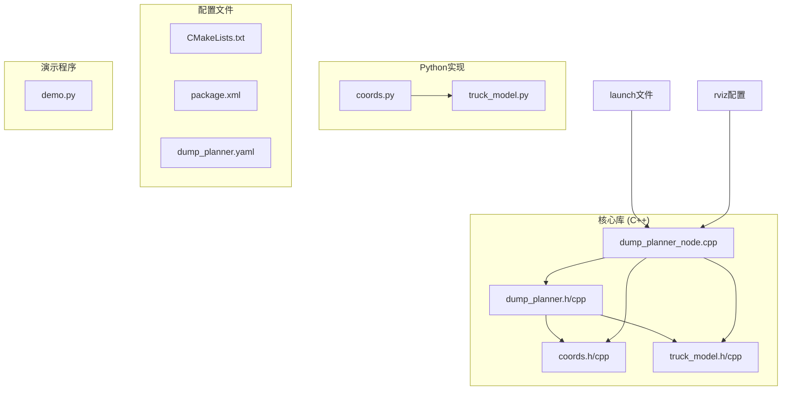
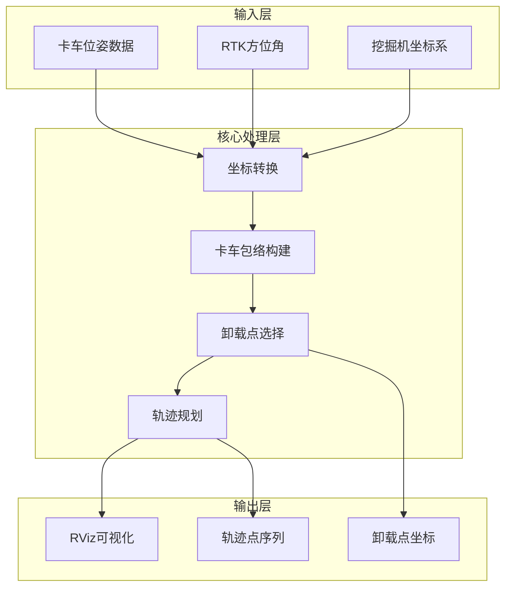
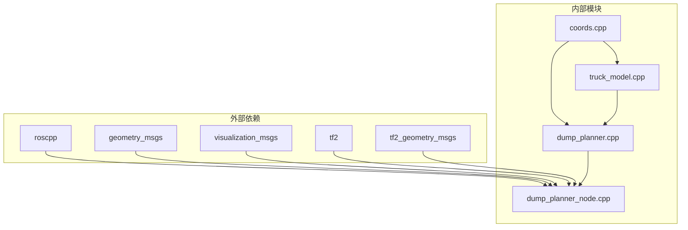

# API参考文档

<cite>
**本文档引用的文件**
- [dump_planner.h](file://src/truck_dump_planner/include/truck_dump_planner/dump_planner.h)
- [coords.h](file://src/truck_dump_planner/include/truck_dump_planner/coords.h)
- [truck_model.h](file://src/truck_dump_planner/include/truck_dump_planner/truck_model.h)
- [dump_planner.cpp](file://src/truck_dump_planner/src/dump_planner.cpp)
- [coords.cpp](file://src/truck_dump_planner/src/coords.cpp)
- [truck_model.cpp](file://src/truck_dump_planner/src/truck_model.cpp)
- [dump_planner_node.cpp](file://src/truck_dump_planner/src/dump_planner_node.cpp)
- [CMakeLists.txt](file://src/truck_dump_planner/CMakeLists.txt)
- [package.xml](file://src/truck_dump_planner/package.xml)
- [dump_planner.yaml](file://src/truck_dump_planner/config/dump_planner.yaml)
- [coords.py](file://src/truck_envelope/coords.py)
- [truck_model.py](file://src/truck_envelope/truck_model.py)
- [demo.py](file://src/demo.py)
</cite>

## 目录
1. [简介](#简介)
2. [项目结构](#项目结构)
3. [核心组件](#核心组件)
4. [架构概览](#架构概览)
5. [详细组件分析](#详细组件分析)
6. [依赖关系分析](#依赖关系分析)
7. [性能考虑](#性能考虑)
8. [故障排除指南](#故障排除指南)
9. [结论](#结论)
10. [附录](#附录)

## 简介

无人挖掘机轨迹规划系统是一个基于ROS的C++库，专门设计用于无人挖掘机的装车轨迹规划。该系统提供了完整的坐标转换工具、卡车模型接口和轨迹规划算法接口，能够自动选择最优卸载点并生成平滑的三段式轨迹。

系统的核心功能包括：
- 挖掘机坐标系与RTK方位角之间的双向转换
- 卡车几何建模与包络计算
- 卸载点候选生成与评分
- 铲斗轨迹规划与可视化

## 项目结构



**图表来源**
- [CMakeLists.txt:1-52](file://src/truck_dump_planner/CMakeLists.txt#L1-L52)
- [package.xml:1-20](file://src/truck_dump_planner/package.xml#L1-L20)

**章节来源**
- [CMakeLists.txt:1-52](file://src/truck_dump_planner/CMakeLists.txt#L1-L52)
- [package.xml:1-20](file://src/truck_dump_planner/package.xml#L1-L20)

## 核心组件

### 坐标转换模块

坐标转换模块提供了挖掘机坐标系与RTK方位角之间的双向转换功能，支持不同的坐标轴约定。

### 卡车模型模块

卡车模型模块负责构建卡车在挖掘机坐标系下的完整包络，包括车体和货箱的几何信息。

### 轨迹规划模块

轨迹规划模块实现了卸载点的选择算法和铲斗轨迹规划功能，提供平滑的三段式运动轨迹。

**章节来源**
- [coords.h:1-37](file://src/truck_dump_planner/include/truck_dump_planner/coords.h#L1-L37)
- [truck_model.h:1-60](file://src/truck_dump_planner/include/truck_dump_planner/truck_model.h#L1-L60)
- [dump_planner.h:1-66](file://src/truck_dump_planner/include/truck_dump_planner/dump_planner.h#L1-L66)

## 架构概览



**图表来源**
- [dump_planner_node.cpp:99-136](file://src/truck_dump_planner/src/dump_planner_node.cpp#L99-L136)
- [dump_planner.cpp:7-75](file://src/truck_dump_planner/src/dump_planner.cpp#L7-L75)

## 详细组件分析

### 坐标转换接口

#### 角度常量

系统提供了标准的角度转换常量：
- `kDeg2Rad`: 度到弧度转换系数
- `kRad2Deg`: 弧度到度转换系数

#### 角度归一化函数

```cpp
double Wrap360(double deg);
```
- **功能**: 将角度归一化到[0, 360)范围
- **参数**: 
  - `deg`: 输入角度（度）
- **返回值**: 归一化后的角度（度）

#### 航向角转换函数

```cpp
double RtkBearingToExcavatorHeading(double rtk_bearing_deg);
double ExcavatorHeadingToRtkBearing(double heading_deg);
```

**章节来源**
- [coords.h:6-18](file://src/truck_dump_planner/include/truck_dump_planner/coords.h#L6-L18)
- [coords.cpp:6-16](file://src/truck_dump_planner/src/coords.cpp#L6-L16)

### 坐标轴约定枚举

```cpp
enum class AxisConvention {
    kEastNorth = 0,  // x=东, y=北 (ENU式，默认)
    kNorthWest = 1,  // x=北, y=西
};
```

#### 方向向量转换

```cpp
void HeadingToUnitVector(double heading_deg, AxisConvention conv, double& dx, double& dy);
void RightUnitVector(double dx, double dy, double& rx, double& ry);
```

**章节来源**
- [coords.h:20-32](file://src/truck_dump_planner/include/truck_dump_planner/coords.h#L20-L32)
- [coords.cpp:18-49](file://src/truck_dump_planner/src/coords.cpp#L18-L49)

### 卡车几何模型

#### 基础数据结构

```cpp
struct Vec2 {
    double x = 0.0;
    double y = 0.0;
};

struct Vec3 {
    double x = 0.0;
    double y = 0.0;
    double z = 0.0;
};
```

#### 卡车参数结构

```cpp
struct TruckParams {
    double length = 8.5;            // 卡车总长（米）
    double width = 3.0;             // 卡车总宽（米）
    double ref_offset = 0.0;        // 参考点相对几何中心的纵向偏移
    double box_length = 5.0;        // 货箱长（米）
    double box_width = 2.6;         // 货箱宽（米）
    double box_center_offset = -1.0;// 货箱中心相对参考点的纵向偏移
    double box_height = 1.8;        // 货箱侧壁高度（米）
};
```

#### 卡车包络结构

```cpp
struct TruckEnvelope {
    Vec2 center;                    // 卡车参考点（挖掘机系）
    double z = 0.0;                 // 卡车地面高度
    double heading_beta = 0.0;      // 挖掘机系航向 β（度）
    double heading_rtk = 0.0;       // RTK方位角 α（度，记录用）
    std::array<Vec2, 4> body_corners;  // 车体四角: 前左/后左/后右/前右
    std::array<Vec2, 4> box_corners;   // 货箱四角: 前左/后左/后右/前右
    Vec2 box_center;                // 货箱中心
    double box_top_z = 0.0;         // 货箱顶面高度
    Vec2 forward_dir;               // 车头方向单位向量
    Vec2 right_dir;                 // 右侧方向单位向量
};
```

#### 包络构建函数

```cpp
TruckEnvelope BuildTruckEnvelope(double truck_x, double truck_y, double truck_z,
                                double rtk_bearing_deg,
                                const TruckParams& params,
                                AxisConvention conv);
```

**章节来源**
- [truck_model.h:10-44](file://src/truck_dump_planner/include/truck_dump_planner/truck_model.h#L10-L44)
- [truck_model.cpp:22-46](file://src/truck_dump_planner/src/truck_model.cpp#L22-L46)

### 卸载点选择算法

#### 卸载点数据结构

```cpp
struct DumpPoint {
    double x = 0.0;
    double y = 0.0;
    double z = 0.0;       // 卸载高度（货箱顶面 + 间隙）
    bool feasible = true;
    double score = 0.0;   // 越大越优
    std::string reason;
};
```

#### 挖掘机工作范围限制

```cpp
struct ExcavatorKinLimits {
    double reach_min = 5.0;        // 最小卸载半径
    double reach_max = 12.0;       // 最大卸载半径
    double dump_height_max = 7.5;  // 最大卸载高度
    double dump_height_min = 1.0;  // 最小卸载高度
    double dump_clearance = 0.8;   // 铲斗底门距货箱顶面间隙
};
```

#### 候选点生成函数

```cpp
std::vector<DumpPoint> SelectDumpPoint(const TruckEnvelope& env,
                                      const TruckParams& params,
                                      const ExcavatorKinLimits& limits,
                                      const Vec2& excavator_xy,
                                      int n_samples = 9);
```

#### 最优卸载点选择

```cpp
bool BestDumpPoint(const TruckEnvelope& env, const TruckParams& params,
                  const ExcavatorKinLimits& limits, const Vec2& excavator_xy,
                  DumpPoint& out);
```

**章节来源**
- [dump_planner.h:11-27](file://src/truck_dump_planner/include/truck_dump_planner/dump_planner.h#L11-L27)
- [dump_planner.cpp:7-75](file://src/truck_dump_planner/src/dump_planner.cpp#L7-L75)

### 轨迹规划算法

#### 轨迹点数据结构

```cpp
struct TrajectoryPoint {
    double x = 0.0;
    double y = 0.0;
    double z = 0.0;
    std::string phase;    // lift / swing / lower / dump
};

struct DumpTrajectory {
    std::vector<TrajectoryPoint> points;
    DumpPoint dump_point;
};
```

#### 卸载轨迹规划

```cpp
DumpTrajectory PlanDumpTrajectory(const Vec3& bucket_xyz,
                                 const DumpPoint& dump_point,
                                 double safe_height, int n_steps = 40);
```

**章节来源**
- [dump_planner.h:29-41](file://src/truck_dump_planner/include/truck_dump_planner/dump_planner.h#L29-L41)
- [dump_planner.cpp:82-117](file://src/truck_dump_planner/src/dump_planner.cpp#L82-L117)

### ROS节点接口

#### DumpPlannerNode类

```cpp
class DumpPlannerNode {
public:
    DumpPlannerNode(ros::NodeHandle& nh, ros::NodeHandle& pnh);
    
private:
    void LoadParams();
    double QuaternionToRtkBearing(const geometry_msgs::Quaternion& o) const;
    void PoseCallback(const geometry_msgs::PoseStamped::ConstPtr& msg);
    void PublishMarkers(const TruckEnvelope& env, const DumpPoint* best,
                       const DumpTrajectory* traj, const ros::Time& stamp);
    
    // ... 私有成员变量
};
```

#### ROS主题接口

- **订阅**: `/truck_pose` (geometry_msgs/PoseStamped)
- **发布**: `/truck_envelope_markers` (visualization_msgs/MarkerArray)
- **发布**: `/dump_point` (geometry_msgs/PointStamped)

**章节来源**
- [dump_planner_node.cpp:25-331](file://src/truck_dump_planner/src/dump_planner_node.cpp#L25-L331)

## 依赖关系分析



**图表来源**
- [CMakeLists.txt:11-17](file://src/truck_dump_planner/CMakeLists.txt#L11-L17)
- [CMakeLists.txt:29-39](file://src/truck_dump_planner/CMakeLists.txt#L29-L39)

**章节来源**
- [CMakeLists.txt:11-22](file://src/truck_dump_planner/CMakeLists.txt#L11-L22)

## 性能考虑

### 时间复杂度分析

1. **卸载点选择算法**: O(n_samples × log n_samples)
   - 主要瓶颈在于排序操作
   - 可通过减少采样点数量优化

2. **轨迹规划算法**: O(n_steps)
   - 线性时间复杂度，性能稳定
   - 可通过调整步数平衡精度与性能

3. **包络构建**: O(1)
   - 基于几何公式的常数时间复杂度

### 内存使用

- **候选点存储**: O(n_samples)
- **轨迹点存储**: O(n_steps)
- **包络计算**: O(1)

### 优化建议

1. **参数调优**
   - `n_samples`: 控制候选点数量，建议在5-15之间
   - `n_steps`: 控制轨迹离散化程度，建议在30-60之间
   - `safe_height`: 确保高于所有障碍物

2. **算法优化**
   - 使用更高效的几何判断算法
   - 实现缓存机制避免重复计算

## 故障排除指南

### 常见问题及解决方案

#### 1. 无可行卸载点

**症状**: 系统输出"no feasible dump point"

**可能原因**:
- 卡车距离挖掘机过远或过近
- 卡车位置超出挖掘机工作范围
- 货箱高度设置不当

**解决方法**:
- 检查`reach_min`和`reach_max`参数
- 验证`dump_height_min`和`dump_height_max`设置
- 确认卡车位置坐标正确

#### 2. 轨迹规划失败

**症状**: 轨迹点为空或异常

**可能原因**:
- `safe_height`设置过低
- 起点和终点坐标重叠
- 参数配置错误

**解决方法**:
- 提高`safe_height`值
- 检查`bucket_xyz`参数
- 验证`n_steps`参数合理性

#### 3. 坐标系转换错误

**症状**: 包络方向错误或位置偏差

**可能原因**:
- `axis_convention`设置错误
- `bearing_convention`配置不当
- RTK方位角定义混淆

**解决方法**:
- 确认坐标轴约定设置
- 检查RTK方位角转换逻辑
- 验证航向角定义一致性

**章节来源**
- [dump_planner_node.cpp:127-135](file://src/truck_dump_planner/src/dump_planner_node.cpp#L127-L135)

## 结论

无人挖掘机轨迹规划系统提供了完整的C++库接口，具有以下特点：

1. **模块化设计**: 坐标转换、卡车建模、轨迹规划功能清晰分离
2. **ROS集成**: 完整的ROS节点实现，支持实时可视化
3. **参数化配置**: 丰富的参数配置选项，适应不同应用场景
4. **错误处理**: 完善的错误检测和日志输出机制

该系统适用于各种无人挖掘机应用场景，能够提供可靠的轨迹规划服务。

## 附录

### 参数配置说明

#### 卡车几何参数
- `length`: 卡车总长（默认8.5米）
- `width`: 卡车总宽（默认3.0米）
- `ref_offset`: 参考点相对几何中心偏移（默认0.0米）
- `box_length`: 货箱长度（默认5.0米）
- `box_width`: 货箱宽度（默认2.6米）
- `box_center_offset`: 货箱中心相对参考点偏移（默认-1.0米）
- `box_height`: 货箱侧壁高度（默认1.8米）

#### 挖掘机工作范围
- `x`, `y`: 挖掘机回转中心坐标（默认0.0米）
- `reach_min`: 最小卸载半径（默认5.0米）
- `reach_max`: 最大卸载半径（默认12.0米）
- `dump_height_max`: 最大卸载高度（默认7.5米）
- `dump_height_min`: 最小卸载高度（默认1.0米）
- `dump_clearance`: 卸载间隙（默认0.8米）

#### 轨迹规划参数
- `safe_height`: 安全高度（默认6.0米）
- `n_steps`: 轨迹离散点数（默认40）
- `n_samples`: 卸载点采样数（默认9）

**章节来源**
- [dump_planner.yaml:4-43](file://src/truck_dump_planner/config/dump_planner.yaml#L4-L43)

### 使用示例

#### 基本使用流程

1. **初始化参数**
```cpp
TruckParams params;
ExcavatorKinLimits limits;
Vec2 excavator_xy = {0.0, 0.0};
```

2. **构建卡车包络**
```cpp
TruckEnvelope env = BuildTruckEnvelope(x, y, z, rtk_bearing, params, convention);
```

3. **选择最优卸载点**
```cpp
DumpPoint best;
if (BestDumpPoint(env, params, limits, excavator_xy, best)) {
    // 卸载点可用
}
```

4. **规划轨迹**
```cpp
DumpTrajectory traj = PlanDumpTrajectory(bucket_xyz, best, safe_height, n_steps);
```

#### Python版本使用

系统同时提供了Python实现，便于快速验证和演示：

```python
from truck_envelope import build_truck_envelope, select_dump_point, plan_dump_trajectory

# 构建包络
env = build_truck_envelope(x, y, z, rtk_bearing, params)

# 选择卸载点
cands = select_dump_point(env, params, limits, excavator_xy, n_samples=9)

# 规划轨迹
traj = plan_dump_trajectory(bucket_xyz, best, safe_height=6.0, n_steps=40)
```

**章节来源**
- [demo.py:93-149](file://src/demo.py#L93-L149)