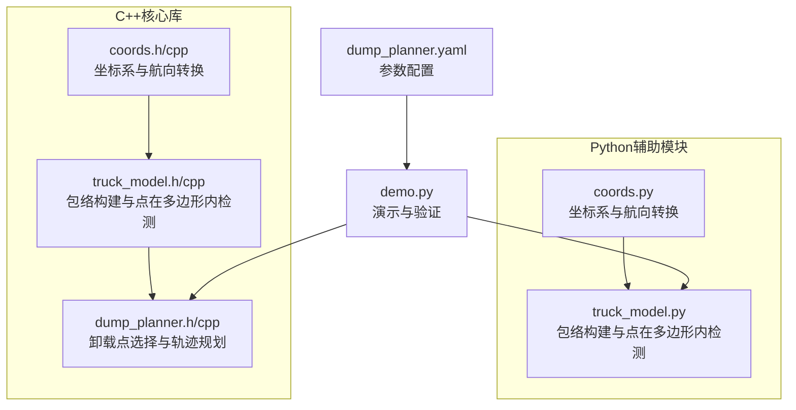
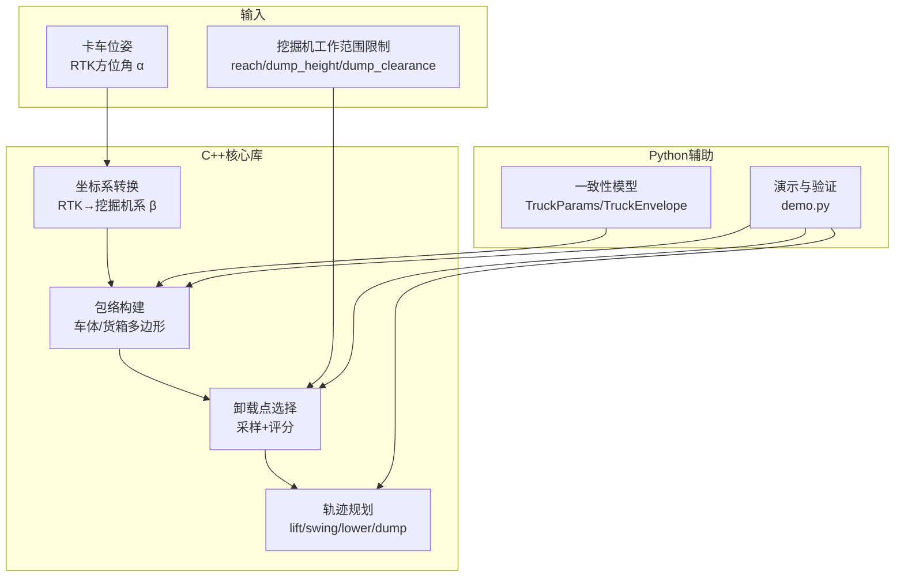
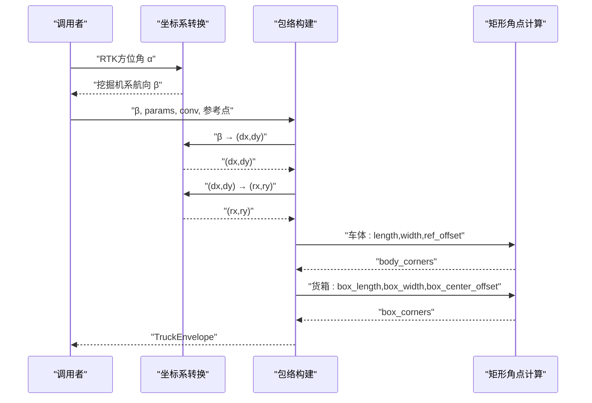
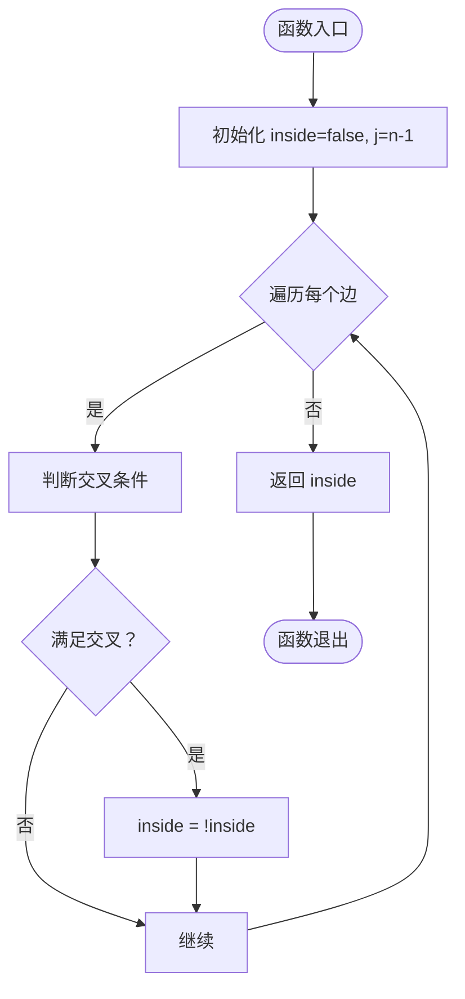
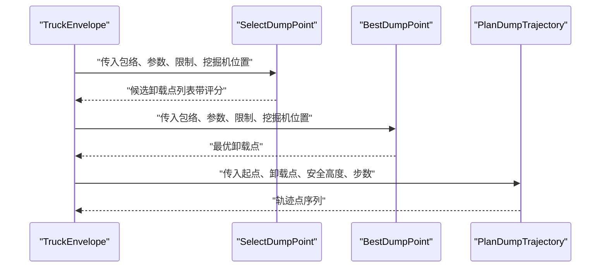
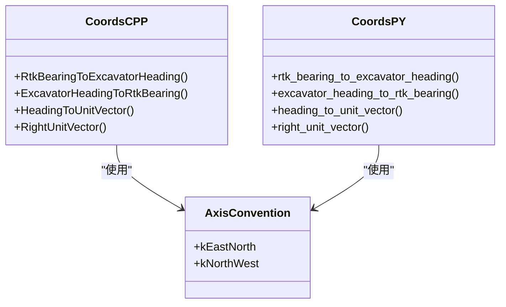
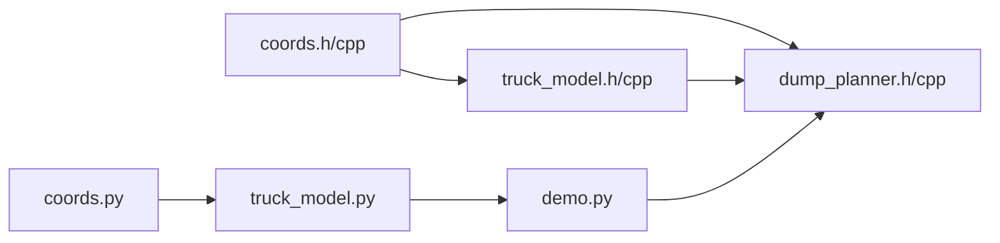

# 卡车模型API

<cite>
**本文引用的文件**
- [truck_model.h](file://src/truck_dump_planner/include/truck_dump_planner/truck_model.h)
- [truck_model.cpp](file://src/truck_dump_planner/src/truck_model.cpp)
- [coords.h](file://src/truck_dump_planner/include/truck_dump_planner/coords.h)
- [coords.cpp](file://src/truck_dump_planner/src/coords.cpp)
- [dump_planner.h](file://src/truck_dump_planner/include/truck_dump_planner/dump_planner.h)
- [dump_planner.cpp](file://src/truck_dump_planner/src/dump_planner.cpp)
- [truck_model.py](file://src/truck_envelope/truck_model.py)
- [coords.py](file://src/truck_envelope/coords.py)
- [dump_planner.yaml](file://src/truck_dump_planner/config/dump_planner.yaml)
- [demo.py](file://src/demo.py)
- [package.xml](file://src/truck_dump_planner/package.xml)
- [CMakeLists.txt](file://src/truck_dump_planner/CMakeLists.txt)
</cite>

## 目录
1. [简介](#简介)
2. [项目结构](#项目结构)
3. [核心组件](#核心组件)
4. [架构概览](#架构概览)
5. [详细组件分析](#详细组件分析)
6. [依赖关系分析](#依赖关系分析)
7. [性能考量](#性能考量)
8. [故障排查指南](#故障排查指南)
9. [结论](#结论)
10. [附录](#附录)

## 简介
本文件为卡车模型API的完整参考文档，面向轨迹规划系统与无人挖掘机装车应用，重点覆盖：
- 几何参数定义与坐标系约定
- 包络构建函数与多边形生成流程
- 包络检测算法（射线法）实现细节
- 与轨迹规划系统的接口规范
- 参数调优指南与几何建模最佳实践

## 项目结构
仓库包含两个主要模块：
- C++核心库：提供坐标系转换、包络构建、卸载点选择与轨迹规划功能，可独立于ROS使用。
- Python辅助模块：提供与C++一致的几何模型与坐标系工具，便于演示与可视化。

图表来源
- [coords.h:1-37](file://src/truck_dump_planner/include/truck_dump_planner/coords.h#L1-L37)
- [coords.cpp:1-52](file://src/truck_dump_planner/src/coords.cpp#L1-L52)
- [truck_model.h:1-60](file://src/truck_dump_planner/include/truck_dump_planner/truck_model.h#L1-L60)
- [truck_model.cpp:1-66](file://src/truck_dump_planner/src/truck_model.cpp#L1-L66)
- [dump_planner.h:1-66](file://src/truck_dump_planner/include/truck_dump_planner/dump_planner.h#L1-L66)
- [dump_planner.cpp:1-120](file://src/truck_dump_planner/src/dump_planner.cpp#L1-L120)
- [coords.py:1-200](file://src/truck_envelope/coords.py#L1-L200)
- [truck_model.py:1-200](file://src/truck_envelope/truck_model.py#L1-L200)
- [dump_planner.yaml:1-43](file://src/truck_dump_planner/config/dump_planner.yaml#L1-L43)
- [demo.py:1-249](file://src/demo.py#L1-L249)

章节来源
- [package.xml:1-20](file://src/truck_dump_planner/package.xml#L1-L20)
- [CMakeLists.txt:1-52](file://src/truck_dump_planner/CMakeLists.txt#L1-L52)

## 核心组件
- 几何参数与数据结构
  - TruckParams：定义卡车总长、总宽、参考点偏移、货箱长宽高及货箱中心相对偏移等关键尺寸。
  - TruckEnvelope：封装包络多边形、航向角、方向向量、货箱中心与顶面高度等信息。
- 包络构建
  - BuildTruckEnvelope：基于RTK方位角与坐标系约定，计算车体与货箱四角，生成完整包络。
- 包络检测
  - PointInPolygon：使用射线法判断点是否在多边形内部，用于碰撞/合法性检查。
- 轨迹规划接口
  - SelectDumpPoint/BestDumpPoint：在货箱顶面生成候选卸载点并评分筛选。
  - PlanDumpTrajectory：规划三段式平滑轨迹（抬升-回转-下降）。

章节来源
- [truck_model.h:21-55](file://src/truck_dump_planner/include/truck_dump_planner/truck_model.h#L21-L55)
- [dump_planner.h:10-61](file://src/truck_dump_planner/include/truck_dump_planner/dump_planner.h#L10-L61)

## 架构概览
系统采用双语言实现，C++核心库可独立运行，Python模块提供一致性接口与演示能力。两者共享相同的几何模型与坐标系约定。

图表来源
- [coords.h:13-32](file://src/truck_dump_planner/include/truck_dump_planner/coords.h#L13-L32)
- [coords.py:39-199](file://src/truck_envelope/coords.py#L39-L199)
- [truck_model.h:46-55](file://src/truck_dump_planner/include/truck_dump_planner/truck_model.h#L46-L55)
- [dump_planner.h:42-61](file://src/truck_dump_planner/include/truck_dump_planner/dump_planner.h#L42-L61)
- [demo.py:93-149](file://src/demo.py#L93-L149)

## 详细组件分析

### 几何参数与数据结构
- TruckParams字段说明
  - length：卡车总长（单位：米），沿车头-车尾方向。
  - width：卡车总宽（单位：米），沿车体右侧方向。
  - ref_offset：车体参考点相对几何中心的纵向偏移（单位：米），正向表示参考点偏前。
  - box_length：货箱长度（单位：米），沿纵向。
  - box_width：货箱宽度（单位：米），沿横向。
  - box_center_offset：货箱中心相对车体参考点的纵向偏移（单位：米），通常为负值表示偏车尾。
  - box_height：货箱侧壁高度（单位：米），用于卸载高度估算。
- TruckEnvelope字段说明
  - center：卡车参考点在挖掘机坐标系下的二维坐标。
  - z：卡车地面高度。
  - heading_beta：挖掘机系航向角（度）。
  - heading_rtk：RTK方位角（度）。
  - body_corners：车体四角（逆时针顺序：前左、后左、后右、前右）。
  - box_corners：货箱四角（逆时针顺序：前左、后左、后右、前右）。
  - box_center：货箱中心在挖掘机坐标系下的二维坐标。
  - box_top_z：货箱顶面高度。
  - forward_dir/right_dir：车头/右侧方向单位向量。

章节来源
- [truck_model.h:21-44](file://src/truck_dump_planner/include/truck_dump_planner/truck_model.h#L21-L44)

### 包络构建函数
- 输入
  - truck_x/y/z：卡车参考点在挖掘机坐标系下的三维坐标。
  - rtk_bearing_deg：RTK方位角（度，北0顺时针）。
  - params：TruckParams实例。
  - conv：AxisConvention枚举，指定xy轴地理朝向约定。
- 流程
  1) RTK方位角→挖掘机系航向角β。
  2) β→车头方向单位向量(dx, dy)，右侧单位向量(rx, ry)。
  3) 以参考点为中心，按车体尺寸与ref_offset计算车体四角。
  4) 以参考点为中心，按货箱尺寸与box_center_offset计算货箱四角。
  5) 计算货箱中心与顶面高度。
- 输出
  - TruckEnvelope：包含上述所有几何信息。

图表来源
- [coords.h:13-32](file://src/truck_dump_planner/include/truck_dump_planner/coords.h#L13-L32)
- [coords.cpp:18-49](file://src/truck_dump_planner/src/coords.cpp#L18-L49)
- [truck_model.cpp:22-46](file://src/truck_dump_planner/src/truck_model.cpp#L22-L46)

章节来源
- [truck_model.cpp:22-46](file://src/truck_dump_planner/src/truck_model.cpp#L22-L46)

### 包络检测算法（射线法）
- 功能：判断二维点是否在多边形内部，用于碰撞检测与卸载点合法性检查。
- 实现要点
  - 使用水平向右射线，统计与多边形边界的交点数量。
  - 当交点奇偶性改变时，点在多边形内部。
  - 为避免除零，使用极小值进行分母稳定处理。
- 时间复杂度：O(n)，n为多边形顶点数。
- 空间复杂度：O(1)。

图表来源
- [truck_model.cpp:48-63](file://src/truck_dump_planner/src/truck_model.cpp#L48-L63)

章节来源
- [truck_model.cpp:48-63](file://src/truck_dump_planner/src/truck_model.cpp#L48-L63)

### 与轨迹规划系统的接口规范
- 卸载点选择
  - SelectDumpPoint：在货箱顶面沿纵向均匀采样，计算可达性与评分，按分数降序返回候选。
  - BestDumpPoint：返回第一个可行卸载点。
- 轨迹规划
  - PlanDumpTrajectory：将铲斗从起点平滑提升至安全高度，XY平面回转到卸载点，再平滑下降至卸载高度，最后精确收敛到卸载点。
  - 阶段划分：lift → swing → lower → dump，每段采用半余弦平滑，避免速度突变。
- 关键参数
  - ExcavatorKinLimits：最小/最大卸载半径、最大/最小卸载高度、铲斗底门与货箱顶面间隙。
  - DumpTrajectory：包含轨迹点序列与选定卸载点。

图表来源
- [dump_planner.h:42-61](file://src/truck_dump_planner/include/truck_dump_planner/dump_planner.h#L42-L61)
- [dump_planner.cpp:7-75](file://src/truck_dump_planner/src/dump_planner.cpp#L7-L75)
- [dump_planner.cpp:82-117](file://src/truck_dump_planner/src/dump_planner.cpp#L82-L117)

章节来源
- [dump_planner.h:19-61](file://src/truck_dump_planner/include/truck_dump_planner/dump_planner.h#L19-L61)
- [dump_planner.cpp:7-117](file://src/truck_dump_planner/src/dump_planner.cpp#L7-L117)

### 坐标系约定与转换
- 两套航向角定义
  - 挖掘机系航向角β：正北=180°，正东=90°，正南=0°，正西=270°，逆时针增大。
  - RTK方位角α：正北=0°，正东=90°，正南=180°，正西=270°，顺时针增大。
  - 转换关系：β = (180 - α) mod 360°。
- xy轴地理朝向约定
  - AxisConvention.kEastNorth：x=东，y=北（ENU式，默认）。
  - AxisConvention.kNorthWest：x=北，y=西。
- 方向向量分解
  - 将β分解为(dx, dy)，右侧向量为顺时针旋转90°得到。

图表来源
- [coords.h:21-32](file://src/truck_dump_planner/include/truck_dump_planner/coords.h#L21-L32)
- [coords.cpp:18-49](file://src/truck_dump_planner/src/coords.cpp#L18-L49)
- [coords.py:79-199](file://src/truck_envelope/coords.py#L79-L199)

章节来源
- [coords.h:13-32](file://src/truck_dump_planner/include/truck_dump_planner/coords.h#L13-L32)
- [coords.cpp:10-49](file://src/truck_dump_planner/src/coords.cpp#L10-L49)
- [coords.py:39-199](file://src/truck_envelope/coords.py#L39-L199)

## 依赖关系分析
- 内部依赖
  - coords模块被truck_model与dump_planner共同依赖，确保坐标系转换的一致性。
  - dump_planner依赖truck_model提供的包络与检测能力。
- 外部依赖
  - C++核心库链接ROS相关库（geometry_msgs、visualization_msgs、tf2等）。
  - Python模块依赖matplotlib（可选）用于演示绘图。

图表来源
- [coords.h:1-37](file://src/truck_dump_planner/include/truck_dump_planner/coords.h#L1-L37)
- [coords.cpp:1-52](file://src/truck_dump_planner/src/coords.cpp#L1-L52)
- [truck_model.h:1-60](file://src/truck_dump_planner/include/truck_dump_planner/truck_model.h#L1-L60)
- [dump_planner.h:1-66](file://src/truck_dump_planner/include/truck_dump_planner/dump_planner.h#L1-L66)
- [truck_model.py:1-200](file://src/truck_envelope/truck_model.py#L1-L200)
- [coords.py:1-200](file://src/truck_envelope/coords.py#L1-L200)
- [demo.py:1-249](file://src/demo.py#L1-L249)

章节来源
- [CMakeLists.txt:11-22](file://src/truck_dump_planner/CMakeLists.txt#L11-L22)

## 性能考量
- 包络构建
  - 复杂度：O(1)，仅涉及少量三角函数与向量运算。
  - 优化建议：缓存常用三角函数值，减少重复计算。
- 卸载点选择
  - 复杂度：O(n)，n为采样点数；排序O(n log n)。
  - 优化建议：根据实际场景调整采样密度，平衡精度与性能。
- 轨迹规划
  - 复杂度：O(n_steps)，半余弦平滑保证连续性，避免速度突变。
  - 优化建议：合理分配各阶段步数比例，确保运动平滑与效率。

## 故障排查指南
- 常见问题
  - 包络方向错误：检查RTK方位角与β转换是否正确，确认AxisConvention设置。
  - 卸载点不可行：检查可达性约束（半径、高度、间隙），调整参数或位置。
  - 点在多边形检测异常：确认多边形顶点顺序与射线法边界条件。
- 调试方法
  - 使用demo.py进行端到端验证，输出ASCII俯视图与可选PNG图。
  - 逐步打印包络四角、方向向量与卸载点评分，定位问题环节。

章节来源
- [demo.py:50-206](file://src/demo.py#L50-L206)
- [dump_planner.cpp:7-75](file://src/truck_dump_planner/src/dump_planner.cpp#L7-L75)

## 结论
本API提供了从几何建模到轨迹规划的完整链路，支持灵活的坐标系约定与参数配置，适用于无人挖掘机装车场景。通过清晰的数据结构、稳定的算法实现与完善的接口规范，能够高效支撑轨迹规划与可视化需求。

## 附录

### 参数调优指南
- 卡车几何参数
  - length/width：根据实车测量校准，确保包络与实际车辆匹配。
  - ref_offset：当RTK天线不在几何中心时，通过该参数修正参考点位置。
  - box_length/box_width/box_height：与装载设备匹配，确保卸载高度与空间充足。
  - box_center_offset：根据装载平台布局调整，优先靠近车尾以提高稳定性。
- 挖掘机工作范围
  - reach_min/reach_max：结合臂展与作业半径设定，避免过近或过远。
  - dump_height_min/max：考虑铲斗底门与货箱顶面间隙，防止碰撞。
  - dump_clearance：预留安全间隙，避免物料飞溅或设备损伤。
- 轨迹规划
  - safe_height：高于驾驶室与货箱顶面，确保回转安全。
  - n_steps：根据实时性与平滑度需求调整，平衡性能与质量。
  - n_samples：沿货箱纵向采样密度，影响卸载点选择的精细度。

章节来源
- [dump_planner.yaml:4-43](file://src/truck_dump_planner/config/dump_planner.yaml#L4-L43)
- [dump_planner.cpp:77-117](file://src/truck_dump_planner/src/dump_planner.cpp#L77-L117)

### 几何建模最佳实践
- 明确参考点与坐标系
  - 统一使用“车体参考点”，并标注其与几何中心的关系。
  - 明确AxisConvention，避免因xy轴朝向差异导致的方向向量错误。
- 参数命名与单位
  - 字段命名遵循“方向+维度”原则（如length/width/box_length/box_width）。
  - 统一使用米制单位，避免混用。
- 包络生成与验证
  - 生成包络后进行可视化验证，检查四角顺序与方向一致性。
  - 使用射线法对关键点进行合法性检查，确保碰撞规避有效。
- 接口设计
  - 将几何参数与控制参数分离，便于独立调试与替换。
  - 提供配置文件与演示脚本，降低集成成本。