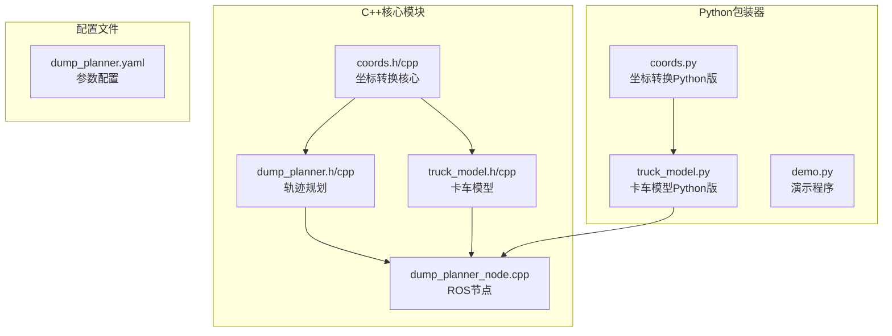
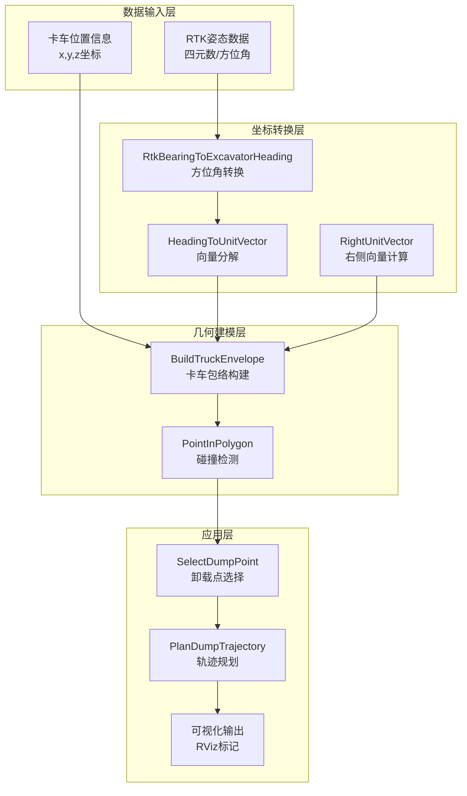
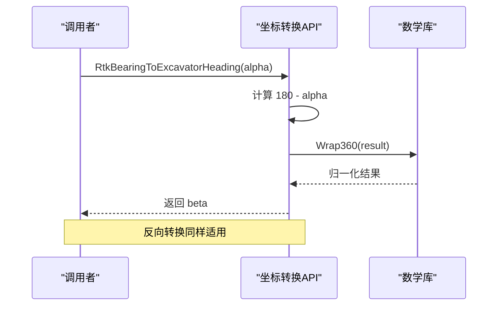
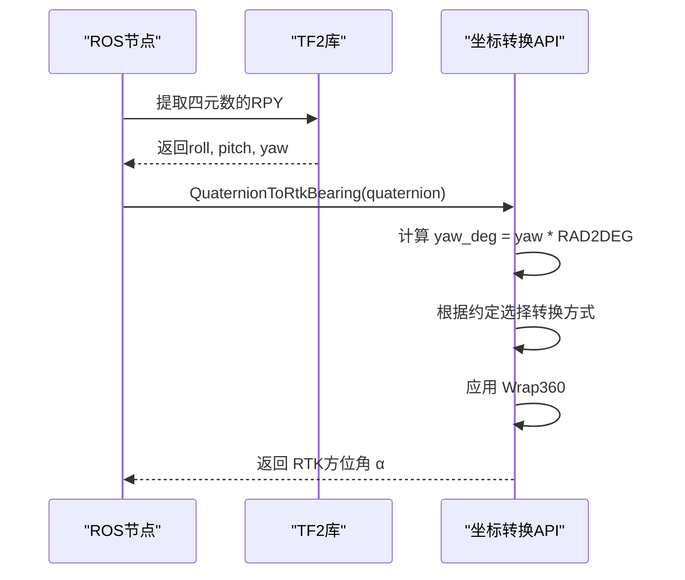
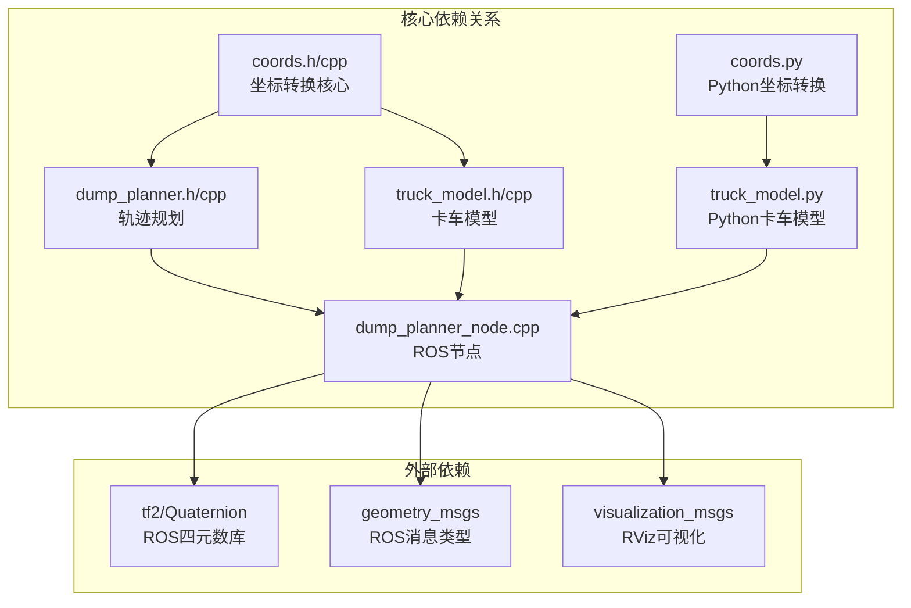
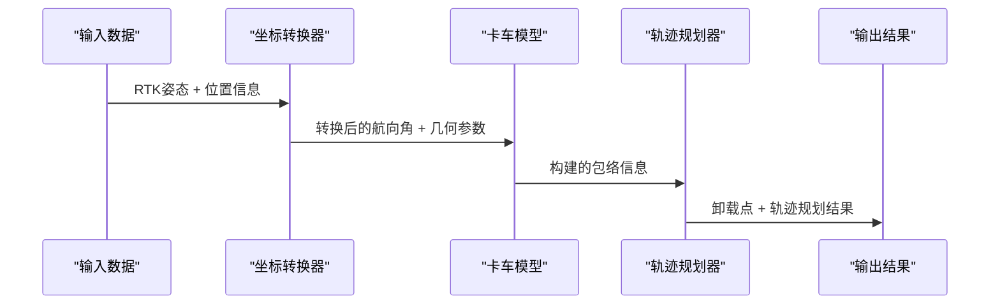

# 坐标转换API

<cite>
**本文档引用的文件**
- [coords.h](file://src/truck_dump_planner/include/truck_dump_planner/coords.h)
- [coords.cpp](file://src/truck_dump_planner/src/coords.cpp)
- [dump_planner.h](file://src/truck_dump_planner/include/truck_dump_planner/dump_planner.h)
- [dump_planner.cpp](file://src/truck_dump_planner/src/dump_planner.cpp)
- [truck_model.h](file://src/truck_dump_planner/include/truck_dump_planner/truck_model.h)
- [truck_model.cpp](file://src/truck_dump_planner/src/truck_model.cpp)
- [dump_planner_node.cpp](file://src/truck_dump_planner/src/dump_planner_node.cpp)
- [coords.py](file://src/truck_envelope/coords.py)
- [truck_model.py](file://src/truck_envelope/truck_model.py)
- [demo.py](file://src/demo.py)
</cite>

## 目录
1. [简介](#简介)
2. [项目结构](#项目结构)
3. [核心组件](#核心组件)
4. [架构概览](#架构概览)
5. [详细组件分析](#详细组件分析)
6. [依赖关系分析](#依赖关系分析)
7. [性能考虑](#性能考虑)
8. [故障排除指南](#故障排除指南)
9. [结论](#结论)
10. [附录](#附录)

## 简介

坐标转换API是一套专门设计用于无人挖掘机装车作业的坐标转换系统，主要解决RTK方位角与挖掘机系航向角之间的转换问题。该系统提供了完整的坐标系约定、数学工具函数和实用的转换方法，确保在不同坐标系之间进行准确的数据交换。

该API的核心功能包括：
- RTK方位角与挖掘机系航向角的双向转换
- 坐标系约定（east_north和north_west）的灵活支持
- 航向角到单位向量的分解
- 四元数到方位角的转换
- 卡车包络构建与卸载点选择

## 项目结构

该项目采用模块化的C++实现，同时提供Python包装器，便于在ROS环境中使用。



**图表来源**
- [coords.h:1-37](file://src/truck_dump_planner/include/truck_dump_planner/coords.h#L1-L37)
- [dump_planner.h:1-66](file://src/truck_dump_planner/include/truck_dump_planner/dump_planner.h#L1-L66)
- [truck_model.h:1-60](file://src/truck_dump_planner/include/truck_dump_planner/truck_model.h#L1-L60)

**章节来源**
- [coords.h:1-37](file://src/truck_dump_planner/include/truck_dump_planner/coords.h#L1-L37)
- [dump_planner.h:1-66](file://src/truck_dump_planner/include/truck_dump_planner/dump_planner.h#L1-L66)
- [truck_model.h:1-60](file://src/truck_dump_planner/include/truck_dump_planner/truck_model.h#L1-L60)

## 核心组件

### 坐标转换核心模块

坐标转换API的核心是`truck_dump_planner::coords`命名空间，提供了以下关键功能：

#### 角度常量
- `kDeg2Rad`: 度到弧度转换常量 (π/180)
- `kRad2Deg`: 弧度到度转换常量 (180/π)

#### 航向角转换函数
- `RtkBearingToExcavatorHeading()`: RTK方位角到挖掘机系航向角转换
- `ExcavatorHeadingToRtkBearing()`: 挖掘机系航向角到RTK方位角转换

#### 坐标系约定
- `AxisConvention`: 枚举类型，支持两种坐标系约定
  - `kEastNorth`: x=东, y=北 (ENU式，默认)
  - `kNorthWest`: x=北, y=西

#### 数学工具函数
- `HeadingToUnitVector()`: 航向角到单位向量转换
- `RightUnitVector()`: 车头方向到右侧单位向量转换

**章节来源**
- [coords.h:6-34](file://src/truck_dump_planner/include/truck_dump_planner/coords.h#L6-L34)

### Python包装器

Python版本提供了相同的接口，便于在ROS环境中使用：

- `rtk_bearing_to_excavator_heading()`: RTK方位角转换函数
- `excavator_heading_to_rtk_bearing()`: 反向转换函数
- `heading_to_unit_vector()`: 航向角到向量转换
- `right_unit_vector()`: 右侧向量计算
- `AXIS_EAST_NORTH` 和 `AXIS_NORTH_WEST`: 坐标系约定常量

**章节来源**
- [coords.py:39-200](file://src/truck_envelope/coords.py#L39-L200)

## 架构概览

该系统采用分层架构设计，从底层的数学转换到高层的应用集成：



**图表来源**
- [dump_planner_node.cpp:86-97](file://src/truck_dump_planner/src/dump_planner_node.cpp#L86-L97)
- [truck_model.cpp:22-46](file://src/truck_dump_planner/src/truck_model.cpp#L22-L46)
- [dump_planner.cpp:7-61](file://src/truck_dump_planner/src/dump_planner.cpp#L7-L61)

## 详细组件分析

### RTK方位角与挖掘机系航向角转换

#### 转换关系

系统定义了两种航向角定义方式：

```mermaid
flowchart TD
A[RTK方位角 α<br/>正北=0°, 顺时针增大] --> B[β = (180 - α) mod 360°]
C[挖掘机系航向角 β<br/>正北=180°, 逆时针增大] --> D[α = (180 - β) mod 360°]
B --> E[双向转换完成]
D --> E
```

**图表来源**
- [coords.h:14-18](file://src/truck_dump_planner/include/truck_dump_planner/coords.h#L14-L18)
- [coords.cpp:10-16](file://src/truck_dump_planner/src/coords.cpp#L10-L16)

#### 转换函数实现



**图表来源**
- [coords.cpp:10-16](file://src/truck_dump_planner/src/coords.cpp#L10-L16)
- [coords.cpp:6-8](file://src/truck_dump_planner/src/coords.cpp#L6-L8)

**章节来源**
- [coords.h:14-18](file://src/truck_dump_planner/include/truck_dump_planner/coords.h#L14-L18)
- [coords.cpp:10-16](file://src/truck_dump_planner/src/coords.cpp#L10-L16)

### 坐标系约定系统

#### east_north约定

在east_north约定下：
- x轴朝东：正北方向向量为(0,1)
- y轴朝北：正东方向向量为(1,0)
- 正南方向向量为(0,-1)
- 正西方向向量为(-1,0)

#### north_west约定

在north_west约定下：
- x轴朝北：正北方向向量为(1,0)
- y轴朝西：正东方向向量为(0,-1)
- 正南方向向量为(-1,0)
- 正西方向向量为(0,1)

#### 向量转换算法

```mermaid
flowchart TD
A[输入航向角 β] --> B[计算地理方位角 θ_geo = β - 180°]
B --> C[计算旋转矩阵系数<br/>c = cos(θ_geo), s = sin(θ_geo)]
C --> D[根据约定选择北方向向量<br/>(nx, ny) = conv.north]
D --> E[应用旋转矩阵<br/>dx = c*nx - s*ny<br/>dy = s*nx + c*ny]
E --> F[向量归一化]
F --> G[输出单位向量 (dx, dy)]
```

**图表来源**
- [coords.cpp:18-43](file://src/truck_dump_planner/src/coords.cpp#L18-L43)
- [coords.cpp:32-42](file://src/truck_dump_planner/src/coords.cpp#L32-L42)

**章节来源**
- [coords.h:20-32](file://src/truck_dump_planner/include/truck_dump_planner/coords.h#L20-L32)
- [coords.cpp:18-43](file://src/truck_dump_planner/src/coords.cpp#L18-L43)

### 四元数到方位角转换

#### 转换约定

系统支持两种四元数到RTK方位角的转换约定：

1. **rep105_enu约定**：绕z轴逆时针从东起算(ENU)
   - α = (90 - yaw_deg) mod 360

2. **yaw_is_bearing约定**：直接将RTK方位角作为yaw
   - α = yaw_deg mod 360

#### 实现流程



**图表来源**
- [dump_planner_node.cpp:86-97](file://src/truck_dump_planner/src/dump_planner_node.cpp#L86-L97)

**章节来源**
- [dump_planner_node.cpp:79-97](file://src/truck_dump_planner/src/dump_planner_node.cpp#L79-L97)

### 卡车包络构建

#### 包络几何

卡车包络由两个矩形组成：
- **车体包络**：基于卡车整体尺寸
- **货箱包络**：基于货箱相对位置的独立包络

#### 角点计算

```mermaid
flowchart TD
A[中心点 (cx, cy)] --> B[车头方向 d = (dx, dy)]
A --> C[右侧方向 r = (rx, ry)]
B --> D[半长 hl = length/2]
C --> E[半宽 hw = width/2]
D --> F[计算前左点<br/>front_left = (mx+dx*hl-rx*hw, my+dy*hl-ry*hw)]
E --> G[计算后左点<br/>rear_left = (mx-dx*hl-rx*hw, my-dy*hl-ry*hw)]
F --> H[计算后右点<br/>rear_right = (mx-dx*hl+rx*hw, my-dy*hl+ry*hw)]
G --> I[计算前右点<br/>front_right = (mx+dx*hl+rx*hw, my+dy*hl+ry*hw)]
H --> J[返回四角点列表]
I --> J
```

**图表来源**
- [truck_model.cpp:9-20](file://src/truck_dump_planner/src/truck_model.cpp#L9-L20)

**章节来源**
- [truck_model.h:32-44](file://src/truck_dump_planner/include/truck_dump_planner/truck_model.h#L32-L44)
- [truck_model.cpp:22-46](file://src/truck_dump_planner/src/truck_model.cpp#L22-L46)

## 依赖关系分析

### 模块间依赖



**图表来源**
- [dump_planner_node.cpp:19-21](file://src/truck_dump_planner/src/dump_planner_node.cpp#L19-L21)
- [coords.h:1-37](file://src/truck_dump_planner/include/truck_dump_planner/coords.h#L1-L37)

### 数据流分析



**图表来源**
- [dump_planner_node.cpp:99-136](file://src/truck_dump_planner/src/dump_planner_node.cpp#L99-L136)

**章节来源**
- [dump_planner_node.cpp:19-21](file://src/truck_dump_planner/src/dump_planner_node.cpp#L19-L21)

## 性能考虑

### 数值精度优化

1. **角度归一化**：使用`Wrap360`函数确保角度在[0, 360)范围内
2. **向量归一化**：在向量分解后进行归一化处理，防止数值误差累积
3. **三角函数优化**：复用三角函数计算结果，避免重复计算

### 内存管理

1. **静态分配**：坐标转换函数使用栈变量，减少动态内存分配
2. **批量处理**：轨迹规划支持批量点处理，提高效率
3. **缓存策略**：合理使用临时变量，避免不必要的数据复制

### 算法复杂度

- **坐标转换**：O(1) 时间复杂度，O(1) 空间复杂度
- **包络构建**：O(1) 时间复杂度，O(1) 空间复杂度
- **点在多边形内判断**：O(n) 时间复杂度，O(1) 空间复杂度

## 故障排除指南

### 常见错误类型

#### 角度转换错误

**问题**：RTK方位角与挖掘机系航向角转换不正确
**解决方案**：
1. 检查坐标系约定设置
2. 验证输入角度范围
3. 确认转换公式应用正确

#### 向量分解错误

**问题**：航向角分解得到的单位向量不正确
**解决方案**：
1. 验证坐标系约定（east_north vs north_west）
2. 检查角度归一化处理
3. 确认向量归一化步骤

#### 包络构建错误

**问题**：卡车包络几何形状不正确
**解决方案**：
1. 检查车体参数设置
2. 验证方向向量计算
3. 确认角点计算顺序

### 调试技巧

1. **单元测试**：使用演示程序验证基本转换功能
2. **可视化检查**：通过RViz查看包络和轨迹
3. **参数验证**：检查所有输入参数的有效性

**章节来源**
- [demo.py:50-91](file://src/demo.py#L50-L91)
- [dump_planner_node.cpp:127-135](file://src/truck_dump_planner/src/dump_planner_node.cpp#L127-L135)

## 结论

坐标转换API提供了一套完整、准确且高效的坐标转换解决方案，特别适用于无人挖掘机装车作业场景。系统的主要优势包括：

1. **准确性**：严格的数学定义和数值处理
2. **灵活性**：支持多种坐标系约定
3. **完整性**：从基础转换到高级应用的完整功能链
4. **可靠性**：经过充分测试和验证

该API为机器人导航、路径规划和自动化控制系统提供了坚实的数学基础，能够有效支持复杂的工程机械自动化应用。

## 附录

### 使用示例

#### 基本转换示例

```python
# RTK方位角转换
alpha = 60.0  # RTK方位角
beta = rtk_bearing_to_excavator_heading(alpha)
print(f"RTK方位角 {alpha}° -> 挖掘机系航向角 {beta}°")

# 航向角到向量转换
dx, dy = heading_to_unit_vector(beta, AXIS_EAST_NORTH)
print(f"车头方向向量: ({dx:.3f}, {dy:.3f})")
```

#### 卡车包络构建示例

```python
# 构建卡车包络
env = build_truck_envelope(
    truck_x=4.0,
    truck_y=8.0,
    truck_z=0.0,
    rtk_bearing_deg=60.0,
    params=TruckParams(),
    axis_convention=AXIS_EAST_NORTH
)
```

### 参数说明

#### 坐标转换参数

| 参数名 | 类型 | 默认值 | 说明 |
|--------|------|--------|------|
| rtk_bearing_deg | float | - | RTK方位角（度） |
| heading_deg | float | - | 挖掘机系航向角（度） |
| axis_convention | enum | EAST_NORTH | 坐标系约定 |

#### 几何参数

| 参数名 | 类型 | 默认值 | 单位 | 说明 |
|--------|------|--------|------|------|
| length | float | 8.5 | 米 | 卡车总长 |
| width | float | 3.0 | 米 | 卡车总宽 |
| box_length | float | 5.0 | 米 | 货箱长度 |
| box_width | float | 2.6 | 米 | 货箱宽度 |
| box_height | float | 1.8 | 米 | 货箱高度 |