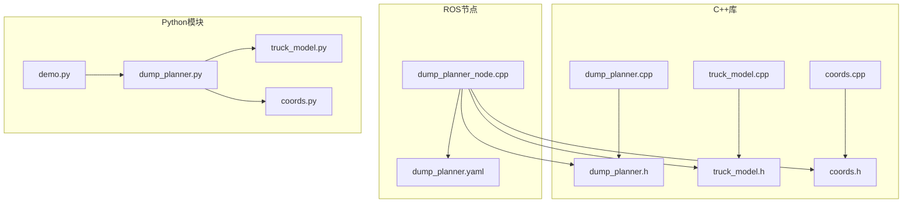
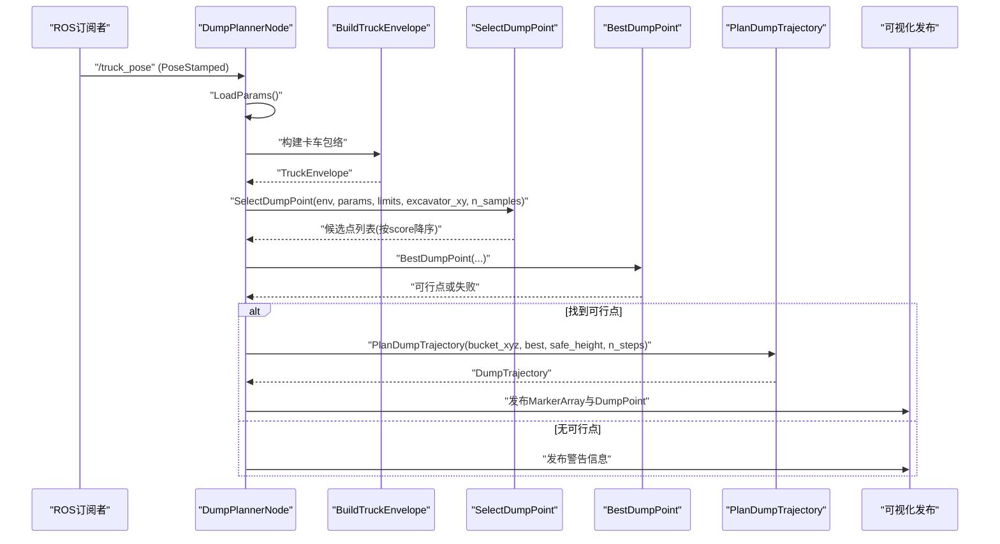
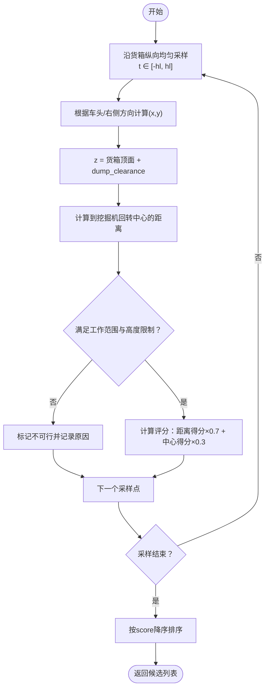
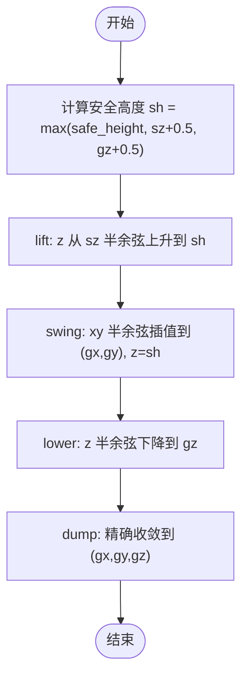
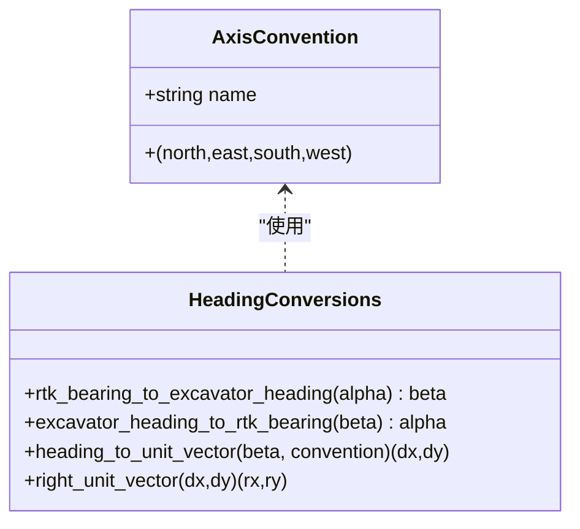
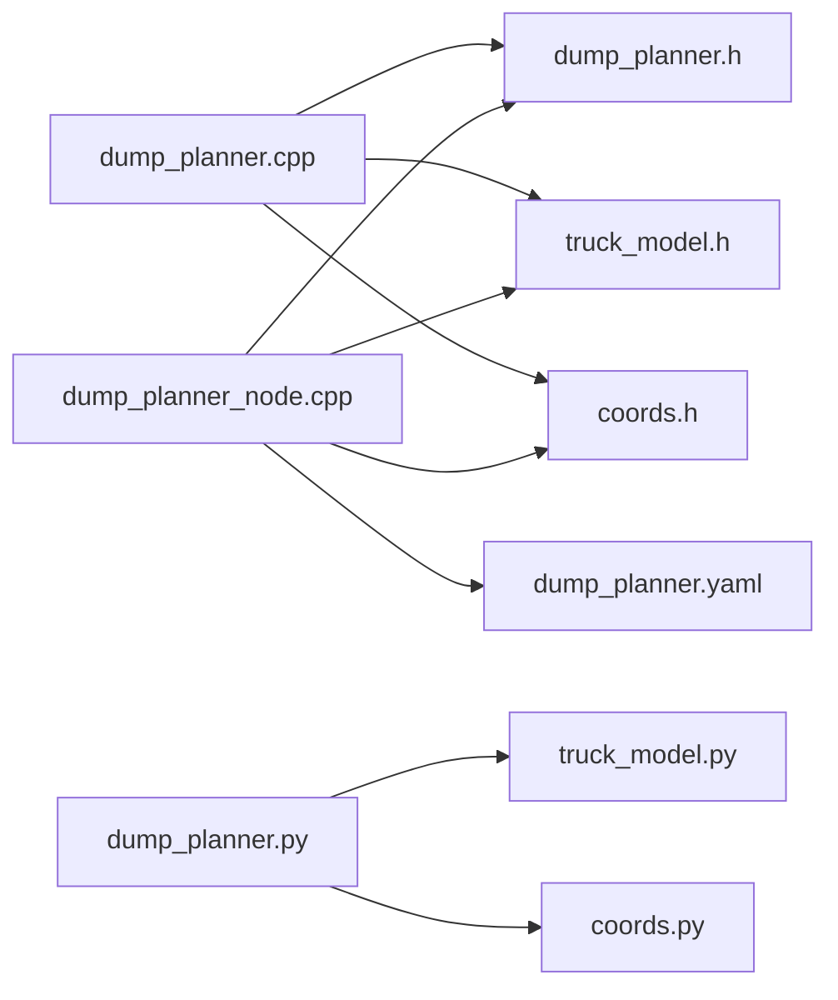

# 轨迹规划API

<cite>
**本文档引用的文件**
- [dump_planner.h](file://src/truck_dump_planner/include/truck_dump_planner/dump_planner.h)
- [dump_planner.cpp](file://src/truck_dump_planner/src/dump_planner.cpp)
- [dump_planner.yaml](file://src/truck_dump_planner/config/dump_planner.yaml)
- [truck_model.h](file://src/truck_dump_planner/include/truck_dump_planner/truck_model.h)
- [truck_model.cpp](file://src/truck_dump_planner/src/truck_model.cpp)
- [coords.h](file://src/truck_dump_planner/include/truck_dump_planner/coords.h)
- [coords.cpp](file://src/truck_dump_planner/src/coords.cpp)
- [dump_planner_node.cpp](file://src/truck_dump_planner/src/dump_planner_node.cpp)
- [dump_planner.py](file://src/truck_envelope/dump_planner.py)
- [truck_model.py](file://src/truck_envelope/truck_model.py)
- [coords.py](file://src/truck_envelope/coords.py)
- [demo.py](file://src/demo.py)
</cite>

## 目录
1. [简介](#简介)
2. [项目结构](#项目结构)
3. [核心组件](#核心组件)
4. [架构概览](#架构概览)
5. [详细组件分析](#详细组件分析)
6. [依赖分析](#依赖分析)
7. [性能考量](#性能考量)
8. [故障排查指南](#故障排查指南)
9. [结论](#结论)
10. [附录](#附录)

## 简介
本文件为“无人挖掘机装车轨迹规划API”的权威参考文档，聚焦于以下三个核心函数：
- SelectDumpPoint：在货箱顶面生成候选卸载点，进行可行性筛选与评分排序
- BestDumpPoint：返回评分最高的可行卸载点
- PlanDumpTrajectory：规划三段式平滑轨迹（lift/swing/lower/dump）

文档同时系统化阐述了卸载点选择算法的参数配置（采样数量、工作范围限制、评分机制），并深入解析三段式轨迹规划的运动控制与平滑函数设计。此外，还提供了ExcavatorKinLimits、DumpPoint、TrajectoryPoint等数据结构的完整说明、使用示例与性能优化建议。

## 项目结构
该项目采用C++与Python双实现并存的架构，核心逻辑位于C++库中，ROS节点负责参数加载与可视化发布；Python模块提供与C++一致的接口，便于演示与验证。

图表来源
- [dump_planner.h:1-66](file://src/truck_dump_planner/include/truck_dump_planner/dump_planner.h#L1-L66)
- [dump_planner.cpp:1-120](file://src/truck_dump_planner/src/dump_planner.cpp#L1-L120)
- [dump_planner_node.cpp:1-341](file://src/truck_dump_planner/src/dump_planner_node.cpp#L1-L341)
- [dump_planner.yaml:1-43](file://src/truck_dump_planner/config/dump_planner.yaml#L1-L43)
- [dump_planner.py:1-222](file://src/truck_envelope/dump_planner.py#L1-L222)
- [truck_model.py:1-200](file://src/truck_envelope/truck_model.py#L1-L200)
- [coords.py:1-200](file://src/truck_envelope/coords.py#L1-L200)
- [demo.py:1-249](file://src/demo.py#L1-L249)

章节来源
- [dump_planner.h:1-66](file://src/truck_dump_planner/include/truck_dump_planner/dump_planner.h#L1-L66)
- [dump_planner.cpp:1-120](file://src/truck_dump_planner/src/dump_planner.cpp#L1-L120)
- [dump_planner_node.cpp:1-341](file://src/truck_dump_planner/src/dump_planner_node.cpp#L1-L341)
- [dump_planner.yaml:1-43](file://src/truck_dump_planner/config/dump_planner.yaml#L1-L43)
- [dump_planner.py:1-222](file://src/truck_envelope/dump_planner.py#L1-L222)
- [truck_model.py:1-200](file://src/truck_envelope/truck_model.py#L1-L200)
- [coords.py:1-200](file://src/truck_envelope/coords.py#L1-L200)
- [demo.py:1-249](file://src/demo.py#L1-L249)

## 核心组件
本节概述三个核心API及其职责边界与输入输出契约。

- SelectDumpPoint
  - 功能：在货箱顶面沿纵向均匀采样生成候选卸载点，基于工作范围与高度限制进行可行性判定，并对可行点进行加权评分，按分数降序返回
  - 关键参数：n_samples（采样数量）、excavator_xy（挖掘机回转中心）、limits（工作范围与高度限制）、env/params（卡车包络与几何参数）
  - 返回：按score降序排列的DumpPoint列表
- BestDumpPoint
  - 功能：调用SelectDumpPoint后返回首个可行点；若无可行点返回false
  - 关键参数：同上
  - 返回：布尔值表示是否找到可行点，以及输出参数DumpPoint
- PlanDumpTrajectory
  - 功能：规划三段式轨迹（lift/swing/lower/dump），每段采用半余弦平滑，确保速度连续、加速度有限
  - 关键参数：bucket_xyz（铲斗起点）、dump_point（目标卸载点）、safe_height（安全高度）、n_steps（轨迹点总数）
  - 返回：包含轨迹点序列与阶段标签的DumpTrajectory

章节来源
- [dump_planner.h:42-61](file://src/truck_dump_planner/include/truck_dump_planner/dump_planner.h#L42-L61)
- [dump_planner.cpp:7-117](file://src/truck_dump_planner/src/dump_planner.cpp#L7-L117)

## 架构概览
下图展示了从ROS订阅消息到轨迹发布的端到端流程，以及关键数据结构之间的关系。

图表来源
- [dump_planner_node.cpp:99-136](file://src/truck_dump_planner/src/dump_planner_node.cpp#L99-L136)
- [dump_planner.cpp:7-117](file://src/truck_dump_planner/src/dump_planner.cpp#L7-L117)
- [truck_model.cpp:22-46](file://src/truck_dump_planner/src/truck_model.cpp#L22-L46)

## 详细组件分析

### 数据结构详解

#### ExcavatorKinLimits（挖掘机工作范围约束）
- 字段
  - reach_min/reach_max：最小/最大卸载半径（米）
  - dump_height_min/dump_height_max：最小/最大卸载高度（米）
  - dump_clearance：铲斗底门距货箱顶面的间隙（米）
- 用途
  - 用于卸载点可行性判定与轨迹规划中的安全高度设定
- 配置来源
  - C++参数加载：reach_min/reach_max/dump_height_max/dump_height_min/dump_clearance
  - Python参数加载：同名字段

章节来源
- [dump_planner.h:11-17](file://src/truck_dump_planner/include/truck_dump_planner/dump_planner.h#L11-L17)
- [dump_planner.yaml:14-22](file://src/truck_dump_planner/config/dump_planner.yaml#L14-L22)
- [dump_planner_node.cpp:52-57](file://src/truck_dump_planner/src/dump_planner_node.cpp#L52-L57)
- [dump_planner.py:48-54](file://src/truck_envelope/dump_planner.py#L48-L54)

#### DumpPoint（候选/选定卸载点）
- 字段
  - x/y/z：卸载点坐标（z为货箱顶面+间隙）
  - is_feasible：是否可行
  - score：评分（越大越优）
  - reason：不可行原因字符串
- 用途
  - 作为SelectDumpPoint的输出与BestDumpPoint的输入
- Python等价类
  - dataclass DumpPoint（字段一致）

章节来源
- [dump_planner.h:20-27](file://src/truck_dump_planner/include/truck_dump_planner/dump_planner.h#L20-L27)
- [dump_planner.py:36-44](file://src/truck_envelope/dump_planner.py#L36-L44)

#### TrajectoryPoint（轨迹点）
- 字段
  - x/y/z：轨迹点坐标
  - phase：所属阶段（lift/swing/lower/dump）
- 用途
  - 作为DumpTrajectory.points元素，记录每个离散点的运动阶段

章节来源
- [dump_planner.h:30-35](file://src/truck_dump_planner/include/truck_dump_planner/dump_planner.h#L30-L35)

#### DumpTrajectory（轨迹结果）
- 字段
  - points：轨迹点序列
  - dump_point：所用的卸载点
- 用途
  - PlanDumpTrajectory的返回类型，承载完整轨迹

章节来源
- [dump_planner.h:37-40](file://src/truck_dump_planner/include/truck_dump_planner/dump_planner.h#L37-L40)

#### TruckParams（卡车几何与货箱参数）
- 字段
  - length/width：车体长宽（米）
  - ref_offset：参考点相对几何中心的纵向偏移（米）
  - box_length/box_width：货箱长宽（米）
  - box_center_offset：货箱中心相对参考点的纵向偏移（米）
  - box_height：货箱侧壁高度（米）
- 用途
  - 用于构建TruckEnvelope与计算卸载点高度

章节来源
- [truck_model.h:22-30](file://src/truck_dump_planner/include/truck_dump_planner/truck_model.h#L22-L30)
- [dump_planner.yaml:4-12](file://src/truck_dump_planner/config/dump_planner.yaml#L4-L12)
- [dump_planner_node.cpp:42-50](file://src/truck_dump_planner/src/dump_planner_node.cpp#L42-L50)

#### TruckEnvelope（卡车包络）
- 字段
  - center：卡车参考点（挖掘机系）
  - z：地面高度
  - heading_beta/heading_rtk：挖掘机系航向角与RTK方位角
  - body_corners/box_corners：车体/货箱四角（前左/后左/后右/前右）
  - box_center：货箱中心
  - box_top_z：货箱顶面高度
  - forward_dir/right_dir：车头/右侧方向单位向量
- 用途
  - SelectDumpPoint与轨迹规划的基础输入

章节来源
- [truck_model.h:33-44](file://src/truck_dump_planner/include/truck_dump_planner/truck_model.h#L33-L44)
- [dump_planner.cpp:11-17](file://src/truck_dump_planner/src/dump_planner.cpp#L11-L17)

#### Vec2/Vec3（向量）
- 字段
  - Vec2：x/y
  - Vec3：x/y/z
- 用途
  - 作为几何计算与轨迹点的通用载体

章节来源
- [truck_model.h:10-19](file://src/truck_dump_planner/include/truck_dump_planner/truck_model.h#L10-L19)

### 卸载点选择算法（SelectDumpPoint）

#### 算法流程

图表来源
- [dump_planner.cpp:11-61](file://src/truck_dump_planner/src/dump_planner.cpp#L11-L61)
- [dump_planner.py:69-140](file://src/truck_envelope/dump_planner.py#L69-L140)

#### 参数配置
- 采样数量 n_samples
  - C++：默认9，可通过参数传入
  - Python：默认9，可通过参数传入
- 工作范围限制 limits
  - reach_min/reach_max：卸载半径上下界
  - dump_height_min/dump_height_max：卸载高度上下界
  - dump_clearance：卸料间隙
- 工作半径评分权重：0.7
- 货箱中心对齐评分权重：0.3
- 评分归一化：避免除零，使用极小值保护

章节来源
- [dump_planner.h:43-47](file://src/truck_dump_planner/include/truck_dump_planner/dump_planner.h#L43-L47)
- [dump_planner.cpp:22-53](file://src/truck_dump_planner/src/dump_planner.cpp#L22-L53)
- [dump_planner.yaml:35-37](file://src/truck_dump_planner/config/dump_planner.yaml#L35-L37)
- [dump_planner_node.cpp](file://src/truck_dump_planner/src/dump_planner_node.cpp#L70)

### 最佳卸载点（BestDumpPoint）
- 实现要点
  - 直接复用SelectDumpPoint的结果，遍历首个is_feasible=true的点
  - 若无可行点，返回false
- 使用建议
  - 适用于“优先选择可行点”的场景；若需更多候选，直接使用SelectDumpPoint

章节来源
- [dump_planner.h:50-52](file://src/truck_dump_planner/include/truck_dump_planner/dump_planner.h#L50-L52)
- [dump_planner.cpp:63-75](file://src/truck_dump_planner/src/dump_planner.cpp#L63-L75)

### 三段式轨迹规划（PlanDumpTrajectory）

#### 运动控制与阶段划分
- lift：z从起点提升至safe_height，xy保持不变
- swing：在safe_height上，xy从起点插值到目标点，z保持safe_height
- lower：z从safe_height下降至目标z，xy保持目标点
- dump：末点精确收敛到目标点

#### 平滑函数
- 半余弦平滑：s(t) = (1 - cos(πt)) / 2，t∈[0,1]
- 特点：起止速度为0，避免速度突变，保证轨迹连续性
- 段长分配：lift约25%，swing约45%，lower约30%，确保各阶段运动量合理

图表来源
- [dump_planner.cpp:82-117](file://src/truck_dump_planner/src/dump_planner.cpp#L82-L117)
- [dump_planner.py:143-207](file://src/truck_envelope/dump_planner.py#L143-L207)

#### 关键参数
- safe_height：安全回转高度（米）
- n_steps：轨迹点总数
- 段长比例：lift≈25%，swing≈45%，lower≈30%

章节来源
- [dump_planner.h:59-61](file://src/truck_dump_planner/include/truck_dump_planner/dump_planner.h#L59-L61)
- [dump_planner.cpp:88-96](file://src/truck_dump_planner/src/dump_planner.cpp#L88-L96)
- [dump_planner.yaml:31-33](file://src/truck_dump_planner/config/dump_planner.yaml#L31-L33)
- [dump_planner_node.cpp:67-69](file://src/truck_dump_planner/src/dump_planner_node.cpp#L67-L69)

### 坐标系与包络构建

#### 航向角转换
- RTK方位角α与挖掘机系航向角β的关系
  - β = (180° - α) mod 360°
  - α = (180° - β) mod 360°
- 方向向量分解
  - 依据AxisConvention（x东y北或x北y西）将β分解为(dx, dy)
  - 右侧方向向量为(dy, -dx)

图表来源
- [coords.h:21-32](file://src/truck_dump_planner/include/truck_dump_planner/coords.h#L21-L32)
- [coords.cpp:10-49](file://src/truck_dump_planner/src/coords.cpp#L10-L49)
- [coords.py:39-199](file://src/truck_envelope/coords.py#L39-L199)

#### 卡车包络构建
- 输入：卡车参考点(x,y,z)、RTK方位角α、TruckParams、AxisConvention
- 输出：TruckEnvelope（包含车体/货箱四角、方向向量、顶面高度等）
- 关键步骤：α→β、β→(dx,dy)、(dx,dy)→(rx,ry)、矩形四角计算

章节来源
- [truck_model.h:46-52](file://src/truck_dump_planner/include/truck_dump_planner/truck_model.h#L46-L52)
- [truck_model.cpp:22-46](file://src/truck_dump_planner/src/truck_model.cpp#L22-L46)
- [truck_model.py:112-177](file://src/truck_envelope/truck_model.py#L112-L177)

## 依赖分析

图表来源
- [dump_planner.cpp:1-5](file://src/truck_dump_planner/src/dump_planner.cpp#L1-L5)
- [dump_planner.h:1-8](file://src/truck_dump_planner/include/truck_dump_planner/dump_planner.h#L1-L8)
- [dump_planner_node.cpp:19-21](file://src/truck_dump_planner/src/dump_planner_node.cpp#L19-L21)
- [dump_planner.yaml:1-43](file://src/truck_dump_planner/config/dump_planner.yaml#L1-L43)
- [dump_planner.py:27-31](file://src/truck_envelope/dump_planner.py#L27-L31)

章节来源
- [dump_planner.cpp:1-5](file://src/truck_dump_planner/src/dump_planner.cpp#L1-L5)
- [dump_planner_node.cpp:19-21](file://src/truck_dump_planner/src/dump_planner_node.cpp#L19-L21)
- [dump_planner.py:27-31](file://src/truck_envelope/dump_planner.py#L27-L31)

## 性能考量
- 卸载点采样
  - n_samples越大，候选越多，评分更精细，但计算时间增加；建议在5–15之间平衡精度与实时性
  - 采样沿货箱纵向均匀分布，避免在货箱边缘产生不稳定的卸载点
- 轨迹点数
  - n_steps影响轨迹平滑度与控制频率；建议≥30以保证平滑性
  - 段长比例固定，可根据实际机械臂响应特性微调
- 评分稳定性
  - 使用极小值避免除零；当工作范围边界接近时，建议适当放宽边界以减少边界效应
- 可视化与调试
  - dump_planner_node提供RViz Marker发布，便于在线验证轨迹与卸载点
  - demo.py提供离线演示，便于快速验证算法正确性

## 故障排查指南
- 无可行卸载点
  - 现象：BestDumpPoint返回false，日志提示无可行点
  - 排查要点：检查excavator_xy与卡车位置关系、工作范围参数、dump_clearance是否过大
  - 参考路径：[dump_planner_node.cpp:127-135](file://src/truck_dump_planner/src/dump_planner_node.cpp#L127-L135)
- 卸载点评分异常
  - 现象：评分波动或边界处不稳定
  - 排查要点：确认n_samples是否足够、limits边界设置是否合理、dump_clearance是否导致z越界
  - 参考路径：[dump_planner.cpp:48-53](file://src/truck_dump_planner/src/dump_planner.cpp#L48-L53)
- 轨迹抖动或速度突变
  - 现象：轨迹点间出现加速度尖峰
  - 排查要点：检查n_steps是否过小、段长分配是否合理、safe_height是否过低
  - 参考路径：[dump_planner.cpp:88-96](file://src/truck_dump_planner/src/dump_planner.cpp#L88-L96)
- 坐标系不一致
  - 现象：包络方向与预期相反
  - 排查要点：核对axis_convention与bearing_convention配置、四元数到航向角转换
  - 参考路径：[dump_planner_node.cpp:75-83](file://src/truck_dump_planner/src/dump_planner_node.cpp#L75-L83)

章节来源
- [dump_planner_node.cpp:127-135](file://src/truck_dump_planner/src/dump_planner_node.cpp#L127-L135)
- [dump_planner.cpp:48-53](file://src/truck_dump_planner/src/dump_planner.cpp#L48-L53)
- [dump_planner.cpp:88-96](file://src/truck_dump_planner/src/dump_planner.cpp#L88-L96)
- [dump_planner_node.cpp:75-83](file://src/truck_dump_planner/src/dump_planner_node.cpp#L75-L83)

## 结论
本API以简洁的数据结构与清晰的算法流程实现了高效的卸载点选择与三段式轨迹规划。通过合理的参数配置与评分机制，能够在保证安全性的同时最大化作业效率。配合ROS节点与Python演示，开发者可以快速集成、验证与优化轨迹规划功能。

## 附录

### 使用示例（Python）
- 卸载点选择与轨迹规划
  - 参考路径：[demo.py:93-149](file://src/demo.py#L93-L149)
- 坐标系转换验证
  - 参考路径：[demo.py:50-90](file://src/demo.py#L50-L90)

### 参数一览表
- 卡车几何（米）
  - length/width：车体长宽
  - ref_offset：参考点相对几何中心偏移
  - box_length/box_width：货箱长宽
  - box_center_offset：货箱中心相对参考点偏移
  - box_height：货箱侧壁高度
- 挖掘机工作范围
  - reach_min/reach_max：最小/最大卸载半径
  - dump_height_min/dump_height_max：最小/最大卸载高度
  - dump_clearance：卸料间隙
- 铲斗当前位置（米）
  - bucket.x/bucket.y/bucket.z
- 轨迹规划
  - safe_height：安全回转高度
  - n_steps：轨迹点数
- 卸载点采样
  - n_samples：沿货箱纵向采样数
- 坐标系约定
  - frame_id：发布marker的坐标系
  - axis_convention：x东y北或x北y西
  - bearing_convention：rep105_enu或yaw_is_bearing

章节来源
- [dump_planner.yaml:4-43](file://src/truck_dump_planner/config/dump_planner.yaml#L4-L43)
- [dump_planner_node.cpp:42-83](file://src/truck_dump_planner/src/dump_planner_node.cpp#L42-L83)