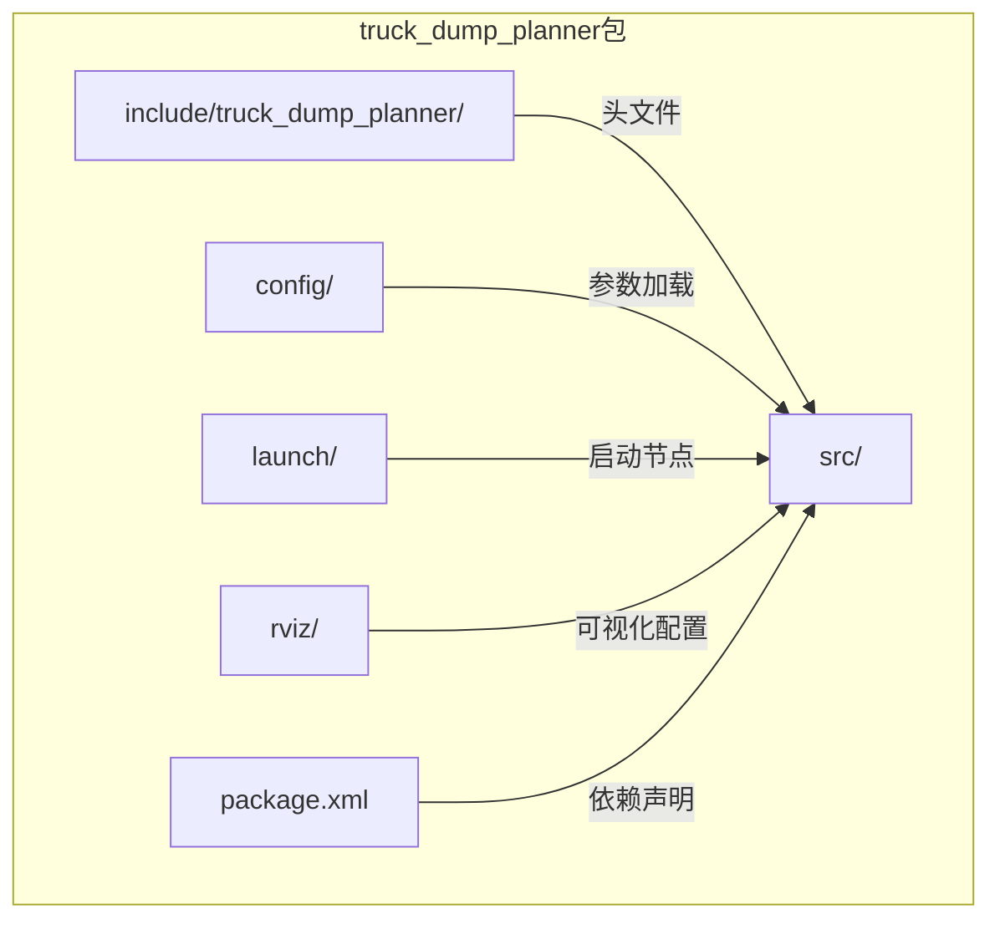
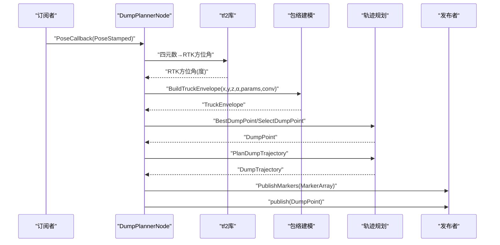
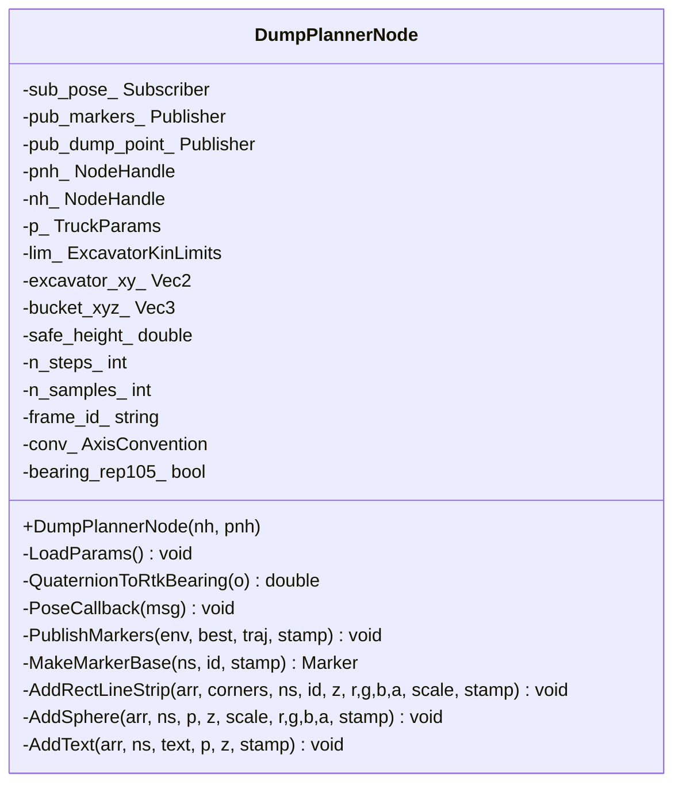
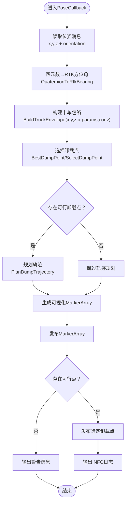
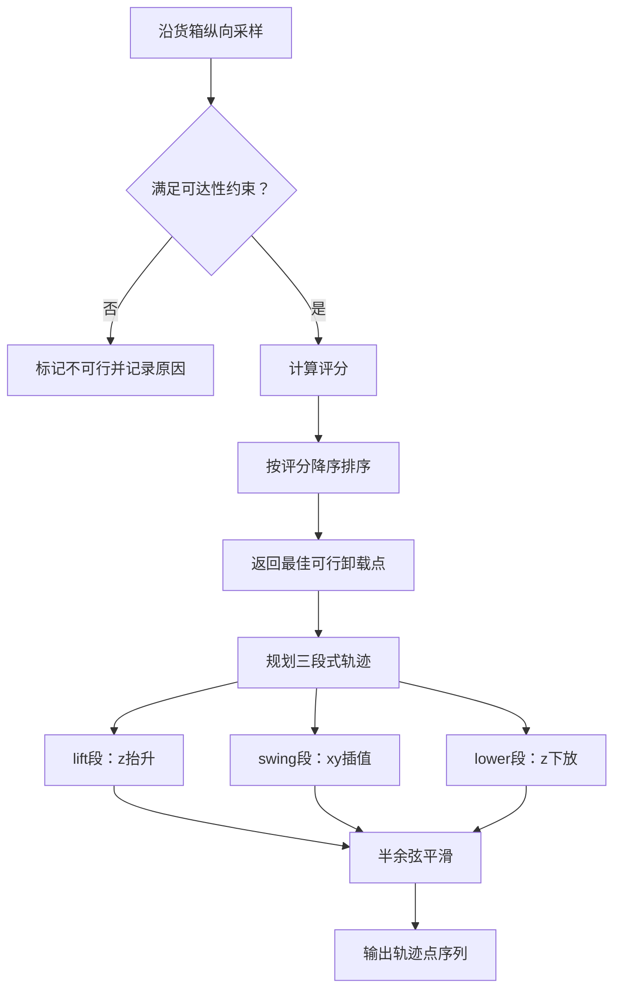
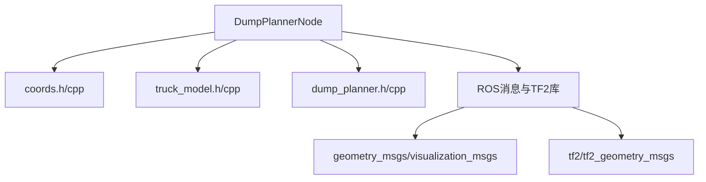

# ROS节点设计

<cite>
**本文档引用的文件**
- [dump_planner_node.cpp](file://src/truck_dump_planner/src/dump_planner_node.cpp)
- [dump_planner.h](file://src/truck_dump_planner/include/truck_dump_planner/dump_planner.h)
- [dump_planner.cpp](file://src/truck_dump_planner/src/dump_planner.cpp)
- [truck_model.h](file://src/truck_dump_planner/include/truck_dump_planner/truck_model.h)
- [truck_model.cpp](file://src/truck_dump_planner/src/truck_model.cpp)
- [coords.h](file://src/truck_dump_planner/include/truck_dump_planner/coords.h)
- [coords.cpp](file://src/truck_dump_planner/src/coords.cpp)
- [dump_planner.yaml](file://src/truck_dump_planner/config/dump_planner.yaml)
- [dump_planner.launch](file://src/truck_dump_planner/launch/dump_planner.launch)
- [package.xml](file://src/truck_dump_planner/package.xml)
</cite>

## 目录
1. [引言](#引言)
2. [项目结构](#项目结构)
3. [核心组件](#核心组件)
4. [架构概览](#架构概览)
5. [详细组件分析](#详细组件分析)
6. [依赖关系分析](#依赖关系分析)
7. [性能考虑](#性能考虑)
8. [故障排查指南](#故障排查指南)
9. [结论](#结论)

## 引言
本文件针对无人挖掘机装车轨迹规划ROS节点进行系统性技术文档编写，重点围绕DumpPlannerNode类的架构设计与实现细节展开。该节点负责接收RTK位姿消息，完成坐标系转换与卡车包络建模，筛选可行卸载点，并规划三段式平滑轨迹，最终通过RViz可视化展示结果。文档将详细解析节点构造函数初始化流程、参数加载机制、话题订阅与发布器创建、参数含义与作用、PoseCallback回调处理链路，以及生命周期管理、错误处理与性能优化策略。

## 项目结构
项目采用标准ROS工作空间布局，核心代码位于truck_dump_planner包中，包含以下关键目录：
- include/truck_dump_planner：公共头文件，定义数据结构与接口
- src：源码实现，包含节点主程序、轨迹规划算法、模型与坐标变换
- config：参数配置文件（YAML格式）
- launch：启动脚本（包含参数加载与测试发布器）
- rviz：RViz可视化配置文件
- package.xml：包描述与依赖声明

**图表来源**
- [package.xml:1-20](file://src/truck_dump_planner/package.xml#L1-L20)
- [dump_planner_node.cpp:1-341](file://src/truck_dump_planner/src/dump_planner_node.cpp#L1-L341)

**章节来源**
- [package.xml:1-20](file://src/truck_dump_planner/package.xml#L1-L20)
- [dump_planner.launch:1-26](file://src/truck_dump_planner/launch/dump_planner.launch#L1-L26)

## 核心组件
DumpPlannerNode是节点的核心类，承担以下职责：
- 参数加载：从节点私有命名空间读取所有配置参数
- 话题订阅：监听卡车位姿话题，触发轨迹规划流程
- 发布器管理：发布可视化MarkerArray与选定卸载点
- 数据处理：坐标系转换、包络建模、卸载点筛选、轨迹规划
- 可视化：生成RViz MarkerArray，展示包络、卸载点与轨迹

关键成员变量与类型：
- TruckParams：卡车几何参数集合
- ExcavatorKinLimits：挖掘机工作范围限制
- Vec2/Vec3：二维/三维向量结构
- DumpPoint/DumpTrajectory：卸载点与轨迹点结构
- TruckEnvelope：卡车包络结构

**章节来源**
- [dump_planner_node.cpp:25-331](file://src/truck_dump_planner/src/dump_planner_node.cpp#L25-L331)
- [dump_planner.h:10-62](file://src/truck_dump_planner/include/truck_dump_planner/dump_planner.h#L10-L62)
- [truck_model.h:21-44](file://src/truck_dump_planner/include/truck_dump_planner/truck_model.h#L21-L44)

## 架构概览
DumpPlannerNode采用事件驱动架构，基于ROS回调机制响应位姿消息。整体数据流如下：
- 输入：geometry_msgs/PoseStamped（RTK位姿）
- 处理：四元数→RTK方位角→挖掘机系航向→包络建模→卸载点筛选→轨迹规划
- 输出：visualization_msgs/MarkerArray（可视化）、geometry_msgs/PointStamped（选定卸载点）

**图表来源**
- [dump_planner_node.cpp:99-136](file://src/truck_dump_planner/src/dump_planner_node.cpp#L99-L136)
- [dump_planner.cpp:63-75](file://src/truck_dump_planner/src/dump_planner.cpp#L63-L75)
- [dump_planner.cpp:82-117](file://src/truck_dump_planner/src/dump_planner.cpp#L82-L117)

## 详细组件分析

### DumpPlannerNode类设计
DumpPlannerNode采用面向对象封装，提供清晰的初始化、参数加载、回调处理与可视化发布功能。

**图表来源**
- [dump_planner_node.cpp:25-331](file://src/truck_dump_planner/src/dump_planner_node.cpp#L25-L331)

**章节来源**
- [dump_planner_node.cpp:25-39](file://src/truck_dump_planner/src/dump_planner_node.cpp#L25-L39)

### 构造函数初始化流程
构造函数执行以下步骤：
1. 调用LoadParams()加载所有参数
2. 创建可视化MarkerArray发布器
3. 创建卸载点发布器
4. 订阅卡车位姿话题，绑定PoseCallback回调
5. 输出节点就绪日志

初始化期间的关键点：
- 使用NodeHandle与私有NodeHandle分离全局与参数访问
- 发布器队列大小设置为1，启用持久化选项
- 订阅队列大小为1，确保实时性

**章节来源**
- [dump_planner_node.cpp:27-39](file://src/truck_dump_planner/src/dump_planner_node.cpp#L27-L39)

### 参数加载机制（LoadParams）
LoadParams()从节点私有命名空间读取并设置以下参数组：

- 卡车几何参数（单位：米）
  - length：卡车总长（纵轴）
  - width：卡车总宽（横轴）
  - ref_offset：车体几何中心相对参考点的纵轴偏移
  - box_length：货箱长
  - box_width：货箱宽
  - box_center_offset：货箱中心相对参考点的纵轴偏移
  - box_height：货箱侧壁高度

- 挖掘机工作范围限制
  - x/y：挖掘机回转中心在挖掘机系坐标
  - reach_min/max：最小/最大卸载半径
  - dump_height_min/max：最小/最大卸载高度
  - dump_clearance：铲斗底门距货箱顶面间隙

- 铲斗当前位置（挖掘机系）
  - bucket/x/y/z：卸载轨迹起点坐标

- 轨迹规划参数
  - trajectory/safe_height：回转安全高度
  - trajectory/n_steps：轨迹离散点数

- 卸载点采样参数
  - dump/n_samples：沿货箱纵向采样点数

- 坐标系约定
  - frame_id：发布marker的坐标系名称
  - axis_convention：xy轴地理朝向约定（east_north或north_west）
  - bearing_convention：RTK方位角与四元数yaw约定（rep105_enu或yaw_is_bearing）

参数加载使用默认值，确保节点在缺少参数时仍可运行。

**章节来源**
- [dump_planner_node.cpp:42-84](file://src/truck_dump_planner/src/dump_planner_node.cpp#L42-L84)
- [dump_planner.yaml:4-43](file://src/truck_dump_planner/config/dump_planner.yaml#L4-L43)

### 话题订阅与发布器创建
- 订阅话题：/truck_pose（geometry_msgs/PoseStamped）
- 发布话题：
  - /truck_envelope_markers（visualization_msgs/MarkerArray）
  - /dump_point（geometry_msgs/PointStamped）

发布器队列大小均为1，启用持久化选项，确保RViz端能接收到最新状态。

**章节来源**
- [dump_planner_node.cpp:30-36](file://src/truck_dump_planner/src/dump_planner_node.cpp#L30-L36)

### PoseCallback回调处理流程
PoseCallback是节点的核心处理逻辑，完整数据处理链路如下：

**图表来源**
- [dump_planner_node.cpp:99-136](file://src/truck_dump_planner/src/dump_planner_node.cpp#L99-L136)
- [dump_planner.cpp:63-75](file://src/truck_dump_planner/src/dump_planner.cpp#L63-L75)
- [dump_planner.cpp:82-117](file://src/truck_dump_planner/src/dump_planner.cpp#L82-L117)

详细处理步骤：
1. 从PoseStamped提取位置与姿态
2. 使用QuaternionToRtkBearing将四元数转换为RTK方位角
3. 调用BuildTruckEnvelope构建卡车包络
4. 调用BestDumpPoint获取评分最高的可行卸载点
5. 若存在可行点，调用PlanDumpTrajectory规划三段式轨迹
6. 调用PublishMarkers发布可视化MarkerArray
7. 若存在可行点，发布geometry_msgs/PointStamped消息
8. 输出INFO/WARN日志（INFO每秒限流一次，WARN每秒限流一次）

**章节来源**
- [dump_planner_node.cpp:99-136](file://src/truck_dump_planner/src/dump_planner_node.cpp#L99-L136)

### 坐标系转换与包络建模
坐标系转换涉及多个层面：
- 四元数→RTK方位角：根据bearing_convention选择转换规则
- RTK方位角→挖掘机系航向：β=(180-α)mod360
- 轴约定：east_north（x=东,y=北）与north_west（x=北,y=西）
- 包络建模：基于车体尺寸与货箱尺寸，计算四角坐标与车头方向

**图表来源**
- [dump_planner_node.cpp:87-97](file://src/truck_dump_planner/src/dump_planner_node.cpp#L87-L97)
- [coords.cpp:10-16](file://src/truck_dump_planner/src/coords.cpp#L10-L16)
- [coords.cpp:18-49](file://src/truck_dump_planner/src/coords.cpp#L18-L49)
- [truck_model.cpp:22-46](file://src/truck_dump_planner/src/truck_model.cpp#L22-L46)

**章节来源**
- [coords.h:13-32](file://src/truck_dump_planner/include/truck_dump_planner/coords.h#L13-L32)
- [coords.cpp:10-16](file://src/truck_dump_planner/src/coords.cpp#L10-L16)
- [coords.cpp:18-49](file://src/truck_dump_planner/src/coords.cpp#L18-L49)
- [truck_model.cpp:22-46](file://src/truck_dump_planner/src/truck_model.cpp#L22-L46)

### 卸载点选择与轨迹规划
卸载点选择算法：
- 沿货箱纵向均匀采样n_samples个候选点
- 计算每个候选点到挖掘机回转中心的距离
- 根据距离与中心位置进行可行性判定
- 评分函数综合考虑可达性与中心性

轨迹规划采用三段式平滑曲线：
- lift：z从起点抬升至安全高度
- swing：在安全高度上进行xy插值
- lower：从安全高度下放到卸载高度
- 使用半余弦函数保证速度连续性

**图表来源**
- [dump_planner.cpp:7-61](file://src/truck_dump_planner/src/dump_planner.cpp#L7-L61)
- [dump_planner.cpp:82-117](file://src/truck_dump_planner/src/dump_planner.cpp#L82-L117)

**章节来源**
- [dump_planner.h:42-61](file://src/truck_dump_planner/include/truck_dump_planner/dump_planner.h#L42-L61)
- [dump_planner.cpp:7-61](file://src/truck_dump_planner/src/dump_planner.cpp#L7-L61)
- [dump_planner.cpp:82-117](file://src/truck_dump_planner/src/dump_planner.cpp#L82-L117)

### 可视化发布与Marker生成
PublishMarkers负责生成RViz可视化内容，包括：
- 车体包络（灰色线框）
- 货箱包络（橙色线框）
- 卡车朝向箭头（黄色）
- 货箱中心（红色球体）
- 挖掘机回转中心（黑色球体）
- 卸载点（绿色球体与标签）
- 卸载轨迹（蓝色线与白色轨迹点）

发布流程：
- 先发送DELETEALL清理历史marker
- 依次添加各元素的marker
- 发布MarkerArray

**章节来源**
- [dump_planner_node.cpp:211-313](file://src/truck_dump_planner/src/dump_planner_node.cpp#L211-L313)

## 依赖关系分析
节点依赖关系如下：
- ROS核心：roscpp、geometry_msgs、visualization_msgs、tf2、tf2_geometry_msgs
- 内部模块：coords.h/cpp（坐标变换）、truck_model.h/cpp（包络建模）、dump_planner.h/cpp（轨迹规划）

**图表来源**
- [package.xml:14-18](file://src/truck_dump_planner/package.xml#L14-L18)
- [dump_planner_node.cpp:10-22](file://src/truck_dump_planner/src/dump_planner_node.cpp#L10-L22)

**章节来源**
- [package.xml:14-18](file://src/truck_dump_planner/package.xml#L14-L18)

## 性能考虑
- 计算复杂度
  - 卸载点采样：O(n_samples)
  - 排序：O(n_samples log n_samples)
  - 轨迹规划：O(n_steps)
- 内存管理
  - 使用reserve预分配候选点容器容量
  - 避免重复创建临时对象
- 实时性保障
  - 订阅队列大小为1，减少延迟
  - 发布器队列大小为1，启用持久化
  - 日志输出使用限流（每秒一次）
- 参数优化建议
  - n_samples与n_steps可根据硬件能力调整
  - safe_height应高于实际障碍物高度
  - 采样点数与轨迹点数成正比，影响CPU占用

[本节为通用性能指导，不直接分析具体文件]

## 故障排查指南
常见问题与解决方法：
- 无卸载点可用
  - 检查excavator工作范围参数是否合理
  - 确认RTK方位角与四元数转换约定正确
  - 验证frame_id与坐标系约定
- 轨迹规划失败
  - 检查bucket当前位置是否在可行范围内
  - 调整safe_height与n_steps参数
- 可视化异常
  - 确认RViz已加载正确的配置文件
  - 检查frame_id与坐标系约定
- 参数未生效
  - 确认参数文件路径正确
  - 检查launch文件中的remap与rosparam命令

**章节来源**
- [dump_planner_node.cpp:127-135](file://src/truck_dump_planner/src/dump_planner_node.cpp#L127-L135)
- [dump_planner.yaml:14-43](file://src/truck_dump_planner/config/dump_planner.yaml#L14-L43)

## 结论
DumpPlannerNode实现了从RTK位姿到可视化轨迹的完整闭环，具备清晰的模块划分与稳健的参数加载机制。通过坐标系转换、包络建模与轨迹规划，节点能够实时输出可行的卸载点与平滑轨迹。建议在部署时结合现场环境调整参数，并利用RViz进行可视化验证。