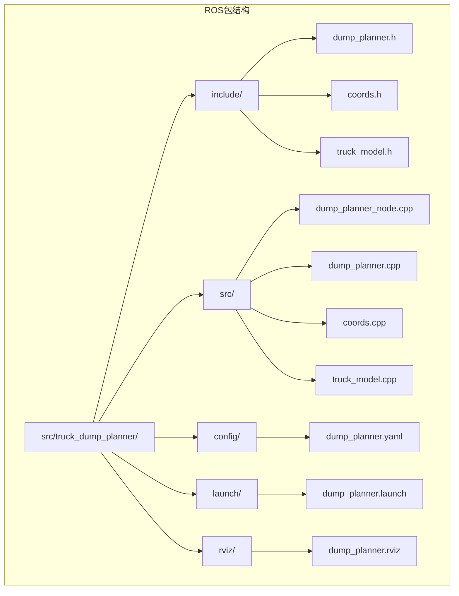
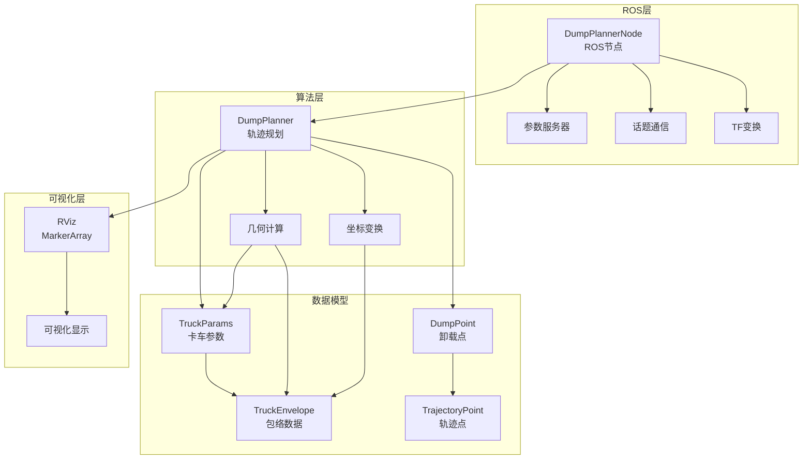
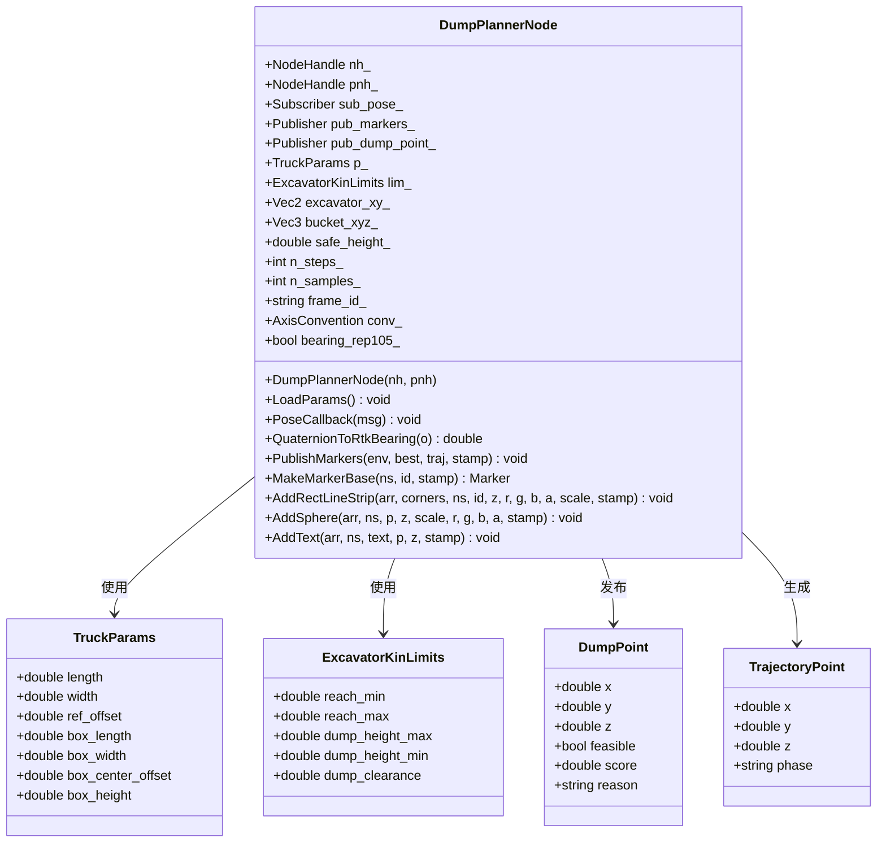
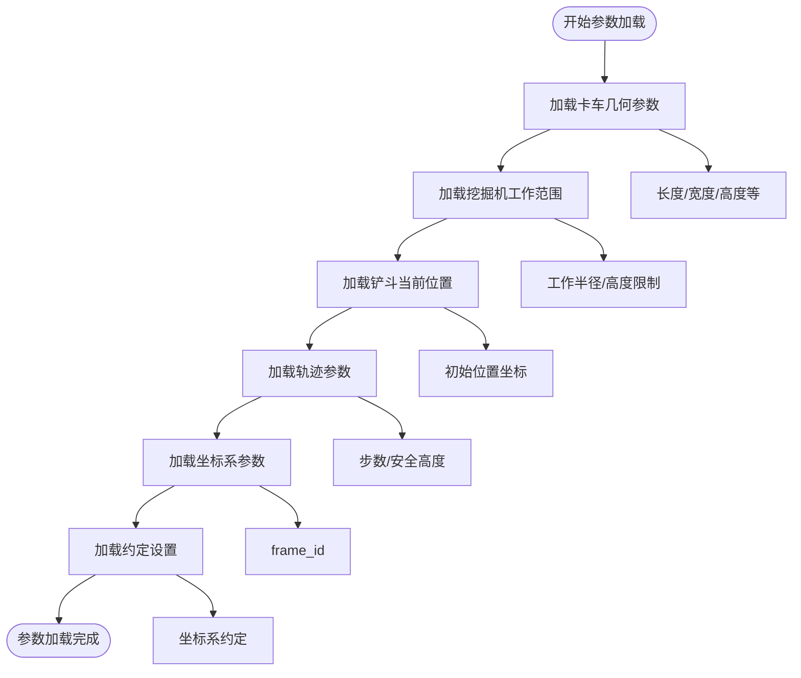
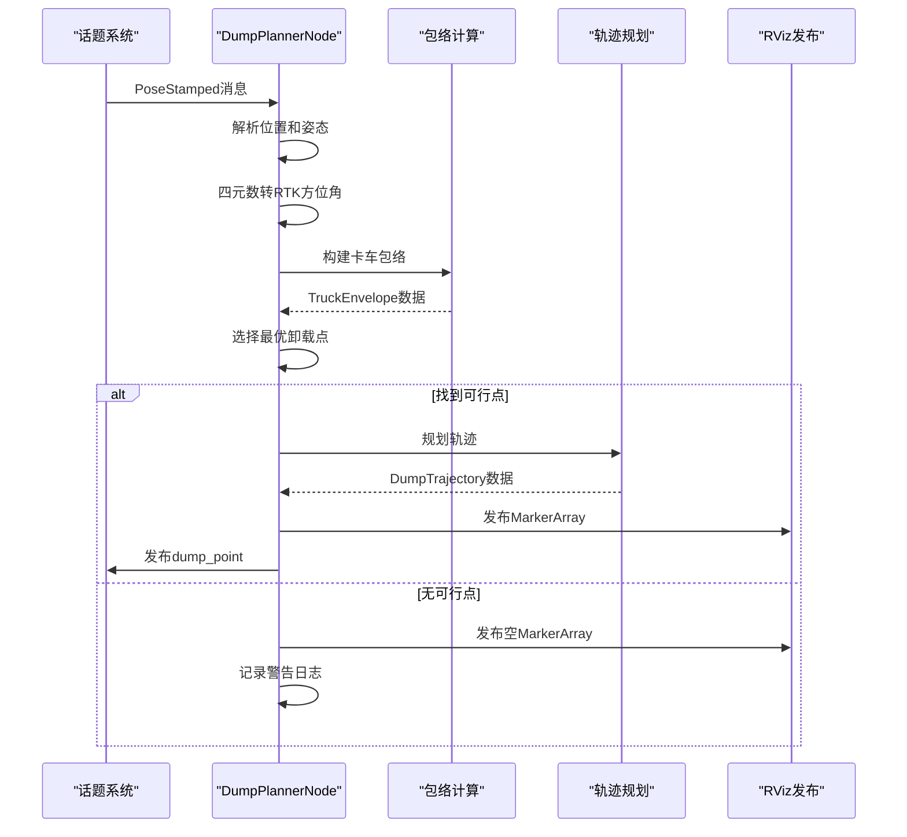
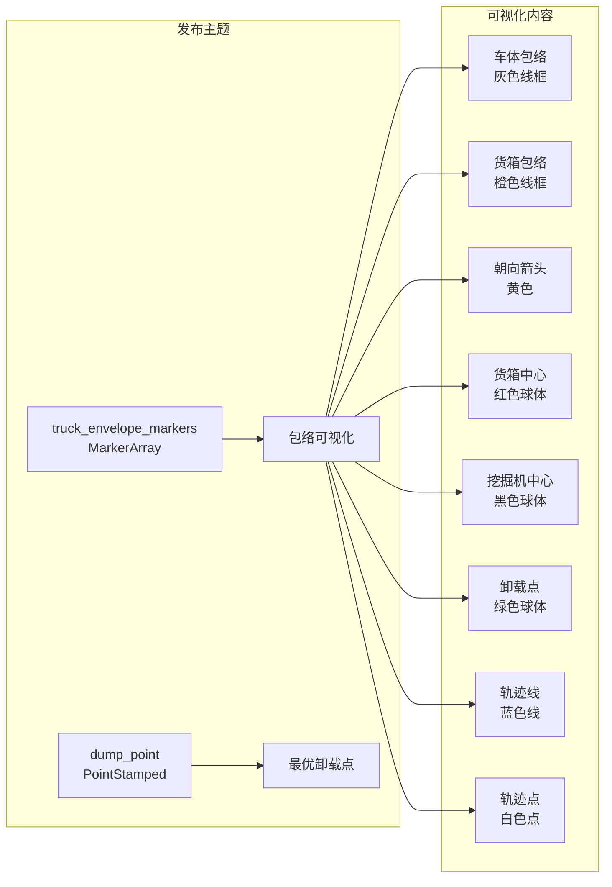
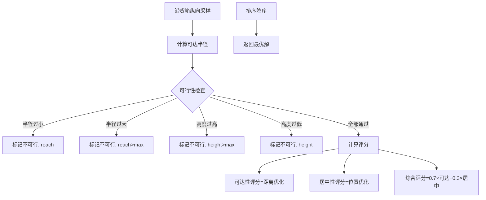
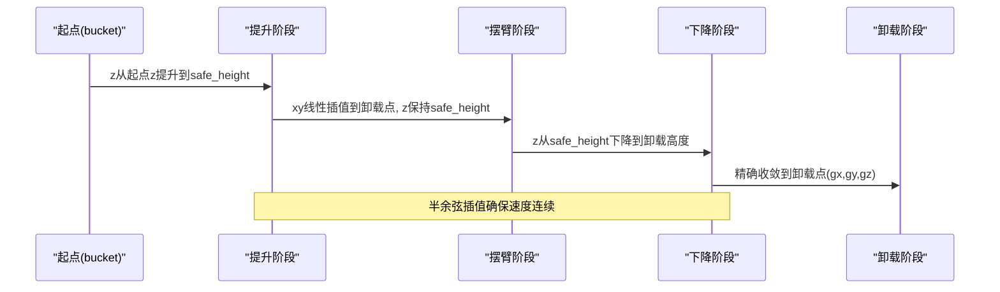
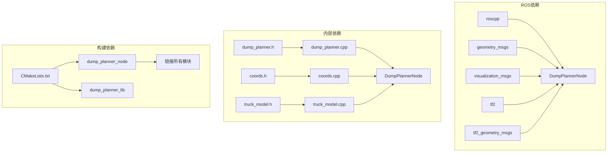
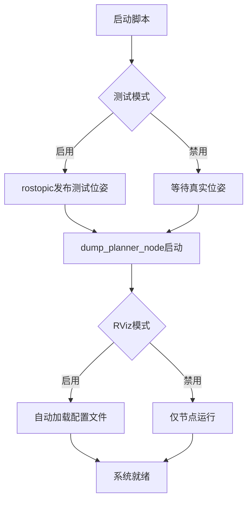

# ROS集成实现

<cite>
**本文档引用的文件**
- [package.xml](file://src/truck_dump_planner/package.xml)
- [CMakeLists.txt](file://src/truck_dump_planner/CMakeLists.txt)
- [dump_planner_node.cpp](file://src/truck_dump_planner/src/dump_planner_node.cpp)
- [dump_planner.h](file://src/truck_dump_planner/include/truck_dump_planner/dump_planner.h)
- [dump_planner.cpp](file://src/truck_dump_planner/src/dump_planner.cpp)
- [coords.h](file://src/truck_dump_planner/include/truck_dump_planner/coords.h)
- [coords.cpp](file://src/truck_dump_planner/src/coords.cpp)
- [truck_model.h](file://src/truck_dump_planner/include/truck_dump_planner/truck_model.h)
- [truck_model.cpp](file://src/truck_dump_planner/src/truck_model.cpp)
- [dump_planner.yaml](file://src/truck_dump_planner/config/dump_planner.yaml)
- [dump_planner.launch](file://src/truck_dump_planner/launch/dump_planner.launch)
- [dump_planner.rviz](file://src/truck_dump_planner/rviz/dump_planner.rviz)
</cite>

## 目录
1. [简介](#简介)
2. [项目结构](#项目结构)
3. [核心组件](#核心组件)
4. [架构概览](#架构概览)
5. [详细组件分析](#详细组件分析)
6. [依赖关系分析](#依赖关系分析)
7. [性能考虑](#性能考虑)
8. [故障排除指南](#故障排除指南)
9. [结论](#结论)
10. [附录](#附录)

## 简介

无人挖掘机装车轨迹规划系统是一个基于ROS的机器人控制系统，专门用于自动化装载作业中的轨迹规划。该系统通过分析卡车在挖掘机坐标系下的位姿信息，计算最优卸载点和平滑轨迹，为无人驾驶挖掘机提供精确的装载指导。

本系统实现了完整的ROS集成，包括：
- DumpPlannerNode类的完整实现
- 参数服务器配置和动态参数加载
- 实时话题通信和消息发布
- TF变换集成和坐标系转换
- RViz可视化配置和实时监控
- 启动文件配置和节点生命周期管理

## 项目结构

项目采用标准的ROS包结构，主要包含以下模块：



**图表来源**
- [package.xml:1-20](file://src/truck_dump_planner/package.xml#L1-L20)
- [CMakeLists.txt:1-52](file://src/truck_dump_planner/CMakeLists.txt#L1-L52)

**章节来源**
- [package.xml:1-20](file://src/truck_dump_planner/package.xml#L1-L20)
- [CMakeLists.txt:1-52](file://src/truck_dump_planner/CMakeLists.txt#L1-L52)

## 核心组件

系统的核心由三个主要组件构成：

### 1. DumpPlannerNode类
这是ROS节点的主要实现，负责：
- 参数加载和初始化
- 话题订阅和回调处理
- 轨迹规划算法执行
- RViz可视化消息发布

### 2. 几何坐标系统
提供完整的坐标变换和几何计算功能：
- RTK方位角与挖掘机系航向角转换
- 地理坐标系约定支持（ENU/北西）
- 卡车包络计算和碰撞检测

### 3. 轨迹规划算法
实现智能的三段式轨迹规划：
- 卸载点选择和评分
- 平滑轨迹生成（提升-摆臂-下降）
- 半余弦插值确保运动连续性

**章节来源**
- [dump_planner_node.cpp:25-331](file://src/truck_dump_planner/src/dump_planner_node.cpp#L25-L331)
- [dump_planner.h:1-66](file://src/truck_dump_planner/include/truck_dump_planner/dump_planner.h#L1-L66)
- [coords.h:1-37](file://src/truck_dump_planner/include/truck_dump_planner/coords.h#L1-L37)
- [truck_model.h:1-60](file://src/truck_dump_planner/include/truck_dump_planner/truck_model.h#L1-L60)

## 架构概览

系统采用分层架构设计，实现了清晰的关注点分离：



**图表来源**
- [dump_planner_node.cpp:25-331](file://src/truck_dump_planner/src/dump_planner_node.cpp#L25-L331)
- [dump_planner.cpp:1-120](file://src/truck_dump_planner/src/dump_planner.cpp#L1-L120)
- [coords.cpp:1-52](file://src/truck_dump_planner/src/coords.cpp#L1-L52)
- [truck_model.cpp:1-66](file://src/truck_dump_planner/src/truck_model.cpp#L1-L66)

## 详细组件分析

### DumpPlannerNode类实现

DumpPlannerNode是整个系统的核心，采用面向对象的设计模式：



**图表来源**
- [dump_planner_node.cpp:25-331](file://src/truck_dump_planner/src/dump_planner_node.cpp#L25-L331)
- [dump_planner.h:10-40](file://src/truck_dump_planner/include/truck_dump_planner/dump_planner.h#L10-L40)

#### 参数加载机制

DumpPlannerNode通过LoadParams方法实现完整的参数加载：



**图表来源**
- [dump_planner_node.cpp:42-84](file://src/truck_dump_planner/src/dump_planner_node.cpp#L42-L84)
- [dump_planner.yaml:1-43](file://src/truck_dump_planner/config/dump_planner.yaml#L1-L43)

#### 回调函数处理流程

PoseCallback是系统的核心处理函数，实现了完整的数据处理链：



**图表来源**
- [dump_planner_node.cpp:99-136](file://src/truck_dump_planner/src/dump_planner_node.cpp#L99-L136)
- [dump_planner.cpp:63-75](file://src/truck_dump_planner/src/dump_planner.cpp#L63-L75)

#### 消息发布逻辑

系统实现了多种类型的消息发布：



**图表来源**
- [dump_planner_node.cpp:211-313](file://src/truck_dump_planner/src/dump_planner_node.cpp#L211-L313)

**章节来源**
- [dump_planner_node.cpp:25-341](file://src/truck_dump_planner/src/dump_planner_node.cpp#L25-L341)

### 几何坐标系统

系统提供了完整的坐标变换能力，支持不同的地理坐标系约定：

#### 坐标系转换算法

```mermaid
flowchart TD
A[RTK方位角α] --> B{约定类型}
B --> |rep105_enu| C[β=(90-α)mod360]
B --> |yaw_is_bearing| D[β=(180-α)mod360]
C --> E[挖掘机系航向角]
D --> E
E --> F{坐标系约定}
F --> |east_north| G[北=Y轴, 东=X轴]
F --> |north_west| H[北=X轴, 西=Y轴]
G --> I[单位向量计算]
H --> I
I --> J[车头方向(dx,dy)]
J --> K[右侧方向(rx,ry)]
```

**图表来源**
- [coords.cpp:10-49](file://src/truck_dump_planner/src/coords.cpp#L10-L49)
- [coords.h:21-32](file://src/truck_dump_planner/include/truck_dump_planner/coords.h#L21-L32)

#### 卡车包络计算

```mermaid
graph TB
subgraph "输入参数"
A[卡车位置(x,y,z)]
B[RTK方位角α]
C[几何参数]
end
subgraph "计算过程"
D[计算β=RTK→挖掘机系]
E[计算dx,dy,rx,ry]
F[计算车体四角]
G[计算货箱四角]
H[计算货箱中心]
end
subgraph "输出结果"
I[TruckEnvelope]
end
A --> D
B --> D
C --> F
D --> E
E --> F
F --> G
G --> H
H --> I
```

**图表来源**
- [truck_model.cpp:22-46](file://src/truck_dump_planner/src/truck_model.cpp#L22-L46)
- [dump_planner.h:33-44](file://src/truck_dump_planner/include/truck_dump_planner/dump_planner.h#L33-L44)

**章节来源**
- [coords.h:1-37](file://src/truck_dump_planner/include/truck_dump_planner/coords.h#L1-L37)
- [coords.cpp:1-52](file://src/truck_dump_planner/src/coords.cpp#L1-L52)
- [truck_model.h:1-60](file://src/truck_dump_planner/include/truck_dump_planner/truck_model.h#L1-L60)
- [truck_model.cpp:1-66](file://src/truck_dump_planner/src/truck_model.cpp#L1-L66)

### 轨迹规划算法

系统实现了智能的三段式轨迹规划算法：

#### 卸载点选择策略



**图表来源**
- [dump_planner.cpp:7-61](file://src/truck_dump_planner/src/dump_planner.cpp#L7-L61)

#### 三段式轨迹生成



**图表来源**
- [dump_planner.cpp:82-117](file://src/truck_dump_planner/src/dump_planner.cpp#L82-L117)

**章节来源**
- [dump_planner.h:42-61](file://src/truck_dump_planner/include/truck_dump_planner/dump_planner.h#L42-L61)
- [dump_planner.cpp:1-120](file://src/truck_dump_planner/src/dump_planner.cpp#L1-L120)

## 依赖关系分析

系统采用模块化设计，各组件间依赖关系清晰：



**图表来源**
- [package.xml:12-18](file://src/truck_dump_planner/package.xml#L12-L18)
- [CMakeLists.txt:11-27](file://src/truck_dump_planner/CMakeLists.txt#L11-L27)

**章节来源**
- [package.xml:1-20](file://src/truck_dump_planner/package.xml#L1-L20)
- [CMakeLists.txt:1-52](file://src/truck_dump_planner/CMakeLists.txt#L1-L52)

## 性能考虑

系统在设计时充分考虑了性能优化：

### 实时性保证
- 使用固定频率的轨迹点生成（默认40步）
- 采用半余弦插值算法，计算复杂度低
- 避免不必要的内存分配和拷贝操作

### 内存管理
- 预分配容器容量，减少动态扩容
- 使用引用传递大型数据结构
- 及时清理历史marker数据

### 计算优化
- 坐标变换采用高效的三角函数计算
- 几何计算使用向量化操作
- 评分函数简化为线性组合

## 故障排除指南

### 常见问题及解决方案

#### 1. 参数加载失败
**症状**: 节点启动时报错，参数未正确加载
**原因**: 参数文件路径错误或格式不正确
**解决**:
- 检查参数文件路径是否正确
- 验证YAML格式的缩进和语法
- 确认参数名称与代码中一致

#### 2. 话题通信异常
**症状**: 无法接收到/truck_pose消息或RViz无显示
**原因**: 话题名称不匹配或TF变换缺失
**解决**:
- 检查launch文件中的remap配置
- 确认frame_id设置正确
- 验证TF树结构完整性

#### 3. 轨迹规划失败
**症状**: 日志显示"无可行卸载点"
**原因**: 卡车位置超出工作范围或参数设置不当
**解决**:
- 检查reach_min/reach_max参数设置
- 验证dump_height相关参数
- 确认铲斗当前位置合理

#### 4. RViz显示异常
**症状**: MarkerArray显示不完整或颜色错误
**解决**:
- 检查RViz配置文件中的MarkerTopic设置
- 确认FixedFrame与frame_id一致
- 验证各命名空间的可见性设置

**章节来源**
- [dump_planner_node.cpp:127-135](file://src/truck_dump_planner/src/dump_planner_node.cpp#L127-L135)
- [dump_planner.launch:1-26](file://src/truck_dump_planner/launch/dump_planner.launch#L1-L26)

## 结论

无人挖掘机轨迹规划系统成功实现了ROS生态系统的完整集成。通过模块化的架构设计和清晰的职责分离，系统具备了良好的可维护性和扩展性。

### 主要优势
- **完整的ROS集成**: 从参数服务器到话题通信，从TF变换到RViz可视化
- **算法独立性**: 核心算法不依赖ROS，便于单元测试和独立验证
- **参数化设计**: 通过参数服务器实现灵活的配置管理
- **实时性能**: 优化的算法实现确保系统满足工业应用需求

### 应用价值
该系统为无人驾驶挖掘机提供了精确的装载指导，显著提高了作业效率和安全性，为智能化矿山作业奠定了技术基础。

## 附录

### 启动文件配置详解

系统提供了完整的启动配置，支持多种运行模式：



**图表来源**
- [dump_planner.launch:1-26](file://src/truck_dump_planner/launch/dump_planner.launch#L1-L26)

### 参数服务器最佳实践

建议遵循以下参数组织原则：
- 使用层次化命名空间（truck/, excavator/, trajectory/）
- 提供合理的默认值
- 区分运行时可调参数和静态配置参数
- 建立参数变更的版本控制

### ROS集成最佳实践

1. **话题命名规范**: 使用语义明确的主题名称
2. **消息格式选择**: 根据数据特点选择合适的消息类型
3. **TF变换管理**: 明确坐标系层级关系
4. **日志记录**: 使用适当的日志级别进行状态跟踪
5. **错误处理**: 实现健壮的异常处理和恢复机制