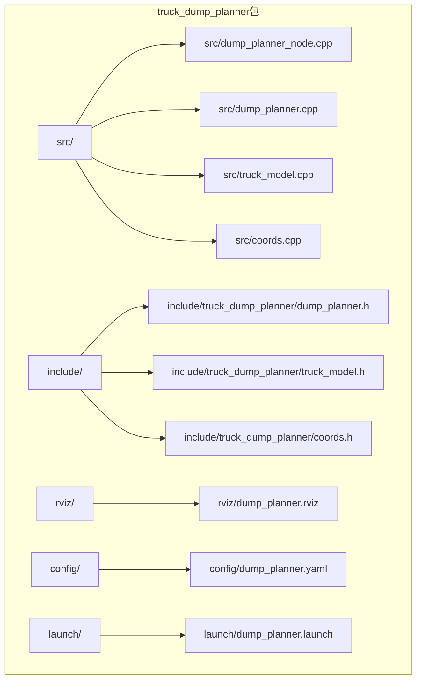
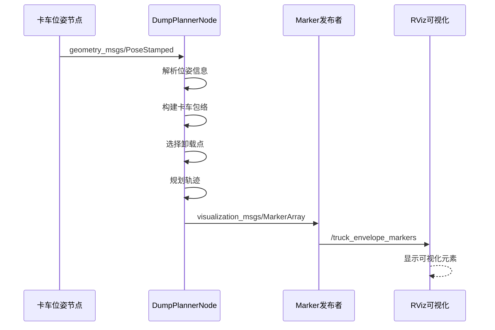
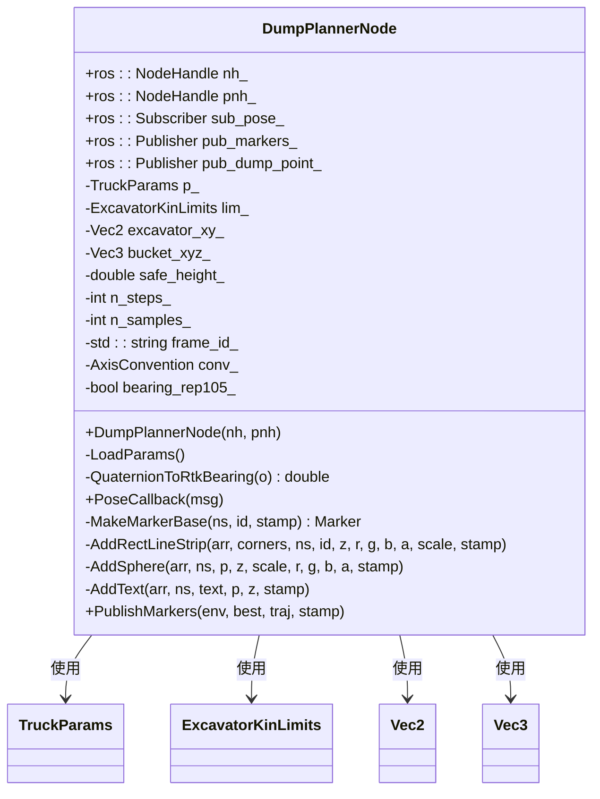
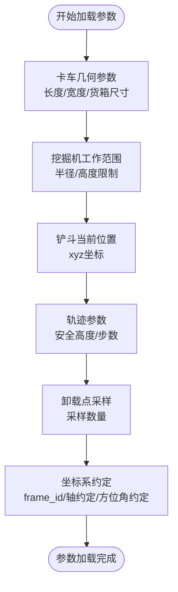
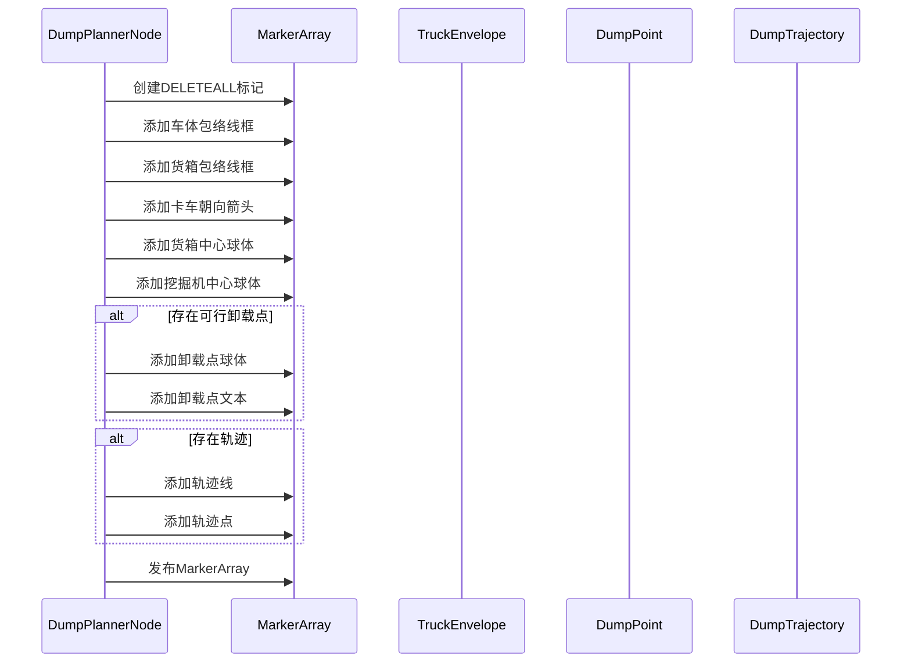

# RViz可视化配置

<cite>
**本文档引用的文件**
- [dump_planner.rviz](file://src/truck_dump_planner/rviz/dump_planner.rviz)
- [dump_planner_node.cpp](file://src/truck_dump_planner/src/dump_planner_node.cpp)
- [dump_planner.h](file://src/truck_dump_planner/include/truck_dump_planner/dump_planner.h)
- [dump_planner.cpp](file://src/truck_dump_planner/src/dump_planner.cpp)
- [truck_model.h](file://src/truck_dump_planner/include/truck_dump_planner/truck_model.h)
- [truck_model.cpp](file://src/truck_dump_planner/src/truck_model.cpp)
- [coords.h](file://src/truck_dump_planner/include/truck_dump_planner/coords.h)
- [coords.cpp](file://src/truck_dump_planner/src/coords.cpp)
- [dump_planner.yaml](file://src/truck_dump_planner/config/dump_planner.yaml)
- [dump_planner.launch](file://src/truck_dump_planner/launch/dump_planner.launch)
</cite>

## 目录
1. [简介](#简介)
2. [项目结构](#项目结构)
3. [核心组件](#核心组件)
4. [架构概览](#架构概览)
5. [详细组件分析](#详细组件分析)
6. [依赖关系分析](#依赖关系分析)
7. [性能考虑](#性能考虑)
8. [故障排除指南](#故障排除指南)
9. [结论](#结论)
10. [附录](#附录)

## 简介

本文件详细介绍RViz可视化系统的配置和使用，重点说明轨迹规划结果的可视化展示和配置方法。该系统通过ROS节点实时发布卡车包络、卸载点和轨迹信息，在RViz中进行可视化展示。

## 项目结构

该项目采用标准的ROS包结构，主要包含以下目录：



**图表来源**
- [dump_planner_node.cpp:1-341](file://src/truck_dump_planner/src/dump_planner_node.cpp#L1-L341)
- [dump_planner.rviz:1-131](file://src/truck_dump_planner/rviz/dump_planner.rviz#L1-L131)

**章节来源**
- [dump_planner_node.cpp:1-341](file://src/truck_dump_planner/src/dump_planner_node.cpp#L1-L341)
- [dump_planner.rviz:1-131](file://src/truck_dump_planner/rviz/dump_planner.rviz#L1-L131)

## 核心组件

### RViz配置文件分析

dump_planner.rviz是系统的核心可视化配置文件，包含以下关键设置：

#### 显示面板配置
- **Grid网格**: 透明度0.5，线条宽度0.03，XY平面，30个格子
- **Axes坐标轴**: 长度2，半径0.1，参考帧excavator
- **MarkerArray显示**: 订阅/topic/truck_envelope_markers

#### 视图配置
- **固定帧**: excavator
- **背景色**: 48; 48; 48 (深灰色)
- **相机视角**: Orbit模式，距离25，俯仰角0.7，偏航角0.5

#### 参数配置
- **帧率**: 30 FPS
- **队列大小**: 100
- **同步模式**: 关闭

**章节来源**
- [dump_planner.rviz:56-89](file://src/truck_dump_planner/rviz/dump_planner.rviz#L56-L89)

### 可视化元素说明

系统通过MarkerArray发布多种可视化元素：

#### 卡车包络线框
- **车体包络**: 灰色线框，厚度0.08，高度env.z + 0.5
- **货箱包络**: 橙色线框，厚度0.1，高度env.box_top_z

#### 卸载点标记
- **货箱中心**: 红色球体，半径0.25
- **挖掘机回转中心**: 黑色球体，半径0.4
- **卸载点**: 绿色球体，半径0.35，带有标注文本

#### 轨迹可视化
- **轨迹线**: 蓝色线，厚度0.06
- **轨迹点**: 白色点，尺寸0.08，透明度0.8

**章节来源**
- [dump_planner_node.cpp:222-310](file://src/truck_dump_planner/src/dump_planner_node.cpp#L222-L310)

## 架构概览

系统采用发布-订阅模式，通过ROS消息传递实现数据流：



**图表来源**
- [dump_planner_node.cpp:99-136](file://src/truck_dump_planner/src/dump_planner_node.cpp#L99-L136)
- [dump_planner_node.cpp:211-313](file://src/truck_dump_planner/src/dump_planner_node.cpp#L211-L313)

**章节来源**
- [dump_planner_node.cpp:1-341](file://src/truck_dump_planner/src/dump_planner_node.cpp#L1-L341)

## 详细组件分析

### DumpPlannerNode类分析

DumpPlannerNode是系统的核心类，负责处理位姿消息并发布可视化标记：



**图表来源**
- [dump_planner_node.cpp:25-331](file://src/truck_dump_planner/src/dump_planner_node.cpp#L25-L331)

#### 参数加载机制

系统通过LoadParams()方法从ROS参数服务器加载配置：



**图表来源**
- [dump_planner_node.cpp:42-84](file://src/truck_dump_planner/src/dump_planner_node.cpp#L42-L84)

**章节来源**
- [dump_planner_node.cpp:25-331](file://src/truck_dump_planner/src/dump_planner_node.cpp#L25-L331)

### PublishMarkers()方法详解

PublishMarkers()方法构建并发布完整的MarkerArray，包含以下步骤：

#### 标记数组初始化
1. **DELETEALL操作**: 清空历史标记
2. **车体包络线框**: 灰色线框，厚度0.08
3. **货箱包络线框**: 橙色线框，厚度0.1
4. **卡车朝向箭头**: 黄色箭头，长度2.0
5. **货箱中心球体**: 红色球体，半径0.25
6. **挖掘机中心球体**: 黑色球体，半径0.4
7. **卸载点球体**: 绿色球体，半径0.35
8. **轨迹线**: 蓝色线，厚度0.06
9. **轨迹点**: 白色点，尺寸0.08



**图表来源**
- [dump_planner_node.cpp:211-313](file://src/truck_dump_planner/src/dump_planner_node.cpp#L211-L313)

**章节来源**
- [dump_planner_node.cpp:211-313](file://src/truck_dump_planner/src/dump_planner_node.cpp#L211-L313)

### 数据模型分析

系统使用多个数据结构来表示不同的概念：

#### 卡车包络模型
- **TruckEnvelope**: 包含车体四角、货箱四角、中心点等几何信息
- **TruckParams**: 卡车几何参数（长度、宽度、货箱尺寸）

#### 轨迹规划模型
- **DumpTrajectory**: 包含轨迹点序列和卸载点信息
- **TrajectoryPoint**: 单个轨迹点的xyz坐标和阶段信息

```mermaid
erDiagram
TRUCK_ENVELOPE {
Vec2 center
double z
double heading_beta
double heading_rtk
Vec2[4] body_corners
Vec2[4] box_corners
Vec2 box_center
double box_top_z
Vec2 forward_dir
Vec2 right_dir
}
TRUCK_PARAMS {
double length
double width
double ref_offset
double box_length
double box_width
double box_center_offset
double box_height
}
DUMP_TRAJECTORY {
TrajectoryPoint[...] points
DumpPoint dump_point
}
TRAJECTORY_POINT {
double x
double y
double z
string phase
}
TRUCK_ENVELOPE ||--|| TRUCK_PARAMS : "使用"
DUMP_TRAJECTORY ||--|| TRAJECTORY_POINT : "包含"
```

**图表来源**
- [truck_model.h:32-44](file://src/truck_dump_planner/include/truck_dump_planner/truck_model.h#L32-L44)
- [dump_planner.h:29-40](file://src/truck_dump_planner/include/truck_dump_planner/dump_planner.h#L29-L40)

**章节来源**
- [truck_model.h:32-44](file://src/truck_dump_planner/include/truck_dump_planner/truck_model.h#L32-L44)
- [dump_planner.h:37-40](file://src/truck_dump_planner/include/truck_dump_planner/dump_planner.h#L37-L40)

## 依赖关系分析

系统的主要依赖关系如下：

```mermaid
graph TB
subgraph "ROS依赖"
A[rospy] --> B[geometry_msgs]
A --> C[visualization_msgs]
A --> D[tf2]
A --> E[tf2_geometry_msgs]
end
subgraph "内部模块"
F[dump_planner_node] --> G[dump_planner]
F --> H[truck_model]
F --> I[coords]
G --> H
G --> I
H --> I
end
subgraph "配置文件"
J[dump_planner.yaml] --> F
K[dump_planner.launch] --> F
L[dump_planner.rviz] --> M[RViz]
end
F --> N[/truck_envelope_markers]
F --> O[/dump_point]
```

**图表来源**
- [dump_planner_node.cpp:10-23](file://src/truck_dump_planner/src/dump_planner_node.cpp#L10-L23)
- [dump_planner_node.cpp:19-21](file://src/truck_dump_planner/src/dump_planner_node.cpp#L19-L21)

**章节来源**
- [dump_planner_node.cpp:10-23](file://src/truck_dump_planner/src/dump_planner_node.cpp#L10-L23)

## 性能考虑

### 可视化性能优化

1. **标记数量控制**: 通过合理设置n_steps参数控制轨迹点数量
2. **颜色透明度**: 使用适当的alpha值平衡可见性和性能
3. **缩放比例**: 优化scale参数减少渲染开销
4. **更新频率**: 控制发布频率避免过度更新

### 内存管理

- **DELETEALL操作**: 每次发布前清理历史标记
- **队列大小**: 设置合理的队列大小(100)
- **参数缓存**: 避免重复计算相同的几何变换

## 故障排除指南

### 常见问题及解决方案

#### RViz无法显示标记
1. **检查话题订阅**: 确认订阅了正确的topic名称
2. **验证坐标系**: 确保frame_id设置正确
3. **检查权限**: 确认有访问相应话题的权限

#### 标记显示异常
1. **颜色配置**: 检查RGBA值的有效性(0-1范围)
2. **缩放比例**: 调整scale参数确保可见性
3. **透明度设置**: 适当调整alpha值

#### 性能问题
1. **降低刷新率**: 减少n_steps参数
2. **简化几何**: 减少复杂形状的使用
3. **优化视图**: 调整相机位置和距离

**章节来源**
- [dump_planner_node.cpp:31-36](file://src/truck_dump_planner/src/dump_planner_node.cpp#L31-L36)
- [dump_planner.rviz:82-89](file://src/truck_dump_planner/rviz/dump_planner.rviz#L82-L89)

## 结论

本RViz可视化系统提供了完整的轨迹规划结果展示功能，通过精心设计的配置文件和高效的标记发布机制，实现了直观的三维可视化效果。系统支持多种可视化元素，包括包络线框、卸载点标记、轨迹线等，并提供了灵活的配置选项以适应不同的应用场景。

## 附录

### 配置参数说明

#### dump_planner.yaml参数详解
- **truck/**: 卡车几何参数，单位米
- **excavator/**: 挖掘机工作范围参数
- **bucket/**: 铲斗当前位置参数
- **trajectory/**: 轨迹规划参数
- **dump/**: 卸载点采样参数
- **frame_id**: 发布marker的坐标系
- **axis_convention**: 坐标轴约定
- **bearing_convention**: 方位角约定

#### dump_planner.rviz显示选项
- **Grid**: 地面网格，用于定位参考
- **Axes**: 坐标轴指示器
- **MarkerArray**: 主要的可视化显示组件

**章节来源**
- [dump_planner.yaml:1-43](file://src/truck_dump_planner/config/dump_planner.yaml#L1-L43)
- [dump_planner.rviz:56-89](file://src/truck_dump_planner/rviz/dump_planner.rviz#L56-L89)