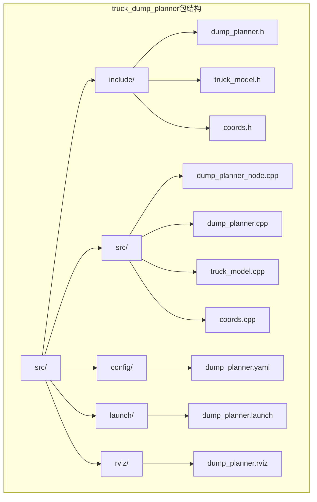
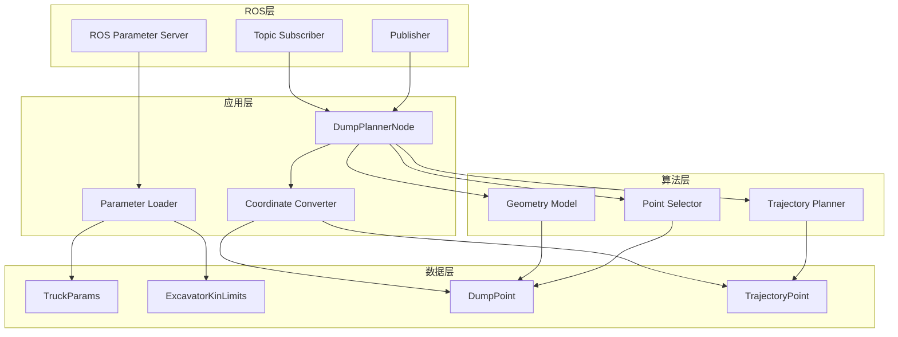
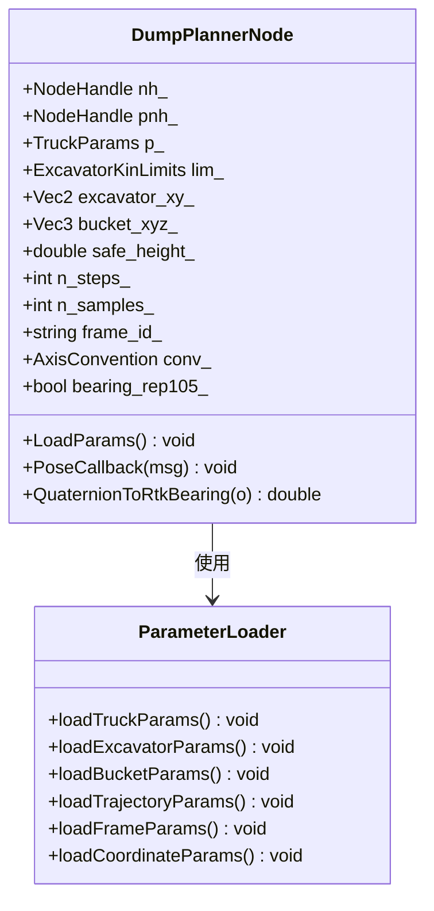
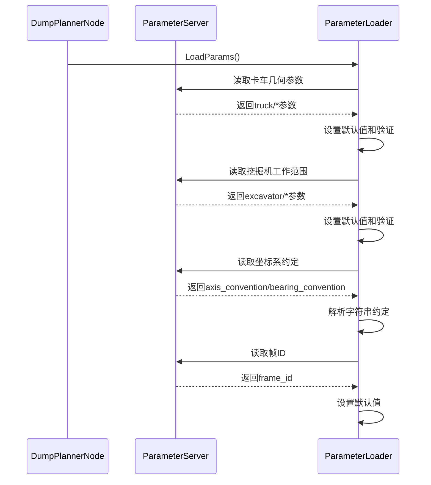
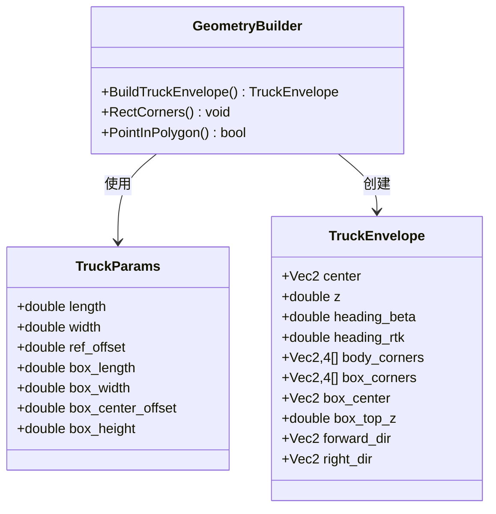
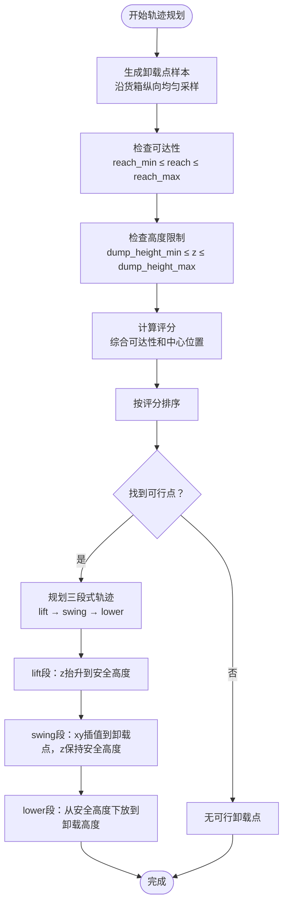
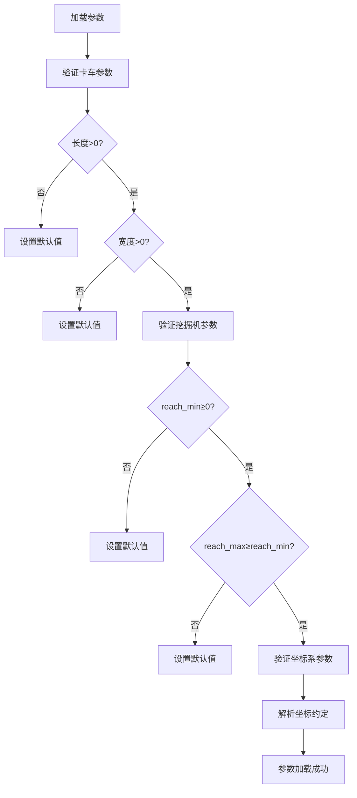
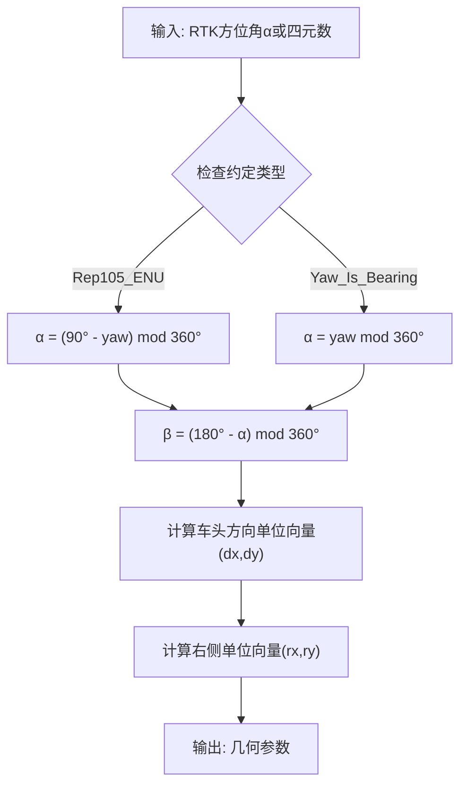
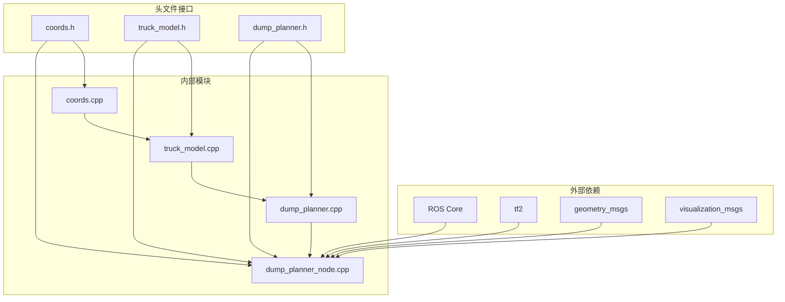

# 参数管理系统

<cite>
**本文档引用的文件**
- [dump_planner.yaml](file://src/truck_dump_planner/config/dump_planner.yaml)
- [dump_planner_node.cpp](file://src/truck_dump_planner/src/dump_planner_node.cpp)
- [dump_planner.h](file://src/truck_dump_planner/include/truck_dump_planner/dump_planner.h)
- [dump_planner.cpp](file://src/truck_dump_planner/src/dump_planner.cpp)
- [truck_model.h](file://src/truck_dump_planner/include/truck_dump_planner/truck_model.h)
- [truck_model.cpp](file://src/truck_dump_planner/src/truck_model.cpp)
- [coords.h](file://src/truck_dump_planner/include/truck_dump_planner/coords.h)
- [coords.cpp](file://src/truck_dump_planner/src/coords.cpp)
- [dump_planner.launch](file://src/truck_dump_planner/launch/dump_planner.launch)
- [dump_planner.rviz](file://src/truck_dump_planner/rviz/dump_planner.rviz)
- [package.xml](file://src/truck_dump_planner/package.xml)
- [CMakeLists.txt](file://src/truck_dump_planner/CMakeLists.txt)
</cite>

## 目录
1. [简介](#简介)
2. [项目结构](#项目结构)
3. [核心组件](#核心组件)
4. [架构概览](#架构概览)
5. [详细组件分析](#详细组件分析)
6. [参数配置详解](#参数配置详解)
7. [参数加载机制](#参数加载机制)
8. [坐标系约定配置](#坐标系约定配置)
9. [依赖关系分析](#依赖关系分析)
10. [性能考虑](#性能考虑)
11. [故障排除指南](#故障排除指南)
12. [结论](#结论)

## 简介

本参数管理系统是无人挖掘机装车轨迹规划ROS包的核心组成部分，负责管理所有运行时参数配置。该系统实现了完整的参数加载、验证和动态更新机制，支持多种坐标系约定和RTK方位角转换，为轨迹规划提供精确的几何参数和工作限制。

系统采用模块化设计，将参数管理与业务逻辑分离，确保了良好的可维护性和可扩展性。通过ROS参数服务器，用户可以轻松调整各种配置参数，实现针对不同工况的优化。

## 项目结构

该项目采用标准的ROS包结构，主要包含以下目录和文件：



**图表来源**
- [CMakeLists.txt:1-52](file://src/truck_dump_planner/CMakeLists.txt#L1-L52)
- [package.xml:1-20](file://src/truck_dump_planner/package.xml#L1-L20)

**章节来源**
- [CMakeLists.txt:1-52](file://src/truck_dump_planner/CMakeLists.txt#L1-L52)
- [package.xml:1-20](file://src/truck_dump_planner/package.xml#L1-L20)

## 核心组件

系统由四个核心组件构成，每个组件都有明确的职责分工：

### 参数管理组件
- **职责**: 负责从ROS参数服务器加载和管理所有配置参数
- **实现**: 通过NodeHandle的param()方法实现参数读取和类型转换
- **特点**: 支持默认值设置、类型安全和运行时验证

### 几何模型组件
- **职责**: 提供卡车几何建模和包络计算功能
- **实现**: TruckParams结构体存储几何参数，TruckEnvelope描述包络状态
- **特点**: 支持不同坐标系约定下的几何变换

### 轨迹规划组件
- **职责**: 实现卸载点选择和轨迹规划算法
- **实现**: SelectDumpPoint()和PlanDumpTrajectory()函数
- **特点**: 基于评分机制的智能卸载点选择，三段式平滑轨迹生成

### 坐标转换组件
- **职责**: 处理不同坐标系之间的转换和RTK方位角计算
- **实现**: AxisConvention枚举和相关的转换函数
- **特点**: 支持两种主流坐标系约定

**章节来源**
- [dump_planner_node.cpp:25-331](file://src/truck_dump_planner/src/dump_planner_node.cpp#L25-L331)
- [dump_planner.h:8-66](file://src/truck_dump_planner/include/truck_dump_planner/dump_planner.h#L8-L66)
- [truck_model.h:8-60](file://src/truck_dump_planner/include/truck_dump_planner/truck_model.h#L8-L60)
- [coords.h:4-37](file://src/truck_dump_planner/include/truck_dump_planner/coords.h#L4-L37)

## 架构概览

系统采用分层架构设计，实现了参数管理、业务逻辑和可视化展示的清晰分离：



**图表来源**
- [dump_planner_node.cpp:25-331](file://src/truck_dump_planner/src/dump_planner_node.cpp#L25-L331)
- [dump_planner.cpp:7-120](file://src/truck_dump_planner/src/dump_planner.cpp#L7-L120)
- [truck_model.cpp:22-46](file://src/truck_dump_planner/src/truck_model.cpp#L22-L46)

## 详细组件分析

### 参数加载器组件

参数加载器是系统的核心组件，负责从ROS参数服务器读取配置并进行类型转换：



**图表来源**
- [dump_planner_node.cpp:25-84](file://src/truck_dump_planner/src/dump_planner_node.cpp#L25-L84)

#### 参数加载流程



**图表来源**
- [dump_planner_node.cpp:42-84](file://src/truck_dump_planner/src/dump_planner_node.cpp#L42-L84)

**章节来源**
- [dump_planner_node.cpp:25-84](file://src/truck_dump_planner/src/dump_planner_node.cpp#L25-L84)

### 几何建模组件

几何建模组件负责将参数转换为实际的几何模型：



**图表来源**
- [truck_model.h:21-44](file://src/truck_dump_planner/include/truck_dump_planner/truck_model.h#L21-L44)
- [truck_model.cpp:22-46](file://src/truck_dump_planner/src/truck_model.cpp#L22-L46)

**章节来源**
- [truck_model.h:21-44](file://src/truck_dump_planner/include/truck_dump_planner/truck_model.h#L21-L44)
- [truck_model.cpp:22-46](file://src/truck_dump_planner/src/truck_model.cpp#L22-L46)

### 轨迹规划组件

轨迹规划组件实现了智能的卸载点选择和轨迹生成：



**图表来源**
- [dump_planner.cpp:7-61](file://src/truck_dump_planner/src/dump_planner.cpp#L7-L61)
- [dump_planner.cpp:82-117](file://src/truck_dump_planner/src/dump_planner.cpp#L82-L117)

**章节来源**
- [dump_planner.cpp:7-61](file://src/truck_dump_planner/src/dump_planner.cpp#L7-L61)
- [dump_planner.cpp:82-117](file://src/truck_dump_planner/src/dump_planner.cpp#L82-L117)

## 参数配置详解

### 卡车几何参数

卡车几何参数定义了车辆的物理尺寸和位置关系：

| 参数名称 | 默认值 | 单位 | 作用说明 |
|---------|--------|------|----------|
| truck/length | 8.5 | 米 | 卡车总长度（纵向） |
| truck/width | 3.0 | 米 | 卡车总宽度（横向） |
| truck/ref_offset | 0.0 | 米 | 车体几何中心相对参考点的纵向偏移 |
| truck/box_length | 5.0 | 米 | 货箱长度 |
| truck/box_width | 2.6 | 米 | 货箱宽度 |
| truck/box_center_offset | -1.0 | 米 | 货箱中心相对参考点的纵向偏移 |
| truck/box_height | 1.8 | 米 | 货箱侧壁高度 |

### 挖掘机工作限制

挖掘机工作限制参数定义了作业的安全边界：

| 参数名称 | 默认值 | 单位 | 作用说明 |
|---------|--------|------|----------|
| excavator/reach_min | 5.0 | 米 | 最小卸载半径 |
| excavator/reach_max | 12.0 | 米 | 最大卸载半径 |
| excavator/dump_height_max | 7.5 | 米 | 最大卸载高度 |
| excavator/dump_height_min | 1.0 | 米 | 最小卸载高度 |
| excavator/dump_clearance | 0.8 | 米 | 铲斗底门距货箱顶面间隙 |

### 铲斗当前位置

铲斗当前位置参数定义了轨迹规划的起点：

| 参数名称 | 默认值 | 单位 | 作用说明 |
|---------|--------|------|----------|
| bucket/x | -3.0 | 米 | 铲斗当前x坐标（挖掘机系） |
| bucket/y | -2.0 | 米 | 铲斗当前y坐标（挖掘机系） |
| bucket/z | 1.5 | 米 | 铲斗当前z坐标（挖掘机系） |

### 轨迹规划参数

轨迹规划参数控制轨迹生成的质量和性能：

| 参数名称 | 默认值 | 单位 | 作用说明 |
|---------|--------|------|----------|
| trajectory/safe_height | 6.0 | 米 | 回转安全高度（需高于驾驶室/货箱顶面） |
| trajectory/n_steps | 40 | 个 | 轨迹离散点数量 |

### 卸载点采样

卸载点采样参数控制候选点的数量和分布：

| 参数名称 | 默认值 | 单位 | 作用说明 |
|---------|--------|------|----------|
| dump/n_samples | 9 | 个 | 沿货箱纵向采样点数 |

### 坐标系约定

坐标系约定参数定义了系统使用的坐标系标准：

| 参数名称 | 默认值 | 可选值 | 作用说明 |
|---------|--------|--------|----------|
| frame_id | excavator | 字符串 | 发布marker的坐标系名称 |
| axis_convention | east_north | east_north / north_west | 地理坐标系约定 |
| bearing_convention | rep105_enu | rep105_enu / yaw_is_bearing | RTK方位角约定 |

**章节来源**
- [dump_planner.yaml:4-42](file://src/truck_dump_planner/config/dump_planner.yaml#L4-L42)

## 参数加载机制

### 默认值设置

系统实现了多层次的默认值设置机制：

1. **编译时默认值**: 在头文件中为结构体成员设置初始值
2. **运行时默认值**: 在参数加载函数中为ROS参数设置默认值
3. **类型安全转换**: 使用模板化的param()方法确保类型正确性

### 参数验证机制

系统实现了自动化的参数验证，确保参数的有效性：



**图表来源**
- [dump_planner_node.cpp:42-84](file://src/truck_dump_planner/src/dump_planner_node.cpp#L42-L84)

### 动态更新支持

系统支持参数的动态更新，但需要重启节点才能生效：

- **实时参数**: 通过ROS参数服务器动态修改
- **重启要求**: 某些参数变更需要重启节点以重新初始化
- **配置持久化**: 参数保存在yaml文件中，便于版本管理和备份

**章节来源**
- [dump_planner_node.cpp:42-84](file://src/truck_dump_planner/src/dump_planner_node.cpp#L42-L84)

## 坐标系约定配置

### 地理坐标系约定

系统支持两种主要的地理坐标系约定：

#### East-North约定 (默认)
- **x轴**: 朝向东（正东为+90°）
- **y轴**: 朝向北（正北为0°）
- **适用场景**: 大多数GPS和导航系统
- **数学表示**: 符合ENU（East-North-Up）坐标系

#### North-West约定
- **x轴**: 朝向北（正北为0°）
- **y轴**: 朝向西（正西为+90°）
- **适用场景**: 某些传统测量系统
- **数学表示**: 符合NED（North-East-Down）坐标系的变体

### RTK方位角约定

系统支持两种RTK方位角约定，用于处理不同的四元数编码方式：

#### Rep105_ENU约定
- **定义**: α = (90° - yaw) mod 360°
- **适用场景**: REP105标准，yaw为ENU坐标系下的方位角
- **转换公式**: β = (180° - α) mod 360°

#### Yaw_Is_Bearing约定
- **定义**: α = yaw mod 360°
- **适用场景**: 直接将四元数的yaw作为RTK方位角
- **转换公式**: β = (180° - α) mod 360°

### 坐标转换算法



**图表来源**
- [coords.cpp:10-16](file://src/truck_dump_planner/src/coords.cpp#L10-L16)
- [coords.cpp:18-43](file://src/truck_dump_planner/src/coords.cpp#L18-L43)

**章节来源**
- [coords.h:20-32](file://src/truck_dump_planner/include/truck_dump_planner/coords.h#L20-L32)
- [coords.cpp:10-49](file://src/truck_dump_planner/src/coords.cpp#L10-L49)

## 依赖关系分析

系统具有清晰的依赖层次结构，实现了良好的模块化设计：



**图表来源**
- [CMakeLists.txt:11-17](file://src/truck_dump_planner/CMakeLists.txt#L11-L17)
- [package.xml:14-18](file://src/truck_dump_planner/package.xml#L14-L18)

### 模块耦合度分析

- **低耦合**: 参数管理与业务逻辑分离，通过接口通信
- **高内聚**: 相关功能集中在同一模块内，职责单一
- **接口清晰**: 头文件定义明确的公共接口
- **依赖可控**: 外部依赖通过CMakeLists.txt集中管理

**章节来源**
- [CMakeLists.txt:11-22](file://src/truck_dump_planner/CMakeLists.txt#L11-L22)
- [package.xml:14-18](file://src/truck_dump_planner/package.xml#L14-L18)

## 性能考虑

### 参数访问优化

系统采用了高效的参数访问策略：

- **批量加载**: 在节点初始化时一次性加载所有参数
- **缓存机制**: 将参数存储在类成员变量中，避免重复查询
- **类型缓存**: 避免频繁的类型转换操作

### 内存管理

- **栈分配**: 参数存储在栈上，减少内存碎片
- **智能指针**: 在需要时使用智能指针管理动态内存
- **RAII原则**: 遵循资源获取即初始化原则

### 计算复杂度

- **参数加载**: O(1) 时间复杂度，固定数量的参数读取
- **轨迹规划**: O(n_samples × n_steps) 时间复杂度
- **几何计算**: O(1) 时间复杂度，固定数量的几何变换

## 故障排除指南

### 常见参数配置问题

#### 参数未生效
**症状**: 修改参数后系统行为没有变化  
**原因**: 参数需要重启节点才能生效  
**解决方法**: 重启dump_planner_node节点

#### 坐标系转换错误
**症状**: 卡车位置显示异常或轨迹规划失败  
**原因**: axis_convention或bearing_convention配置错误  
**解决方法**: 检查坐标系约定与实际数据格式匹配

#### 参数越界
**症状**: 系统报错或行为异常  
**原因**: 参数值超出有效范围  
**解决方法**: 检查参数范围并在有效范围内调整

### 调试技巧

#### 参数验证
```bash
# 查看所有参数
rosparam list

# 查看特定参数
rosparam get /dump_planner_node/truck/length

# 验证参数类型
rosparam get /dump_planner_node/frame_id
```

#### 日志分析
系统提供了详细的日志输出：
- 成功路径: INFO级别的状态报告
- 失败路径: WARN级别的警告信息
- 调试信息: THROTTLE限制的频率控制

**章节来源**
- [dump_planner_node.cpp:127-135](file://src/truck_dump_planner/src/dump_planner_node.cpp#L127-L135)

## 结论

本参数管理系统为无人挖掘机装车轨迹规划提供了完整、灵活且可靠的配置解决方案。系统的主要优势包括：

### 设计优势
- **模块化设计**: 清晰的职责分离和接口定义
- **类型安全**: 编译时和运行时的双重类型检查
- **灵活性**: 支持多种坐标系约定和参数动态更新
- **可维护性**: 良好的代码组织和文档注释

### 实用价值
- **易于配置**: 通过yaml文件集中管理所有参数
- **可视化反馈**: RViz集成提供直观的结果展示
- **调试友好**: 丰富的日志输出和错误提示
- **性能优化**: 高效的参数访问和计算算法

### 扩展潜力
系统为未来的功能扩展预留了充足的空间：
- 新的几何参数添加
- 更复杂的轨迹规划算法
- 多种坐标系的统一处理
- 实时参数调整和热重载

通过合理配置和使用，该参数管理系统能够满足各种无人挖掘机装车作业场景的需求，为实现自动化和智能化的工程机械操作提供坚实的技术基础。