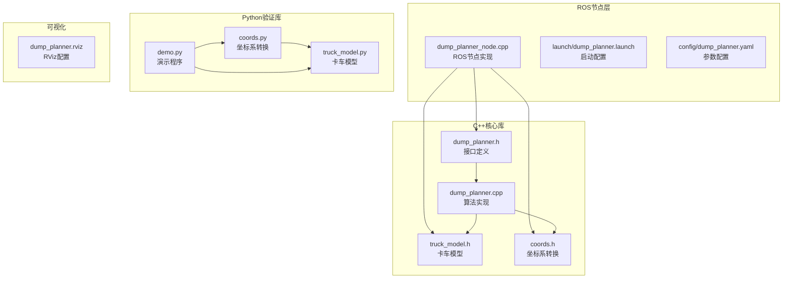
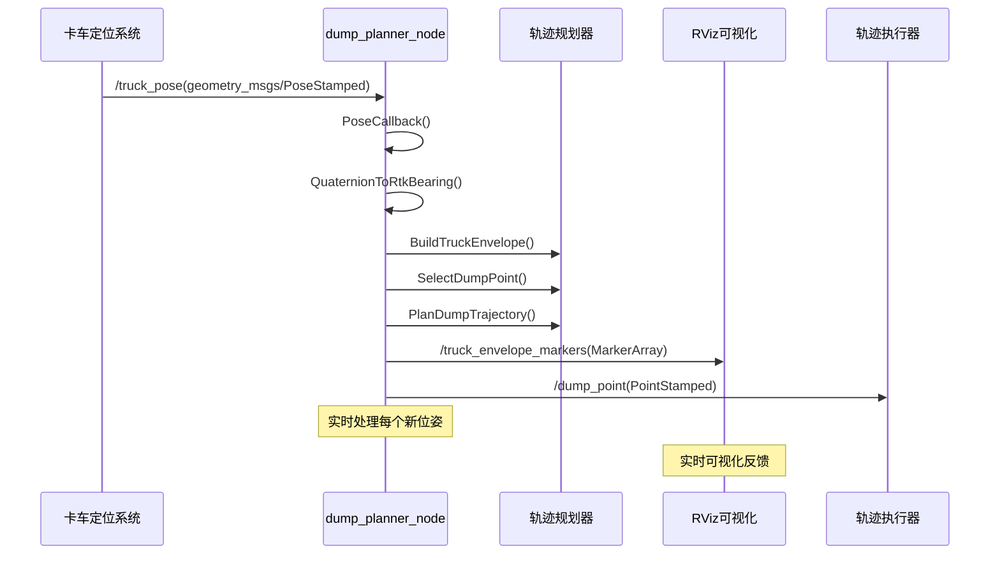
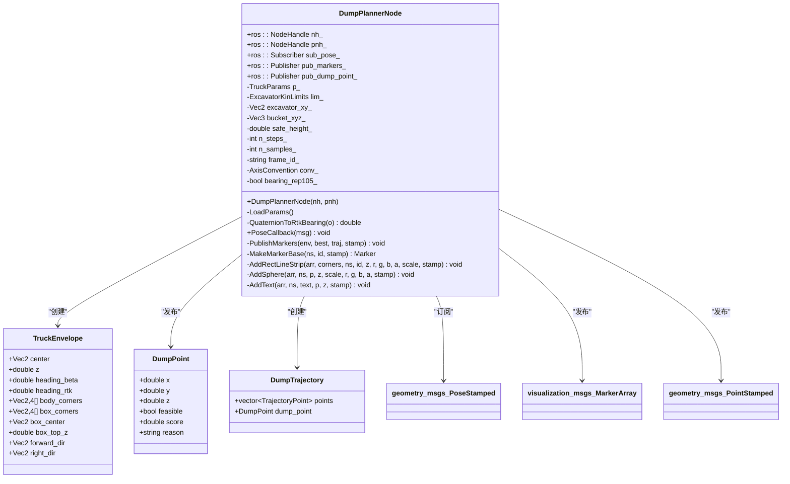
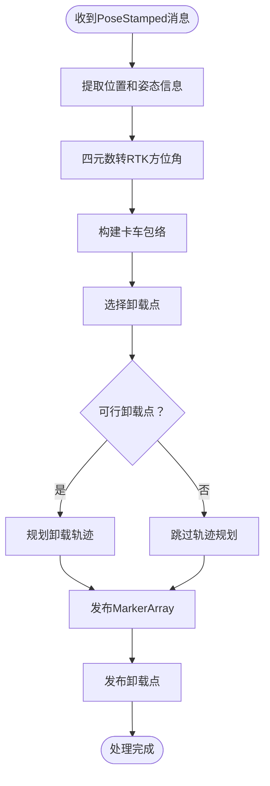
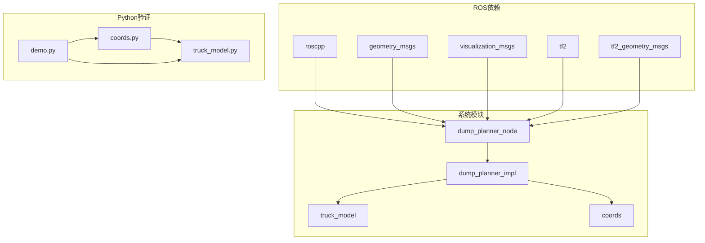

# 话题通信设计

<cite>
**本文档引用的文件**
- [dump_planner_node.cpp](file://src/truck_dump_planner/src/dump_planner_node.cpp)
- [dump_planner.h](file://src/truck_dump_planner/include/truck_dump_planner/dump_planner.h)
- [dump_planner.cpp](file://src/truck_dump_planner/src/dump_planner.cpp)
- [truck_model.h](file://src/truck_dump_planner/include/truck_dump_planner/truck_model.h)
- [coords.h](file://src/truck_dump_planner/include/truck_dump_planner/coords.h)
- [dump_planner.launch](file://src/truck_dump_planner/launch/dump_planner.launch)
- [dump_planner.yaml](file://src/truck_dump_planner/config/dump_planner.yaml)
- [package.xml](file://src/truck_dump_planner/package.xml)
- [dump_planner.rviz](file://src/truck_dump_planner/rviz/dump_planner.rviz)
- [coords.py](file://src/truck_envelope/coords.py)
- [truck_model.py](file://src/truck_envelope/truck_model.py)
- [demo.py](file://src/demo.py)
</cite>

## 目录
1. [简介](#简介)
2. [项目结构](#项目结构)
3. [核心组件](#核心组件)
4. [架构概览](#架构概览)
5. [详细组件分析](#详细组件分析)
6. [依赖关系分析](#依赖关系分析)
7. [性能考虑](#性能考虑)
8. [故障排除指南](#故障排除指南)
9. [结论](#结论)

## 简介

本文档详细说明了无人挖掘机轨迹规划系统中的ROS话题通信设计。该系统实现了基于RTK定位的卡车位姿估计到挖掘机卸载轨迹规划的完整流程，包括话题订阅、数据处理、可视化输出等功能。系统采用C++实现核心算法，并提供Python版本用于验证和演示。

## 项目结构

无人挖掘机轨迹规划系统采用模块化设计，主要包含以下核心模块：



**图表来源**
- [dump_planner_node.cpp:1-341](file://src/truck_dump_planner/src/dump_planner_node.cpp#L1-L341)
- [dump_planner.h:1-66](file://src/truck_dump_planner/include/truck_dump_planner/dump_planner.h#L1-L66)
- [dump_planner.cpp:1-120](file://src/truck_dump_planner/src/dump_planner.cpp#L1-L120)

**章节来源**
- [dump_planner_node.cpp:1-341](file://src/truck_dump_planner/src/dump_planner_node.cpp#L1-L341)
- [dump_planner.launch:1-26](file://src/truck_dump_planner/launch/dump_planner.launch#L1-L26)
- [dump_planner.yaml:1-43](file://src/truck_dump_planner/config/dump_planner.yaml#L1-L43)

## 核心组件

### 输入话题设计

系统仅有一个主要输入话题：`/truck_pose`，采用`geometry_msgs/PoseStamped`消息格式。

#### 几何消息格式详解

`geometry_msgs/PoseStamped`消息包含两个关键部分：

**Header部分** (`std_msgs/Header`)
- `stamp`: ROS时间戳，用于消息时序同步
- `frame_id`: 坐标系标识符，表示消息中数据的参考坐标系

**Pose部分** (`geometry_msgs/Pose`)
- `position`: 卡车中心在挖掘机坐标系下的三维位置
  - `x`: 卡车中心沿车体纵向（前进方向）距离（米）
  - `y`: 卡车中心沿车体横向（右侧方向）距离（米）
  - `z`: 卡车地面高度（米）
- `orientation`: 四元数表示的卡车航向信息
  - `x`, `y`, `z`, `w`: 四元数的四个分量

#### 数据内容说明

根据系统设计，输入数据具有以下物理意义：

| 参数 | 类型 | 单位 | 说明 |
|------|------|------|------|
| position.x | double | 米 | 卡车中心纵向位置（车头方向为正） |
| position.y | double | 米 | 卡车中心横向位置（右侧方向为正） |
| position.z | double | 米 | 卡车地面高度 |
| orientation | Quaternion | 无量纲 | 卡车航向的四元数表示 |

**章节来源**
- [dump_planner_node.cpp:3-8](file://src/truck_dump_planner/src/dump_planner_node.cpp#L3-L8)
- [dump_planner_node.cpp:99-103](file://src/truck_dump_planner/src/dump_planner_node.cpp#L99-L103)

### 输出话题设计

系统提供两个主要输出话题：

#### 1. `/truck_envelope_markers` (visualization_msgs/MarkerArray)

用于RViz可视化显示的复合消息类型，包含多个独立的Marker对象。

**MarkerArray结构**：
- `markers[]`: visualization_msgs/Marker数组
- 每个Marker代表不同的可视化元素

**可视化元素类型**：

| Marker类型 | 用途 | 颜色 | 标签 |
|------------|------|------|------|
| LINE_STRIP | 车体包络轮廓 | 灰色 | "truck_body" |
| LINE_STRIP | 货箱包络轮廓 | 橙色 | "truck_box" |
| ARROW | 车头方向指示 | 黄色 | "truck_heading" |
| SPHERE | 货箱中心标记 | 红色 | "box_center" |
| SPHERE | 挖掘机回转中心 | 黑色 | "excavator" |
| SPHERE | 卸载点标记 | 绿色 | "dump_point" |
| TEXT_VIEW_FACING | 卸载点标签 | 白色 | "dump_label" |
| LINE_STRIP | 卸载轨迹路径 | 蓝色 | "trajectory" |
| POINTS | 轨迹离散点 | 白色 | "trajectory_pts" |

#### 2. `/dump_point` (geometry_msgs/PointStamped)

单一卸载点的几何消息，用于后续轨迹执行。

**PointStamped结构**：
- `header`: 时间戳和坐标系信息
- `point`: 三维空间中的单一点坐标

**数据内容**：
- `point.x`, `point.y`, `point.z`: 卸载点在挖掘机坐标系下的三维坐标

**章节来源**
- [dump_planner_node.cpp:30-36](file://src/truck_dump_planner/src/dump_planner_node.cpp#L30-L36)
- [dump_planner_node.cpp:211-313](file://src/truck_dump_planner/src/dump_planner_node.cpp#L211-L313)

## 架构概览

系统采用典型的ROS节点架构，实现从感知到决策再到执行的完整流程：



**图表来源**
- [dump_planner_node.cpp:99-136](file://src/truck_dump_planner/src/dump_planner_node.cpp#L99-L136)
- [dump_planner.cpp:7-75](file://src/truck_dump_planner/src/dump_planner.cpp#L7-L75)

## 详细组件分析

### DumpPlannerNode类设计



**图表来源**
- [dump_planner_node.cpp:25-331](file://src/truck_dump_planner/src/dump_planner_node.cpp#L25-L331)
- [truck_model.h:32-44](file://src/truck_dump_planner/include/truck_dump_planner/truck_model.h#L32-L44)
- [dump_planner.h:19-40](file://src/truck_dump_planner/include/truck_dump_planner/dump_planner.h#L19-L40)

### 话题同步机制

系统采用基于时间戳的同步机制：



**图表来源**
- [dump_planner_node.cpp:99-136](file://src/truck_dump_planner/src/dump_planner_node.cpp#L99-L136)
- [dump_planner.cpp:63-75](file://src/truck_dump_planner/src/dump_planner.cpp#L63-L75)

### 消息时序处理

系统确保消息处理的时序一致性：

1. **时间戳保持**: 所有发布的消息都保留原始PoseStamped的时间戳
2. **实时处理**: 使用回调函数实时响应新的位姿更新
3. **状态更新**: 每次接收到新消息时重新计算所有中间结果

**章节来源**
- [dump_planner_node.cpp:119-135](file://src/truck_dump_planner/src/dump_planner_node.cpp#L119-L135)
- [dump_planner_node.cpp:212-219](file://src/truck_dump_planner/src/dump_planner_node.cpp#L212-L219)

### 数据流控制策略

系统采用"就绪即发布"的策略：

```mermaid
flowchart LR
subgraph "输入处理"
A[PoseCallback触发] --> B[参数加载]
B --> C[包络构建]
C --> D[卸载点选择]
end
subgraph "条件判断"
D --> E{可行性检查}
E --> |可行| F[轨迹规划]
E --> |不可行| G[警告日志]
end
subgraph "输出发布"
F --> H[MarkerArray发布]
G --> H
H --> I[卸载点发布(可行时)]
end
```

**图表来源**
- [dump_planner_node.cpp:99-136](file://src/truck_dump_planner/src/dump_planner_node.cpp#L99-L136)
- [dump_planner.cpp:63-75](file://src/truck_dump_planner/src/dump_planner.cpp#L63-L75)

**章节来源**
- [dump_planner_node.cpp:127-135](file://src/truck_dump_planner/src/dump_planner_node.cpp#L127-L135)
- [dump_planner_node.cpp:211-313](file://src/truck_dump_planner/src/dump_planner_node.cpp#L211-L313)

## 依赖关系分析

系统依赖关系清晰，遵循ROS最佳实践：



**图表来源**
- [package.xml:12-18](file://src/truck_dump_planner/package.xml#L12-L18)
- [dump_planner_node.cpp:10-21](file://src/truck_dump_planner/src/dump_planner_node.cpp#L10-L21)

**章节来源**
- [package.xml:12-18](file://src/truck_dump_planner/package.xml#L12-L18)
- [dump_planner_node.cpp:10-21](file://src/truck_dump_planner/src/dump_planner_node.cpp#L10-L21)

## 性能考虑

### 内存管理
- 所有数据结构使用栈分配，避免动态内存分配
- MarkerArray在每次发布前清空历史数据，防止内存泄漏

### 计算复杂度
- 包络构建：O(1) - 固定数量的几何计算
- 卸载点选择：O(n) - n为采样点数量
- 轨迹规划：O(n_steps) - 离散点数

### 发布频率控制
- 使用队列大小限制防止消息堆积
- 采用节流日志避免频繁输出

## 故障排除指南

### 常见问题诊断

1. **话题不匹配**
   - 检查`/truck_pose`话题名称是否正确
   - 确认消息类型为`geometry_msgs/PoseStamped`

2. **坐标系问题**
   - 验证`frame_id`设置是否正确
   - 检查坐标系约定配置

3. **可视化异常**
   - 确认RViz配置正确加载
   - 检查MarkerArray主题订阅

**章节来源**
- [dump_planner.launch:18-20](file://src/truck_dump_planner/launch/dump_planner.launch#L18-L20)
- [dump_planner.rviz:82-89](file://src/truck_dump_planner/rviz/dump_planner.rviz#L82-L89)

## 结论

无人挖掘机轨迹规划系统的ROS话题设计体现了以下特点：

1. **简洁高效**: 仅使用必要的输入输出话题，减少系统复杂度
2. **实时性强**: 基于回调的异步处理模式，适合实时应用场景
3. **可视化友好**: 提供丰富的RViz可视化输出，便于调试和验证
4. **参数灵活**: 通过参数文件实现配置管理，便于部署调整
5. **代码质量**: 采用模块化设计，接口清晰，易于维护和扩展

该设计成功实现了从RTK位姿到卸载轨迹的完整链路，为无人挖掘机作业提供了可靠的技术支撑。