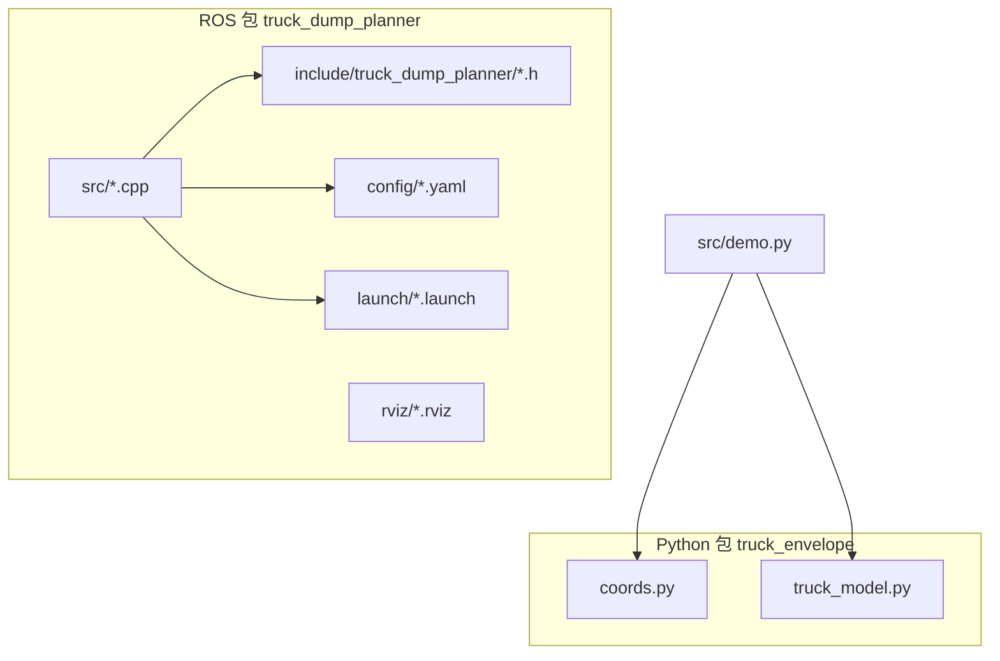
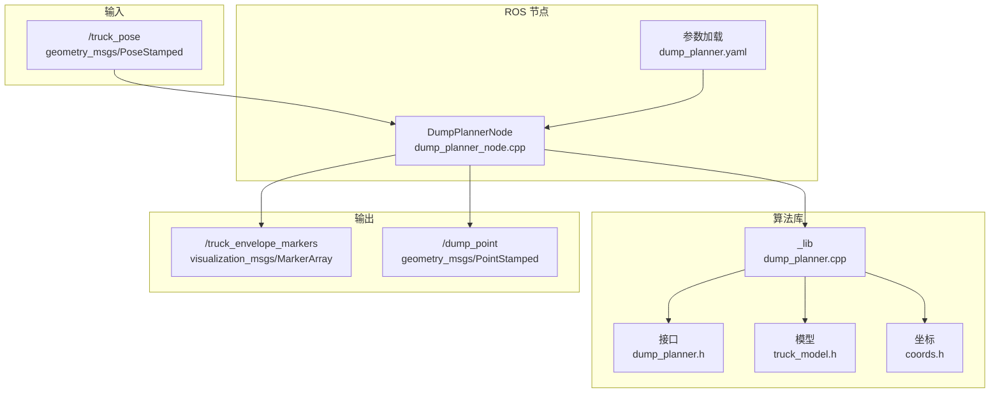
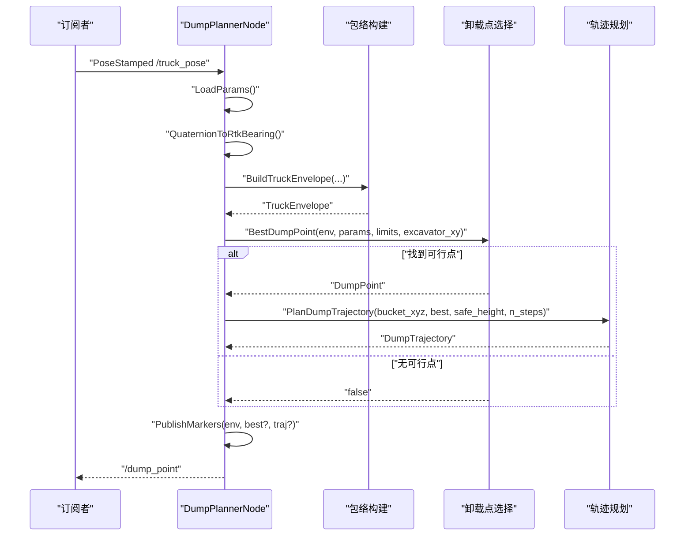
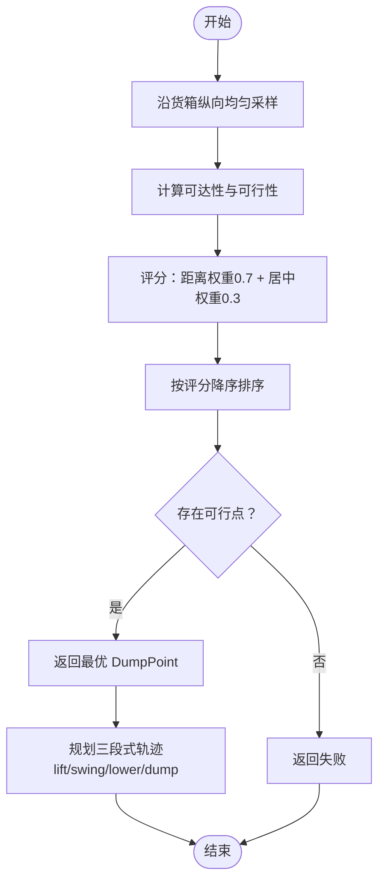
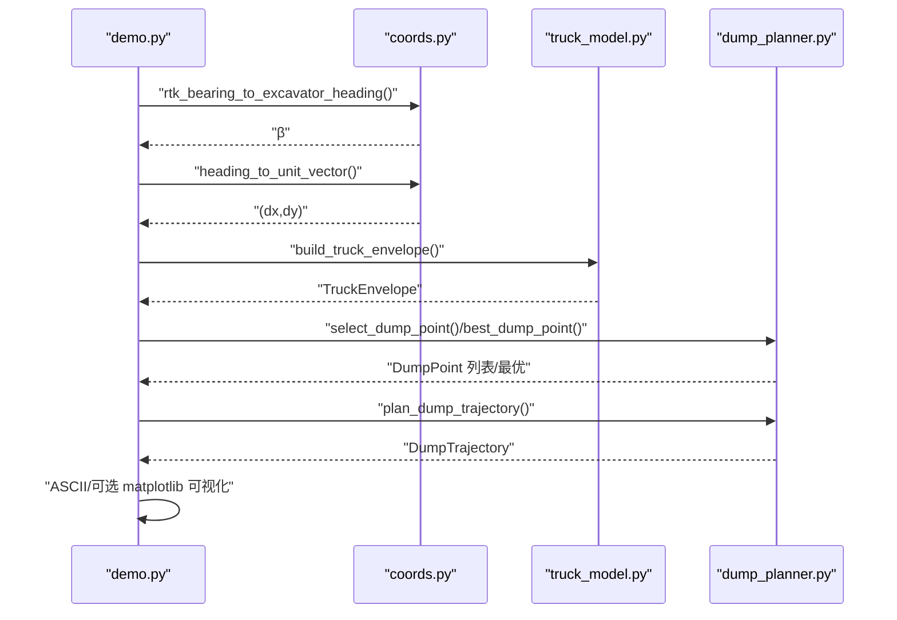
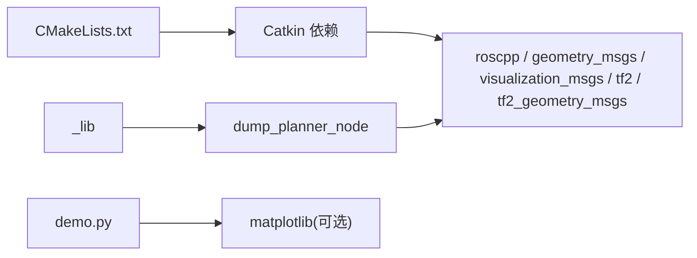

# 开发与测试

<cite>
**本文引用的文件**
- [CMakeLists.txt](file://src/truck_dump_planner/CMakeLists.txt)
- [package.xml](file://src/truck_dump_planner/package.xml)
- [dump_planner.cpp](file://src/truck_dump_planner/src/dump_planner.cpp)
- [dump_planner_node.cpp](file://src/truck_dump_planner/src/dump_planner_node.cpp)
- [dump_planner.h](file://src/truck_dump_planner/include/truck_dump_planner/dump_planner.h)
- [coords.h](file://src/truck_dump_planner/include/truck_dump_planner/coords.h)
- [truck_model.h](file://src/truck_dump_planner/include/truck_dump_planner/truck_model.h)
- [dump_planner.yaml](file://src/truck_dump_planner/config/dump_planner.yaml)
- [dump_planner.launch](file://src/truck_dump_planner/launch/dump_planner.launch)
- [demo.py](file://src/demo.py)
- [coords.py](file://src/truck_envelope/coords.py)
- [truck_model.py](file://src/truck_envelope/truck_model.py)
</cite>

## 目录
1. [简介](#简介)
2. [项目结构](#项目结构)
3. [核心组件](#核心组件)
4. [架构总览](#架构总览)
5. [详细组件分析](#详细组件分析)
6. [依赖分析](#依赖分析)
7. [性能考虑](#性能考虑)
8. [故障排查指南](#故障排查指南)
9. [结论](#结论)
10. [附录](#附录)

## 简介
本指南面向无人挖掘机轨迹规划系统（装车卸载点选择与轨迹规划）的开发与测试，覆盖以下内容：
- 开发环境搭建与编译构建流程
- 单元测试与集成测试方法
- 演示程序使用与验证流程
- 代码质量保证、调试技巧与性能分析
- 版本管理、持续集成与部署最佳实践

该系统由 ROS 节点驱动，核心算法独立于 ROS，便于单元测试与复用。

## 项目结构
仓库采用 Catkin 工作空间组织，主要目录与职责如下：
- src/truck_dump_planner：ROS 包，包含核心 C++ 算法库与 ROS 节点
  - include/truck_dump_planner：公共头文件（数据结构、接口声明）
  - src：C++ 实现（坐标转换、包络建模、轨迹规划、ROS 节点）
  - config：节点参数
  - launch：启动文件（含测试位姿与 RViz）
  - rviz：RViz 配置
- src/truck_envelope：Python 包，提供坐标系转换与包络建模的纯 Python 实现，便于演示与验证
- src/demo.py：端到端演示脚本，验证 RTK/航向转换、包络、卸载点与轨迹

图表来源
- [CMakeLists.txt:1-52](file://src/truck_dump_planner/CMakeLists.txt#L1-L52)
- [package.xml:1-20](file://src/truck_dump_planner/package.xml#L1-L20)
- [dump_planner_node.cpp:1-341](file://src/truck_dump_planner/src/dump_planner_node.cpp#L1-L341)
- [demo.py:1-249](file://src/demo.py#L1-L249)
- [coords.py:1-200](file://src/truck_envelope/coords.py#L1-L200)
- [truck_model.py:1-200](file://src/truck_envelope/truck_model.py#L1-L200)

章节来源
- [CMakeLists.txt:1-52](file://src/truck_dump_planner/CMakeLists.txt#L1-L52)
- [package.xml:1-20](file://src/truck_dump_planner/package.xml#L1-L20)

## 核心组件
- 数据结构与接口
  - 坐标与航向：角度常量、Wrap360、航向转换、轴约定、方向向量与右侧向量
  - 卡车模型：TruckParams、TruckEnvelope、包络构建、点在多边形内判断
  - 轨迹规划：DumpPoint、TrajectoryPoint、DumpTrajectory、轨迹规划与评分
- 算法实现
  - 卸载点候选生成与评分（沿货箱纵向均匀采样，结合可达性与评分）
  - 最优卸载点选择（优先可行、次优评分）
  - 三段式轨迹规划（抬升-回转-下放），半余弦平滑避免速度突变
- ROS 节点
  - 订阅卡车位姿（RTK 航向四元数）、参数加载、包络/卸载点/轨迹可视化、发布 MarkerArray 与卸载点

章节来源
- [dump_planner.h:1-66](file://src/truck_dump_planner/include/truck_dump_planner/dump_planner.h#L1-L66)
- [coords.h:1-37](file://src/truck_dump_planner/include/truck_dump_planner/coords.h#L1-L37)
- [truck_model.h:1-60](file://src/truck_dump_planner/include/truck_dump_planner/truck_model.h#L1-L60)
- [dump_planner.cpp:1-120](file://src/truck_dump_planner/src/dump_planner.cpp#L1-L120)
- [dump_planner_node.cpp:1-341](file://src/truck_dump_planner/src/dump_planner_node.cpp#L1-L341)

## 架构总览
系统分为三层：
- 独立算法层：C++/Python 提供坐标转换、包络建模、卸载点选择与轨迹规划
- ROS 接口层：ROS 节点订阅位姿消息、调用算法、发布可视化与卸载点
- 验证与演示层：Python 演示脚本与 RViz 可视化

图表来源
- [dump_planner_node.cpp:1-341](file://src/truck_dump_planner/src/dump_planner_node.cpp#L1-L341)
- [dump_planner.cpp:1-120](file://src/truck_dump_planner/src/dump_planner.cpp#L1-L120)
- [dump_planner.h:1-66](file://src/truck_dump_planner/include/truck_dump_planner/dump_planner.h#L1-L66)
- [truck_model.h:1-60](file://src/truck_dump_planner/include/truck_dump_planner/truck_model.h#L1-L60)
- [coords.h:1-37](file://src/truck_dump_planner/include/truck_dump_planner/coords.h#L1-L37)
- [dump_planner.yaml:1-43](file://src/truck_dump_planner/config/dump_planner.yaml#L1-L43)

## 详细组件分析

### 组件：DumpPlannerNode（ROS 节点）
职责与流程：
- 参数加载：从私有命名空间读取卡车几何、工作范围、轨迹与卸载点采样参数
- 位姿回调：四元数转 RTK 航向 → 挖掘机系航向 → 构建包络 → 选择最优卸载点 → 规划轨迹
- 可视化：发布 MarkerArray（车体/货箱包络、朝向箭头、中心点、卸载点、轨迹线与离散步数点）
- 输出：发布选定卸载点

图表来源
- [dump_planner_node.cpp:99-136](file://src/truck_dump_planner/src/dump_planner_node.cpp#L99-L136)
- [dump_planner_node.cpp:211-313](file://src/truck_dump_planner/src/dump_planner_node.cpp#L211-L313)
- [dump_planner.cpp:63-75](file://src/truck_dump_planner/src/dump_planner.cpp#L63-L75)
- [dump_planner.cpp:82-117](file://src/truck_dump_planner/src/dump_planner.cpp#L82-L117)

章节来源
- [dump_planner_node.cpp:1-341](file://src/truck_dump_planner/src/dump_planner_node.cpp#L1-L341)

### 组件：卸载点选择与轨迹规划
- 卸载点候选生成：沿货箱纵向均匀采样，计算与挖掘机回转中心距离，过滤可达性，评分融合距离与居中偏好
- 最优卸载点：按评分返回首个可行点
- 轨迹规划：三段式（抬升-回转-下放），每段使用半余弦曲线，避免加速度突变

图表来源
- [dump_planner.cpp:7-61](file://src/truck_dump_planner/src/dump_planner.cpp#L7-L61)
- [dump_planner.cpp:63-75](file://src/truck_dump_planner/src/dump_planner.cpp#L63-L75)
- [dump_planner.cpp:82-117](file://src/truck_dump_planner/src/dump_planner.cpp#L82-L117)

章节来源
- [dump_planner.cpp:1-120](file://src/truck_dump_planner/src/dump_planner.cpp#L1-L120)
- [dump_planner.h:10-61](file://src/truck_dump_planner/include/truck_dump_planner/dump_planner.h#L10-L61)

### 组件：Python 演示与验证
- 验证 RTK 航向与挖掘机系航向转换
- 验证航向到方向向量分解（x 东 y 北约定）
- 构建典型装车场景：包络、卸载点选择、轨迹规划
- ASCII 俯视图与可选 matplotlib 图形输出

图表来源
- [demo.py:50-149](file://src/demo.py#L50-L149)
- [coords.py:39-61](file://src/truck_envelope/coords.py#L39-L61)
- [coords.py:154-191](file://src/truck_envelope/coords.py#L154-L191)
- [truck_model.py:112-177](file://src/truck_envelope/truck_model.py#L112-L177)
- [truck_model.py:180-194](file://src/truck_envelope/truck_model.py#L180-L194)

章节来源
- [demo.py:1-249](file://src/demo.py#L1-L249)
- [coords.py:1-200](file://src/truck_envelope/coords.py#L1-L200)
- [truck_model.py:1-200](file://src/truck_envelope/truck_model.py#L1-L200)

## 依赖分析
- 编译与构建
  - CMake：定义 C++14 标准、Release 默认构建类型、查找 ROS 依赖、安装规则
  - Catkin：导出头文件路径与依赖项，安装库与可执行文件、共享资源（launch/config/rviz）
- 运行时依赖
  - ROS：roscpp、geometry_msgs、visualization_msgs、tf2、tf2_geometry_msgs
  - Python：matplotlib（可选，用于图形输出）

图表来源
- [CMakeLists.txt:11-22](file://src/truck_dump_planner/CMakeLists.txt#L11-L22)
- [package.xml:12-18](file://src/truck_dump_planner/package.xml#L12-L18)
- [dump_planner_node.cpp:10-23](file://src/truck_dump_planner/src/dump_planner_node.cpp#L10-L23)
- [demo.py:208-236](file://src/demo.py#L208-L236)

章节来源
- [CMakeLists.txt:1-52](file://src/truck_dump_planner/CMakeLists.txt#L1-L52)
- [package.xml:1-20](file://src/truck_dump_planner/package.xml#L1-L20)

## 性能考虑
- 时间复杂度
  - 卸载点候选生成：O(n_samples)
  - 排序：O(n_samples log n_samples)
  - 轨迹规划：O(n_steps)
- 内存与缓存
  - 候选点与轨迹点按需分配，避免重复拷贝
- 实践建议
  - 降低 n_samples 与 n_steps 可提升实时性，但会牺牲精度
  - 使用半余弦分段轨迹减少加速度突变，利于实际控制器稳定
  - 参数化（safe_height、n_steps、n_samples）便于在仿真与实车上权衡

章节来源
- [dump_planner.cpp:7-61](file://src/truck_dump_planner/src/dump_planner.cpp#L7-L61)
- [dump_planner.cpp:82-117](file://src/truck_dump_planner/src/dump_planner.cpp#L82-L117)
- [dump_planner.yaml:30-37](file://src/truck_dump_planner/config/dump_planner.yaml#L30-L37)

## 故障排查指南
- 参数加载与命名空间
  - 确认节点私有命名空间下参数键名与类型一致（frame_id、axis_convention、bearing_convention、各子命名空间）
- 坐标系约定
  - bearing_convention：rep105_enu 或 yaw_is_bearing，影响 RTK 航向与四元数 yaw 的换算
  - axis_convention：east_north 或 north_west，影响航向到方向向量的分解
- 可视化问题
  - frame_id 与 RViz 坐标系一致；确认 MarkerArray 发布频率与显示设置
- 无可行卸载点
  - 检查 excavator/reach_min/max、dump_height_min/max、dump_clearance
  - 检查卡车位姿与 RTK 航向是否合理
- 演示脚本依赖
  - matplotlib 未安装时仅输出 ASCII 图，不影响功能

章节来源
- [dump_planner_node.cpp:42-84](file://src/truck_dump_planner/src/dump_planner_node.cpp#L42-L84)
- [dump_planner.yaml:1-43](file://src/truck_dump_planner/config/dump_planner.yaml#L1-L43)
- [demo.py:208-236](file://src/demo.py#L208-L236)

## 结论
本系统通过清晰的分层设计与参数化配置，实现了从 RTK 航向到卸载轨迹的完整链路。C++ 算法与 ROS 节点分离，既便于单元测试与复用，也便于在真实环境中进行集成验证。配合 Python 演示脚本与 RViz 可视化，开发者可以快速验证坐标转换、包络与轨迹规划的正确性。

## 附录

### 开发环境搭建与编译构建
- 环境要求
  - Ubuntu + ROS（兼容版本取决于 package.xml 中的依赖）
  - Python3 与 pip（可选：matplotlib）
- 步骤
  - 将工作空间放入 ROS 环境
  - 使用 Catkin 编译：catkin_make 或 catkin build
  - 安装 matplotlib（可选）：pip install matplotlib

章节来源
- [package.xml:12-18](file://src/truck_dump_planner/package.xml#L12-L18)
- [CMakeLists.txt:1-52](file://src/truck_dump_planner/CMakeLists.txt#L1-L52)

### 单元测试与集成测试
- 单元测试（C++）
  - 目标：dump_planner.cpp 中的 SelectDumpPoint、BestDumpPoint、PlanDumpTrajectory
  - 方法：针对独立算法库 _lib 进行测试，输入典型 TruckEnvelope、参数与限制，断言 DumpPoint 可行性与评分、轨迹点数量与阶段分布
- 单元测试（Python）
  - 目标：coords.py 与 truck_model.py 的坐标转换与包络构建
  - 方法：对 rtk_bearing_to_excavator_heading、heading_to_unit_vector、build_truck_envelope 进行边界与典型用例校验
- 集成测试（ROS）
  - 目标：dump_planner_node 的端到端流程
  - 方法：使用 launch 文件启动节点与 RViz，发布 /truck_pose，观察 /dump_point 与 /truck_envelope_markers 是否按预期更新

章节来源
- [dump_planner.cpp:1-120](file://src/truck_dump_planner/src/dump_planner.cpp#L1-L120)
- [coords.py:39-61](file://src/truck_envelope/coords.py#L39-L61)
- [coords.py:154-191](file://src/truck_envelope/coords.py#L154-L191)
- [truck_model.py:112-177](file://src/truck_envelope/truck_model.py#L112-L177)
- [dump_planner.launch:1-26](file://src/truck_dump_planner/launch/dump_planner.launch#L1-L26)

### 演示程序使用与验证
- 运行演示
  - 直接执行：python3 src/demo.py
  - 功能验证：坐标转换、方向向量分解、包络、卸载点与轨迹
  - 可选图形：安装 matplotlib 后保存为 PNG
- 验证流程
  - 核对 ASCII 与图形输出中的车体/货箱包络、中心点、卸载点与轨迹
  - 调整参数（如 n_samples、n_steps）观察轨迹细节变化

章节来源
- [demo.py:1-249](file://src/demo.py#L1-L249)

### 代码质量保证
- 规范
  - C++：C++14 标准、头文件保护、命名空间隔离
  - Python：类型注解、dataclass、异常处理
- 可测试性
  - 算法独立于 ROS，便于单元测试
  - 参数集中于 YAML，便于配置与回归测试
- 可维护性
  - 清晰的模块划分：coords、truck_model、dump_planner
  - 明确的接口与数据结构

章节来源
- [CMakeLists.txt:4-5](file://src/truck_dump_planner/CMakeLists.txt#L4-L5)
- [dump_planner.h:1-66](file://src/truck_dump_planner/include/truck_dump_planner/dump_planner.h#L1-L66)
- [coords.h:1-37](file://src/truck_dump_planner/include/truck_dump_planner/coords.h#L1-L37)
- [truck_model.h:1-60](file://src/truck_dump_planner/include/truck_dump_planner/truck_model.h#L1-L60)

### 调试技巧
- ROS 调试
  - 使用 rostopic echo /truck_pose /dump_point /truck_envelope_markers
  - 使用 rosrun tf2_tools view_frames.py 查看坐标系树
- Python 调试
  - 在 demo.py 中打印中间结果（包络四角、方向向量、评分）
- 性能分析
  - 使用 ROS CPU/内存监控工具
  - 调整 n_steps 与 n_samples 观察帧率变化

章节来源
- [dump_planner_node.cpp:30-36](file://src/truck_dump_planner/src/dump_planner_node.cpp#L30-L36)
- [dump_planner_node.cpp:131-135](file://src/truck_dump_planner/src/dump_planner_node.cpp#L131-L135)
- [demo.py:131-148](file://src/demo.py#L131-L148)

### 版本管理、CI/CD 与部署
- 版本管理
  - package.xml 中 version 字段用于标识版本
- 持续集成
  - 建议在 CI 中执行：编译构建、Python 示例运行、关键单元测试
- 部署
  - 将编译产物安装至目标 ROS 环境
  - 使用 launch 文件统一启动参数与可视化

章节来源
- [package.xml:4](file://src/truck_dump_planner/package.xml#L4)
- [dump_planner.launch:1-26](file://src/truck_dump_planner/launch/dump_planner.launch#L1-L26)