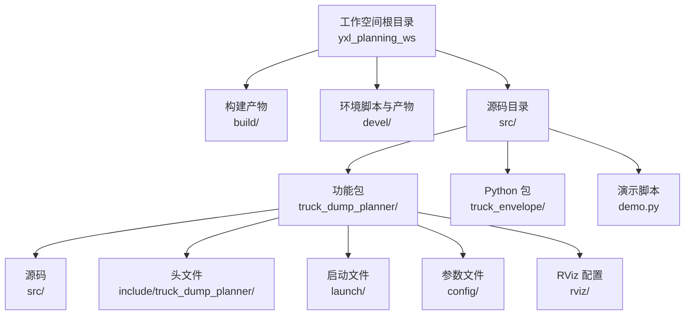
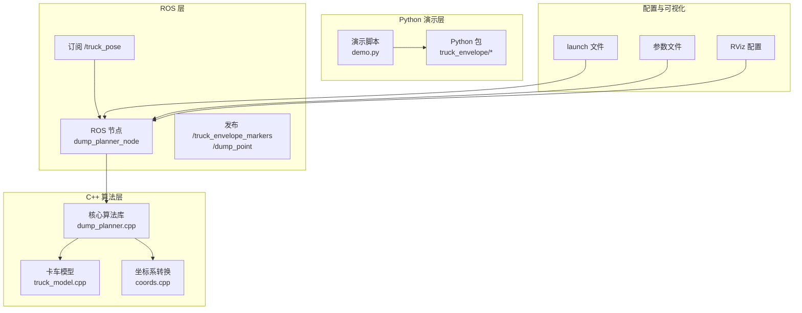
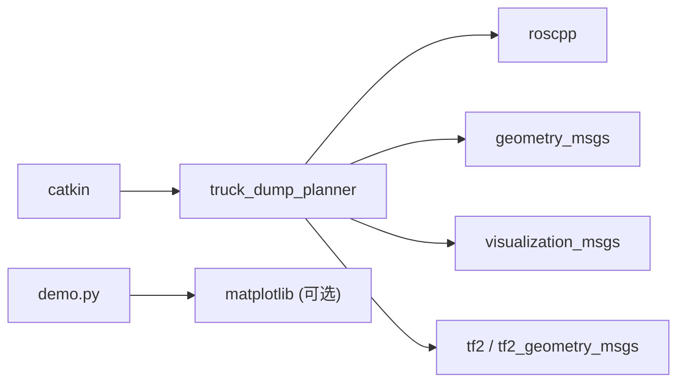
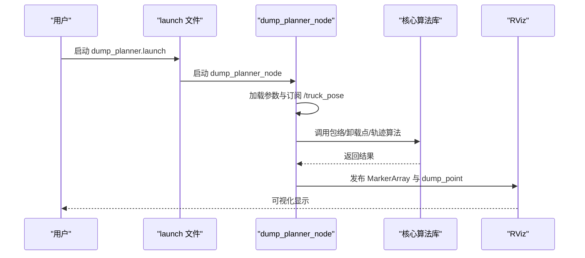

# 开发环境搭建

<cite>
**本文引用的文件**
- [package.xml](file://src/truck_dump_planner/package.xml)
- [CMakeLists.txt](file://src/truck_dump_planner/CMakeLists.txt)
- [setup.bash](file://devel/setup.bash)
- [env.sh](file://devel/env.sh)
- [demo.py](file://src/demo.py)
- [__init__.py](file://src/truck_envelope/__init__.py)
- [coords.py](file://src/truck_envelope/coords.py)
- [truck_model.py](file://src/truck_envelope/truck_model.py)
- [dump_planner.launch](file://src/truck_dump_planner/launch/dump_planner.launch)
- [dump_planner.yaml](file://src/truck_dump_planner/config/dump_planner.yaml)
- [dump_planner.rviz](file://src/truck_dump_planner/rviz/dump_planner.rviz)
- [dump_planner.cpp](file://src/truck_dump_planner/src/dump_planner.cpp)
- [dump_planner_node.cpp](file://src/truck_dump_planner/src/dump_planner_node.cpp)
- [dump_planner.h](file://src/truck_dump_planner/include/truck_dump_planner/dump_planner.h)
</cite>

## 目录
1. [简介](#简介)
2. [项目结构](#项目结构)
3. [核心组件](#核心组件)
4. [架构总览](#架构总览)
5. [详细组件分析](#详细组件分析)
6. [依赖分析](#依赖分析)
7. [性能考虑](#性能考虑)
8. [故障排查指南](#故障排查指南)
9. [结论](#结论)
10. [附录](#附录)

## 简介
本指南面向无人挖掘机装车轨迹规划系统的开发者，提供从零搭建开发环境的完整流程，涵盖以下内容：
- Ubuntu 系统下的 ROS 环境安装与初始化
- catkin 工作空间的创建、编译与环境变量配置
- CMake 构建系统与依赖库安装
- Python 依赖（用于演示与可视化）安装
- 开发工具链配置（IDE、调试器、代码格式化）
- 常见环境问题排查与解决方案
- 验证方法与一键启动流程

## 项目结构
该仓库采用标准的 catkin 工作空间布局，包含一个 ROS 功能包 truck_dump_planner 以及一个 Python 包 truck_envelope。顶层目录包含 build、devel、src 三个关键目录，分别用于构建产物、工作空间环境脚本与源码。

图表来源
- [CMakeLists.txt:1-52](file://src/truck_dump_planner/CMakeLists.txt#L1-L52)
- [setup.bash:1-9](file://devel/setup.bash#L1-L9)
- [env.sh:1-17](file://devel/env.sh#L1-L17)

章节来源
- [CMakeLists.txt:1-52](file://src/truck_dump_planner/CMakeLists.txt#L1-L52)
- [setup.bash:1-9](file://devel/setup.bash#L1-L9)
- [env.sh:1-17](file://devel/env.sh#L1-L17)

## 核心组件
- ROS 功能包 truck_dump_planner：包含 C++ 核心算法库与 ROS 节点，负责将卡车位姿消息转换为 RViz 可视化标记与卸载点。
- Python 包 truck_envelope：提供坐标系转换、卡车包络建模与轨迹规划的纯 Python 实现，便于离线验证与演示。
- 演示脚本 demo.py：整合坐标系转换与包络验证、卸载点选择与轨迹规划，并可输出 ASCII 图与可选 PNG 图。
- 配置与启动：launch 文件、yaml 参数文件、rviz 配置文件共同构成一键启动与验证流程。

章节来源
- [package.xml:1-20](file://src/truck_dump_planner/package.xml#L1-L20)
- [CMakeLists.txt:1-52](file://src/truck_dump_planner/CMakeLists.txt#L1-L52)
- [demo.py:1-249](file://src/demo.py#L1-L249)
- [__init__.py:1-36](file://src/truck_envelope/__init__.py#L1-L36)

## 架构总览
系统由 ROS 节点订阅卡车位姿，调用 C++ 核心算法库进行包络与轨迹计算，最终发布 MarkerArray 到 RViz 可视化。

图表来源
- [dump_planner_node.cpp:1-341](file://src/truck_dump_planner/src/dump_planner_node.cpp#L1-L341)
- [dump_planner.cpp:1-120](file://src/truck_dump_planner/src/dump_planner.cpp#L1-L120)
- [coords.py:1-200](file://src/truck_envelope/coords.py#L1-L200)
- [truck_model.py:1-200](file://src/truck_envelope/truck_model.py#L1-L200)
- [dump_planner.launch:1-26](file://src/truck_dump_planner/launch/dump_planner.launch#L1-L26)
- [dump_planner.yaml:1-43](file://src/truck_dump_planner/config/dump_planner.yaml#L1-L43)
- [dump_planner.rviz:1-131](file://src/truck_dump_planner/rviz/dump_planner.rviz#L1-L131)

## 详细组件分析

### catkin 工作空间与构建系统
- 工作空间创建与编译
  - 在工作空间根目录执行编译，生成 build 与 devel 目录，devel 下包含 setup.* 环境脚本。
  - 编译后需 source devel/setup.bash 或相应 shell 的 setup 文件以激活工作空间。
- CMake 配置要点
  - 使用 C++14 标准，缺省构建类型为 Release。
  - 通过 find_package(catkin ...) 声明依赖 roscpp、geometry_msgs、visualization_msgs、tf2、tf2_geometry_msgs。
  - 提供库目标 truck_dump_planner_lib 与可执行节点 dump_planner_node。
  - 安装规则覆盖库、可执行文件、头文件与共享资源（launch/config/rviz）。

章节来源
- [CMakeLists.txt:1-52](file://src/truck_dump_planner/CMakeLists.txt#L1-L52)
- [setup.bash:1-9](file://devel/setup.bash#L1-L9)
- [env.sh:1-17](file://devel/env.sh#L1-L17)

### ROS 功能包与节点
- 功能包声明
  - package.xml 明确依赖 roscpp、geometry_msgs、visualization_msgs、tf2、tf2_geometry_msgs。
- 节点职责
  - dump_planner_node 订阅 /truck_pose，解析四元数得到 RTK 航向，调用核心算法，发布 MarkerArray 与卸载点。
- 参数与配置
  - 参数文件 dump_planner.yaml 提供卡车几何、挖掘机工作范围、轨迹规划与坐标系约定等参数。
  - launch 文件 dump_planner.launch 启动节点、可选测试位姿发布与 RViz。

章节来源
- [package.xml:1-20](file://src/truck_dump_planner/package.xml#L1-L20)
- [dump_planner_node.cpp:1-341](file://src/truck_dump_planner/src/dump_planner_node.cpp#L1-L341)
- [dump_planner.yaml:1-43](file://src/truck_dump_planner/config/dump_planner.yaml#L1-L43)
- [dump_planner.launch:1-26](file://src/truck_dump_planner/launch/dump_planner.launch#L1-L26)

### Python 包与演示
- truck_envelope 包
  - 提供坐标系转换（heading 与方向向量）、卡车几何与包络建模、卸载点选择与轨迹规划接口。
- demo.py
  - 验证 RTK 航向与挖掘机系航向转换、方向向量分解、包络构建、卸载点选择与轨迹规划，并可输出 ASCII 图与可选 PNG。

章节来源
- [__init__.py:1-36](file://src/truck_envelope/__init__.py#L1-L36)
- [coords.py:1-200](file://src/truck_envelope/coords.py#L1-L200)
- [truck_model.py:1-200](file://src/truck_envelope/truck_model.py#L1-L200)
- [demo.py:1-249](file://src/demo.py#L1-L249)

### 核心算法与数据结构
- 数据结构
  - TruckParams、TruckEnvelope、DumpPoint、DumpTrajectory 等，定义几何参数、包络描述、卸载点与轨迹点。
- 算法流程
  - 从 RTK 航向推导挖掘机系航向，分解方向向量，计算车体与货箱包络，沿货箱纵向采样候选卸载点，评分筛选最优点，规划三段式轨迹（抬升-回转-下放）。

章节来源
- [dump_planner.h:1-66](file://src/truck_dump_planner/include/truck_dump_planner/dump_planner.h#L1-L66)
- [dump_planner.cpp:1-120](file://src/truck_dump_planner/src/dump_planner.cpp#L1-L120)
- [truck_model.py:1-200](file://src/truck_envelope/truck_model.py#L1-L200)
- [coords.py:1-200](file://src/truck_envelope/coords.py#L1-L200)

## 依赖分析
- ROS 依赖
  - roscpp、geometry_msgs、visualization_msgs、tf2、tf2_geometry_msgs。
- Python 依赖
  - matplotlib（可选，用于保存演示图）。
- 构建与工具
  - CMake ≥ 3.0.2，C++14 标准，catkin 构建工具。

图表来源
- [package.xml:1-20](file://src/truck_dump_planner/package.xml#L1-L20)
- [CMakeLists.txt:1-52](file://src/truck_dump_planner/CMakeLists.txt#L1-L52)
- [demo.py:1-249](file://src/demo.py#L1-L249)

章节来源
- [package.xml:1-20](file://src/truck_dump_planner/package.xml#L1-L20)
- [CMakeLists.txt:1-52](file://src/truck_dump_planner/CMakeLists.txt#L1-L52)
- [demo.py:1-249](file://src/demo.py#L1-L249)

## 性能考虑
- 构建类型
  - 缺省使用 Release，适合开发与部署；Debug 模式可用于调试但会牺牲性能。
- 算法复杂度
  - 卸载点采样与排序为 O(n log n)，n 为采样点数；轨迹规划为线性插值，开销与 n_steps 成正比。
- 可视化开销
  - MarkerArray 数量与轨迹点数相关，建议在仿真或离线演示时开启，在实时系统中谨慎使用。

## 故障排查指南
- 环境未激活
  - 现象：命令找不到、无法找到工作空间脚本。
  - 处理：确保已 source devel/setup.bash 或相应 shell 的 setup 文件。
- 依赖缺失
  - 现象：编译时报错找不到头文件或链接失败。
  - 处理：确认已安装 ROS 对应发行版的 roscpp、geometry_msgs、visualization_msgs、tf2、tf2_geometry_msgs。
- Python 依赖缺失
  - 现象：运行 demo.py 时导入 matplotlib 失败。
  - 处理：pip3 install matplotlib（可选）。
- 参数与坐标系约定不一致
  - 现象：RViz 中方向或标注异常。
  - 处理：核对 dump_planner.yaml 中 frame_id、axis_convention、bearing_convention 设置。
- 启动失败或无输出
  - 现象：节点未发布 marker 或 dump_point。
  - 处理：检查 /truck_pose 是否正常发布；确认 launch 文件中的 remap 与话题名称一致。

章节来源
- [setup.bash:1-9](file://devel/setup.bash#L1-L9)
- [env.sh:1-17](file://devel/env.sh#L1-L17)
- [dump_planner.yaml:1-43](file://src/truck_dump_planner/config/dump_planner.yaml#L1-L43)
- [dump_planner.launch:1-26](file://src/truck_dump_planner/launch/dump_planner.launch#L1-L26)

## 结论
本指南提供了从零开始搭建无人挖掘机轨迹规划系统开发环境的完整路径，覆盖 ROS 工作空间、CMake 构建、依赖安装、Python 演示与验证、以及常见问题排查。按照本指南操作，即可快速完成开发环境准备并开展二次开发与集成。

## 附录

### Ubuntu 下安装与验证步骤（概要）
- 安装 ROS
  - 安装对应发行版的 ROS Base 或 Desktop 版本，确保基础工具链可用。
- 创建并编译 catkin 工作空间
  - 将仓库克隆至 src 目录，执行编译，source devel/setup.bash。
- 安装 Python 依赖（可选）
  - pip3 install matplotlib（若需要保存演示图）。
- 验证
  - 启动：roslaunch truck_dump_planner dump_planner.launch
  - 在新终端运行：python3 src/demo.py 验证 Python 模块与算法。

章节来源
- [CMakeLists.txt:1-52](file://src/truck_dump_planner/CMakeLists.txt#L1-L52)
- [setup.bash:1-9](file://devel/setup.bash#L1-L9)
- [demo.py:1-249](file://src/demo.py#L1-L249)
- [dump_planner.launch:1-26](file://src/truck_dump_planner/launch/dump_planner.launch#L1-L26)

### 开发工具链配置建议
- IDE
  - VS Code：安装 C/C++、Python、ROS 扩展，配置 tasks.json 与 launch.json。
- 调试器
  - GDB/LLDB：配合 IDE 断点调试；也可在终端使用 gdb --args 运行节点。
- 代码格式化
  - C++：使用 clang-format，建立 .clang-format 规则。
  - Python：使用 black 或 autopep8，结合 pre-commit 钩子。

### 关键流程时序图（启动与处理）

图表来源
- [dump_planner.launch:1-26](file://src/truck_dump_planner/launch/dump_planner.launch#L1-L26)
- [dump_planner_node.cpp:1-341](file://src/truck_dump_planner/src/dump_planner_node.cpp#L1-L341)
- [dump_planner.cpp:1-120](file://src/truck_dump_planner/src/dump_planner.cpp#L1-L120)
- [dump_planner.rviz:1-131](file://src/truck_dump_planner/rviz/dump_planner.rviz#L1-L131)