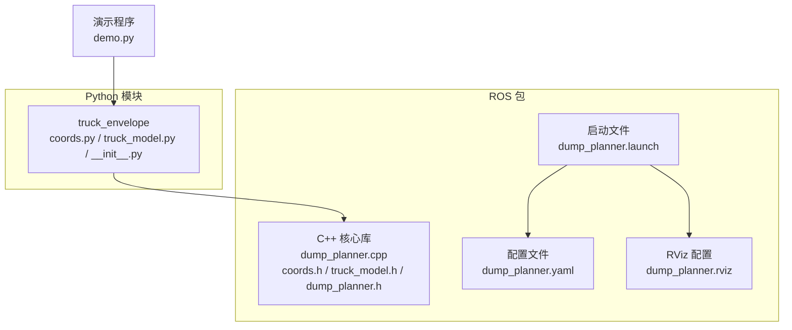
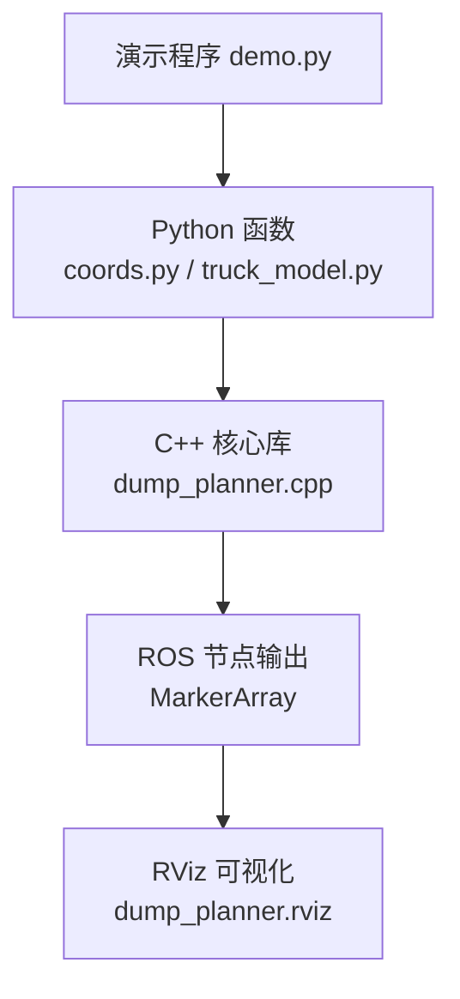
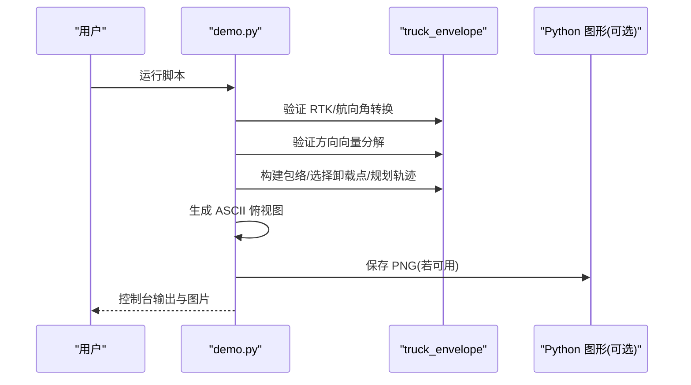
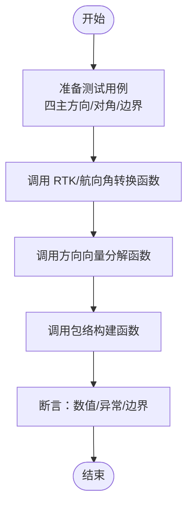
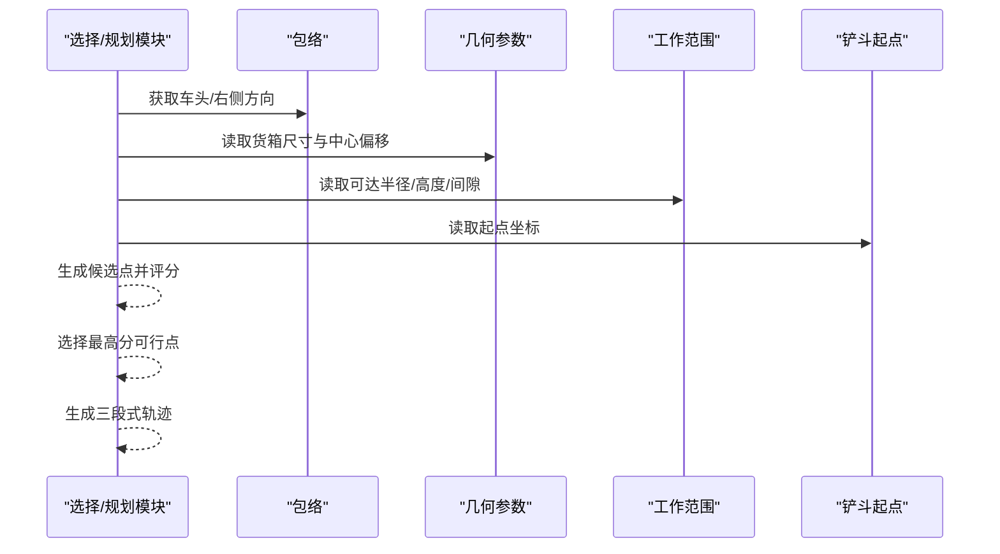
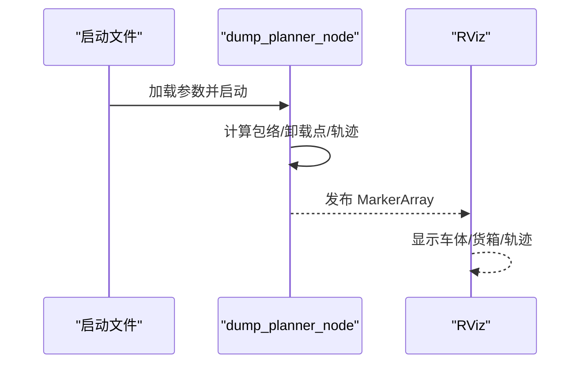
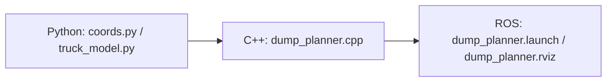

# 测试与验证

<cite>
**本文引用的文件**
- [demo.py](file://src/demo.py)
- [__init__.py](file://src/truck_envelope/__init__.py)
- [coords.py](file://src/truck_envelope/coords.py)
- [truck_model.py](file://src/truck_envelope/truck_model.py)
- [dump_planner.cpp](file://src/truck_dump_planner/src/dump_planner.cpp)
- [dump_planner.h](file://src/truck_dump_planner/include/truck_dump_planner/dump_planner.h)
- [truck_model.h](file://src/truck_dump_planner/include/truck_dump_planner/truck_model.h)
- [coords.h](file://src/truck_dump_planner/include/truck_dump_planner/coords.h)
- [dump_planner.yaml](file://src/truck_dump_planner/config/dump_planner.yaml)
- [dump_planner.launch](file://src/truck_dump_planner/launch/dump_planner.launch)
- [dump_planner.rviz](file://src/truck_dump_planner/rviz/dump_planner.rviz)
- [CMakeLists.txt](file://src/truck_dump_planner/CMakeLists.txt)
</cite>

## 目录
1. [引言](#引言)
2. [项目结构](#项目结构)
3. [核心组件](#核心组件)
4. [架构总览](#架构总览)
5. [详细组件分析](#详细组件分析)
6. [依赖分析](#依赖分析)
7. [性能考虑](#性能考虑)
8. [故障排查指南](#故障排查指南)
9. [结论](#结论)
10. [附录](#附录)

## 引言
本指南面向无人挖掘机轨迹规划系统，提供一套完整的测试与验证方法，覆盖：
- 演示程序 demo.py 的功能、参数与运行步骤，以及结果验证方法
- Python 辅助模块 truck_envelope 的几何计算函数单元测试与边界条件验证
- ASCII 输出与图形输出的对比验证方法
- 通过 RViz 验证轨迹规划结果的正确性
- 性能测试、压力测试与回归测试的实施方法
- 测试数据准备与测试用例设计原则

## 项目结构
系统由两部分组成：
- Python 辅助模块：truck_envelope，提供坐标系转换、卡车包络构建与卸载点选择/轨迹规划的高层接口
- C++ ROS 节点与库：truck_dump_planner，实现包络与轨迹的核心算法，并通过 ROS 发布可视化标记

图表来源
- [demo.py:1-249](file://src/demo.py#L1-L249)
- [coords.py:1-200](file://src/truck_envelope/coords.py#L1-L200)
- [truck_model.py:1-200](file://src/truck_envelope/truck_model.py#L1-L200)
- [dump_planner.cpp:1-120](file://src/truck_dump_planner/src/dump_planner.cpp#L1-L120)
- [dump_planner.h:1-66](file://src/truck_dump_planner/include/truck_dump_planner/dump_planner.h#L1-L66)
- [dump_planner.yaml:1-43](file://src/truck_dump_planner/config/dump_planner.yaml#L1-L43)
- [dump_planner.launch:1-26](file://src/truck_dump_planner/launch/dump_planner.launch#L1-L26)
- [dump_planner.rviz:1-131](file://src/truck_dump_planner/rviz/dump_planner.rviz#L1-L131)

章节来源
- [CMakeLists.txt:1-52](file://src/truck_dump_planner/CMakeLists.txt#L1-L52)

## 核心组件
- 坐标系转换与方向向量
  - RTK 航向角与挖掘机系航向角互转
  - 航向角到 xy 平面单位方向向量的分解（支持多种 xy 轴地理朝向约定）
- 卡车包络建模
  - 基于 RTK 航向与几何参数，计算车体与货箱四角、中心与顶面高度
- 卸载点选择与轨迹规划
  - 沿货箱纵向均匀采样候选点，结合可达半径与高度约束评分排序
  - 三段式轨迹：抬升、回转、下放，采用半余弦曲线保证平滑

章节来源
- [coords.py:39-200](file://src/truck_envelope/coords.py#L39-L200)
- [truck_model.py:112-178](file://src/truck_envelope/truck_model.py#L112-L178)
- [dump_planner.cpp:7-117](file://src/truck_dump_planner/src/dump_planner.cpp#L7-L117)
- [dump_planner.h:10-62](file://src/truck_dump_planner/include/truck_dump_planner/dump_planner.h#L10-L62)

## 架构总览
系统采用“Python 展示层 + C++ 核心算法 + ROS 可视化”的分层架构。Python 层负责演示与快速验证，C++ 层提供高性能核心逻辑，ROS 层负责与 RViz 集成。

图表来源
- [demo.py:24-41](file://src/demo.py#L24-L41)
- [coords.py:39-200](file://src/truck_envelope/coords.py#L39-L200)
- [truck_model.py:112-178](file://src/truck_envelope/truck_model.py#L112-L178)
- [dump_planner.cpp:7-117](file://src/truck_dump_planner/src/dump_planner.cpp#L7-L117)
- [dump_planner.rviz:82-89](file://src/truck_dump_planner/rviz/dump_planner.rviz#L82-L89)

## 详细组件分析

### 演示程序 demo.py 使用与验证
- 功能概览
  - 验证 RTK 航向角与挖掘机系航向角互转
  - 验证航向角到方向向量分解（x 东 y 北约定）
  - 构建典型装车场景：生成车体/货箱包络、选择卸载点、规划轨迹
  - 输出 ASCII 俯视图进行直观验证
  - 可选保存图形到 PNG（依赖 matplotlib）
- 参数设置
  - 卡车位置与 RTK 航向：在场景函数中设置
  - 卡车几何参数：通过 TruckParams 设置
  - 挖掘机工作范围：通过 ExcavatorKinLimits 设置
  - 轨迹步数与安全高度：在轨迹规划函数中设置
- 运行步骤
  - 直接执行脚本，依次输出各节验证结果
  - 如安装 matplotlib，将在脚本目录生成示意图
- 结果验证
  - ASCII 图：确认车体/货箱包络朝向与车头方向一致
  - 数值校验：核对 RTK/航向角互转、方向向量分解、包络四角坐标
  - 可视化：对比 ASCII 与 PNG 的几何一致性

图表来源
- [demo.py:50-244](file://src/demo.py#L50-L244)
- [coords.py:39-200](file://src/truck_envelope/coords.py#L39-L200)
- [truck_model.py:112-178](file://src/truck_envelope/truck_model.py#L112-L178)
- [dump_planner.cpp:7-117](file://src/truck_dump_planner/src/dump_planner.cpp#L7-L117)

章节来源
- [demo.py:1-249](file://src/demo.py#L1-L249)

### Python 几何模块 truck_envelope 测试方法
- 单元测试建议
  - 坐标系转换
    - 测试用例：四主方向与对角方向的 RTK/航向角互转，使用近似相等断言
    - 边界条件：角度归一化、跨 0/360 度
  - 方向向量分解
    - 测试用例：北/东/南/西对应的方向向量，不同 xy 约定
    - 边界条件：β 接近 0/90/180/270 的数值稳定性
  - 包络构建
    - 测试用例：固定参数下的包络四角坐标解析
    - 边界条件：长度/宽度为 0 或极小值
- 断言策略
  - 使用绝对容差进行浮点比较
  - 对异常输入（未知 xy 约定）抛出异常的断言
- 数据驱动
  - 将测试用例组织为表格，覆盖典型与极端参数组合

图表来源
- [coords.py:39-200](file://src/truck_envelope/coords.py#L39-L200)
- [truck_model.py:112-178](file://src/truck_envelope/truck_model.py#L112-L178)

章节来源
- [coords.py:39-200](file://src/truck_envelope/coords.py#L39-L200)
- [truck_model.py:112-178](file://src/truck_envelope/truck_model.py#L112-L178)

### 卸载点选择与轨迹规划测试
- 卸载点选择
  - 输入：包络、几何参数、工作范围限制、挖掘机位置、采样数量
  - 输出：候选点列表（按评分降序）、最佳点
  - 测试要点：可达半径上下界、高度上下界、评分合理性
- 轨迹规划
  - 输入：铲斗起点、卸载点、安全高度、步数
  - 输出：轨迹点序列（含阶段标识）
  - 测试要点：三段式平滑过渡、终点收敛、阶段分布

图表来源
- [dump_planner.cpp:7-117](file://src/truck_dump_planner/src/dump_planner.cpp#L7-L117)
- [dump_planner.h:10-62](file://src/truck_dump_planner/include/truck_dump_planner/dump_planner.h#L10-L62)

章节来源
- [dump_planner.cpp:7-117](file://src/truck_dump_planner/src/dump_planner.cpp#L7-L117)
- [dump_planner.h:10-62](file://src/truck_dump_planner/include/truck_dump_planner/dump_planner.h#L10-L62)

### RViz 验证流程
- 启动与验证
  - 使用启动文件加载参数与 RViz 配置，发布测试卡车位姿
  - 在 RViz 中观察 MarkerArray 是否正确显示车体与货箱包络
- 验证内容
  - 包络形状与尺寸：与 demo.py 的包络四角/中心比对
  - 车头方向：与方向向量分解一致
  - 轨迹：轨迹点序列与阶段标识是否正确发布

图表来源
- [dump_planner.launch:8-25](file://src/truck_dump_planner/launch/dump_planner.launch#L8-L25)
- [dump_planner.rviz:82-89](file://src/truck_dump_planner/rviz/dump_planner.rviz#L82-L89)

章节来源
- [dump_planner.launch:1-26](file://src/truck_dump_planner/launch/dump_planner.launch#L1-L26)
- [dump_planner.rviz:1-131](file://src/truck_dump_planner/rviz/dump_planner.rviz#L1-L131)

## 依赖分析
- Python 层依赖
  - truck_envelope 提供坐标转换与包络构建的高层接口
- C++ 层依赖
  - dump_planner.cpp 实现卸载点选择与轨迹规划
  - coords.h / truck_model.h / dump_planner.h 定义数据结构与接口
- ROS 集成
  - dump_planner.launch 加载参数并启动节点
  - dump_planner.rviz 配置 MarkerArray 可视化

图表来源
- [coords.py:1-200](file://src/truck_envelope/coords.py#L1-L200)
- [truck_model.py:1-200](file://src/truck_envelope/truck_model.py#L1-L200)
- [dump_planner.cpp:1-120](file://src/truck_dump_planner/src/dump_planner.cpp#L1-L120)
- [dump_planner.launch:1-26](file://src/truck_dump_planner/launch/dump_planner.launch#L1-L26)
- [dump_planner.rviz:1-131](file://src/truck_dump_planner/rviz/dump_planner.rviz#L1-L131)

章节来源
- [CMakeLists.txt:29-39](file://src/truck_dump_planner/CMakeLists.txt#L29-L39)

## 性能考虑
- 性能测试
  - 采样规模：逐步增大 n_samples，测量选择/规划耗时，绘制吞吐曲线
  - 步数影响：增大 n_steps，评估轨迹生成时间
- 压力测试
  - 极端参数：接近工作范围边界（最小/最大可达半径、高度）反复运行
  - 大批量随机场景：生成大量随机卡车位姿与参数，统计失败率与平均耗时
- 回归测试
  - 关键用例：固定场景（demo.py 中的典型场景）重复运行，确保数值稳定
  - 版本对比：新版本与历史版本输出对比（数值容差内）

## 故障排查指南
- 常见问题
  - 包络方向错误：检查 RTK/航向角转换与方向向量分解
  - 卸载点为空：检查可达半径与高度约束是否过于严格
  - RViz 无显示：确认 MarkerArray 主题名称与 RViz 配置一致
- 调试建议
  - 使用 demo.py 的 ASCII 输出与数值打印定位问题
  - 在 dump_planner.launch 中临时提高日志级别
  - 对照 dump_planner.yaml 的参数设置逐项核对

章节来源
- [demo.py:152-206](file://src/demo.py#L152-L206)
- [dump_planner.launch:1-26](file://src/truck_dump_planner/launch/dump_planner.launch#L1-L26)

## 结论
通过演示程序、Python 几何模块的单元测试、ASCII 与图形输出对比、RViz 可视化验证以及系统化的性能与回归测试，可以全面保证无人挖掘机轨迹规划系统的正确性与鲁棒性。建议在持续集成中自动化执行这些测试，并将关键用例纳入回归基线。

## 附录

### 测试数据准备与用例设计原则
- 测试数据
  - 典型场景：demo.py 中的场景作为基线
  - 边界场景：RTK 航向角为 0/90/180/270，航向角接近 0/90/180/270
  - 极端场景：长度/宽度为极小值，可达半径/高度处于边界
- 用例设计
  - 黑盒：输入参数组合与输出行为一致性
  - 白盒：关键路径覆盖（转换、分解、包络、选择、轨迹）
  - 稳健性：异常输入与边界条件处理

### ASCII 与图形输出对比验证清单
- 包络形状与尺寸：车体/货箱四角坐标一致性
- 车头方向：与方向向量分解一致
- 卸载点：与评分与几何位置一致
- 轨迹：阶段分布与终点收敛