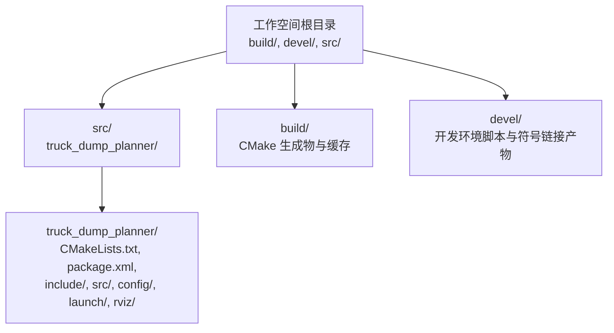
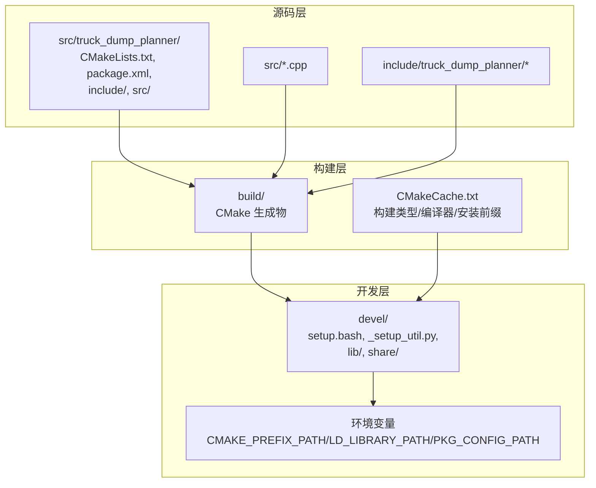
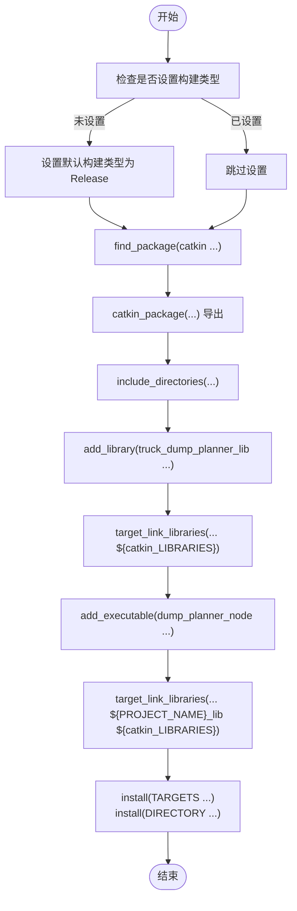
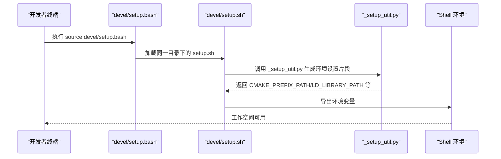
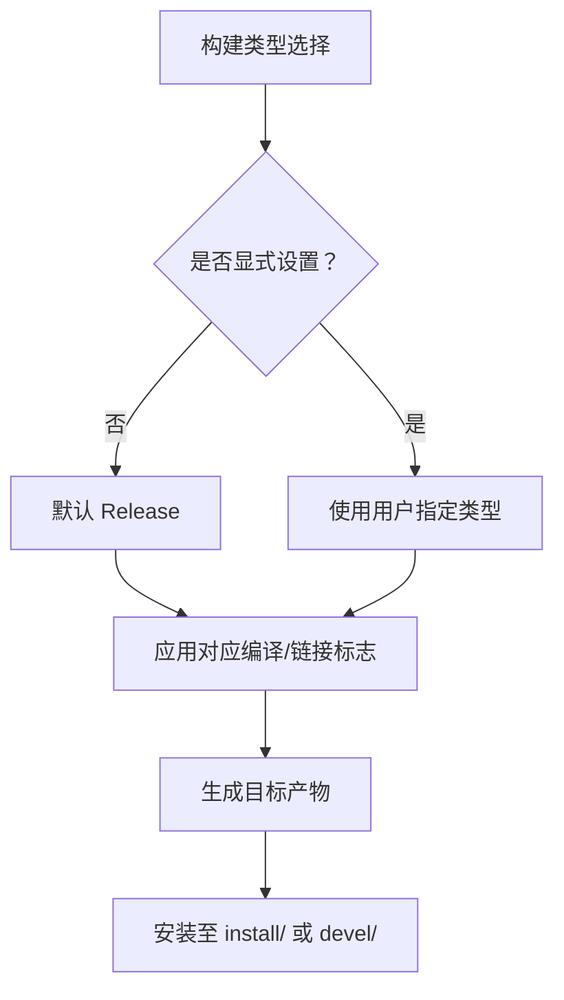
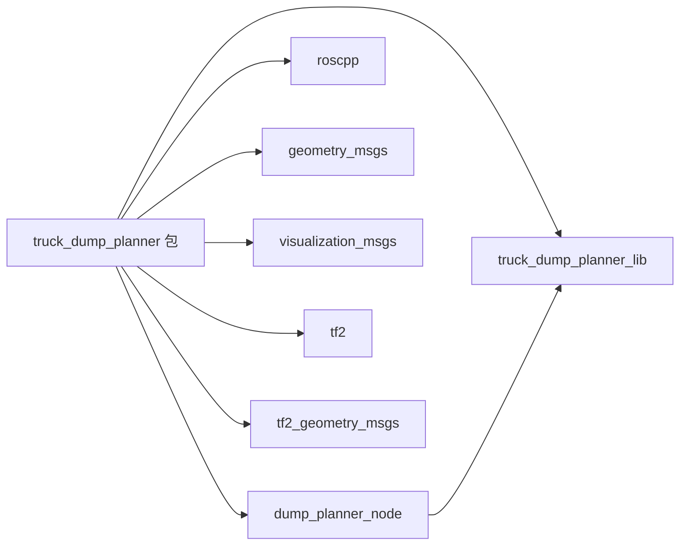
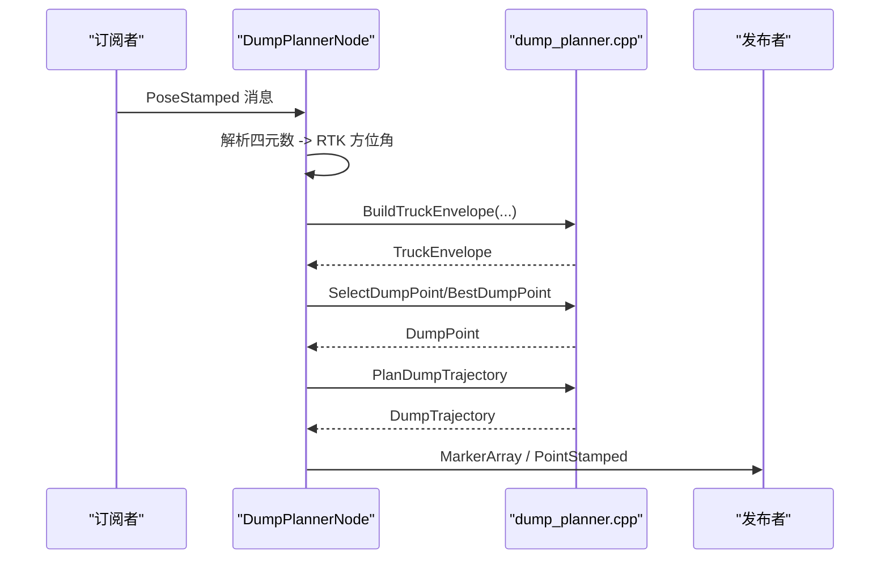

# 编译构建流程

<cite>
**本文引用的文件列表**
- [CMakeLists.txt](file://src/truck_dump_planner/CMakeLists.txt)
- [package.xml](file://src/truck_dump_planner/package.xml)
- [CMakeCache.txt](file://build/CMakeCache.txt)
- [dump_planner.cpp](file://src/truck_dump_planner/src/dump_planner.cpp)
- [dump_planner_node.cpp](file://src/truck_dump_planner/src/dump_planner_node.cpp)
- [setup.bash](file://devel/setup.bash)
- [_setup_util.py](file://devel/_setup_util.py)
- [truck_dump_plannerConfig.cmake](file://devel/share/truck_dump_planner/cmake/truck_dump_plannerConfig.cmake)
</cite>

## 目录
1. [简介](#简介)
2. [项目结构](#项目结构)
3. [核心组件](#核心组件)
4. [架构总览](#架构总览)
5. [详细组件分析](#详细组件分析)
6. [依赖关系分析](#依赖关系分析)
7. [性能考量](#性能考量)
8. [故障排查指南](#故障排查指南)
9. [结论](#结论)
10. [附录](#附录)

## 简介
本文件面向无人挖掘机轨迹规划系统，系统性阐述基于 Catkin 的编译构建流程，覆盖以下要点：
- CMakeLists.txt 结构与目标配置：静态库与可执行文件的构建规则、安装规则与依赖链接。
- Catkin 工具链使用：catkin_make 命令执行、环境变量与工作空间布局。
- 构建类型与编译选项：Debug/Release 等模式的差异、默认编译器标志与优化参数。
- 增量编译与全量重建：两者的区别与适用场景。
- 常见构建失败原因与解决方法。
- 构建产物组织结构与安装路径。

## 项目结构
仓库采用标准 Catkin 工作空间布局，顶层包含构建目录、开发目录与源码目录；核心包位于 src/truck_dump_planner，内含头文件、源文件、配置与启动文件等。

图表来源
- [CMakeLists.txt:1-52](file://src/truck_dump_planner/CMakeLists.txt#L1-L52)
- [package.xml:1-20](file://src/truck_dump_planner/package.xml#L1-L20)

章节来源
- [CMakeLists.txt:1-52](file://src/truck_dump_planner/CMakeLists.txt#L1-L52)
- [package.xml:1-20](file://src/truck_dump_planner/package.xml#L1-L20)

## 核心组件
- 包级 CMakeLists：定义项目版本、C++ 标准、查找依赖、导出 catkin 包信息、添加静态库与可执行文件、安装规则。
- 包描述文件 package.xml：声明包名、版本、描述、许可证、维护者、构建工具与运行时依赖。
- 构建缓存 CMakeCache.txt：记录构建类型、编译器、链接器、安装前缀等全局配置。
- ROS 节点入口：dump_planner_node.cpp 实现 ROS 节点，负责订阅位姿消息、调用轨迹规划算法、发布可视化标记与卸载点。
- 算法实现：dump_planner.cpp 提供包络建模、卸载点选择与轨迹规划的核心逻辑。

章节来源
- [CMakeLists.txt:1-52](file://src/truck_dump_planner/CMakeLists.txt#L1-L52)
- [package.xml:1-20](file://src/truck_dump_planner/package.xml#L1-L20)
- [CMakeCache.txt:48-105](file://build/CMakeCache.txt#L48-L105)
- [dump_planner.cpp:1-120](file://src/truck_dump_planner/src/dump_planner.cpp#L1-L120)
- [dump_planner_node.cpp:1-341](file://src/truck_dump_planner/src/dump_planner_node.cpp#L1-L341)

## 架构总览
下图展示从源码到可执行文件的构建与安装路径，以及 Catkin 开发环境的加载方式。

图表来源
- [CMakeLists.txt:11-22](file://src/truck_dump_planner/CMakeLists.txt#L11-L22)
- [CMakeLists.txt:24-48](file://src/truck_dump_planner/CMakeLists.txt#L24-L48)
- [CMakeCache.txt:165-166](file://build/CMakeCache.txt#L165-L166)
- [setup.bash:1-9](file://devel/setup.bash#L1-L9)
- [_setup_util.py:59-66](file://devel/_setup_util.py#L59-L66)

## 详细组件分析

### CMakeLists.txt 结构与目标配置
- 最低版本与项目声明：设置 CMake 最低版本与项目名称。
- C++ 标准：启用 C++14 并要求强制使用。
- 构建类型：若未指定则默认 Release。
- 依赖查找：通过 find_package(catkin ...) 声明 roscpp、geometry_msgs、visualization_msgs、tf2、tf2_geometry_msgs。
- catkin 包导出：catkin_package(...) 导出 include 目录与依赖。
- 头文件包含：include_directories(...) 同时包含包内 include 与 catkin 头文件。
- 目标一：静态库 truck_dump_planner_lib（不含 ROS 依赖，便于独立测试）。
- 目标二：可执行文件 dump_planner_node（依赖静态库与 catkin 库）。
- 安装规则：安装静态库、可执行文件、头文件目录、launch/config/rviz 资源。

图表来源
- [CMakeLists.txt:7-9](file://src/truck_dump_planner/CMakeLists.txt#L7-L9)
- [CMakeLists.txt:11-17](file://src/truck_dump_planner/CMakeLists.txt#L11-L17)
- [CMakeLists.txt:19-22](file://src/truck_dump_planner/CMakeLists.txt#L19-L22)
- [CMakeLists.txt:24-27](file://src/truck_dump_planner/CMakeLists.txt#L24-L27)
- [CMakeLists.txt:30-35](file://src/truck_dump_planner/CMakeLists.txt#L30-L35)
- [CMakeLists.txt:38](file://src/truck_dump_planner/CMakeLists.txt#L38)
- [CMakeLists.txt:39](file://src/truck_dump_planner/CMakeLists.txt#L39)
- [CMakeLists.txt:41-51](file://src/truck_dump_planner/CMakeLists.txt#L41-L51)

章节来源
- [CMakeLists.txt:1-52](file://src/truck_dump_planner/CMakeLists.txt#L1-L52)

### Catkin 工具与环境加载
- 工作空间标识：devel/.built_by 中记录 catkin_make，表明当前工作空间由该命令构建。
- 环境加载：devel/setup.bash 作为入口脚本，实际委托 devel/setup.sh 设置环境变量。
- 环境变量映射：_setup_util.py 将工作空间子目录映射到 CMAKE_PREFIX_PATH、LD_LIBRARY_PATH、PATH、PKG_CONFIG_PATH 等，确保构建与运行时能找到库与可执行文件。
- 包配置导出：devel/share/truck_dump_planner/cmake/truck_dump_plannerConfig.cmake 提供包级配置，用于其他包查找与链接。

图表来源
- [setup.bash:1-9](file://devel/setup.bash#L1-L9)
- [_setup_util.py:59-66](file://devel/_setup_util.py#L59-L66)
- [_setup_util.py:137-151](file://devel/_setup_util.py#L137-L151)
- [_setup_util.py:205-251](file://devel/_setup_util.py#L205-L251)

章节来源
- [setup.bash:1-9](file://devel/setup.bash#L1-L9)
- [_setup_util.py:59-66](file://devel/_setup_util.py#L59-L66)
- [_setup_util.py:137-151](file://devel/_setup_util.py#L137-L151)
- [_setup_util.py:205-251](file://devel/_setup_util.py#L205-L251)

### 构建类型与编译选项
- 默认构建类型：CMakeLists.txt 若未显式设置，则默认为 Release。
- 编译器与链接器：CMakeCache.txt 显示使用 GNU 编译器与链接器，且存在 C++/C 编译器 AR/RANLIB 包装器。
- 编译标志：CMakeCache.txt 展示各构建类型的默认编译与链接标志，例如 Release 使用 -O3 -DNDEBUG，Debug 使用 -g。
- 安装前缀：CMAKE_INSTALL_PREFIX 指向 install/ 目录（当前工作空间根目录下的 install）。

图表来源
- [CMakeLists.txt:7-9](file://src/truck_dump_planner/CMakeLists.txt#L7-L9)
- [CMakeCache.txt:48-105](file://build/CMakeCache.txt#L48-L105)
- [CMakeCache.txt:165-166](file://build/CMakeCache.txt#L165-L166)

章节来源
- [CMakeLists.txt:7-9](file://src/truck_dump_planner/CMakeLists.txt#L7-L9)
- [CMakeCache.txt:48-105](file://build/CMakeCache.txt#L48-L105)
- [CMakeCache.txt:165-166](file://build/CMakeCache.txt#L165-L166)

### 增量编译与全量重建
- 增量编译：仅重新编译自上次构建以来发生变化的目标与源文件，速度较快，适合迭代开发。
- 全量重建：清理构建缓存与中间产物后重新生成所有目标，适用于依赖或配置发生重大变化后的彻底重建。
- 在本项目中，可通过清理 build/ 目录或使用特定 CMake 参数触发全量重建；增量编译则直接使用 catkin_make 即可。

[本节为通用指导，无需列出具体文件来源]

### 构建产物组织结构
- 开发环境产物：devel/ 下包含 setup 脚本、库与可执行文件的符号链接，以及 share/ 下的包配置文件。
- 安装产物：install/ 目录（由 CMAKE_INSTALL_PREFIX 指定）存放最终安装的库、头文件与可执行文件。
- 包资源：launch/config/rviz 等资源通过 install(DIRECTORY ...) 安装到 share/<package>/。

章节来源
- [CMakeLists.txt:41-51](file://src/truck_dump_planner/CMakeLists.txt#L41-L51)
- [CMakeCache.txt:165-166](file://build/CMakeCache.txt#L165-L166)

## 依赖关系分析
- 包级依赖：truck_dump_planner 依赖 roscpp、geometry_msgs、visualization_msgs、tf2、tf2_geometry_msgs。
- 目标间依赖：dump_planner_node 依赖 truck_dump_planner_lib 与 catkin 库。
- 环境依赖：Catkin 生成的配置文件与环境脚本确保其他包能正确找到本包的库与头文件。

图表来源
- [CMakeLists.txt:11-17](file://src/truck_dump_planner/CMakeLists.txt#L11-L17)
- [CMakeLists.txt:19-22](file://src/truck_dump_planner/CMakeLists.txt#L19-L22)
- [CMakeLists.txt:30-35](file://src/truck_dump_planner/CMakeLists.txt#L30-L35)
- [CMakeLists.txt:38](file://src/truck_dump_planner/CMakeLists.txt#L38)
- [CMakeLists.txt:39](file://src/truck_dump_planner/CMakeLists.txt#L39)

章节来源
- [CMakeLists.txt:11-17](file://src/truck_dump_planner/CMakeLists.txt#L11-L17)
- [CMakeLists.txt:19-22](file://src/truck_dump_planner/CMakeLists.txt#L19-L22)
- [CMakeLists.txt:30-35](file://src/truck_dump_planner/CMakeLists.txt#L30-L35)
- [CMakeLists.txt:38-39](file://src/truck_dump_planner/CMakeLists.txt#L38-L39)

## 性能考量
- 构建类型对性能的影响：Release 默认开启 -O3 优化，适合部署；Debug 默认包含调试信息 -g，便于调试但体积与编译时间较大。
- 编译器与链接器：使用 GNU 工具链，建议保持默认设置以获得稳定性能。
- 依赖库数量：catkin 会解析大量依赖，首次构建可能较慢；后续增量编译更快。

[本节为通用指导，无需列出具体文件来源]

## 故障排查指南
- 未设置构建类型导致行为异常：若未显式设置 CMAKE_BUILD_TYPE，将默认使用 Release。如需 Debug，请在命令行或 CMake GUI 中显式设置。
- 依赖缺失：若缺少 roscpp、geometry_msgs、visualization_msgs、tf2、tf2_geometry_msgs 等依赖，find_package(catkin ...) 将失败。请确认 ROS Noetic 已正确安装并加载环境。
- 安装前缀问题：CMAKE_INSTALL_PREFIX 指向 install/，若需要安装到系统路径，请调整该变量或使用 sudo 安装（谨慎使用）。
- 环境未加载：未 source devel/setup.bash 会导致找不到库与可执行文件。请确保在终端中加载工作空间环境。
- 包配置文件：truck_dump_plannerConfig.cmake 由 Catkin 生成，确保其存在于 devel/share/truck_dump_planner/cmake/。

章节来源
- [CMakeLists.txt:7-9](file://src/truck_dump_planner/CMakeLists.txt#L7-L9)
- [CMakeLists.txt:11-17](file://src/truck_dump_planner/CMakeLists.txt#L11-L17)
- [CMakeCache.txt:165-166](file://build/CMakeCache.txt#L165-L166)
- [setup.bash:1-9](file://devel/setup.bash#L1-L9)
- [truck_dump_plannerConfig.cmake:1-223](file://devel/share/truck_dump_planner/cmake/truck_dump_plannerConfig.cmake#L1-L223)

## 结论
本文件梳理了无人挖掘机轨迹规划系统的构建流程，明确了 CMakeLists.txt 的目标配置、Catkin 工具链的使用方式、构建类型与编译选项、增量与全量构建的区别，以及构建产物的组织结构与常见问题的排查方法。遵循本文所述流程，可在 ROS Noetic 环境下高效完成构建与部署。

[本节为总结性内容，无需列出具体文件来源]

## 附录

### catkin_make 命令与参数
- 基本用法：在工作空间根目录执行 catkin_make，即可完成构建与安装。
- 常用参数：
  - -DCMAKE_BUILD_TYPE=Debug/Release：显式设置构建类型。
  - -DCMAKE_INSTALL_PREFIX=/path/to/install：自定义安装前缀。
  - --only-pkg-with-deps 包名：仅构建指定包及其依赖。
  - --force-cmake：强制重新配置。
- 环境加载：构建完成后，source devel/setup.bash 以加载工作空间环境。

章节来源
- [CMakeLists.txt:7-9](file://src/truck_dump_planner/CMakeLists.txt#L7-L9)
- [CMakeCache.txt:165-166](file://build/CMakeCache.txt#L165-L166)
- [setup.bash:1-9](file://devel/setup.bash#L1-L9)

### 关键数据流与处理逻辑
- ROS 节点处理流程：订阅卡车位姿 -> 解析方位角 -> 构建卡车包络 -> 选择卸载点 -> 规划轨迹 -> 发布 RViz 可视化与卸载点。
- 算法核心：dump_planner.cpp 提供卸载点候选生成、可行性判断与轨迹分段插值。

图表来源
- [dump_planner_node.cpp:99-136](file://src/truck_dump_planner/src/dump_planner_node.cpp#L99-L136)
- [dump_planner.cpp:7-75](file://src/truck_dump_planner/src/dump_planner.cpp#L7-L75)
- [dump_planner.cpp:82-117](file://src/truck_dump_planner/src/dump_planner.cpp#L82-L117)

章节来源
- [dump_planner_node.cpp:1-341](file://src/truck_dump_planner/src/dump_planner_node.cpp#L1-L341)
- [dump_planner.cpp:1-120](file://src/truck_dump_planner/src/dump_planner.cpp#L1-L120)