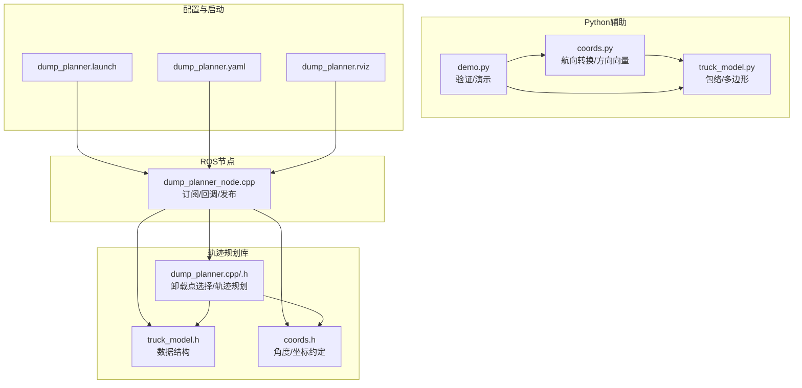
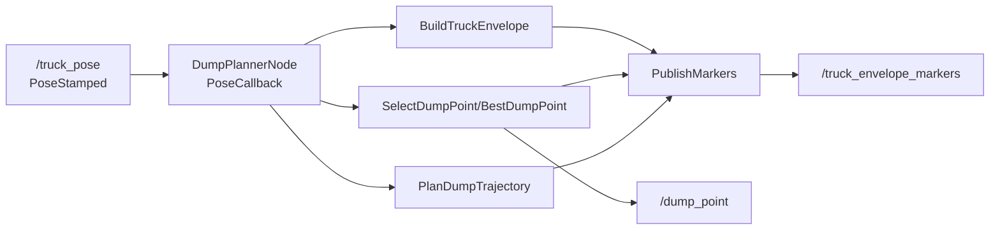
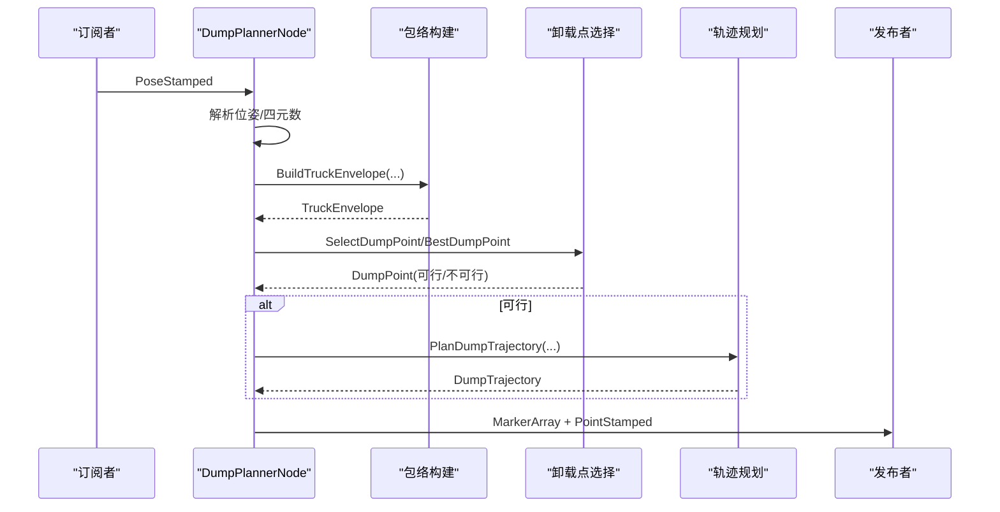
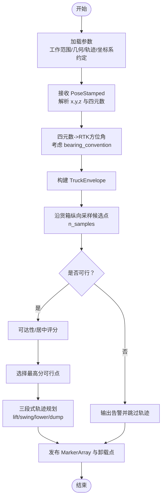
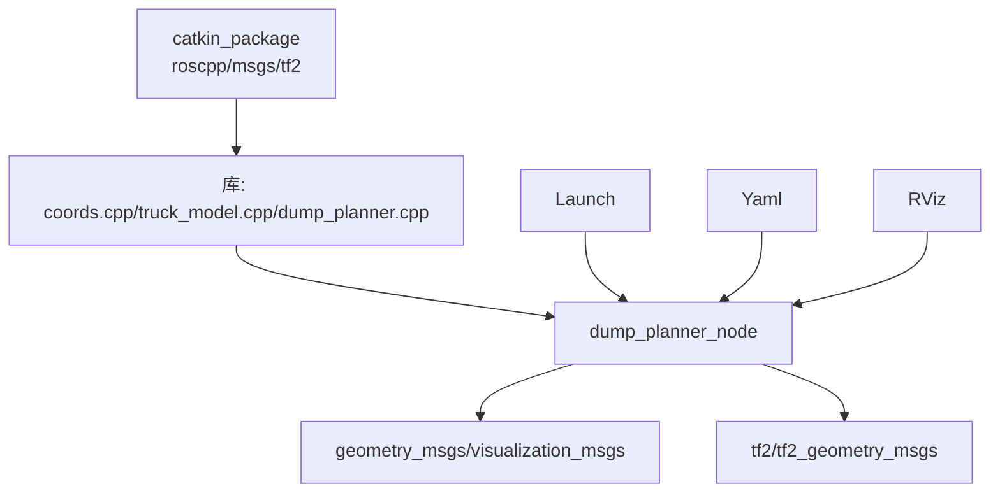

# 调试与性能分析

<cite>
**本文引用的文件**
- [dump_planner_node.cpp](file://src/truck_dump_planner/src/dump_planner_node.cpp)
- [dump_planner.cpp](file://src/truck_dump_planner/src/dump_planner.cpp)
- [dump_planner.h](file://src/truck_dump_planner/include/truck_dump_planner/dump_planner.h)
- [truck_model.h](file://src/truck_dump_planner/include/truck_dump_planner/truck_model.h)
- [coords.h](file://src/truck_dump_planner/include/truck_dump_planner/coords.h)
- [dump_planner.launch](file://src/truck_dump_planner/launch/dump_planner.launch)
- [dump_planner.yaml](file://src/truck_dump_planner/config/dump_planner.yaml)
- [dump_planner.rviz](file://src/truck_dump_planner/rviz/dump_planner.rviz)
- [CMakeLists.txt](file://src/truck_dump_planner/CMakeLists.txt)
- [package.xml](file://src/truck_dump_planner/package.xml)
- [coords.py](file://src/truck_envelope/coords.py)
- [truck_model.py](file://src/truck_envelope/truck_model.py)
- [demo.py](file://src/demo.py)
</cite>

## 目录
1. [简介](#简介)
2. [项目结构](#项目结构)
3. [核心组件](#核心组件)
4. [架构总览](#架构总览)
5. [详细组件分析](#详细组件分析)
6. [依赖分析](#依赖分析)
7. [性能考量](#性能考量)
8. [故障排查指南](#故障排查指南)
9. [结论](#结论)
10. [附录](#附录)

## 简介
本指南面向无人挖掘机装车轨迹规划系统，提供从ROS节点到轨迹规划算法的调试与性能分析方法。内容涵盖：
- ROS节点调试：日志输出、断点设置、动态参数调整
- 轨迹规划算法调试：中间结果可视化、关键参数监控
- 性能分析：CPU占用、内存、实时指标
- 计算瓶颈识别与优化
- 常见错误诊断与修复
- 调试工具链配置与最佳实践

## 项目结构
系统由C++ ROS节点与Python辅助模块组成，核心流程为：订阅卡车位姿 → 构建包络/选择卸载点/规划轨迹 → RViz可视化。

**图表来源**
- [dump_planner_node.cpp:1-341](file://src/truck_dump_planner/src/dump_planner_node.cpp#L1-L341)
- [dump_planner.cpp:1-120](file://src/truck_dump_planner/src/dump_planner.cpp#L1-L120)
- [dump_planner.h:1-66](file://src/truck_dump_planner/include/truck_dump_planner/dump_planner.h#L1-L66)
- [truck_model.h:1-60](file://src/truck_dump_planner/include/truck_dump_planner/truck_model.h#L1-L60)
- [coords.h:1-37](file://src/truck_dump_planner/include/truck_dump_planner/coords.h#L1-L37)
- [dump_planner.launch:1-26](file://src/truck_dump_planner/launch/dump_planner.launch#L1-L26)
- [dump_planner.yaml:1-43](file://src/truck_dump_planner/config/dump_planner.yaml#L1-L43)
- [dump_planner.rviz:1-131](file://src/truck_dump_planner/rviz/dump_planner.rviz#L1-L131)
- [coords.py:1-200](file://src/truck_envelope/coords.py#L1-L200)
- [truck_model.py:1-200](file://src/truck_envelope/truck_model.py#L1-L200)
- [demo.py:1-249](file://src/demo.py#L1-L249)

**章节来源**
- [dump_planner_node.cpp:1-341](file://src/truck_dump_planner/src/dump_planner_node.cpp#L1-L341)
- [dump_planner.cpp:1-120](file://src/truck_dump_planner/src/dump_planner.cpp#L1-L120)
- [dump_planner.h:1-66](file://src/truck_dump_planner/include/truck_dump_planner/dump_planner.h#L1-L66)
- [truck_model.h:1-60](file://src/truck_dump_planner/include/truck_dump_planner/truck_model.h#L1-L60)
- [coords.h:1-37](file://src/truck_dump_planner/include/truck_dump_planner/coords.h#L1-L37)
- [dump_planner.launch:1-26](file://src/truck_dump_planner/launch/dump_planner.launch#L1-L26)
- [dump_planner.yaml:1-43](file://src/truck_dump_planner/config/dump_planner.yaml#L1-L43)
- [dump_planner.rviz:1-131](file://src/truck_dump_planner/rviz/dump_planner.rviz#L1-L131)
- [coords.py:1-200](file://src/truck_envelope/coords.py#L1-L200)
- [truck_model.py:1-200](file://src/truck_envelope/truck_model.py#L1-L200)
- [demo.py:1-249](file://src/demo.py#L1-L249)

## 核心组件
- ROS节点：订阅卡车位姿，调用轨迹规划，发布RViz可视化与卸载点
- 轨迹规划库：卸载点候选生成与评分、轨迹三段式规划
- 数据结构：卡车参数、包络、轨迹点、工作范围限制
- 坐标系与角度：RTK方位角↔挖掘机航向角转换、xy轴地理朝向约定
- Python辅助：坐标系转换验证、包络构建演示、ASCII/图像输出

**章节来源**
- [dump_planner_node.cpp:25-136](file://src/truck_dump_planner/src/dump_planner_node.cpp#L25-L136)
- [dump_planner.h:10-62](file://src/truck_dump_planner/include/truck_dump_planner/dump_planner.h#L10-L62)
- [coords.h:6-32](file://src/truck_dump_planner/include/truck_dump_planner/coords.h#L6-L32)
- [demo.py:1-249](file://src/demo.py#L1-L249)

## 架构总览
系统采用“节点+库”的分层设计：节点负责ROS通信与可视化，库负责纯算法逻辑，便于独立测试与验证。

**图表来源**
- [dump_planner_node.cpp:99-136](file://src/truck_dump_planner/src/dump_planner_node.cpp#L99-L136)
- [dump_planner.cpp:7-75](file://src/truck_dump_planner/src/dump_planner.cpp#L7-L75)
- [dump_planner.h:42-61](file://src/truck_dump_planner/include/truck_dump_planner/dump_planner.h#L42-L61)

## 详细组件分析

### ROS节点调试要点
- 日志输出
  - 使用节流日志打印关键状态，便于观察周期性输出与异常告警
  - 关键路径：回调中根据可行性分支输出INFO/WARN_THROTTLE
- 断点设置
  - 在PoseCallback入口、包络构建、卸载点选择、轨迹规划处设置断点
  - 结合参数加载与坐标转换函数定位输入/输出异常
- 动态参数调整
  - 通过rosparam加载配置文件，支持运行时修改参数
  - 常用参数：工作范围、安全高度、轨迹步数、卸载点采样数、坐标系约定

**图表来源**
- [dump_planner_node.cpp:99-136](file://src/truck_dump_planner/src/dump_planner_node.cpp#L99-L136)
- [dump_planner.cpp:63-75](file://src/truck_dump_planner/src/dump_planner.cpp#L63-L75)
- [dump_planner.cpp:82-117](file://src/truck_dump_planner/src/dump_planner.cpp#L82-L117)

**章节来源**
- [dump_planner_node.cpp:37-38](file://src/truck_dump_planner/src/dump_planner_node.cpp#L37-L38)
- [dump_planner_node.cpp:127-135](file://src/truck_dump_planner/src/dump_planner_node.cpp#L127-L135)
- [dump_planner_node.cpp:99-136](file://src/truck_dump_planner/src/dump_planner_node.cpp#L99-L136)
- [dump_planner.yaml:1-43](file://src/truck_dump_planner/config/dump_planner.yaml#L1-L43)

### 轨迹规划算法调试策略
- 中间结果可视化
  - 使用RViz MarkerArray显示车体/货箱包络、方向箭头、卸载点、轨迹线与离散点
  - 可视化覆盖：DELETEALL清理、线框/球体/文本组合
- 关键参数监控
  - 工作范围：reach_min/max、dump_height_min/max、dump_clearance
  - 轨迹：safe_height、n_steps、n_samples
  - 坐标系：frame_id、axis_convention、bearing_convention
- 调试建议
  - 逐步缩小参数范围，验证包络与可行域
  - 修改n_samples与n_steps观察轨迹离散质量与性能变化
  - 切换axis_convention与bearing_convention验证角度一致性

**图表来源**
- [dump_planner_node.cpp:42-84](file://src/truck_dump_planner/src/dump_planner_node.cpp#L42-L84)
- [dump_planner_node.cpp:99-136](file://src/truck_dump_planner/src/dump_planner_node.cpp#L99-L136)
- [dump_planner.cpp:7-75](file://src/truck_dump_planner/src/dump_planner.cpp#L7-L75)
- [dump_planner.cpp:82-117](file://src/truck_dump_planner/src/dump_planner.cpp#L82-L117)

**章节来源**
- [dump_planner_node.cpp:139-313](file://src/truck_dump_planner/src/dump_planner_node.cpp#L139-L313)
- [dump_planner.cpp:7-75](file://src/truck_dump_planner/src/dump_planner.cpp#L7-L75)
- [dump_planner.cpp:82-117](file://src/truck_dump_planner/src/dump_planner.cpp#L82-L117)
- [dump_planner.yaml:14-43](file://src/truck_dump_planner/config/dump_planner.yaml#L14-L43)

### Python辅助模块的验证与演示
- 坐标系转换验证：RTK方位角↔挖掘机航向角、方向向量分解
- 包络构建演示：典型装车场景、ASCII/图像输出
- 与C++库接口一致，便于交叉验证

**章节来源**
- [coords.py:39-191](file://src/truck_envelope/coords.py#L39-L191)
- [truck_model.py:112-177](file://src/truck_envelope/truck_model.py#L112-L177)
- [demo.py:50-149](file://src/demo.py#L50-L149)

## 依赖分析
- 节点依赖ROS消息类型与tf2几何，发布MarkerArray与PointStamped
- 算法库与ROS解耦，可独立编译与测试
- 启动文件整合节点、测试位姿发布与RViz加载

**图表来源**
- [CMakeLists.txt:19-22](file://src/truck_dump_planner/CMakeLists.txt#L19-L22)
- [CMakeLists.txt:30-39](file://src/truck_dump_planner/CMakeLists.txt#L30-L39)
- [package.xml:12-18](file://src/truck_dump_planner/package.xml#L12-L18)
- [dump_planner.launch:8-25](file://src/truck_dump_planner/launch/dump_planner.launch#L8-L25)

**章节来源**
- [CMakeLists.txt:11-22](file://src/truck_dump_planner/CMakeLists.txt#L11-L22)
- [package.xml:12-18](file://src/truck_dump_planner/package.xml#L12-L18)
- [dump_planner.launch:1-26](file://src/truck_dump_planner/launch/dump_planner.launch#L1-L26)

## 性能考量
- 算法复杂度
  - 卸载点采样与排序：O(n log n)，n为采样数
  - 轨迹规划：O(n_steps)，分三段线性插值
- 内存使用
  - 主要为轨迹点容器与候选点向量，随n_samples与n_steps线性增长
- 实时性
  - 回调处理轻量，主要瓶颈在轨迹点生成与可视化发布
- 优化建议
  - 合理设置n_samples与n_steps，平衡精度与延迟
  - 减少不必要的MarkerArray重建，复用数组
  - 使用更高效的可视化队列大小与频率控制

**章节来源**
- [dump_planner.cpp:7-61](file://src/truck_dump_planner/src/dump_planner.cpp#L7-L61)
- [dump_planner.cpp:82-117](file://src/truck_dump_planner/src/dump_planner.cpp#L82-L117)
- [dump_planner_node.cpp:211-313](file://src/truck_dump_planner/src/dump_planner_node.cpp#L211-L313)

## 故障排查指南
- 无可行卸载点
  - 检查工作范围参数与卡车位置是否匹配
  - 查看回调中WARN_THROTTLE输出的β/α信息
- 轨迹不连续或抖动
  - 调整safe_height使其高于起点与终点
  - 增大n_steps提升平滑度
- 坐标系不一致
  - 核对bearing_convention与axis_convention
  - 使用Python演示验证角度转换
- RViz不显示或闪烁
  - 确认frame_id与固定帧一致
  - 检查MarkerArray命名空间与队列大小

**章节来源**
- [dump_planner_node.cpp:127-135](file://src/truck_dump_planner/src/dump_planner_node.cpp#L127-L135)
- [dump_planner.cpp:88-89](file://src/truck_dump_planner/src/dump_planner.cpp#L88-L89)
- [dump_planner.yaml:39-43](file://src/truck_dump_planner/config/dump_planner.yaml#L39-L43)
- [dump_planner.rviz:94-95](file://src/truck_dump_planner/rviz/dump_planner.rviz#L94-L95)

## 结论
通过结合ROS日志、断点调试、动态参数调整与RViz可视化，可高效定位轨迹规划问题。配合Python验证模块与合理的参数设置，可在保证实时性的前提下获得稳定可靠的轨迹输出。

## 附录
- 启动与验证
  - 使用启动文件一键启动节点、测试位姿与RViz
  - 使用Python演示快速验证坐标系与包络构建
- 常用命令
  - roslaunch truck_dump_planner dump_planner.launch
  - rosparam load config/dump_planner.yaml /dump_planner_node
  - rviz -d rviz/dump_planner.rviz

**章节来源**
- [dump_planner.launch:1-26](file://src/truck_dump_planner/launch/dump_planner.launch#L1-L26)
- [dump_planner.rviz:1-131](file://src/truck_dump_planner/rviz/dump_planner.rviz#L1-L131)
- [demo.py:1-249](file://src/demo.py#L1-L249)