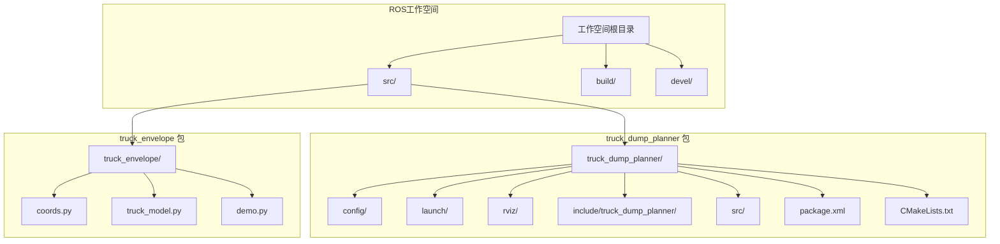
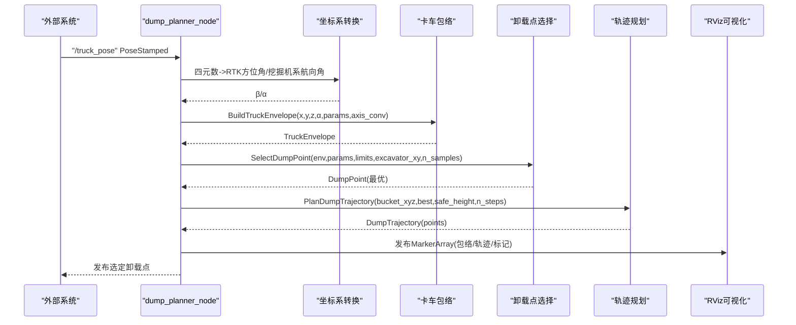
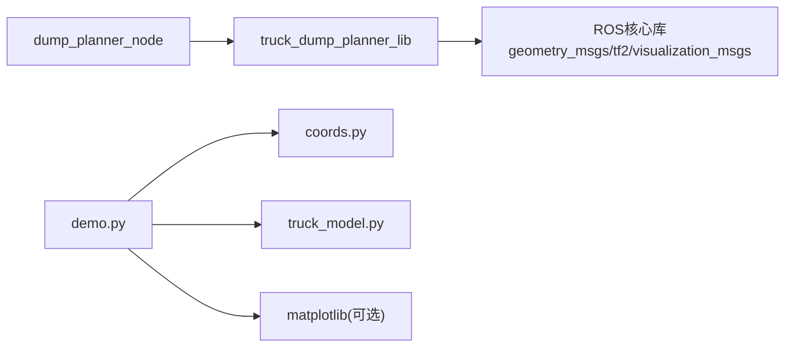

# 快速开始

<cite>
**本文引用的文件**
- [package.xml](file://src/truck_dump_planner/package.xml)
- [CMakeLists.txt](file://src/truck_dump_planner/CMakeLists.txt)
- [dump_planner.yaml](file://src/truck_dump_planner/config/dump_planner.yaml)
- [dump_planner.launch](file://src/truck_dump_planner/launch/dump_planner.launch)
- [dump_planner_node.cpp](file://src/truck_dump_planner/src/dump_planner_node.cpp)
- [dump_planner.h](file://src/truck_dump_planner/include/truck_dump_planner/dump_planner.h)
- [truck_model.h](file://src/truck_dump_planner/include/truck_dump_planner/truck_model.h)
- [coords.h](file://src/truck_dump_planner/include/truck_dump_planner/coords.h)
- [coords.py](file://src/truck_envelope/coords.py)
- [truck_model.py](file://src/truck_envelope/truck_model.py)
- [demo.py](file://src/demo.py)
- [dump_planner.rviz](file://src/truck_dump_planner/rviz/dump_planner.rviz)
</cite>

## 目录
1. [简介](#简介)
2. [项目结构](#项目结构)
3. [核心组件](#核心组件)
4. [架构概览](#架构概览)
5. [详细组件分析](#详细组件分析)
6. [依赖分析](#依赖分析)
7. [性能考虑](#性能考虑)
8. [故障排查指南](#故障排查指南)
9. [结论](#结论)
10. [附录](#附录)

## 简介
本指南面向首次部署无人挖掘机轨迹规划系统的用户，提供从ROS环境准备、依赖安装、项目编译构建到系统启动与验证的完整流程。系统基于ROS，核心功能包括：RTK方位角与挖掘机坐标系航向角转换、卡车包络建模、卸载点选择与轨迹规划，并通过RViz进行可视化展示。文档还包含配置文件详解、常用命令、常见问题排查以及基础使用示例，帮助您快速运行第一个实例。

## 项目结构
仓库采用标准ROS工作空间布局，主要模块如下：
- truck_dump_planner：核心算法与ROS节点，包含配置、launch、rviz、头文件与源码
- truck_envelope：Python辅助模块，提供坐标系转换与包络计算的纯Python实现，便于离线验证
- demo.py：综合演示脚本，验证坐标系转换、包络生成、卸载点选择与轨迹规划

图表来源
- [CMakeLists.txt:1-52](file://src/truck_dump_planner/CMakeLists.txt#L1-L52)
- [package.xml:1-20](file://src/truck_dump_planner/package.xml#L1-L20)

章节来源
- [CMakeLists.txt:1-52](file://src/truck_dump_planner/CMakeLists.txt#L1-L52)
- [package.xml:1-20](file://src/truck_dump_planner/package.xml#L1-L20)

## 核心组件
- ROS节点：dump_planner_node，负责订阅卡车位姿、执行包络与轨迹计算、发布RViz可视化MarkerArray与选定卸载点
- 算法库：truck_dump_planner_lib，包含坐标系转换、卡车包络、卸载点选择与轨迹规划的核心逻辑
- 配置系统：dump_planner.yaml，集中管理卡车几何、工作范围、轨迹参数与坐标系约定
- 启动系统：dump_planner.launch，一键启动节点、发布测试位姿与RViz
- 可视化：RViz配置文件，展示车体包络、货箱包络、卸载点与轨迹
- Python辅助：coords.py与truck_model.py，提供纯Python实现，便于离线验证与演示

章节来源
- [dump_planner_node.cpp:1-341](file://src/truck_dump_planner/src/dump_planner_node.cpp#L1-L341)
- [dump_planner.h:1-66](file://src/truck_dump_planner/include/truck_dump_planner/dump_planner.h#L1-L66)
- [truck_model.h:1-60](file://src/truck_dump_planner/include/truck_dump_planner/truck_model.h#L1-L60)
- [coords.h:1-200](file://src/truck_dump_planner/include/truck_dump_planner/coords.h#L1-L200)
- [coords.py:1-200](file://src/truck_envelope/coords.py#L1-L200)
- [truck_model.py:1-200](file://src/truck_envelope/truck_model.py#L1-L200)
- [dump_planner.yaml:1-43](file://src/truck_dump_planner/config/dump_planner.yaml#L1-L43)
- [dump_planner.launch:1-26](file://src/truck_dump_planner/launch/dump_planner.launch#L1-L26)
- [dump_planner.rviz:1-131](file://src/truck_dump_planner/rviz/dump_planner.rviz#L1-L131)

## 架构概览
系统采用“数据驱动”的处理链路：外部输入卡车位姿（位置+姿态），节点将其转换为RTK方位角与挖掘机系航向角，构建卡车包络，选择可行卸载点并规划轨迹，最终以MarkerArray形式在RViz中可视化。

图表来源
- [dump_planner_node.cpp:99-136](file://src/truck_dump_planner/src/dump_planner_node.cpp#L99-L136)
- [dump_planner_node.cpp:105-114](file://src/truck_dump_planner/src/dump_planner_node.cpp#L105-L114)
- [dump_planner.h:42-61](file://src/truck_dump_planner/include/truck_dump_planner/dump_planner.h#L42-L61)
- [truck_model.h:46-52](file://src/truck_dump_planner/include/truck_dump_planner/truck_model.h#L46-L52)

## 详细组件分析

### ROS节点：dump_planner_node
- 输入输出
  - 订阅：/truck_pose（geometry_msgs/PoseStamped）
  - 发布：/truck_envelope_markers（visualization_msgs/MarkerArray）、/dump_point（geometry_msgs/PointStamped）
- 关键处理流程
  - 读取参数：卡车几何、工作范围、轨迹参数、坐标系约定
  - 四元数解算：根据bearing_convention约定将四元数转换为RTK方位角α或直接视为α
  - 构建包络：调用BuildTruckEnvelope生成车体与货箱包络
  - 卸载点选择：BestDumpPoint返回评分最高的可行卸载点
  - 轨迹规划：PlanDumpTrajectory生成三段式轨迹（抬升→回转→下降）
  - 可视化：发布MarkerArray与选定卸载点
- 参数要点
  - frame_id：MarkerArray发布的坐标系名称
  - axis_convention：x东y北或x北y西的地理朝向约定
  - bearing_convention：四元数yaw与RTK方位角的约定（rep105_enu或yaw_is_bearing）

章节来源
- [dump_planner_node.cpp:1-341](file://src/truck_dump_planner/src/dump_planner_node.cpp#L1-L341)
- [dump_planner.h:42-61](file://src/truck_dump_planner/include/truck_dump_planner/dump_planner.h#L42-L61)
- [truck_model.h:46-52](file://src/truck_dump_planner/include/truck_dump_planner/truck_model.h#L46-L52)

### 配置文件：dump_planner.yaml
- 卡车几何（米）
  - length/width：车体总长/总宽
  - ref_offset：车体几何中心相对参考点的纵向偏移
  - box_length/box_width/box_height：货箱尺寸与侧壁高度
  - box_center_offset：货箱中心相对参考点的纵向偏移
- 挖掘机工作范围
  - reach_min/reach_max：最小/最大卸载半径
  - dump_height_max/dump_height_min：最大/最小卸载高度
  - dump_clearance：铲斗底门距货箱顶面间隙
- 铲斗当前位置（挖掘机系）
  - bucket.x/y/z：轨迹起点
- 轨迹规划
  - safe_height：回转安全高度
  - n_steps：轨迹离散点数
- 卸载点采样
  - n_samples：沿货箱纵向采样点数
- 坐标系约定
  - frame_id：MarkerArray坐标系
  - axis_convention：east_north或north_west
  - bearing_convention：rep105_enu或yaw_is_bearing

章节来源
- [dump_planner.yaml:1-43](file://src/truck_dump_planner/config/dump_planner.yaml#L1-L43)

### 启动文件：dump_planner.launch
- 功能
  - 启动dump_planner_node并加载参数
  - 可选发布静态测试卡车位姿（用于验证）
  - 可选启动RViz并加载预设配置
- 关键参数
  - test：是否发布测试位姿
  - rviz：是否启动RViz
  - remap：将输入重映射至/truck_pose

章节来源
- [dump_planner.launch:1-26](file://src/truck_dump_planner/launch/dump_planner.launch#L1-L26)

### 可视化：dump_planner.rviz
- 显示内容
  - Grid：网格背景
  - Axes：原点坐标轴
  - MarkerArray：车体包络、货箱包络、朝向箭头、货箱中心、挖掘机中心、卸载点、轨迹
- 关键设置
  - Fixed Frame：excavator
  - Marker Topic：/truck_envelope_markers

章节来源
- [dump_planner.rviz:1-131](file://src/truck_dump_planner/rviz/dump_planner.rviz#L1-L131)

### Python辅助模块：coords.py 与 truck_model.py
- coords.py
  - 提供RTK方位角α与挖掘机系航向角β之间的双向转换
  - 定义坐标轴约定（east_north/north_west），并提供β→(dx,dy)的向量分解
- truck_model.py
  - 定义TruckParams与TruckEnvelope数据结构
  - 实现build_truck_envelope：在挖掘机坐标系下生成车体与货箱包络
  - 提供point_in_polygon用于点在多边形内的判定

章节来源
- [coords.py:1-200](file://src/truck_envelope/coords.py#L1-L200)
- [truck_model.py:1-200](file://src/truck_envelope/truck_model.py#L1-L200)

### 演示脚本：demo.py
- 功能
  - 验证坐标系转换与方向向量分解
  - 构建典型装车场景：生成包络、选择卸载点、规划轨迹
  - 输出ASCII俯视图与可选matplotlib示意图
- 使用方式
  - 直接运行：python3 src/demo.py

章节来源
- [demo.py:1-249](file://src/demo.py#L1-L249)

## 依赖分析
- ROS依赖
  - roscpp、geometry_msgs、visualization_msgs、tf2、tf2_geometry_msgs
- 编译与链接
  - C++库：truck_dump_planner_lib（核心算法）
  - 可执行节点：dump_planner_node（依赖库与ROS）
- Python依赖（演示与验证）
  - matplotlib（可选，用于生成示意图）

图表来源
- [CMakeLists.txt:30-45](file://src/truck_dump_planner/CMakeLists.txt#L30-L45)
- [package.xml:12-19](file://src/truck_dump_planner/package.xml#L12-L19)

章节来源
- [CMakeLists.txt:11-27](file://src/truck_dump_planner/CMakeLists.txt#L11-L27)
- [package.xml:12-19](file://src/truck_dump_planner/package.xml#L12-L19)

## 性能考虑
- 轨迹离散点数（n_steps）与卸载点采样数（n_samples）影响计算时间与精度，建议在保证可视性的前提下适度调整
- 坐标系转换与包络计算为纯数学运算，开销较低；轨迹规划采用半余弦平滑，计算量可控
- RViz渲染的MarkerArray数量较多时可能影响帧率，可通过减少显示元素或降低刷新频率优化

## 故障排查指南
- 无法找到dump_planner_node
  - 确认已catkin_make并source工作空间
  - 检查节点是否正确安装到bin目录
- /truck_pose未收到消息
  - 确认外部系统是否发布该话题
  - 检查remap是否正确（/truck_pose）
- 坐标系或航向角异常
  - 检查bearing_convention与axis_convention设置
  - 确认四元数表示与约定一致
- 无可行卸载点
  - 检查excavator工作范围参数（reach/dump_height）
  - 调整卡车位置或货箱尺寸参数
- RViz不显示内容
  - 确认MarkerArray主题名与RViz配置一致
  - 检查Fixed Frame是否为excavator

章节来源
- [dump_planner_node.cpp:35-38](file://src/truck_dump_planner/src/dump_planner_node.cpp#L35-L38)
- [dump_planner.launch:10-12](file://src/truck_dump_planner/launch/dump_planner.launch#L10-L12)
- [dump_planner.rviz:82-89](file://src/truck_dump_planner/rviz/dump_planner.rviz#L82-L89)

## 结论
通过本指南，您可以完成ROS环境准备、依赖安装、项目编译构建与系统启动。建议先使用dump_planner.launch提供的测试位姿验证流程，再接入真实外部系统。如需离线验证，可运行demo.py查看坐标系转换与包络生成效果。遇到问题时，优先检查参数配置与话题连接。

## 附录

### 快速开始步骤
- 准备ROS环境
  - 安装ROS（如使用Ubuntu 20.04，推荐Noetic）
  - 创建工作空间：mkdir -p ~/yx_planning_ws/src && cd ~/yx_planning_ws
- 获取代码
  - 将仓库克隆到src/目录
- 安装依赖
  - 确保系统具备编译工具链与Python依赖
  - 安装matplotlib（可选，用于demo.py生成示意图）
- 编译构建
  - catkin_make（建议在工作空间根目录执行）
- 启动系统
  - 启动：roslaunch truck_dump_planner dump_planner.launch
  - 可选参数：test:=false rviz:=false
- 验证结果
  - 在RViz中观察车体/货箱包络、卸载点与轨迹
  - 查看/robot_state_publisher与/pose_stamped等话题确认数据流

章节来源
- [dump_planner.launch:1-26](file://src/truck_dump_planner/launch/dump_planner.launch#L1-L26)
- [dump_planner.rviz:82-89](file://src/truck_dump_planner/rviz/dump_planner.rviz#L82-L89)

### 启动命令与参数说明
- 基本启动
  - roslaunch truck_dump_planner dump_planner.launch
- 关键参数
  - test：是否发布静态测试位姿（默认true）
  - rviz：是否启动RViz（默认true）
  - remap：输入话题重映射至/truck_pose
- 节点参数（在dump_planner.yaml中配置）
  - truck.*：卡车几何参数
  - excavator.*：挖掘机工作范围
  - bucket.*：铲斗当前位置
  - trajectory.*：轨迹规划参数
  - dump.*：卸载点采样
  - frame_id/axis_convention/bearing_convention：坐标系约定

章节来源
- [dump_planner.launch:4-12](file://src/truck_dump_planner/launch/dump_planner.launch#L4-L12)
- [dump_planner.yaml:1-43](file://src/truck_dump_planner/config/dump_planner.yaml#L1-L43)

### 配置文件详解
- 卡车几何（truck.*）
  - length/width：车体尺寸
  - ref_offset：参考点相对于几何中心的纵向偏移
  - box_*：货箱尺寸与高度
- 挖掘机工作范围（excavator.*）
  - reach_*：卸载半径上下限
  - dump_height_*：卸载高度上下限
  - dump_clearance：卸载间隙
- 铲斗当前位置（bucket.*）
  - x/y/z：轨迹起点
- 轨迹规划（trajectory.*）
  - safe_height：回转安全高度
  - n_steps：轨迹离散点数
- 卸载点采样（dump.*）
  - n_samples：纵向采样点数
- 坐标系约定（frame_id/axis_convention/bearing_convention）
  - frame_id：MarkerArray坐标系
  - axis_convention：east_north或north_west
  - bearing_convention：rep105_enu或yaw_is_bearing

章节来源
- [dump_planner.yaml:4-43](file://src/truck_dump_planner/config/dump_planner.yaml#L4-L43)

### 基本使用示例与验证方法
- 示例1：使用测试位姿验证
  - 启动：roslaunch truck_dump_planner dump_planner.launch
  - 预期：RViz显示包络与轨迹，控制台打印选定卸载点信息
- 示例2：接入真实位姿
  - 启动：roslaunch truck_dump_planner dump_planner.launch test:=false
  - 发布：rostopic pub -r 2 /truck_pose geometry_msgs/PoseStamped '{header: {frame_id: "excavator"}, pose: {position: {x: 4.0, y: 8.0, z: 0.0}, orientation: {x: 0.0, y: 0.0, z: 0.2588, w: 0.9659}}}'
  - 预期：节点订阅位姿并发布MarkerArray与卸载点
- 示例3：离线验证
  - 运行：python3 src/demo.py
  - 预期：输出坐标系转换与方向向量验证结果、ASCII俯视图与可选PNG

章节来源
- [dump_planner.launch:14-24](file://src/truck_dump_planner/launch/dump_planner.launch#L14-L24)
- [demo.py:1-249](file://src/demo.py#L1-L249)