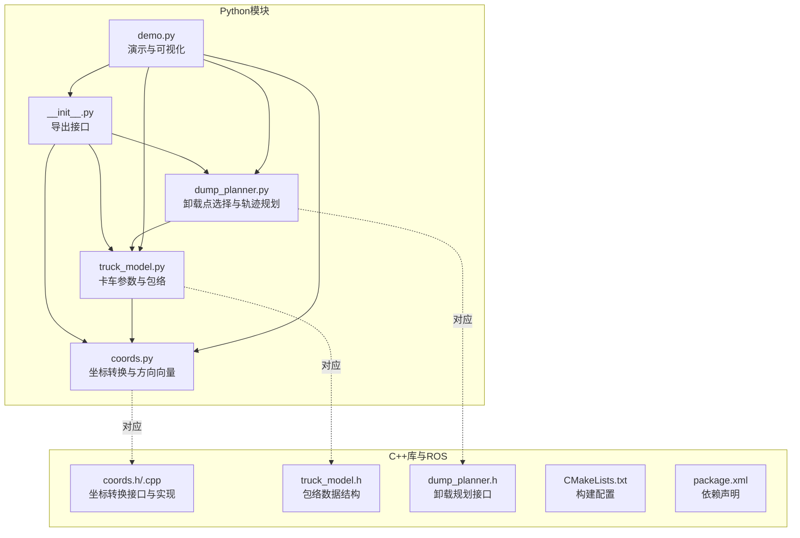
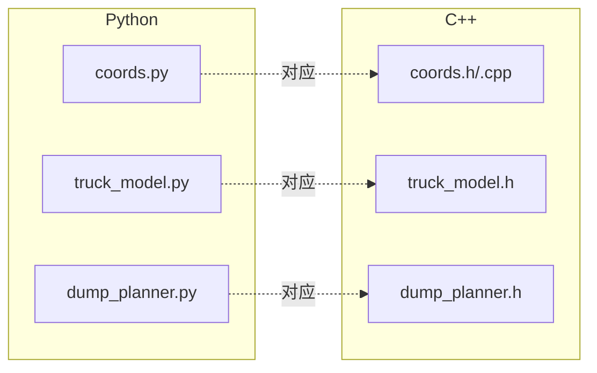
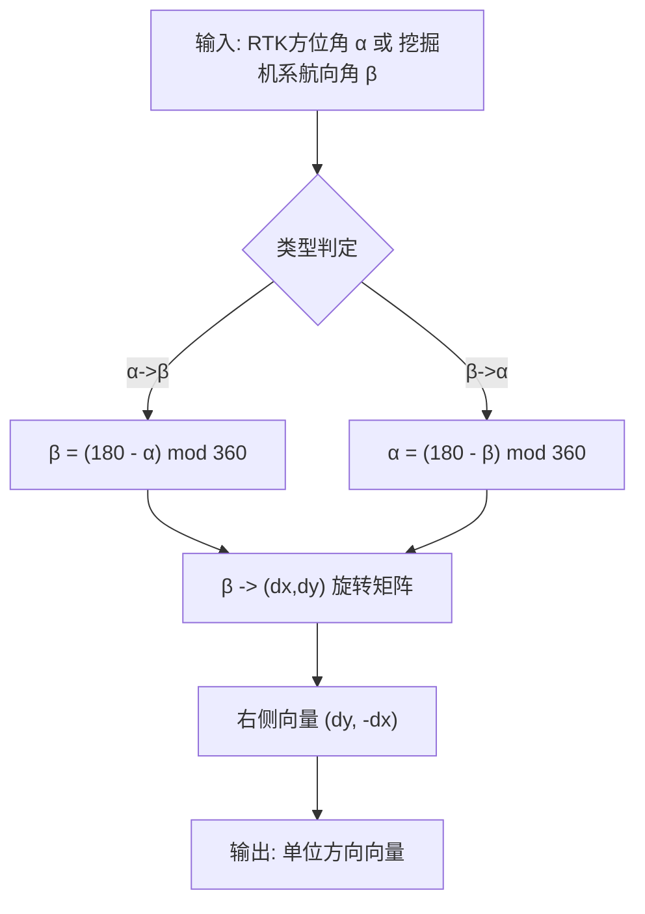
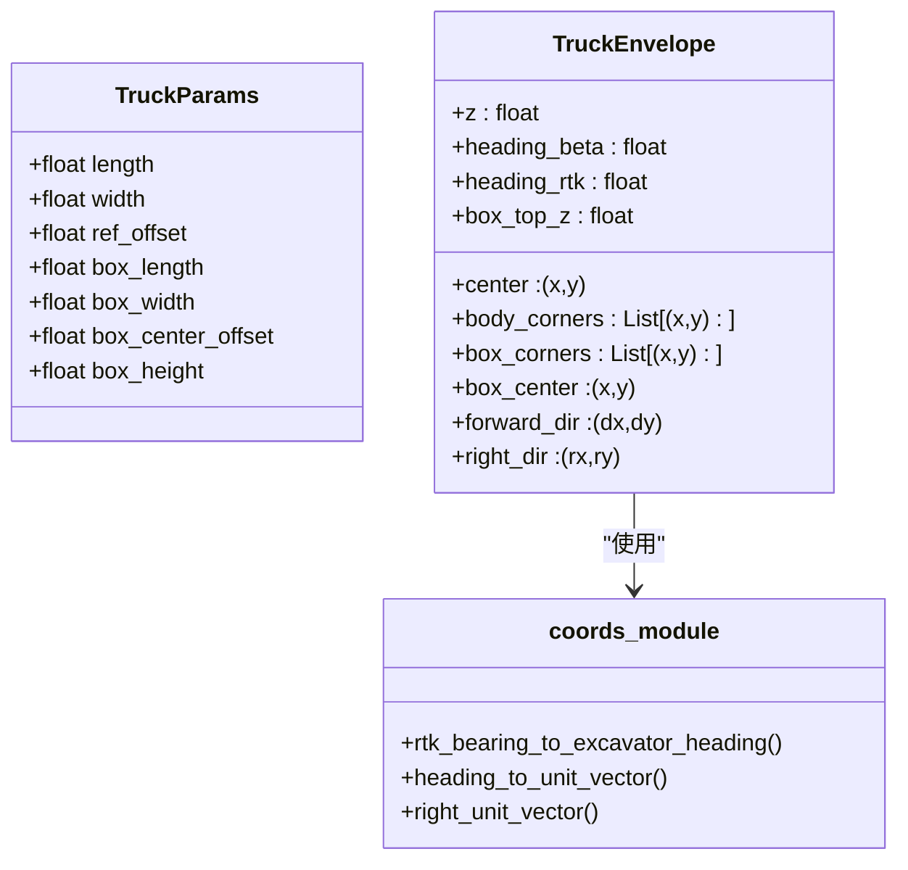
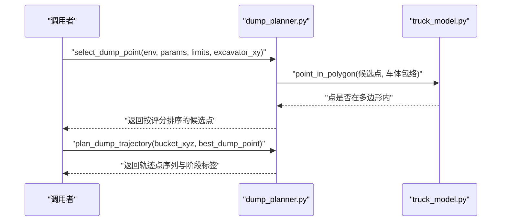
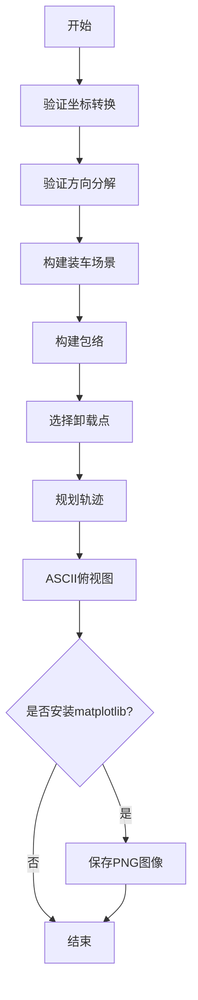
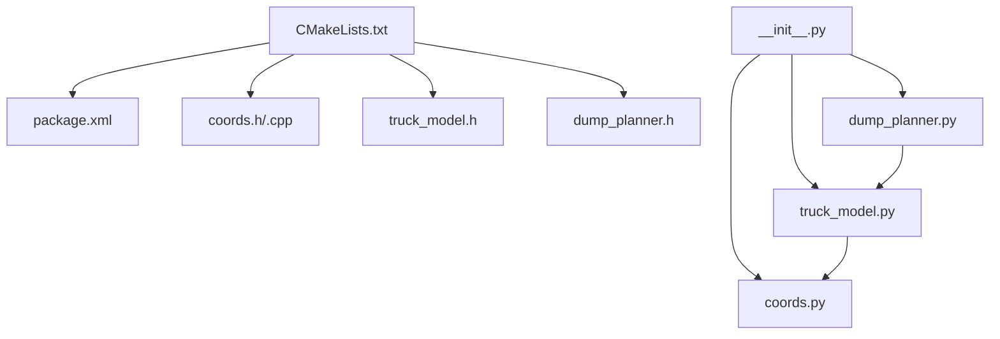

# Python辅助模块

<cite>
**本文引用的文件列表**
- [__init__.py](file://src/truck_envelope/__init__.py)
- [coords.py](file://src/truck_envelope/coords.py)
- [truck_model.py](file://src/truck_envelope/truck_model.py)
- [dump_planner.py](file://src/truck_envelope/dump_planner.py)
- [demo.py](file://src/demo.py)
- [coords.h](file://src/truck_dump_planner/include/truck_dump_planner/coords.h)
- [dump_planner.h](file://src/truck_dump_planner/include/truck_dump_planner/dump_planner.h)
- [truck_model.h](file://src/truck_dump_planner/include/truck_dump_planner/truck_model.h)
- [coords.cpp](file://src/truck_dump_planner/src/coords.cpp)
- [CMakeLists.txt](file://src/truck_dump_planner/CMakeLists.txt)
- [package.xml](file://src/truck_dump_planner/package.xml)
</cite>

## 目录
1. [简介](#简介)
2. [项目结构](#项目结构)
3. [核心组件](#核心组件)
4. [架构总览](#架构总览)
5. [详细组件分析](#详细组件分析)
6. [依赖关系分析](#依赖关系分析)
7. [性能考量](#性能考量)
8. [故障排查指南](#故障排查指南)
9. [结论](#结论)
10. [附录](#附录)

## 简介
本技术文档围绕Python辅助模块“truck_envelope”展开，系统阐述其在无人挖掘机装车场景中的作用：提供坐标系转换、卡车包络建模、卸载点选择与轨迹规划能力。文档重点包括：
- TruckEnvelope类的设计与几何计算方法
- coords.py模块中的坐标转换函数实现及其与C++版本的对应关系
- demo.py演示程序的功能架构与使用方法（ASCII可视化与可选图形输出）
- Python模块的安装配置与依赖要求
- 使用示例与代码片段路径，展示如何在Python环境中调用核心算法功能
- Python实现与C++版本的差异及各自适用场景

## 项目结构
仓库包含两个主要部分：
- Python模块：truck_envelope（坐标转换、卡车包络、卸载规划）
- C++库与ROS节点：truck_dump_planner（核心算法库与可视化节点）

图表来源
- [__init__.py:1-36](file://src/truck_envelope/__init__.py#L1-L36)
- [coords.py:1-200](file://src/truck_envelope/coords.py#L1-L200)
- [truck_model.py:1-200](file://src/truck_envelope/truck_model.py#L1-L200)
- [dump_planner.py:1-222](file://src/truck_envelope/dump_planner.py#L1-L222)
- [demo.py:1-249](file://src/demo.py#L1-L249)
- [coords.h:1-37](file://src/truck_dump_planner/include/truck_dump_planner/coords.h#L1-L37)
- [truck_model.h:1-60](file://src/truck_dump_planner/include/truck_dump_planner/truck_model.h#L1-L60)
- [dump_planner.h:1-66](file://src/truck_dump_planner/include/truck_dump_planner/dump_planner.h#L1-L66)
- [coords.cpp:1-52](file://src/truck_dump_planner/src/coords.cpp#L1-L52)

章节来源
- [__init__.py:1-36](file://src/truck_envelope/__init__.py#L1-L36)
- [CMakeLists.txt:1-52](file://src/truck_dump_planner/CMakeLists.txt#L1-L52)
- [package.xml:1-20](file://src/truck_dump_planner/package.xml#L1-L20)

## 核心组件
- 坐标转换与方向向量（coords.py）
  - 提供RTK方位角与挖掘机系航向角之间的双向转换
  - 提供航向角到xy平面单位方向向量的分解，支持多种轴约定
  - 提供车头方向到右侧方向的单位向量计算
- 卡车包络建模（truck_model.py）
  - 定义卡车几何参数与货箱参数
  - 在挖掘机坐标系下构建车体与货箱包络多边形
  - 提供点在多边形内的判断（射线法）
- 卸载点选择与轨迹规划（dump_planner.py）
  - 在货箱顶面生成候选卸载点，基于工作范围与高度限制进行筛选与评分
  - 规划从铲斗当前位置到卸载点的三段式轨迹（抬升-回转-下放），采用半余弦平滑
- 演示与可视化（demo.py）
  - 验证坐标转换与方向分解
  - 构建典型装车场景，输出ASCII俯视图与可选PNG图像

章节来源
- [coords.py:1-200](file://src/truck_envelope/coords.py#L1-L200)
- [truck_model.py:1-200](file://src/truck_envelope/truck_model.py#L1-L200)
- [dump_planner.py:1-222](file://src/truck_envelope/dump_planner.py#L1-L222)
- [demo.py:1-249](file://src/demo.py#L1-L249)

## 架构总览
Python模块与C++库在概念上一一对应，均提供：
- 坐标转换与方向向量
- 卡车包络建模
- 卸载点选择与轨迹规划

图表来源
- [coords.py:1-200](file://src/truck_envelope/coords.py#L1-L200)
- [coords.h:1-37](file://src/truck_dump_planner/include/truck_dump_planner/coords.h#L1-L37)
- [coords.cpp:1-52](file://src/truck_dump_planner/src/coords.cpp#L1-L52)
- [truck_model.py:1-200](file://src/truck_envelope/truck_model.py#L1-L200)
- [truck_model.h:1-60](file://src/truck_dump_planner/include/truck_dump_planner/truck_model.h#L1-L60)
- [dump_planner.py:1-222](file://src/truck_envelope/dump_planner.py#L1-L222)
- [dump_planner.h:1-66](file://src/truck_dump_planner/include/truck_dump_planner/dump_planner.h#L1-L66)

## 详细组件分析

### 坐标转换与方向向量（coords.py）
- 角度归一化与航向角转换
  - 提供角度归一化到[0, 360)的工具函数
  - RTK方位角α与挖掘机系航向角β的双向转换：β = (180 - α) mod 360
- 轴约定与方向向量分解
  - 支持两种轴约定：x=东,y=北（ENU，默认）与x=北,y=西
  - 将航向角β分解为xy平面单位方向向量(dx, dy)，通过旋转矩阵实现
  - 提供右侧方向向量计算：(dy, -dx)
- 与C++版本的对应关系
  - 函数名与逻辑一致：Wrap360、RtkBearingToExcavatorHeading、ExcavatorHeadingToRtkBearing、HeadingToUnitVector、RightUnitVector
  - C++版本以枚举AxisConvention区分约定，Python版本以字符串键控字典管理约定

图表来源
- [coords.py:34-60](file://src/truck_envelope/coords.py#L34-L60)
- [coords.py:121-151](file://src/truck_envelope/coords.py#L121-L151)
- [coords.py:193-200](file://src/truck_envelope/coords.py#L193-L200)

章节来源
- [coords.py:1-200](file://src/truck_envelope/coords.py#L1-L200)
- [coords.h:10-32](file://src/truck_dump_planner/include/truck_dump_planner/coords.h#L10-L32)
- [coords.cpp:6-49](file://src/truck_dump_planner/src/coords.cpp#L6-L49)

### 卡车包络建模（truck_model.py）
- 数据结构
  - TruckParams：卡车几何与货箱参数（长度、宽度、参考点偏移、货箱尺寸与高度等）
  - TruckEnvelope：包络描述（中心点、高度、航向、车体/货箱四角、方向向量等）
- 包络构建流程
  - 将RTK方位角转换为挖掘机系航向角
  - 计算车头与右侧单位向量
  - 以参考点为中心，按长度/宽度与中心偏移计算车体与货箱四角
  - 计算货箱中心与顶面高度
- 几何计算要点
  - 矩形四角按逆时针顺序：前左、后左、后右、前右
  - 中心偏移用于将参考点设置在几何中心或后轴等位置
- 与C++版本的对应关系
  - 结构体TruckParams与TruckEnvelope与C++版本一一对应
  - 函数BuildTruckEnvelope与PointInPolygon在命名与语义上一致

图表来源
- [truck_model.py:36-82](file://src/truck_envelope/truck_model.py#L36-L82)
- [truck_model.py:112-177](file://src/truck_envelope/truck_model.py#L112-L177)
- [coords.py:39-60](file://src/truck_envelope/coords.py#L39-L60)
- [coords.py:154-191](file://src/truck_envelope/coords.py#L154-L191)
- [coords.py:193-200](file://src/truck_envelope/coords.py#L193-L200)

章节来源
- [truck_model.py:1-200](file://src/truck_envelope/truck_model.py#L1-L200)
- [truck_model.h:21-44](file://src/truck_dump_planner/include/truck_dump_planner/truck_model.h#L21-L44)
- [coords.h:13-32](file://src/truck_dump_planner/include/truck_dump_planner/coords.h#L13-L32)

### 卸载点选择与轨迹规划（dump_planner.py）
- 卸载点选择
  - 在货箱顶面沿纵向均匀采样，生成候选点
  - 基于工作半径、高度限制与包络合法性进行筛选
  - 评分综合考虑距离与对中程度，返回按分数排序的候选
- 轨迹规划
  - 三段式：抬升（z从起点升到安全高度）、回转（xy在安全高度上插值）、下放（z从安全高度降到卸载高度）
  - 每段采用半余弦平滑，避免速度突变
- 与C++版本的对应关系
  - 接口名称与行为一致：SelectDumpPoint、BestDumpPoint、PlanDumpTrajectory
  - 数据结构DumpPoint、DumpTrajectory与C++版本一一对应

图表来源
- [dump_planner.py:69-140](file://src/truck_envelope/dump_planner.py#L69-L140)
- [dump_planner.py:143-207](file://src/truck_envelope/dump_planner.py#L143-L207)
- [truck_model.py:180-194](file://src/truck_envelope/truck_model.py#L180-L194)
- [dump_planner.h:42-61](file://src/truck_dump_planner/include/truck_dump_planner/dump_planner.h#L42-L61)

章节来源
- [dump_planner.py:1-222](file://src/truck_envelope/dump_planner.py#L1-L222)
- [dump_planner.h:10-41](file://src/truck_dump_planner/include/truck_dump_planner/dump_planner.h#L10-L41)

### 演示程序（demo.py）
- 功能架构
  - 验证坐标转换与方向分解
  - 构建典型装车场景：构建包络、选择卸载点、规划轨迹
  - ASCII俯视图输出：将包络与关键点映射到字符网格
  - 可选图形输出：使用matplotlib保存PNG图像
- 使用方法
  - 直接运行：python3 src/demo.py
  - 依赖：truck_envelope包（可通过将src加入sys.path实现）
- 关键流程
  - 验证转换关系与方向分解
  - 构建TruckParams与TruckEnvelope
  - 选择可行卸载点并评分
  - 规划轨迹并统计阶段分布
  - 输出ASCII图与可选PNG

图表来源
- [demo.py:24-42](file://src/demo.py#L24-L42)
- [demo.py:50-91](file://src/demo.py#L50-L91)
- [demo.py:93-149](file://src/demo.py#L93-L149)
- [demo.py:152-206](file://src/demo.py#L152-L206)
- [demo.py:208-236](file://src/demo.py#L208-L236)

章节来源
- [demo.py:1-249](file://src/demo.py#L1-L249)

## 依赖关系分析
- Python模块内部依赖
  - truck_model.py依赖coords.py提供的坐标转换函数
  - dump_planner.py依赖truck_model.py的包络与点在多边形内的判断
  - __init__.py统一导出接口，便于外部导入
- C++库与ROS依赖
  - CMakeLists声明依赖roscpp、geometry_msgs、visualization_msgs、tf2、tf2_geometry_msgs
  - package.xml声明构建工具与运行时依赖
- Python与C++的接口一致性
  - 坐标转换、包络建模、卸载规划的函数/结构体命名与语义高度一致

图表来源
- [__init__.py:1-36](file://src/truck_envelope/__init__.py#L1-L36)
- [CMakeLists.txt:11-22](file://src/truck_dump_planner/CMakeLists.txt#L11-L22)
- [package.xml:12-18](file://src/truck_dump_planner/package.xml#L12-L18)

章节来源
- [__init__.py:1-36](file://src/truck_envelope/__init__.py#L1-L36)
- [CMakeLists.txt:1-52](file://src/truck_dump_planner/CMakeLists.txt#L1-L52)
- [package.xml:1-20](file://src/truck_dump_planner/package.xml#L1-L20)

## 性能考量
- 时间复杂度
  - 坐标转换与方向向量：O(1)
  - 包络构建：O(1)（矩形四角计算）
  - 卸载点选择：O(n)，n为纵向采样点数
  - 轨迹规划：O(n_steps)
  - 多边形包含判断：射线法O(m)，m为多边形边数（通常为4）
- 空间复杂度
  - 主要取决于轨迹点数量与候选点集合大小
- 优化建议
  - 采样点数与步数可根据实时性需求调整
  - 可缓存常用转换结果（如在循环中重复使用相同航向角）
  - 多边形判断可结合包围盒预判减少不必要的射线法计算

## 故障排查指南
- 坐标转换错误
  - 确认输入角度范围与约定一致（ENU vs North-West）
  - 检查角度归一化是否正确
- 包络方向异常
  - 核对航向角β与车头方向单位向量的对应关系
  - 检查轴约定是否与实际地图/传感器一致
- 卸载点不可行
  - 检查工作半径与高度限制是否合理
  - 确认点在多边形内的判断是否正确
- 可视化缺失
  - 若未安装matplotlib，将跳过PNG保存；可通过pip安装以启用图形输出

章节来源
- [coords.py:34-60](file://src/truck_envelope/coords.py#L34-L60)
- [truck_model.py:180-194](file://src/truck_envelope/truck_model.py#L180-L194)
- [demo.py:208-236](file://src/demo.py#L208-L236)

## 结论
Python辅助模块truck_envelope提供了与C++库一致的坐标转换、包络建模与卸载规划能力，适合在非ROS环境下快速验证算法与进行原型开发。C++库则更适合集成到ROS系统中，配合RViz进行可视化与仿真。两者在接口设计与算法逻辑上高度一致，便于跨语言迁移与对比验证。

## 附录

### 安装与配置
- Python环境
  - Python 3.8+（推荐）
  - 依赖：无外部依赖（仅标准库）
  - 可选：matplotlib（用于生成PNG图像）
- 运行演示
  - 直接运行：python3 src/demo.py
  - 若提示模块导入失败，确保将src目录加入sys.path或安装为包

章节来源
- [demo.py:21-23](file://src/demo.py#L21-L23)
- [demo.py:208-236](file://src/demo.py#L208-L236)

### 使用示例与代码片段路径
- 验证坐标转换
  - [rtk_bearing_to_excavator_heading:39-55](file://src/truck_envelope/coords.py#L39-L55)
  - [excavator_heading_to_rtk_bearing:58-60](file://src/truck_envelope/coords.py#L58-L60)
- 方向向量分解
  - [heading_to_unit_vector:154-191](file://src/truck_envelope/coords.py#L154-L191)
  - [right_unit_vector:193-200](file://src/truck_envelope/coords.py#L193-L200)
- 构建包络
  - [TruckParams:36-63](file://src/truck_envelope/truck_model.py#L36-L63)
  - [TruckEnvelope:65-82](file://src/truck_envelope/truck_model.py#L65-L82)
  - [build_truck_envelope:112-177](file://src/truck_envelope/truck_model.py#L112-L177)
- 卸载点选择与轨迹规划
  - [select_dump_point:69-140](file://src/truck_envelope/dump_planner.py#L69-L140)
  - [best_dump_point:210-222](file://src/truck_envelope/dump_planner.py#L210-L222)
  - [plan_dump_trajectory:143-207](file://src/truck_envelope/dump_planner.py#L143-L207)
- 演示程序
  - [demo.py 主流程:238-249](file://src/demo.py#L238-L249)
  - [ASCII俯视图:152-206](file://src/demo.py#L152-L206)

### Python与C++版本差异与适用场景
- 差异
  - Python版本使用dataclasses与typing增强可读性与静态检查
  - C++版本使用结构体与枚举，接口以头文件声明，编译期类型安全
  - C++版本提供完整的ROS节点与可视化（MarkerArray），Python版本侧重算法与演示
- 适用场景
  - Python：快速原型、算法验证、教学演示、非ROS系统集成
  - C++：ROS机器人系统、实时控制、RViz可视化与仿真

章节来源
- [coords.h:13-32](file://src/truck_dump_planner/include/truck_dump_planner/coords.h#L13-L32)
- [truck_model.h:21-44](file://src/truck_dump_planner/include/truck_dump_planner/truck_model.h#L21-L44)
- [dump_planner.h:10-41](file://src/truck_dump_planner/include/truck_dump_planner/dump_planner.h#L10-L41)
- [CMakeLists.txt:37-45](file://src/truck_dump_planner/CMakeLists.txt#L37-L45)