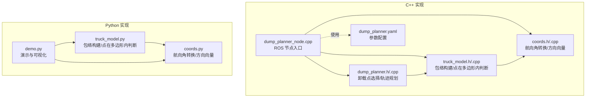
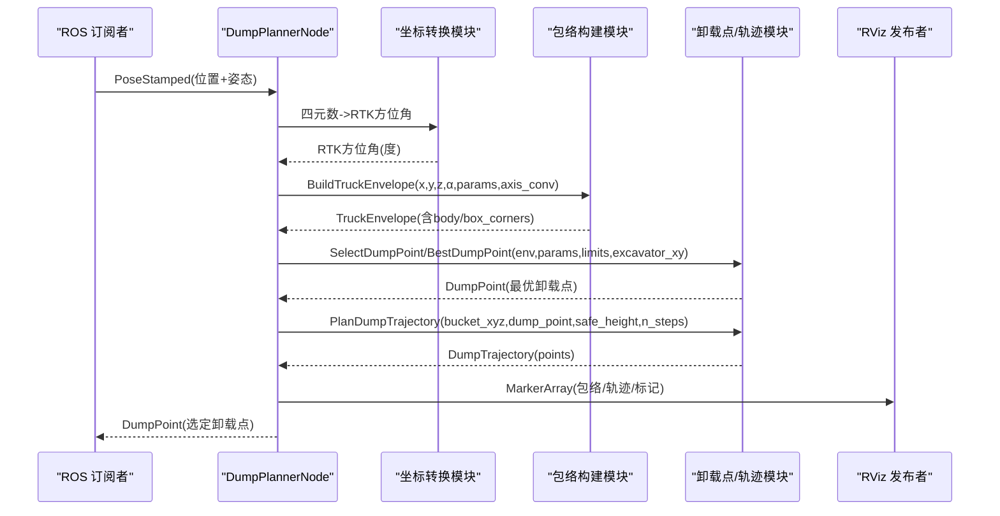
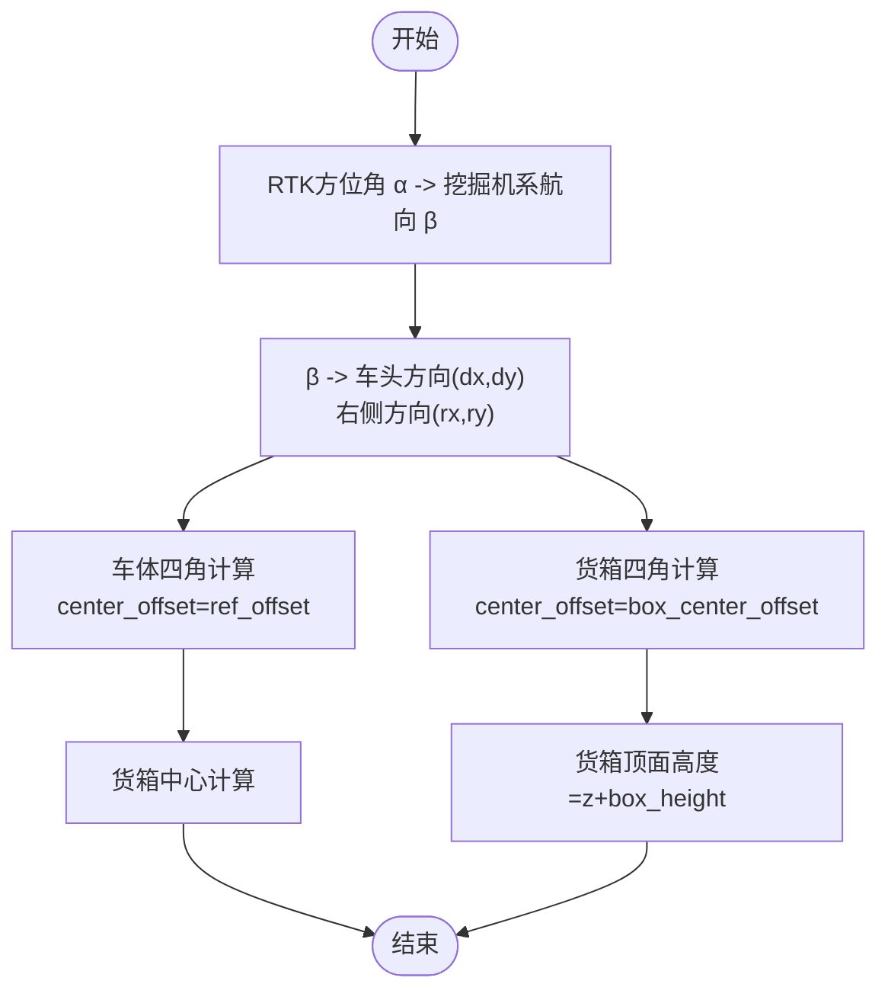
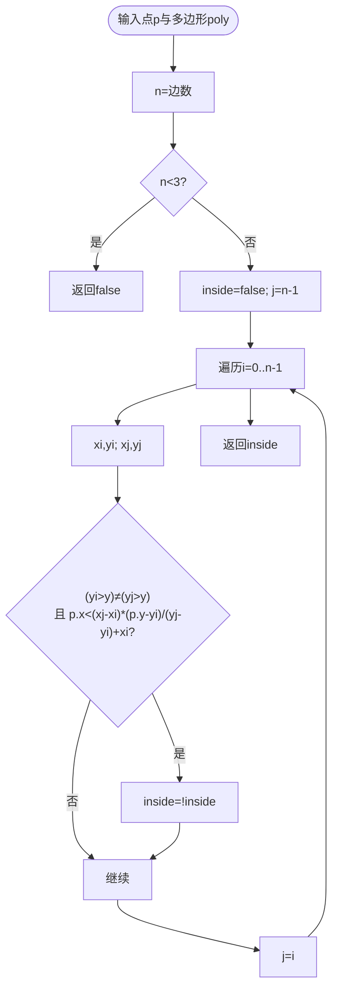
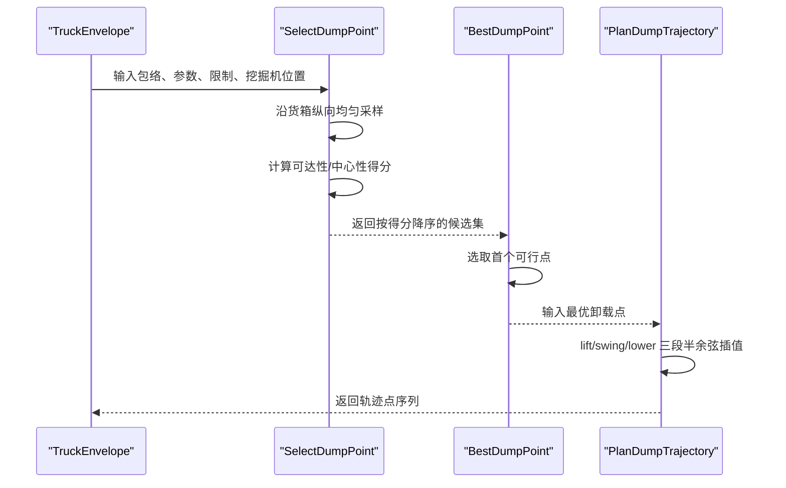
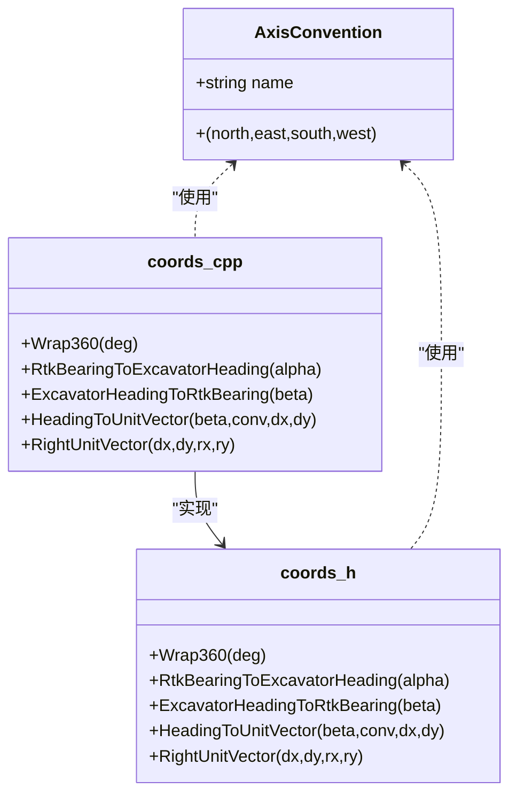

# 卡车包络建模算法

<cite>
**本文引用的文件列表**
- [truck_model.h](file://src/truck_dump_planner/include/truck_dump_planner/truck_model.h)
- [truck_model.cpp](file://src/truck_dump_planner/src/truck_model.cpp)
- [coords.h](file://src/truck_dump_planner/include/truck_dump_planner/coords.h)
- [coords.cpp](file://src/truck_dump_planner/src/coords.cpp)
- [dump_planner.h](file://src/truck_dump_planner/include/truck_dump_planner/dump_planner.h)
- [dump_planner.cpp](file://src/truck_dump_planner/src/dump_planner.cpp)
- [dump_planner_node.cpp](file://src/truck_dump_planner/src/dump_planner_node.cpp)
- [dump_planner.yaml](file://src/truck_dump_planner/config/dump_planner.yaml)
- [truck_model.py](file://src/truck_envelope/truck_model.py)
- [coords.py](file://src/truck_envelope/coords.py)
- [demo.py](file://src/demo.py)
</cite>

## 目录
1. [引言](#引言)
2. [项目结构](#项目结构)
3. [核心组件](#核心组件)
4. [架构概览](#架构概览)
5. [详细组件分析](#详细组件分析)
6. [依赖关系分析](#依赖关系分析)
7. [性能考量](#性能考量)
8. [故障排查指南](#故障排查指南)
9. [结论](#结论)
10. [附录](#附录)

## 引言
本技术文档围绕“卡车包络建模算法”展开，系统阐述卡车几何参数的物理意义与坐标系约定，详解包络多边形的构建流程与顶点计算公式，解释点在多边形内的判断方法与碰撞检测逻辑，并提供 TruckParams 结构体的参数配置指南。文档还包含具体几何计算示例、可视化效果说明，以及时间复杂度与实时优化策略，帮助读者在工程实践中高效落地。

## 项目结构
仓库包含 C++ 实现的 ROS 节点与 Python 实现的几何模型/演示脚本，二者共享相同的建模思想与数据结构，便于交叉验证与对比。

图表来源
- [dump_planner_node.cpp:1-341](file://src/truck_dump_planner/src/dump_planner_node.cpp#L1-L341)
- [dump_planner.h:1-66](file://src/truck_dump_planner/include/truck_dump_planner/dump_planner.h#L1-L66)
- [dump_planner.cpp:1-120](file://src/truck_dump_planner/src/dump_planner.cpp#L1-L120)
- [truck_model.h:1-60](file://src/truck_dump_planner/include/truck_dump_planner/truck_model.h#L1-L60)
- [truck_model.cpp:1-66](file://src/truck_dump_planner/src/truck_model.cpp#L1-L66)
- [coords.h:1-37](file://src/truck_dump_planner/include/truck_dump_planner/coords.h#L1-L37)
- [coords.cpp:1-52](file://src/truck_dump_planner/src/coords.cpp#L1-L52)
- [dump_planner.yaml:1-43](file://src/truck_dump_planner/config/dump_planner.yaml#L1-L43)
- [truck_model.py:1-200](file://src/truck_envelope/truck_model.py#L1-L200)
- [coords.py:1-200](file://src/truck_envelope/coords.py#L1-L200)
- [demo.py:1-249](file://src/demo.py#L1-L249)

章节来源
- [dump_planner_node.cpp:1-341](file://src/truck_dump_planner/src/dump_planner_node.cpp#L1-L341)
- [dump_planner.h:1-66](file://src/truck_dump_planner/include/truck_dump_planner/dump_planner.h#L1-L66)
- [dump_planner.cpp:1-120](file://src/truck_dump_planner/src/dump_planner.cpp#L1-L120)
- [truck_model.h:1-60](file://src/truck_dump_planner/include/truck_dump_planner/truck_model.h#L1-L60)
- [truck_model.cpp:1-66](file://src/truck_dump_planner/src/truck_model.cpp#L1-L66)
- [coords.h:1-37](file://src/truck_dump_planner/include/truck_dump_planner/coords.h#L1-L37)
- [coords.cpp:1-52](file://src/truck_dump_planner/src/coords.cpp#L1-L52)
- [dump_planner.yaml:1-43](file://src/truck_dump_planner/config/dump_planner.yaml#L1-L43)
- [truck_model.py:1-200](file://src/truck_envelope/truck_model.py#L1-L200)
- [coords.py:1-200](file://src/truck_envelope/coords.py#L1-L200)
- [demo.py:1-249](file://src/demo.py#L1-L249)

## 核心组件
- 几何参数与包络描述
  - TruckParams：定义卡车总长、总宽、参考点偏移、货箱长宽、货箱中心偏移、货箱高度等关键参数。
  - TruckEnvelope：描述包络在挖掘机坐标系下的状态，包括参考点、航向、方向向量、车体/货箱四角、货箱中心与顶面高度等。
- 坐标系与航向角转换
  - 提供 RTK 方位角 α 与挖掘机系航向角 β 的双向转换，以及基于 xy 轴地理朝向约定的方向向量分解。
- 包络构建与点在多边形内判断
  - 通过矩形四角计算公式与方向向量，生成车体与货箱包络；使用射线法判断点是否在多边形内。
- 卸载点选择与轨迹规划
  - 在货箱顶面生成候选卸载点，结合工作范围约束进行可行性筛选与评分；规划三段式轨迹（抬升-回转-下降）。

章节来源
- [truck_model.h:21-44](file://src/truck_dump_planner/include/truck_dump_planner/truck_model.h#L21-L44)
- [coords.h:10-32](file://src/truck_dump_planner/include/truck_dump_planner/coords.h#L10-L32)
- [dump_planner.h:10-41](file://src/truck_dump_planner/include/truck_dump_planner/dump_planner.h#L10-L41)
- [dump_planner.cpp:7-61](file://src/truck_dump_planner/src/dump_planner.cpp#L7-L61)

## 架构概览
整体处理链路：订阅卡车位姿消息 → 解析 RTK 航向 → 构建包络 → 卸载点选择与评分 → 轨迹规划 → RViz 可视化发布。

图表来源
- [dump_planner_node.cpp:99-136](file://src/truck_dump_planner/src/dump_planner_node.cpp#L99-L136)
- [coords.cpp:87-97](file://src/truck_dump_planner/src/coords.cpp#L87-L97)
- [truck_model.cpp:22-46](file://src/truck_dump_planner/src/truck_model.cpp#L22-L46)
- [dump_planner.cpp:7-75](file://src/truck_dump_planner/src/dump_planner.cpp#L7-L75)

## 详细组件分析

### 几何参数与物理意义（TruckParams）
- 关键参数
  - length：卡车总长（沿车头方向）
  - width：卡车总宽（沿车体右侧方向）
  - ref_offset：参考点相对几何中心的纵向偏移（正表示偏前）
  - box_length：货箱长
  - box_width：货箱宽
  - box_center_offset：货箱中心相对参考点的纵向偏移（通常为负，表示偏车尾）
  - box_height：货箱侧壁高度（用于卸载高度估算）
- 物理意义
  - 通过 ref_offset 可灵活设置参考点位置（如将参考点置于后轴以适配 RTK 天线位置）。
  - box_center_offset 控制货箱在纵向上的位置，影响卸载点的可达性与安全性。
  - box_height 与 dump_clearance 共同决定卸载高度上限与间隙要求。

章节来源
- [truck_model.h:21-30](file://src/truck_dump_planner/include/truck_dump_planner/truck_model.h#L21-L30)
- [dump_planner.yaml:5-12](file://src/truck_dump_planner/config/dump_planner.yaml#L5-L12)

### 包络多边形构建算法
- 输入
  - 卡车参考点位置 (x, y, z)、RTK 方位角 α、TruckParams、AxisConvention。
- 步骤
  1) RTK 航向 → 挖掘机系航向 β：β = (180 - α) mod 360。
  2) β → 车头方向单位向量 (dx, dy)、右侧单位向量 (rx, ry)。
  3) 以参考点为中心，按长度/宽度与纵向偏移计算车体/货箱四角：
     - 矩形中心：mx = x + dx × center_offset，my = y + dy × center_offset
     - 四角（逆时针）：前左、后左、后右、前右
  4) 货箱中心：(x + dx × box_center_offset, y + dy × box_center_offset)
  5) 货箱顶面高度：z + box_height
- 顶点坐标计算公式
  - 设长度一半为 hl，宽度一半为 hw，则：
    - 前左：(mx + dx × hl - rx × hw, my + dy × hl - ry × hw)
    - 后左：(mx - dx × hl - rx × hw, my - dy × hl - ry × hw)
    - 后右：(mx - dx × hl + rx × hw, my - dy × hl + ry × hw)
    - 前右：(mx + dx × hl + rx × hw, my + dy × hl + ry × hw)

图表来源
- [truck_model.cpp:22-46](file://src/truck_dump_planner/src/truck_model.cpp#L22-L46)
- [coords.cpp:18-49](file://src/truck_dump_planner/src/coords.cpp#L18-L49)

章节来源
- [truck_model.cpp:6-20](file://src/truck_dump_planner/src/truck_model.cpp#L6-L20)
- [truck_model.cpp:22-46](file://src/truck_dump_planner/src/truck_model.cpp#L22-L46)
- [coords.cpp:18-49](file://src/truck_dump_planner/src/coords.cpp#L18-L49)

### 点在多边形内的判断与碰撞检测
- 方法：射线法（奇偶法则）
  - 从测试点沿任意方向发出一条射线，统计与多边形边界相交的次数。
  - 若相交次数为奇数，则点在多边形内部；否则在外部。
- 实现要点
  - 避免除零与浮点误差：除法中加入极小值以稳定计算。
  - 遍历多边形的每条边，按 y 坐标比较与交点判定更新奇偶标志。
- 应用场景
  - 判断卸载点是否位于车体包络内部（用于合法性检查）。
  - 作为避障/碰撞检测的基础工具。

图表来源
- [truck_model.cpp:48-63](file://src/truck_dump_planner/src/truck_model.cpp#L48-L63)

章节来源
- [truck_model.cpp:48-63](file://src/truck_dump_planner/src/truck_model.cpp#L48-L63)

### 卸载点选择与轨迹规划
- 卸载点候选生成
  - 沿货箱纵向从后到前均匀采样，得到多个候选点 (x, y, z_dump)。
  - z_dump = 货箱顶面高度 + 铲斗底门间隙。
  - 根据最小/最大卸载半径与高度进行可行性筛选。
- 评分机制
  - 可达性得分：与最大/最小半径的距离归一化。
  - 中心性得分：越靠近货箱纵向中心得分越高。
  - 综合得分 = 0.7×可达性 + 0.3×中心性。
- 最优卸载点
  - 从候选集中按得分排序，返回第一个可行点。
- 轨迹规划
  - 三段式平滑轨迹：抬升（z 从起点升高至安全高度）、回转（xy 线性插值，z=安全高度）、下降（z 从安全高度降至卸载高度）。
  - 每段采用半余弦曲线，保证加速度连续，避免速度突变。

图表来源
- [dump_planner.cpp:7-61](file://src/truck_dump_planner/src/dump_planner.cpp#L7-L61)
- [dump_planner.cpp:63-75](file://src/truck_dump_planner/src/dump_planner.cpp#L63-L75)
- [dump_planner.cpp:82-117](file://src/truck_dump_planner/src/dump_planner.cpp#L82-L117)

章节来源
- [dump_planner.h:42-61](file://src/truck_dump_planner/include/truck_dump_planner/dump_planner.h#L42-L61)
- [dump_planner.cpp:7-61](file://src/truck_dump_planner/src/dump_planner.cpp#L7-L61)
- [dump_planner.cpp:63-75](file://src/truck_dump_planner/src/dump_planner.cpp#L63-L75)
- [dump_planner.cpp:82-117](file://src/truck_dump_planner/src/dump_planner.cpp#L82-L117)

### 坐标系约定与航向角转换
- 航向角定义
  - 挖掘机系航向 β：正北=180°、正东=90°、正南=0°、正西=270°，逆时针增大。
  - RTK 方位角 α：正北=0°、正东=90°、正南=180°、正西=270°，顺时针增大。
  - 转换关系：β = (180 - α) mod 360。
- xy 轴地理朝向约定
  - East-North（默认）：x 朝东，y 朝北。
  - North-West：x 朝北，y 朝西。
- 方向向量分解
  - 将 β 分解为 (dx, dy)，并定义右侧方向 (rx, ry) 为顺时针旋转 90°。

图表来源
- [coords.h:20-32](file://src/truck_dump_planner/include/truck_dump_planner/coords.h#L20-L32)
- [coords.cpp:18-49](file://src/truck_dump_planner/src/coords.cpp#L18-L49)
- [coords.py:79-113](file://src/truck_envelope/coords.py#L79-L113)
- [coords.py:154-199](file://src/truck_envelope/coords.py#L154-L199)

章节来源
- [coords.h:10-32](file://src/truck_dump_planner/include/truck_dump_planner/coords.h#L10-L32)
- [coords.cpp:6-16](file://src/truck_dump_planner/src/coords.cpp#L6-L16)
- [coords.cpp:18-49](file://src/truck_dump_planner/src/coords.cpp#L18-L49)
- [coords.py:39-60](file://src/truck_envelope/coords.py#L39-L60)
- [coords.py:154-199](file://src/truck_envelope/coords.py#L154-L199)

### 参数配置指南（TruckParams 与工作范围）
- 卡车几何参数（单位：米/度）
  - length、width、ref_offset、box_length、box_width、box_center_offset、box_height
- 挖掘机工作范围
  - x、y：挖掘机回转中心（挖掘机系）
  - reach_min、reach_max：最小/最大卸载半径
  - dump_height_min、dump_height_max：最小/最大卸载高度
  - dump_clearance：铲斗底门距货箱顶面间隙
- 轨迹与采样
  - safe_height：安全高度
  - n_steps：轨迹离散点数
  - n_samples：沿货箱纵向采样点数
- 坐标系约定
  - frame_id：发布 marker 的坐标系
  - axis_convention：east_north 或 north_west
  - bearing_convention：rep105_enu 或 yaw_is_bearing

章节来源
- [dump_planner.yaml:4-43](file://src/truck_dump_planner/config/dump_planner.yaml#L4-L43)
- [dump_planner_node.cpp:42-84](file://src/truck_dump_planner/src/dump_planner_node.cpp#L42-L84)

### 几何计算示例与可视化
- 示例场景
  - 卡车参考点：(4.0, 8.0, 0.0)，RTK 方位角 60°，采用 x 东 y 北约定。
  - 生成车体/货箱包络，打印四角坐标与货箱中心、顶面高度。
  - 选择卸载点并规划轨迹，输出轨迹点数量与阶段分布。
- 可视化
  - ASCII 俯视图：车体包络用“.”，货箱包络用“#”，标注中心点与卸载点。
  - Matplotlib 图像：保存为 PNG 文件，显示包络与轨迹。

章节来源
- [demo.py:93-149](file://src/demo.py#L93-L149)
- [demo.py:152-206](file://src/demo.py#L152-L206)
- [demo.py:208-236](file://src/demo.py#L208-L236)

## 依赖关系分析
- 模块耦合
  - dump_planner_node 依赖 coords、truck_model、dump_planner 完成端到端处理。
  - dump_planner 依赖 truck_model 的包络与点在多边形内判断。
  - truck_model 依赖 coords 的航向角转换与方向向量计算。
- 外部依赖
  - ROS：geometry_msgs、visualization_msgs、tf2。
  - Python：matplotlib（可选，用于图像输出）。

图表来源
- [dump_planner_node.cpp:19-21](file://src/truck_dump_planner/src/dump_planner_node.cpp#L19-L21)
- [dump_planner.cpp:1-4](file://src/truck_dump_planner/src/dump_planner.cpp#L1-L4)
- [truck_model.cpp:1-3](file://src/truck_dump_planner/src/truck_model.cpp#L1-L3)
- [coords.cpp:1-2](file://src/truck_dump_planner/src/coords.cpp#L1-L2)

章节来源
- [dump_planner_node.cpp:19-21](file://src/truck_dump_planner/src/dump_planner_node.cpp#L19-L21)
- [dump_planner.cpp:1-4](file://src/truck_dump_planner/src/dump_planner.cpp#L1-L4)
- [truck_model.cpp:1-3](file://src/truck_dump_planner/src/truck_model.cpp#L1-L3)
- [coords.cpp:1-2](file://src/truck_dump_planner/src/coords.cpp#L1-L2)

## 性能考量
- 时间复杂度
  - 包络构建：O(1)，仅涉及常数次向量运算与四角计算。
  - 点在多边形内判断：O(n)，n 为多边形边数（车体/货箱包络为固定 4 边，近似 O(1)）。
  - 卸载点选择：O(k)，k 为采样点数（n_samples）。
  - 轨迹规划：O(n_steps)，线性插值与半余弦曲线。
- 实时优化策略
  - 参数缓存：将常用参数（如三角函数值、归一化因子）缓存，减少重复计算。
  - 预分配内存：预先 reserve 候选集大小，避免动态扩容。
  - 采样策略：根据任务需求调整 n_samples 与 n_steps，在精度与性能间权衡。
  - 剪枝：在可行域外快速拒绝候选点，减少无效计算。
  - 并行化：在多核环境下对独立候选点的评估进行并行处理（需注意线程安全）。

## 故障排查指南
- 常见问题
  - 包络方向错误：检查 RTK 航向与 β 的转换是否一致，确认 axis_convention 设置。
  - 卸载点不可行：检查 reach 与 height 是否超出限制，适当调整参数。
  - 轨迹不平滑：检查半余弦插值段数分配，确保各段步数非负。
- 调试建议
  - 使用 demo.py 验证航向角转换与方向向量分解。
  - 在 RViz 中观察 MarkerArray，确认包络与轨迹可视化正确。
  - 打印中间结果（如车头方向、四角坐标、候选点与评分）辅助定位问题。

章节来源
- [demo.py:50-91](file://src/demo.py#L50-L91)
- [dump_planner_node.cpp:138-313](file://src/truck_dump_planner/src/dump_planner_node.cpp#L138-L313)

## 结论
本算法以简洁的几何模型与稳定的坐标系约定为基础，实现了从 RTK 航向到挖掘机坐标系的包络构建，结合射线法与评分机制完成卸载点选择，并通过三段式轨迹规划保障作业安全与效率。通过合理的参数配置与性能优化策略，可在实时场景中可靠运行。

## 附录
- 参数对照表（单位：米/度）
  - length：卡车总长
  - width：卡车总宽
  - ref_offset：参考点相对几何中心的纵向偏移
  - box_length：货箱长
  - box_width：货箱宽
  - box_center_offset：货箱中心相对参考点的纵向偏移
  - box_height：货箱侧壁高度
  - reach_min/reach_max：最小/最大卸载半径
  - dump_height_min/dump_height_max：最小/最大卸载高度
  - dump_clearance：铲斗底门距货箱顶面间隙
  - safe_height：安全高度
  - n_steps：轨迹离散点数
  - n_samples：沿货箱纵向采样点数

章节来源
- [dump_planner.yaml:4-43](file://src/truck_dump_planner/config/dump_planner.yaml#L4-L43)
- [dump_planner.h:10-17](file://src/truck_dump_planner/include/truck_dump_planner/dump_planner.h#L10-L17)