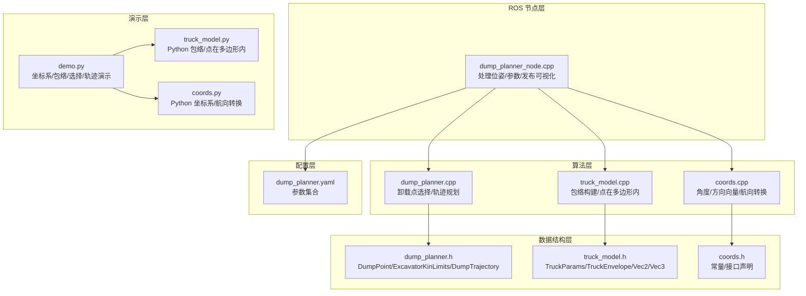
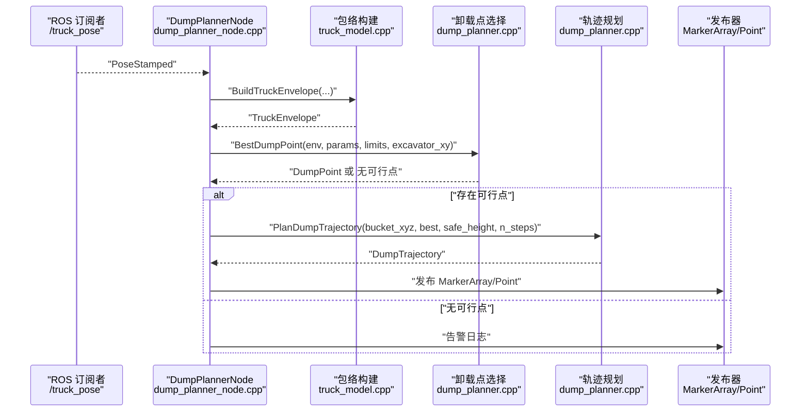
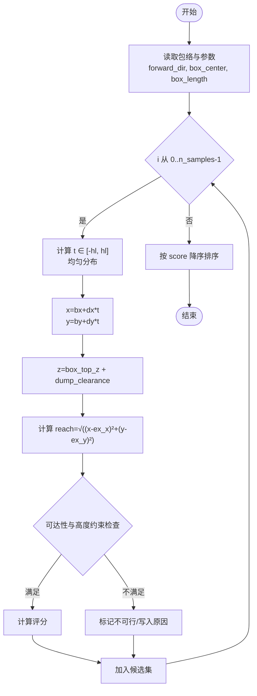
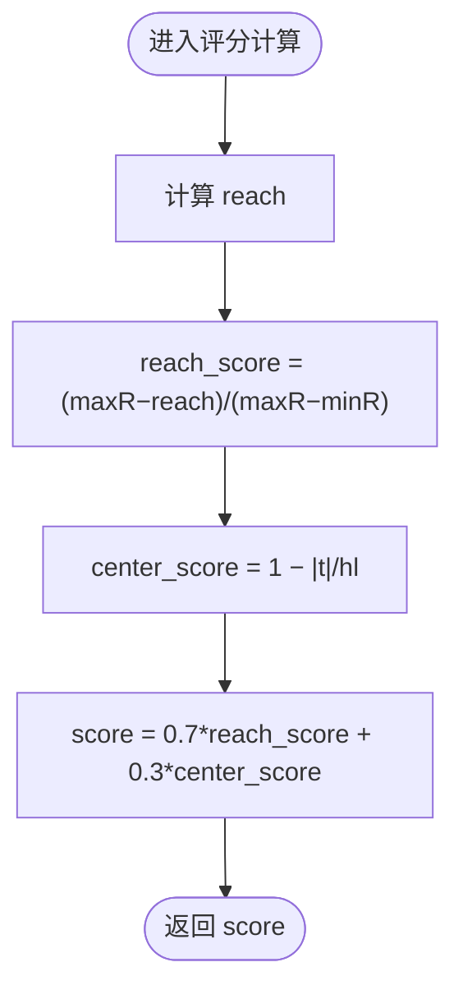
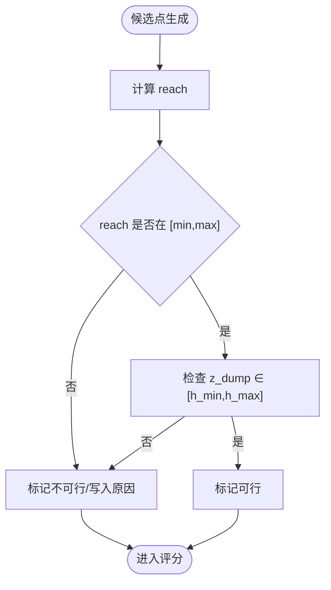
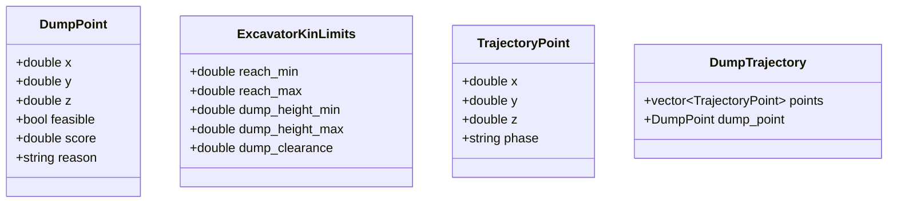
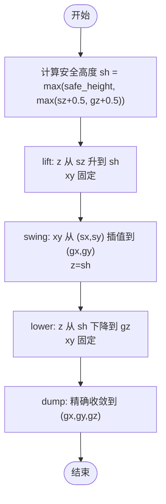
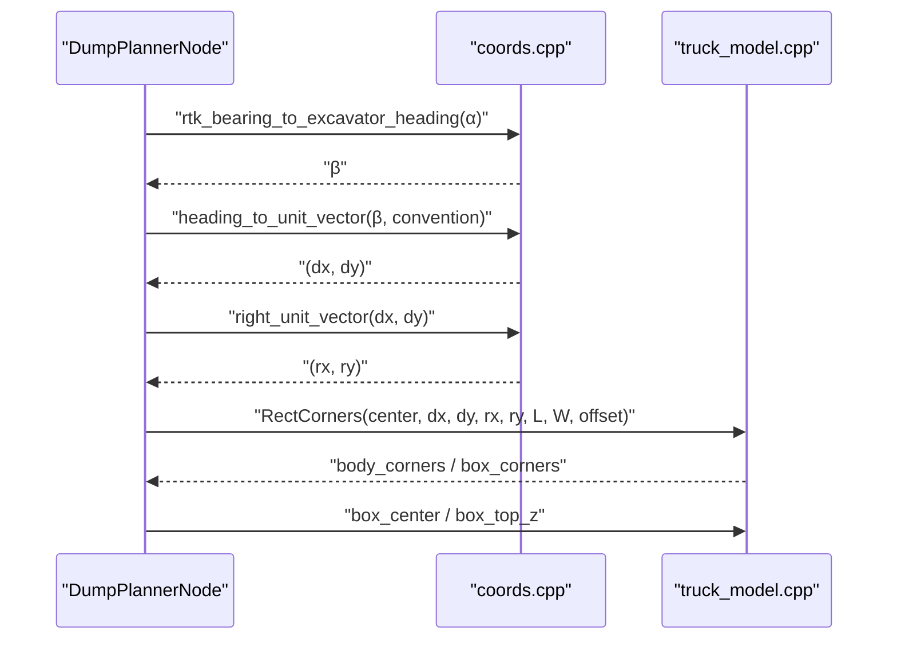
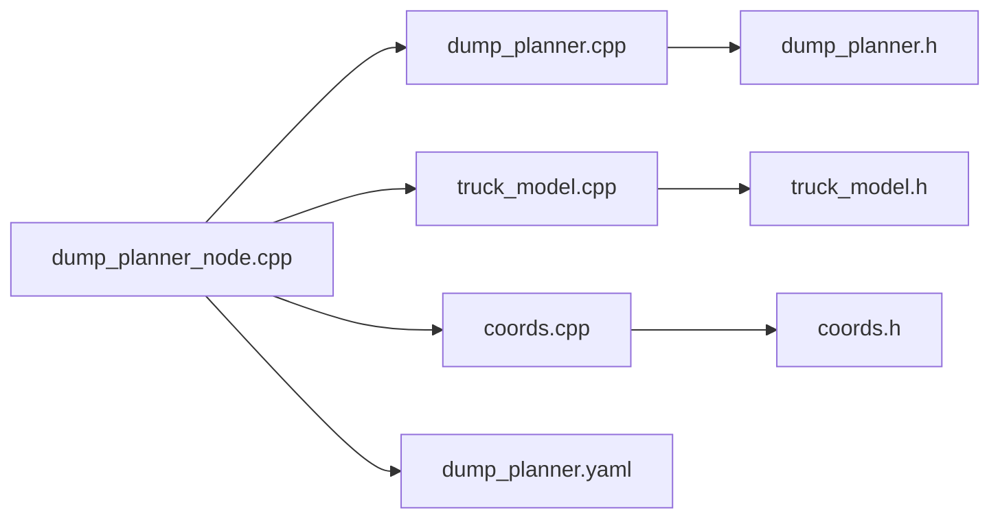

# 卸载点选择算法

<cite>
**本文引用的文件**
- [dump_planner.h](file://src/truck_dump_planner/include/truck_dump_planner/dump_planner.h)
- [dump_planner.cpp](file://src/truck_dump_planner/src/dump_planner.cpp)
- [truck_model.h](file://src/truck_dump_planner/include/truck_dump_planner/truck_model.h)
- [truck_model.cpp](file://src/truck_dump_planner/src/truck_model.cpp)
- [coords.h](file://src/truck_dump_planner/include/truck_dump_planner/coords.h)
- [coords.cpp](file://src/truck_dump_planner/src/coords.cpp)
- [dump_planner.yaml](file://src/truck_dump_planner/config/dump_planner.yaml)
- [dump_planner_node.cpp](file://src/truck_dump_planner/src/dump_planner_node.cpp)
- [demo.py](file://src/demo.py)
- [truck_model.py](file://src/truck_envelope/truck_model.py)
- [coords.py](file://src/truck_envelope/coords.py)
</cite>

## 目录
1. [引言](#引言)
2. [项目结构](#项目结构)
3. [核心组件](#核心组件)
4. [架构总览](#架构总览)
5. [详细组件分析](#详细组件分析)
6. [依赖分析](#依赖分析)
7. [性能考量](#性能考量)
8. [故障排查指南](#故障排查指南)
9. [结论](#结论)
10. [附录](#附录)

## 引言
本技术文档围绕“卸载点选择算法”展开，系统阐述候选点采样策略、综合评分机制、可行性检查逻辑、DumpPoint 结构体定义与评分函数的数学表达式，并结合具体示例与流程图说明决策过程。同时讨论算法的鲁棒性与容错机制，以及在不同工况下的适应性调整策略。

## 项目结构
该仓库包含 C++ 实现的 ROS 节点与 Python 辅助演示，核心模块如下：
- 几何与包络：定义卡车参数、包络结构与坐标系转换
- 卸载点选择：在货箱顶面生成候选点、可行性检查与评分排序
- 轨迹规划：基于选定卸载点生成三段式平滑轨迹
- 参数配置：集中于 YAML 文件，便于运行时调整
- ROS 节点：订阅卡车位姿，发布可视化标记与选定卸载点

图表来源
- [dump_planner_node.cpp:1-341](file://src/truck_dump_planner/src/dump_planner_node.cpp#L1-L341)
- [dump_planner.cpp:1-120](file://src/truck_dump_planner/src/dump_planner.cpp#L1-L120)
- [truck_model.cpp:1-66](file://src/truck_dump_planner/src/truck_model.cpp#L1-L66)
- [coords.cpp:1-52](file://src/truck_dump_planner/src/coords.cpp#L1-L52)
- [dump_planner.h:1-66](file://src/truck_dump_planner/include/truck_dump_planner/dump_planner.h#L1-L66)
- [truck_model.h:1-60](file://src/truck_dump_planner/include/truck_dump_planner/truck_model.h#L1-L60)
- [coords.h:1-37](file://src/truck_dump_planner/include/truck_dump_planner/coords.h#L1-L37)
- [dump_planner.yaml:1-43](file://src/truck_dump_planner/config/dump_planner.yaml#L1-L43)
- [demo.py:1-249](file://src/demo.py#L1-L249)
- [truck_model.py:1-200](file://src/truck_envelope/truck_model.py#L1-L200)
- [coords.py:1-200](file://src/truck_envelope/coords.py#L1-L200)

章节来源
- [dump_planner_node.cpp:1-341](file://src/truck_dump_planner/src/dump_planner_node.cpp#L1-L341)
- [dump_planner.h:1-66](file://src/truck_dump_planner/include/truck_dump_planner/dump_planner.h#L1-L66)
- [dump_planner.cpp:1-120](file://src/truck_dump_planner/src/dump_planner.cpp#L1-L120)
- [truck_model.h:1-60](file://src/truck_dump_planner/include/truck_dump_planner/truck_model.h#L1-L60)
- [truck_model.cpp:1-66](file://src/truck_dump_planner/src/truck_model.cpp#L1-L66)
- [coords.h:1-37](file://src/truck_dump_planner/include/truck_dump_planner/coords.h#L1-L37)
- [coords.cpp:1-52](file://src/truck_dump_planner/src/coords.cpp#L1-L52)
- [dump_planner.yaml:1-43](file://src/truck_dump_planner/config/dump_planner.yaml#L1-L43)
- [demo.py:1-249](file://src/demo.py#L1-L249)
- [truck_model.py:1-200](file://src/truck_envelope/truck_model.py#L1-L200)
- [coords.py:1-200](file://src/truck_envelope/coords.py#L1-L200)

## 核心组件
- DumpPoint：候选/选定卸载点，包含三维坐标、可行性标志、综合评分与原因字符串
- ExcavatorKinLimits：挖掘机工作范围约束（最小/最大卸载半径、最大/最小卸载高度、铲斗底门与货箱顶面间隙）
- TruckEnvelope：卡车在挖掘机坐标系下的包络（车体/货箱四角、货箱中心、顶面高度、车头/右侧方向向量）
- SelectDumpPoint：沿货箱纵向均匀采样，进行可达性与高度约束检查，计算综合评分并降序排序
- BestDumpPoint：返回首个可行卸载点
- PlanDumpTrajectory：三段式轨迹规划（抬升/回转/下降），每段采用半余弦平滑

章节来源
- [dump_planner.h:10-61](file://src/truck_dump_planner/include/truck_dump_planner/dump_planner.h#L10-L61)
- [dump_planner.cpp:7-120](file://src/truck_dump_planner/src/dump_planner.cpp#L7-L120)
- [truck_model.h:21-52](file://src/truck_dump_planner/include/truck_dump_planner/truck_model.h#L21-L52)
- [truck_model.cpp:22-46](file://src/truck_dump_planner/src/truck_model.cpp#L22-L46)

## 架构总览
卸载点选择算法在 ROS 节点中被调用，输入为卡车位姿（位置+RTK 航向），输出为选定卸载点与轨迹。关键流程：
- 解析参数与位姿，构建 TruckEnvelope
- 生成候选点并进行可行性检查
- 计算综合评分并排序
- 选取最高分可行点
- 生成轨迹并发布可视化

图表来源
- [dump_planner_node.cpp:99-136](file://src/truck_dump_planner/src/dump_planner_node.cpp#L99-L136)
- [dump_planner.cpp:63-117](file://src/truck_dump_planner/src/dump_planner.cpp#L63-L117)
- [truck_model.cpp:22-46](file://src/truck_dump_planner/src/truck_model.cpp#L22-L46)

## 详细组件分析

### 候选点采样策略
- 沿货箱纵向从后端到前端均匀采样，采样数量由参数 n_samples 控制
- 采样区间为 [-box_length/2, box_length/2]，步进由 n_samples 决定
- 每个候选点的 x/y 由货箱中心坐标与车头方向向量叠加得到，z 固定为货箱顶面高度加上卸载间隙
- 采样间隔与搜索范围：
  - 搜索范围：沿货箱纵向，覆盖整个货箱长度
  - 采样间隔：当 n_samples > 1 时，均匀分布在 [-hl, +hl]；否则固定在中心点
- 密度控制：通过 n_samples 调整候选点数量，平衡计算开销与覆盖精度

图表来源
- [dump_planner.cpp:11-61](file://src/truck_dump_planner/src/dump_planner.cpp#L11-L61)
- [dump_planner.h:19-27](file://src/truck_dump_planner/include/truck_dump_planner/dump_planner.h#L19-L27)

章节来源
- [dump_planner.cpp:11-61](file://src/truck_dump_planner/src/dump_planner.cpp#L11-L61)
- [dump_planner.yaml:35-38](file://src/truck_dump_planner/config/dump_planner.yaml#L35-L38)

### 综合评分机制
- 可行性检查通过后，计算两个子评分：
  - 距离权重项（reach_score）：衡量卸载点到挖掘机回转中心的距离接近程度
  - 位置权重项（center_score）：衡量卸载点在货箱纵向中心附近的程度
- 综合评分（score）为加权和，当前权重为 0.7（距离）与 0.3（位置）

数学表达式
- 距离评分（归一化）
  - reach_score = (reach_max − reach) / max(reach_max − reach_min, ε)
- 位置评分（沿纵向中心的偏离程度）
  - center_score = 1 − |t| / max(hl, ε)
- 综合评分
  - score = 0.7 × reach_score + 0.3 × center_score
- 其中 ε 为极小正数，防止除零

图表来源
- [dump_planner.cpp:47-53](file://src/truck_dump_planner/src/dump_planner.cpp#L47-L53)

章节来源
- [dump_planner.cpp:47-53](file://src/truck_dump_planner/src/dump_planner.cpp#L47-L53)

### 可行性检查逻辑
- 卸载半径约束：若 reach < reach_min 或 reach > reach_max，则不可行
- 卸载高度约束：z_dump（货箱顶面 + 卸载间隙）超出 [dump_height_min, dump_height_max] 则不可行
- 不可行原因记录在 reason 字段，便于调试与可视化标注

图表来源
- [dump_planner.cpp:32-45](file://src/truck_dump_planner/src/dump_planner.cpp#L32-L45)

章节来源
- [dump_planner.cpp:32-45](file://src/truck_dump_planner/src/dump_planner.cpp#L32-L45)

### DumpPoint 结构体与相关类型
- DumpPoint：包含 x/y/z（三维坐标）、feasible（可行性）、score（评分）、reason（不可行原因）
- ExcavatorKinLimits：包含 reach_min/max、dump_height_min/max、dump_clearance
- TrajectoryPoint/DumpTrajectory：轨迹点序列与选定卸载点封装

图表来源
- [dump_planner.h:19-40](file://src/truck_dump_planner/include/truck_dump_planner/dump_planner.h#L19-L40)

章节来源
- [dump_planner.h:19-40](file://src/truck_dump_planner/include/truck_dump_planner/dump_planner.h#L19-L40)

### 轨迹规划（三段式平滑）
- 抬升（lift）：z 从起点 z 升至安全高度 safe_height，保持 xy 不变
- 回转（swing）：在安全高度上，xy 从起点线性插值到卸载点，z 固定为 safe_height
- 下放（lower）：z 从 safe_height 下降至卸载高度 gz，xy 固定为卸载点
- 每段采用半余弦平滑函数，避免速度/加速度突变，保证运动连续性
- 安全高度 sh 至少高于起点与卸载点的 z+0.5，并不低于参数 safe_height

图表来源
- [dump_planner.cpp:82-117](file://src/truck_dump_planner/src/dump_planner.cpp#L82-L117)

章节来源
- [dump_planner.cpp:77-117](file://src/truck_dump_planner/src/dump_planner.cpp#L77-L117)

### 参数与配置
- 卡车几何参数：长度、宽度、货箱长宽、货箱中心相对偏移、货箱侧壁高度
- 挖掘机工作范围：回转中心坐标、最小/最大卸载半径、最大/最小卸载高度、卸载间隙
- 铲斗当前位置：用于轨迹起点
- 轨迹规划：安全高度、离散点数
- 卸载点采样：沿货箱纵向采样数量
- 坐标系约定：frame_id、axis_convention、bearing_convention

章节来源
- [dump_planner.yaml:4-43](file://src/truck_dump_planner/config/dump_planner.yaml#L4-L43)
- [dump_planner_node.cpp:42-84](file://src/truck_dump_planner/src/dump_planner_node.cpp#L42-L84)

### 坐标系与包络构建
- 航向角转换：RTK 方位角 α 与挖掘机系航向角 β 的互转关系
- 方向向量：根据 β 与 xy 轴地理朝向约定（x 东 y 北 或 x 北 y 西）分解车头/右侧方向向量
- 包络：以车体参考点为中心，按长宽与中心偏移计算车体/货箱四角；货箱中心与顶面高度据此推导

图表来源
- [dump_planner_node.cpp:86-106](file://src/truck_dump_planner/src/dump_planner_node.cpp#L86-L106)
- [coords.cpp:18-49](file://src/truck_dump_planner/src/coords.cpp#L18-L49)
- [truck_model.cpp:9-45](file://src/truck_dump_planner/src/truck_model.cpp#L9-L45)

章节来源
- [coords.h:6-32](file://src/truck_dump_planner/include/truck_dump_planner/coords.h#L6-L32)
- [coords.cpp:6-52](file://src/truck_dump_planner/src/coords.cpp#L6-L52)
- [truck_model.h:10-52](file://src/truck_dump_planner/include/truck_dump_planner/truck_model.h#L10-L52)
- [truck_model.cpp:6-45](file://src/truck_dump_planner/src/truck_model.cpp#L6-L45)

### 评分计算示例
- 假设：reach_min=5.0、reach_max=12.0、box_length=5.0、n_samples=9、excavator_xy=(0,0)
- 采样点 t 在 [-1.25, 1.25] 均匀分布；z_dump=box_top_z + 0.8
- 对于某个候选点：
  - reach=6.0 → reach_score=(12−6)/(12−5)=6/7≈0.857
  - t=0.0 → center_score=1.0
  - score=0.7×0.857 + 0.3×1.0≈0.5999 + 0.3=0.8999
- 若该点还满足高度约束，则成为可行候选；否则标记不可行

章节来源
- [dump_planner.cpp:47-53](file://src/truck_dump_planner/src/dump_planner.cpp#L47-L53)

## 依赖分析
- 组件耦合
  - dump_planner_node 依赖 dump_planner 与 truck_model/coords 接口
  - dump_planner 依赖 truck_model.h 与 coords.h 的数据结构与函数
  - truck_model.cpp 依赖 coords.cpp 提供的方向向量与航向转换
- 外部依赖
  - ROS（消息类型、TF2、发布/订阅）
  - 可视化消息 MarkerArray/Marker/Point
- 参数来源
  - dump_planner.yaml 作为节点私有命名空间参数源

图表来源
- [dump_planner_node.cpp:19-23](file://src/truck_dump_planner/src/dump_planner_node.cpp#L19-L23)
- [dump_planner.cpp:1-5](file://src/truck_dump_planner/src/dump_planner.cpp#L1-L5)
- [truck_model.cpp:1-3](file://src/truck_dump_planner/src/truck_model.cpp#L1-L3)
- [coords.cpp:1-3](file://src/truck_dump_planner/src/coords.cpp#L1-L3)
- [dump_planner.h:4-6](file://src/truck_dump_planner/include/truck_dump_planner/dump_planner.h#L4-L6)
- [truck_model.h:4-6](file://src/truck_dump_planner/include/truck_dump_planner/truck_model.h#L4-L6)
- [coords.h:4-6](file://src/truck_dump_planner/include/truck_dump_planner/coords.h#L4-L6)
- [dump_planner.yaml:1-4](file://src/truck_dump_planner/config/dump_planner.yaml#L1-L4)

章节来源
- [dump_planner_node.cpp:19-23](file://src/truck_dump_planner/src/dump_planner_node.cpp#L19-L23)
- [dump_planner.cpp:1-5](file://src/truck_dump_planner/src/dump_planner.cpp#L1-L5)
- [truck_model.cpp:1-3](file://src/truck_dump_planner/src/truck_model.cpp#L1-L3)
- [coords.cpp:1-3](file://src/truck_dump_planner/src/coords.cpp#L1-L3)

## 性能考量
- 采样复杂度：O(n_samples)，可通过减少 n_samples 或采用自适应采样策略优化
- 排序复杂度：O(n_samples log n_samples)，在 n_samples 较小时可忽略
- 可行性检查与评分：O(n_samples)，线性扫描
- 轨迹规划：O(n_steps)，可按需求调整步数
- 建议
  - 在动态场景中，优先保证 n_samples ≥ 5 以覆盖关键区域
  - 使用较大的 n_samples 时，可考虑并行化评分计算（注意线程安全）

## 故障排查指南
- 无可行卸载点
  - 检查 RTK 航向与位姿是否正确转换
  - 核对工作范围参数（reach_min/max、dump_height_min/max、dump_clearance）
  - 确认安全高度 safe_height 设置合理
- 卸载点评分异常
  - 检查 n_samples 是否过小导致覆盖不足
  - 核对 box_length 与 box_center_offset 是否匹配实际车辆
- 轨迹抖动或不连续
  - 检查半余弦平滑段数分配（lift/swing/lower 比例）
  - 确认安全高度 sh 的计算是否覆盖起点与终点

章节来源
- [dump_planner_node.cpp:119-135](file://src/truck_dump_planner/src/dump_planner_node.cpp#L119-L135)
- [dump_planner.cpp:88-89](file://src/truck_dump_planner/src/dump_planner.cpp#L88-L89)

## 结论
该卸载点选择算法以“货箱顶面均匀采样 + 可行性约束 + 加权评分”的方式，在保证工程实用性的前提下实现了快速、稳定的卸载点决策。通过参数化配置与清晰的数据结构，算法具备良好的可扩展性与可维护性。建议在实际部署中结合现场工况动态调整参数，并在复杂地形条件下引入更高密度采样与更严格的地形适应性检查。

## 附录
- 示例运行与可视化
  - Python 演示脚本展示坐标系转换、包络构建、卸载点选择与轨迹规划的完整流程
  - 可选 matplotlib 输出示意图，便于验证包络与轨迹

章节来源
- [demo.py:93-149](file://src/demo.py#L93-L149)
- [truck_model.py:112-177](file://src/truck_envelope/truck_model.py#L112-L177)
- [coords.py:39-191](file://src/truck_envelope/coords.py#L39-L191)