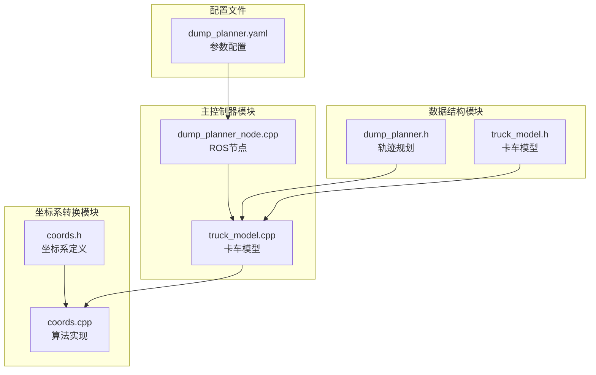
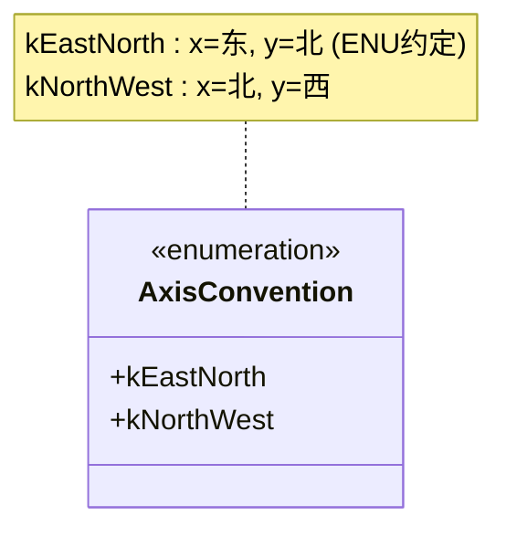
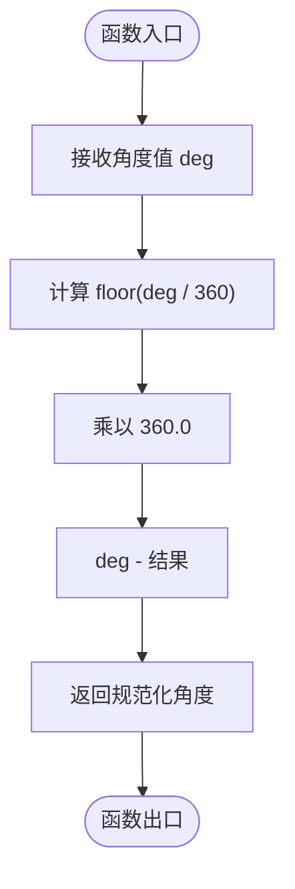
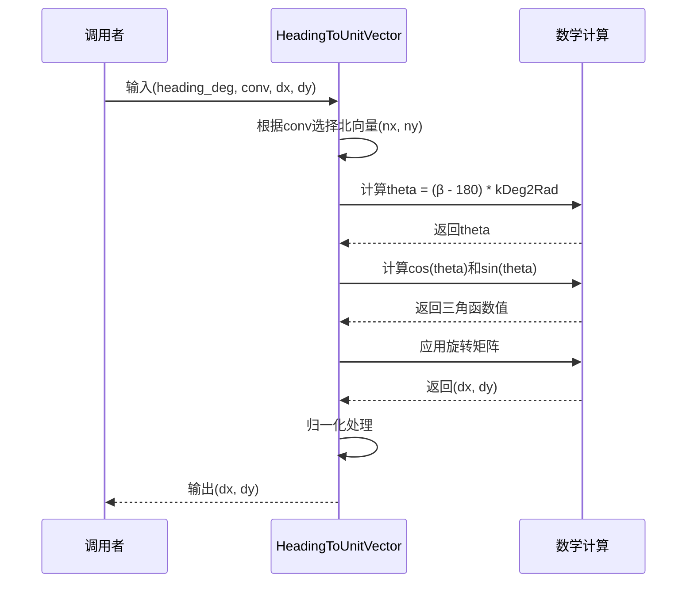
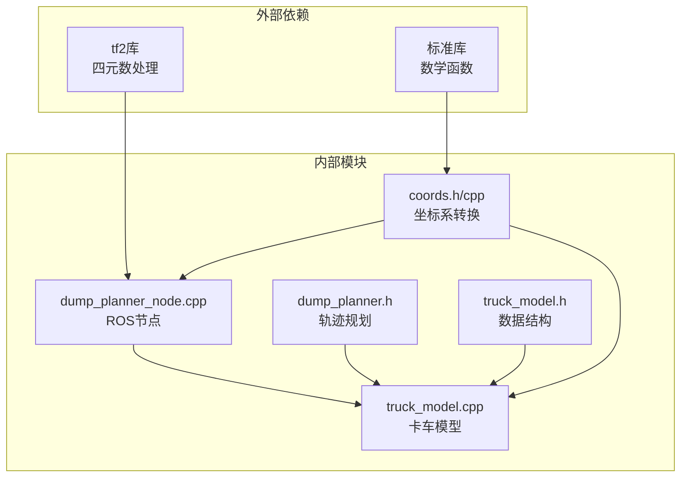
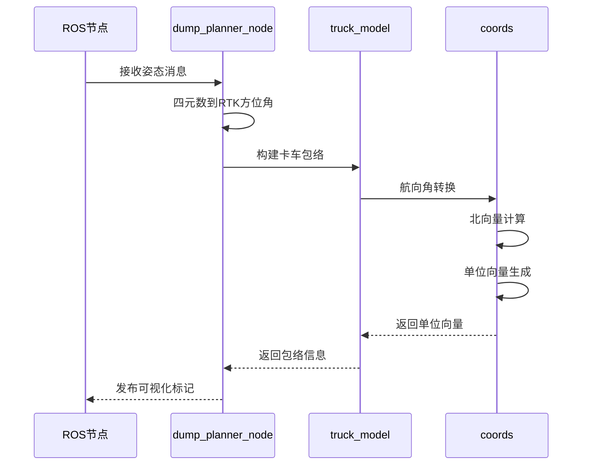

# 坐标系转换算法

<cite>
**本文档引用的文件**
- [coords.h](file://src/truck_dump_planner/include/truck_dump_planner/coords.h)
- [coords.cpp](file://src/truck_dump_planner/src/coords.cpp)
- [dump_planner_node.cpp](file://src/truck_dump_planner/src/dump_planner_node.cpp)
- [truck_model.cpp](file://src/truck_dump_planner/src/truck_model.cpp)
- [dump_planner.h](file://src/truck_dump_planner/include/truck_dump_planner/dump_planner.h)
- [truck_model.h](file://src/truck_dump_planner/include/truck_dump_planner/truck_model.h)
- [dump_planner.yaml](file://src/truck_dump_planner/config/dump_planner.yaml)
</cite>

## 目录
1. [引言](#引言)
2. [项目结构](#项目结构)
3. [核心组件](#核心组件)
4. [架构概览](#架构概览)
5. [详细组件分析](#详细组件分析)
6. [依赖关系分析](#依赖关系分析)
7. [性能考虑](#性能考虑)
8. [故障排除指南](#故障排除指南)
9. [结论](#结论)
10. [附录](#附录)

## 引言

本技术文档深入解析了RTK方位角与挖掘机系航向角之间的坐标系转换算法。该系统实现了两种不同的坐标系约定：北西约定(kNorthWest)和东北约定(kEastNorth)，并通过数学变换将RTK方位角转换为挖掘机系航向角，进而计算车头方向单位向量和右侧方向单位向量。

该算法在无人挖掘机装车轨迹规划中发挥关键作用，确保铲斗能够准确找到最优卸载点并规划安全的卸载轨迹。

## 项目结构

该项目采用模块化设计，主要包含以下核心模块：



**图表来源**
- [coords.h:1-37](file://src/truck_dump_planner/include/truck_dump_planner/coords.h#L1-L37)
- [coords.cpp:1-52](file://src/truck_dump_planner/src/coords.cpp#L1-L52)
- [dump_planner_node.cpp:70-136](file://src/truck_dump_planner/src/dump_planner_node.cpp#L70-L136)

**章节来源**
- [coords.h:1-37](file://src/truck_dump_planner/include/truck_dump_planner/coords.h#L1-L37)
- [coords.cpp:1-52](file://src/truck_dump_planner/src/coords.cpp#L1-L52)
- [dump_planner_node.cpp:70-136](file://src/truck_dump_planner/src/dump_planner_node.cpp#L70-L136)

## 核心组件

### 角度常量定义

系统定义了两个重要的角度转换常量：
- `kDeg2Rad`: 度到弧度的转换因子
- `kRad2Deg`: 弧度到度的转换因子

这些常量用于三角函数计算中的角度转换，确保数值精度和计算效率。

### 坐标系约定枚举

系统支持两种坐标系约定：



**图表来源**
- [coords.h:20-24](file://src/truck_dump_planner/include/truck_dump_planner/coords.h#L20-L24)

### 航向角转换函数

系统提供了双向的航向角转换函数：

```mermaid
flowchart TD
A[RTK方位角 α] --> B["β = (180 - α) mod 360"]
C[挖掘机系航向 β] --> D["α = (180 - β) mod 360"]
B --> E[Wrap360函数]
D --> E
E --> F[规范化角度到[0,360)范围]
```

**图表来源**
- [coords.cpp:10-16](file://src/truck_dump_planner/src/coords.cpp#L10-L16)

**章节来源**
- [coords.h:6-18](file://src/truck_dump_planner/include/truck_dump_planner/coords.h#L6-L18)
- [coords.cpp:10-16](file://src/truck_dump_planner/src/coords.cpp#L10-L16)

## 架构概览

整个坐标系转换系统遵循分层架构设计，各模块职责明确：

```mermaid
graph TB
subgraph "输入层"
ORI[原始姿态数据<br/>四元数/欧拉角]
RTK[RTK方位角数据]
end
subgraph "转换层"
Q2A[四元数到RTK方位角<br/>QuaternionToRtkBearing]
ANG[角度规范化<br/>Wrap360]
CONV[坐标系约定<br/>AxisConvention]
end
subgraph "输出层"
HBETA[挖掘机系航向角 β]
UNIT[单位向量(dx,dy)]
RIGHT[右侧单位向量(rx,ry)]
end
ORI --> Q2A
RTK --> ANG
Q2A --> ANG
ANG --> CONV
CONV --> HBETA
HBETA --> UNIT
UNIT --> RIGHT
```

**图表来源**
- [dump_planner_node.cpp:87-97](file://src/truck_dump_planner/src/dump_planner_node.cpp#L87-L97)
- [coords.cpp:6-8](file://src/truck_dump_planner/src/coords.cpp#L6-L8)
- [coords.cpp:18-49](file://src/truck_dump_planner/src/coords.cpp#L18-L49)

**章节来源**
- [dump_planner_node.cpp:87-136](file://src/truck_dump_planner/src/dump_planner_node.cpp#L87-L136)
- [coords.cpp:6-49](file://src/truck_dump_planner/src/coords.cpp#L6-L49)

## 详细组件分析

### Wrap360角度归一化函数

Wrap360函数负责将任意角度值规范化到[0, 360)范围内：



**图表来源**
- [coords.cpp:6-8](file://src/truck_dump_planner/src/coords.cpp#L6-L8)

该函数使用数学函数`std::floor`确保角度值始终位于有效范围内，避免角度溢出问题。

**章节来源**
- [coords.cpp:6-8](file://src/truck_dump_planner/src/coords.cpp#L6-L8)

### HeadingToUnitVector函数详解

该函数将挖掘机系航向角转换为xy平面内的单位向量：

#### 数学原理

1. **北向量确定**：
   - kEastNorth约定：正北方向为(0, 1)
   - kNorthWest约定：正北方向为(1, 0)

2. **角度转换**：
   - β=180对应正北方向
   - θ_geo = (β - 180) × (π/180)为相对正北的逆时针角度

3. **旋转矩阵应用**：
   ```
   [dx]   [cos(θ_geo)  -sin(θ_geo)] [nx]
   [dy] = [sin(θ_geo)   cos(θ_geo)] [ny]
   ```

#### 实现流程



**图表来源**
- [coords.cpp:18-43](file://src/truck_dump_planner/src/coords.cpp#L18-L43)

**章节来源**
- [coords.cpp:18-43](file://src/truck_dump_planner/src/coords.cpp#L18-L43)

### RightUnitVector函数实现

该函数实现90度顺时针旋转算法：

```mermaid
flowchart TD
START([输入车头方向(dx, dy)]) --> ROTATE["应用90度顺时针旋转矩阵"]
ROTATE --> CALC1["rx = dy"]
CALC1 --> CALC2["ry = -dx"]
CALC2 --> END([输出右侧方向(rx, ry)])
```

**图表来源**
- [coords.cpp:45-49](file://src/truck_dump_planner/src/coords.cpp#L45-L49)

该算法基于二维旋转矩阵：
```
[x']   [0  1] [x]
[y'] = [-1 0] [y]
```

**章节来源**
- [coords.cpp:45-49](file://src/truck_dump_planner/src/coords.cpp#L45-L49)

### 坐标系约定对转换结果的影响

不同坐标系约定会产生不同的转换结果：

| 约定类型 | x轴方向 | y轴方向 | 北向量(nx, ny) | 转换关系 |
|---------|---------|---------|---------------|----------|
| kEastNorth | 东 | 北 | (0, 1) | β = (180 - α) mod 360 |
| kNorthWest | 北 | 西 | (1, 0) | β = (180 - α) mod 360 |

**章节来源**
- [coords.cpp:22-30](file://src/truck_dump_planner/src/coords.cpp#L22-L30)

## 依赖关系分析

### 模块间依赖关系



**图表来源**
- [dump_planner_node.cpp:87-97](file://src/truck_dump_planner/src/dump_planner_node.cpp#L87-L97)
- [coords.cpp:1](file://src/truck_dump_planner/src/coords.cpp#L1)

### 关键调用链



**图表来源**
- [dump_planner_node.cpp:99-136](file://src/truck_dump_planner/src/dump_planner_node.cpp#L99-L136)
- [truck_model.cpp:22-46](file://src/truck_dump_planner/src/truck_model.cpp#L22-L46)

**章节来源**
- [dump_planner_node.cpp:99-136](file://src/truck_dump_planner/src/dump_planner_node.cpp#L99-L136)
- [truck_model.cpp:22-46](file://src/truck_dump_planner/src/truck_model.cpp#L22-L46)

## 性能考虑

### 计算复杂度分析

1. **Wrap360函数**：O(1)时间复杂度，O(1)空间复杂度
2. **HeadingToUnitVector函数**：O(1)时间复杂度，涉及一次三角函数计算
3. **RightUnitVector函数**：O(1)时间复杂度，O(1)空间复杂度

### 优化策略

1. **三角函数缓存**：对于连续的角度计算，可考虑缓存常用的三角函数值
2. **条件分支优化**：AxisConvention枚举的switch语句已编译器优化
3. **内存访问模式**：向量操作遵循局部性原则，减少内存访问开销

## 故障排除指南

### 常见问题及解决方案

#### 1. 角度范围异常
**症状**：输出角度超出[0, 360)范围
**原因**：未正确使用Wrap360函数
**解决**：确保所有角度转换后都经过Wrap360规范化

#### 2. 坐标系约定错误
**症状**：车头方向与预期相反
**原因**：AxisConvention配置错误或使用不当
**解决**：检查配置文件中的axis_convention参数

#### 3. 单位向量不规范
**症状**：向量长度不等于1
**原因**：归一化处理失败
**解决**：检查向量归一化条件和阈值设置

**章节来源**
- [coords.cpp:38-42](file://src/truck_dump_planner/src/coords.cpp#L38-L42)
- [dump_planner.yaml:39-42](file://src/truck_dump_planner/config/dump_planner.yaml#L39-L42)

## 结论

该坐标系转换算法通过清晰的数学原理和模块化设计，成功实现了RTK方位角与挖掘机系航向角之间的精确转换。系统支持两种坐标系约定，具有良好的扩展性和实用性。

算法的关键优势包括：
- 数学严谨性：基于标准旋转矩阵理论
- 实用性强：直接服务于轨迹规划任务
- 易于维护：模块化设计便于测试和调试
- 性能高效：常数时间复杂度，适合实时应用

## 附录

### 使用示例

#### 示例1：基本角度转换
```cpp
// RTK方位角到挖掘机系航向角
double alpha = 90.0;  // RTK方位角(度)
double beta = RtkBearingToExcavatorHeading(alpha);
// 结果: beta = 90.0
```

#### 示例2：单位向量计算
```cpp
// 设置坐标系约定
AxisConvention conv = AxisConvention::kEastNorth;
double dx, dy;

// 计算β=0°时的单位向量
HeadingToUnitVector(0.0, conv, dx, dy);
// 结果: dx=0, dy=-1 (指向南方)
```

#### 示例3：右侧方向计算
```cpp
// 已知车头方向(dx, dy)
double rx, ry;
RightUnitVector(dx, dy, rx, ry);
// 结果: rx=dy, ry=-dx
```

### 参数配置说明

#### 坐标系约定配置
- `axis_convention`: east_north 或 north_west
- 默认值: east_north
- 影响: 决定x轴和y轴的地理朝向

#### RTK方位角约定配置
- `bearing_convention`: rep105_enu 或 yaw_is_bearing
- 默认值: rep105_enu
- 影响: 决定四元数到RTK方位角的转换方式

**章节来源**
- [dump_planner.yaml:39-42](file://src/truck_dump_planner/config/dump_planner.yaml#L39-L42)
- [dump_planner_node.cpp:74-83](file://src/truck_dump_planner/src/dump_planner_node.cpp#L74-L83)