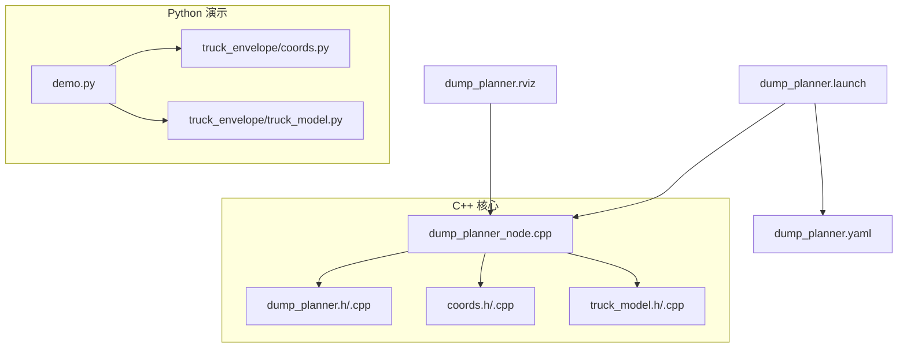
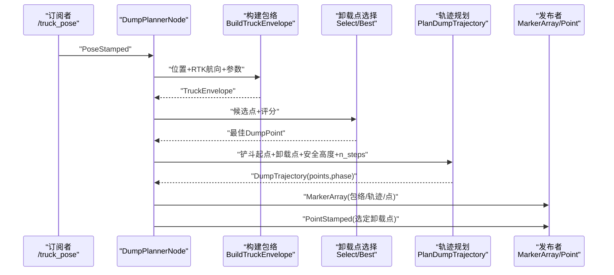
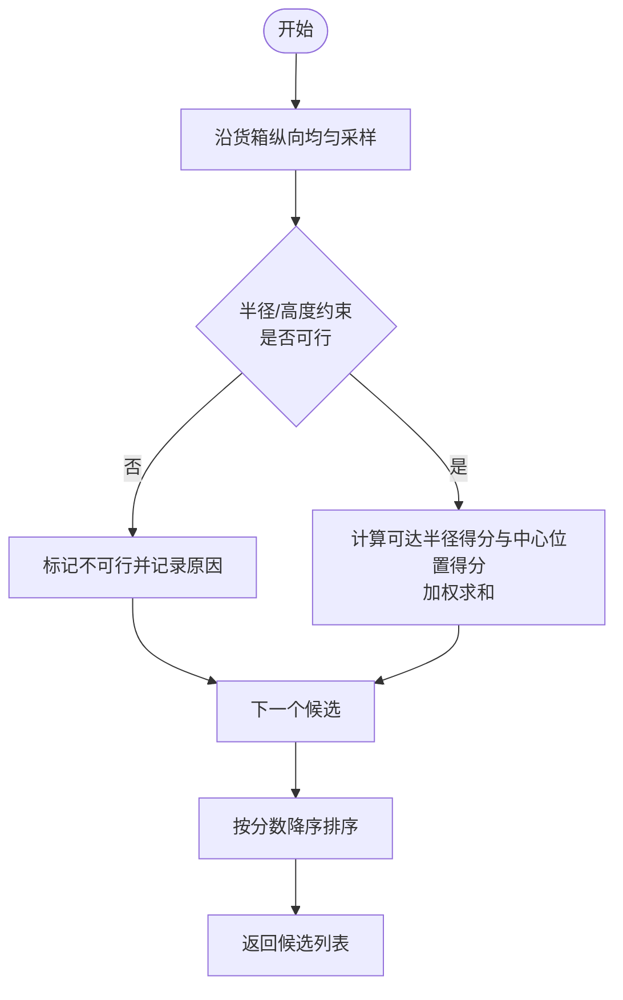
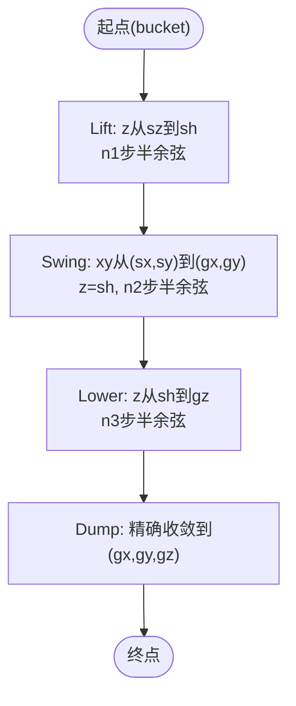
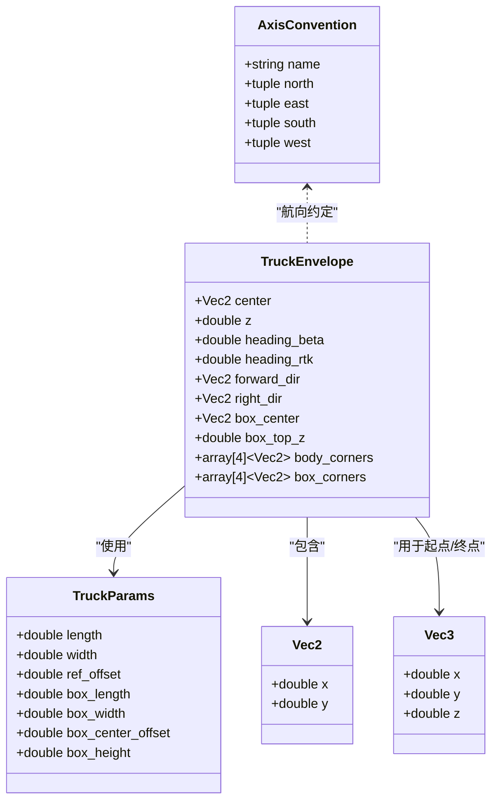
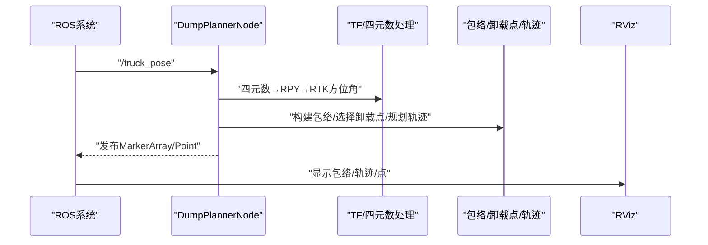
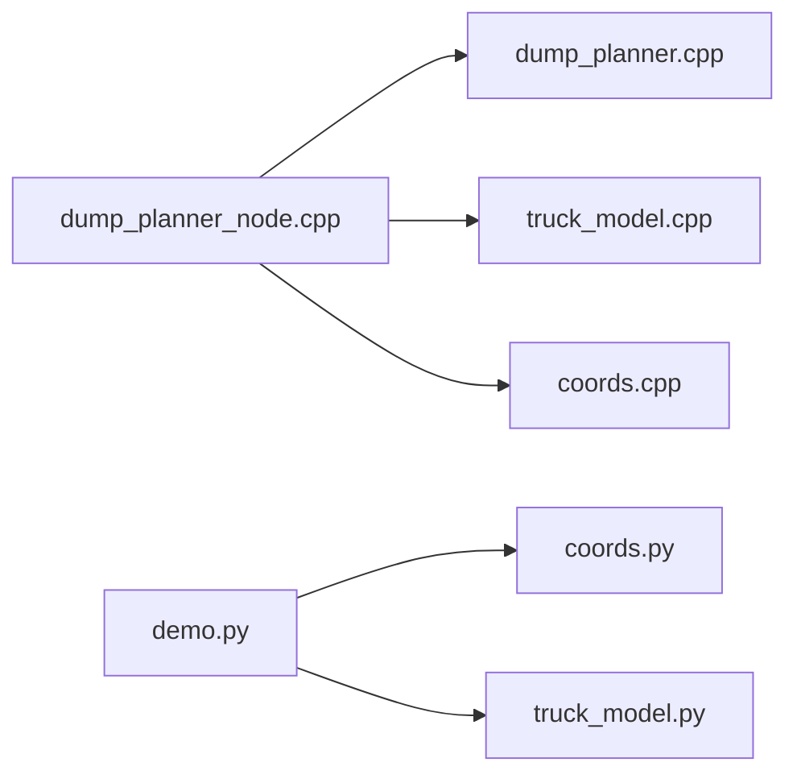

# 轨迹规划算法

<cite>
**本文引用的文件**
- [dump_planner.h](file://src/truck_dump_planner/include/truck_dump_planner/dump_planner.h)
- [dump_planner.cpp](file://src/truck_dump_planner/src/dump_planner.cpp)
- [coords.h](file://src/truck_dump_planner/include/truck_dump_planner/coords.h)
- [coords.cpp](file://src/truck_dump_planner/src/coords.cpp)
- [truck_model.h](file://src/truck_dump_planner/include/truck_dump_planner/truck_model.h)
- [truck_model.cpp](file://src/truck_dump_planner/src/truck_model.cpp)
- [dump_planner_node.cpp](file://src/truck_dump_planner/src/dump_planner_node.cpp)
- [dump_planner.yaml](file://src/truck_dump_planner/config/dump_planner.yaml)
- [dump_planner.launch](file://src/truck_dump_planner/launch/dump_planner.launch)
- [dump_planner.rviz](file://src/truck_dump_planner/rviz/dump_planner.rviz)
- [demo.py](file://src/demo.py)
- [coords.py](file://src/truck_envelope/coords.py)
- [truck_model.py](file://src/truck_envelope/truck_model.py)
</cite>

## 目录
1. [引言](#引言)
2. [项目结构](#项目结构)
3. [核心组件](#核心组件)
4. [架构总览](#架构总览)
5. [详细组件分析](#详细组件分析)
6. [依赖分析](#依赖分析)
7. [性能考量](#性能考量)
8. [故障排查指南](#故障排查指南)
9. [结论](#结论)
10. [附录](#附录)

## 引言
本文件面向无人挖掘机装车场景，系统化阐述三段式轨迹规划的理论与实现，覆盖以下要点：
- 三段式运动学：抬升(Lift)、回转(Swing)、下降(Lower)、倾dump。
- 半余弦平滑：数学推导、参数调节与离散点生成。
- 卸载点选择：候选点生成、可行性判定与评分排序。
- 数据结构：TrajectoryPoint、DumpTrajectory、TruckEnvelope 等的物理意义与用途。
- 安全约束与避障：工作范围、高度与半径限制、包络与射线法检测。
- 可视化与验证：ROS节点、RViz显示、ASCII/图像示例。
- 性能与优化：时间步长、评分权重、采样密度等调参建议。

## 项目结构
仓库采用功能模块化组织，核心分为：
- C++ 核心算法与ROS节点：dump_planner、coords、truck_model 及其节点封装。
- Python 辅助演示与验证：truck_envelope 包与 demo.py。
- 配置与启动：YAML参数、launch与RViz配置。

图表来源
- [dump_planner_node.cpp:1-341](file://src/truck_dump_planner/src/dump_planner_node.cpp#L1-L341)
- [dump_planner.h:1-66](file://src/truck_dump_planner/include/truck_dump_planner/dump_planner.h#L1-L66)
- [dump_planner.cpp:1-120](file://src/truck_dump_planner/src/dump_planner.cpp#L1-L120)
- [coords.h:1-37](file://src/truck_dump_planner/include/truck_dump_planner/coords.h#L1-L37)
- [coords.cpp:1-52](file://src/truck_dump_planner/src/coords.cpp#L1-L52)
- [truck_model.h:1-60](file://src/truck_dump_planner/include/truck_dump_planner/truck_model.h#L1-L60)
- [truck_model.cpp:1-66](file://src/truck_dump_planner/src/truck_model.cpp#L1-L66)
- [dump_planner.yaml:1-43](file://src/truck_dump_planner/config/dump_planner.yaml#L1-L43)
- [dump_planner.launch:1-26](file://src/truck_dump_planner/launch/dump_planner.launch#L1-L26)
- [dump_planner.rviz:1-131](file://src/truck_dump_planner/rviz/dump_planner.rviz#L1-L131)
- [demo.py:1-249](file://src/demo.py#L1-L249)
- [coords.py:1-200](file://src/truck_envelope/coords.py#L1-L200)
- [truck_model.py:1-200](file://src/truck_envelope/truck_model.py#L1-L200)

章节来源
- [dump_planner.h:1-66](file://src/truck_dump_planner/include/truck_dump_planner/dump_planner.h#L1-L66)
- [dump_planner.cpp:1-120](file://src/truck_dump_planner/src/dump_planner.cpp#L1-L120)
- [coords.h:1-37](file://src/truck_dump_planner/include/truck_dump_planner/coords.h#L1-L37)
- [coords.cpp:1-52](file://src/truck_dump_planner/src/coords.cpp#L1-L52)
- [truck_model.h:1-60](file://src/truck_dump_planner/include/truck_dump_planner/truck_model.h#L1-L60)
- [truck_model.cpp:1-66](file://src/truck_dump_planner/src/truck_model.cpp#L1-L66)
- [dump_planner_node.cpp:1-341](file://src/truck_dump_planner/src/dump_planner_node.cpp#L1-L341)
- [dump_planner.yaml:1-43](file://src/truck_dump_planner/config/dump_planner.yaml#L1-L43)
- [dump_planner.launch:1-26](file://src/truck_dump_planner/launch/dump_planner.launch#L1-L26)
- [dump_planner.rviz:1-131](file://src/truck_dump_planner/rviz/dump_planner.rviz#L1-L131)
- [demo.py:1-249](file://src/demo.py#L1-L249)
- [coords.py:1-200](file://src/truck_envelope/coords.py#L1-L200)
- [truck_model.py:1-200](file://src/truck_envelope/truck_model.py#L1-L200)

## 核心组件
- 卸载点候选与评分：沿货箱纵向均匀采样，按可达半径与纵向位置打分，筛选可行点。
- 三段式轨迹规划：抬升至安全高度、XY平面插值到卸载点、从安全高度下降至卸载高度，每段用半余弦平滑。
- 卡车包络与坐标系：基于RTK方位角与航向约定，构建车体与货箱包络，辅助卸载点合法性与避障。
- ROS可视化：发布MarkerArray显示包络、卸载点与轨迹，同时输出选定卸载点消息。

章节来源
- [dump_planner.h:11-61](file://src/truck_dump_planner/include/truck_dump_planner/dump_planner.h#L11-L61)
- [dump_planner.cpp:7-117](file://src/truck_dump_planner/src/dump_planner.cpp#L7-L117)
- [truck_model.h:21-52](file://src/truck_dump_planner/include/truck_dump_planner/truck_model.h#L21-L52)
- [dump_planner_node.cpp:25-136](file://src/truck_dump_planner/src/dump_planner_node.cpp#L25-L136)

## 架构总览
从外部位姿输入到轨迹输出的端到端流程如下：

图表来源
- [dump_planner_node.cpp:99-136](file://src/truck_dump_planner/src/dump_planner_node.cpp#L99-L136)
- [dump_planner.cpp:82-117](file://src/truck_dump_planner/src/dump_planner.cpp#L82-L117)
- [truck_model.cpp:22-46](file://src/truck_dump_planner/src/truck_model.cpp#L22-L46)

## 详细组件分析

### 1) 卸载点选择与评分
- 采样策略：沿货箱纵向从后到前均匀采样，得到候选卸载点集合。
- 可行性约束：半径在[min,max]之间，卸载高度在[min,max]范围内。
- 评分函数：综合可达半径与纵向位置（越靠近中心得分越高），按加权求和。
- 排序与选取：按分数降序返回，首个可行点即为最佳。

图表来源
- [dump_planner.cpp:11-61](file://src/truck_dump_planner/src/dump_planner.cpp#L11-L61)

章节来源
- [dump_planner.h:20-27](file://src/truck_dump_planner/include/truck_dump_planner/dump_planner.h#L20-L27)
- [dump_planner.cpp:7-61](file://src/truck_dump_planner/src/dump_planner.cpp#L7-L61)

### 2) 三段式轨迹规划与半余弦平滑
- 三段运动：
  - Lift：Z轴从起点提升至安全高度，使用半余弦曲线保证初速度连续。
  - Swing：X/Y在安全高度下进行线性插值，形成平滑路径。
  - Lower：Z轴从安全高度下降至卸载高度，同样使用半余弦曲线。
  - Dump：最后一段精确收敛到卸载点XYZ。
- 时间分配：按比例分配n_steps为三段，确保各段平滑过渡。
- 半余弦函数：s(t) = 0.5·(1 - cos(πt))，在[0,1]区间将线性插值映射为平滑曲线，避免加速度突变。

图表来源
- [dump_planner.cpp:82-117](file://src/truck_dump_planner/src/dump_planner.cpp#L82-L117)
- [dump_planner.h:54-61](file://src/truck_dump_planner/include/truck_dump_planner/dump_planner.h#L54-L61)

章节来源
- [dump_planner.h:29-40](file://src/truck_dump_planner/include/truck_dump_planner/dump_planner.h#L29-L40)
- [dump_planner.cpp:77-117](file://src/truck_dump_planner/src/dump_planner.cpp#L77-L117)

### 3) 卡车包络与坐标系转换
- 包络构建：根据RTK方位角与航向约定，计算车头与右侧方向向量，进而求出车体与货箱四角。
- 坐标系约定：支持x东y北(ENU)与x北y西两种约定，航向角β与地理方位角α的转换关系明确。
- 射线法：用于判断点是否在多边形内部，支撑卸载点合法性与避障检查。

图表来源
- [truck_model.h:21-52](file://src/truck_dump_planner/include/truck_dump_planner/truck_model.h#L21-L52)
- [coords.h:20-32](file://src/truck_dump_planner/include/truck_dump_planner/coords.h#L20-L32)
- [coords.cpp:18-49](file://src/truck_dump_planner/src/coords.cpp#L18-L49)
- [truck_model.cpp:9-46](file://src/truck_dump_planner/src/truck_model.cpp#L9-L46)

章节来源
- [truck_model.h:32-52](file://src/truck_dump_planner/include/truck_dump_planner/truck_model.h#L32-L52)
- [coords.h:10-32](file://src/truck_dump_planner/include/truck_dump_planner/coords.h#L10-L32)
- [coords.cpp:6-49](file://src/truck_dump_planner/src/coords.cpp#L6-L49)
- [truck_model.cpp:22-46](file://src/truck_dump_planner/src/truck_model.cpp#L22-L46)

### 4) ROS节点与可视化
- 输入：/truck_pose（位置+四元数编码RTK航向）。
- 处理：四元数→RTK方位角→β→包络→卸载点→轨迹。
- 发布：/truck_envelope_markers（包络、轨迹、点）、/dump_point（选定卸载点）。
- RViz：加载预设配置，显示MarkerArray与坐标轴。

图表来源
- [dump_planner_node.cpp:99-136](file://src/truck_dump_planner/src/dump_planner_node.cpp#L99-L136)
- [dump_planner_node.cpp:211-313](file://src/truck_dump_planner/src/dump_planner_node.cpp#L211-L313)
- [dump_planner.rviz:82-89](file://src/truck_dump_planner/rviz/dump_planner.rviz#L82-L89)

章节来源
- [dump_planner_node.cpp:25-136](file://src/truck_dump_planner/src/dump_planner_node.cpp#L25-L136)
- [dump_planner_node.cpp:138-313](file://src/truck_dump_planner/src/dump_planner_node.cpp#L138-L313)
- [dump_planner.rviz:1-131](file://src/truck_dump_planner/rviz/dump_planner.rviz#L1-L131)

### 5) 数据结构详解
- ExcavatorKinLimits：挖掘机工作范围与卸载间隙约束。
- DumpPoint：候选/选定卸载点，包含XYZ、可行性、评分与原因。
- TrajectoryPoint：轨迹离散点，包含XYZ与阶段标签。
- DumpTrajectory：轨迹容器，包含轨迹点序列与选定卸载点。
- TruckParams/TruckEnvelope：卡车几何与包络信息，用于合法性与避障。

章节来源
- [dump_planner.h:10-40](file://src/truck_dump_planner/include/truck_dump_planner/dump_planner.h#L10-L40)
- [truck_model.h:21-52](file://src/truck_dump_planner/include/truck_dump_planner/truck_model.h#L21-L52)

### 6) 示例与可视化
- 启动方式：通过launch文件加载参数、发布测试位姿、启动RViz。
- Python演示：验证航向角转换、包络构建、卸载点选择与轨迹规划，并输出ASCII与可选PNG图示。
- RViz配置：固定帧为excavator，显示MarkerArray与坐标轴。

章节来源
- [dump_planner.launch:1-26](file://src/truck_dump_planner/launch/dump_planner.launch#L1-L26)
- [dump_planner.rviz:1-131](file://src/truck_dump_planner/rviz/dump_planner.rviz#L1-L131)
- [demo.py:93-149](file://src/demo.py#L93-L149)

## 依赖分析
- dump_planner_node 依赖 dump_planner 与 truck_model 的接口，负责参数加载、回调处理与可视化发布。
- dump_planner 内部依赖 coords 与 truck_model 的数据结构与工具函数。
- Python演示模块 truck_envelope 提供与C++一致的接口，便于验证与教学。

图表来源
- [dump_planner_node.cpp:19-21](file://src/truck_dump_planner/src/dump_planner_node.cpp#L19-L21)
- [dump_planner.cpp:1-5](file://src/truck_dump_planner/src/dump_planner.cpp#L1-L5)
- [truck_model.cpp:1-3](file://src/truck_dump_planner/src/truck_model.cpp#L1-L3)
- [coords.cpp:1-3](file://src/truck_dump_planner/src/coords.cpp#L1-L3)
- [demo.py:24-41](file://src/demo.py#L24-L41)
- [coords.py:1-21](file://src/truck_envelope/coords.py#L1-L21)
- [truck_model.py:1-19](file://src/truck_envelope/truck_model.py#L1-L19)

章节来源
- [dump_planner_node.cpp:19-21](file://src/truck_dump_planner/src/dump_planner_node.cpp#L19-L21)
- [dump_planner.cpp:1-5](file://src/truck_dump_planner/src/dump_planner.cpp#L1-L5)
- [truck_model.cpp:1-3](file://src/truck_dump_planner/src/truck_model.cpp#L1-L3)
- [coords.cpp:1-3](file://src/truck_dump_planner/src/coords.cpp#L1-L3)
- [demo.py:24-41](file://src/demo.py#L24-L41)
- [coords.py:1-21](file://src/truck_envelope/coords.py#L1-L21)
- [truck_model.py:1-19](file://src/truck_envelope/truck_model.py#L1-L19)

## 性能考量
- 时间步长 n_steps：增加步数可提高轨迹平滑度，但会增加计算与发布开销；建议在实时性与平滑度间折中。
- 采样数量 n_samples：沿货箱纵向采样越多，候选点越密集，评分更精细，但计算成本上升；可根据作业效率需求调整。
- 评分权重：当前为可达半径与中心位置的加权组合，可依据现场工况微调权重比例。
- 任务调度：在高频率位姿更新场景下，建议将轨迹规划与可视化发布分离到独立线程或周期性任务，避免阻塞回调。
- 数值稳定性：半余弦函数与三角函数在边界处需注意数值误差累积，必要时加入阈值保护与归一化。

## 故障排查指南
- 无可行卸载点
  - 现象：日志提示无可行点，RViz不显示轨迹。
  - 排查：检查RTK方位角约定、坐标系约定、工作范围参数与卡车位姿是否合理。
  - 参考
    - [dump_planner_node.cpp:127-135](file://src/truck_dump_planner/src/dump_planner_node.cpp#L127-L135)
    - [dump_planner.cpp:33-45](file://src/truck_dump_planner/src/dump_planner.cpp#L33-L45)
- 轨迹不收敛或抖动
  - 现象：末端点偏离卸载点或出现速度/加速度突变。
  - 排查：确认n_steps分配比例与半余弦边界条件；检查安全高度是否高于起点与目标高度。
  - 参考
    - [dump_planner.cpp:88-116](file://src/truck_dump_planner/src/dump_planner.cpp#L88-L116)
- 包络方向错误
  - 现象：RViz显示包络朝向与实际不符。
  - 排查：核对航向角转换与坐标系约定；确认RTK→β转换与β→(dx,dy)分解逻辑。
  - 参考
    - [coords.cpp:10-16](file://src/truck_dump_planner/src/coords.cpp#L10-L16)
    - [coords.cpp:18-49](file://src/truck_dump_planner/src/coords.cpp#L18-L49)
    - [truck_model.cpp:22-46](file://src/truck_dump_planner/src/truck_model.cpp#L22-L46)

章节来源
- [dump_planner_node.cpp:127-135](file://src/truck_dump_planner/src/dump_planner_node.cpp#L127-L135)
- [dump_planner.cpp:33-45](file://src/truck_dump_planner/src/dump_planner.cpp#L33-L45)
- [dump_planner.cpp:88-116](file://src/truck_dump_planner/src/dump_planner.cpp#L88-L116)
- [coords.cpp:10-16](file://src/truck_dump_planner/src/coords.cpp#L10-L16)
- [coords.cpp:18-49](file://src/truck_dump_planner/src/coords.cpp#L18-L49)
- [truck_model.cpp:22-46](file://src/truck_dump_planner/src/truck_model.cpp#L22-L46)

## 结论
本系统以三段式轨迹为核心，结合半余弦平滑与卸载点评分策略，在保证运动连续性的前提下实现了高效、稳定的装车轨迹生成。通过参数化配置与可视化验证，可在不同工况下快速适配并部署。建议在工程实践中持续优化时间步长与评分权重，并完善动态避障与安全冗余策略。

## 附录

### A. 参数一览与建议
- 卡车几何（米）：长度、宽度、货箱长宽、中心偏移、侧壁高度。
- 挖掘机工作范围：回转中心坐标、最小/最大卸载半径、最小/最大卸载高度、卸载间隙。
- 铲斗起点（米）：初始位置。
- 轨迹规划：安全高度、离散点数。
- 卸载点采样：纵向采样数量。
- 坐标系约定：frame_id、axis_convention、bearing_convention。

章节来源
- [dump_planner.yaml:4-43](file://src/truck_dump_planner/config/dump_planner.yaml#L4-L43)

### B. 关键流程图（算法实现映射）
- 卸载点选择与评分
  - [dump_planner.cpp:11-61](file://src/truck_dump_planner/src/dump_planner.cpp#L11-L61)
- 三段式轨迹规划
  - [dump_planner.cpp:82-117](file://src/truck_dump_planner/src/dump_planner.cpp#L82-L117)
- 包络构建与坐标系转换
  - [coords.cpp:18-49](file://src/truck_dump_planner/src/coords.cpp#L18-L49)
  - [truck_model.cpp:22-46](file://src/truck_dump_planner/src/truck_model.cpp#L22-L46)
- ROS节点处理与发布
  - [dump_planner_node.cpp:99-136](file://src/truck_dump_planner/src/dump_planner_node.cpp#L99-L136)
  - [dump_planner_node.cpp:211-313](file://src/truck_dump_planner/src/dump_planner_node.cpp#L211-L313)