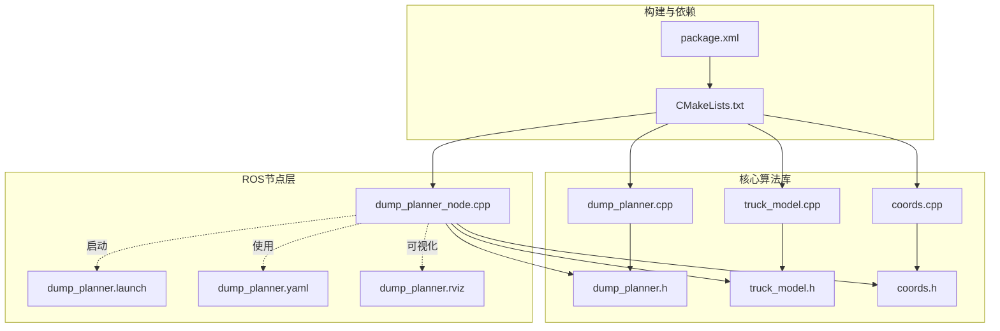
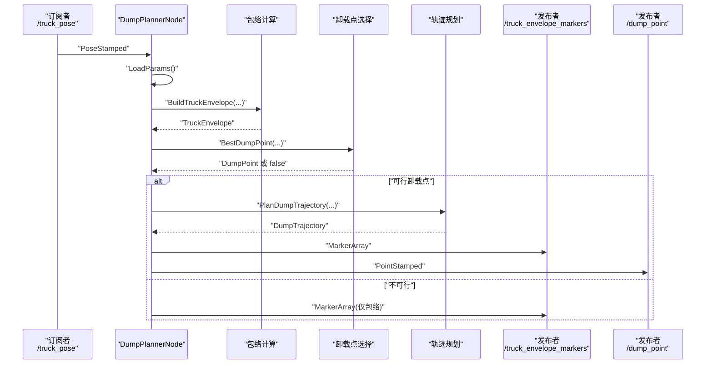
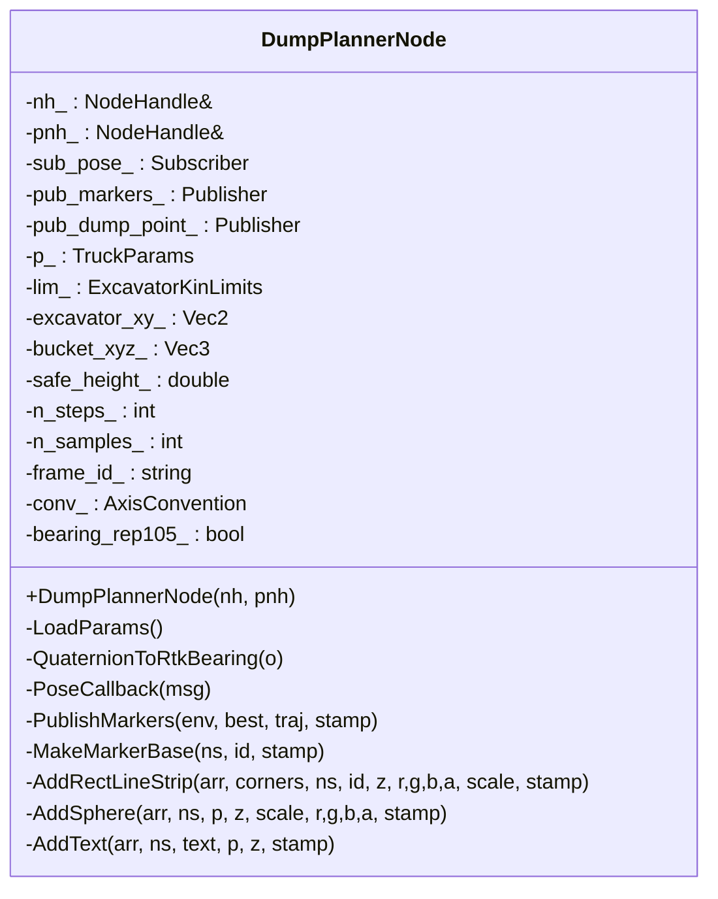
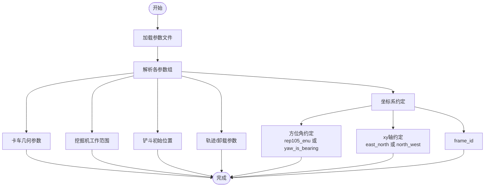
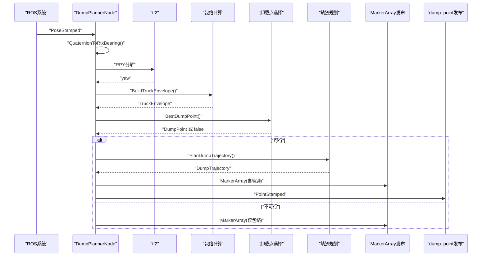
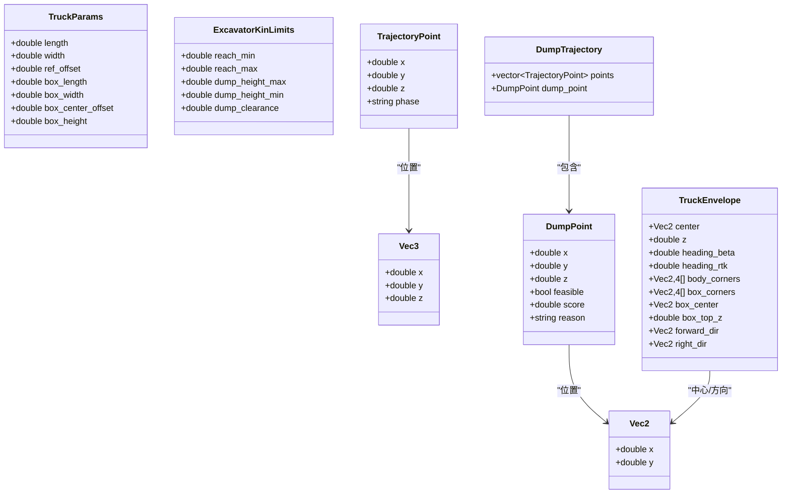
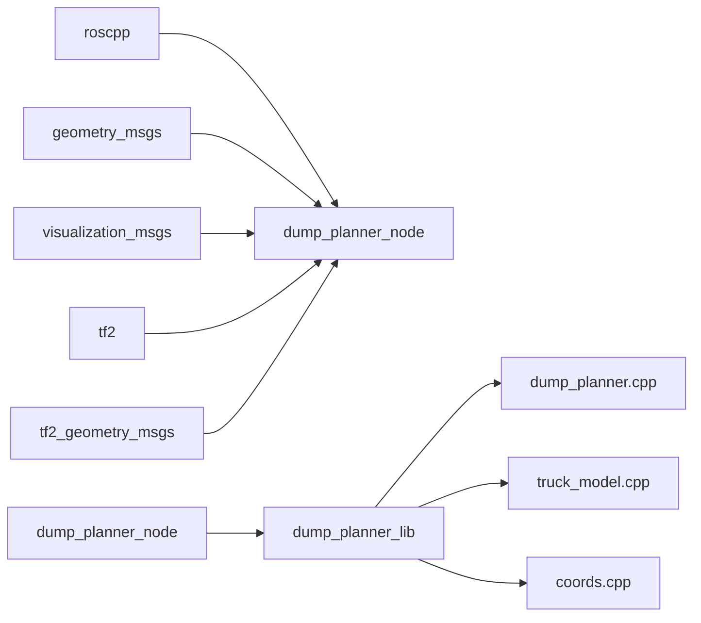

# ROS集成层设计

<cite>
**本文档引用的文件**
- [dump_planner_node.cpp](file://src/truck_dump_planner/src/dump_planner_node.cpp)
- [dump_planner.h](file://src/truck_dump_planner/include/truck_dump_planner/dump_planner.h)
- [dump_planner.cpp](file://src/truck_dump_planner/src/dump_planner.cpp)
- [truck_model.h](file://src/truck_dump_planner/include/truck_dump_planner/truck_model.h)
- [truck_model.cpp](file://src/truck_dump_planner/src/truck_model.cpp)
- [coords.h](file://src/truck_dump_planner/include/truck_dump_planner/coords.h)
- [coords.cpp](file://src/truck_dump_planner/src/coords.cpp)
- [dump_planner.yaml](file://src/truck_dump_planner/config/dump_planner.yaml)
- [dump_planner.launch](file://src/truck_dump_planner/launch/dump_planner.launch)
- [CMakeLists.txt](file://src/truck_dump_planner/CMakeLists.txt)
- [package.xml](file://src/truck_dump_planner/package.xml)
- [dump_planner.rviz](file://src/truck_dump_planner/rviz/dump_planner.rviz)
</cite>

## 目录
1. [引言](#引言)
2. [项目结构](#项目结构)
3. [核心组件](#核心组件)
4. [架构概览](#架构概览)
5. [详细组件分析](#详细组件分析)
6. [依赖关系分析](#依赖关系分析)
7. [性能考虑](#性能考虑)
8. [故障排查指南](#故障排查指南)
9. [结论](#结论)
10. [附录](#附录)

## 引言
本文件面向ROS集成层设计，重点解析DumpPlannerNode类的架构与实现，阐述其如何通过“ROS节点层”与“C++核心算法库”的分离设计实现高内聚低耦合、便于测试与复用。文档覆盖参数加载机制、回调函数实现、话题通信设计、启动流程与调试方法，并给出最佳实践与性能优化建议。

## 项目结构
该仓库采用“核心算法库 + ROS节点层”的分层组织方式：
- include/truck_dump_planner：核心数据结构与接口声明（不含ROS依赖）
- src：核心算法实现与ROS节点实现
- config：参数配置文件
- launch：启动脚本
- rviz：可视化配置
- package.xml/CMakeLists.txt：构建与依赖声明

图表来源
- [dump_planner_node.cpp:1-341](file://src/truck_dump_planner/src/dump_planner_node.cpp#L1-L341)
- [dump_planner.h:1-66](file://src/truck_dump_planner/include/truck_dump_planner/dump_planner.h#L1-L66)
- [dump_planner.cpp:1-120](file://src/truck_dump_planner/src/dump_planner.cpp#L1-L120)
- [truck_model.h:1-60](file://src/truck_dump_planner/include/truck_dump_planner/truck_model.h#L1-L60)
- [truck_model.cpp:1-66](file://src/truck_dump_planner/src/truck_model.cpp#L1-L66)
- [coords.h:1-37](file://src/truck_dump_planner/include/truck_dump_planner/coords.h#L1-L37)
- [coords.cpp:1-52](file://src/truck_dump_planner/src/coords.cpp#L1-L52)
- [dump_planner.launch:1-26](file://src/truck_dump_planner/launch/dump_planner.launch#L1-L26)
- [dump_planner.yaml:1-43](file://src/truck_dump_planner/config/dump_planner.yaml#L1-L43)
- [dump_planner.rviz:1-131](file://src/truck_dump_planner/rviz/dump_planner.rviz#L1-L131)
- [CMakeLists.txt:1-52](file://src/truck_dump_planner/CMakeLists.txt#L1-L52)
- [package.xml:1-20](file://src/truck_dump_planner/package.xml#L1-L20)

章节来源
- [CMakeLists.txt:1-52](file://src/truck_dump_planner/CMakeLists.txt#L1-L52)
- [package.xml:1-20](file://src/truck_dump_planner/package.xml#L1-L20)

## 核心组件
- DumpPlannerNode：ROS节点类，负责参数加载、话题订阅与发布、RViz可视化、调用核心算法并输出结果。
- 核心算法库：独立于ROS的数据结构与算法实现，提供包络计算、卸载点选择与轨迹规划等纯函数接口。
- 参数系统：通过ROS参数服务器加载配置，支持默认值与运行时约定切换。
- 话题系统：输入/输出话题定义明确，消息类型选择合理，便于与上层系统对接。

章节来源
- [dump_planner_node.cpp:25-331](file://src/truck_dump_planner/src/dump_planner_node.cpp#L25-L331)
- [dump_planner.h:10-62](file://src/truck_dump_planner/include/truck_dump_planner/dump_planner.h#L10-L62)
- [dump_planner.cpp:7-117](file://src/truck_dump_planner/src/dump_planner.cpp#L7-L117)
- [truck_model.h:21-52](file://src/truck_dump_planner/include/truck_dump_planner/truck_model.h#L21-L52)
- [truck_model.cpp:22-46](file://src/truck_dump_planner/src/truck_model.cpp#L22-L46)
- [coords.h:6-32](file://src/truck_dump_planner/include/truck_dump_planner/coords.h#L6-L32)
- [coords.cpp:6-49](file://src/truck_dump_planner/src/coords.cpp#L6-L49)

## 架构概览
DumpPlannerNode作为ROS节点，封装了以下职责：
- 参数加载：从参数服务器读取配置，支持坐标系约定与方位角约定切换。
- 输入处理：订阅卡车位姿消息，进行坐标变换与包络计算。
- 算法调用：调用核心算法库完成卸载点选择与轨迹规划。
- 结果发布：发布MarkerArray用于RViz可视化，发布选定卸载点用于下游系统消费。
- 可视化：构建MarkerArray并发布，支持删除历史marker与增量更新。

图表来源
- [dump_planner_node.cpp:99-136](file://src/truck_dump_planner/src/dump_planner_node.cpp#L99-L136)
- [dump_planner.cpp:63-75](file://src/truck_dump_planner/src/dump_planner.cpp#L63-L75)
- [dump_planner.cpp:82-117](file://src/truck_dump_planner/src/dump_planner.cpp#L82-L117)
- [dump_planner.cpp:43-61](file://src/truck_dump_planner/src/dump_planner.cpp#L43-L61)
- [dump_planner.cpp:22-60](file://src/truck_dump_planner/src/dump_planner.cpp#L22-L60)

## 详细组件分析

### DumpPlannerNode类
- 职责边界清晰：参数加载、订阅回调、可视化、发布结果。
- 关键成员变量：NodeHandle、订阅/发布器、参数缓存、坐标系约定标志。
- 关键方法：
  - LoadParams：从参数服务器读取所有配置，设置默认值与约定标志。
  - PoseCallback：位姿消息处理主流程，调用核心算法并发布结果。
  - PublishMarkers：构建MarkerArray并发布，支持删除历史marker与增量更新。
  - 辅助方法：四元数到RTK方位角转换、Marker构造辅助函数。

图表来源
- [dump_planner_node.cpp:25-331](file://src/truck_dump_planner/src/dump_planner_node.cpp#L25-L331)

章节来源
- [dump_planner_node.cpp:27-39](file://src/truck_dump_planner/src/dump_planner_node.cpp#L27-L39)
- [dump_planner_node.cpp:42-84](file://src/truck_dump_planner/src/dump_planner_node.cpp#L42-L84)
- [dump_planner_node.cpp:87-97](file://src/truck_dump_planner/src/dump_planner_node.cpp#L87-L97)
- [dump_planner_node.cpp:99-136](file://src/truck_dump_planner/src/dump_planner_node.cpp#L99-L136)
- [dump_planner_node.cpp:139-313](file://src/truck_dump_planner/src/dump_planner_node.cpp#L139-L313)

### 参数加载机制
- 参数来源：节点私有命名空间~，通过rosparam命令加载配置文件。
- 参数类别：
  - 卡车几何：长度、宽度、参考点偏移、货箱尺寸等。
  - 挖掘机工作范围：最小/最大半径、高度范围、安全间隙。
  - 铲斗初始位置：挖掘机系坐标。
  - 轨迹与卸载：安全高度、轨迹离散步数、卸载点采样数。
  - 坐标系约定：frame_id、xy轴约定、方位角约定。
- 默认值：所有参数均提供默认值，确保最小可用配置。
- 运行时约定：支持rep105_enu与直接使用四元数yaw作为RTK方位角两种约定。

图表来源
- [dump_planner.yaml:1-43](file://src/truck_dump_planner/config/dump_planner.yaml#L1-L43)
- [dump_planner_node.cpp:42-84](file://src/truck_dump_planner/src/dump_planner_node.cpp#L42-L84)

章节来源
- [dump_planner.yaml:1-43](file://src/truck_dump_planner/config/dump_planner.yaml#L1-L43)
- [dump_planner_node.cpp:42-84](file://src/truck_dump_planner/src/dump_planner_node.cpp#L42-L84)

### 回调函数实现
- PoseCallback：位姿消息入口，执行以下步骤：
  - 提取位置与四元数，转换为RTK方位角。
  - 构建卡车包络。
  - 选择最优卸载点。
  - 若可行则规划轨迹。
  - 发布MarkerArray与选定卸载点。
  - 日志输出（节流）。
- 坐标变换：QuaternionToRtkBearing结合tf2库进行RPY分解，依据约定进行角度换算。
- 可视化：先发布DELETEALL清理历史，再发布当前帧的包络、箭头、球体、文本与轨迹线。

图表来源
- [dump_planner_node.cpp:99-136](file://src/truck_dump_planner/src/dump_planner_node.cpp#L99-L136)
- [dump_planner_node.cpp:87-97](file://src/truck_dump_planner/src/dump_planner_node.cpp#L87-L97)
- [dump_planner.cpp:63-75](file://src/truck_dump_planner/src/dump_planner.cpp#L63-L75)
- [dump_planner.cpp:82-117](file://src/truck_dump_planner/src/dump_planner.cpp#L82-L117)

章节来源
- [dump_planner_node.cpp:99-136](file://src/truck_dump_planner/src/dump_planner_node.cpp#L99-L136)
- [dump_planner_node.cpp:87-97](file://src/truck_dump_planner/src/dump_planner_node.cpp#L87-L97)

### 话题通信设计
- 输入话题：/truck_pose（geometry_msgs/PoseStamped），包含位置xyz与四元数orientation。
- 输出话题：
  - /truck_envelope_markers（visualization_msgs/MarkerArray），用于RViz可视化。
  - /dump_point（geometry_msgs/PointStamped），用于下游系统消费。
- 命名空间与重映射：节点私有命名空间~，launch中通过remap将输入重映射到真实话题名。
- 发布策略：每帧发布一次，MarkerArray包含DELETEALL与当前帧内容，保证显示连续性。

章节来源
- [dump_planner_node.cpp:3-9](file://src/truck_dump_planner/src/dump_planner_node.cpp#L3-L9)
- [dump_planner_node.cpp:30-36](file://src/truck_dump_planner/src/dump_planner_node.cpp#L30-L36)
- [dump_planner.launch:10-12](file://src/truck_dump_planner/launch/dump_planner.launch#L10-L12)

### 核心算法库
- 数据结构：
  - Vec2/Vec3：二维/三维向量。
  - TruckParams：卡车几何参数。
  - ExcavatorKinLimits：挖掘机工作范围限制。
  - DumpPoint：候选/选定卸载点（含可行性与评分）。
  - TrajectoryPoint/DumpTrajectory：轨迹点与轨迹集合。
- 接口：
  - SelectDumpPoint：在货箱顶面生成候选卸载点并排序。
  - BestDumpPoint：返回评分最高的可行卸载点。
  - PlanDumpTrajectory：规划三段式平滑轨迹（抬升-回转-下降）。
  - BuildTruckEnvelope：构建卡车包络。
  - PointInPolygon：射线法判断点在多边形内。
- 实现要点：
  - 卸载点评分：综合半径与纵向位置，偏向货箱中心。
  - 轨迹平滑：采用半余弦插值，避免速度突变。
  - 包络计算：支持不同xy轴约定，统一转换为挖掘机系航向β。

图表来源
- [dump_planner.h:10-62](file://src/truck_dump_planner/include/truck_dump_planner/dump_planner.h#L10-L62)
- [truck_model.h:21-52](file://src/truck_dump_planner/include/truck_dump_planner/truck_model.h#L21-L52)

章节来源
- [dump_planner.h:10-62](file://src/truck_dump_planner/include/truck_dump_planner/dump_planner.h#L10-L62)
- [dump_planner.cpp:7-117](file://src/truck_dump_planner/src/dump_planner.cpp#L7-L117)
- [truck_model.h:21-52](file://src/truck_dump_planner/include/truck_dump_planner/truck_model.h#L21-L52)
- [truck_model.cpp:22-46](file://src/truck_dump_planner/src/truck_model.cpp#L22-L46)
- [coords.h:6-32](file://src/truck_dump_planner/include/truck_dump_planner/coords.h#L6-L32)
- [coords.cpp:6-49](file://src/truck_dump_planner/src/coords.cpp#L6-L49)

### 启动流程与调试
- 启动方式：
  - 使用launch文件一次性启动节点、测试位姿发布器与RViz。
  - 通过rosparam加载配置文件，支持remap输入话题。
- 调试方法：
  - 查看节点日志（INFO/ WARN/ WARN_THROTTLE）。
  - 使用rviz观察MarkerArray显示。
  - 使用rostopic echo查看输出话题。
  - 使用rostopic pub手动发布测试位姿验证流程。
- 常见问题与解决：
  - 话题未连接：确认launch中的remap与实际发布者一致。
  - 坐标系不匹配：核对frame_id与RViz固定帧一致。
  - 方位角约定错误：根据实际数据来源选择rep105_enu或yaw_is_bearing。
  - 参数缺失：确保配置文件路径正确且参数键名一致。

章节来源
- [dump_planner.launch:1-26](file://src/truck_dump_planner/launch/dump_planner.launch#L1-L26)
- [dump_planner.rviz:82-89](file://src/truck_dump_planner/rviz/dump_planner.rviz#L82-L89)
- [dump_planner_node.cpp:37-38](file://src/truck_dump_planner/src/dump_planner_node.cpp#L37-L38)

## 依赖关系分析
- 构建依赖：catkin查找roscpp、geometry_msgs、visualization_msgs、tf2、tf2_geometry_msgs。
- 运行时依赖：DumpPlannerNode依赖核心算法库；核心算法库不依赖ROS。
- 组件耦合：通过接口清晰分离，核心算法库可独立编译与测试。

图表来源
- [CMakeLists.txt:11-17](file://src/truck_dump_planner/CMakeLists.txt#L11-L17)
- [CMakeLists.txt:38-39](file://src/truck_dump_planner/CMakeLists.txt#L38-L39)
- [package.xml:14-18](file://src/truck_dump_planner/package.xml#L14-L18)

章节来源
- [CMakeLists.txt:11-22](file://src/truck_dump_planner/CMakeLists.txt#L11-L22)
- [package.xml:14-18](file://src/truck_dump_planner/package.xml#L14-L18)

## 性能考虑
- 发布频率控制：使用throttle日志减少高频输出。
- MarkerArray策略：每帧先DELETEALL再ADD，避免累积导致内存膨胀。
- 离散步数：轨迹n_steps影响精度与计算量，可根据实时性需求调整。
- 采样数量：dump n_samples影响卸载点搜索效率，建议在可行范围内适度增加。
- 坐标变换：tf2 RPY分解为O(1)，成本极低，无需额外优化。
- 内存管理：Vector预留容量与就地push_back，减少多次分配。

## 故障排查指南
- 无法收到输入：
  - 检查话题名称与frame_id是否与发布者一致。
  - 使用rostopic list确认话题存在。
- 显示异常：
  - 确认RViz固定帧与frame_id一致。
  - 检查MarkerArray主题是否正确绑定。
- 角度不一致：
  - 核对bearing_convention与数据来源约定。
  - 验证QuaternionToRtkBearing逻辑与tf2约定。
- 参数未生效：
  - 确认rosparam加载路径与键名一致。
  - 使用rosparam get查看参数值。

章节来源
- [dump_planner_node.cpp:37-38](file://src/truck_dump_planner/src/dump_planner_node.cpp#L37-L38)
- [dump_planner_node.cpp:127-135](file://src/truck_dump_planner/src/dump_planner_node.cpp#L127-L135)
- [dump_planner.launch:10-12](file://src/truck_dump_planner/launch/dump_planner.launch#L10-L12)
- [dump_planner.rviz:94-95](file://src/truck_dump_planner/rviz/dump_planner.rviz#L94-L95)

## 结论
DumpPlannerNode通过清晰的分层设计实现了ROS集成与核心算法的解耦，既满足了工程落地的实时性与可视化需求，又保留了算法库的独立性与可测试性。参数加载、回调处理、话题通信与可视化发布形成闭环，配合完善的启动与调试流程，为后续扩展与维护提供了良好基础。

## 附录
- 启动命令示例（基于launch）：
  - roslaunch truck_dump_planner dump_planner.launch
- 参数查看：
  - rosparam get /dump_planner_node
- 日志查看：
  - rosout _log
- 可视化：
  - rviz -d $(find truck_dump_planner)/rviz/dump_planner.rviz