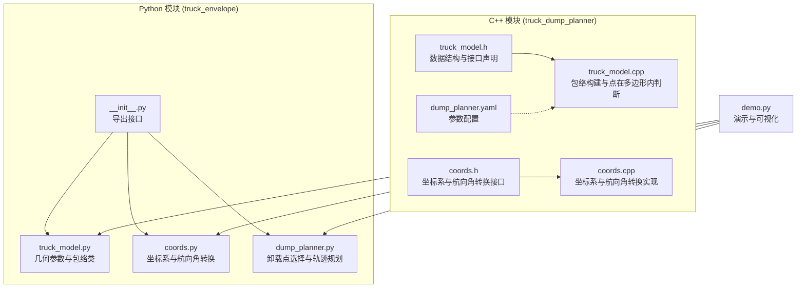
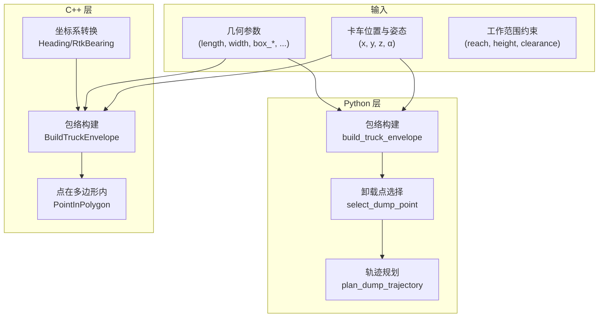
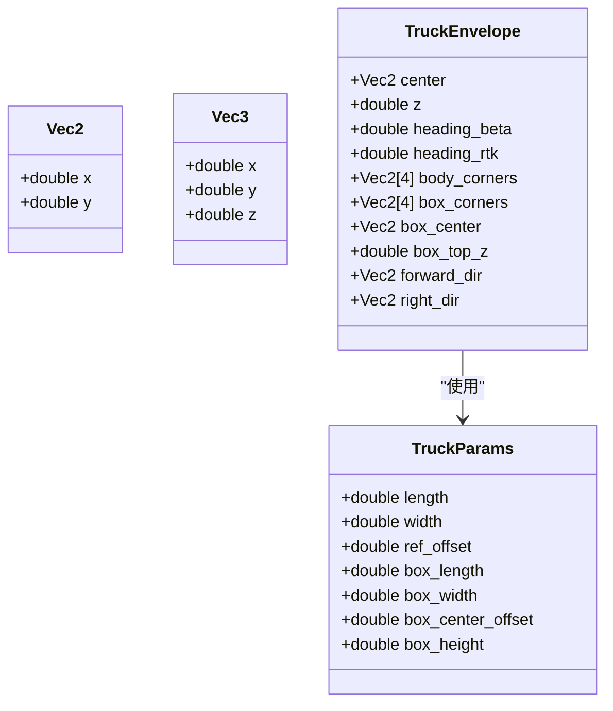
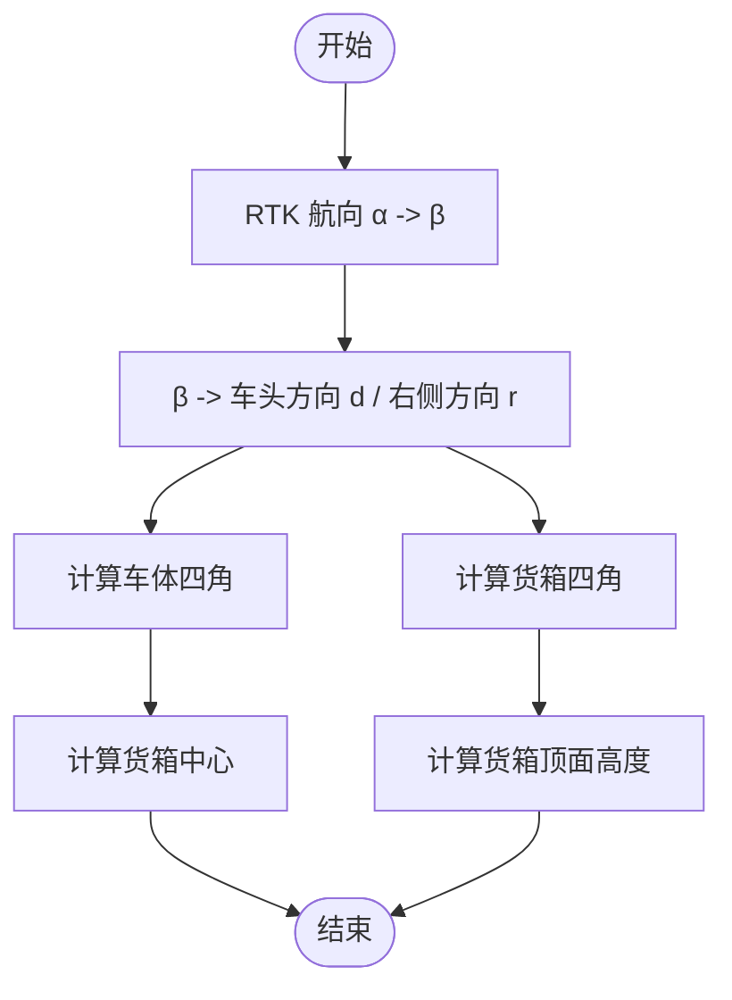
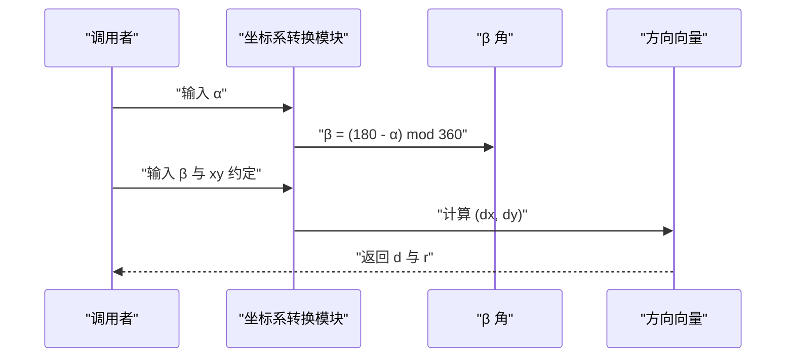
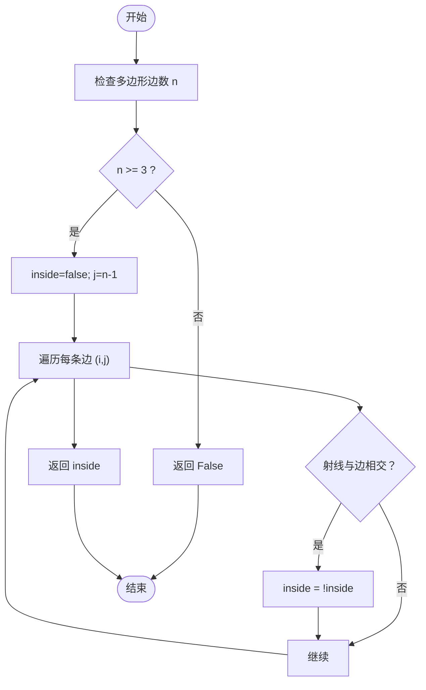
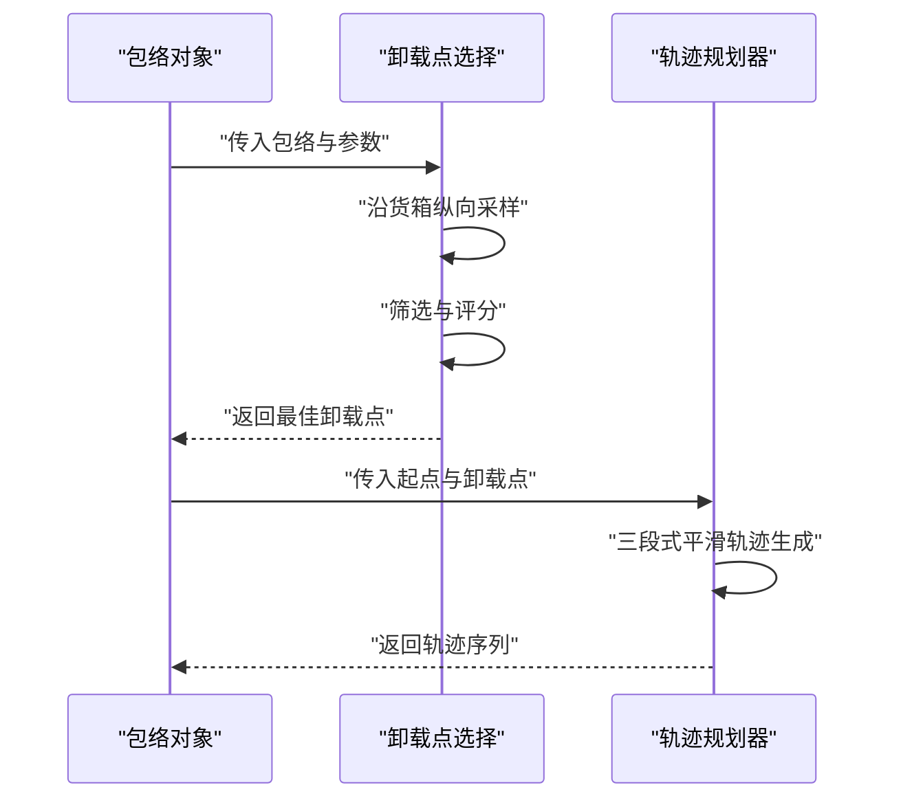
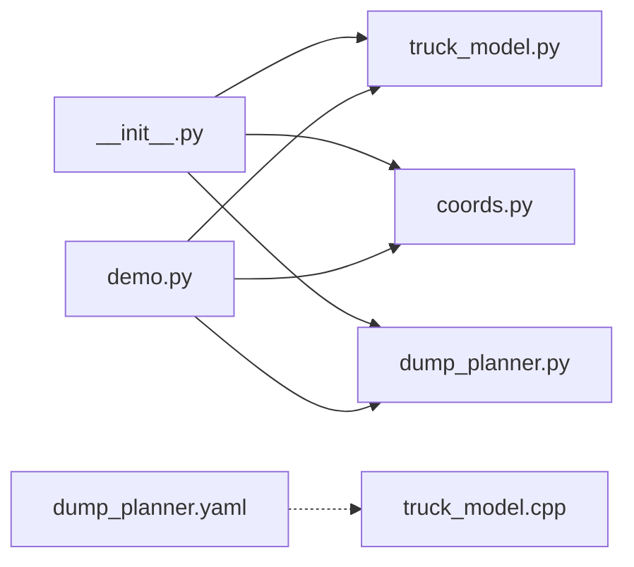

# 卡车包络建模系统

<cite>
**本文档引用的文件**
- [truck_model.h](file://src/truck_dump_planner/include/truck_dump_planner/truck_model.h)
- [truck_model.cpp](file://src/truck_dump_planner/src/truck_model.cpp)
- [coords.h](file://src/truck_dump_planner/include/truck_dump_planner/coords.h)
- [coords.cpp](file://src/truck_dump_planner/src/coords.cpp)
- [truck_model.py](file://src/truck_envelope/truck_model.py)
- [coords.py](file://src/truck_envelope/coords.py)
- [dump_planner.py](file://src/truck_envelope/dump_planner.py)
- [__init__.py](file://src/truck_envelope/__init__.py)
- [demo.py](file://src/demo.py)
- [dump_planner.yaml](file://src/truck_dump_planner/config/dump_planner.yaml)
</cite>

## 目录
1. [引言](#引言)
2. [项目结构](#项目结构)
3. [核心组件](#核心组件)
4. [架构概览](#架构概览)
5. [详细组件分析](#详细组件分析)
6. [依赖分析](#依赖分析)
7. [性能考虑](#性能考虑)
8. [故障排除指南](#故障排除指南)
9. [结论](#结论)
10. [附录](#附录)

## 引言
本文件系统化阐述卡车包络建模系统的设计与实现，覆盖以下要点：
- 几何参数定义与建模流程：解释车体与货箱的长度、宽度、高度等关键参数，及其在包络构建中的作用与影响。
- 包络多边形构建算法：详述顶点计算、边界线生成与碰撞检测支持。
- TruckEnvelope 类设计与使用：阐明数据结构、构建流程与应用场景。
- 轨迹规划中的应用：展示如何利用包络信息进行安全距离计算与障碍物规避。
- 性能优化建议与常见建模问题的解决方案。

## 项目结构
仓库包含两个主要模块：
- C++ 实现（truck_dump_planner）：提供核心几何计算与坐标系转换接口，便于集成到 ROS 系统。
- Python 实现（truck_envelope）：提供完整的包络建模、卸载点选择与轨迹规划功能，便于快速验证与演示。

图表来源
- [truck_model.h:1-60](file://src/truck_dump_planner/include/truck_dump_planner/truck_model.h#L1-L60)
- [truck_model.cpp:1-66](file://src/truck_dump_planner/src/truck_model.cpp#L1-L66)
- [coords.h:1-37](file://src/truck_dump_planner/include/truck_dump_planner/coords.h#L1-L37)
- [coords.cpp:1-52](file://src/truck_dump_planner/src/coords.cpp#L1-L52)
- [__init__.py:1-36](file://src/truck_envelope/__init__.py#L1-L36)
- [truck_model.py:1-200](file://src/truck_envelope/truck_model.py#L1-L200)
- [coords.py:1-200](file://src/truck_envelope/coords.py#L1-L200)
- [dump_planner.py:1-222](file://src/truck_envelope/dump_planner.py#L1-L222)
- [demo.py:1-249](file://src/demo.py#L1-L249)
- [dump_planner.yaml:1-43](file://src/truck_dump_planner/config/dump_planner.yaml#L1-L43)

章节来源
- [truck_model.h:1-60](file://src/truck_dump_planner/include/truck_dump_planner/truck_model.h#L1-L60)
- [coords.h:1-37](file://src/truck_dump_planner/include/truck_dump_planner/coords.h#L1-L37)
- [__init__.py:1-36](file://src/truck_envelope/__init__.py#L1-L36)
- [dump_planner.yaml:1-43](file://src/truck_dump_planner/config/dump_planner.yaml#L1-L43)

## 核心组件
- 几何参数与包络数据结构
  - TruckParams：定义卡车总长、总宽、参考点偏移、货箱长宽、货箱中心偏移与货箱高度等关键参数。
  - TruckEnvelope：封装包络多边形的几何信息，包括车体四角、货箱四角、货箱中心、车头与右侧方向向量、航向角等。
- 坐标系与航向角转换
  - 提供 RTK 方位角 α 与挖掘机系航向角 β 的双向转换，以及 β 到车头方向单位向量的分解。
- 包络构建与点在多边形内判断
  - 使用矩形四角计算函数，结合方向向量与偏移，生成车体与货箱的包络多边形。
  - 提供射线法判断点是否在多边形内的实现，用于碰撞与合法性检查。

章节来源
- [truck_model.h:21-56](file://src/truck_dump_planner/include/truck_dump_planner/truck_model.h#L21-L56)
- [truck_model.cpp:6-63](file://src/truck_dump_planner/src/truck_model.cpp#L6-L63)
- [coords.h:10-32](file://src/truck_dump_planner/include/truck_dump_planner/coords.h#L10-L32)
- [coords.cpp:6-49](file://src/truck_dump_planner/src/coords.cpp#L6-L49)

## 架构概览
系统采用双语言实现，C++ 侧重于高性能与系统集成，Python 侧重于易用性与快速验证。两者共享相同的几何建模思想与坐标系约定。

图表来源
- [truck_model.py:112-177](file://src/truck_envelope/truck_model.py#L112-L177)
- [dump_planner.py:69-140](file://src/truck_envelope/dump_planner.py#L69-L140)
- [dump_planner.py:143-207](file://src/truck_envelope/dump_planner.py#L143-L207)
- [truck_model.h:46-56](file://src/truck_dump_planner/include/truck_dump_planner/truck_model.h#L46-L56)
- [coords.h:13-32](file://src/truck_dump_planner/include/truck_dump_planner/coords.h#L13-L32)

## 详细组件分析

### 几何参数与包络数据结构
- 关键参数说明
  - length/width：车体总长与总宽，决定车体包络矩形的尺寸。
  - ref_offset：参考点相对几何中心的纵向偏移，用于将参考点设置在车体不同位置（如几何中心或后轴）。
  - box_length/box_width/box_center_offset/box_height：货箱尺寸与中心纵向偏移，以及货箱侧壁高度，用于生成货箱包络与卸载高度估算。
- 数据结构
  - Vec2/Vec3：二维/三维向量，用于存储坐标与方向。
  - TruckParams：集中管理几何参数。
  - TruckEnvelope：包含中心点、航向角、方向向量、车体与货箱四角、货箱中心与顶面高度等。

图表来源
- [truck_model.h:10-44](file://src/truck_dump_planner/include/truck_dump_planner/truck_model.h#L10-L44)

章节来源
- [truck_model.h:21-44](file://src/truck_dump_planner/include/truck_dump_planner/truck_model.h#L21-L44)

### 包络多边形构建算法
- 核心流程
  - 将 RTK 方位角 α 转换为挖掘机系航向角 β。
  - 由 β 计算车头方向单位向量 d 与右侧方向单位向量 r。
  - 以参考点为中心，沿 d/r 方向计算车体与货箱的矩形四角，输出顺序为前左→后左→后右→前右（逆时针）。
  - 计算货箱中心与货箱顶面高度。
- 顶点计算细节
  - 使用中心点与纵向/横向半长，结合方向向量与中心偏移，推导四个角点坐标。
  - 货箱中心通过参考点沿车头方向偏移得到。

图表来源
- [truck_model.cpp:22-46](file://src/truck_dump_planner/src/truck_model.cpp#L22-L46)
- [truck_model.py:112-177](file://src/truck_envelope/truck_model.py#L112-L177)

章节来源
- [truck_model.cpp:6-46](file://src/truck_dump_planner/src/truck_model.cpp#L6-L46)
- [truck_model.py:84-109](file://src/truck_envelope/truck_model.py#L84-L109)

### 坐标系与航向角转换
- 航向角约定
  - 挖掘机系航向角 β：正北=180°、正东=90°、正南=0°、正西=270°，逆时针增大。
  - RTK 方位角 α：正北=0°、正东=90°、正南=180°、正西=270°，顺时针增大。
  - 转换关系：β = (180 - α) mod 360°，反之亦然。
- 方向向量分解
  - 支持两种 xy 轴地理朝向约定：x 东 y 北（默认 ENU）与 x 北 y 西。
  - 将 β 映射到 (dx, dy)，并提供右侧方向向量 (dy, -dx)。

图表来源
- [coords.cpp:10-49](file://src/truck_dump_planner/src/coords.cpp#L10-L49)
- [coords.py:39-199](file://src/truck_envelope/coords.py#L39-L199)

章节来源
- [coords.h:13-32](file://src/truck_dump_planner/include/truck_dump_planner/coords.h#L13-L32)
- [coords.cpp:6-49](file://src/truck_dump_planner/src/coords.cpp#L6-L49)
- [coords.py:39-199](file://src/truck_envelope/coords.py#L39-L199)

### 点在多边形内判断（碰撞检测支持）
- 算法概述
  - 使用射线法：从测试点沿任意方向发出射线，统计与多边形边界的交点数量，奇数次表示点在多边形内部。
  - 为避免除零与浮点误差，使用极小值修正分母。
- 应用场景
  - 卸载点合法性检查：确保候选点位于车体包络之内，避免“够不着”的极端情形。
  - 避障与安全距离计算：将障碍物投影到 xy 平面，判断是否与包络相交。

图表来源
- [truck_model.cpp:48-63](file://src/truck_dump_planner/src/truck_model.cpp#L48-L63)
- [truck_model.py:180-194](file://src/truck_envelope/truck_model.py#L180-L194)

章节来源
- [truck_model.cpp:48-63](file://src/truck_dump_planner/src/truck_model.cpp#L48-L63)
- [truck_model.py:180-194](file://src/truck_envelope/truck_model.py#L180-L194)

### 卸载点选择与轨迹规划
- 卸载点选择
  - 沿货箱纵向均匀采样，高度为货箱顶面 + 卸料间隙。
  - 筛选条件：工作半径在最小/最大范围内、卸载高度在允许范围内、点在车体包络之内。
  - 评分策略：优先工作半径较小且靠近货箱中心的点。
- 轨迹规划
  - 三段式运动：抬升 → 回转 → 下放，每段采用半余弦平滑，避免速度突变。
  - 输出离散轨迹点序列，包含阶段标记，便于后续控制与可视化。

图表来源
- [dump_planner.py:69-140](file://src/truck_envelope/dump_planner.py#L69-L140)
- [dump_planner.py:143-207](file://src/truck_envelope/dump_planner.py#L143-L207)

章节来源
- [dump_planner.py:69-140](file://src/truck_envelope/dump_planner.py#L69-L140)
- [dump_planner.py:143-207](file://src/truck_envelope/dump_planner.py#L143-L207)

### TruckEnvelope 类设计与使用
- 设计理念
  - 将包络的几何信息与方向信息集中在一个结构中，便于后续的卸载点选择与轨迹规划。
  - 通过方向向量与中心点，避免重复计算，提高效率。
- 使用方法
  - 通过构建函数传入位置、姿态与参数，获得完整的包络对象。
  - 在 Python 与 C++ 两端均可使用，接口一致，便于跨语言协作。
- 几何计算示例
  - 参考演示脚本中的典型装车场景，展示如何从 RTK 航向生成包络、选择卸载点并规划轨迹。

章节来源
- [truck_model.h:32-44](file://src/truck_dump_planner/include/truck_dump_planner/truck_model.h#L32-L44)
- [truck_model.py:65-82](file://src/truck_envelope/truck_model.py#L65-L82)
- [demo.py:93-149](file://src/demo.py#L93-L149)

## 依赖分析
- 模块间耦合
  - Python 层通过 __init__.py 导出统一接口，降低调用复杂度。
  - C++ 层与 Python 层共享相同的几何建模思想，接口语义一致。
- 外部依赖
  - Python 演示脚本可选依赖 matplotlib，用于生成示意图。
  - 配置文件提供参数化入口，便于系统集成与部署。

图表来源
- [__init__.py:1-36](file://src/truck_envelope/__init__.py#L1-L36)
- [demo.py:24-41](file://src/demo.py#L24-L41)
- [dump_planner.yaml:1-43](file://src/truck_dump_planner/config/dump_planner.yaml#L1-L43)

章节来源
- [__init__.py:1-36](file://src/truck_envelope/__init__.py#L1-L36)
- [demo.py:24-41](file://src/demo.py#L24-L41)
- [dump_planner.yaml:1-43](file://src/truck_dump_planner/config/dump_planner.yaml#L1-L43)

## 性能考虑
- 算法复杂度
  - 包络构建：O(1)，仅涉及少量向量运算与三角函数。
  - 点在多边形内判断：O(n)，n 为多边形边数（通常为 4）。
- 优化建议
  - 预计算与缓存：方向向量与包络顶点可缓存，避免重复计算。
  - 向量化：在批量处理时，优先使用向量化操作（如 NumPy）提升 Python 端性能。
  - 精度与稳定性：在射线法中使用极小值修正分母，减少数值误差导致的误判。
  - 采样策略：卸载点采样数量可根据实时性能调整，平衡精度与速度。

## 故障排除指南
- 常见问题
  - 航向角不一致：确认 α 与 β 的转换关系与 xy 约定一致。
  - 包络方向错误：检查车头方向与右侧方向的计算是否符合预期。
  - 卸载点不可行：检查工作半径、高度限制与包络内合法性。
- 排查步骤
  - 验证坐标系转换：参考演示脚本中的转换验证部分。
  - 可视化包络：使用 ASCII 图或 matplotlib 生成示意图，直观检查包络朝向与尺寸。
  - 参数校验：核对 dump_planner.yaml 中的几何参数与工作范围约束。

章节来源
- [demo.py:50-90](file://src/demo.py#L50-L90)
- [demo.py:152-206](file://src/demo.py#L152-L206)
- [dump_planner.yaml:4-43](file://src/truck_dump_planner/config/dump_planner.yaml#L4-L43)

## 结论
本系统提供了完整的卡车包络建模能力，涵盖几何参数定义、包络多边形构建、坐标系转换与点在多边形内判断，并在 Python 层实现了卸载点选择与轨迹规划。通过清晰的数据结构与稳定的算法实现，系统能够有效支撑轨迹规划中的安全距离计算与障碍物规避需求。建议在实际部署中结合配置文件参数化与可视化工具，持续优化性能与鲁棒性。

## 附录
- 参数配置示例路径
  - [dump_planner.yaml:4-43](file://src/truck_dump_planner/config/dump_planner.yaml#L4-L43)
- 演示与可视化
  - [demo.py:1-249](file://src/demo.py#L1-L249)