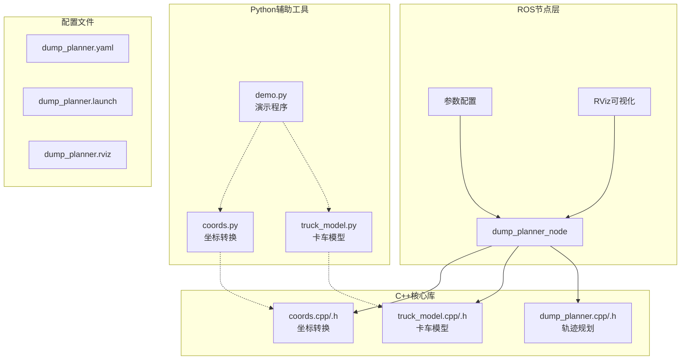
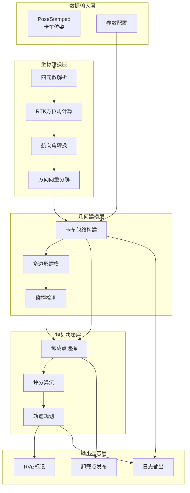
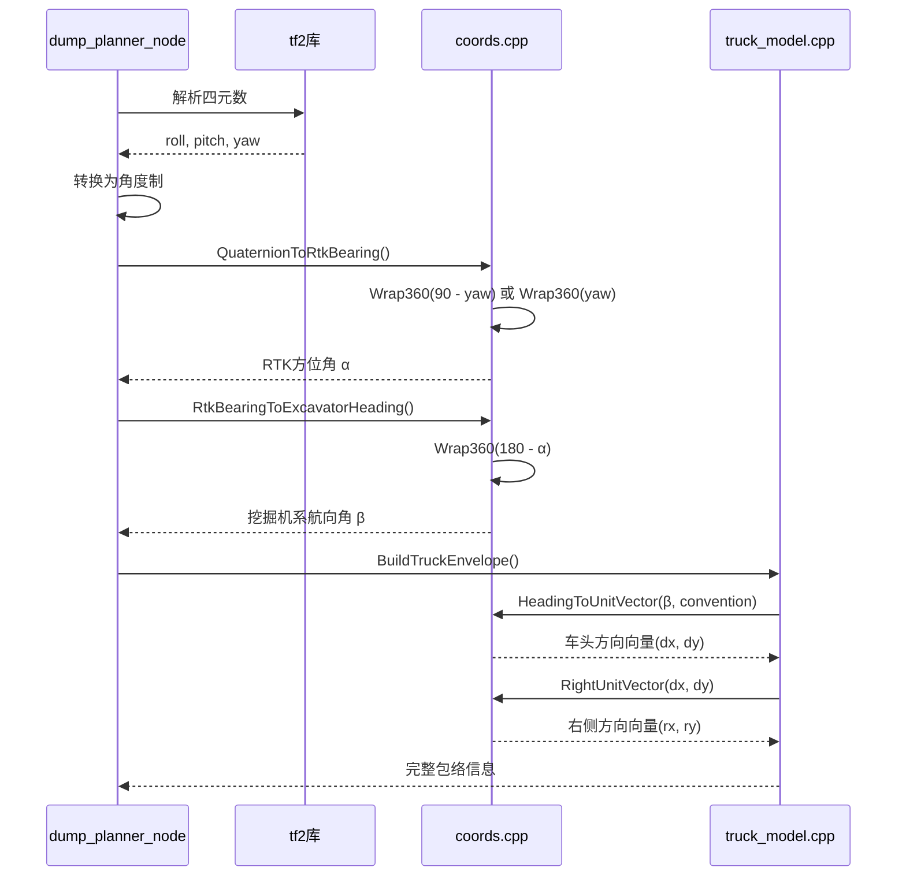
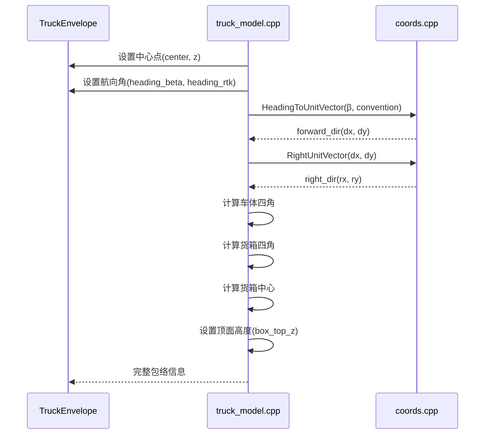
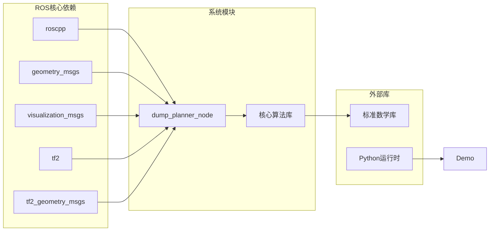
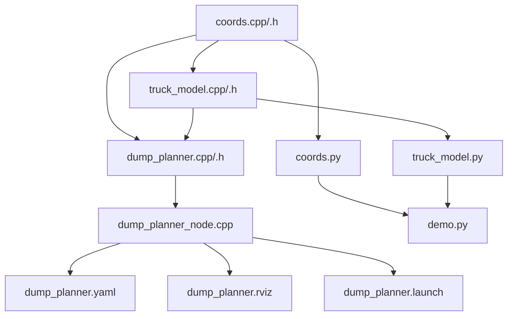

# 坐标系转换系统

<cite>
**本文档引用的文件**
- [coords.h](file://src/truck_dump_planner/include/truck_dump_planner/coords.h)
- [coords.cpp](file://src/truck_dump_planner/src/coords.cpp)
- [dump_planner.h](file://src/truck_dump_planner/include/truck_dump_planner/dump_planner.h)
- [dump_planner.cpp](file://src/truck_dump_planner/src/dump_planner.cpp)
- [truck_model.h](file://src/truck_dump_planner/include/truck_dump_planner/truck_model.h)
- [truck_model.cpp](file://src/truck_dump_planner/src/truck_model.cpp)
- [dump_planner_node.cpp](file://src/truck_dump_planner/src/dump_planner_node.cpp)
- [coords.py](file://src/truck_envelope/coords.py)
- [truck_model.py](file://src/truck_envelope/truck_model.py)
- [demo.py](file://src/demo.py)
- [dump_planner.yaml](file://src/truck_dump_planner/config/dump_planner.yaml)
- [package.xml](file://src/truck_dump_planner/package.xml)
- [CMakeLists.txt](file://src/truck_dump_planner/CMakeLists.txt)
</cite>

## 目录
1. [简介](#简介)
2. [项目结构](#项目结构)
3. [核心组件](#核心组件)
4. [架构概览](#架构概览)
5. [详细组件分析](#详细组件分析)
6. [依赖关系分析](#依赖关系分析)
7. [性能考虑](#性能考虑)
8. [故障排除指南](#故障排除指南)
9. [结论](#结论)
10. [附录](#附录)

## 简介

本项目是一个专门针对无人挖掘机装车作业的坐标系转换系统，主要解决RTK方位角与挖掘机系航向角之间的双向转换问题。系统实现了两种地理坐标约定（east_north和north_west），提供了完整的卡车包络建模、卸载点选择和轨迹规划功能。

该系统的核心价值在于：
- **标准化坐标转换**：建立RTK地理坐标系与挖掘机本地坐标系之间的桥梁
- **灵活的坐标约定**：支持不同的xy轴地理朝向约定
- **完整的作业流程**：从姿态估计到轨迹规划的一站式解决方案
- **ROS集成**：提供RViz可视化和实时处理能力

## 项目结构

项目采用模块化设计，分为C++核心库和Python辅助工具两个主要部分：



**图表来源**
- [dump_planner_node.cpp:1-341](file://src/truck_dump_planner/src/dump_planner_node.cpp#L1-L341)
- [coords.h:1-37](file://src/truck_dump_planner/include/truck_dump_planner/coords.h#L1-L37)
- [coords.cpp:1-52](file://src/truck_dump_planner/src/coords.cpp#L1-L52)

**章节来源**
- [package.xml:1-20](file://src/truck_dump_planner/package.xml#L1-L20)
- [CMakeLists.txt:1-52](file://src/truck_dump_planner/CMakeLists.txt#L1-L52)

## 核心组件

### 坐标转换核心

系统的核心是RTK方位角与挖掘机系航向角之间的双向转换机制：

```mermaid
flowchart TD
Alpha[RTK方位角 α<br/>北0°顺时针] --> Convert1[β = (180 - α) mod 360]
Beta[挖掘机系航向角 β<br/>北180°逆时针] --> Convert2[α = (180 - β) mod 360]
Convert1 --> Vector[车头方向向量(dx,dy)]
Convert2 --> Vector
Vector --> Convention{坐标约定选择}
Convention --> |east_north| EastNorth[x=东, y=北]
Convention --> |north_west| NorthWest[x=北, y=西]
EastNorth --> Matrix[旋转矩阵]
NorthWest --> Matrix
Matrix --> Result[最终方向向量]
```

**图表来源**
- [coords.cpp:10-16](file://src/truck_dump_planner/src/coords.cpp#L10-L16)
- [coords.h:20-32](file://src/truck_dump_planner/include/truck_dump_planner/coords.h#L20-L32)

### 向量类型定义

系统定义了基础的向量类型用于表示二维和三维坐标：

| 类型 | 成员变量 | 用途 |
|------|----------|------|
| Vec2 | x, y | 二维平面坐标（挖掘机系xy平面） |
| Vec3 | x, y, z | 三维空间坐标（包含高度信息） |

这些向量类型在整个系统中被广泛使用，从卡车位置表示到轨迹点存储都有应用。

**章节来源**
- [truck_model.h:10-19](file://src/truck_dump_planner/include/truck_dump_planner/truck_model.h#L10-L19)
- [dump_planner.h:20-35](file://src/truck_dump_planner/include/truck_dump_planner/dump_planner.h#L20-L35)

## 架构概览

系统采用分层架构设计，从底层的坐标转换到上层的轨迹规划形成了清晰的功能层次：



**图表来源**
- [dump_planner_node.cpp:99-136](file://src/truck_dump_planner/src/dump_planner_node.cpp#L99-L136)
- [truck_model.cpp:22-46](file://src/truck_dump_planner/src/truck_model.cpp#L22-L46)

## 详细组件分析

### RTK方位角与挖掘机系航向角转换

#### 数学原理

RTK方位角（α）和挖掘机系航向角（β）之间存在严格的数学关系：

```
β = (180° - α) mod 360°
α = (180° - β) mod 360°
```

这种转换基于以下几何关系：
- RTK方位角：以正北为0°，顺时针增加
- 挖掘机系航向角：以正北为180°，逆时针增加
- 两者相差180°，且旋转方向相反

#### 实现细节



**图表来源**
- [dump_planner_node.cpp:87-97](file://src/truck_dump_planner/src/dump_planner_node.cpp#L87-L97)
- [coords.cpp:10-16](file://src/truck_dump_planner/src/coords.cpp#L10-L16)
- [truck_model.cpp:22-46](file://src/truck_dump_planner/src/truck_model.cpp#L22-L46)

**章节来源**
- [coords.cpp:10-16](file://src/truck_dump_planner/src/coords.cpp#L10-L16)
- [dump_planner_node.cpp:87-97](file://src/truck_dump_planner/src/dump_planner_node.cpp#L87-L97)

### 两种地理坐标约定

#### east_north约定（ENU式）

在east_north约定下：
- x轴指向东方（East）
- y轴指向北方（North）
- 车头方向向量计算：(dx, dy) = (sin β, cos β)

#### north_west约定

在north_west约定下：
- x轴指向北方（North）
- y轴指向西方（West）
- 车头方向向量计算：(dx, dy) = (cos β, -sin β)

#### 转换算法实现

```mermaid
flowchart TD
Start[输入航向角 β] --> CalcGeo[计算地理方位角 θ_geo = β - 180]
CalcGeo --> Choose{选择坐标约定}
Choose --> |east_north| EN[conv.north = (0,1)]
Choose --> |north_west| NW[conv.north = (1,0)]
EN --> Rotate1[应用旋转矩阵]
NW --> Rotate1
Rotate1 --> GeoVector[得到地理方向向量]
GeoVector --> Normalize[向量归一化]
Normalize --> Output[输出(dx, dy)]
```

**图表来源**
- [coords.cpp:18-43](file://src/truck_dump_planner/src/coords.cpp#L18-L43)
- [coords.py:137-151](file://src/truck_envelope/coords.py#L137-L151)

**章节来源**
- [coords.cpp:18-43](file://src/truck_dump_planner/src/coords.cpp#L18-L43)
- [coords.py:92-108](file://src/truck_envelope/coords.py#L92-L108)

### 四元数到方位角转换

#### 四元数解析

系统支持两种四元数到RTK方位角的转换约定：

1. **rep105_enu约定**：α = (90° - yaw) mod 360°
2. **yaw_is_bearing约定**：α = yaw mod 360°

#### 实现流程

```mermaid
flowchart TD
Q[四元数 q(x,y,z,w)] --> RPY[tf2::Matrix3x3.getRPY]
RPY --> RollPitch[Yaw角提取]
RollPitch --> Check{选择转换约定}
Check --> |rep105_enu| Rep105[α = (90 - yaw) mod 360]
Check --> |yaw_is_bearing| YawBearing[α = yaw mod 360]
Rep105 --> Wrap[角度归一化]
YawBearing --> Wrap
Wrap --> Result[RTK方位角 α]
```

**图表来源**
- [dump_planner_node.cpp:87-97](file://src/truck_dump_planner/src/dump_planner_node.cpp#L87-L97)

**章节来源**
- [dump_planner_node.cpp:87-97](file://src/truck_dump_planner/src/dump_planner_node.cpp#L87-L97)

### 卡车包络建模

#### 包络构建流程



**图表来源**
- [truck_model.cpp:22-46](file://src/truck_dump_planner/src/truck_model.cpp#L22-L46)

**章节来源**
- [truck_model.cpp:6-20](file://src/truck_dump_planner/src/truck_model.cpp#L6-L20)
- [truck_model.cpp:22-46](file://src/truck_dump_planner/src/truck_model.cpp#L22-L46)

### 卸载点选择与轨迹规划

#### 卸载点选择算法

系统采用多目标优化策略选择最优卸载点：

1. **可达性检查**：距离限制、高度限制
2. **评分函数**：综合考虑距离和位置权重
3. **采样策略**：沿货箱纵向均匀采样

#### 轨迹规划算法

采用三段式平滑轨迹规划：

1. **提升阶段**：z轴抬升到安全高度
2. **回转阶段**：xy平面平滑插值到卸载点
3. **下降阶段**：从安全高度下降到卸载高度

**章节来源**
- [dump_planner.cpp:7-61](file://src/truck_dump_planner/src/dump_planner.cpp#L7-L61)
- [dump_planner.cpp:82-117](file://src/truck_dump_planner/src/dump_planner.cpp#L82-L117)

## 依赖关系分析

### ROS集成依赖

系统与ROS生态系统的深度集成体现在多个方面：



**图表来源**
- [package.xml:14-18](file://src/truck_dump_planner/package.xml#L14-L18)
- [CMakeLists.txt:11-17](file://src/truck_dump_planner/CMakeLists.txt#L11-L17)

### 内部模块依赖



**图表来源**
- [CMakeLists.txt:30-39](file://src/truck_dump_planner/CMakeLists.txt#L30-L39)

**章节来源**
- [CMakeLists.txt:19-22](file://src/truck_dump_planner/CMakeLists.txt#L19-L22)

## 性能考虑

### 算法复杂度分析

1. **坐标转换**：O(1) - 基本数学运算
2. **包络构建**：O(1) - 固定数量的几何计算
3. **卸载点选择**：O(n) - n为采样点数量
4. **轨迹规划**：O(m) - m为轨迹点数量

### 优化建议

1. **批量处理**：对于大量采样点，考虑向量化操作
2. **缓存机制**：对重复计算的结果进行缓存
3. **阈值优化**：合理设置距离和高度阈值以减少无效计算
4. **内存管理**：避免不必要的对象创建和销毁

## 故障排除指南

### 常见问题及解决方案

#### 1. 方位角转换错误

**症状**：RTK方位角与挖掘机系航向角转换结果异常
**原因**：坐标约定配置错误或四元数解析问题
**解决方案**：
- 检查`bearing_convention`参数设置
- 验证四元数是否正确解析
- 使用演示程序验证转换关系

#### 2. 卸载点不可达

**症状**：系统无法找到可行的卸载点
**原因**：卡车位置超出挖掘机工作范围或参数设置不当
**解决方案**：
- 检查`reach_min`和`reach_max`参数
- 验证挖掘机回转中心位置
- 调整安全高度参数

#### 3. 包络方向错误

**症状**：卡车包络方向与预期不符
**原因**：坐标约定选择错误或航向角计算问题
**解决方案**：
- 确认`axis_convention`参数设置
- 验证航向角转换逻辑
- 使用ASCII可视化工具检查包络方向

**章节来源**
- [dump_planner_node.cpp:127-135](file://src/truck_dump_planner/src/dump_planner_node.cpp#L127-L135)
- [demo.py:50-91](file://src/demo.py#L50-L91)

## 结论

本坐标系转换系统成功解决了RTK方位角与挖掘机系航向角之间的转换问题，提供了完整的卡车包络建模和轨迹规划功能。系统的主要优势包括：

1. **标准化接口**：清晰的API设计便于集成和扩展
2. **灵活配置**：支持多种坐标约定和参数配置
3. **完整流程**：从姿态估计到轨迹规划的一站式解决方案
4. **ROS集成**：良好的ROS生态系统兼容性
5. **可视化支持**：丰富的RViz可视化功能

该系统为无人挖掘机装车作业提供了可靠的技术支撑，具有良好的实用价值和推广前景。

## 附录

### 参数配置说明

#### 基础参数
- `length`: 卡车总长（米）
- `width`: 卡车总宽（米）
- `box_length`: 货箱长度（米）
- `box_width`: 货箱宽度（米）
- `box_height`: 货箱高度（米）

#### 工作范围参数
- `reach_min`: 最小卸载半径（米）
- `reach_max`: 最大卸载半径（米）
- `dump_height_max`: 最大卸载高度（米）
- `dump_height_min`: 最小卸载高度（米）

#### 轨迹规划参数
- `safe_height`: 安全高度（米）
- `n_steps`: 轨迹点数量
- `n_samples`: 卸载点采样数量

### 使用示例

系统提供了完整的演示程序，展示了各种使用场景：

1. **坐标转换验证**：验证RTK方位角与挖掘机系航向角的转换关系
2. **方向向量分解**：演示不同坐标约定下的方向向量计算
3. **完整工作流程**：从包络构建到轨迹规划的完整流程演示

**章节来源**
- [dump_planner.yaml:1-43](file://src/truck_dump_planner/config/dump_planner.yaml#L1-L43)
- [demo.py:50-249](file://src/demo.py#L50-L249)