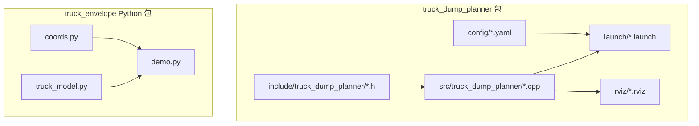
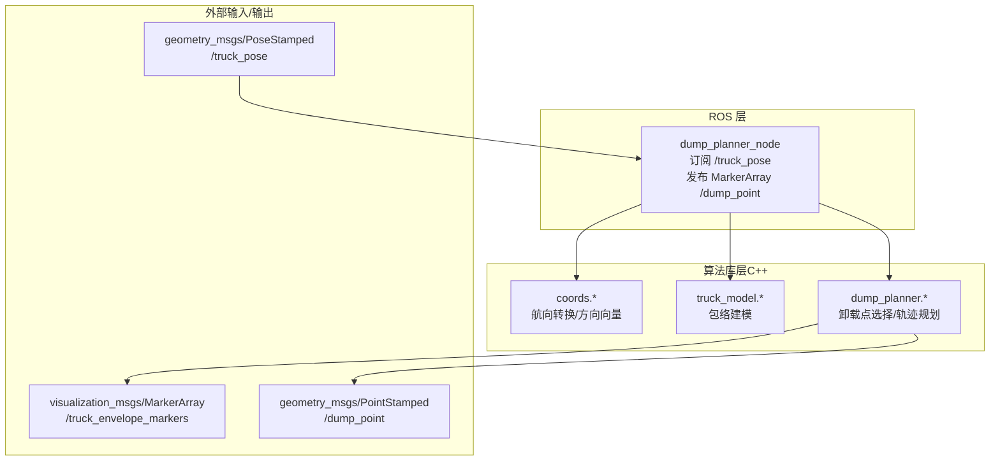
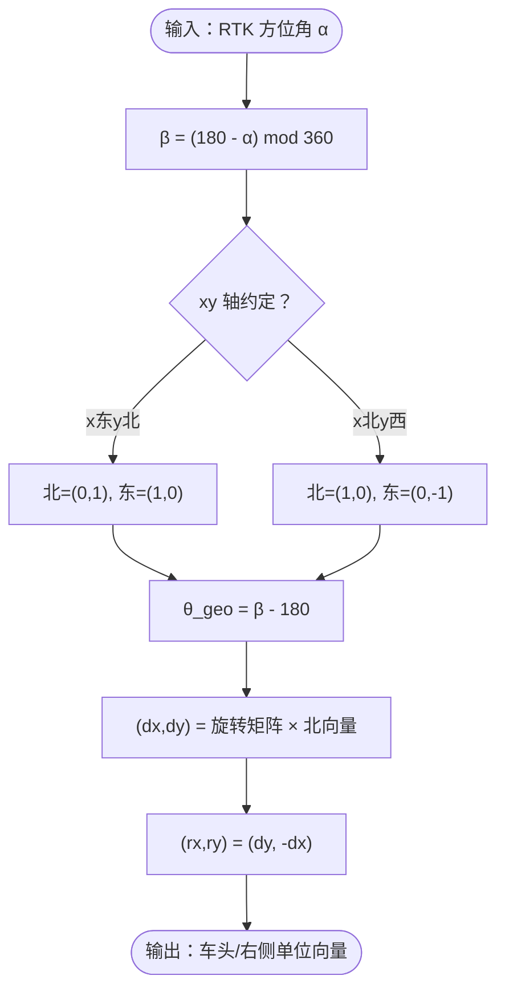
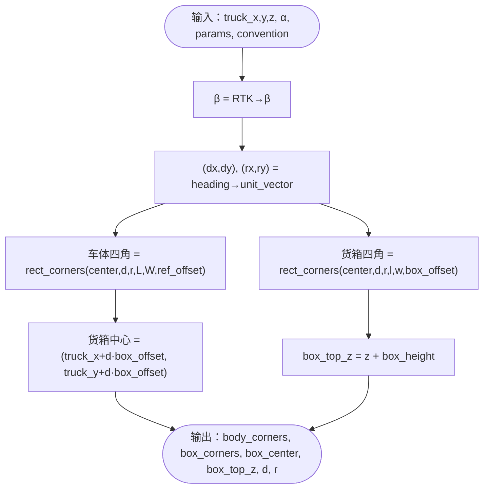
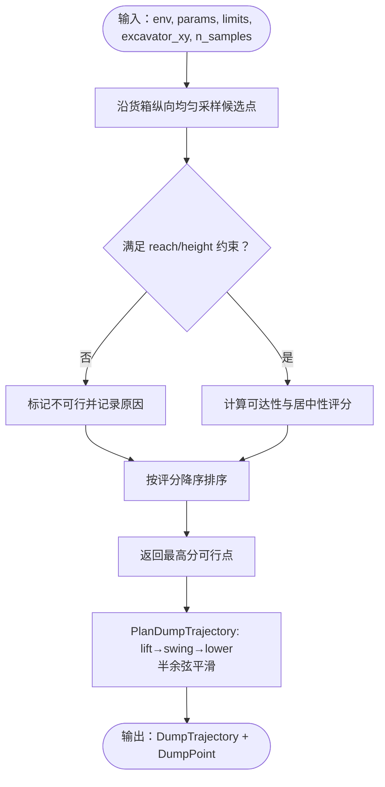
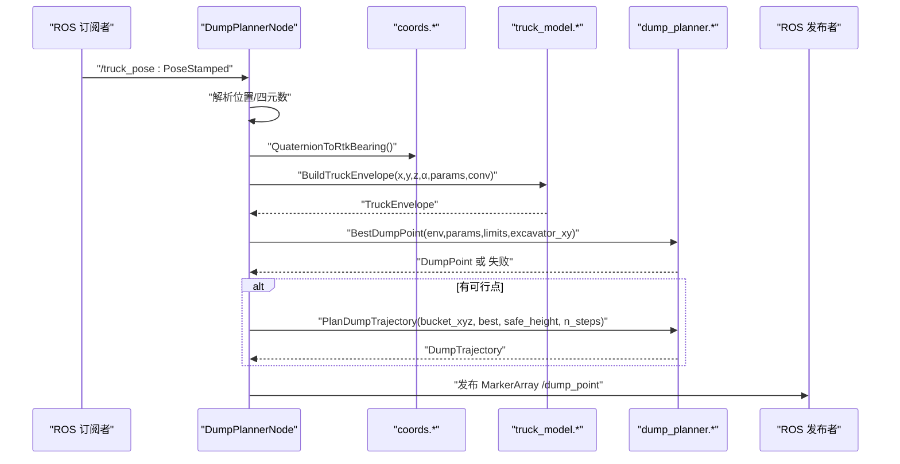
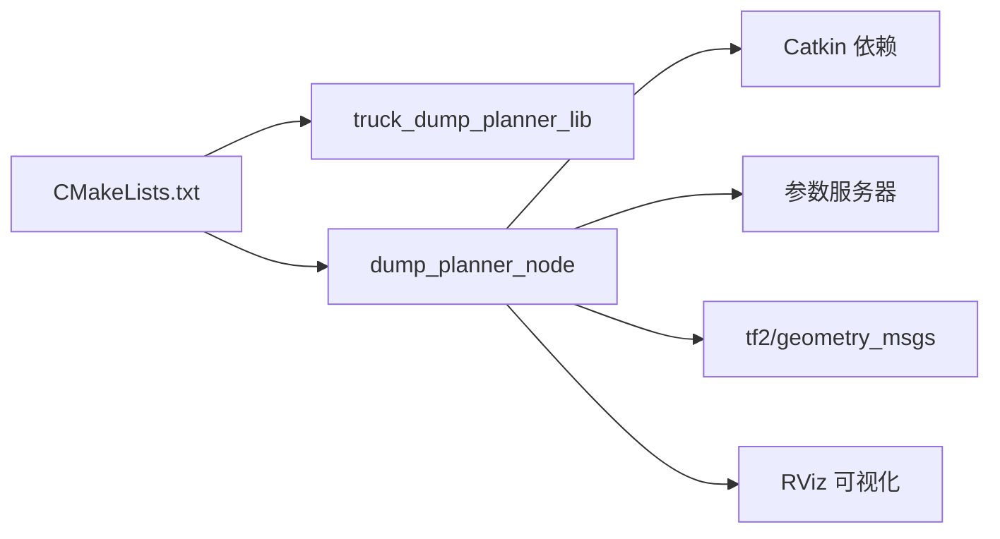

# 系统架构

<cite>
**本文引用的文件**
- [package.xml](file://src/truck_dump_planner/package.xml)
- [CMakeLists.txt](file://src/truck_dump_planner/CMakeLists.txt)
- [dump_planner.h](file://src/truck_dump_planner/include/truck_dump_planner/dump_planner.h)
- [dump_planner.cpp](file://src/truck_dump_planner/src/dump_planner.cpp)
- [dump_planner_node.cpp](file://src/truck_dump_planner/src/dump_planner_node.cpp)
- [coords.h](file://src/truck_dump_planner/include/truck_dump_planner/coords.h)
- [coords.cpp](file://src/truck_dump_planner/src/coords.cpp)
- [truck_model.h](file://src/truck_dump_planner/include/truck_dump_planner/truck_model.h)
- [truck_model.cpp](file://src/truck_dump_planner/src/truck_model.cpp)
- [dump_planner.launch](file://src/truck_dump_planner/launch/dump_planner.launch)
- [dump_planner.yaml](file://src/truck_dump_planner/config/dump_planner.yaml)
- [demo.py](file://src/demo.py)
- [coords.py](file://src/truck_envelope/coords.py)
- [truck_model.py](file://src/truck_envelope/truck_model.py)
</cite>

## 目录
1. [引言](#引言)
2. [项目结构](#项目结构)
3. [核心组件](#核心组件)
4. [架构总览](#架构总览)
5. [详细组件分析](#详细组件分析)
6. [依赖分析](#依赖分析)
7. [性能考虑](#性能考虑)
8. [故障排查指南](#故障排查指南)
9. [结论](#结论)
10. [附录](#附录)

## 引言
本系统面向无人挖掘机装车作业，提供从 RTK 卡车位姿输入到卸载轨迹输出的完整规划链路。系统采用“C++ 核心算法库 + ROS 节点”的分离架构，既保证核心算法的可移植性与可测试性，又通过 ROS 节点实现与外部系统的集成与可视化。核心模块包括：坐标转换系统（RTK 航向与挖掘机系航向互转、xy 轴地理朝向约定）、卡车包络建模（车体/货箱包络与多边形构建）、轨迹规划（三段式平滑轨迹与评分选择卸载点）。系统通过参数化配置与 Launch/RViz 集成，便于部署与验证。

## 项目结构
仓库采用 Catkin 工作空间组织，核心位于 truck_dump_planner 包，同时提供 Python 版本的 truck_envelope 模块用于演示与验证。关键目录与文件职责如下：
- include/truck_dump_planner：C++ 头文件（坐标、包络、规划接口）
- src/truck_dump_planner：C++ 实现（坐标、包络、规划、ROS 节点）
- launch：启动脚本（节点启动、测试位姿发布、RViz 加载）
- config：参数文件（卡车几何、工作范围、轨迹与采样等）
- rviz：RViz 配置文件
- src/truck_envelope：Python 包（坐标转换、包络建模、轨迹规划）
- src/demo.py：坐标转换与包络/轨迹演示脚本

**图表来源**
- [CMakeLists.txt:1-52](file://src/truck_dump_planner/CMakeLists.txt#L1-L52)
- [dump_planner.launch:1-26](file://src/truck_dump_planner/launch/dump_planner.launch#L1-L26)
- [dump_planner.yaml:1-43](file://src/truck_dump_planner/config/dump_planner.yaml#L1-L43)

**章节来源**
- [CMakeLists.txt:1-52](file://src/truck_dump_planner/CMakeLists.txt#L1-L52)
- [dump_planner.launch:1-26](file://src/truck_dump_planner/launch/dump_planner.launch#L1-L26)
- [dump_planner.yaml:1-43](file://src/truck_dump_planner/config/dump_planner.yaml#L1-L43)

## 核心组件
- 坐标转换系统：负责 RTK 方位角 α 与挖掘机系航向 β 的互转，并根据 xy 轴地理朝向约定（x 东 y 北 或 x 北 y 西）将 β 分解为车头方向单位向量（dx, dy）与右侧方向单位向量（rx, ry）。
- 卡车包络建模：基于 RTK 位姿与卡车几何参数，在挖掘机坐标系下构建车体与货箱的二维包络多边形，输出包络四角、货箱中心与顶面高度等信息。
- 轨迹规划与卸载点选择：在货箱顶面生成候选卸载点，依据可达半径与高度约束进行可行性筛选与评分，选择最优卸载点；随后规划三段式平滑轨迹（抬升 → 回转 → 降落）。
- ROS 节点：订阅 /truck_pose，调用上述模块完成包络/卸载点/轨迹计算，并发布 RViz 可视化 MarkerArray 与选定卸载点。

**章节来源**
- [coords.h:1-37](file://src/truck_dump_planner/include/truck_dump_planner/coords.h#L1-L37)
- [coords.cpp:1-52](file://src/truck_dump_planner/src/coords.cpp#L1-L52)
- [truck_model.h:1-60](file://src/truck_dump_planner/include/truck_dump_planner/truck_model.h#L1-L60)
- [truck_model.cpp:1-66](file://src/truck_dump_planner/src/truck_model.cpp#L1-L66)
- [dump_planner.h:1-66](file://src/truck_dump_planner/include/truck_dump_planner/dump_planner.h#L1-L66)
- [dump_planner.cpp:1-120](file://src/truck_dump_planner/src/dump_planner.cpp#L1-L120)
- [dump_planner_node.cpp:1-341](file://src/truck_dump_planner/src/dump_planner_node.cpp#L1-L341)

## 架构总览
系统采用“算法库 + ROS 节点”的分层架构：
- 算法库（C++）：独立于 ROS，提供坐标转换、包络建模、轨迹规划与卸载点选择的核心功能，便于单元测试与跨平台复用。
- ROS 节点：封装算法库，订阅 RTK 位姿，发布可视化与结果，负责参数加载、TF 解析与 RViz 可视化。
- Python 演示：truck_envelope 提供等价的 Python 接口，用于教学、验证与快速原型。

**图表来源**
- [dump_planner_node.cpp:1-341](file://src/truck_dump_planner/src/dump_planner_node.cpp#L1-L341)
- [dump_planner.cpp:1-120](file://src/truck_dump_planner/src/dump_planner.cpp#L1-L120)
- [truck_model.cpp:1-66](file://src/truck_dump_planner/src/truck_model.cpp#L1-L66)
- [coords.cpp:1-52](file://src/truck_dump_planner/src/coords.cpp#L1-L52)

## 详细组件分析

### 坐标转换系统
职责与接口：
- 角度归一化与航向互转：提供 Wrap360、RTK 航向与挖掘机系航向的双向转换函数。
- 方向向量分解：根据 xy 轴地理朝向约定（默认 ENU：x 东 y 北），将 β 分解为车头方向单位向量（dx, dy）与右侧方向单位向量（rx, ry）。
- 右侧向量计算：通过旋转变换得到右侧方向向量。

**图表来源**
- [coords.cpp:10-49](file://src/truck_dump_planner/src/coords.cpp#L10-L49)
- [coords.h:20-32](file://src/truck_dump_planner/include/truck_dump_planner/coords.h#L20-L32)

**章节来源**
- [coords.h:1-37](file://src/truck_dump_planner/include/truck_dump_planner/coords.h#L1-L37)
- [coords.cpp:1-52](file://src/truck_dump_planner/src/coords.cpp#L1-L52)

### 卡车包络建模
职责与接口：
- 输入：卡车参考点（x, y, z）、RTK 航向 α、卡车几何参数（长度、宽度、货箱尺寸与中心偏移）、xy 轴约定。
- 输出：车体与货箱包络四角、货箱中心、顶面高度、车头/右侧方向向量。
- 关键步骤：航向转换 → 方向向量分解 → 矩形四角计算 → 货箱中心与顶面高度。

**图表来源**
- [truck_model.cpp:22-46](file://src/truck_dump_planner/src/truck_model.cpp#L22-L46)
- [coords.cpp:18-49](file://src/truck_dump_planner/src/coords.cpp#L18-L49)

**章节来源**
- [truck_model.h:1-60](file://src/truck_dump_planner/include/truck_dump_planner/truck_model.h#L1-L60)
- [truck_model.cpp:1-66](file://src/truck_dump_planner/src/truck_model.cpp#L1-L66)

### 轨迹规划与卸载点选择
职责与接口：
- 卸载点选择：在货箱顶面沿纵向均匀采样候选点，按可达半径与高度约束筛选可行点，并综合可达性与居中性评分排序。
- 最优卸载点：返回评分最高的可行点；若无可行点则失败。
- 轨迹规划：三段式平滑轨迹（抬升 → 回转 → 降落），每段采用半余弦曲线避免速度突变，确保运动连续性。

**图表来源**
- [dump_planner.cpp:7-75](file://src/truck_dump_planner/src/dump_planner.cpp#L7-L75)
- [dump_planner.cpp:82-117](file://src/truck_dump_planner/src/dump_planner.cpp#L82-L117)

**章节来源**
- [dump_planner.h:1-66](file://src/truck_dump_planner/include/truck_dump_planner/dump_planner.h#L1-L66)
- [dump_planner.cpp:1-120](file://src/truck_dump_planner/src/dump_planner.cpp#L1-L120)

### ROS 节点与数据流
职责与接口：
- 订阅：/truck_pose（geometry_msgs/PoseStamped），包含位置（x, y, z）与四元数表示的 RTK 航向。
- 处理：Pose → RTK 航向 → 挖掘机系航向 → 包络 → 卸载点 → 轨迹。
- 发布：/truck_envelope_markers（可视化）、/dump_point（选定卸载点）。
- 参数：通过参数服务器加载卡车几何、工作范围、轨迹与采样等参数；支持坐标系约定与 RTK 航向约定。

**图表来源**
- [dump_planner_node.cpp:99-136](file://src/truck_dump_planner/src/dump_planner_node.cpp#L99-L136)
- [dump_planner.cpp:63-75](file://src/truck_dump_planner/src/dump_planner.cpp#L63-L75)
- [dump_planner.cpp:82-117](file://src/truck_dump_planner/src/dump_planner.cpp#L82-L117)
- [truck_model.cpp:22-46](file://src/truck_dump_planner/src/truck_model.cpp#L22-L46)
- [coords.cpp:87-97](file://src/truck_dump_planner/src/coords.cpp#L87-L97)

**章节来源**
- [dump_planner_node.cpp:1-341](file://src/truck_dump_planner/src/dump_planner_node.cpp#L1-L341)
- [dump_planner.launch:1-26](file://src/truck_dump_planner/launch/dump_planner.launch#L1-L26)
- [dump_planner.yaml:1-43](file://src/truck_dump_planner/config/dump_planner.yaml#L1-L43)

### Python 演示与验证
- 提供坐标转换与包络/轨迹的端到端演示，验证 RTK→β 转换、方向向量分解、包络构建与轨迹生成。
- 可选 matplotlib 输出示意图，便于教学与调试。

**章节来源**
- [demo.py:1-249](file://src/demo.py#L1-L249)
- [coords.py:1-200](file://src/truck_envelope/coords.py#L1-L200)
- [truck_model.py:1-200](file://src/truck_envelope/truck_model.py#L1-L200)

## 依赖分析
- 构建与依赖
  - CMake 目标：核心算法库（lib）与 ROS 节点（dump_planner_node），节点链接算法库与 catkin 依赖。
  - Catkin 依赖：roscpp、geometry_msgs、visualization_msgs、tf2、tf2_geometry_msgs。
- 运行时依赖
  - ROS 参数服务器：读取卡车几何、工作范围、轨迹与采样等参数。
  - TF2：四元数到欧拉角/航向的解析。
  - RViz：MarkerArray 可视化。

**图表来源**
- [CMakeLists.txt:11-22](file://src/truck_dump_planner/CMakeLists.txt#L11-L22)
- [package.xml:12-19](file://src/truck_dump_planner/package.xml#L12-L19)
- [dump_planner_node.cpp:10-23](file://src/truck_dump_planner/src/dump_planner_node.cpp#L10-L23)

**章节来源**
- [CMakeLists.txt:1-52](file://src/truck_dump_planner/CMakeLists.txt#L1-L52)
- [package.xml:1-20](file://src/truck_dump_planner/package.xml#L1-L20)

## 性能考虑
- 算法复杂度
  - 卸载点选择：采样数量 n_samples，排序 O(n log n)，整体 O(n) 评估 + O(n log n) 排序。
  - 轨迹规划：固定分段与步数，时间复杂度 O(n_steps)。
  - 包络建模：矩形四角计算为常数时间。
- 参数优化
  - n_samples 控制候选点密度与计算开销的平衡。
  - n_steps 决定轨迹离散精度与可视化细节。
  - safe_height 需高于实际障碍物与机械结构，避免反复重算。
- 可视化成本
  - MarkerArray 的发布频率与点数影响 RViz 渲染性能，建议按需降低刷新频率或减少点数。

[本节为通用性能讨论，不直接分析具体文件]

## 故障排查指南
- 无可行卸载点
  - 检查 RTK 位姿是否在挖掘机工作范围内；确认 reach_min/max 与 dump_height_max/min 设置合理。
  - 检查坐标系约定（axis_convention）与 RTK 航向约定（bearing_convention）是否匹配。
- 轨迹不连续或抖动
  - 检查 safe_height 是否过高导致 lift 段过长；调整 n_steps 以提升平滑度。
- 可视化异常
  - 确认 frame_id 与 RViz 坐标系一致；检查 MarkerArray 的 scale 与颜色设置。
- 参数加载问题
  - 确认参数服务器键名与 dump_planner.yaml 一致；检查 Launch 文件 remap 是否正确。

**章节来源**
- [dump_planner_node.cpp:42-84](file://src/truck_dump_planner/src/dump_planner_node.cpp#L42-L84)
- [dump_planner_node.cpp:119-135](file://src/truck_dump_planner/src/dump_planner_node.cpp#L119-L135)
- [dump_planner.launch:1-26](file://src/truck_dump_planner/launch/dump_planner.launch#L1-L26)
- [dump_planner.yaml:1-43](file://src/truck_dump_planner/config/dump_planner.yaml#L1-L43)

## 结论
本系统通过清晰的模块划分与参数化设计，实现了从 RTK 位姿到卸载轨迹的完整链路。C++ 核心算法库具备良好的可移植性与可测试性，ROS 节点负责与外部系统集成与可视化。Python 演示模块进一步增强了可理解性与验证能力。通过合理的坐标转换约定、包络建模与轨迹规划策略，系统在工程实践中具备较高的实用性与扩展性。

[本节为总结性内容，不直接分析具体文件]

## 附录
- 启动与验证
  - 使用 launch 文件启动节点、发布测试位姿与 RViz；参数通过 yaml 文件集中管理。
- Python 对照实现
  - Python 版本提供等价接口，便于教学与快速验证。

**章节来源**
- [dump_planner.launch:1-26](file://src/truck_dump_planner/launch/dump_planner.launch#L1-L26)
- [dump_planner.yaml:1-43](file://src/truck_dump_planner/config/dump_planner.yaml#L1-L43)
- [demo.py:1-249](file://src/demo.py#L1-L249)