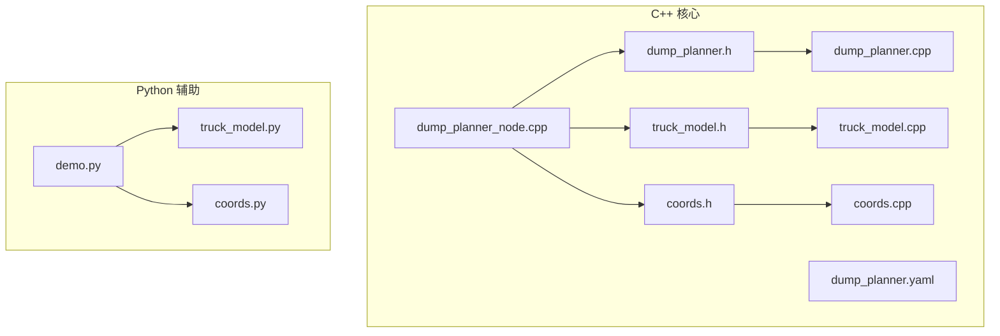
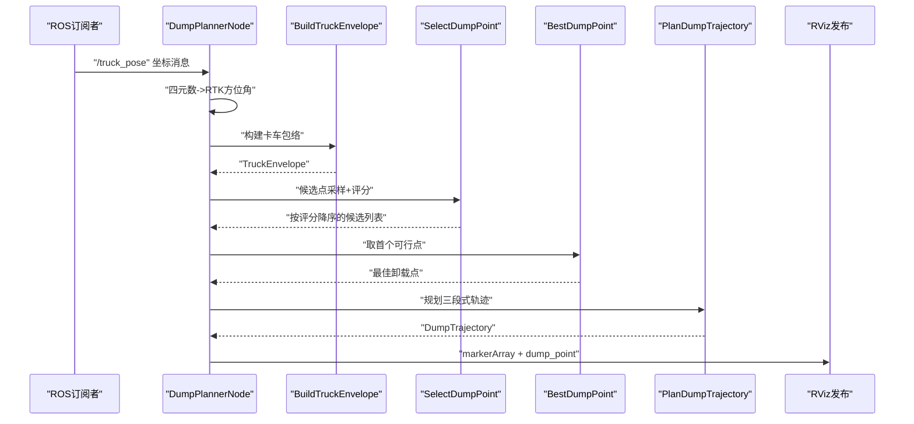
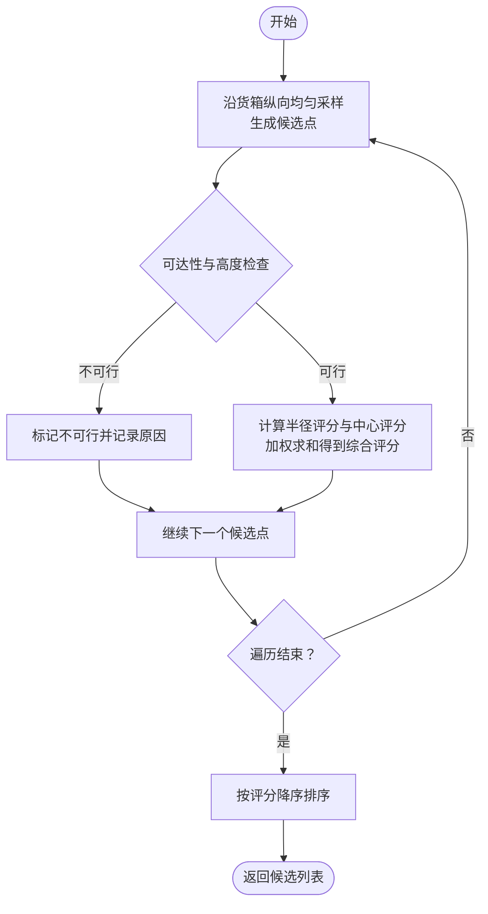
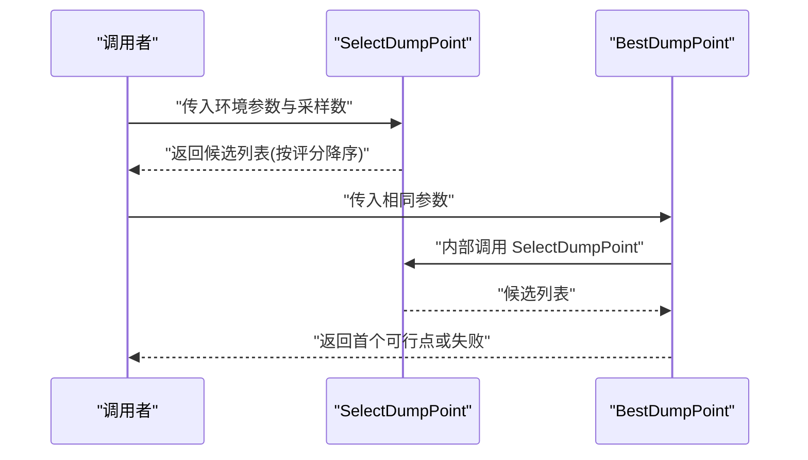
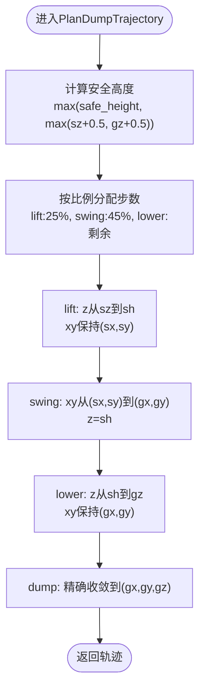
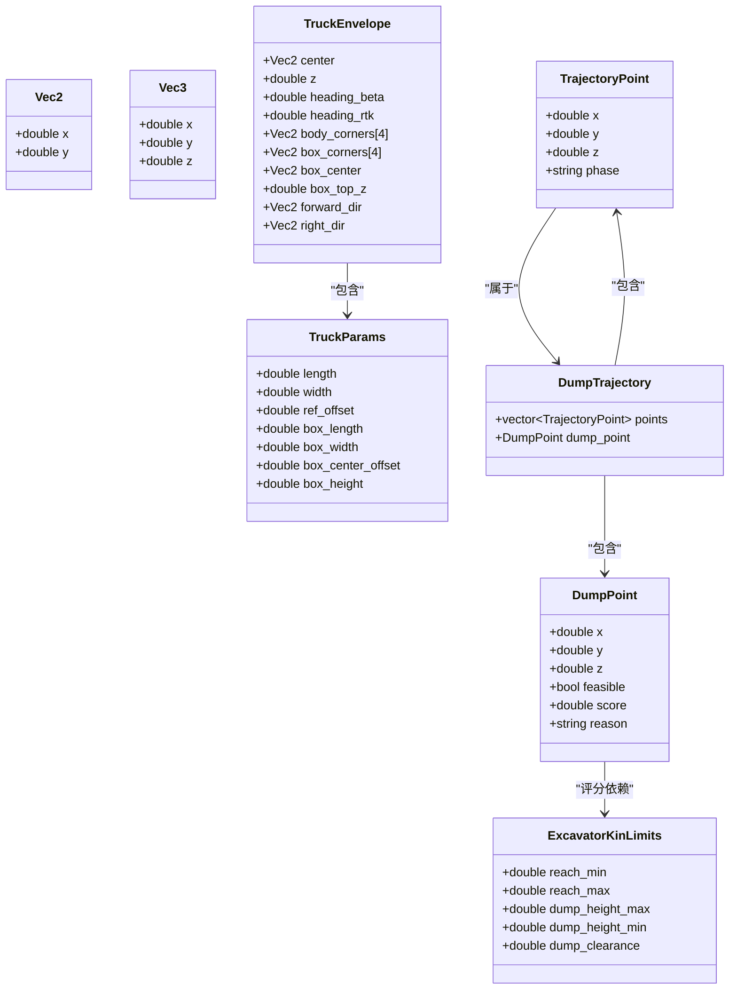
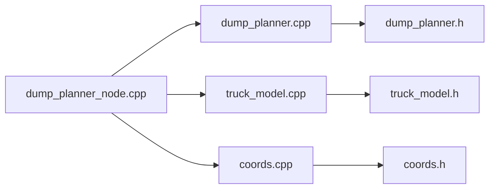

# 轨迹规划核心算法

<cite>
**本文档引用的文件**
- [dump_planner.h](file://src/truck_dump_planner/include/truck_dump_planner/dump_planner.h)
- [dump_planner.cpp](file://src/truck_dump_planner/src/dump_planner.cpp)
- [truck_model.h](file://src/truck_dump_planner/include/truck_dump_planner/truck_model.h)
- [truck_model.cpp](file://src/truck_dump_planner/src/truck_model.cpp)
- [coords.h](file://src/truck_dump_planner/include/truck_dump_planner/coords.h)
- [coords.cpp](file://src/truck_dump_planner/src/coords.cpp)
- [dump_planner_node.cpp](file://src/truck_dump_planner/src/dump_planner_node.cpp)
- [dump_planner.yaml](file://src/truck_dump_planner/config/dump_planner.yaml)
- [demo.py](file://src/demo.py)
- [truck_model.py](file://src/truck_envelope/truck_model.py)
- [coords.py](file://src/truck_envelope/coords.py)
</cite>

## 目录
1. [引言](#引言)
2. [项目结构](#项目结构)
3. [核心组件](#核心组件)
4. [架构概览](#架构概览)
5. [详细组件分析](#详细组件分析)
6. [依赖关系分析](#依赖关系分析)
7. [性能考量](#性能考量)
8. [故障排查指南](#故障排查指南)
9. [结论](#结论)
10. [附录](#附录)

## 引言
本技术文档围绕三段式轨迹规划算法展开，系统阐述卸载点选择策略、评分机制与可行性检查逻辑，以及三段式轨迹 lift/swing/lower/dump的运动学分析与平滑函数应用。文档同时提供轨迹生成示例、参数调优建议、质量评估方法与性能优化技巧，帮助读者在实际工程中高效部署与调试。

## 项目结构
该项目采用模块化组织，核心算法位于 C++ 实现的 truck_dump_planner 包中，配套 Python 版本用于演示与验证。主要目录与文件如下：
- include/truck_dump_planner：公共头文件，定义数据结构与接口
- src：核心实现与ROS节点
- config：参数配置文件
- rviz：可视化配置
- launch：启动脚本
- truck_envelope：Python辅助库，提供坐标系与包络计算的演示实现

图表来源
- [dump_planner.h:1-66](file://src/truck_dump_planner/include/truck_dump_planner/dump_planner.h#L1-L66)
- [dump_planner.cpp:1-120](file://src/truck_dump_planner/src/dump_planner.cpp#L1-L120)
- [dump_planner_node.cpp:1-341](file://src/truck_dump_planner/src/dump_planner_node.cpp#L1-L341)
- [dump_planner.yaml:1-43](file://src/truck_dump_planner/config/dump_planner.yaml#L1-L43)
- [demo.py:1-249](file://src/demo.py#L1-L249)
- [truck_model.py:1-200](file://src/truck_envelope/truck_model.py#L1-L200)
- [coords.py:1-200](file://src/truck_envelope/coords.py#L1-L200)

章节来源
- [dump_planner.h:1-66](file://src/truck_dump_planner/include/truck_dump_planner/dump_planner.h#L1-L66)
- [dump_planner.cpp:1-120](file://src/truck_dump_planner/src/dump_planner.cpp#L1-L120)
- [dump_planner_node.cpp:1-341](file://src/truck_dump_planner/src/dump_planner_node.cpp#L1-L341)
- [dump_planner.yaml:1-43](file://src/truck_dump_planner/config/dump_planner.yaml#L1-L43)
- [demo.py:1-249](file://src/demo.py#L1-L249)
- [truck_model.py:1-200](file://src/truck_envelope/truck_model.py#L1-L200)
- [coords.py:1-200](file://src/truck_envelope/coords.py#L1-L200)

## 核心组件
本节概述三段式轨迹规划的核心数据结构与接口，便于快速定位实现细节。

- 数据结构
  - 卸载点候选与评分：包含三维坐标、可行性标记、评分与原因
  - 轨迹点：包含三维坐标与阶段标识（lift/swing/lower/dump）
  - 卸载轨迹：包含轨迹点序列与选定卸载点
  - 卡车参数与包络：包含几何尺寸、方向向量、货箱顶面高度等
  - 挖掘机工作范围约束：最小/最大卸载半径、最大/最小卸载高度、铲斗底门与货箱间隙

- 接口函数
  - 卸载点选择：沿货箱纵向均匀采样，进行可达性与高度检查，计算评分并排序
  - 最佳卸载点：返回评分最高的可行卸载点
  - 轨迹规划：三段式 lift/swing/lower/dump，每段使用半余弦平滑函数

章节来源
- [dump_planner.h:10-62](file://src/truck_dump_planner/include/truck_dump_planner/dump_planner.h#L10-L62)
- [dump_planner.cpp:7-117](file://src/truck_dump_planner/src/dump_planner.cpp#L7-L117)

## 架构概览
下图展示从ROS回调到轨迹输出的整体流程，涵盖坐标系转换、包络构建、卸载点选择与轨迹规划。

图表来源
- [dump_planner_node.cpp:99-136](file://src/truck_dump_planner/src/dump_planner_node.cpp#L99-L136)
- [dump_planner.cpp:7-117](file://src/truck_dump_planner/src/dump_planner.cpp#L7-L117)
- [truck_model.cpp:22-46](file://src/truck_dump_planner/src/truck_model.cpp#L22-L46)

## 详细组件分析

### 卸载点选择算法
- 候选点采样策略
  - 沿货箱纵向从后端到前端均匀采样，确保覆盖货箱顶面区域
  - 采样数量由参数控制，支持调整密度与计算开销的平衡
- 可行性检查逻辑
  - 基于挖掘机回转中心与候选点的距离，检查是否在最小/最大卸载半径范围内
  - 检查卸载高度（货箱顶面+间隙）是否在允许范围内
  - 不可行点标注原因，便于调试与可视化
- 评分机制设计
  - 卸载半径评分：距离越接近最大半径边界，得分越高，鼓励靠近边界但仍在范围内的点
  - 中心偏向评分：沿纵向越靠近货箱中心，得分越高，提升稳定性与卸载效率
  - 权重分配：半径权重0.7，中心权重0.3，综合评分越大越优
- 排序与返回
  - 按评分降序排列，便于后续直接取最优可行点

图表来源
- [dump_planner.cpp:11-61](file://src/truck_dump_planner/src/dump_planner.cpp#L11-L61)

章节来源
- [dump_planner.cpp:7-61](file://src/truck_dump_planner/src/dump_planner.cpp#L7-L61)

### BestDumpPoint 与 SelectDumpPoint 函数工作原理
- SelectDumpPoint
  - 输入：卡车包络、卡车参数、挖掘机工作范围约束、挖掘机回转中心坐标、采样数量
  - 输出：按评分降序排列的候选卸载点列表
  - 关键步骤：采样、可达性与高度检查、评分计算、排序
- BestDumpPoint
  - 输入：与 SelectDumpPoint 相同
  - 输出：首个可行的卸载点，若无可行点返回失败
  - 适用场景：快速获取当前最优可行卸载点，简化调用链

图表来源
- [dump_planner.cpp:7-75](file://src/truck_dump_planner/src/dump_planner.cpp#L7-L75)

章节来源
- [dump_planner.cpp:7-75](file://src/truck_dump_planner/src/dump_planner.cpp#L7-L75)

### PlanDumpTrajectory 函数实现
- 三段式轨迹规划
  - lift：z轴从起点抬升至安全高度，保持xy不变
  - swing：在安全高度上进行xy二维插值，z保持安全高度
  - lower：z轴从安全高度下放至卸载高度，保持xy不变
  - dump：末点精确收敛到卸载点
- 步数分配
  - lift: 25%
  - swing: 45%
  - lower: 剩余步数
- 平滑函数
  - 使用半余弦平滑函数，确保速度连续、加速度有限，避免速度突变
  - 每段独立插值，保证轨迹连续性与安全性
- 安全高度
  - 安全高度需高于起点z与卸载点z，同时考虑一定的安全余量

图表来源
- [dump_planner.cpp:82-117](file://src/truck_dump_planner/src/dump_planner.cpp#L82-L117)

章节来源
- [dump_planner.cpp:82-117](file://src/truck_dump_planner/src/dump_planner.cpp#L82-L117)

### 坐标系与包络构建
- 坐标系约定
  - 挖掘机系航向角 β：正北=180°，正东=90°，正南=0°，正西=270°，逆时针增大
  - RTK方位角 α：正北=0°，正东=90°，正南=180°，正西=270°，顺时针增大
  - 转换关系：β = (180 - α) mod 360
- 方向向量分解
  - 将航向角 β 分解为车头方向单位向量 (dx, dy) 与右侧方向单位向量 (rx, ry)
  - 支持两种xy轴地理朝向约定：x东y北(ENU)与x北y西(NW)
- 包络构建
  - 以卡车参考点为中心，按车体与货箱尺寸与纵向偏移计算四角
  - 生成车体与货箱包络多边形，用于卸载点合法性检查与可视化

图表来源
- [dump_planner.h:10-40](file://src/truck_dump_planner/include/truck_dump_planner/dump_planner.h#L10-L40)
- [truck_model.h:21-44](file://src/truck_dump_planner/include/truck_dump_planner/truck_model.h#L21-L44)
- [coords.h:6-32](file://src/truck_dump_planner/include/truck_dump_planner/coords.h#L6-L32)

章节来源
- [coords.h:6-32](file://src/truck_dump_planner/include/truck_dump_planner/coords.h#L6-L32)
- [coords.cpp:6-49](file://src/truck_dump_planner/src/coords.cpp#L6-L49)
- [truck_model.h:21-44](file://src/truck_dump_planner/include/truck_dump_planner/truck_model.h#L21-L44)
- [truck_model.cpp:22-46](file://src/truck_dump_planner/src/truck_model.cpp#L22-L46)

### ROS节点与可视化
- 节点职责
  - 订阅 /truck_pose，解析四元数得到RTK方位角，转换为挖掘机系航向角
  - 构建卡车包络，选择卸载点，规划轨迹
  - 发布 markerArray（车体/货箱/卸载点/轨迹）与 dump_point
- 参数加载
  - 从参数服务器读取卡车几何、挖掘机工作范围、铲斗初始位置、轨迹与卸载参数
  - 支持坐标系约定与航向角约定配置
- 可视化
  - 车体包络（灰色线框）、货箱包络（橙色填充）、车头箭头、货箱中心、挖掘机回转中心
  - 卸载点（绿色球体）、轨迹线（蓝色线）与轨迹点（白色点）

章节来源
- [dump_planner_node.cpp:25-136](file://src/truck_dump_planner/src/dump_planner_node.cpp#L25-L136)
- [dump_planner_node.cpp:211-313](file://src/truck_dump_planner/src/dump_planner_node.cpp#L211-L313)

## 依赖关系分析
- 内部依赖
  - dump_planner_node 依赖 dump_planner.h 与 truck_model.h/coords.h
  - dump_planner.cpp 依赖 dump_planner.h 与数学库
  - truck_model.cpp 依赖 coords.h 与数学库
- 外部依赖
  - ROS：geometry_msgs、visualization_msgs、tf2
  - Python演示依赖 matplotlib（可选）

图表来源
- [dump_planner_node.cpp:19-21](file://src/truck_dump_planner/src/dump_planner_node.cpp#L19-L21)
- [dump_planner.cpp:1-1](file://src/truck_dump_planner/src/dump_planner.cpp#L1-L1)
- [truck_model.cpp:1-2](file://src/truck_dump_planner/src/truck_model.cpp#L1-L2)
- [coords.cpp:1-1](file://src/truck_dump_planner/src/coords.cpp#L1-L1)

章节来源
- [dump_planner_node.cpp:19-21](file://src/truck_dump_planner/src/dump_planner_node.cpp#L19-L21)
- [dump_planner.cpp:1-1](file://src/truck_dump_planner/src/dump_planner.cpp#L1-L1)
- [truck_model.cpp:1-2](file://src/truck_dump_planner/src/truck_model.cpp#L1-L2)
- [coords.cpp:1-1](file://src/truck_dump_planner/src/coords.cpp#L1-L1)

## 性能考量
- 计算复杂度
  - 卸载点选择：O(n)，n为采样数量，主要瓶颈在距离计算与评分
  - 轨迹规划：O(n_steps)，线性增长，受步数影响显著
- 优化建议
  - 采样数量：在精度与性能间折衷，可通过参数调节
  - 步数分配：根据任务需求调整lift/swing/lower比例，平衡时间与平滑度
  - 安全高度：适当提高可减少碰撞风险，但会增加轨迹长度
  - 评分权重：在复杂工况下可微调半径与中心权重，提升鲁棒性

## 故障排查指南
- 无可行卸载点
  - 检查挖掘机工作范围参数是否过严
  - 确认卡车位置与姿态是否导致所有候选点超出半径或高度范围
  - 查看候选点的reason字段，定位具体约束
- 轨迹抖动或不连续
  - 检查安全高度设置是否过低
  - 增大步数或调整步数分配比例
- 可视化异常
  - 确认坐标系约定与航向角约定参数一致
  - 检查frame_id与marker发布频率

章节来源
- [dump_planner.cpp:33-45](file://src/truck_dump_planner/src/dump_planner.cpp#L33-L45)
- [dump_planner_node.cpp:127-135](file://src/truck_dump_planner/src/dump_planner_node.cpp#L127-L135)

## 结论
本项目实现了完整的三段式轨迹规划流程：从包络构建、卸载点选择与评分，到轨迹规划与可视化。通过半余弦平滑与合理的参数配置，能够在保证安全性的前提下实现高效、平滑的卸载轨迹。建议在实际部署中结合现场工况对参数进行微调，并利用可视化工具进行验证与优化。

## 附录

### 轨迹生成示例与参数调优
- 示例场景
  - 卡车在挖掘机系下位置：(4.0, 8.0, 0.0)，RTK方位角60°
  - 卸载点选择：沿货箱纵向采样9点，半径权重0.7，中心权重0.3
  - 轨迹规划：安全高度6.0，步数40，lift/swing/lower比例约25%/45%/30%
- 参数调优建议
  - 安全高度：建议不低于铲斗起点z与卸载点z+0.5，避免碰撞
  - 步数：在实时性与轨迹平滑度之间平衡，建议≥30
  - 采样数量：在精度与计算开销间折衷，建议≥7
  - 评分权重：半径权重0.7，中心权重0.3为默认合理值，可根据工况微调

章节来源
- [demo.py:93-149](file://src/demo.py#L93-L149)
- [dump_planner.yaml:31-37](file://src/truck_dump_planner/config/dump_planner.yaml#L31-L37)

### 轨迹质量评估方法
- 几何指标
  - 轨迹连续性：检查lift/swing/lower连接处的z与xy连续性
  - 安全余量：对比安全高度与障碍物/货箱高度
- 运动学指标
  - 速度与加速度：通过相邻轨迹点差分近似，评估平滑度
  - 卸载半径：检查轨迹全程是否在允许范围内
- 可视化验证
  - 使用RViz观察轨迹与包络关系，确认无碰撞与过度弯曲

### 性能优化技巧
- 预计算与缓存
  - 将常用三角函数与常量预计算，减少重复计算
- 数值稳定
  - 在评分与距离计算中加入极小值，避免除零与数值不稳定
- 参数化
  - 将关键参数暴露为可配置项，便于离线调参与在线微调