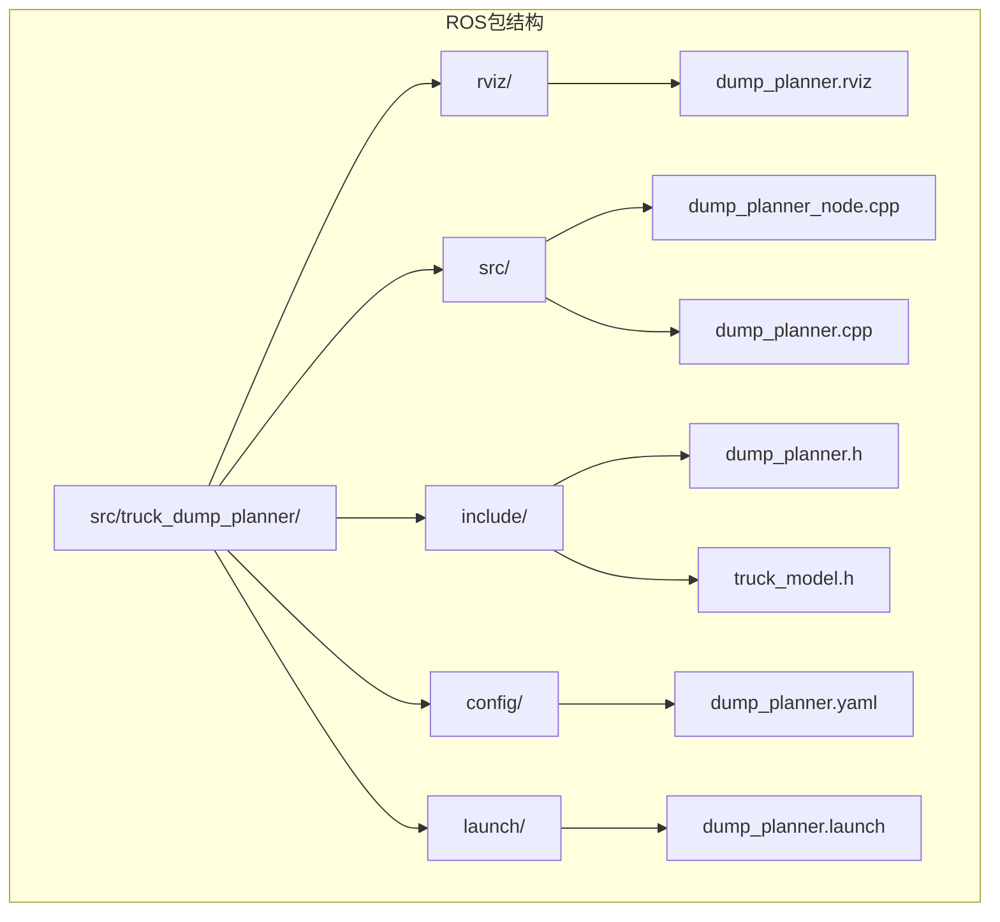
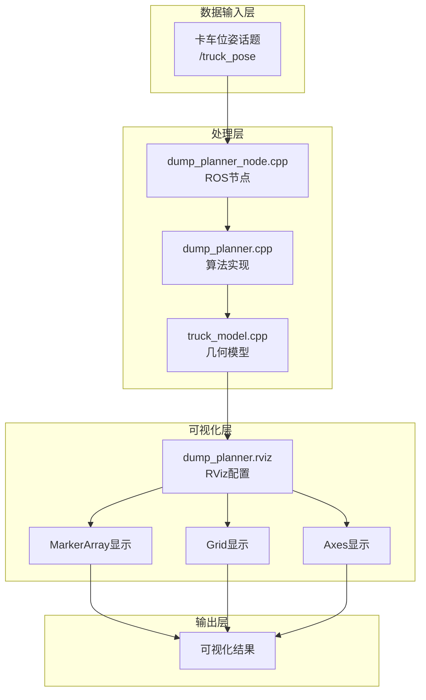
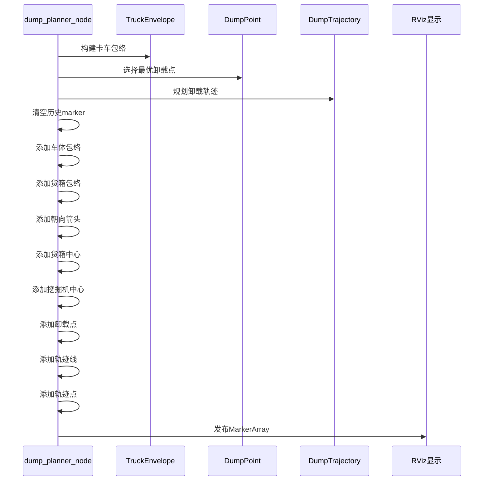
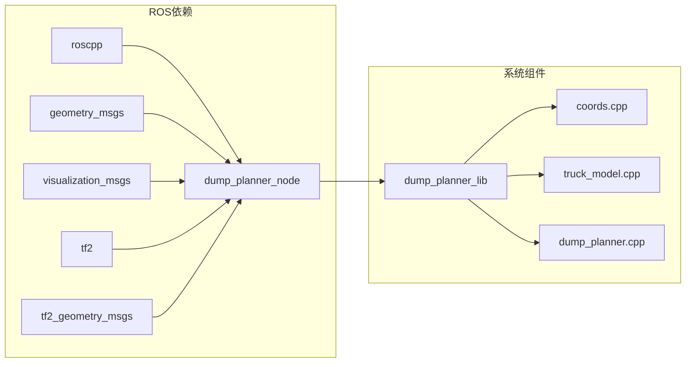

# RViz可视化配置

<cite>
**本文档引用的文件**
- [dump_planner.rviz](file://src/truck_dump_planner/rviz/dump_planner.rviz)
- [dump_planner_node.cpp](file://src/truck_dump_planner/src/dump_planner_node.cpp)
- [dump_planner.h](file://src/truck_dump_planner/include/truck_dump_planner/dump_planner.h)
- [dump_planner.yaml](file://src/truck_dump_planner/config/dump_planner.yaml)
- [dump_planner.launch](file://src/truck_dump_planner/launch/dump_planner.launch)
- [truck_model.h](file://src/truck_dump_planner/include/truck_dump_planner/truck_model.h)
- [CMakeLists.txt](file://src/truck_dump_planner/CMakeLists.txt)
- [package.xml](file://src/truck_dump_planner/package.xml)
</cite>

## 目录
1. [简介](#简介)
2. [项目结构](#项目结构)
3. [核心组件](#核心组件)
4. [架构概览](#架构概览)
5. [详细组件分析](#详细组件分析)
6. [依赖关系分析](#依赖关系分析)
7. [性能考虑](#性能考虑)
8. [故障排除指南](#故障排除指南)
9. [结论](#结论)
10. [附录](#附录)

## 简介

本文件详细说明了无人挖掘机装车轨迹规划系统中的RViz可视化配置。该系统通过dump_planner.rviz配置文件实现了对卡车包络、卸载点和轨迹路径的实时可视化展示。配置文件支持网格显示、坐标轴显示、MarkerArray可视化等核心功能，并提供了丰富的自定义选项。

系统采用ROS框架，通过dump_planner_node节点处理卡车位姿数据，计算包络和轨迹，并以MarkerArray消息的形式发布到RViz进行可视化展示。配置文件涵盖了面板布局、主题样式、显示选项等各个方面。

## 项目结构

该项目采用标准的ROS包结构，主要包含以下关键目录和文件：

**图表来源**
- [dump_planner.rviz:1-131](file://src/truck_dump_planner/rviz/dump_planner.rviz#L1-L131)
- [dump_planner_node.cpp:1-341](file://src/truck_dump_planner/src/dump_planner_node.cpp#L1-L341)

**章节来源**
- [CMakeLists.txt:1-52](file://src/truck_dump_planner/CMakeLists.txt#L1-L52)
- [package.xml:1-20](file://src/truck_dump_planner/package.xml#L1-L20)

## 核心组件

### RViz配置文件结构

dump_planner.rviz配置文件采用YAML格式，包含以下主要部分：

1. **面板配置**：控制显示面板的布局和状态
2. **工具配置**：定义可用的交互工具
3. **视图配置**：设置默认相机视角和参数
4. **可视化管理器**：配置全局显示选项和主题样式

### 主要显示元素

系统配置了三个核心显示元素：

1. **网格显示(Grid)**：提供地面参考平面
2. **坐标轴显示(Axes)**：显示坐标系原点和方向
3. **MarkerArray显示**：实时展示卡车包络、卸载点和轨迹

**章节来源**
- [dump_planner.rviz:56-90](file://src/truck_dump_planner/rviz/dump_planner.rviz#L56-L90)

## 架构概览

系统采用分层架构设计，实现了数据处理与可视化展示的分离：

**图表来源**
- [dump_planner_node.cpp:25-39](file://src/truck_dump_planner/src/dump_planner_node.cpp#L25-L39)
- [dump_planner.rviz:82-89](file://src/truck_dump_planner/rviz/dump_planner.rviz#L82-L89)

## 详细组件分析

### RViz配置文件详解

#### 面板布局配置

配置文件中的Panel部分控制着RViz界面的布局：

- **Displays面板**：主显示区域，包含所有可视化元素
- **Selection面板**：对象选择功能
- **Tool Properties面板**：工具属性配置
- **Views面板**：视图管理
- **Time面板**：时间同步设置

#### 主题样式设置

全局样式配置包括：

- **背景颜色**：深灰色(48, 48, 48)，提供良好的对比度
- **默认光照**：启用真实光照效果
- **固定帧**：设置为excavator坐标系
- **帧率**：30 FPS

#### 显示选项配置

每个显示元素都有特定的配置参数：

**网格显示(Grid)**
- 透明度：0.5
- 网格大小：1米
- 颜色：灰色(160, 160, 164)
- 线宽：0.03
- 平面：XY平面
- 网格单元：30x30

**坐标轴显示(Axes)**
- 长度：2米
- 半径：0.1米
- 参考帧：excavator

**MarkerArray显示**
- 主题：/truck_envelope_markers
- 队列大小：100
- 启用命名空间过滤

**章节来源**
- [dump_planner.rviz:56-90](file://src/truck_dump_planner/rviz/dump_planner.rviz#L56-L90)

### 可视化元素生成逻辑

#### MarkerArray消息结构

dump_planner_node.cpp实现了完整的MarkerArray消息生成逻辑：

**图表来源**
- [dump_planner_node.cpp:211-313](file://src/truck_dump_planner/src/dump_planner_node.cpp#L211-L313)

#### 标记类型和颜色方案

系统使用多种标记类型来表示不同的可视化内容：

**线条标记(LINE_STRIP)**
- 车体包络：灰色(0.6, 0.6, 0.6, 1.0)，线宽0.08
- 货箱包络：橙色(1.0, 0.5, 0.0, 1.0)，线宽0.1

**箭头标记(ARROW)**
- 卡车朝向：黄色(1.0, 1.0, 0.0, 1.0)，长度2.0

**球体标记(SPHERE)**
- 货箱中心：红色(1.0, 0.0, 0.0, 1.0)，半径0.25
- 挖掘机中心：黑色(0.0, 0.0, 0.0, 1.0)，半径0.4
- 卸载点：绿色(0.0, 1.0, 0.0, 1.0)，半径0.35

**轨迹标记**
- 轨迹线：蓝色(0.0, 0.5, 1.0, 1.0)，线宽0.06
- 轨迹点：白色(1.0, 1.0, 1.0, 0.8)，点大小0.08

**文本标记(TEXT_VIEW_FACING)**
- 卸载点标注：白色，垂直于观察者

**章节来源**
- [dump_planner_node.cpp:222-310](file://src/truck_dump_planner/src/dump_planner_node.cpp#L222-L310)

### 参数配置系统

#### YAML参数文件

dump_planner.yaml提供了完整的参数配置：

**卡车几何参数**
- 长度：8.5米
- 宽度：3.0米
- 货箱尺寸：5.0×2.6米
- 货箱高度：1.8米

**挖掘机工作范围**
- 最小/最大卸载半径：5.0-12.0米
- 最小/最大卸载高度：1.0-7.5米
- 安全距离：0.8米

**轨迹规划参数**
- 安全高度：6.0米
- 轨迹离散点数：40个
- 卸载点采样数：9个

**坐标系约定**
- 坐标系ID：excavator
- 地理朝向：east_north
- 航向约定：rep105_enu

**章节来源**
- [dump_planner.yaml:4-43](file://src/truck_dump_planner/config/dump_planner.yaml#L4-L43)

### 启动配置

#### Launch文件结构

dump_planner.launch提供了完整的系统启动配置：

- **测试模式**：可选的静态卡车位姿发布
- **RViz集成**：自动加载预设配置
- **参数传递**：从YAML文件加载配置参数

**章节来源**
- [dump_planner.launch:1-26](file://src/truck_dump_planner/launch/dump_planner.launch#L1-L26)

## 依赖关系分析

### ROS包依赖

系统依赖以下核心ROS包：

**图表来源**
- [package.xml:14-18](file://src/truck_dump_planner/package.xml#L14-L18)
- [CMakeLists.txt:11-17](file://src/truck_dump_planner/CMakeLists.txt#L11-L17)

### 内部模块依赖

系统内部模块间存在清晰的依赖关系：

- **dump_planner_node**依赖于**dump_planner库**
- **dump_planner库**包含**coords、truck_model、dump_planner**三个核心模块
- **truck_model**模块提供几何计算基础
- **dump_planner**模块实现轨迹规划算法

**章节来源**
- [CMakeLists.txt:30-35](file://src/truck_dump_planner/CMakeLists.txt#L30-L35)

## 性能考虑

### 实时性能优化

1. **队列管理**：MarkerArray队列大小设置为100，平衡内存使用和实时性
2. **帧率控制**：固定30 FPS，确保稳定的可视化更新
3. **删除策略**：每次发布前先发送DELETEALL命令清理历史标记
4. **颜色透明度**：合理设置透明度以提高视觉层次感

### 内存优化建议

1. **减少标记数量**：仅发布必要的可视化元素
2. **优化轨迹点密度**：根据需要调整n_steps参数
3. **合理使用命名空间**：利用命名空间进行选择性显示
4. **禁用不必要的显示**：在复杂场景中关闭不相关的显示元素

### 显示质量调优

1. **网格密度**：根据场景规模调整网格单元数量
2. **标记尺寸**：根据距离调整标记大小
3. **颜色对比度**：确保不同元素间的颜色对比度足够
4. **透明度设置**：合理使用透明度实现层次显示

## 故障排除指南

### 常见问题诊断

#### 无数据显示

**可能原因**：
- 话题未正确发布
- 坐标系不匹配
- 参数配置错误

**解决步骤**：
1. 检查话题发布状态：`rostopic echo /truck_pose`
2. 验证坐标系：`rosrun tf view_frames`
3. 确认参数加载：`rosparam get /dump_planner_node`

#### 显示异常

**可能原因**：
- MarkerArray格式错误
- 命名空间冲突
- 颜色配置问题

**解决步骤**：
1. 检查MarkerArray消息格式
2. 验证命名空间设置
3. 调整颜色和透明度参数

#### 性能问题

**可能原因**：
- 队列过长
- 帧率过高
- 标记过于复杂

**解决步骤**：
1. 调整队列大小
2. 降低帧率
3. 简化标记复杂度

### 调试技巧

1. **使用RQT**：通过RQT的topic monitor监控消息流量
2. **日志输出**：利用ROS_INFO/ROS_WARN查看运行状态
3. **参数动态调整**：使用dynamic_reconfigure实时调整参数
4. **可视化验证**：通过不同颜色区分不同类型的标记

**章节来源**
- [dump_planner_node.cpp:127-135](file://src/truck_dump_planner/src/dump_planner_node.cpp#L127-L135)

## 结论

本RViz可视化配置文件成功实现了无人挖掘机装车轨迹规划系统的完整可视化展示。通过精心设计的配置参数和合理的颜色方案，系统能够清晰地展示卡车包络、卸载点和轨迹路径等关键信息。

配置文件的主要优势包括：
- **模块化设计**：清晰的显示元素分类和命名
- **参数化配置**：通过YAML文件集中管理参数
- **性能优化**：合理的队列管理和帧率控制
- **可扩展性**：支持自定义显示样式和新元素添加

该配置为类似工业机器人轨迹规划项目的可视化提供了优秀的参考模板。

## 附录

### 自定义配置指南

#### 添加新的可视化元素

1. **在RViz中添加显示**：通过Displays面板添加新的显示类型
2. **配置参数**：设置相应的参数和样式
3. **在代码中实现**：在dump_planner_node.cpp中添加对应的Marker生成逻辑
4. **测试验证**：确认新元素正常显示

#### 修改显示样式

1. **颜色调整**：修改RGB值和透明度
2. **尺寸优化**：调整线宽、点半径等参数
3. **命名空间管理**：合理组织命名空间以支持选择性显示
4. **性能调优**：根据实际需求调整显示密度

#### 调试可视化

1. **启用调试模式**：在launch文件中添加调试参数
2. **使用辅助标记**：添加临时标记帮助定位问题
3. **监控消息流量**：使用rostopic工具监控相关话题
4. **日志分析**：通过ROS日志了解系统运行状态