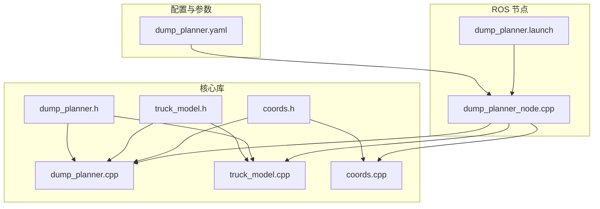
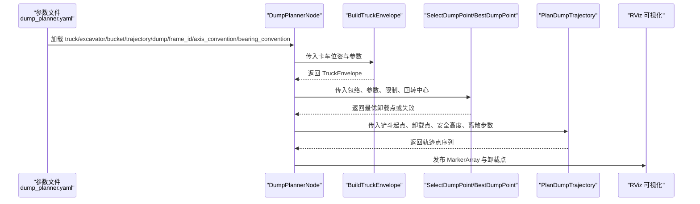
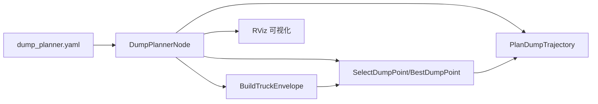
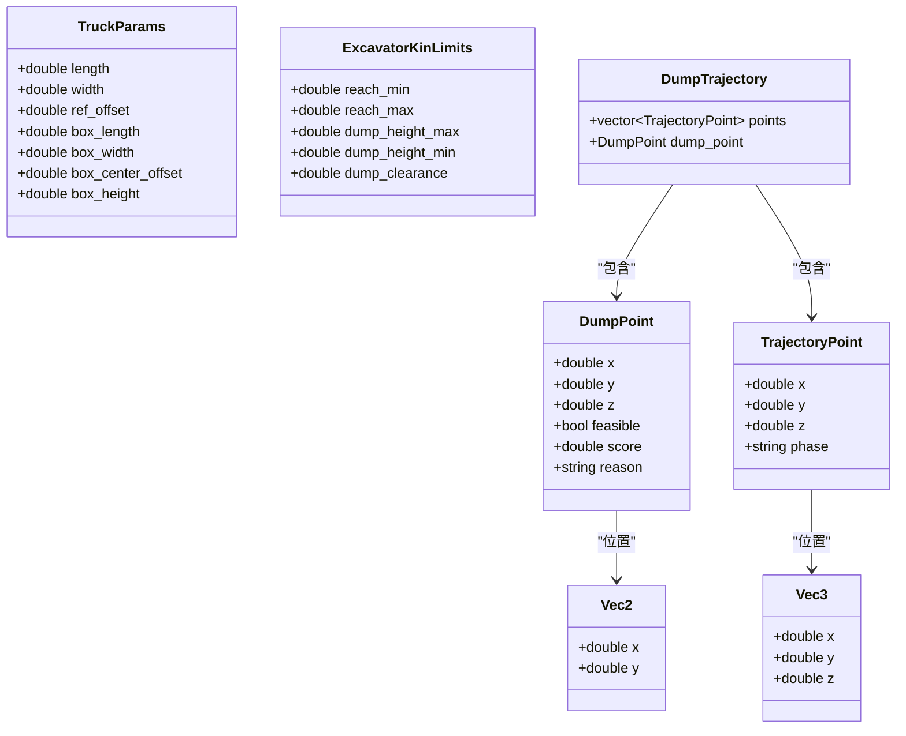

# 参数配置

<cite>
**本文引用的文件**
- [dump_planner.yaml](file://src/truck_dump_planner/config/dump_planner.yaml)
- [dump_planner.h](file://src/truck_dump_planner/include/truck_dump_planner/dump_planner.h)
- [truck_model.h](file://src/truck_dump_planner/include/truck_dump_planner/truck_model.h)
- [dump_planner.cpp](file://src/truck_dump_planner/src/dump_planner.cpp)
- [truck_model.cpp](file://src/truck_dump_planner/src/truck_model.cpp)
- [coords.h](file://src/truck_dump_planner/include/truck_dump_planner/coords.h)
- [coords.cpp](file://src/truck_dump_planner/src/coords.cpp)
- [dump_planner_node.cpp](file://src/truck_dump_planner/src/dump_planner_node.cpp)
- [dump_planner.launch](file://src/truck_dump_planner/launch/dump_planner.launch)
- [package.xml](file://src/truck_dump_planner/package.xml)
- [CMakeLists.txt](file://src/truck_dump_planner/CMakeLists.txt)
</cite>

## 目录
1. [简介](#简介)
2. [项目结构](#项目结构)
3. [核心组件](#核心组件)
4. [架构概览](#架构概览)
5. [详细参数说明](#详细参数说明)
6. [依赖关系分析](#依赖关系分析)
7. [性能考量](#性能考量)
8. [故障排查指南](#故障排查指南)
9. [结论](#结论)
10. [附录](#附录)

## 简介
本文件面向无人挖掘机装车轨迹规划系统的使用者与维护者，系统性梳理并解释 dump_planner.yaml 中的全部参数，包括卡车几何参数、挖掘机工作范围参数、铲斗当前位置参数以及轨迹规划参数。文档同时给出参数取值范围、推荐设置、调优策略、对系统行为的影响分析与最佳实践建议，并通过图示展示关键数据流与控制流程。

## 项目结构
该仓库包含一个独立的 ROS 包 truck_dump_planner，核心由以下部分组成：
- 配置文件：dump_planner.yaml
- 头文件：dump_planner.h、truck_model.h、coords.h
- 实现文件：dump_planner.cpp、truck_model.cpp、coords.cpp、dump_planner_node.cpp
- 启动与可视化：launch 文件、RViz 配置
- 构建脚本：CMakeLists.txt
- 包信息：package.xml

图表来源
- [dump_planner.yaml](file://src/truck_dump_planner/config/dump_planner.yaml)
- [dump_planner.h](file://src/truck_dump_planner/include/truck_dump_planner/dump_planner.h)
- [truck_model.h](file://src/truck_dump_planner/include/truck_dump_planner/truck_model.h)
- [coords.h](file://src/truck_dump_planner/include/truck_dump_planner/coords.h)
- [dump_planner.cpp](file://src/truck_dump_planner/src/dump_planner.cpp)
- [truck_model.cpp](file://src/truck_dump_planner/src/truck_model.cpp)
- [coords.cpp](file://src/truck_dump_planner/src/coords.cpp)
- [dump_planner_node.cpp](file://src/truck_dump_planner/src/dump_planner_node.cpp)
- [dump_planner.launch](file://src/truck_dump_planner/launch/dump_planner.launch)

章节来源
- [package.xml](file://src/truck_dump_planner/package.xml)
- [CMakeLists.txt](file://src/truck_dump_planner/CMakeLists.txt)

## 核心组件
- 参数加载与解析：节点从私有命名空间读取参数并进行类型转换与默认值处理。
- 几何建模：基于卡车几何参数与 RTK 航向，构建卡车包络（车体与货箱四角、货箱中心、顶面高度）。
- 卸载点选择：在货箱顶面生成候选点，依据可达性与评分函数筛选最优卸载点。
- 轨迹规划：将铲斗从当前位置抬升至安全高度，在安全高度上进行 XY 插值，再下降至卸载高度，采用半余弦平滑过渡。

章节来源
- [dump_planner_node.cpp](file://src/truck_dump_planner/src/dump_planner_node.cpp)
- [dump_planner.h](file://src/truck_dump_planner/include/truck_dump_planner/dump_planner.h)
- [truck_model.h](file://src/truck_dump_planner/include/truck_dump_planner/truck_model.h)
- [dump_planner.cpp](file://src/truck_dump_planner/src/dump_planner.cpp)
- [truck_model.cpp](file://src/truck_dump_planner/src/truck_model.cpp)

## 架构概览
下图展示了从参数加载到轨迹可视化的端到端流程，标注了各模块之间的数据传递与依赖关系。

图表来源
- [dump_planner.yaml](file://src/truck_dump_planner/config/dump_planner.yaml)
- [dump_planner_node.cpp](file://src/truck_dump_planner/src/dump_planner_node.cpp)
- [dump_planner.cpp](file://src/truck_dump_planner/src/dump_planner.cpp)
- [truck_model.cpp](file://src/truck_dump_planner/src/truck_model.cpp)

## 详细参数说明

### 一、卡车几何参数（单位：米）
这些参数定义卡车与货箱的几何尺寸与相对位置，用于构建卡车包络。

- truck/length：卡车总长（沿车头方向）。影响车体包络尺寸与货箱中心位置计算。
- truck/width：卡车总宽（垂直于车头方向）。影响车体包络宽度与货箱包络宽度。
- truck/ref_offset：车体几何中心相对参考点的纵向偏移（正为偏前）。用于确定包络中心与货箱中心的相对位置。
- truck/box_length：货箱长。决定卸载点在货箱纵向上的采样范围。
- truck/box_width：货箱宽。决定卸载点在货箱横向上的采样范围。
- truck/box_center_offset：货箱中心相对参考点的纵向偏移（通常为负，表示偏车尾）。与 ref_offset 共同决定货箱中心在挖掘机坐标系中的位置。
- truck/box_height：货箱侧壁高度。决定货箱顶面高度，进而影响卸载高度上限与间隙要求。

参数取值范围与建议
- length、width、box_length、box_width、box_height：均应为正数，典型值可参考配置文件中的默认值。
- ref_offset、box_center_offset：可为正可为负，具体取决于参考点与几何中心的相对位置关系。
- 建议：确保 box_height 显著大于铲斗底门厚度与 dump_clearance，以保证卸载过程不发生碰撞。

章节来源
- [dump_planner.yaml](file://src/truck_dump_planner/config/dump_planner.yaml)
- [truck_model.h](file://src/truck_dump_planner/include/truck_dump_planner/truck_model.h)
- [truck_model.cpp](file://src/truck_dump_planner/src/truck_model.cpp)

### 二、挖掘机工作范围参数（单位：米/度）
这些参数描述挖掘机的运动学约束，决定卸载点的可达性与安全性。

- excavator/x、excavator/y：挖掘机回转中心在挖掘机坐标系中的位置。用于计算铲斗到卸载点的距离。
- excavator/reach_min、excavator/reach_max：最小/最大卸载半径。决定卸载点的可达范围。
- excavator/dump_height_max、excavator/dump_height_min：最大/最小卸载高度。决定卸载点的高度范围。
- excavator/dump_clearance：铲斗底门距货箱顶面的间隙。用于计算卸载高度 z_dump = 货箱顶面高度 + 间隙。

参数取值范围与建议
- reach_min、reach_max：应满足 reach_min ≥ 0 且 reach_min ≤ reach_max；通常根据设备说明书设定。
- dump_height_min、dump_height_max：应满足 dump_height_min ≤ dump_height_max；需考虑设备最大提升高度与货箱顶面高度。
- dump_clearance：应为正值，确保卸载时铲斗底门不与货箱顶面接触。
- 建议：将 dump_height_max 设置为略小于设备最大提升高度，留出安全余量；dump_height_min 一般不小于地面以上一定高度。

章节来源
- [dump_planner.yaml](file://src/truck_dump_planner/config/dump_planner.yaml)
- [dump_planner.h](file://src/truck_dump_planner/include/truck_dump_planner/dump_planner.h)
- [dump_planner.cpp](file://src/truck_dump_planner/src/dump_planner.cpp)

### 三、铲斗当前位置参数（单位：米）
这些参数定义轨迹规划起点，即铲斗在挖掘机坐标系中的初始位置。

- bucket/x、bucket/y、bucket/z：铲斗当前位置在挖掘机坐标系中的三维坐标。用于轨迹规划的起点插值与安全高度比较。

参数取值范围与建议
- 建议：bucket_xyz 应处于设备允许的工作范围内；若起点过低，safe_height 将自动提升以满足安全要求。
- 若起点与卸载点距离过大，可能触发 reach_max 超限导致无可行卸载点。

章节来源
- [dump_planner.yaml](file://src/truck_dump_planner/config/dump_planner.yaml)
- [dump_planner_node.cpp](file://src/truck_dump_planner/src/dump_planner_node.cpp)
- [dump_planner.cpp](file://src/truck_dump_planner/src/dump_planner.cpp)

### 四、轨迹规划参数
这些参数控制轨迹的分段与离散化程度，影响轨迹平滑性与计算效率。

- trajectory/safe_height：回转安全高度。必须高于起点与卸载点的 z 值，避免与驾驶室或货箱顶面发生干涉。
- trajectory/n_steps：轨迹离散点数。影响轨迹平滑度与可视化细节；数值越大轨迹越平滑但计算开销增加。
- dump/n_samples：沿货箱纵向的卸载点采样数量。影响卸载点搜索的覆盖度与评分精度。

参数取值范围与建议
- safe_height：应显著高于 bucket/z 与 dump_height_max + dump_clearance，建议留有足够余量。
- n_steps：建议在 30–60 之间，兼顾平滑度与实时性；过小会导致轨迹不连续，过大可能影响实时性。
- n_samples：建议在 7–11 之间，既能覆盖货箱纵向主要区域，又不会过度增加计算负担。

章节来源
- [dump_planner.yaml](file://src/truck_dump_planner/config/dump_planner.yaml)
- [dump_planner.cpp](file://src/truck_dump_planner/src/dump_planner.cpp)
- [dump_planner_node.cpp](file://src/truck_dump_planner/src/dump_planner_node.cpp)

### 五、坐标系与方位约定
这些参数用于正确解析卡车姿态与地理坐标系约定。

- frame_id：发布 MarkerArray 的坐标系名称（如 excavator）。
- axis_convention：xy 轴地理朝向约定，支持 east_north（x=东，y=北）与 north_west（x=北，y=西）。
- bearing_convention：方位角约定，支持 rep105_enu（α=90−yaw）与 yaw_is_bearing（α=yaw）。

参数取值范围与建议
- frame_id：通常使用 excavator 或实际场景中的固定坐标系名称。
- axis_convention：根据项目统一约定选择一种，保持一致性。
- bearing_convention：与发送方姿态消息的约定一致，否则会引入航向角转换误差。

章节来源
- [dump_planner.yaml](file://src/truck_dump_planner/config/dump_planner.yaml)
- [dump_planner_node.cpp](file://src/truck_dump_planner/src/dump_planner_node.cpp)
- [coords.h](file://src/truck_dump_planner/include/truck_dump_planner/coords.h)
- [coords.cpp](file://src/truck_dump_planner/src/coords.cpp)

## 依赖关系分析
参数在运行时的依赖关系如下：
- 参数文件 dump_planner.yaml 提供默认值与命名空间键名。
- DumpPlannerNode 从私有命名空间读取参数并进行类型转换与默认值处理。
- BuildTruckEnvelope 使用卡车几何参数与 RTK 航向生成包络。
- SelectDumpPoint/BestDumpPoint 使用包络、几何参数、工作范围限制与回转中心计算卸载点。
- PlanDumpTrajectory 使用卸载点、铲斗起点、安全高度与离散步数生成轨迹。
- RViz 可视化接收包络、卸载点与轨迹并发布 MarkerArray。

图表来源
- [dump_planner.yaml](file://src/truck_dump_planner/config/dump_planner.yaml)
- [dump_planner_node.cpp](file://src/truck_dump_planner/src/dump_planner_node.cpp)
- [dump_planner.cpp](file://src/truck_dump_planner/src/dump_planner.cpp)
- [truck_model.cpp](file://src/truck_dump_planner/src/truck_model.cpp)

章节来源
- [dump_planner_node.cpp](file://src/truck_dump_planner/src/dump_planner_node.cpp)
- [dump_planner.cpp](file://src/truck_dump_planner/src/dump_planner.cpp)
- [truck_model.cpp](file://src/truck_dump_planner/src/truck_model.cpp)

## 性能考量
- n_steps 与 n_samples 的权衡：较大的 n_steps 与 n_samples 会增加轨迹点数量与卸载点评分计算次数，影响实时性。建议在仿真阶段充分测试后再部署到实车。
- safe_height 的设置：过高的 safe_height 会增加提升与回转时间，过低则可能触发安全警告。建议结合设备动态特性与作业环境综合评估。
- dump_clearance：过小可能导致卸载碰撞风险，过大则降低装载效率。建议通过试挖与仿真校准。
- 坐标系约定：错误的 axis_convention 或 bearing_convention 会导致包络与卸载点计算偏差，应与系统其他模块保持一致。

## 故障排查指南
常见问题与定位方法：
- 无可行卸载点
  - 现象：日志提示无可行卸载点。
  - 可能原因：reach 超限（过近或过远）、高度超限（过高或过低）、dump_clearance 过大导致 z_dump 超限。
  - 排查步骤：检查 excavator/reach_min/reach_max、excavator/dump_height_min/max、truck/box_height、excavator/dump_clearance。
- 轨迹不连续或抖动
  - 现象：轨迹在 lift/swing/lower 分段处出现跳变。
  - 可能原因：n_steps 设置过小或分段比例不合理。
  - 排查步骤：适当增大 n_steps，并确认 lift/swing/lower 的分段比例（约 0.25/0.45/0.3）。
- 安全高度不足
  - 现象：轨迹规划失败或安全警告。
  - 可能原因：safe_height 过低或 bucket/z 过高。
  - 排查步骤：提高 safe_height，确保其高于起点与卸载点的 z 值。
- 坐标系不一致
  - 现象：包络与卸载点位置明显偏离预期。
  - 可能原因：axis_convention 或 bearing_convention 与实际约定不一致。
  - 排查步骤：核对 dump_planner.yaml 中的约定，并与姿态消息发送方保持一致。

章节来源
- [dump_planner_node.cpp](file://src/truck_dump_planner/src/dump_planner_node.cpp)
- [dump_planner.cpp](file://src/truck_dump_planner/src/dump_planner.cpp)

## 结论
dump_planner.yaml 中的参数共同决定了卡车包络的几何建模、卸载点的可达性与评分、以及轨迹规划的平滑性与安全性。合理设置这些参数是实现稳定、高效、安全装车轨迹规划的关键。建议在仿真环境中充分验证参数组合，再逐步迁移到实车测试，并结合实际工况持续优化。

## 附录

### A. 参数调优流程与推荐值
- 初始设置：以配置文件默认值为基础，结合设备规格与现场环境进行微调。
- 卡车几何参数：优先校准 truck/box_height 与 dump_clearance，确保卸载安全；随后调整 truck/length、width、box_length、box_width 以匹配实际车辆。
- 工作范围参数：先设定 excavator/reach_min/reach_max，再根据设备最大提升高度设定 dump_height_min/max；最后调整 dump_clearance。
- 铲斗起点：确保 bucket_xyz 位于设备允许范围内；若起点过低，适当提高 safe_height。
- 轨迹参数：从 n_steps=40、n_samples=9 开始，逐步调整以平衡平滑度与实时性。
- 坐标系约定：统一 axis_convention 与 bearing_convention，避免航向角转换误差。

### B. 关键数据结构与复杂度
- 卸载点选择：对 n_samples 个候选点进行可达性检查与评分，整体复杂度 O(n_samples)。
- 轨迹规划：按 lift/swing/lower 三段分段插值，每段点数与 n_steps 成正比，整体复杂度 O(n_steps)。

图表来源
- [dump_planner.h](file://src/truck_dump_planner/include/truck_dump_planner/dump_planner.h)
- [truck_model.h](file://src/truck_dump_planner/include/truck_dump_planner/truck_model.h)