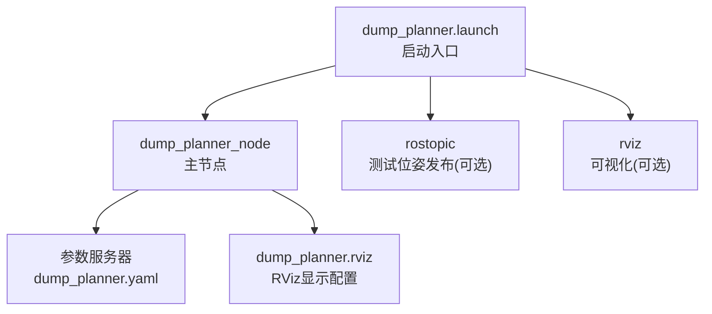
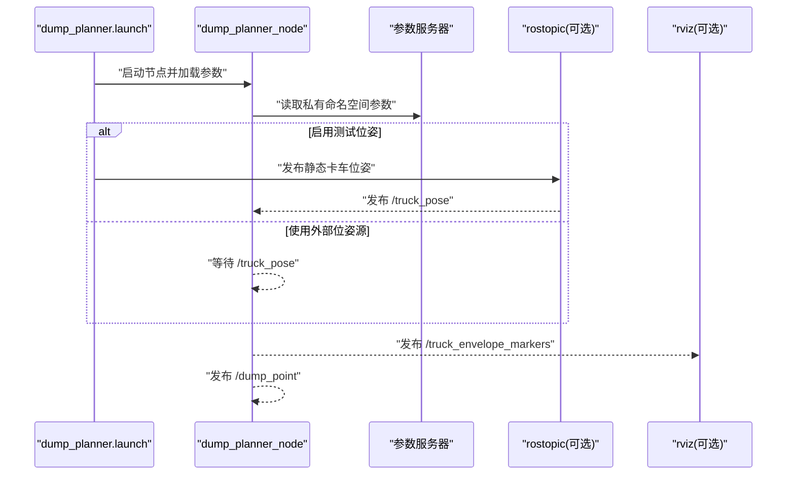
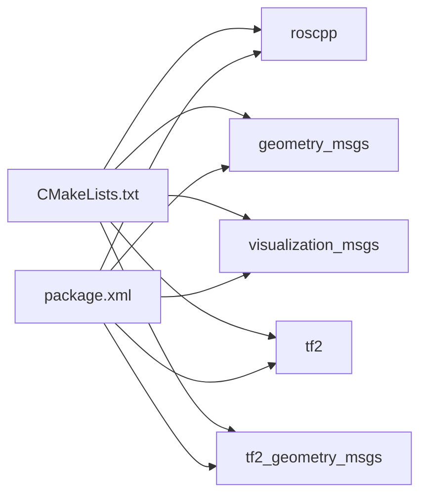

# 启动配置

<cite>
**本文引用的文件**
- [dump_planner.launch](file://src/truck_dump_planner/launch/dump_planner.launch)
- [dump_planner.yaml](file://src/truck_dump_planner/config/dump_planner.yaml)
- [dump_planner_node.cpp](file://src/truck_dump_planner/src/dump_planner_node.cpp)
- [dump_planner.rviz](file://src/truck_dump_planner/rviz/dump_planner.rviz)
- [CMakeLists.txt](file://src/truck_dump_planner/CMakeLists.txt)
- [package.xml](file://src/truck_dump_planner/package.xml)
</cite>

## 目录
1. [简介](#简介)
2. [项目结构](#项目结构)
3. [核心组件](#核心组件)
4. [架构概览](#架构概览)
5. [详细组件分析](#详细组件分析)
6. [依赖关系分析](#依赖关系分析)
7. [性能考虑](#性能考虑)
8. [故障排查指南](#故障排查指南)
9. [结论](#结论)
10. [附录](#附录)

## 简介
本文件面向ROS用户，系统性说明装车轨迹规划启动配置，重点围绕 dump_planner.launch 文件展开，涵盖：
- 启动参数与默认值
- 参数服务器配置与节点内参数加载机制
- 运行时参数覆盖与动态修改方法
- 启动命令示例与参数传递
- 启动顺序控制、节点间通信配置与故障恢复建议
- 与其他ROS组件（RViz、话题发布器）的集成方式

## 项目结构
该仓库采用标准Catkin工作区布局，truck_dump_planner包包含启动文件、参数文件、RViz配置、核心算法与节点实现。dump_planner.launch 是主要入口，负责组织节点启动、参数加载与可选组件（测试位姿发布、RViz）的启用。

图表来源
- [dump_planner.launch:1-26](file://src/truck_dump_planner/launch/dump_planner.launch#L1-L26)
- [dump_planner_node.cpp:333-341](file://src/truck_dump_planner/src/dump_planner_node.cpp#L333-L341)
- [dump_planner.yaml:1-43](file://src/truck_dump_planner/config/dump_planner.yaml#L1-L43)
- [dump_planner.rviz:1-131](file://src/truck_dump_planner/rviz/dump_planner.rviz#L1-L131)

章节来源
- [dump_planner.launch:1-26](file://src/truck_dump_planner/launch/dump_planner.launch#L1-L26)
- [dump_planner.yaml:1-43](file://src/truck_dump_planner/config/dump_planner.yaml#L1-L43)
- [dump_planner.rviz:1-131](file://src/truck_dump_planner/rviz/dump_planner.rviz#L1-L131)

## 核心组件
- dump_planner_node：订阅卡车位姿，计算包络、卸载点与轨迹，并发布RViz可视化MarkerArray与选定卸载点。
- dump_planner.yaml：集中存放节点私有命名空间下的所有参数，便于统一管理与覆盖。
- dump_planner.rviz：RViz显示配置，订阅 /truck_envelope_markers 并设置固定坐标系等。
- rostopic（可选）：在测试模式下发布静态卡车位姿，便于验证流程。
- dump_planner.launch：通过arg定义开关，控制是否启动测试位姿发布与RViz；通过rosparam加载参数；通过remap映射输入话题。

章节来源
- [dump_planner_node.cpp:25-84](file://src/truck_dump_planner/src/dump_planner_node.cpp#L25-L84)
- [dump_planner.yaml:1-43](file://src/truck_dump_planner/config/dump_planner.yaml#L1-L43)
- [dump_planner.rviz:82-89](file://src/truck_dump_planner/rviz/dump_planner.rviz#L82-L89)
- [dump_planner.launch:4-25](file://src/truck_dump_planner/launch/dump_planner.launch#L4-L25)

## 架构概览
启动流程自 dump_planner.launch 开始，按条件启动各子组件，并通过参数服务器完成配置注入。节点内部以私有命名空间读取参数，处理输入位姿后发布结果。

图表来源
- [dump_planner.launch:8-25](file://src/truck_dump_planner/launch/dump_planner.launch#L8-L25)
- [dump_planner_node.cpp:333-341](file://src/truck_dump_planner/src/dump_planner_node.cpp#L333-L341)

## 详细组件分析

### 启动文件参数与行为
- 启动参数（arg）
  - test：默认开启，启用静态测试位姿发布节点；关闭时由外部位姿源驱动。
  - rviz：默认开启，启动RViz并加载预设配置。
- 节点与组件
  - dump_planner_node：加载参数文件，订阅 /truck_pose，发布可视化与卸载点。
  - rostopic（测试位姿）：在测试模式下以固定频率发布静态位姿。
  - rviz：订阅 /truck_envelope_markers 并渲染。
- remap映射
  - 将节点内部输入名 truck_pose 映射到 /truck_pose，便于与外部位姿源对接。

章节来源
- [dump_planner.launch:4-25](file://src/truck_dump_planner/launch/dump_planner.launch#L4-L25)

### 参数服务器与节点内参数加载
- 参数来源
  - dump_planner.launch 中通过 rosparam 加载 dump_planner.yaml。
  - 节点以私有命名空间 (~) 读取参数，避免全局污染。
- 参数命名空间
  - 所有参数位于 /dump_planner_node/ 下，便于隔离与覆盖。
- 关键参数类别
  - 卡车几何（长度、宽度、货箱尺寸等）
  - 挖掘机工作范围（最小/最大半径、高度限制、间隙等）
  - 铲斗当前位置（挖掘机系）
  - 轨迹/卸载参数（离散点数、采样数、安全高度）
  - 坐标系约定（frame_id、轴约定、航向约定）

章节来源
- [dump_planner.launch](file://src/truck_dump_planner/launch/dump_planner.launch#L10)
- [dump_planner.yaml:1-43](file://src/truck_dump_planner/config/dump_planner.yaml#L1-L43)
- [dump_planner_node.cpp:42-84](file://src/truck_dump_planner/src/dump_planner_node.cpp#L42-L84)

### 节点间通信与数据流
- 输入
  - /truck_pose：geometry_msgs/PoseStamped，包含位置与四元数方向。
- 输出
  - /truck_envelope_markers：visualization_msgs/MarkerArray，RViz可视化。
  - /dump_point：geometry_msgs/PointStamped，选定卸载点。
- 坐标系与约定
  - dump_planner.rviz 固定固定帧为 excavator，确保RViz正确显示。
  - 节点内部根据 bearing_convention 在四元数与RTK方位角之间转换。

章节来源
- [dump_planner_node.cpp:3-9](file://src/truck_dump_planner/src/dump_planner_node.cpp#L3-L9)
- [dump_planner.rviz:82-89](file://src/truck_dump_planner/rviz/dump_planner.rviz#L82-L89)
- [dump_planner_node.cpp:86-97](file://src/truck_dump_planner/src/dump_planner_node.cpp#L86-L97)

### 启动顺序控制与条件启动
- 条件启动
  - 通过 if="$(arg test)" 控制测试位姿发布节点的启停。
  - 通过 if="$(arg rviz)" 控制RViz的启停。
- 顺序建议
  - 若使用外部位姿源，建议先启动 dump_planner_node，再启动位姿源，以避免首次回调缺失。
  - 若启用测试位姿，建议在 dump_planner.launch 中保持默认顺序，确保节点启动后能立即收到消息。

章节来源
- [dump_planner.launch:18-24](file://src/truck_dump_planner/launch/dump_planner.launch#L18-L24)

### 运行时参数覆盖与动态修改
- 参数覆盖方式
  - 在启动命令中使用 --param 或 <rosparam> 覆盖特定参数。
  - 使用动态重配置（如 dynamic_reconfigure）对部分数值型参数进行在线调整（需在节点中实现相应服务）。
- 动态修改建议
  - 对于 dump_planner.yaml 中的数值参数，可在启动时通过覆盖或动态重配置进行调整。
  - 注意：坐标系约定与框架名称等字符串参数通常需要重启节点才能生效。

章节来源
- [dump_planner_node.cpp:42-84](file://src/truck_dump_planner/src/dump_planner_node.cpp#L42-L84)
- [dump_planner.launch](file://src/truck_dump_planner/launch/dump_planner.launch#L10)

### 与其他ROS组件的集成
- RViz集成
  - dump_planner.rviz 已配置订阅 /truck_envelope_markers，固定帧为 excavator，适合在RViz中观察包络与轨迹。
- 话题发布器集成
  - rostopic 在测试模式下发布 /truck_pose，便于快速验证节点功能。
- TF与坐标系
  - dump_planner_node 内部使用 tf2 进行四元数到欧拉角的转换，确保航向约定正确。

章节来源
- [dump_planner.rviz:82-89](file://src/truck_dump_planner/rviz/dump_planner.rviz#L82-L89)
- [dump_planner.launch:18-20](file://src/truck_dump_planner/launch/dump_planner.launch#L18-L20)
- [dump_planner_node.cpp:87-97](file://src/truck_dump_planner/src/dump_planner_node.cpp#L87-L97)

## 依赖关系分析
- 构建依赖
  - CMakeLists 中声明 roscpp、geometry_msgs、visualization_msgs、tf2、tf2_geometry_msgs。
- 运行时依赖
  - dump_planner_node 依赖上述消息类型与tf2库。
- 包描述
  - package.xml 提供包元信息与依赖声明。

图表来源
- [CMakeLists.txt:11-17](file://src/truck_dump_planner/CMakeLists.txt#L11-L17)
- [package.xml:14-18](file://src/truck_dump_planner/package.xml#L14-L18)

章节来源
- [CMakeLists.txt:11-17](file://src/truck_dump_planner/CMakeLists.txt#L11-L17)
- [package.xml:14-18](file://src/truck_dump_planner/package.xml#L14-L18)

## 性能考虑
- 参数加载开销
  - rosparam 加载 YAML 文件在启动时执行一次，通常开销较小。
- 回调频率与发布频率
  - dump_planner_node 以回调驱动处理，建议外部位姿源保持稳定频率，避免过高的抖动。
- RViz渲染
  - MarkerArray 数量与复杂度会影响RViz性能，可通过减少标记数量或降低刷新频率优化。
- 坐标变换
  - tf2转换为内联优化，通常影响可忽略；注意避免频繁的坐标系切换。

## 故障排查指南
- 无卸载点可用
  - 现象：节点输出“无可行卸载点”警告。
  - 排查：检查 /truck_pose 是否有效；核对 dump_planner.yaml 中挖掘机工作范围与卡车几何参数；确认坐标系约定一致。
- RViz未显示
  - 现象：RViz无任何显示。
  - 排查：确认 dump_planner.rviz 中固定帧与节点 frame_id 一致；确认 dump_planner_node 正常发布 /truck_envelope_markers。
- 参数未生效
  - 现象：修改 dump_planner.yaml 后参数未变化。
  - 排查：确认参数位于 /dump_planner_node/ 命名空间；若使用动态重配置，确认服务已注册；必要时重启节点。
- 测试位姿未发布
  - 现象：启用测试位姿但无 /truck_pose。
  - 排查：确认 test arg 为 true；检查 rostopic 命令格式与频率设置。

章节来源
- [dump_planner_node.cpp:127-135](file://src/truck_dump_planner/src/dump_planner_node.cpp#L127-L135)
- [dump_planner.rviz:82-89](file://src/truck_dump_planner/rviz/dump_planner.rviz#L82-L89)
- [dump_planner.launch:18-20](file://src/truck_dump_planner/launch/dump_planner.launch#L18-L20)

## 结论
dump_planner.launch 提供了清晰的启动入口与可选组件控制，配合 dump_planner.yaml 实现参数集中管理。通过私有命名空间参数加载与 remap 映射，节点能够灵活接入外部位姿源并输出可视化结果。建议在生产环境中结合动态重配置与稳定的位姿源，以提升系统的鲁棒性与可维护性。

## 附录

### 启动命令示例与参数传递
- 启动默认配置（启用测试位姿与RViz）
  - roslaunch truck_dump_planner dump_planner.launch
- 禁用测试位姿（使用外部位姿源）
  - roslaunch truck_dump_planner dump_planner.launch test:=false
- 禁用RViz
  - roslaunch truck_dump_planner dump_planner.launch rviz:=false
- 同时禁用两者
  - roslaunch truck_dump_planner dump_planner.launch test:=false rviz:=false
- 运行时参数覆盖示例（以某参数为例）
  - roslaunch truck_dump_planner dump_planner.launch dump_planner_node/trajectory/n_steps:=60
- 使用参数文件覆盖
  - roslaunch truck_dump_planner dump_planner.launch dump_planner_node/trajectory/n_steps:=60 dump_planner_node/frame_id:=excavator

章节来源
- [dump_planner.launch:4-25](file://src/truck_dump_planner/launch/dump_planner.launch#L4-L25)
- [dump_planner.yaml:30-43](file://src/truck_dump_planner/config/dump_planner.yaml#L30-L43)

### 参数服务器配置要点
- 参数命名空间
  - 所有参数位于 /dump_planner_node/，避免与其它节点冲突。
- 参数加载
  - 通过 rosparam 命令一次性加载，节点以私有句柄读取。
- 参数覆盖优先级
  - 启动命令行覆盖 > rosparam文件加载 > 默认值。

章节来源
- [dump_planner.launch](file://src/truck_dump_planner/launch/dump_planner.launch#L10)
- [dump_planner_node.cpp:42-84](file://src/truck_dump_planner/src/dump_planner_node.cpp#L42-L84)

### 启动顺序与故障恢复建议
- 启动顺序
  - 若使用外部位姿源：先启动 dump_planner_node，再启动位姿源。
  - 若启用测试位姿：保持默认顺序，确保节点启动后能接收第一条位姿消息。
- 故障恢复
  - 参数异常：重启节点并检查参数覆盖链路。
  - RViz异常：检查 dump_planner.rviz 的固定帧与主题订阅。
  - 位姿源异常：检查位姿源频率与坐标系一致性。

章节来源
- [dump_planner.launch:18-24](file://src/truck_dump_planner/launch/dump_planner.launch#L18-L24)
- [dump_planner_node.cpp:333-341](file://src/truck_dump_planner/src/dump_planner_node.cpp#L333-L341)