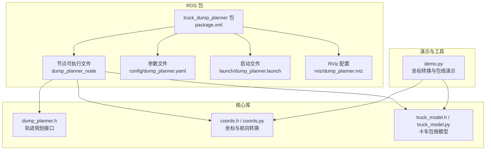
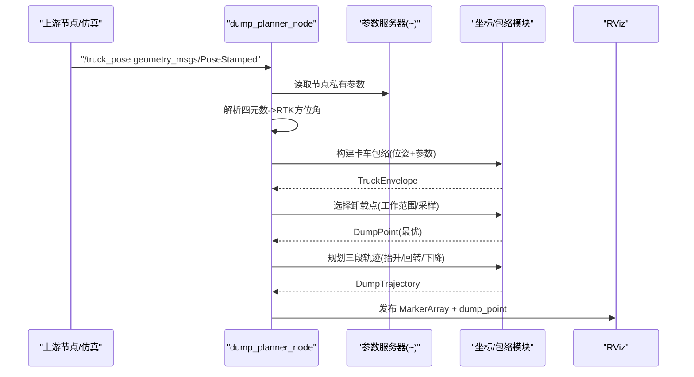
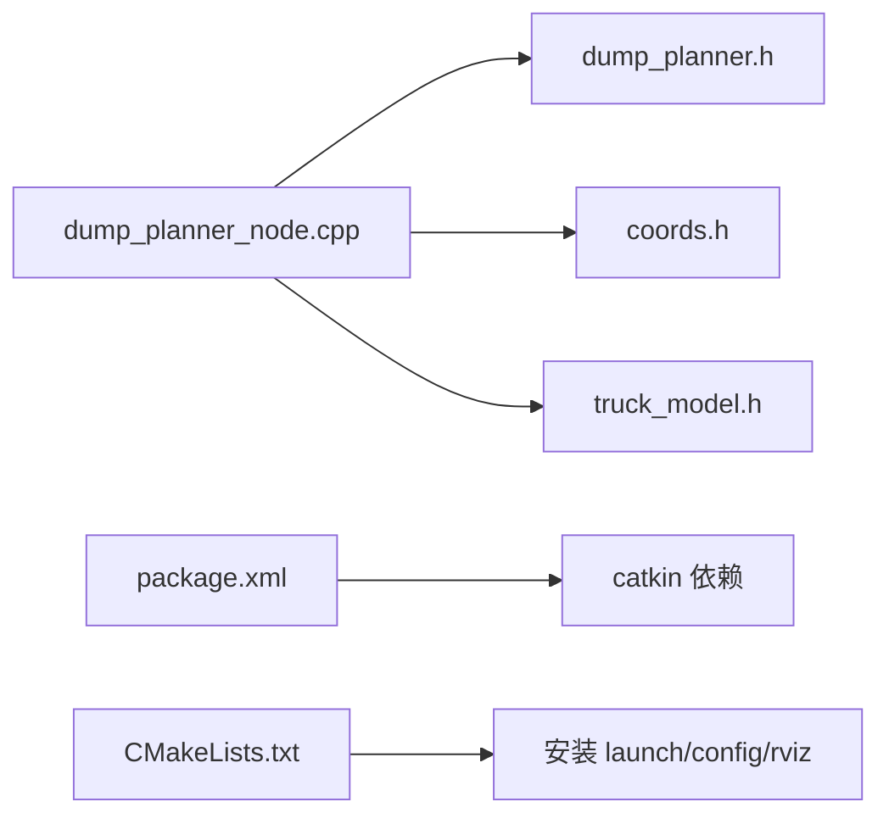

# 配置指南

<cite>
**本文引用的文件**
- [dump_planner.yaml](file://src/truck_dump_planner/config/dump_planner.yaml)
- [dump_planner.launch](file://src/truck_dump_planner/launch/dump_planner.launch)
- [dump_planner.rviz](file://src/truck_dump_planner/rviz/dump_planner.rviz)
- [dump_planner_node.cpp](file://src/truck_dump_planner/src/dump_planner_node.cpp)
- [dump_planner.h](file://src/truck_dump_planner/include/truck_dump_planner/dump_planner.h)
- [coords.h](file://src/truck_dump_planner/include/truck_dump_planner/coords.h)
- [truck_model.h](file://src/truck_dump_planner/include/truck_dump_planner/truck_model.h)
- [coords.py](file://src/truck_envelope/coords.py)
- [truck_model.py](file://src/truck_envelope/truck_model.py)
- [demo.py](file://src/demo.py)
- [package.xml](file://src/truck_dump_planner/package.xml)
- [CMakeLists.txt](file://src/truck_dump_planner/CMakeLists.txt)
</cite>

## 目录
1. [简介](#简介)
2. [项目结构](#项目结构)
3. [核心组件](#核心组件)
4. [架构总览](#架构总览)
5. [详细组件分析](#详细组件分析)
6. [依赖分析](#依赖分析)
7. [性能考量](#性能考量)
8. [故障排查指南](#故障排查指南)
9. [结论](#结论)
10. [附录](#附录)

## 简介
本指南面向无人挖掘机装车轨迹规划系统，聚焦以下方面：
- dump_planner.yaml 参数详解：参数含义、取值范围、推荐设置与调优建议
- 启动参数与运行时参数覆盖：launch 文件参数、ROS 参数服务器与节点私有命名空间的关系
- RViz 可视化配置：布局、显示项、坐标系与主题样式
- 参数调优策略、性能优化建议与常见问题排查

## 项目结构
该仓库包含 ROS 节点、参数配置、RViz 配置以及配套的 Python 实现与演示脚本，便于离线验证与对比。

图表来源
- [package.xml:1-20](file://src/truck_dump_planner/package.xml#L1-L20)
- [CMakeLists.txt:1-52](file://src/truck_dump_planner/CMakeLists.txt#L1-L52)
- [dump_planner.h:1-66](file://src/truck_dump_planner/include/truck_dump_planner/dump_planner.h#L1-L66)
- [coords.h:1-37](file://src/truck_dump_planner/include/truck_dump_planner/coords.h#L1-L37)
- [truck_model.h:1-60](file://src/truck_dump_planner/include/truck_dump_planner/truck_model.h#L1-L60)
- [coords.py:1-200](file://src/truck_envelope/coords.py#L1-L200)
- [truck_model.py:1-200](file://src/truck_envelope/truck_model.py#L1-L200)
- [demo.py:1-249](file://src/demo.py#L1-L249)

章节来源
- [package.xml:1-20](file://src/truck_dump_planner/package.xml#L1-L20)
- [CMakeLists.txt:1-52](file://src/truck_dump_planner/CMakeLists.txt#L1-L52)

## 核心组件
- dump_planner_node：订阅卡车位姿，进行 RTK 航向到挖掘机系航向转换，构建卡车包络，选择卸载点，规划轨迹，并发布 MarkerArray 与选定卸载点
- dump_planner.h：轨迹规划接口与数据结构定义（卸载点、轨迹点、轨迹）
- coords.h / coords.py：坐标系与航向角转换、轴约定、方向向量计算
- truck_model.h / truck_model.py：卡车几何参数、包络构建、点在多边形内判断

章节来源
- [dump_planner_node.cpp:1-341](file://src/truck_dump_planner/src/dump_planner_node.cpp#L1-L341)
- [dump_planner.h:1-66](file://src/truck_dump_planner/include/truck_dump_planner/dump_planner.h#L1-L66)
- [coords.h:1-37](file://src/truck_dump_planner/include/truck_dump_planner/coords.h#L1-L37)
- [truck_model.h:1-60](file://src/truck_dump_planner/include/truck_dump_planner/truck_model.h#L1-L60)
- [coords.py:1-200](file://src/truck_envelope/coords.py#L1-L200)
- [truck_model.py:1-200](file://src/truck_envelope/truck_model.py#L1-L200)

## 架构总览
下图展示从输入位姿到输出可视化的端到端流程，包括参数加载、坐标转换、包络构建、卸载点选择与轨迹规划。

图表来源
- [dump_planner_node.cpp:99-136](file://src/truck_dump_planner/src/dump_planner_node.cpp#L99-L136)
- [dump_planner.h:42-61](file://src/truck_dump_planner/include/truck_dump_planner/dump_planner.h#L42-L61)
- [coords.h:13-32](file://src/truck_dump_planner/include/truck_dump_planner/coords.h#L13-L32)
- [truck_model.h:46-52](file://src/truck_dump_planner/include/truck_dump_planner/truck_model.h#L46-L52)

## 详细组件分析

### dump_planner.yaml 参数详解
- 参数命名空间与节点关系
  - 节点私有命名空间：/dump_planner_node/
  - 参数通过 <rosparam command="load" file="..."/> 加载至该命名空间
- 参数分组与含义
  - 卡车几何（米）
    - length：卡车总长（纵轴）
    - width：卡车总宽（横轴）
    - ref_offset：车体几何中心相对参考点的纵轴偏移（正=偏前）
    - box_length：货箱长
    - box_width：货箱宽
    - box_center_offset：货箱中心相对参考点的纵轴偏移（通常偏车尾为负）
    - box_height：货箱侧壁高度（用于卸载高度估算）
  - 挖掘机工作范围
    - x/y：挖掘机回转中心（挖掘机系）
    - reach_min/reach_max：最小/最大卸载半径
    - dump_height_max/dump_height_min：最大/最小卸载高度
    - dump_clearance：铲斗底门距货箱顶面间隙
  - 铲斗当前位置（挖掘机系，卸载轨迹起点）
    - x/y/z：初始位置
  - 轨迹规划
    - safe_height：回转安全高度（需高于驾驶室/货箱顶）
    - n_steps：轨迹离散点数
  - 卸载点采样
    - n_samples：沿货箱纵向采样点数
  - 坐标系约定
    - frame_id：发布 marker 的坐标系（通常为 excavator）
    - axis_convention：xy 轴地理朝向约定（east_north 或 north_west）
    - bearing_convention：RTK 航向约定（rep105_enu 或 yaw_is_bearing）

- 推荐设置与取值范围
  - 几何参数：根据实车测量或制造商数据设定；ref_offset 可用于将参考点设置到后轴等位置
  - 工作范围：reach_min/reach_max 应覆盖卡车停靠范围；dump_height_min/max 应避开驾驶室与货箱顶部
  - 安全高度：safe_height ≥ max(box_height, 驾驶室高度) + dump_clearance
  - 采样与步数：n_samples 建议 7–11；n_steps 建议 30–60，兼顾精度与实时性
  - 坐标系约定：与上游位姿发布一致；bearing_convention 与四元数编码方式一致

- 参数来源与默认值
  - 节点通过 pnh_.param(...) 读取参数，未配置时使用硬编码默认值

章节来源
- [dump_planner.yaml:1-43](file://src/truck_dump_planner/config/dump_planner.yaml#L1-L43)
- [dump_planner_node.cpp:42-84](file://src/truck_dump_planner/src/dump_planner_node.cpp#L42-L84)
- [dump_planner.h:10-17](file://src/truck_dump_planner/include/truck_dump_planner/dump_planner.h#L10-L17)
- [truck_model.h:21-30](file://src/truck_dump_planner/include/truck_dump_planner/truck_model.h#L21-L30)
- [coords.h:20-32](file://src/truck_dump_planner/include/truck_dump_planner/coords.h#L20-L32)

### 启动参数与运行时参数覆盖
- 启动文件参数
  - test：是否发布静态测试卡车位姿（默认 true）
  - rviz：是否启动 RViz 并加载预设配置（默认 true）
- 节点参数加载
  - 使用 <rosparam command="load" .../> 将 dump_planner.yaml 加载到节点私有命名空间
- 运行时参数覆盖
  - 可通过命令行或外部 launch 文件 remap 与覆盖参数
  - dump_planner_node 订阅 /truck_pose，可通过 remap from/to 自定义话题名
- 示例覆盖方式
  - 覆盖参数：使用 --ros-args -r /truck_pose:=/your_pose
  - 覆盖参数文件：在更高优先级的 launch 中再次 <rosparam command="load" .../>

章节来源
- [dump_planner.launch:1-26](file://src/truck_dump_planner/launch/dump_planner.launch#L1-L26)
- [dump_planner_node.cpp:8-12](file://src/truck_dump_planner/src/dump_planner_node.cpp#L8-L12)

### RViz 可视化配置
- 主要显示项
  - Grid：XY 平面网格
  - OriginAxes：原点坐标轴（frame_id=excavator）
  - TruckEnvelope：MarkerArray 显示车体/货箱包络、朝向箭头、中心点、卸载点、轨迹
- 关键配置
  - Fixed Frame：excavator
  - Target Frame：excavator
  - 背景颜色：深灰
  - MarkerArray 主题：透明度、线宽、点大小、颜色
- 自定义方法
  - 修改固定帧与目标帧以适配不同坐标系
  - 调整视角、相机距离与焦点
  - 添加/删除显示项（如 Axes、MarkerArray、TF 等）

章节来源
- [dump_planner.rviz:1-131](file://src/truck_dump_planner/rviz/dump_planner.rviz#L1-L131)
- [dump_planner_node.cpp:211-313](file://src/truck_dump_planner/src/dump_planner_node.cpp#L211-L313)

### 参数调优指南
- 卡车几何与工作范围
  - 通过 demo.py 验证 RTK 航向与挖掘机系航向转换、包络构建与卸载点选择
  - 调整 ref_offset 以匹配 RTK 天线位置；校准 box_center_offset 与 box_height
- 轨迹规划
  - safe_height：确保高于驾驶室与货箱顶面；dump_clearance 保证卸料顺畅
  - n_steps：增大提升轨迹平滑度，减小提升实时性
  - n_samples：增大提高卸载点覆盖率，减小降低计算开销
- 坐标系一致性
  - 确保 bearing_convention 与上游位姿发布一致
  - axis_convention 与实际 xy 轴地理朝向一致

章节来源
- [demo.py:50-150](file://src/demo.py#L50-L150)
- [coords.py:39-61](file://src/truck_envelope/coords.py#L39-L61)
- [truck_model.py:112-177](file://src/truck_envelope/truck_model.py#L112-L177)

### 性能优化建议
- 计算复杂度
  - 卸载点采样：O(n_samples × 多边形判定)
  - 轨迹规划：O(n_steps)，半余弦平滑避免速度突变
- 优化策略
  - 合理设置 n_samples 与 n_steps，结合实时性需求
  - 使用高效的多边形包含判断（射线法）
  - 仅在必要时发布 MarkerArray，减少 RViz 渲染压力

章节来源
- [dump_planner.h:42-61](file://src/truck_dump_planner/include/truck_dump_planner/dump_planner.h#L42-L61)
- [dump_planner_node.cpp:211-313](file://src/truck_dump_planner/src/dump_planner_node.cpp#L211-L313)
- [truck_model.py:180-194](file://src/truck_envelope/truck_model.py#L180-L194)

## 依赖分析
- 节点依赖
  - dump_planner_node 依赖 dump_planner.h、coords.h、truck_model.h
  - 参数通过节点私有命名空间加载
- 外部依赖
  - geometry_msgs、visualization_msgs、tf2、tf2_geometry_msgs
- 构建与安装
  - CMakeLists 安装 launch/config/rviz 目录，便于部署

图表来源
- [dump_planner_node.cpp:1-341](file://src/truck_dump_planner/src/dump_planner_node.cpp#L1-L341)
- [dump_planner.h:1-66](file://src/truck_dump_planner/include/truck_dump_planner/dump_planner.h#L1-L66)
- [coords.h:1-37](file://src/truck_dump_planner/include/truck_dump_planner/coords.h#L1-L37)
- [truck_model.h:1-60](file://src/truck_dump_planner/include/truck_dump_planner/truck_model.h#L1-L60)
- [package.xml:12-19](file://src/truck_dump_planner/package.xml#L12-L19)
- [CMakeLists.txt:49-51](file://src/truck_dump_planner/CMakeLists.txt#L49-L51)

章节来源
- [package.xml:12-19](file://src/truck_dump_planner/package.xml#L12-L19)
- [CMakeLists.txt:19-22](file://src/truck_dump_planner/CMakeLists.txt#L19-L22)

## 性能考量
- 实时性
  - 降低 n_samples 与 n_steps 可显著提升帧率
  - 仅在位姿更新时触发计算，避免高频轮询
- 精度与稳定性
  - safe_height 与 dump_clearance 需留足够安全裕量
  - 坐标系约定与四元数编码保持一致，避免累积误差
- 可视化
  - 合理设置 MarkerArray 队列大小与透明度，平衡信息密度与渲染性能

## 故障排查指南
- 无可行卸载点
  - 检查 reach_min/reach_max 是否覆盖卡车停靠范围
  - 校准 dump_height_min/max 与 safe_height
  - 确认 n_samples 是否过少导致漏选
- 轨迹异常
  - 检查 safe_height 是否过低导致碰撞
  - 调整 n_steps 提升轨迹平滑度
- 坐标系不一致
  - 确认 bearing_convention 与上游位姿发布一致
  - 校验 axis_convention 与实际 xy 轴朝向一致
- RViz 显示异常
  - 检查 Fixed Frame 与 Target Frame 设置
  - 确认 MarkerArray 主题与 frame_id 一致

章节来源
- [dump_planner_node.cpp:127-135](file://src/truck_dump_planner/src/dump_planner_node.cpp#L127-L135)
- [dump_planner.yaml:30-43](file://src/truck_dump_planner/config/dump_planner.yaml#L30-L43)

## 结论
通过合理配置 dump_planner.yaml、规范启动参数与 RViz 可视化，结合参数调优与性能优化策略，可稳定实现无人挖掘机装车轨迹规划。建议在真实环境部署前，使用 demo.py 与静态测试位姿进行充分验证。

## 附录
- 坐标系与航向角转换
  - RTK 航向 α 与挖掘机系航向 β 的转换关系
  - 不同 axis_convention 下方向向量的分解
- 卡车包络构建
  - 以车体参考点为中心，结合长度/宽度与 ref_offset 计算四角
  - 货箱四角基于 box_center_offset 与 box 尺寸计算

章节来源
- [coords.py:39-61](file://src/truck_envelope/coords.py#L39-L61)
- [coords.py:154-191](file://src/truck_envelope/coords.py#L154-L191)
- [truck_model.py:112-177](file://src/truck_envelope/truck_model.py#L112-L177)
- [demo.py:93-149](file://src/demo.py#L93-L149)