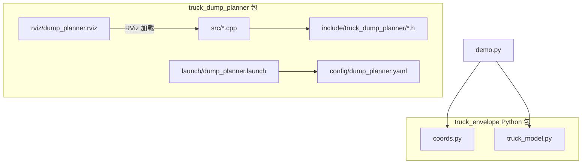
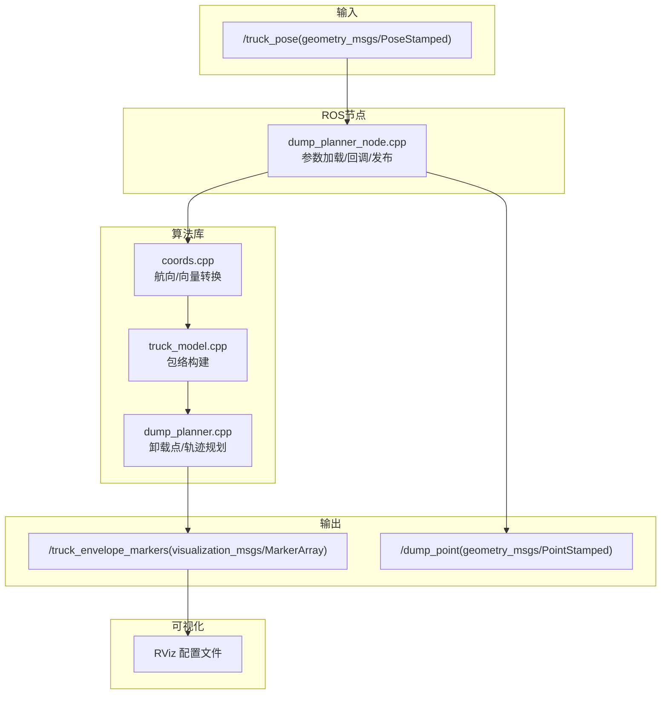
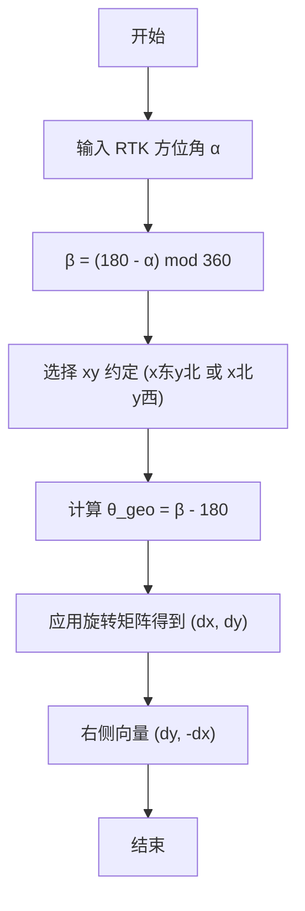
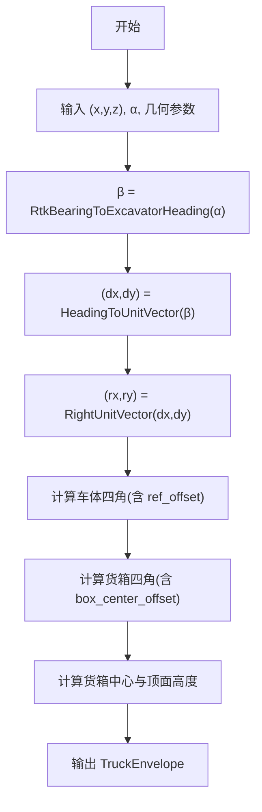
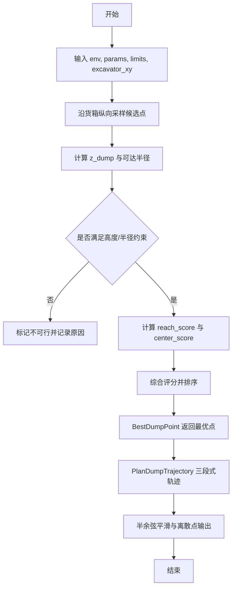
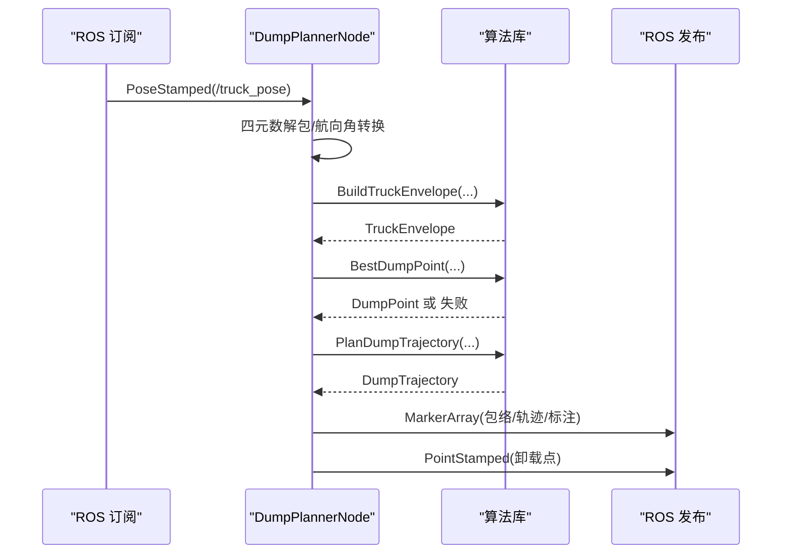
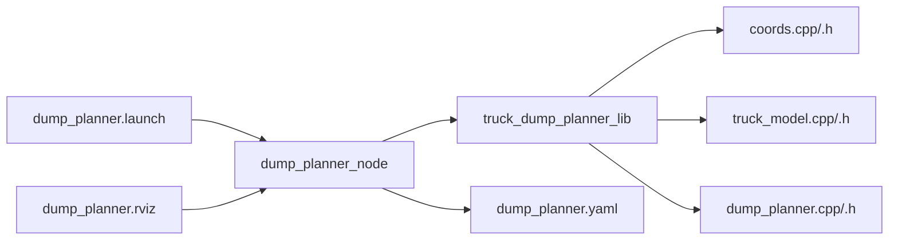

# 项目概述

<cite>
**本文引用的文件**
- [package.xml](file://src/truck_dump_planner/package.xml)
- [CMakeLists.txt](file://src/truck_dump_planner/CMakeLists.txt)
- [dump_planner.h](file://src/truck_dump_planner/include/truck_dump_planner/dump_planner.h)
- [coords.h](file://src/truck_dump_planner/include/truck_dump_planner/coords.h)
- [truck_model.h](file://src/truck_dump_planner/include/truck_dump_planner/truck_model.h)
- [dump_planner.cpp](file://src/truck_dump_planner/src/dump_planner.cpp)
- [coords.cpp](file://src/truck_dump_planner/src/coords.cpp)
- [truck_model.cpp](file://src/truck_dump_planner/src/truck_model.cpp)
- [dump_planner_node.cpp](file://src/truck_dump_planner/src/dump_planner_node.cpp)
- [dump_planner.yaml](file://src/truck_dump_planner/config/dump_planner.yaml)
- [dump_planner.launch](file://src/truck_dump_planner/launch/dump_planner.launch)
- [dump_planner.rviz](file://src/truck_dump_planner/rviz/dump_planner.rviz)
- [coords.py](file://src/truck_envelope/coords.py)
- [truck_model.py](file://src/truck_envelope/truck_model.py)
- [demo.py](file://src/demo.py)
</cite>

## 目录
1. [引言](#引言)
2. [项目结构](#项目结构)
3. [核心组件](#核心组件)
4. [架构总览](#架构总览)
5. [详细组件分析](#详细组件分析)
6. [依赖分析](#依赖分析)
7. [性能考量](#性能考量)
8. [故障排查指南](#故障排查指南)
9. [结论](#结论)
10. [附录](#附录)

## 引言
本项目面向无人挖掘机的自动装车任务，提供从RTK定位到轨迹可视化的完整链路：将RTK提供的地理方位角转换至挖掘机坐标系，构建卡车在挖掘机坐标系下的包络，基于工作范围约束与评分策略选择最优卸载点，并规划三段式平滑轨迹。系统同时提供ROS节点与RViz可视化，便于在仿真与实车上进行验证与调试。

## 项目结构
仓库采用Catkin工作空间组织，核心代码分为C++库与ROS节点两部分，配套Python演示脚本与参数/启动/RViz配置文件。

图表来源
- [CMakeLists.txt:1-52](file://src/truck_dump_planner/CMakeLists.txt#L1-L52)
- [dump_planner.launch:1-26](file://src/truck_dump_planner/launch/dump_planner.launch#L1-L26)
- [dump_planner.rviz:1-131](file://src/truck_dump_planner/rviz/dump_planner.rviz#L1-L131)
- [demo.py:1-249](file://src/demo.py#L1-L249)

章节来源
- [package.xml:1-20](file://src/truck_dump_planner/package.xml#L1-L20)
- [CMakeLists.txt:1-52](file://src/truck_dump_planner/CMakeLists.txt#L1-L52)

## 核心组件
- 坐标与航向转换：提供RTK方位角与挖掘机系航向角互转、航向角到xy平面单位向量分解、右侧方向向量等工具。
- 卡车包络建模：根据RTK位姿与几何参数，在挖掘机坐标系下生成车体与货箱包络，包含四角点、中心与顶面高度。
- 卸载点选择与轨迹规划：在货箱顶面采样候选点，结合可达半径与高度约束进行可行性筛选与评分，选择最优卸载点；随后规划三段式轨迹（抬升、回转、下放）。
- ROS节点与可视化：订阅卡车位姿消息，实时构建包络、选择卸载点、规划轨迹，并发布MarkerArray与卸载点消息，配合RViz展示。

章节来源
- [coords.h:1-37](file://src/truck_dump_planner/include/truck_dump_planner/coords.h#L1-L37)
- [truck_model.h:1-60](file://src/truck_dump_planner/include/truck_dump_planner/truck_model.h#L1-L60)
- [dump_planner.h:1-66](file://src/truck_dump_planner/include/truck_dump_planner/dump_planner.h#L1-L66)
- [dump_planner_node.cpp:1-341](file://src/truck_dump_planner/src/dump_planner_node.cpp#L1-L341)

## 架构总览
系统采用“参数驱动 + ROS回调 + 算法库”的分层设计：参数文件集中管理几何与运动学约束；ROS节点负责数据流与可视化；算法库提供纯C++可复用能力，便于独立测试与移植。

图表来源
- [dump_planner_node.cpp:10-39](file://src/truck_dump_planner/src/dump_planner_node.cpp#L10-L39)
- [dump_planner_node.cpp:42-84](file://src/truck_dump_planner/src/dump_planner_node.cpp#L42-L84)
- [dump_planner_node.cpp:99-136](file://src/truck_dump_planner/src/dump_planner_node.cpp#L99-L136)
- [dump_planner_node.cpp:211-313](file://src/truck_dump_planner/src/dump_planner_node.cpp#L211-L313)
- [dump_planner.rviz:82-89](file://src/truck_dump_planner/rviz/dump_planner.rviz#L82-L89)

## 详细组件分析

### 坐标与航向转换
- RTK方位角与挖掘机系航向角互转：采用β = (180 − α) mod 360的关系，确保正北方向一致性。
- 航向角到单位向量：支持x东y北与x北y西两种约定，通过旋转矩阵将β映射到(dx, dy)。
- 右侧方向向量：在xy平面内对车头方向顺时针旋转90°得到右侧单位向量。

图表来源
- [coords.cpp:10-16](file://src/truck_dump_planner/src/coords.cpp#L10-L16)
- [coords.cpp:18-49](file://src/truck_dump_planner/src/coords.cpp#L18-L49)
- [coords.h:13-32](file://src/truck_dump_planner/include/truck_dump_planner/coords.h#L13-L32)

章节来源
- [coords.h:1-37](file://src/truck_dump_planner/include/truck_dump_planner/coords.h#L1-L37)
- [coords.cpp:1-52](file://src/truck_dump_planner/src/coords.cpp#L1-L52)

### 卡车包络建模
- 输入：卡车在挖掘机坐标系下的参考点(x, y, z)与RTK方位角α。
- 处理：将α转换为β，分解车头与右侧单位向量，按车体与货箱尺寸及纵向偏移计算四角点，得到包络多边形。
- 输出：包含车体/货箱四角、货箱中心与顶面高度，以及车头/右侧方向向量。

图表来源
- [truck_model.cpp:22-46](file://src/truck_dump_planner/src/truck_model.cpp#L22-L46)
- [truck_model.h:32-52](file://src/truck_dump_planner/include/truck_dump_planner/truck_model.h#L32-L52)

章节来源
- [truck_model.h:1-60](file://src/truck_dump_planner/include/truck_dump_planner/truck_model.h#L1-L60)
- [truck_model.cpp:1-66](file://src/truck_dump_planner/src/truck_model.cpp#L1-L66)

### 卸载点选择与轨迹规划
- 卸载点候选：沿货箱纵向均匀采样，生成候选点并计算z_dump = 货箱顶面高 + 铲斗间隙。
- 可行性与评分：检查可达半径与高度范围，可行点按“靠近中心+适中半径”综合评分，取最高分者。
- 三段式轨迹：lift（z从起点提升到安全高度）、swing（在安全高度下xy平滑插值到卸载点）、lower（z从安全高度下降到卸载高度），每段采用半余弦平滑，避免加速度突变。

图表来源
- [dump_planner.cpp:7-61](file://src/truck_dump_planner/src/dump_planner.cpp#L7-L61)
- [dump_planner.cpp:82-117](file://src/truck_dump_planner/src/dump_planner.cpp#L82-L117)
- [dump_planner.h:42-61](file://src/truck_dump_planner/include/truck_dump_planner/dump_planner.h#L42-L61)

章节来源
- [dump_planner.h:1-66](file://src/truck_dump_planner/include/truck_dump_planner/dump_planner.h#L1-L66)
- [dump_planner.cpp:1-120](file://src/truck_dump_planner/src/dump_planner.cpp#L1-L120)

### ROS节点与可视化
- 订阅：/truck_pose（geometry_msgs/PoseStamped），其中orientation为四元数编码的RTK航向。
- 处理：四元数解包得到航向角，按参数约定转换为RTK方位角，构建包络，选择卸载点并规划轨迹。
- 发布：/truck_envelope_markers（MarkerArray，车体/货箱包络、朝向箭头、中心/卸载点/轨迹等）、/dump_point（PointStamped）。
- 可视化：RViz加载预设配置，显示MarkerArray与网格、坐标轴。

图表来源
- [dump_planner_node.cpp:3-8](file://src/truck_dump_planner/src/dump_planner_node.cpp#L3-L8)
- [dump_planner_node.cpp:99-136](file://src/truck_dump_planner/src/dump_planner_node.cpp#L99-L136)
- [dump_planner_node.cpp:211-313](file://src/truck_dump_planner/src/dump_planner_node.cpp#L211-L313)

章节来源
- [dump_planner_node.cpp:1-341](file://src/truck_dump_planner/src/dump_planner_node.cpp#L1-L341)
- [dump_planner.rviz:82-89](file://src/truck_dump_planner/rviz/dump_planner.rviz#L82-L89)

## 依赖分析
- 构建与运行依赖：roscpp、geometry_msgs、visualization_msgs、tf2、tf2_geometry_msgs。
- 内部依赖：dump_planner_node链接算法库；算法库内部仅依赖标准库与头文件接口，保持与ROS解耦，便于独立测试。
- 参数与配置：节点私有命名空间下集中管理卡车几何、挖掘机工作范围、轨迹与卸载点采样参数，以及坐标系约定。

图表来源
- [CMakeLists.txt:38-39](file://src/truck_dump_planner/CMakeLists.txt#L38-L39)
- [CMakeLists.txt:30-35](file://src/truck_dump_planner/CMakeLists.txt#L30-L35)
- [dump_planner.launch:8-12](file://src/truck_dump_planner/launch/dump_planner.launch#L8-L12)

章节来源
- [package.xml:12-19](file://src/truck_dump_planner/package.xml#L12-L19)
- [CMakeLists.txt:11-27](file://src/truck_dump_planner/CMakeLists.txt#L11-L27)

## 性能考量
- 计算复杂度：包络构建与点在多边形内的判断为O(1)与O(n)（n为多边形顶点数），卸载点采样与排序为O(k)与O(k log k)，轨迹规划为O(n_steps)。
- 实时性：单帧处理开销极低，适合在ROS中以高频回调运行；可通过减少采样点数与轨迹离散步数进一步优化。
- 数值稳定性：角度归一化与向量归一化避免了奇异情况；半余弦平滑保证轨迹连续可微，有利于后续控制。

## 故障排查指南
- 无可行卸载点：检查RTK位姿是否在挖掘机工作范围内，确认参数文件中的最小/最大半径与高度限制设置合理。
- 航向角不一致：核对bearing_convention参数（rep105_enu或yaw_is_bearing）与上游数据源约定一致。
- 坐标系约定错误：确认axis_convention（east_north或north_west）与实际xy轴地理朝向一致。
- RViz未显示：确认MarkerArray主题名称与RViz配置一致，固定帧设置为frame_id。

章节来源
- [dump_planner_node.cpp:127-135](file://src/truck_dump_planner/src/dump_planner_node.cpp#L127-L135)
- [dump_planner.yaml:39-43](file://src/truck_dump_planner/config/dump_planner.yaml#L39-L43)
- [dump_planner.rviz:82-89](file://src/truck_dump_planner/rviz/dump_planner.rviz#L82-L89)

## 结论
本项目以清晰的模块划分与参数化设计实现了从RTK位姿到卸载轨迹的端到端流程，既能在ROS生态中高效集成，又保留纯C++算法库的可移植性。通过可视化与演示脚本，能够快速验证坐标转换、包络构建与轨迹规划的正确性，适用于无人挖掘机自动装车场景的开发与部署。

## 附录
- 参数说明与默认值：参见参数文件与节点参数加载逻辑。
- 启动与验证：通过launch文件一键启动节点、发布测试位姿与RViz可视化。
- Python演示：提供坐标转换与包络/轨迹的完整演示，便于理解与二次开发。

章节来源
- [dump_planner.yaml:1-43](file://src/truck_dump_planner/config/dump_planner.yaml#L1-L43)
- [dump_planner.launch:1-26](file://src/truck_dump_planner/launch/dump_planner.launch#L1-L26)
- [demo.py:1-249](file://src/demo.py#L1-L249)