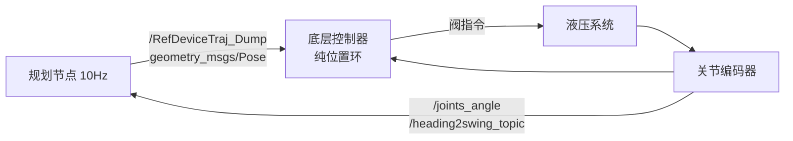
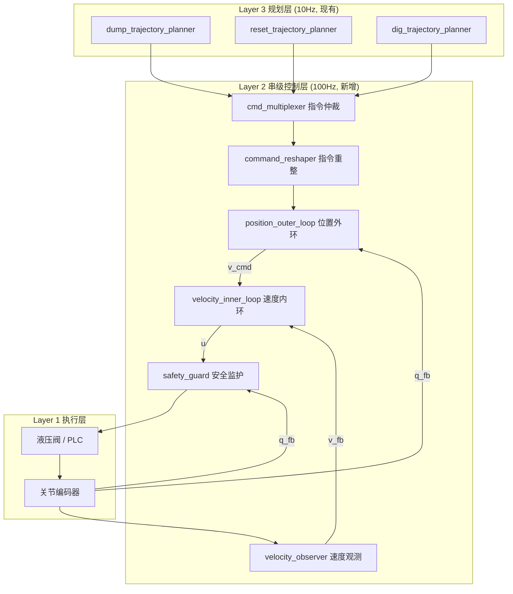
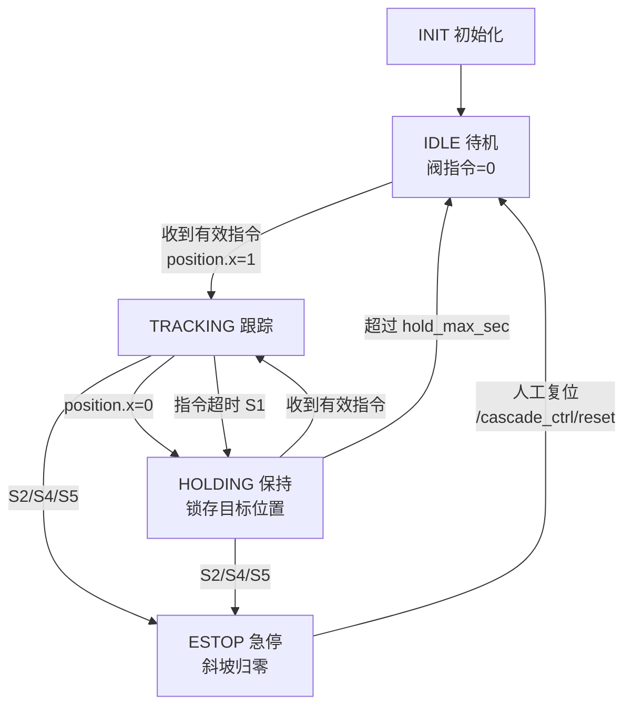
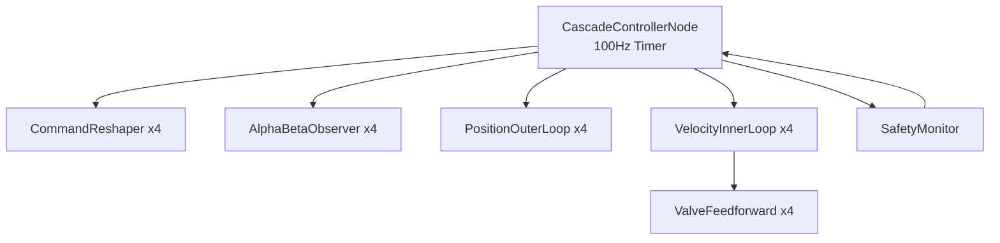
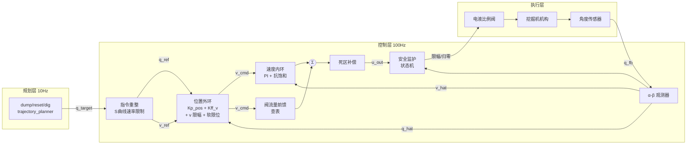

# 无人挖掘机串级控制技术方案（位置外环 + 速度内环）

> 适用范围：本工作区 `dump_trajectory_planner` / `reset_trajectory_planner` / `dig_trajectory_planner`
> 三类规划节点的下游执行层，统一为四关节（swing / boom / arm / bucket）液压伺服控制。

---

## 1. 方案目标

### 1.1 要解决的问题

| 编号 | 现存问题 | 现象（实机日志证据） |
|:---:|:---|:---|
| P1 | 段切换时位置指令跳变 | 段起点取实时反馈，与上一段参考终点存在 2–6° 跟踪残差 → 位置环误差突变 → 阀指令冲击 |
| P2 | 跟踪速度低于规划速度 | `segment 0 timeout (5.1s > 5.1s), err=6.14deg, forcing advance` |
| P3 | 负载敏感 | 满载铲斗提升时 boom 速度显著低于空载，规划时长失效 |
| P4 | 低速爬行 / 死区 | 段末小角度收敛缓慢，容差需放宽到 5–20° |
| P5 | 无速度闭环 | 规划的 Hermite 切线（v_start/v_end）在执行层被丢弃，只用位置 |

### 1.2 设计目标

| 指标 | 目标值 | 说明 |
|:---|:---|:---|
| 关节位置稳态误差 | ≤ 1.0° | 使段容差可从 5° 收紧至 2° |
| 段切换阀指令跳变 | ≤ 满量程 10% | 由外环速度限幅保证 |
| 速度跟踪误差（稳态） | ≤ 1.5 °/s | 满载/空载均满足 |
| 负载扰动恢复时间 | ≤ 0.3 s | 速度内环带宽保证 |
| 段超时率 | < 5% | 消除 P2 |

---

## 2. 现状分析

### 2.1 现有执行链路



### 2.2 现有接口清单

| 话题 | 类型 | 方向 | 字段语义 |
|:---|:---|:---:|:---|
| `/RefDeviceTraj_Dump` | `geometry_msgs/Pose` | 规划 → 控制 | `orientation.x/y/z/w` = swing/boom/arm/bucket (deg)；`position.x` = 1 执行中 / 0 结束 |
| `/RefDeviceTraj_Reset` | `geometry_msgs/Pose` | 规划 → 控制 | 同上（复位阶段） |
| `/joints_angle` | `geometry_msgs/Quaternion` | 传感 → 全局 | `x/y/z` = boom/arm/bucket (deg) |
| `/heading2swing_topic` | `std_msgs/Float32` | 传感 → 卸载节点 | `data` = swing (deg) |
| `/Swing_topic` | `geometry_msgs/Point` | 传感 → 复位节点 | `x` = swing (deg) |

### 2.3 关键约束

| 约束 | 数值 | 来源 |
|:---|:---|:---|
| 规划指令发布频率 | 10 Hz | `dump_trajectory.yaml: publish_rate` |
| 关节限位 boom | [-25°, 50°] | `kinematics/boom_joint_*` |
| 关节限位 arm | [-150°, -30°] | `kinematics/arm_joint_*` |
| 关节限位 bucket | [-135°, 30°] | `kinematics/bucket_joint_*` |
| 规划最大关节速度 | boom 10, swing 15, arm 15, bkt 50 °/s | `waypoint/wp*_vel_*_dps` |
| 液压延迟 | 50–200 ms | 项目既有结论 |

### 2.4 核心矛盾：频率不匹配

**10 Hz 的位置指令无法直接驱动速度环**（速度环需 ≥ 100 Hz）。

因此串级控制器必须：
1. 独立成节点，以 **100–200 Hz** 运行；
2. 对 10 Hz 位置指令做 **指令插值（command reshaping）**，生成连续参考；
3. 内部完成位置外环 → 速度内环两级计算。

---

## 3. 总体架构

### 3.1 分层架构



### 3.2 新增节点：`excavator_cascade_controller`

| 项 | 说明 |
|:---|:---|
| 包名 | `excavator_cascade_controller`（新建 catkin 包） |
| 节点名 | `cascade_controller_node` |
| 控制周期 | 100 Hz（可配置 100–200 Hz） |
| 依赖 | `roscpp`, `geometry_msgs`, `std_msgs`, `kinematics` |
| 语言标准 | C++17（`kinematics` 使用 `std::optional`，必须 C++17） |

### 3.3 数据流时序

```
t (ms):   0    10   20   30   40   50   60   70   80   90   100
规划:     ■────────────────────────────────────────────────■     (10Hz)
重整:     ●●●●●●●●●●●●●●●●●●●●●●●●●●●●●●●●●●●●●●●●●●●●●●●●     (100Hz 插值)
外环:     ●●●●●●●●●●●●●●●●●●●●●●●●●●●●●●●●●●●●●●●●●●●●●●●●     (100Hz)
内环:     ●●●●●●●●●●●●●●●●●●●●●●●●●●●●●●●●●●●●●●●●●●●●●●●●     (100Hz)
反馈:     ○──────○──────○──────○──────○──────○──────○──────     (~20-50Hz)
```

---

## 4. 接口设计

### 4.1 输入话题

| 话题 | 类型 | 频率 | 说明 |
|:---|:---|:---:|:---|
| `/RefDeviceTraj_Dump` | `geometry_msgs/Pose` | 10 Hz | 卸载阶段位置指令 |
| `/RefDeviceTraj_Reset` | `geometry_msgs/Pose` | 10 Hz | 复位阶段位置指令 |
| `/RefDeviceTraj_Dig` | `geometry_msgs/Pose` | 10 Hz | 挖掘阶段位置指令（预留） |
| `/joints_angle` | `geometry_msgs/Quaternion` | ≥20 Hz | boom/arm/bucket 反馈 (deg) |
| `/heading2swing_topic` | `std_msgs/Float32` | ≥20 Hz | swing 反馈 (deg) |
| `/Sys_SeqAction` | `std_msgs/Float64` | 事件 | 阶段号，用于指令源仲裁 |
| `/joints_velocity` | `geometry_msgs/Quaternion` | ≥50 Hz | **可选**：若底层提供速度反馈则直接使用 |

### 4.2 输出话题

| 话题 | 类型 | 频率 | 字段语义 |
|:---|:---|:---:|:---|
| `/Cmd_ValveOpening` | `geometry_msgs/Quaternion` | 100 Hz | `x/y/z/w` = swing/boom/arm/bucket 阀开度指令，归一化 [-100, 100] (%) |
| `/cascade_ctrl/debug` | `geometry_msgs/Twist` | 100 Hz | 调试：`linear` = 位置误差(deg)，`angular` = 速度误差(deg/s)，按关节轮转发布或改用自定义 msg |
| `/cascade_ctrl/status` | `std_msgs/Int32` | 10 Hz | 状态字（见 4.4） |

### 4.3 指令源仲裁规则

```
/Sys_SeqAction == 2.0  → 采用 /RefDeviceTraj_Reset
/Sys_SeqAction == 3.0  → 采用 /RefDeviceTraj_Dig     (预留)
/Sys_SeqAction == 4.0  → 采用 /RefDeviceTraj_Dump
其他                   → 保持模式（HOLD）：锁存最后一帧有效指令
```

**关键规则**：仅当被选中话题的 `position.x == 1.0` 时进入 TRACKING 模式；
`position.x == 0.0` 时锁存该帧位置作为 HOLD 目标（防止阶段结束瞬间掉力）。

### 4.4 状态字定义

| bit | 名称 | 含义 |
|:---:|:---|:---|
| 0 | TRACKING | 正在跟踪指令 |
| 1 | HOLDING | 保持模式 |
| 2 | CMD_STALE | 指令话题超时（>0.5 s） |
| 3 | FB_STALE | 反馈话题超时（>0.2 s） |
| 4 | LIMIT_HIT | 任一关节触及软限位 |
| 5 | VEL_SAT | 任一关节速度指令饱和 |
| 6 | OUT_SAT | 任一关节阀指令饱和 |
| 7 | ESTOP | 安全监护触发急停 |

---

## 5. 指令重整模块（Command Reshaper）

### 5.1 作用

将 10 Hz 阶跃式位置指令转为 100 Hz 连续位置 + 速度参考，解决 **P1 段切换跳变**。

### 5.2 算法：一阶速率限制 + 二阶滤波

```cpp
/// 指令重整器：单关节
class CommandReshaper {
 public:
  struct Params {
    double v_max_dps = 20.0;      // 参考速度上限 (deg/s)
    double a_max_dps2 = 40.0;     // 参考加速度上限 (deg/s²)
    double jump_limit_deg = 3.0;  // 单次指令刷新允许的最大阶跃 (deg)
  };

  /// 收到新的 10Hz 指令时调用
  void SetTarget(double q_target_deg) {
    // 阶跃限幅：防止指令源跳变直接穿透
    double diff = q_target_deg - q_ref_;
    if (std::abs(diff) > params_.jump_limit_deg * 10.0) {
      // 超大跳变（如换阶段）→ 直接接受，但速度参考归零重新加速
      v_ref_ = 0.0;
    }
    q_target_ = q_target_deg;
  }

  /// 100Hz 周期调用，输出连续参考
  void Update(double dt, double* q_ref_out, double* v_ref_out) {
    // S 曲线速率限制（梯形速度规划的在线形式）
    const double err = q_target_ - q_ref_;
    // 以当前速度刹停所需距离
    const double stop_dist = 0.5 * v_ref_ * v_ref_ / params_.a_max_dps2;

    double v_desired;
    if (std::abs(err) <= stop_dist) {
      // 进入减速区
      v_desired = std::copysign(
          std::sqrt(2.0 * params_.a_max_dps2 * std::abs(err)), err);
    } else {
      v_desired = std::copysign(params_.v_max_dps, err);
    }

    // 加速度限制
    const double dv_max = params_.a_max_dps2 * dt;
    v_ref_ += std::clamp(v_desired - v_ref_, -dv_max, dv_max);
    v_ref_ = std::clamp(v_ref_, -params_.v_max_dps, params_.v_max_dps);

    q_ref_ += v_ref_ * dt;

    *q_ref_out = q_ref_;
    *v_ref_out = v_ref_;
  }

  /// HOLD / 初始化：把参考对齐到实际位置
  void Reset(double q_actual_deg) {
    q_ref_ = q_actual_deg;
    q_target_ = q_actual_deg;
    v_ref_ = 0.0;
  }

 private:
  Params params_;
  double q_ref_ = 0.0;     // 连续位置参考
  double v_ref_ = 0.0;     // 连续速度参考（作为内环前馈）
  double q_target_ = 0.0;  // 10Hz 指令目标
};
```

### 5.3 效果

| 场景 | 无重整 | 有重整 |
|:---|:---|:---|
| 10 Hz 指令步进 1.5° | 位置误差每 100ms 阶跃 1.5° | 位置参考连续，误差平滑 |
| 段切换残差 5° | 误差瞬间跳 5° | 速率限制在 v_max 内消化，耗时 5/20=0.25 s |
| 阶段切换大跳变 | 控制量饱和冲击 | 速度参考归零重新加速 |

### 5.4 swing 角环绕处理

swing 指令为 `[0°, 360°)` 回包值，重整前必须展开到与内部参考同一周期：

```cpp
/// swing 专用：把新目标展开到 q_ref_ 附近（最短路径）
void SetSwingTarget(double q_target_wrapped_deg) {
  double diff = q_target_wrapped_deg - std::fmod(q_ref_, 360.0);
  while (diff > 180.0) diff -= 360.0;
  while (diff < -180.0) diff += 360.0;
  q_target_ = q_ref_ + diff;
}
```

---

## 6. 位置外环设计

### 6.1 控制律

```
v_cmd = Kp_pos · (q_ref - q_fb) + Kff_v · v_ref
v_cmd = clamp(v_cmd, -v_max, +v_max)
```

| 项 | 作用 |
|:---|:---|
| `Kp_pos · e_pos` | 反馈项，消除位置误差 |
| `Kff_v · v_ref` | **速度前馈**，来自指令重整器；使跟踪误差不必靠误差积累驱动 |
| `clamp` | **段切换保护**：位置跳变导致的速度指令被硬限幅 |

### 6.2 关键设计点

**（1）不加积分**
位置外环用纯 P + 前馈。积分交给速度内环，避免双积分导致过冲与积分饱和耦合。

**（2）速度前馈是性能关键**
无前馈时，跟踪 20°/s 需要位置误差 `e = 20 / Kp_pos = 10°`（Kp_pos=2）；
有前馈（Kff_v=0.9）时，仅需 `e = 20×0.1/2 = 1°`。**直接解决 P2 段超时**。

**（3）软限位处理**
```cpp
// 接近限位时衰减朝限位方向的速度指令
double LimitAwareVelocity(double v_cmd, double q_fb,
                          double lo, double hi, double margin) {
  if (v_cmd > 0 && q_fb > hi - margin) {
    double scale = std::max(0.0, (hi - q_fb) / margin);
    v_cmd *= scale;
  }
  if (v_cmd < 0 && q_fb < lo + margin) {
    double scale = std::max(0.0, (q_fb - lo) / margin);
    v_cmd *= scale;
  }
  return v_cmd;
}
```

### 6.3 实现

```cpp
/// 位置外环：单关节
class PositionOuterLoop {
 public:
  struct Params {
    double kp_pos = 2.0;       // 位置比例增益 (1/s)
    double kff_vel = 0.9;      // 速度前馈系数 [0,1]
    double v_max_dps = 20.0;   // 速度指令限幅 (deg/s)
    double limit_lo_deg = -180.0;
    double limit_hi_deg = 180.0;
    double limit_margin_deg = 3.0;
    double deadband_deg = 0.2; // 位置死区，抑制稳态抖振
  };

  /// @return 速度指令 (deg/s)
  double Compute(double q_ref, double v_ref, double q_fb, bool* saturated) {
    double e = q_ref - q_fb;
    if (std::abs(e) < params_.deadband_deg) e = 0.0;

    double v_cmd = params_.kp_pos * e + params_.kff_vel * v_ref;

    // 软限位衰减
    v_cmd = LimitAwareVelocity(v_cmd, q_fb, params_.limit_lo_deg,
                               params_.limit_hi_deg, params_.limit_margin_deg);

    // 速度限幅（段切换保护的核心）
    const double v_clamped =
        std::clamp(v_cmd, -params_.v_max_dps, params_.v_max_dps);
    *saturated = (v_clamped != v_cmd);
    return v_clamped;
  }

 private:
  Params params_;
};
```

---

## 7. 速度内环设计

### 7.1 控制律

```
e_v = v_cmd - v_fb
u = Kp_v · e_v + Ki_v · ∫e_v dt + u_ff(v_cmd) + u_dz(v_cmd)
u = clamp(u, -u_max, +u_max)      // 带反算抗饱和
```

| 项 | 作用 |
|:---|:---|
| `Kp_v · e_v` | 快速响应速度误差 |
| `Ki_v · ∫e_v` | 消除稳态速度误差（补偿负载 → **解决 P3**） |
| `u_ff(v_cmd)` | **阀流量前馈**：由标定的 速度↔开度 曲线反查 |
| `u_dz(v_cmd)` | **死区补偿**（→ **解决 P4**） |

### 7.2 阀流量前馈（关键）

液压阀开度与关节速度呈非线性关系。通过实机标定得到查找表，前馈可让内环仅处理残差：

```cpp
/// 阀流量前馈：分段线性查找表（由标定数据填充）
class ValveFeedforward {
 public:
  /// 标定点：{关节速度 deg/s, 阀开度 %}，正负方向分别标定（液压不对称）
  void SetTable(std::vector<std::pair<double, double>> table) {
    table_ = std::move(table);
    std::sort(table_.begin(), table_.end());
  }

  double Lookup(double v_cmd_dps) const {
    if (table_.empty()) return 0.0;
    if (v_cmd_dps <= table_.front().first) return table_.front().second;
    if (v_cmd_dps >= table_.back().first) return table_.back().second;
    for (size_t i = 1; i < table_.size(); ++i) {
      if (v_cmd_dps <= table_[i].first) {
        const auto& a = table_[i - 1];
        const auto& b = table_[i];
        const double t = (v_cmd_dps - a.first) / (b.first - a.first);
        return a.second + t * (b.second - a.second);
      }
    }
    return table_.back().second;
  }

 private:
  std::vector<std::pair<double, double>> table_;
};
```

### 7.3 死区补偿

```cpp
/// 死区补偿：小速度指令时叠加最小起动开度
inline double DeadzoneCompensation(double v_cmd_dps, double dz_pos,
                                   double dz_neg, double v_thresh) {
  if (v_cmd_dps > v_thresh) return dz_pos;
  if (v_cmd_dps < -v_thresh) return -dz_neg;
  return 0.0;  // 指令接近零时不补偿，避免抖振
}
```

### 7.4 反算抗饱和（Back-calculation Anti-windup）

```cpp
/// 速度内环
class VelocityInnerLoop {
 public:
  struct Params {
    double kp_v = 1.5;          // 速度比例增益 (%/(deg/s))
    double ki_v = 4.0;          // 速度积分增益 (%/(deg))
    double u_max = 100.0;       // 阀开度限幅 (%)
    double aw_gain = 1.0;       // 抗饱和反算增益
    double deadzone_pos = 8.0;  // 正向死区补偿 (%)
    double deadzone_neg = 8.0;  // 负向死区补偿 (%)
    double dz_v_thresh = 0.3;   // 触发死区补偿的速度阈值 (deg/s)
  };

  double Compute(double v_cmd, double v_fb, double dt, bool* saturated) {
    const double e = v_cmd - v_fb;

    // PI + 前馈 + 死区补偿
    const double u_ff = ff_.Lookup(v_cmd);
    const double u_dz = DeadzoneCompensation(
        v_cmd, params_.deadzone_pos, params_.deadzone_neg, params_.dz_v_thresh);

    double u_raw = params_.kp_v * e + integral_ + u_ff + u_dz;
    const double u = std::clamp(u_raw, -params_.u_max, params_.u_max);

    // 积分更新（含反算抗饱和：饱和时把超出量反馈回积分器）
    integral_ += params_.ki_v * e * dt
               + params_.aw_gain * (u - u_raw) * dt;

    *saturated = (u != u_raw);
    return u;
  }

  void Reset() { integral_ = 0.0; }
  ValveFeedforward& feedforward() { return ff_; }

 private:
  Params params_;
  ValveFeedforward ff_;
  double integral_ = 0.0;
};
```

---

## 8. 速度观测器

### 8.1 场景判断

| 条件 | 方案 |
|:---|:---|
| 底层提供 `/joints_velocity` | 直接使用，仅做轻度低通（τ=20 ms） |
| 仅有位置编码器 | 使用观测器（下述方案 B） |

### 8.2 方案 B：α-β 跟踪滤波器（推荐）

相比"差分 + 低通"，α-β 滤波器在等效噪声抑制下延迟更小，适合作为内环反馈。

```cpp
/// α-β 速度观测器（单关节）
/// 优于现有 VelocityEstimator 的 3 帧差分：延迟更小、对不等间隔采样鲁棒
class AlphaBetaObserver {
 public:
  struct Params {
    double alpha = 0.35;      // 位置修正增益 [0,1]
    double beta  = 0.08;      // 速度修正增益 [0,1]
    double v_limit_dps = 40.0; // 输出限幅
  };

  /// 每收到一帧位置反馈时调用（支持不等间隔）
  void Update(double q_meas_deg, double dt) {
    if (!initialized_) {
      q_est_ = q_meas_deg;
      v_est_ = 0.0;
      initialized_ = true;
      return;
    }
    if (dt <= 1e-6 || dt > 0.5) {  // 异常间隔：仅重置位置
      q_est_ = q_meas_deg;
      return;
    }
    // 预测
    double q_pred = q_est_ + v_est_ * dt;
    double v_pred = v_est_;
    // 残差
    const double r = q_meas_deg - q_pred;
    // 修正
    q_est_ = q_pred + params_.alpha * r;
    v_est_ = v_pred + (params_.beta / dt) * r;
    v_est_ = std::clamp(v_est_, -params_.v_limit_dps, params_.v_limit_dps);
  }

  /// 控制周期内推进（反馈未刷新时用模型外推，避免内环反馈"卡住"）
  void Propagate(double dt) {
    if (initialized_) q_est_ += v_est_ * dt;
  }

  double velocity_dps() const { return v_est_; }
  double position_deg() const { return q_est_; }
  void Reset() { initialized_ = false; v_est_ = 0.0; }

 private:
  Params params_;
  bool initialized_ = false;
  double q_est_ = 0.0;
  double v_est_ = 0.0;
};
```

### 8.3 swing 观测器特殊处理

swing 反馈为 `[0°, 360°)` 回包值，残差计算必须归一化：

```cpp
// swing 观测器中的残差计算
double r = q_meas_deg - std::fmod(q_pred, 360.0);
while (r >  180.0) r -= 360.0;
while (r < -180.0) r += 360.0;
```

### 8.4 与现有 `VelocityEstimator` 的关系

| 模块 | 用途 | 保留/替换 |
|:---|:---|:---|
| `dump_trajectory_planner::VelocityEstimator` | 规划层：Hermite 起点切线估计（10 Hz 够用） | **保留** |
| `AlphaBetaObserver` | 控制层：速度内环反馈（100 Hz） | **新增** |

---

## 9. 安全监护模块

### 9.1 保护项清单

| 编号 | 保护项 | 触发条件 | 动作 |
|:---:|:---|:---|:---|
| S1 | 指令超时 | 选中话题静默 > 0.5 s | 进入 HOLD，参考对齐当前位置 |
| S2 | 反馈超时 | `/joints_angle` 或 swing 静默 > 0.2 s | 阀指令斜坡归零（0.3 s 内） |
| S3 | 硬限位 | 关节反馈超出限位 | 该关节朝限位方向的指令置零 |
| S4 | 速度异常 | \|v_fb\| > 1.5 × v_max | 触发 ESTOP，阀指令归零 |
| S5 | 位置发散 | \|q_ref − q_fb\| > 20° 持续 1 s | 触发 ESTOP，上报状态字 |
| S6 | 阀指令持续饱和 | 任一关节饱和持续 > 2 s | 上报 WARN（可能负载过大/机械卡阻） |
| S7 | 阶段切换 | `/Sys_SeqAction` 变化 | 重置所有重整器/观测器/积分器 |

### 9.2 阀指令斜坡归零

**禁止**直接把阀指令置 0（会造成液压冲击）：

```cpp
/// 安全归零：按斜坡衰减阀指令
double RampToZero(double u_last, double dt, double ramp_time_sec) {
  const double step = 100.0 / std::max(ramp_time_sec, 1e-3) * dt;
  if (u_last > 0) return std::max(0.0, u_last - step);
  if (u_last < 0) return std::min(0.0, u_last + step);
  return 0.0;
}
```

### 9.3 模式状态机



**HOLD 模式的必要性**：阶段结束（`position.x=0`）后若直接卸力，液压保压不足会导致
臂架沉降。HOLD 模式保持位置闭环，使控制器主动维持姿态。
---

## 10. 参数配置

新增配置文件 `excavator_cascade_controller/config/cascade_controller.yaml`。
四个关节（swing / boom / arm / bucket）独立配置，禁止共用一套增益——
它们的惯量、油缸面积、力臂差异巨大。

```yaml
cascade_controller:
  # ===================== 全局 =====================
  control_rate: 100.0            # 控制周期 100 Hz（10 ms）
  cmd_topic_dump:   "/RefDeviceTraj_Dump"
  cmd_topic_reset:  "/RefDeviceTraj_Reset"
  cmd_topic_dig:    "/RefDeviceTraj_Dig"
  fb_joints_topic:  "/joints_angle"        # boom/arm/bucket (deg)
  fb_swing_topic:   "/heading2swing_topic" # swing (deg)
  valve_topic:      "/Cmd_ValveOpening"
  status_topic:     "/cascade_ctrl/status"

  # ===================== 指令重整 =====================
  reshape:
    enable: true
    # 每关节最大速率 / 加速度（deg/s, deg/s^2）
    # 速率上限 = 规划器该关节最大速度 × 1.2 余量
    swing:  { max_rate: 20.0, max_accel: 30.0, max_step: 8.0 }
    boom:   { max_rate: 14.0, max_accel: 25.0, max_step: 6.0 }
    arm:    { max_rate: 20.0, max_accel: 35.0, max_step: 8.0 }
    bucket: { max_rate: 60.0, max_accel: 120.0, max_step: 20.0 }

  # ===================== 位置外环 =====================
  outer:
    # Kp_pos 单位 1/s：速度指令 = Kp_pos × 位置误差
    # 经验起点 = 1 / (2 × 液压等效时间常数)
    swing:  { kp_pos: 1.2, kff_v: 1.0, v_max: 20.0, err_deadband: 0.3 }
    boom:   { kp_pos: 1.0, kff_v: 1.0, v_max: 14.0, err_deadband: 0.3 }
    arm:    { kp_pos: 1.2, kff_v: 1.0, v_max: 20.0, err_deadband: 0.3 }
    bucket: { kp_pos: 1.5, kff_v: 1.0, v_max: 60.0, err_deadband: 0.5 }

    # 软限位：接近限位时线性衰减速度指令
    soft_limit_margin_deg: 5.0
    limits:                       # 与规划器保持一致
      swing:  { min: -180.0, max: 180.0, wrap: true }
      boom:   { min:  -25.0, max:  50.0, wrap: false }
      arm:    { min: -150.0, max: -30.0, wrap: false }
      bucket: { min: -135.0, max:  30.0, wrap: false }

  # ===================== 速度内环 =====================
  inner:
    swing:
      kp_v: 1.8                  # %阀开度 per (deg/s)
      ki_v: 3.0                  # %阀开度 per (deg/s·s)
      anti_windup_gain: 2.0
      u_min: -100.0
      u_max:  100.0
      deadzone_pos: 12.0         # 正向死区（%），标定得出
      deadzone_neg: 11.0         # 负向死区（%）
      deadzone_vel_thresh: 0.2   # 速度指令阈值，低于此值不补偿死区
      ff_table:                  # 阀流量前馈：速度(deg/s) -> 阀开度(%)
        vel:    [-20.0, -10.0, -3.0, 0.0,  3.0, 10.0, 20.0]
        valve:  [-72.0, -42.0, -18.0, 0.0, 19.0, 44.0, 75.0]
    boom:
      kp_v: 2.2
      ki_v: 4.0
      anti_windup_gain: 2.0
      u_min: -100.0
      u_max:  100.0
      deadzone_pos: 14.0
      deadzone_neg: 10.0
      deadzone_vel_thresh: 0.2
      ff_table:
        vel:    [-14.0, -7.0, -2.0, 0.0,  2.0,  7.0, 14.0]
        valve:  [-60.0, -34.0, -16.0, 0.0, 18.0, 38.0, 68.0]
    arm:
      kp_v: 1.6
      ki_v: 3.0
      anti_windup_gain: 2.0
      u_min: -100.0
      u_max:  100.0
      deadzone_pos: 11.0
      deadzone_neg: 11.0
      deadzone_vel_thresh: 0.2
      ff_table:
        vel:    [-20.0, -10.0, -3.0, 0.0,  3.0, 10.0, 20.0]
        valve:  [-66.0, -38.0, -16.0, 0.0, 16.0, 39.0, 68.0]
    bucket:
      kp_v: 0.8
      ki_v: 1.6
      anti_windup_gain: 2.0
      u_min: -100.0
      u_max:  100.0
      deadzone_pos: 10.0
      deadzone_neg: 10.0
      deadzone_vel_thresh: 0.5
      ff_table:
        vel:    [-60.0, -30.0, -8.0, 0.0,  8.0, 30.0, 60.0]
        valve:  [-70.0, -40.0, -14.0, 0.0, 14.0, 41.0, 72.0]

  # ===================== 速度观测器 =====================
  observer:
    alpha: 0.35                  # 位置修正增益
    beta:  1.8                   # 速度修正增益
    v_clamp_dps: 80.0            # 观测速度限幅
    fb_timeout_sec: 0.2

  # ===================== 安全监护 =====================
  safety:
    cmd_timeout_sec: 0.5         # S1
    fb_timeout_sec: 0.2          # S2
    vel_abnormal_factor: 1.5     # S4：|v_fb| > 1.5 × v_max
    pos_diverge_deg: 20.0        # S5
    pos_diverge_hold_sec: 1.0
    saturation_warn_sec: 2.0     # S6
    estop_ramp_sec: 0.3
    hold_max_sec: 30.0
```

**参数量纲说明**（避免整定时混淆）：

| 参数 | 量纲 | 物理含义 |
|:---|:---|:---|
| `kp_pos` | 1/s | 1° 位置误差产生多少 deg/s 速度指令 |
| `kff_v` | 无量纲 | 规划速度前馈比例，正常取 1.0 |
| `kp_v` | %/(deg/s) | 1 deg/s 速度误差产生多少 % 阀开度 |
| `ki_v` | %/(deg) | 速度误差积分的阀开度增益 |
| `deadzone_*` | % | 阀开度死区宽度 |

---

## 11. 参数整定流程

整定顺序**必须**是：观测器 → 阀标定 → 速度内环 → 位置外环 → 指令重整。
跳序整定会把内环问题误当成外环问题。

### 11.1 Step 0：速度观测器

1. 手动以中等阀开度驱动单个关节匀速运动，记录 `q_fb` 与观测 `v_hat`。
2. 用位置数据的中心差分（离线、零相位滤波）作为"真值"对比。
3. 调 `alpha`/`beta`：
   - 噪声大 → 减小 `beta`
   - 相位滞后大（`v_hat` 明显落后真值）→ 增大 `beta`
4. 验收：匀速段 `v_hat` 稳态误差 < 5%，相位滞后 < 30 ms。

### 11.2 Step 1：阀特性标定（生成 `ff_table` 与死区）

**单关节开环扫点**，其余关节锁定，机具处于典型负载姿态（建议分空载 / 满载两组）：

| 序号 | 操作 | 记录 |
|:---:|:---|:---|
| 1 | 阀开度从 0 以 1%/步 缓慢增加，直到关节开始运动 | 该开度即 `deadzone_pos` |
| 2 | 反向重复 | `deadzone_neg` |
| 3 | 阀开度取 ±[15, 25, 35, 50, 70, 90] %，每点保持 2 s | 稳态速度 `v_ss` |
| 4 | 将 (v_ss, valve) 反向填入 `ff_table` | 得到 valve = f(v) |

**注意**：
- 表格必须**单调**，非单调点用相邻插值替换。
- `ff_table` 的 `vel` 断点在小速度区应加密（±2~3 deg/s），因为小速度区非线性最强。
- 满载/空载差异大于 25% 时，考虑做两张表并按 `Sys_SeqAction`（挖掘/卸载阶段隐含载荷状态）切换。

### 11.3 Step 2：速度内环整定（外环旁路）

临时模式：`v_cmd` 直接由测试节点给定（不经位置外环）。

1. 只开前馈（`kp_v = ki_v = 0`），给 v_cmd = 5 deg/s 方波，观察稳态误差。
   - 稳态误差 < 15% 说明前馈表可用；否则回 Step 1 重标。
2. 加入 `kp_v`：从 0.5 起，每次 ×1.5，直到阀指令出现明显抖振，然后退回 60%。
3. 加入 `ki_v`：初值取 `kp_v × 2`（对应积分时间常数 0.5 s）。观察阶跃响应：
   - 稳态误差消除时间 > 1 s → 增大 `ki_v`
   - 出现 overshoot / 低频振荡 → 减小 `ki_v`
4. 验收指标（单关节，v_cmd = 0.5 × v_max 方波）：

| 指标 | 目标 |
|:---|:---|
| 速度稳态误差 | < 8% |
| 上升时间（10%→90%） | < 0.4 s |
| 速度超调 | < 20% |
| 阀指令抖振幅值 | < 5% 峰峰值 |

### 11.4 Step 3：位置外环整定

1. `kff_v = 0`，`kp_pos` 从 0.5 起，给 10° 位置阶跃（内部经指令重整）。
2. 增大 `kp_pos` 直到出现超调或"末端啃点"（反复微调），退回 70%。
   - 经验上限：`kp_pos < 1 / (3 × T_inner)`，`T_inner` 为内环上升时间。
3. 打开 `kff_v = 1.0`，用真实规划轨迹（10 Hz）跑全流程，观察跟踪误差是否显著下降。
4. `err_deadband`：设为传感器噪声的 2~3 倍，消除停位微抖。
5. 验收指标（跟随规划轨迹）：

| 指标 | 目标 |
|:---|:---|
| 匀速段位置跟踪误差 RMS | < 1.5° |
| 段末端稳态误差 | < 0.5° |
| 无稳态抖动（停位后阀指令） | 幅值 < 死区值 |

### 11.5 Step 4：指令重整参数

1. `max_rate` 设为该关节规划最大速度 × 1.2。
2. `max_accel`：从 2 × max_rate 起，逐步减小直到段切换处阀指令无阶跃。
3. `max_step`：设为 `max_rate × 0.4`（即 400 ms 的位移量），用于抑制段切换的一次性跳变。
4. 验收：段切换瞬间（`ComputeSegError` 判定通过后的 3 个控制周期内）阀指令变化 < 15%。

### 11.6 整定速查表

| 现象 | 首查参数 | 调整方向 |
|:---|:---|:---|
| 启动迟滞明显 | `deadzone_pos/neg` | 增大 |
| 低速爬行/停顿 | `ff_table` 小速度段 + `ki_v` | 加密断点 / 增大 ki_v |
| 高频抖振 | `kp_v` | 减小；同时检查 observer beta |
| 低频往复摆动 | `kp_pos` 或 `ki_v` | 减小 |
| 段切换冲击 | `max_accel` / `max_step` | 减小 |
| 到位慢、末端拖尾 | `kp_pos` | 增大；或减小 `err_deadband` |
| 满载明显变慢 | `ff_table` | 改用满载表 / 增大 ki_v |
| 阀长期饱和 | `v_max` | 减小（规划速度超出液压能力） |

---

## 12. 代码实现骨架

### 12.1 新增 ROS 包结构

规划器与控制器解耦，**不修改** `dump_trajectory_planner` 的对外接口。

```
src/excavator_cascade_controller/
├── CMakeLists.txt
├── package.xml
├── config/
│   └── cascade_controller.yaml
├── launch/
│   ├── cascade_controller.launch
│   └── valve_calibration.launch          # 标定用（开环扫点）
├── include/excavator_cascade_controller/
│   ├── joint_index.h            # enum { SWING=0, BOOM, ARM, BUCKET, JOINT_NUM }
│   ├── angle_utils.h            # 复用规划器同名实现（最短角距/归一化）
│   ├── command_reshaper.h       # 第5章：S 曲线速率限制
│   ├── alpha_beta_observer.h    # 第8章：速度观测器
│   ├── position_outer_loop.h    # 第6章：位置外环
│   ├── velocity_inner_loop.h    # 第7章：速度内环 + 前馈 + 死区
│   ├── valve_feedforward.h      # 分段线性查表
│   ├── safety_monitor.h         # 第9章：保护 + 状态机
│   ├── cascade_params.h         # 参数结构体 + 加载
│   └── cascade_controller_node.h
├── src/
│   ├── command_reshaper.cpp
│   ├── alpha_beta_observer.cpp
│   ├── position_outer_loop.cpp
│   ├── velocity_inner_loop.cpp
│   ├── valve_feedforward.cpp
│   ├── safety_monitor.cpp
│   ├── cascade_params.cpp
│   ├── cascade_controller_node.cpp
│   ├── cascade_controller_node_main.cpp
│   └── valve_calibration_node.cpp
└── test/
    ├── test_command_reshaper.cpp
    ├── test_valve_feedforward.cpp
    └── test_observer.cpp
```

### 12.2 类关系



### 12.3 主循环伪码

```cpp
void CascadeControllerNode::OnTimer(const ros::TimerEvent& e) {
  const double dt = 1.0 / params_.control_rate;

  // --- 1. 安全检查（先行，可直接短路） ---
  const SafetyState st = safety_.Update(ros::Time::now(), cmd_stamp_,
                                        fb_stamp_, q_fb_, v_hat_, u_last_);
  if (st == SafetyState::ESTOP) {
    for (int j = 0; j < JOINT_NUM; ++j)
      u_last_[j] = RampToZero(u_last_[j], dt, params_.safety.estop_ramp_sec);
    PublishValve(u_last_);
    PublishStatus(st);
    return;
  }

  // --- 2. 观测器推进（无新反馈时纯预测） ---
  for (int j = 0; j < JOINT_NUM; ++j) {
    if (fb_updated_[j]) { obs_[j].Update(q_fb_[j], dt); fb_updated_[j] = false; }
    else                { obs_[j].Propagate(dt); }
    q_hat_[j] = obs_[j].position();
    v_hat_[j] = obs_[j].velocity();
  }

  // --- 3. 指令重整：10Hz 目标 -> 100Hz 平滑参考 ---
  for (int j = 0; j < JOINT_NUM; ++j) {
    reshaper_[j].SetTarget(q_target_[j]);           // swing 用 SetSwingTarget
    reshaper_[j].Step(dt);
    q_ref_[j] = reshaper_[j].position();
    v_ref_[j] = reshaper_[j].velocity();
  }

  // --- 4. 位置外环 -> 速度指令 ---
  for (int j = 0; j < JOINT_NUM; ++j)
    v_cmd_[j] = outer_[j].Compute(q_ref_[j], q_hat_[j], v_ref_[j]);

  // --- 5. HOLD 模式：参考锁存，速度前馈清零 ---
  if (st == SafetyState::HOLDING) {
    for (int j = 0; j < JOINT_NUM; ++j)
      v_cmd_[j] = outer_[j].Compute(q_hold_[j], q_hat_[j], 0.0);
  }

  // --- 6. 速度内环 -> 阀开度 ---
  for (int j = 0; j < JOINT_NUM; ++j) {
    u_last_[j] = inner_[j].Compute(v_cmd_[j], v_hat_[j], dt);
    u_last_[j] = safety_.ApplyLimitGuard(j, u_last_[j], q_fb_[j]);  // S3
  }

  PublishValve(u_last_);
  PublishStatus(st);
  LogDebug();   // 100Hz 记录，用于离线整定
}
```

### 12.4 构建要点

- `CMakeLists.txt`：`add_compile_options(-std=c++17)`，依赖 `roscpp geometry_msgs std_msgs`；
  编译库 `excavator_cascade_controller_lib` + 可执行 `cascade_controller_node`、`valve_calibration_node`。
- 单元测试用 `catkin_add_gtest`，覆盖：重整器速率/加速度约束、swing 环绕展开、
  前馈表单调插值与超界钳位、观测器收敛。
- 编译命令（与本工作区一致）：

```bash
cd /home/zhuay/yx_planning_ws
catkin_make --pkg excavator_cascade_controller -DCATKIN_WHITELIST_PACKAGES=""
```

### 12.5 调试数据记录

100 Hz 全量记录为 CSV（或 rosbag `/cascade_ctrl/debug`），字段：

```
t, joint, q_target, q_ref, v_ref, q_fb, q_hat, v_hat,
e_pos, v_cmd, e_vel, u_ff, u_pi, u_dz, u_out, sat_flag, mode
```

整定阶段必备——所有增益调整都应基于曲线而非主观感受。

---

## 13. 实施计划与里程碑

| 阶段 | 内容 | 交付物 | 验收条件 |
|:---:|:---|:---|:---|
| M0 | 接口冻结 | 阀指令话题/消息格式确认，与电控确认 ±100% 语义与安全默认值 | 双方签字 |
| M1 | 框架搭建 | 新包骨架、参数加载、100 Hz 空跑（阀指令恒 0）、debug 记录链路 | 节点稳定运行 1 h，周期抖动 < 1 ms |
| M2 | 观测器 + 阀标定 | `ff_table`、死区参数（空载/满载两组） | 见 §11.1/§11.2 验收 |
| M3 | 速度内环 | `VelocityInnerLoop` 上机 | 见 §11.3 验收表 |
| M4 | 位置外环 + 重整 | 全串级闭环，接入 `/RefDeviceTraj_Dump` | 见 §11.4/§11.5 验收表 |
| M5 | 安全监护 | 全部 S1–S7 保护 + 状态机 | 逐项注入故障测试通过 |
| M6 | 全流程联调 | 卸载（6 WP / 5 段）+ 复位全流程 | 见第 14 章 |
| M7 | 工况覆盖 | 空载/满载、不同卡车位姿、连续 20 循环 | 无 ESTOP，段超时率 0 |

**并行建议**：M2 的阀标定需要占用整机，可与 M1 的软件开发并行（用标定节点独立进行）。

---

## 14. 测试验证方案

### 14.1 单元测试（离线）

| 用例 | 检查点 |
|:---|:---|
| 重整器阶跃 | 输出速率 ≤ `max_rate`，加速度 ≤ `max_accel`，单周期位移 ≤ `max_step` |
| swing 环绕 | 目标 350°→10° 时按 +20° 走，不绕 340° |
| 前馈表 | 断点处精确、区间内线性、超界钳位到端点 |
| 反算抗饱和 | 长时间饱和后反向阶跃，积分项不出现长时间滞留 |
| 观测器 | 阶跃/斜坡位置输入下速度收敛，无反馈时预测不发散 |
| 死区补偿 | `|v_cmd| < deadzone_vel_thresh` 时不注入死区偏置 |

### 14.2 单关节台架/整机测试

| 编号 | 测试 | 输入 | 关注指标 |
|:---:|:---|:---|:---|
| T1 | 位置阶跃 | 5° / 15° / 30° | 上升时间、超调、稳态误差 |
| T2 | 斜坡跟踪 | 0.3/0.6/1.0 × v_max | 跟踪滞后、稳态速度误差 |
| T3 | 正弦跟踪 | 0.1 / 0.3 / 0.5 Hz，幅值 10° | 幅值衰减、相位滞后（辨识带宽） |
| T4 | 微动能力 | 1° 阶跃 | 是否运动（死区补偿有效性） |
| T5 | 反向换向 | ±10° 方波 | 换向死区时间、是否卡顿 |
| T6 | 负载对比 | 空载 vs 满载重复 T1/T2 | 指标退化幅度（判断是否需双前馈表） |
| T7 | 限位保护 | 目标设在软限位外 | 是否平滑停止、无撞限位 |

### 14.3 段切换专项测试（本方案的核心目标）

复现原位置环的问题场景：

1. 在 `dump_trajectory_planner` 中人为放宽/收紧段容差，制造"段切换瞬间存在残余误差"。
2. 记录切换前后 ±0.5 s 的 `e_pos`、`v_cmd`、`u_out`。
3. 判定标准：

| 指标 | 位置环基线 | 串级目标 |
|:---|:---|:---|
| 切换瞬间 \|Δu_out\| | 记录实测 | ≤ 15 % |
| 切换瞬间 \|Δv_cmd\| | — | ≤ 0.2 × v_max |
| 切换后 0.5 s 内速度超调 | 记录实测 | ≤ 20 % |
| 主观冲击（整车振动） | 记录实测 | 明显减轻 |

对每个段边界（seg0→1、1→2、2→3、3→4）分别记录。

### 14.4 全流程测试

| 编号 | 场景 | 验收 |
|:---:|:---|:---|
| F1 | 标准卸载（6 WP / 5 段） | 各段无超时；末段 arm/bucket 达容差 |
| F2 | 卸载 + 复位连续 | 指令源切换无冲击，无 ESTOP |
| F3 | 卡车位姿变化 | 左/右/正后方三种位置各 3 次，swing 无绕远 |
| F4 | 中途急停 | ESTOP 后阀指令 0.3 s 内归零，姿态不下坠 |
| F5 | 指令丢失 | 强制断开规划器，进入 HOLD 且姿态保持 |
| F6 | 连续循环 | 20 个完整循环，统计段超时率 = 0、最大跟踪误差 |

### 14.5 关键量化目标（对照第 1 章）

| 目标 | 指标 | 目标值 |
|:---|:---|:---|
| G1 段切换平顺 | 切换瞬间阀指令跳变 | ≤ 15 % |
| G2 跟踪精度 | 匀速段位置误差 RMS | ≤ 1.5° |
| G3 到位精度 | 段末稳态误差 | ≤ 0.5° |
| G4 负载鲁棒 | 满载 vs 空载跟踪误差退化 | ≤ 50 % |
| G5 无段超时 | `segment timeout` 次数 | 0 |

---

## 15. 风险与对策

| 编号 | 风险 | 影响 | 对策 |
|:---:|:---|:---|:---|
| R1 | 阀指令接口不可用（电控只接受位置指令） | 方案无法落地 | M0 先冻结接口；备选：把串级控制器作为"位置指令重整器"，仅输出平滑后的位置指令（保留第 5 章重整 + 第 6 章限幅，去掉内环） |
| R2 | 速度反馈质量差（编码器分辨率低/噪声大） | 内环抖振 | 用 α-β 观测器 + 降低 `beta`；必要时内环退化为"前馈 + 弱 I"，去掉 P |
| R3 | 阀特性随油温漂移 | 稳态误差变化 | 内环积分项自动补偿；长期可做油温分组前馈表 |
| R4 | 满载/空载差异过大 | 增益不适用 | 双前馈表按阶段切换；或对 `ki_v` 做载荷调度 |
| R5 | 多关节耦合（swing 惯量随 arm 伸缩变化） | swing 增益不适配全姿态 | swing 的 `kp_v` 取保守值；进阶方案按 arm 角度做增益调度 |
| R6 | 100 Hz 周期抖动（ROS 定时器/CPU 负载） | dt 不准导致积分误差 | 使用实测 dt 而非标称值；`dt` 超界（>2×标称）时跳过积分 |
| R7 | 整定周期长、占用整机 | 项目延期 | 阀标定与软件开发并行；单元测试离线覆盖 |
| R8 | 段切换仍有残余冲击 | 目标未达成 | 进一步减小 `max_accel`；或在规划器侧启用"短过渡段"（控制方案对比.md §6 方案 B）作为叠加手段 |
| R9 | 死区补偿导致停位微抖 | 定位精度差 | `err_deadband` + `deadzone_vel_thresh` 双门控；停位判定后强制 u=0 |
| R10 | 观测器与规划器 `VelocityEstimator` 结果不一致 | 排查困惑 | 明确分工：规划层用 `VelocityEstimator`（生成切向），控制层用观测器（内环反馈），两者不互相替代，debug 日志分别记录 |

---

## 附录 A：符号表

| 符号 | 说明 | 单位 |
|:---:|:---|:---|
| q_target | 规划器下发目标位置（10 Hz） | deg |
| q_ref | 指令重整后参考位置（100 Hz） | deg |
| v_ref | 指令重整后参考速度（前馈用） | deg/s |
| q_fb | 关节位置反馈 | deg |
| q_hat / v_hat | 观测器输出位置 / 速度 | deg, deg/s |
| e_pos | q_ref − q_hat | deg |
| v_cmd | 位置外环输出速度指令 | deg/s |
| e_vel | v_cmd − v_hat | deg/s |
| u_ff | 阀流量前馈量 | % |
| u_pi | 内环 PI 输出 | % |
| u_dz | 死区补偿量 | % |
| u_out | 最终阀开度指令 | % |
| Kp_pos | 位置外环比例增益 | 1/s |
| Kff_v | 速度前馈系数 | — |
| Kp_v / Ki_v | 速度内环 PI 增益 | %/(deg/s), %/deg |
| v_max | 关节速度上限 | deg/s |

## 附录 B：完整控制框图



## 附录 C：与现有代码的对应关系

| 本方案模块 | 现有实现 | 处置 |
|:---|:---|:---|
| 轨迹生成（WP + Hermite） | `waypoint_generator.cpp`、`cubic_hermite_interpolator.cpp` | 保留不变 |
| 段完成判定（`ComputeSegError`） | `dump_trajectory_node.cpp` | 保留不变；控制器仅跟随下发指令 |
| 规划层速度估计 | `velocity_estimator.h/cpp`（3 帧差分 ±30°/s） | 保留，用于生成段起点切向 |
| 控制层速度反馈 | 无 | 新增 `AlphaBetaObserver` |
| 指令下发 | `/RefDeviceTraj_Dump`（Pose，10 Hz） | 保留；控制器订阅 |
| 位置环执行 | 下游电控内部 | 由本方案的串级控制器替代 |
| 逆运动学 | `kinematics.cpp`（swing 按 MATLAB `calculate_swing`） | 保留不变 |

---

**文档结束**
