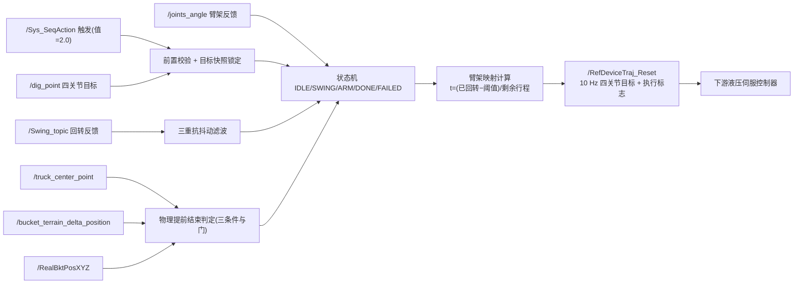
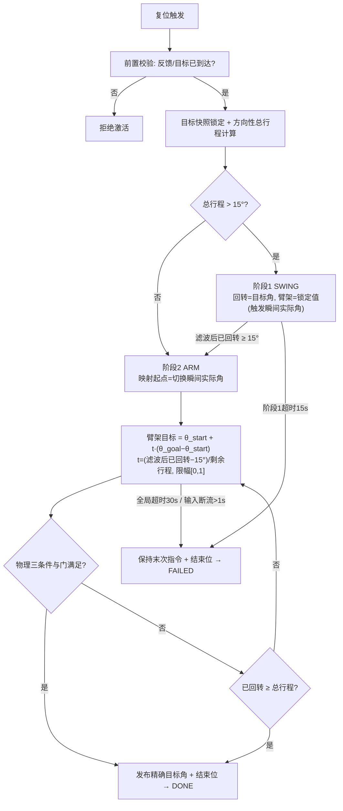
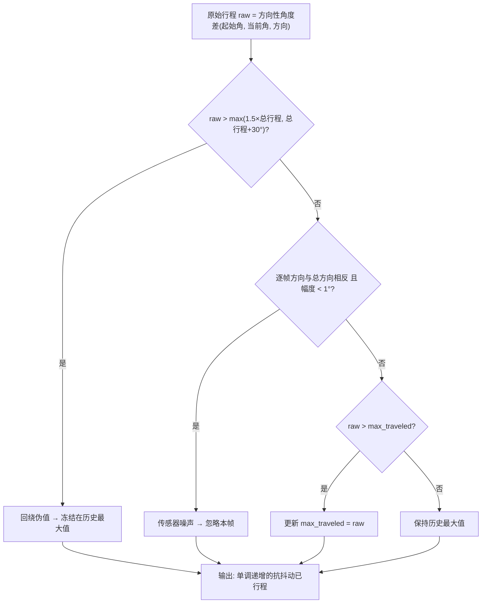
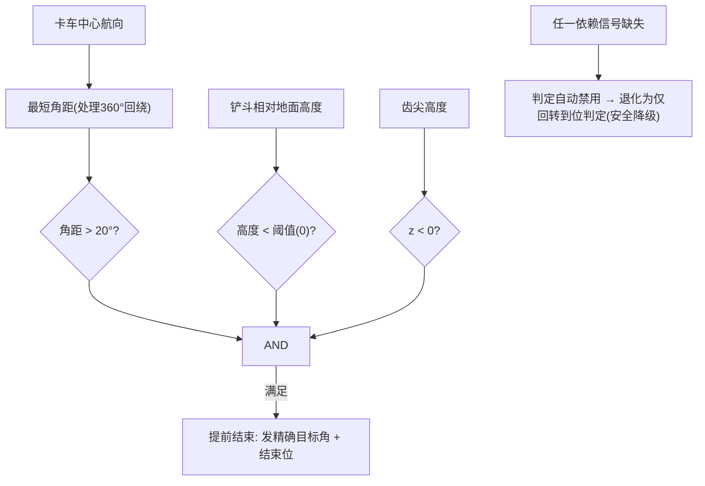

# 专利技术交底书

## 一种基于回转剩余行程映射的挖掘机复位轨迹控制方法与系统

---

## 1. 检索结论

### 1.1 检索条件

| 项 | 内容 |
|:---|:---|
| 检索平台 | Google Patents（含 CN/US/WO 页面）、Justia Patents、转果果（imaibj）专利库、PatSnap Eureka 公开页、中国机械工程学会期刊网 |
| 中文检索词 | 挖掘机/装载机械/装载机 + 复位/返回/返回挖掘点/空斗回转 + 回转/动臂/斗杆 + 协调/联动/同步/复合动作 + 轨迹规划/进度/行程映射 + 自动铲装/自动装车循环 |
| 英文/日文检索词 | excavator / loading machine + return-to-dig / return to dig position + swing + boom/arm coordination + automatic excavation work cycle + 積込機械 + 目標位置 + 自動制御 |
| 检索时间 | 2026-09-01（本次实际网络检索） |
| ⚠️ 信息层级说明 | 下表文献均为**真实可溯源公开文献**（附来源）；受本次网络环境限制，Google Patents 全文页面多次抓取超时，多篇仅获取到**摘要/权利要求片段级**信息，**权利要求逐条比对必须由代理人调取全文后复核**。凡本文档标注"未见公开"者，均指"在已获取的摘要/片段级信息中未见"，不等于全文未公开。 |

### 1.2 国内相近专利 8 篇

| 序号 | 公开号 | 名称 | 申请人 | 技术要点（摘要/片段级） | 相关度 |
|:---:|:---|:---|:---|:---|:---:|
| **CN-1** | **CN121336020A** | 装载机械的控制装置、装载机械的控制方法以及远程操作系统 | 株式会社小松制作所（PCT 进入中国，申请号 202480040593，申请人全文核实） | 在**使作业工具从装载对象之上移动到装载对象外侧的目标位置**的自动控制时，**根据从自动控制开始时工作装置所朝向的方向到工作装置朝向目标位置的方向为止的目标回转角度，决定工作装置的移动速度**，并输出使工作装置以该速度移动的信号 | ★★★★★（**全案最接近**：场景、目标、回转主导均一致） |
| **CN-2** | **CN112639210B** | 装载机械的控制装置及控制方法 | 株式会社小松制作所 | 明确记载"**在装载点进行排土后，自动地移动到挖掘点**"的需求与实现；回避位置特定部基于装载对象位置及形状特定干涉回避位置 | ★★★★（复位场景 + 干涉回避，与卸载案共用文献） |
| CN-3 | CN111733918B | 挖掘机卸料作业辅助系统及轨迹规划方法 | — | 卸料轨迹含**转折点约束**与路径最短选择（含返回段），离线规划后执行 | ★★★（卸载案同一文献，复位段属其整体轨迹的一部分） |
| CN-4 | CN120196949A | 挖掘机自动装车的轨迹规划方法、装置、电子设备及介质 | — | 环境感知 + **多个目标部位实时关节位置信息**，经端对端模型预测未来预设数目个时间步的目标轨迹点（装车全流程，含返回语义） | ★★★（学习式路线，进度基准仍为时间步） |
| CN-5 | CN110258711B | 装载机自动铲装触发方法及铲装控制方法 | — | 以**动臂大腔压力与车速组合**自动识别触发自动铲装；操纵控制铲斗放平与动臂下降贴地 | ★★★（循环自动化触发与收斗/降臂动作序列，代表"顺序动作"路线） |
| CN-6 | CN117739991A | 一种挖掘机最优作业轨迹规划方法、装置、设备及介质 | 华侨大学 | 分段优化轨迹平滑连续性，兼顾满斗率、效率与能耗 | ★★ |
| CN-7 | CN114819256A | 一种反铲式挖掘机连续实时轨迹规划方法 | — | 构建物理信息神经网络实现连续实时轨迹规划 | ★★ |
| CN-8 | CN103628518A | 一种复合动作优先控制系统、方法及挖掘机 | — | 工作油路 + 先导控制油路中设第一/第二动作阀，对**复合动作**进行优先级控制（液压流量层面） | ★★（复合动作的液压执行基础，背景文献） |

### 1.3 国际相近专利 2 篇

| 序号 | 公开号 | 名称 | 申请人 | 技术要点（摘要/片段级） | 相关度 |
|:---:|:---|:---|:---|:---|:---:|
| **F-1** | **US5446980A** | Automatic excavation control system and method（自动挖掘控制系统及方法） | （申请人全文核实，历史归属 Caterpillar 系） | 明确记载 **"return-to-dig means for producing boom, stick, and swing command signals to move the work implement from the dump location to a dig location"**（产生动臂、斗杆与回转指令信号，将工作装置从卸载位置移动到挖掘位置的**复位手段**）；说明书含 RETURN-TO-DIG 标志位、"boom-down"顺序流程等片段 | ★★★★★（**国际最接近：明确公开复位功能及其三关节指令生成**） |
| F-2 | US9567725B2 | Swing automation for rope shovel（绳铲回转自动化） | Joy Global / Komatsu Mining | 对挖掘→回转→卸载→**回转返回（swing-to-dig）**运动提供分级自动化；控制器含理想路径生成，接收铲斗与目标位置数据 | ★★★（段式作业自动化，含返回回转段） |

> **同族/邻域补充核实**（不计入上述 2 篇，均已确认真实存在，查新时须一并调取）：
> - **US5065326A**（Automatic excavation control system and method）：F-1 的在先同族/关联文献，"自动控制系统与方法控制挖掘机工作装置执行**完整挖掘作业循环**"——复位是该循环的组成段；
> - **WO2025022923A1 / US12686991 / JP7245581B2**（小松，干涉回避位置族）：已在《卸载轨迹规划》交底书中详述，本案中作为复位起点（厢上→外侧）的邻域文献；
> - **CN121336020A 的国际同族**（PCT 申请 202480040593 对应的 WO/JP 公开）：须调取以核实其对"移动速度决定"的完整限定。

### 1.4 需同步关注的非专利文献（NPL，可用作对比文件）

| 编号 | 文献 | 关键公开内容 | 风险 |
|:---:|:---|:---|:---:|
| NPL-1 | 《挖掘机回转装车工况下轨迹规划方法研究》（中国机械工程学会期刊） | 将回转装车分解为挖掘、举升回转、卸载、**空斗回转**四动作组合，并公开"**基于五次多项式的空斗回转过程轨迹规划**"（复位段的关节空间曲线拟合） | ⚠️ 高（复位段的关节空间时间曲线规划已被公开） |
| NPL-2 | 《挖掘机的最优时间轨迹规划》（机械工程学报 2019） | 4-3-3-3-4 多项式关节角分段插值，以角速度/角加速度为约束的最优时间规划 | 中 |
| NPL-3 | 《微型挖掘机轨迹规划与跟踪控制》（公开技术文档） | 将挖掘动作分解为挖掘、提臂、回转、卸料、**返回**五阶段，各阶段 5-4-4-4-5 分段多项式插值 | 中 |
| NPL-4 | *Practical Full Automation of Excavation and Loading for Hydraulic Excavators*（Yoshida 等） | 液压挖掘机实际尺度全自动"挖掘—装载"序列，含作业段自动切换（隐含复位段） | 中 |

### 1.5 检索结论

1. **复位场景本身已被公开**：F-1（US5446980A）以权利要求级语言公开了"产生动臂、斗杆、回转指令信号把工作装置从卸载位置移动到挖掘位置"的复位手段；CN-1（CN121336020A）公开了"装载对象之上→外侧目标位置"的自动控制、**按目标回转角度决定工作装置移动速度**，且全文核实其权 5~7 进一步公开**回转角度—高度函数**与**按目标回转角度的区间切换定时**（与本案两阶段思想局部重合，划界论证见 2.1A）；CN-2（CN112639210B）公开了"排土后自动移动到挖掘点"。**因此"挖掘机卸载后自动返回挖掘点"这一上位主题不具备新颖性**；

2. **现有技术的进度基准只有两种：时间与示教/预设曲线。** F-1 的复位手段按预定顺序产生指令信号（boom-down 等），CN-1 按目标回转角度开环决定速度，NPL-1/2/3 均以时间多项式规划关节曲线，CN-4 以"未来时间步"预测——**未检索到以"某一关节的实际已转行程（反馈量）实时映射其余关节进度"的方案**。本发明的核心机制（回转剩余行程映射臂架进度）在角度域而非时间域建立进度基准，这是与全部 10 篇专利 + 4 篇 NPL 的根本分野；

3. **未检索到公开的配套执行层机制**：①回转先行 + 臂架**锁定值**（非实时值）保持的两阶段安全时序；②映射起点取阶段切换瞬间实际关节角；③上限截断（1.5 倍 + 30° 双裕度）+ 方向一致性（反向 <1° 剔除）+ 累计非递减的三重抗抖动行程滤波；④卡车脱离角距 + 铲斗高度 + 齿尖触地三条件与门的物理提前结束（含话题缺失自动降级）；⑤异常中止保持末次指令的无冲击终止；⑥激活瞬间目标快照锁定——上述机制组合均未检索到近似公开；

4. ⚠️ **必须正视 CN-1 的接近程度**：CN-1 与本发明同属"卸载后→外侧/挖掘点"的自动控制，同样以回转角度为核心变量。区别在于：CN-1 用目标回转角度**开环决定移动速度**（速度确定后即按该速度执行，无反馈闭环的进度概念）；本发明用回转**实际已转行程的反馈**实时映射臂架进度。若代理人调取全文后确认 CN-1 亦含"按回转实际角度调整其余动作"的闭环描述，独权须进一步收窄至"锁定值保持 + 三重滤波 + 物理提前结束"的具体组合（第 6 节已预留该退路）；

5. ⚠️ **风险预警**：
   - **R-A**：F-1（US5446980A）申请于 1990 年代，早已过保护期，**不构成授权障碍但构成最有力的背景文献**，审查中大概率被引为"复位功能已公知"的依据；本案创造性的全部论证必须集中于**进度基准从时间域转移到角度域**这一机制及其配套滤波/锁定/降级；
   - **R-B**：CN-1（CN121336020A）与 CN-2（CN112639210B）为**在华有效的小松专利**，本项目复位功能（卸载后自动返回挖掘点）在实施层面需评估是否落入其权利要求范围——与《卸载轨迹规划》交底书的 FTO 风险同源（见 6.5 节）；
   - **R-C**：本节为工程师公开数据库检索（多篇仅至摘要/片段级），未使用付费专业数据库。正式申请前必须委托查新，并专项排查小松、日立建机、卡特彼勒（含其 Return-to-Dig 产品功能相关专利族）、利勃海尔、沃尔沃，以及国内三一/徐工/柳工/临工的自动装车循环类申请。

---

## 2. 最接近现有技术详细对比分析

> 经 1.2/1.3 两表比对，**全案最接近现有技术选定为 CN-1：CN121336020A《装载机械的控制装置、装载机械的控制方法以及远程操作系统》**（小松）。选定理由：10 篇专利中唯有 CN-1 同时公开了「卸载结束后的复位场景（作业工具从装载对象之上→外侧目标位置）+ 自动控制 + **以回转角度为核心决策变量**（目标回转角度决定工作装置移动速度）」，技术领域、要解决的技术问题、技术手段方向与本发明最为一致。
>
> 国际以 **F-1（US5446980A）** 为最接近：其以权利要求级语言公开了复位手段本身（boom/stick/swing 三关节指令信号、dump→dig），但不含任何进度映射机制。两者分别作为"场景最接近"与"功能最接近"的对比文件 1 候选。

### 2.1 CN-1 技术方案还原

**（信息层级声明：以下还原基于 CN-1 的真实公开摘要与 2026-09 的全文级核实（权利要求 1~12 及说明书实施例），全文权利要求逐条核实已完成。）**

| 项 | 内容 |
|:---|:---|
| 公开号 | **CN121336020A**（PCT 申请 202480040593 进入中国） |
| 名称 | 装载机械的控制装置、装载机械的控制方法以及远程操作系统 |
| 申请人 | 株式会社小松制作所（同族发明人：根田知树、山村正男、卫藤朋幸；与 CN112639210B 族同源，全文核实） |
| 摘要全文 | "装载机械的控制装置在**使作业工具从装载对象之上移动到装载对象的外侧的目标位置**的自动控制时，**根据从自动控制开始时工作装置所朝向的方向到工作装置朝向目标位置的方向为止的目标回转角度来决定工作装置的移动速度**。控制装置输出使工作装置以决定的移动速度移动的信号。" |

据此还原 CN-1 的技术方案：

1. 卸料完成后，启动自动控制，使作业工具（铲斗）**从装载对象（矿卡）之上移动到装载对象外侧的目标位置**（即复位/脱离动作）；
2. 计算**目标回转角度**：从自动控制开始时工作装置的朝向，到工作装置朝向目标位置的朝向；
3. **根据该目标回转角度决定工作装置的移动速度**（回转角度大/小对应不同速度策略）；
4. 输出使工作装置以该速度移动的信号，完成脱离。

> **结论（2026-09 全文复核后修订）**：CN-1 公开了复位场景与"以回转角度为决策变量"；且全文核实其权利要求 5~7 进一步公开了「回转角度—作业工具高度函数决定移动速度」与「高度恒定第一区间 / 下降第二区间按目标回转角度决定切换定时」（详见 2.1A）。因此原稿"没有阶段时序"的表述**不准确**：CN-1 **有基于目标回转角度的阶段划分**。本发明的区别必须收窄为：**进度基准为回转实际已转行程的实时反馈（闭环）而非目标角度的几何函数（开环）**、锁定触发瞬间实际角而非按函数保持、物理条件提前结束与三重抗抖动滤波——这些仍是本发明的全部区别所在。

### 2.1A CN121336020A 权利要求 5~7 专项对比（2026-09 全文复核增补）

对 CN-1 全文核实后，其权利要求 5~7 与本案的阶段时序思想存在**局部重合**，必须在撰写与答复中划清界限：

| 权利要求 | 全文核实内容 | 与本案的关系 | 划界论证 |
|:---:|:---|:---|:---|
| 权 5 | 决定表示回转体**回转角度与作业工具高度关系**的函数，该函数满足"回转角度与**目标回转角度**一致时作业工具高度与目标位置高度相等"；基于回转角度、作业工具高度与该函数决定作业工具移动速度 | 与本案"回转主导 + 臂架跟随"在思想层面接近 | CN-1 的臂架运动由**事先设计的几何函数 θ→z**决定（开环），自变量是**角度域的目标规划量**；本案由**实际已转行程反馈**驱动进度（闭环），自变量是**实测累计量**。二者虽同为"角度域"，但**一个是按图纸走，一个是按实际进度走**——液压延迟下前者到位时刻漂移，后者恒满足"回转到位 ⇔ 臂架到位" |
| 权 6 | 基于回转角度与函数之间的**高度差**决定移动速度 | 未见公开高度差反馈用于速度调节；本案不以高度差控制 | — |
| 权 7 | 函数具有**高度恒定的第一区间**与**高度向下移动的第二区间**，基于**目标回转角度**决定两区间**切换定时** | 与本案两阶段（锁定保持 → 跟随映射）在结构上最接近 | **切换基准本质不同**：CN-1 按**目标回转角度**（规划值）切换——若回转实际滞后，会在未脱离车厢时提前进入第二区间；本案按**实际已转行程 ≥ 阈值**（反馈值）切换，时序安全由实测保证，且阶段切换瞬间**锁定并持续发布触发瞬间实际角**（对抗重力下沉），CN-1 第一区间按函数保持高度，无锁定值保持机制 |

**全文复核后维持的区别特征清单**（对应 2.2 维度 2/3/5/6/8/9）：
1. 进度基准 = **实际已转行程**（反馈闭环），非目标角度几何函数；
2. 阶段1保持 = **锁定触发瞬间实际关节角恒定发布**，非按函数计算高度；
3. 阶段2映射起点 = 切换瞬间实际角（消除阶段1漂移污染），CN-1 函数连续无此概念；
4. 三重抗抖动滤波（回绕伪值冻结 + 方向一致性 + 累计非递减），全文未见；
5. 物理条件提前结束与传感缺失安全降级，全文未见。

> 答复口径：审查员若引权 5~7 主张"阶段切换与速度决定已公开"，答辩聚焦"**目标角度（规划）vs 实际行程（反馈）**"这一基准差异及其技术后果——前者在液压延迟/负载波动下切换时序与实际位置脱节，本案切换时机由实测回转行程保证，属不同的控制结构，非参数调优。

### 2.2 与 CN-1（及 F-1）的逐维度详细对比

| 序号 | 对比维度 | CN-1（小松）/ F-1 | 本发明 | 是否构成区别 |
|:---:|:---|:---|:---|:---:|
| 1 | 复位场景 | 作业工具从装载对象之上→外侧目标位置（CN-1）；dump location→dig location（F-1） | 卸载位姿→下一挖掘位姿（由上位机 /dig_point 给出四关节目标角） | ❌ 已被公开，不作保护点 |
| 2 | 回转角度的角色 | **开环决策输入**：目标回转角度决定移动速度（权 1），且回转角度—高度函数与区间切换定时亦以目标角度为基准（全文核实，权 5~7） | **闭环进度基准**：回转实际已转行程实时映射臂架三关节进度 | ✅ **最强区别**（规划基准 vs 反馈基准） |
| 3 | 臂架动作的进度来源 | 未见公开臂架进度如何产生（F-1 按预定顺序发 boom/stick 指令） | t =（已回转行程 − 切换阈值）/（总行程 − 切换阈值），θ(t) = θ_start + t·(θ_goal − θ_start) | ✅ 强区别 |
| 4 | 阶段时序 | **有基于目标回转角度的区间划分**（全文核实，权 7：高度恒定第一区间 / 下降第二区间，按目标回转角度决定切换定时） | **两阶段**：阶段1回转先行 + 臂架锁定值保持（脱离危险区）→ 已回转 ≥ 阈值（优选 15°）切阶段2臂架跟随映射；总行程 ≤ 阈值时跳过阶段1 | ✅ **强区别**（切换基准：目标角规划值 vs 实际行程反馈值） |
| 5 | 臂架保持方式 | 未见公开 | 锁定**触发瞬间实际关节角**（非实时值）持续发布，控制器有明确纠偏目标，对抗重力下沉 | ✅ 区别 |
| 6 | 映射起点 | 未见公开 | 取**阶段2触发瞬间**实际关节角，消除阶段1液压漂移污染 | ✅ 区别 |
| 7 | 对液压延迟的适应 | 速度开环设定，延迟导致到位时刻漂移 | 进度基准为实际反馈：回转慢则臂架自动放慢，**复位总时长恒等于回转实际时长** | ✅ 强区别（设计哲学） |
| 8 | 传感器噪声/360°回绕 | 未见公开 | **三重抗抖动滤波**：①上限截断（> max(1.5×总行程, 总行程+30°) 判回绕伪值并冻结）②方向一致性（逐帧反向且幅度<1° 判噪声剔除）③累计非递减（进度单调递增） | ✅ 强区别 |
| 9 | 结束判据 | 未见公开（隐含为到达目标位置） | **双结束判据**：①回转到位/超调（traveled ≥ 总行程）发精确目标角消除映射残差；②物理条件提前结束（卡车脱离角距 > 20° ∧ 铲斗高度 < 阈值 ∧ 齿尖 z < 0） | ✅ 强区别 |
| 10 | 传感缺失处理 | 未见公开 | 物理判定依赖话题任一缺失 → 判定自动禁用，**安全降级**为仅回转到位判定 | ✅ 区别 |
| 11 | 目标变更处理 | 未见公开 | **目标快照锁定**：激活瞬间锁定四关节目标，执行期上游刷新不影响，防进度基准与目标不一致 | ✅ 区别 |
| 12 | 异常中止 | 未见公开 | 保持**末次指令**并置结束位（不跳向目标角），无阶跃中止；阶段1超时 15 s / 全局超时 30 s / 输入断流 > 1 s 三重兜底 | ✅ 区别 |
| 13 | 执行方式 | 输出速度信号（CN-1） | 10 Hz 流式发布关节目标角帧（含执行标志位），供下游控制器逐帧跟踪 | ✅ 区别（弱） |

### 2.3 区别特征、技术问题与技术效果的对应

| 区别特征（对应独权序号） | CN-1 / F-1 未解决的技术问题 | 本发明技术效果 |
|:---|:---|:---|
| ③ 回转实际行程映射臂架进度（维度 2/3/7） | 现有复位的进度基准是时间（多项式曲线/顺序时序）或开环速度设定；液压延迟（数十至数百毫秒）、死区、负载依赖使实际进度与理论进度持续偏离，"同时到位"退化为"先后散乱到位"，末端冲击大 | 进度基准从时间域转移到角度域：回转慢则臂架自动放慢、快则加快，"回转到位 ⇔ 臂架到位"恒成立；**复位总时长恒等于回转实际时长**，无需液压模型与参数整定 |
| ④ 两阶段时序 + 锁定值保持（维度 4/5） | 卸载结束时铲斗位于车厢正上方，臂架先动（尤其下落）必然撞击车厢；现有复位无此安全时序意识 | 阶段1回转先行，时序上保证"先脱离、后调整"，本质防碰撞；臂架锁定触发瞬间实际角（非实时值），控制器持续纠偏对抗重力下沉 |
| ⑤ 映射起点取阶段切换瞬间实际关节角（维度 6） | 阶段1的液压漂移（锁定纠偏过程）会污染阶段2的理论起点 | 阶段间误差不累积，映射基准始终为真实状态 |
| ⑥ 三重抗抖动行程滤波（维度 8） | 回转编码器噪声与 360° 回绕（359°→1° 跳变近 360°）产生伪进度，导致阶段来回切换、臂架指令抖动甚至反向 | 进度单调递增，杜绝阶段振荡与进度回退；双裕度（1.5 倍 + 30°）避免小行程场景误判正常液压超调 |
| ⑦ 物理条件提前结束 + 安全降级（维度 9/10） | "关节角到位 ≠ 物理任务完成"；回转机械到位但铲斗未达挖掘面时仍空等，浪费循环时间；传感缺失时判定失效 | 物理三条件与门满足即结束，压缩无效等待；任一依赖话题缺失自动禁用并降级为回转到位判定——**功能降级而非失效** |
| ⑧ 目标快照锁定 + 末次指令保持中止（维度 11/12） | 上游目标中途刷新使回转指令跳变而进度基准仍为旧值；中止瞬间跳向目标角给液压系统大阶跃 | 全生命周期指令连续无阶跃，液压冲击与结构疲劳显著降低 |

**创造性论证要点（三步法）**：

1. **最接近现有技术**：CN-1（CN121336020A），国际候选 F-1（US5446980A）；

2. **区别技术特征**：上表 ③~⑧（角度域进度映射、两阶段时序与锁定保持、映射起点刷新、三重行程滤波、物理提前结束与降级、快照锁定与无冲击中止）；

3. **是否显而易见**：
   - **单篇看**：CN-1 的控制逻辑是"**目标回转角度 → 决定速度/高度函数 → 按值执行**"的开环链条（含权 5~7 的几何函数与区间切换，详见 2.1A）。其问题意识停留在"脱离运动取什么速度/什么姿态轨迹合适"，**不存在**"多关节如何同步到位"与"进度用什么量做基准"的问题意识——权 5~7 的"回转角度"自变量是**目标规划值**，与实际回转是否滞后无关；F-1 按预定顺序（boom-down 等）产生指令信号，同样是时间表/顺序表思维。两者均不含改进为"以回转实际行程驱动臂架进度"的技术启示；
   - **结合看**：即便引入 CN-3（转折点约束离线轨迹）、CN-6/CN-7/NPL-1~3（时间多项式规划）或 CN-8（复合动作液压优先）作为对比文件 2，其技术链条仍属"**如何算出/分配更好的时间曲线或流量**"——全部以时间为自变量。**把一个关节的实际反馈行程当作其余关节的自变量**，是把控制结构从"时间参数化"反转为"几何进度参数化"，这一反转的动机只有在认识到"液压延迟使时间基准必然失效、而复位中最长行程关节恰好是安全主导关节（回转）"这两个事实的结合后才能产生，现有技术中未见该问题意识；
   - **反向佐证**：Cat 系产品化的 Return-to-Dig 功能（紧凑型装载机/滑移装载机）及 F-1 均长期停留在时间/顺序基准上，行业并未自发转向角度域映射，佐证其非显而易见；
   - 因此 ③+④+⑥ 的组合非显而易见，且带来 CN-1 无法取得的技术效果：**复位总时长自适应等于回转实际时长、对液压延迟免疫、进度判定对传感器噪声与回绕鲁棒、任何异常都在有界时间内安全终止**。

### 2.4 与国内文献的补充对比

#### 2.4.1 与 CN-5（CN110258711B，顺序动作路线代表）的对比

| 对比维度 | CN-5（装载机自动铲装） | 本发明 | 差异性质 |
|:---|:---|:---|:---|
| 动作组织 | 触发识别（大腔压力 + 车速）后按**动作序列**执行（放平→下降贴地→…） | **两阶段并行**：回转与臂架在阈值后重叠执行 | ✅ 区别（串行序列 vs 进度耦合并行） |
| 进度基准 | 动作完成即切换（隐含时间/压力事件） | 角度域实时映射 | ✅ 强区别 |
| 适用对象 | 装载机（平移铲装） | 挖掘机（回转主导的卸载-复位循环） | 场景区别 |

> CN-5 代表"顺序动作"路线，是背景技术第（1）类的真实文献支撑；撰写时可引为顺序策略的例证以凸显本发明的效率增益。

#### 2.4.2 与 CN-4（CN120196949A，学习式路线）的对比

| 对比维度 | CN-4 | 本发明 | 差异性质 |
|:---|:---|:---|:---|
| 轨迹产生 | 端对端模型预测**未来预设数目个时间步**轨迹点 | 无预测：实时映射当前进度 | ✅ 强区别 |
| 数据依赖 | 人工操作数据集训练 | 无训练依赖，参数可实测回填 | ✅ 区别 |
| 可解释性 | 黑箱 | 每一步判定可写入验收规程 | ✅ 区别 |

> CN-4 申请日（2025-03-21）早于本案，"实时关节位置信息"表述已在先公开，独权中避免使用该措辞。

### 2.5 独权收窄策略说明（本版核心调整）

检索已证实：复位场景（F-1、CN-1、CN-2）、"按目标回转角度决定移动速度"（CN-1）、关节空间时间曲线规划（CN-3、NPL-1~3）、多关节协调的液压执行（CN-8）均已公开。原稿独权若停留在"臂架进度由回转剩余行程映射"的单一特征主张，审查中可能被 CN-1（回转角度决定运动参数）结合 F-1（复位指令生成）质疑。本版据此**主动将独权构造为机制组合**：

| 固化特征 | 收窄前（原稿上位表述） | 收窄后（写入独权的具体特征） | 收窄理由 |
|:---|:---|:---|:---|
| 进度映射 | "臂架目标角由回转剩余行程映射" | 映射式显式化：**t =（抗抖动滤波后的已回转行程 − 切换阈值）/（总行程 − 切换阈值），t 限幅 [0,1]**；映射起点取**阶段切换瞬间实测关节角**；回转到位/超调时直接发布精确目标角消除残差 | 映射式 + 反馈起点 + 残差消除三者构成完整闭环，与 CN-1 的开环速度决定字面区分 |
| 两阶段时序 | "回转先行、臂架后动" | **阶段1发布回转目标角 + 臂架锁定值（触发瞬间实测角，非实时值）**；滤波后已回转行程 ≥ 切换阈值切阶段2；**总行程 ≤ 阈值则跳过阶段1** | "锁定值非实时值"与"跳过边界"是具体机制，区分度高 |
| 行程滤波 | "对回转行程滤波防抖" | **上限截断（双裕度：1.5 倍总行程且总行程 + 30°）+ 逐帧方向一致性（反向且幅度 <1° 剔除）+ 累计非递减**三者组合 | 三重滤波各自针对特定失效（回绕伪值/反向噪声/进度回退），组合的具体参数与判据不易被泛化覆盖 |
| 结束与中止 | "满足条件提前结束，异常安全中止" | 物理三条件**与门**（回转-卡车最短角距 > 阈值 ∧ 铲斗相对地面高度 < 阈值 ∧ 齿尖高度 < 0）+ **依赖信号缺失自动禁用降级**；中止时**保持末次指令**并置结束位 | 与门 + 降级 + 末次指令保持是功能安全设计细节，审查区分度高 |

**收窄代价**：独权绑定"两阶段 + 剩余行程映射 + 三重滤波"的具体组合。若竞品采用单阶段全程映射、或以动臂行程为基准反向映射回转、或以时间比例降级映射等替代，则不落入独权——相关分支转入**从属权利要求 + 分案储备**（见 6.4 节）。

---
## 3. 背景技术

### 3.1 别人现在怎么做？

挖掘机卸载结束后返回下一个挖掘点（下称**复位**）的控制，现有实现可归为五类：

**（1）顺序动作策略。** 以 **CN110258711B（装载机自动铲装触发方法及铲装控制方法）** 类文献所代表的作业循环组织方式为典型：识别触发条件后按**动作序列**执行——先回转至目标方向并完全到位，再依次调整动臂、斗杆、铲斗至目标姿态。各关节串行动作、互不重叠。

**（2）时间表同步策略。** 离线为各关节分别生成时间-角度曲线（多项式/梯形速度曲线），执行时按各自时间表同步运动，理论上同时到位。学术界对复位段的此类规划已有充分公开：《挖掘机回转装车工况下轨迹规划方法研究》公开了**基于五次多项式的空斗回转过程轨迹规划**；《挖掘机的最优时间轨迹规划》（机械工程学报 2019）公开了 4-3-3-3-4 多项式分段插值；亦有文献将作业分解为挖掘、提臂、回转、卸料、**返回**五阶段并以 5-4-4-4-5 分段多项式插值。

**（3）预定顺序指令策略。** 以 **US5446980A（Automatic excavation control system and method）** 为代表：系统含明确的 **return-to-dig means**——"产生动臂、斗杆与回转指令信号，将工作装置从卸载位置移动到挖掘位置"，说明书含 RETURN-TO-DIG 标志位与按预定顺序（boom-down 等）推进的流程。其同族 **US5065326A** 公开了控制工作装置执行完整挖掘作业循环。

**（4）开环速度决定策略。** 以 **CN121336020A（小松，装载机械的控制装置）** 为代表：在使作业工具从装载对象之上移动到外侧目标位置的自动控制时，**根据从自动控制开始时工作装置的朝向到朝向目标位置为止的目标回转角度，决定工作装置的移动速度**，并输出按该速度移动的信号。速度一经决定即按值执行，无反馈进度概念。

**（5）学习式轨迹生成。** 以 **CN120196949A** 为代表：端对端模型基于环境感知与实时关节位置预测未来预设数目个时间步的轨迹点，装车全流程（含返回语义）由模型给出。

另有液压执行层面的配套文献：**CN103628518A（复合动作优先控制系统）** 在工作油路与先导控制油路中对复合动作设优先级阀组；**CN112639210B** 公开了"在装载点排土后自动移动到挖掘点"的功能需求与干涉回避位置构造。

### 3.2 这样做有哪些缺点？

上述方法的共同问题是：**复位进度的基准是"时间"、"预定顺序"或"开环速度值"，而非执行器的实际物理进度**。液压挖掘机执行链（先导→主阀→油缸→连杆）存在数十至数百毫秒量级延迟、阀口死区、流量饱和与负载依赖，回转与臂架同时动作时还相互抢流量，理论进度与实际进度必然持续偏离。由此产生五个具体缺陷：

| 编号 | 缺点 | 机理 |
|:---:|:---|:---|
| ① | **复位效率低** | 顺序动作（1）的复位总时长 = 回转时长 + 臂架时长；臂架等待回转完全到位才开始动作，典型矿山装车工况（回转 90°~180°）浪费 30%~50% 复位时间 |
| ② | **到位时刻失控** | 时间表同步（2）与预定顺序（3）假设各关节精确跟踪预设曲线；液压延迟使实际相位漂移，"同时到位"退化为"先后散乱到位"，末端冲击大 |
| ③ | **安全隐患** | 卸载结束时铲斗位于车厢正上方。离线播放、示教回放与开环速度策略均无在线安全时序意识：若臂架先于回转动（尤其下落），或回转未脱离卡车上方时臂架已动作，存在铲斗撞击车厢风险 |
| ④ | **进度误判** | 回转编码器存在量化噪声与 360° 回绕（359°→1° 瞬间角度差跳变近 360°）。直接按角度差计算进度会产生伪进度，导致阶段误切换、进度回退、臂架指令抖动甚至反向，现有方案均未处理 |
| ⑤ | **中止冲击** | 异常中止（超时/撤销）时，现有方案或跳向目标角、或直接停发指令，给液压系统一个大阶跃，引起压力冲击与臂架抖动 |

**本发明要解决的技术问题**：

> **如何在不依赖液压模型、不预测到位时刻的前提下，实现回转与臂架的安全并行复位——复位总时长自适应等于回转实际时长；同时在编码器噪声与 360° 回绕下进度判定鲁棒、异常中止无阶跃、上游目标中途刷新不引起指令跳变。**

---

## 4. 发明内容

### 4.1 核心思想

本发明提出一种**基于回转剩余行程映射的挖掘机复位轨迹控制方法**。复位过程中，回转是行程最长、耗时最久、且直接决定碰撞风险的关节。本发明的核心思想是把进度基准从时间域转移到角度域：

> **以回转的实际已转行程（反馈量）作为臂架三关节的统一进度基准——回转转到哪里，臂架就映射到哪里；回转到位，臂架恰好同步到位。复位总时长恒等于回转实际时长，与液压延迟无关。**

围绕这一基准，配套五项机制：

1. **两阶段安全时序**：阶段1回转先行、臂架锁定值保持（先脱离卡车上方）；已回转超过切换阈值后进入阶段2，臂架按回转剩余行程映射跟随；
2. **映射起点刷新**：阶段2的映射起点取切换瞬间的实际关节角，消除阶段1液压漂移污染；
3. **三重抗抖动行程滤波**：上限截断 + 方向一致性 + 累计非递减，保证进度单调递增、杜绝阶段振荡；
4. **物理条件提前结束**：卡车脱离角距 ∧ 铲斗高度 ∧ 齿尖触地三条件与门，物理完成即结束；依赖信号缺失自动禁用降级；
5. **无阶跃全生命周期**：激活瞬间目标快照锁定、异常中止保持末次指令，任何时刻指令连续。

### 4.2 方法步骤

#### 步骤 S1：接收复位触发与前置校验

S1.1 接收上位机复位触发信号（激活值，例如数据帧值 2.0）。已在执行中则忽略重复触发；执行中收到非复位信号则按外部撤销处理（S7）。

S1.2 前置校验：关节角反馈、回转角反馈、四关节目标角（上位机已预计算的挖掘点姿态：swing/boom/arm/bucket）均须已收到，否则拒绝激活。

#### 步骤 S2：目标快照锁定与方向性总行程计算

S2.1 **目标快照锁定**：将激活瞬间的四关节目标角锁定为执行快照，执行期间一律使用快照值——上游目标话题中途刷新不影响正在执行的复位，防止回转指令跳变而进度基准（起始角/方向/总行程）仍为旧值的不一致状态。

S2.2 记录起始回转角，计算**回转方向**（最短方向）与**方向性总回转行程**（方向性角度差，正确处理 360° 回绕，例如 359°→1° 顺时针实际行程为 2° 而非 −358°）。

S2.3 重置进度滤波状态（已行程历史最大值清零、上一帧回转读数置为起始角）与末次指令缓存。

#### 步骤 S3：阶段划分决策

总回转行程 > 切换阈值（优选 **15°**）→ 进入阶段1（S4）；否则**跳过阶段1**直接进入阶段2（S5）。

#### 步骤 S4：阶段1——回转先行，臂架锁定值保持

S4.1 以固定频率（优选 **10 Hz**）流式发布指令帧：**回转 = 目标终点角，动臂/斗杆/铲斗 = 锁定值**。锁定值取**进入阶段瞬间的实际关节角**（而非实时反馈值）——若发实时值，控制器误差恒为零、无纠偏目标，无法对抗重力下沉；锁定后控制器持续纠偏保持在锁定位置。

S4.2 每周期更新**抗抖动已回转行程**（S6 的三重滤波），当滤波后行程 ≥ 切换阈值（优选 15°，铲斗已脱离卡车上方）时切换至阶段2（S5）。

S4.3 阶段1超时保护（优选 **15 s**）：未达阈值即异常中止（S7）。

#### 步骤 S5：阶段2——臂架跟随回转剩余行程映射

S5.1 **映射起点刷新**：进入阶段2瞬间，取当前实测的动臂/斗杆/铲斗角作为映射起点 θ_start（消除阶段1锁定纠偏期间的液压漂移）；阶段2对应的回转剩余行程 = max(0, 总行程 − 切换阈值)。

S5.2 每周期计算进度并映射：

```
t = (滤波后已回转行程 − 切换阈值) / 回转剩余行程，t 限幅 [0, 1]
θ_joint = θ_start + t · (θ_goal − θ_start)，joint ∈ {boom, arm, bucket}
```

回转指令保持目标终点角。**回转慢则臂架自动放慢、回转快则自动加快**——进度由回转实际反馈驱动，与液压延迟无关。

S5.3 **双结束判据**：
- **回转到位/超调**（滤波后行程 ≥ 总行程）：直接发布精确四关节目标角并置结束位，消除映射残差；
- **物理条件提前结束**（见 S6 三条件与门）：满足即发布精确目标角并置结束位，不必等待回转机械到位。

#### 步骤 S6：三重抗抖动行程滤波与物理提前结束判定

**三重滤波**（对每帧方向性原始行程依次施加）：

1. **上限截断**：原始行程 > max(1.5 × 总行程, 总行程 + 30°) → 判为 360° 回绕伪值，进度冻结在历史最大值。**双裕度判据**（比例裕度与绝对裕度同时满足）避免小行程场景（如总行程 12°）下正常液压超调被误判为回绕；
2. **方向一致性**：逐帧方向与总方向相反且幅度 < 1° → 判为传感器噪声，忽略本帧进度更新；
3. **累计非递减**：已行程历史最大值单调递增，仅当原始行程超过历史最大值才更新——进度永不回退。

**物理提前结束判定**（三条件与门）：

```
(卡车脱离角距 > 安全阈值) ∧ (铲斗相对地面高度 < 高度阈值) ∧ (齿尖高度 < 0)
```

- 卡车脱离角距：当前回转角与卡车中心航向的**最短角距**（已处理 360° 回绕）> 安全阈值（优选 **20°**），即铲斗已脱离卡车上方；
- 铲斗相对地面高度低于阈值（优选 **0**，即已降至挖掘面以下高度带）；
- 齿尖已接近/到达挖掘面（z < 0）。

**安全降级**：三个依赖信号（卡车中心、铲斗-地形高差、齿尖位置）任一未收到 → 该判定**自动禁用**，退化为仅靠回转到位判定——功能降级而非失效。

#### 步骤 S7：多重安全保护与无冲击中止

- **阶段1超时**（优选 15 s，回转卡死/过慢）、**全局超时**（优选 **30 s**，从触发起计、覆盖两阶段）、**输入新鲜度检查**（关节/回转反馈静默 > **1 s** 即判传感器断流）——三重兜底，任一触发即异常中止；
- **异常中止/外部撤销**：**保持末次发布的指令值**并置结束位，不发布目标角、不直接停发——避免中止瞬间给控制器大阶跃，控制器平稳接管；
- 正常完成与提前结束均发布精确目标角 + 结束位，供下游无缝衔接下一作业段。

### 4.3 系统组成

| 模块 | 职责 | 关键参数（优选值） |
|:---|:---|:---|
| **角度工具模块** | 方向性角度差、角度归一化、最短方向判断（纯函数层，无中间件依赖、可独立单测） | 360° 回绕处理 |
| **输入与触发模块** | 接收复位触发、关节/回转反馈、四关节目标、卡车中心与物理判定信号 | 激活值 2.0 |
| **前置校验模块** | 激活前校验反馈与目标是否已到达 | — |
| **目标快照模块** | 激活瞬间锁定四关节目标，执行期一律使用快照 | — |
| **状态机模块** | IDLE / **SWING（阶段1）** / **ARM（阶段2）** / DONE / FAILED 五态；阶段划分与切换 | 切换阈值 15° |
| **抗抖动滤波模块** | 上限截断 + 方向一致性 + 累计非递减 | 1.5 倍且 +30° 双裕度；反向噪声 1° |
| **臂架映射模块** | 进度映射与起点刷新、残差消除 | t ∈ [0,1] 限幅 |
| **物理判定模块** | 三条件与门提前结束 + 信号缺失安全降级 | 角距阈值 20°；高度阈值 0 |
| **安全监控模块** | 阶段超时、全局超时、输入断流检测 | 15 s / 30 s / 1 s |
| **流式发布模块** | 固定频率逐帧发布四关节目标 + 执行标志位；末次指令缓存 | 10 Hz |

**状态机流转**：

```
IDLE ──触发 + 前置校验通过 + 快照锁定──> 方向性总行程计算
                                          │
                     总行程 ≤ 15°（跳过阶段1）│         总行程 > 15°
                          ┌───────────────┴───────────────┐
                          ▼                                ▼
                     ARM 阶段2 ◄── 滤波后已回转 ≥ 15° ── SWING 阶段1
                     │ 臂架按回转剩余行程映射            │ 回转=目标, 臂架=锁定值
                     │ 每帧: ①物理提前结束? ②回转到位?    │ 阶段1超时 15 s → FAILED
                     ▼                                ▼
        物理满足 或 回转到位/超调 → 发精确目标角 + 结束位 → DONE
        全局超时 30 s / 输入断流 > 1 s / 外部撤销 → 保持末次指令 + 结束位 → FAILED/IDLE
```

---
## 5. 本发明的优点

**优点 1：复位时间最优，作业循环效率显著提升。**
顺序动作策略的复位总时长是"回转时长 + 臂架时长"，臂架必须等待回转完全到位才开始动作。本发明在回转转过切换阈值（优选 15°，铲斗已脱离卡车上方）后立即启动臂架调整，且臂架进度与回转剩余行程严格耦合——回转到位瞬间臂架恰好到位，零等待、零冗余。对回转行程占比大的典型矿山装车工况（回转 90°~180°），复位时间从"回转 + 臂架"压缩为"回转"，节省 30%~50% 复位时间，直接缩短单机作业循环。

**优点 2：对液压非线性完全免疫，无需模型辨识与参数整定。**
时间表类方案的根本缺陷是"预测到位时刻"，而液压系统的延迟、死区与负载依赖使该预测不可能准确。本发明把进度基准从时间域转移到角度域：臂架走到哪一步，只看回转实际转到哪——回转慢（重载、油温低、合流抢流量）则臂架映射自动放慢，回转快则自动加快。无论液压特性如何变化、负载如何波动，"回转到位 ⇔ 臂架到位"恒成立。工程上无需建立液压模型、无需整定时间曲线参数，移植到新机型只需配置阈值，部署成本极低。

**优点 3：本质安全的作业时序与在线碰撞防护。**
卸载结束时铲斗位于车厢正上方，此时臂架先动（尤其下落）必然撞击车厢。本发明阶段1强制回转先行、臂架锁定值保持，从时序上保证"先脱离、后调整"；锁定值取触发瞬间实际角（而非实时值），给控制器明确的纠偏目标，对抗重力下沉。阶段2中物理提前结束判定（卡车脱离角距 > 20° ∧ 铲斗高度达标 ∧ 齿尖触地三条件与门）使任务在物理条件满足时立即结束，不必等待回转机械到位。阶段1超时、全局超时、输入断流三重兜底，任一异常都能安全停机。

**优点 4：进度判定对传感器噪声与 360° 回绕强鲁棒。**
回转编码器的量化噪声与 360° 回绕（359°→1° 瞬间跳变近 360°）会产生伪进度，导致阶段来回切换、臂架指令抖动甚至反向。本发明三重滤波各司其职：上限截断以双裕度判据（1.5 倍总行程**且**总行程 + 30° 绝对裕度）识别回绕伪值，避免小行程场景误判正常液压超调；方向一致性剔除逐帧反向小幅度（< 1°）噪声；累计非递减保证进度永不回退。组合效果是进度严格单调递增，杜绝阶段振荡——这是"角度域进度基准"在工程上可用的前提，现有技术均未处理。

**优点 5：全生命周期无阶跃，启停平稳保护液压系统。**
液压系统对指令阶跃极其敏感。本发明在三处关键位置消除阶跃：①激活时锁定目标快照，上游目标中途刷新不造成指令跳变，且进度基准与目标永远一致；②阶段切换时映射起点取当前实际角，t 从 0 连续增长，指令无跳变；③异常中止/外部撤销时保持末次指令并置结束位，而非跳向目标角或直接停发，控制器平稳接管。整个复位过程指令信号连续平滑，显著降低液压冲击与结构疲劳。

---

## 6. 本发明的关键点和保护点

### 6.1 关键点

| 编号 | 关键点 | 说明 | 不可替代性 |
|:---:|:---|:---|:---|
| **K1** | **回转实际行程映射臂架进度**（角度域进度基准） | t =（滤波后已回转 − 切换阈值）/（总行程 − 切换阈值），t ∈ [0,1]；θ(t) = θ_start + t·(θ_goal − θ_start) | 全案灵魂：退化为时间基准即丧失对液压延迟的免疫 |
| **K2** | **两阶段时序 + 臂架锁定值保持** | 阶段1回转=目标角、臂架=触发瞬间锁定值（非实时值）；已回转 ≥ 阈值切阶段2；总行程 ≤ 阈值跳过阶段1 | 锁定值给控制器纠偏目标对抗重力下沉；实时值则误差恒零、无法保持 |
| **K3** | **映射起点取阶段切换瞬间实际关节角** | 消除阶段1液压漂移对映射基准的污染 | 取理论值或触发时旧值会引入阶段间误差累积 |
| **K4** | **三重抗抖动行程滤波** | 上限截断（1.5 倍 + 30° 双裕度）+ 方向一致性（反向 < 1° 剔除）+ 累计非递减 | 无此滤波，360° 回绕与噪声直接破坏阶段切换与映射 |
| **K5** | **物理条件提前结束（三条件与门）+ 安全降级** | 卡车脱离角距 > 20° ∧ 铲斗高度 < 阈值 ∧ 齿尖 z < 0；依赖信号缺失自动禁用 | "关节到位"升级为"物理完成"，压缩无效等待；降级保证传感缺失不失效 |
| **K6** | **回转到位/超调发精确目标角消除残差** | traveled ≥ 总行程时直接发布精确四关节目标 | 映射式在 t→1 附近有量化残差，须显式消除 |
| **K7** | **目标快照锁定** | 激活瞬间锁定四关节目标，执行期不随上游刷新 | 防止回转指令跳变而进度基准（起始角/方向/总行程）仍为旧值 |
| **K8** | **无冲击中止（保持末次指令）** | 异常中止/外部撤销保持末次发布指令并置结束位 | 跳向目标角或停发均产生大阶跃，损伤液压系统 |
| **K9** | **方向性角度差与最短方向计算** | 360° 回绕处理贯穿总行程计算、进度计算与卡车角距计算 | 朴素角度差在回绕处产生伪值，全部进度逻辑的基础 |

### 6.2 保护点（权利要求布局·收窄版）

> **布局前提**：经第 1、2 节检索，复位场景（F-1）、"按目标回转角度决定移动速度"（CN-1）、"排土后自动移动到挖掘点"（CN-2）、关节空间时间曲线规划（CN-3/NPL-1~3）、复合动作液压优先（CN-8）均已公开。独权不得停留在"复位时多关节协调返回"的上位表述，必须以 K1+K2+K3+K4 的机制组合为核心，K5~K8 并列固化。

**独立权利要求 1（方法·收窄版）**

一种基于回转剩余行程映射的挖掘机复位轨迹控制方法，其特征在于，包括：

- **①** 响应复位触发，获取当前四关节角反馈与四关节复位目标角，**锁定触发瞬间的目标角作为执行快照**，并计算回转方向与方向性总回转行程；
- **②** 当所述总回转行程大于切换阈值时，进入第一阶段：向回转关节发布目标回转角，并向动臂、斗杆、铲斗关节**发布进入阶段瞬间的实际关节角作为锁定保持值**；当经滤波的已回转行程不小于所述切换阈值时，进入第二阶段；当所述总回转行程不大于所述切换阈值时，跳过第一阶段直接进入第二阶段；
- **③** 在第二阶段，回转关节保持目标回转角，动臂、斗杆、铲斗关节的目标角按下式映射：**进度 t =（经抗抖动滤波的已回转行程 − 切换阈值）/（总回转行程 − 切换阈值），t 限幅于 [0,1]；目标角 = 映射起点 + t ×（快照目标角 − 映射起点），所述映射起点取进入第二阶段瞬间的实测关节角**；
- **④** 所述抗抖动滤波包括依次施加的三重处理：原始行程超过"总行程的 1.5 倍与总行程加 30° 二者中的较大者"时判定为回绕伪值并冻结进度；逐帧方向与总方向相反且幅度小于设定值时判定为噪声并忽略本帧；已行程历史最大值按非递减方式更新；
- **⑤** 当经滤波的已回转行程不小于所述总回转行程时，发布精确的四关节目标角并置结束标志；当卡车脱离角距、铲斗相对地面高度与齿尖高度三个物理条件同时满足时，提前发布精确目标角并置结束标志，**且三个物理条件所依赖的信号任一缺失时自动禁用该提前结束判定**。

**独立权利要求 2（系统）**：与权利要求 1 对应的模块化系统（角度工具模块、目标快照模块、五态状态机、抗抖动滤波模块、臂架映射模块、物理判定模块、安全监控模块、流式发布模块），其特征在于所述状态机至少包括**回转先行阶段**与**臂架映射阶段**两个执行状态，且在回转先行阶段以锁定保持值发布臂架指令。

**独立权利要求 3（挖掘机）**：一种挖掘机，包括工作装置、液压系统、关节角与回转角传感器、控制器，所述控制器执行权利要求 1 所述方法。

**独立权利要求 4（介质/产品）**：计算机可读存储介质 / 计算机程序产品。

**从属权利要求退路表**

| 序号 | 从属特征 | 退路价值 |
|:---:|:---|:---|
| 从 1 | 切换阈值取 15°；阶段1超时 15 s；全局超时 30 s；输入断流阈值 1 s | 数值退路 |
| 从 2 | 卡车脱离角距阈值取 20°；铲斗高度阈值取 0；齿尖高度判据取小于 0 | 数值退路 |
| 从 3 | 方向一致性噪声幅度阈值取 1° | 数值退路 |
| 从 4 | 以固定频率（优选 10 Hz）流式发布四关节目标与执行标志位 | 机制退路 |
| 从 5 | 异常中止/外部撤销时**保持末次发布指令**并置结束位（K8） | **重要退路**：无冲击中止 |
| 从 6 | 阶段切换时清空/重置进度滤波状态与末次指令缓存 | 机制退路 |
| 从 7 | 回转方向按最短角距确定；卡车脱离角距取顺/逆两方向角度差的较小者（K9） | **重要退路**：回绕处理的具体实现 |
| 从 8 | 重复触发忽略；执行中非复位信号按外部撤销处理 | 机制退路 |
| 从 9 | 卡车中心航向由卡车中心位置坐标经反正切与归一化计算 | 实现退路 |
| 从 10 | 映射残差消除后同时置结束位，供下游作业段无缝衔接 | 机制退路 |
| 从 11 | 角度工具层与中间件解耦（纯函数可单测）的分层架构 | 实现退路 |

**布局说明**：

1. 独权把 K1~K5 捆绑为一体：映射式（含限幅与起点定义）+ 两阶段时序（含锁定值与跳过边界）+ 三重滤波（含双裕度与噪声幅度）+ 双结束判据（含降级）。捆绑虽缩小保护范围，但换来与 CN-1（开环速度决定）和 F-1（预定顺序指令）的字面清晰区别；
2. 独权 ③ 中"**映射起点取进入第二阶段瞬间的实测关节角**"与 ④ 中"**冻结进度/忽略本帧/非递减更新**"的具体动作描述是区分度最高的限定，审查答复时不得轻易删除；
3. 撰写时避免使用"空斗回转轨迹规划""时间曲线插值"等贴近 NPL-1~3 的措辞；避免"根据回转角度决定移动速度"的近似表述（贴近 CN-1）；本案的进度量统一称"**已回转行程**"，控制量统一称"**映射**"而非"速度规划"。

### 6.3 概括层次阶梯（L0~L4）

| 层次 | 表述 | 状态 |
|:---:|:---|:---|
| **L0** | "一种挖掘机复位控制方法：卸载结束后自动控制回转与臂架返回挖掘点" | 🚫 **禁用**——已落入 F-1（US5446980A）/ CN-1（CN121336020A）/ CN-2（CN112639210B）的公开范围，仅保留于说明书防修改超范围 |
| **L1** | L0 + "以回转角度为决策变量确定臂架运动参数" | 🚫 **禁用**——CN-1 已公开"按目标回转角度决定移动速度"，仅说明书保留 |
| **L2** | L1 + "臂架进度由回转**实际已转行程的反馈**实时映射（角度域进度基准）" | ⚠️ 可争辩但风险偏高（可能被指为"反馈同步"的常规手段）；作为答复中的中间概括层 |
| **L3** | L2 + "两阶段时序 + 锁定值保持 + 映射起点取切换瞬间实测值" | ✅ **推荐的独权层（即 6.2 之独权 1 的 ①~③）** |
| **L4** | L3 + "三重抗抖动滤波 + 物理提前结束与安全降级 + 残差消除" | ✅ 最稳，已写入独权 ④⑤，同时是授权后无效程序中的最终防线 |

> 策略：**申请时直接以 L3+L4 组合提交独权**。若审查中 ③④ 被认为显而易见，以从属 5（无冲击中止）/从属 7（回绕处理）进一步固化；若 CN-1 全文核实后风险升级（见 1.5-R-A 情形），独权可退让至"三重滤波的双裕度参数 + 物理降级的具体三条件"组合。

### 6.4 分案与并列申请储备

| 编号 | 可分案/并列主题 | 独立性说明 | 建议 |
|:---:|:---|:---|:---|
| **D1** | **关节行程映射的通用协调方法**：以任意"行程最长/安全主导关节"的实际行程为基准映射其余关节进度（可用于挖掘段、卸载段、装载机收斗-举升协调） | 上位于复位场景，与《卸载轨迹规划》案的"反馈驱动段推进"互补 | **单独申请**（本项目多案共用） |
| **D2** | **抗抖动进度滤波通用方法**：上限截断（双裕度）+ 方向一致性 + 累计非递减，用于任何角度/位移进度判定（含行走里程、转台方位） | 与场景无关的信号处理方法 | **单独申请**（保护面最宽） |
| **D3** | **物理条件提前结束 + 信号缺失安全降级**：以物理量与门判定任务完成、依赖信号缺失时自动禁用并退化为保底判据 | 功能安全设计模式，可用于挖掘、卸载各段 | **单独申请** |
| **D4** | **替代映射基准分支**：以动臂行程映射回转（反向）、按已用时间比例降级映射（编码器失效时） | 不落入本案独权的并列分支 | **并列申请**（避免竞品绕过） |
| **D5** | **无冲击中止方法**：异常中止保持末次指令 + 目标快照锁定，上位于复位场景 | 与《卸载轨迹规划》案 D5（锁存抑制沉降）呼应但机理不同 | 视审查结果决定是否合案 |

### 6.5 FTO（自由实施）规避设计要点 —— 回应风险 R-B

小松族（CN121336020A / CN112639210B）为**在华专利**，且本项目的复位功能（卸载后自动返回挖掘点）恰为其覆盖场景，须同步准备规避设计：

| 风险点 | 小松族的可能权利要求要素 | 规避方向 |
|:---|:---|:---|
| 复位速度决定 | "根据**目标回转角度决定**工作装置的**移动速度**"（CN-1） | 本案不"决定速度"：输出的是逐帧关节目标角（位置流），速度由下游控制器自行形成；进度由反馈映射而非速度开环。实施时避免在接口上输出"速度指令"形态 |
| 干涉回避位置 | "基于装载对象位置及形状特定干涉回避位置"（CN-2） | 本案复位不设"回避位置"概念：安全由**时序**（回转先行脱离）与**物理角距判定**保证，而非构造几何回避点。实施时避免使用"回避位置"类表述与数据结构 |
| 自动移动到挖掘点 | "排土后自动移动到挖掘点"（CN-2 说明书需求记载） | 该表述宽泛，规避难度大。须由代理人调取 CN112639210B 授权权利要求核实其限定范围；本案的差异化落脚点是"进度映射 + 滤波 + 降级"的执行层组合 |

> **行动项**：与《卸载轨迹规划》案的 FTO 意见一并委托——CN121336020A、CN112639210B 两件专利同时覆盖卸载与复位两个场景，一次全文分析可同时服务两案。此项优先级高于本案申请本身。

---
## 7. 替代方式及附图

### 7.1 替代方式

| 编号 | 本发明优选方式 | 替代方式 | 是否落入保护范围 |
|:---:|:---|:---|:---:|
| A1 | 进度基准 = 回转实际行程 | 进度基准 = 已用时间 / 预估总时间 | ❌ **不落入**（时间基准，丧失液压免疫；归 D4 并列申请） |
| A2 | 回转作为基准关节 | 以动臂行程为基准反向映射回转 | ❌ 不落入独权（基准关节不同）；归 D1/D4 |
| A3 | 线性映射 θ = θ_start + t·(θ_goal − θ_start) | 非线性映射（S 形权重函数、查表映射） | ✅ 落入（t 的定义相同，仅映射函数不同） |
| A4 | 两阶段（锁定 → 映射） | 单阶段全程映射（回转启动即映射臂架） | ⚠️ 不落入独权（缺阶段1锁定保持）；安全性下降（臂架与回转同时动，脱离卡车前臂架已开始下落）。说明书应写明该替代及其缺陷 |
| A5 | 锁定值取触发瞬间实际角 | 锁定值取实时反馈值 | ❌ 不落入（且缺陷明确：控制器误差恒零、无法对抗重力下沉）。说明书必须写明以支持本发明选择 |
| A6 | 三重滤波（双裕度截断 + 方向一致性 + 非递减） | 滑动平均/低通滤波 | ❌ 不落入（引入相位滞后，且无法处理 360° 回绕瞬时跳变）。说明书写明缺陷 |
| A7 | 切换阈值 15° | 10°、20°；或按卡车角距在线确定切换时机 | ✅ 落入（等效） |
| A8 | 双裕度：1.5 倍且 +30° | 1.3~2.0 倍区间；绝对裕度 20°~45° | ✅ 落入 |
| A9 | 方向一致性阈值 1° | 0.5°、2° | ✅ 落入 |
| A10 | 物理三条件与门提前结束 | 仅回转到位判定（无提前结束） | ✅ 落入（提前结束为可选增强，独权 ⑤ 中为并列判据） |
| A11 | 信号缺失自动禁用降级 | 信号缺失时报警中止 | ⚠️ 部分不落入（缺"降级为回转到位判定"）；工程上可用性更差 |
| A12 | 中止保持末次指令 | 中止跳向目标角 / 直接停发 | ❌ **不落入**（现有技术做法，产生阶跃）。说明书写明以支持反向教导 |
| A13 | 目标快照锁定 | 目标随上游实时刷新 | ❌ 不落入（且造成指令跳变与基准不一致）。说明书写明缺陷 |
| A14 | 关节角流式发布（位置流，10 Hz） | 速度指令流 / 单帧目标下发 | ✅ 落入（等效替换；但注意与 CN-1 的"速度信号"表述区隔，实施上优选位置流） |
| A15 | 用于液压挖掘机复位 | 用于装载机收斗-举升-返回、起重机回转-变幅协调等回转主导的多关节复位 | ✅ 落入（说明书中明确该扩展） |

> **撰写提示**：A1、A4、A5、A6、A12、A13 六行是保护边界与反向教导的支点，说明书中必须写明这些替代方式及其缺陷，以支持创造性论证。

### 7.2 附图

**图 1：系统总体架构**



**图 2：两阶段执行流程**



**图 3：回转剩余行程映射原理**

```
关节角
 ▲ θ_goal ──────────────────────────────────────● (t=1, 回转到位)
 │                                           ╱
 │                                        ╱
 │                                     ╱      ← 阶段2映射区
 │  θ_start ─────●═══════════════════╱        θ = θ_start + t·(θ_goal−θ_start)
 │               ↑                            t = (已回转−阈值)/(总行程−阈值)
 │          映射起点=切换瞬间实测值
 └───────────────────────────────────────────► 回转已转行程
               0       阈值(15°)          总行程
        │←阶段1: 臂架锁定不动→│←── 臂架随回转映射 ──→│
```

**图 4：复位时序对比（本发明 vs 顺序动作）**

```
顺序动作:  |←──── 回转 ────→|←──── 臂架 ────→|   总时长 = T_swing + T_arm
本发明:    |←15°→|←── 回转 + 臂架并行映射 ──→|   总时长 = T_swing
            阶段1         阶段2(臂架跟随)
节省: 30%~50% 复位时间
```

**图 5：三重抗抖动滤波流程**



**图 6：物理提前结束判定逻辑**



**图 7：异常中止无冲击示意**

```
指令角
 ▲ 目标角 ─ ─ ─ ─ ─ ─ ─    （✗ 传统: 中止瞬间跳向目标 → 大阶跃）
 │             ╱
 │ 末次指令 ──●━━━━━━━━━━━► （✓ 本发明: 保持末次指令并置结束位, 平稳过渡）
 │         ╱
 └────────────────────────► 时间
             ↑ 中止时刻
```

**图 8：360° 回绕处理示意**

```
回转角 359° → 1°（实际顺时针转 2°）
✗ 朴素差值: 1 − 359 = −358° → 误判为大角度反转
✓ 方向性角度差 CalculateAngleDiff(359°, 1°, CW) = 2° → 正确识别
```

---

## 附：技术参数表（工程实测/配置值）

| 参数名称 | 符号 | 配置值（优选） | 说明 |
|:---|:---|:---:|:---|
| 阶段切换阈值 | swing_threshold_deg | **15°** | 回转已转此角度后启动臂架映射 |
| 阶段1超时 | swing_timeout_sec | 15 s | 阶段1未达阈值则异常中止 |
| 全局超时 | total_timeout_sec | 30 s | 覆盖两阶段的统一超时保护 |
| 输入断流阈值 | input_timeout_sec | 1.0 s | 关节/回转反馈静默超此时长即中止 |
| 卡车脱离角距阈值 | truck_safe_margin_deg | **20°** | 铲斗脱离卡车的最短角距判据 |
| 铲斗高度阈值 | rs_threshold_5 | **0** | 铲斗相对地面高度的结束阈值 |
| 发布频率 | kPublishRate | 10 Hz | 流式关节目标发布频率 |
| 回绕截断裕度 | wrap_limit | max(1.5×总行程, 总行程+30°) | 回绕伪值识别双判据 |
| 反向噪声阈值 | frame_delta | 1° | 方向一致性剔除幅度阈值 |
| 进度限幅 | t | [0, 1] | 映射进度限幅 |

> ⚠️ **口径统一提示**：代码中 `truck_safe_margin_deg` / `rs_threshold_5` 的 default 值为 60°/5.0，与 yaml 配置值 20°/0 不一致。本交底书以 **yaml 配置值为准**（实际运行值），须同步代码 default，避免审查答复时口径矛盾。

---

**文档版本**：v2.1（2026-09 全文复核修订版：新增 2.1A 权利要求 5~7 专项对比；维度表 2/4 按全文事实修订；收窄区别论证至"目标角度规划基准 vs 实际行程反馈基准"）
**历史版本**：
- v1.0（2026-08-13）：方法步骤、关键技术机制与保护点初版；检索部分含占位编号（CN11XXXXXXXA / US10XXXXXXB2），不符合合规要求
- v2.0（2026-09-01，检索重构版）：完成真实专利检索（国内 8 篇 + 国际 2 篇 + 同族/邻域 3 篇 + NPL 4 篇），据此：①全部占位编号替换为真实公开号；②最接近现有技术重新认定为 **CN121336020A（小松，复位场景 + 回转角度决定速度）**，国际候选 **US5446980A（return-to-dig 复位手段）**；③主动收窄独权至"快照锁定 + 两阶段锁定保持 + 剩余行程映射 + 三重滤波 + 双结束判据"组合；④L0/L1 标注禁用（复位场景与"回转角度决定运动参数"均已公开）；⑤参数全部改用工程实测/配置值并标注口径不一致项；⑥新增 6.5 节 FTO 规避设计（与卸载案共用小松族分析）
**创建日期**：2026-08-13（v1.0）/ 2026-09-01（v2.0 重构）
**作者**：（待填）
**联系方式**：（待填）

---

## 下一步工作

1. ⚠️ **【最高优先】与《卸载轨迹规划》案合并委托 FTO 意见**：CN121336020A、CN112639210B 两件在华专利同时覆盖卸载与复位场景。本项目产品已在实施"卸载后自动返回挖掘点"，须先确认是否落入其权利要求范围。此项风险高于申请本身。
2. ⚠️ **调取以下文献全文并逐条核实权利要求**（本次仅获取到摘要/片段级信息）：CN121336020A（重点：其"移动速度决定"是否含闭环反馈描述、是否含阶段划分）、US5446980A（重点：return-to-dig means 的完整限定与说明书实施例中的进度/顺序细节）、CN112639210B（"自动移动到挖掘点"的权利要求范围）。若 CN-1 全文含"按回转实际角度调整其余动作"的闭环记载，须立即按 1.5-R-A 预案重构第 6 节布局。
3. **委托专业数据库查新**（incoPat / PatSnap / DWPI），检索式须覆盖：return-to-dig、返回挖掘点、回转剩余行程、进度映射、progress mapping、swing remaining travel、joint synchronization；申请人专项排查小松、日立建机、卡特彼勒（含其 Return-to-Dig 产品功能相关专利族）、利勃海尔、沃尔沃、三一/徐工/柳工/临工。
4. **补充实测数据**（当前交底书参数来自配置与代码，缺现场统计）：
   - 复位时长对比：本方案（并行映射）vs 顺序动作，统计节省比例（验证"30%~50%"主张）；
   - 三重滤波触发频次统计（回绕截断/反向噪声剔除各触发多少次/百循环），证明其在真实噪声下的必要性；
   - 物理提前结束的触发比例与平均提前量（压缩的等待时长）；
   - 映射残差统计（回转到位瞬间臂架误差分布）与末端冲击观测；
   - 中止无阶跃的对照实验（保持末次指令 vs 跳向目标角的压力冲击波形）——支撑优点 5 与反向教导论证。
5. **统一代码与配置的参数值**：`truck_safe_margin_deg`（yaml 20° vs 代码 default 60°）、`rs_threshold_5`（yaml 0 vs 代码 default 5.0）、`swing_threshold_deg`（yaml 15° vs 代码 default 10°）——三处不一致，须确认实际运行值并同步代码，避免答复审查意见时口径矛盾。
6. **绘制正式附图**：将 7.2 的 8 张图转为专利附图规范格式（黑白线条图、部件编号）。
7. **推进分案申请立项**：优先 D2（抗抖动进度滤波通用方法，保护面最宽、与场景无关）与 D1（关节行程映射通用协调方法，可与卸载案"反馈驱动段推进"形成互补布局），其次 D3、D4。
8. **说明书撰写要求留档**：必须写入 7.1 表中 A1/A4/A5/A6/A12/A13 六种替代方式及其缺陷（尤其 A5 实时值锁定失效、A12 中止阶跃），用于支持反向教导论证；同时保留 L0~L2 各层表述于说明书以防修改超范围。
