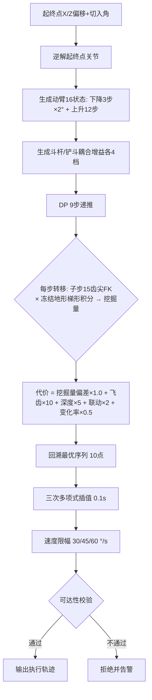

# 技术交底书

## 一种基于离线粗规划与在线细调整的挖掘机挖掘轨迹控制方法与系统

---

## 1. 检索结论

### 1.1 检索条件与信息层级说明

**检索日期**：2026 年 9 月 1 日。

**检索数据库**：Google Patents（覆盖 CNIPA / USPTO / EPO / WIPO 数据）、PatentGuru、佰腾/爱企查公开数据，以及 CNKI 期刊、机械工程学报等学术数据库（非专利文献）。

**检索关键词（中/英组合）**：
- 中文：挖掘机、自动挖掘、挖掘轨迹、轨迹规划、齿尖轨迹、动态规划、挖掘量/挖土量/土方量估算、满斗率、挖掘阻力、憋压、动臂提升、地形、工作面、离线规划/在线调整；
- 英文：excavator、digging trajectory、digging plan、bucket tip path、dynamic programming、dig volume estimation、bucket fill ratio、automatic digging、locus control、soil–bucket interaction。

> ⚠️ **信息层级说明**：本次检索受数据库访问限制，部分文献仅获取到**标题、摘要及权利要求片段级信息**（非全文级）。文中"未见公开"均指"在上述信息层级下未见公开"，**不等于全文中未公开**。正式提交前应委托代理机构对第 2 节认定的最接近对比文件做全文级复核。

### 1.2 国内相关专利（8 篇）

| 编号 | 公开号 | 名称 | 申请人/归属 | 技术要点（片段级） | 与本案关系 |
|------|--------|------|------------|------------------|-----------|
| CN-1 | CN117739991A（**已授权 CN117739991B，2024-04-30，有效**） | 一种挖掘机最优作业轨迹规划方法、装置、设备及介质 | 华侨大学（**全文核实**） | 激光雷达坡面角 → **6 路径点** → 逆解 → **4-3-3-3-4 多项式**五段轨迹 → **粒子群算法**优化各关节五段时间；目标函数为**满斗率/挖掘时间/单位能耗并列归一化**（权重系数），约束仅角速度/角加速度上限 | **全案最接近**：同样以"挖掘质量多目标"为规划目标，但全文核实其优化变量为**五段时间**（非关节序列），**未见**以挖掘量偏差为主目标的状态空间搜索、飞齿/禁退硬约束与在线调整 |
| CN-2 | CN118498472B | 挖掘机铲斗齿尖轨迹规划方法（已授权） | 全文核实 | 以**齿尖轨迹**为规划对象，提高挖掘效率与精度、降低能耗与操作强度 | 齿尖轨迹规划路线与本案齿尖体积积分思路同域，**未见**以挖掘量为优化目标的耦合增益搜索 |
| CN-3 | CN121381711B | 基于电铲铲斗物料体积智能检测的铲斗齿尖轨迹规划方法 | 太原理工大学（2026-04-24 公开） | 采集铲斗第 i 次铲装物料体积并**智能检测**，据此规划齿尖轨迹 | **方向最接近**：同为"物料体积 → 轨迹"链路，但其检测对象为**铲斗内物料**（事后/离散检测），本案为**挖掘过程中**齿尖轨迹与地形截面的连续在线估算 |
| CN-4 | CN113205211A | 一种挖掘机铲斗的作业轨迹规划方法、系统 | 全文核实 | 1) 基于**倾覆力矩与滑移力**计算最大挖掘力分布；2) 获取作业实时信息生成轨迹 | 力约束规划路线；本案以**几何/体积约束**（飞齿、最小深度）替代力模型，传感器需求更低 |
| CN-5 | CN117306614A | 挖掘机铲斗作业轨迹确定方法、装置、设备及存储介质 | 全文核实 | 确定铲斗坐标系到车体坐标系的**总转换矩阵**，确定当前时刻齿尖位置 | 齿尖坐标换算为公知手段；本案使用同样的 FK 基础，区别在其上的**体积积分与代价优化** |
| CN-6 | CN116823719A | 一种挖掘机的挖土量计算方法、装置及电子设备 | 全文核实 | 实现**每一个挖掘时刻挖土量的实时计算**，供操作者决策下一步作业内容 | 挖掘量实时计算与本案体积估算同域，但其用途为**提示操作者**，未与轨迹规划闭环 |
| CN-7 | CN115667636A | 挖掘计划制作装置、作业机械以及挖掘计划制作方法 | 日立建机（摘要判定） | 制作挖掘计划，挖掘土量根据**挖取土量、铲斗溢出土量、向挖掘部位坍塌的倒塌土量**等决定，随土质大幅变化 | 离线"挖掘计划"思路与本案离线粗规划同族，但其计划为**逐铲作业计划**层级，**未见**铲斗姿态级的轨迹状态搜索 |
| CN-8 | CN115354708A | 基于机器视觉的挖掘机铲斗自主挖掘识别控制系统及方法 | 全文核实 | 机器视觉识别铲斗，**强化学习**规划挖掘轨迹，规划挖掘点 A 到放料点 B 的最优路径 | 学习式路线代表；与本案解析式 DP 路线互为替代，其训练样本依赖与可解释性为本案优点的反衬 |

### 1.3 国际相关专利（2 篇）及同族补充

| 编号 | 公开号 | 名称 | 申请人 | 技术要点（片段级） | 与本案关系 |
|------|--------|------|--------|------------------|-----------|
| F-1 | US5918527A | Locus control system for construction machines | 申请人全文核实（locus control 族，日系大厂系） | 预先设定工作装置的**目标轨迹（target locus）**，控制单元计算位置与姿态并控制液压执行器跟踪 | **国际最接近**：确立了"离线设定目标轨迹 + 在线跟踪执行"的基本框架；其跟踪为**几何跟踪**，**未见**基于挖掘量与憋压状态的轨迹在线修正 |
| F-2 | US5446980A | Automatic excavation control system and method | 申请人全文核实（历史归属 Caterpillar 系） | 自动控制工作装置完成整个作业循环（挖掘—回转—卸载—复位） | 循环级自动控制，与本案挖掘段轨迹优化层级不同；已过保护期，列为背景技术 |

**同族与关联补充**：
- **CN121336020A（小松）**：按目标回转角度决定移动速度——已在复位轨迹案认定为最接近现有技术；本案挖掘段不涉及回转速度决定，仅列为家族背景。
- **CN116360425A**（无人电铲自主采矿挖掘轨迹规划）：电铲场景，与液压挖掘机工作装置结构不同，列为远端背景。

### 1.4 非专利文献（NPL，4 篇）

| 编号 | 文献 | 要点 | 与本案关系 |
|------|------|------|-----------|
| NPL-1 | 周有明、刘凯磊、殷鹏龙等《挖掘机自动挖掘轨迹规划与动态优化控制》 | 自动挖掘轨迹规划 + **动态优化控制**（轨迹执行中的在线修正） | **最接近文献级方案**：同为"规划+在线修正"双层结构；本案需以其为最接近现有技术做三步法分析（第 2 节补充对比） |
| NPL-2 | Task space-based dynamic trajectory planning for digging process of a hydraulic excavator with the integration of soil–bucket interaction（Proc. IMechE Part G） | **任务空间**动态挖掘轨迹规划，集成土壤-铲斗交互模型 | 在线动态规划路线代表，但依赖**土壤力学模型**；本案以几何体积反馈替代土壤模型 |
| NPL-3 | 《挖掘机的最优时间轨迹规划》（机械工程学报，2019） | 4-3-3-3-4 多项式分段插值，以角速度/角加速度为约束的最优时间规划 | 时间最优插值公知背景；本案后处理采用三次多项式 + 速度限幅，与其互补不冲突 |
| NPL-4 | Research on Trajectory Planning and Autodig of Hydraulic Excavator（Wiley, 2017） | 12 吨反铲直线自动挖掘的轨迹规划与自动挖掘 | 自动挖掘基线文献，未涉及挖掘量闭环 |

### 1.5 检索结论与风险预警

1. **"离线规划 + 在线执行/调整"两层框架已被公开**（F-1、NPL-1、NPL-2），L0 层级的宽泛独权不可行。
2. **以挖掘量/满斗率为优化目标**的轨迹规划已有布局（CN-1 满斗率综合优化、CN-3 物料体积→齿尖轨迹），本案必须与该两案划清界限：本案的挖掘量是**挖掘过程中由齿尖轨迹与冻结地形截面连续积分得到的过程量**，并作为 **DP 代价函数主项**与**在线反馈信号**双重使用。
3. **未发现**同时具备以下组合的公开方案：
   ① 动臂离散状态 × 斗杆/铲斗**耦合增益**的三关节联合 DP 状态空间；
   ② 以**挖掘量与参考值偏差为主目标**、以**飞齿/最小深度/禁退区**为硬约束的归一化代价函数；
   ③ 地形**一次扫描冻结 + 等间距查找表**、挖掘中不更新；
   ④ 基于**齿尖轨迹-地形截面梯形积分**的过程挖掘量在线估算；
   ⑤ 基于**斗杆速度亏额（憋压）**的动臂在线补偿（设计层级）。
4. **风险预警**：CN-1（华侨大学）与 CN-3（太原理工 2026-04 新公开）为活跃申请人，存在同赛道并行布局风险；NPL-1/NPL-2 如构成论文公开，将在无效程序中被引用，**申请日必须尽早**。

**最接近的对比文件认定**：专利级为 **CN-1（CN117739991A）**（挖掘质量多目标轨迹规划）；文献级为 **NPL-1**（自动挖掘轨迹规划与动态优化控制）。第 2 节以两者分别展开。

---

## 2. 最接近现有技术详细对比

### 2.1 CN117739991A/B 方案还原（基于全文核实，2026-09 更新）

- **法律状态**：已授权（CN117739991B，2024-04-30），有效，华侨大学；
- **目标**：针对挖掘阶段轨迹的平滑连续性，对挖掘满斗率、挖掘效率与挖掘能耗进行综合优化；
- **全文核实路线**：激光雷达采集坡面角度 + 齿尖初始位姿 → 确定挖掘阶段**六个路径点**（入铲点、出铲点及中间四点）→ 运动学逆解求关节角 → **4-3-3-3-4 多项式**生成五段轨迹、角速度、角加速度 → 感知模块采集挖掘体积/时间/能耗 → 按**满斗率、挖掘时间、单位体积能耗并列归一化**构造目标函数（权重系数 α、β、γ）→ **粒子群算法**优化各关节**五段时间** → 输出规划轨迹；约束仅为各关节角速度/角加速度不超上限；
- **未见公开**（全文级）：以挖掘量偏差为单一主目标的代价函数、斗杆/铲斗耦合增益离散状态空间、飞齿/最小深度/禁退硬约束、地形冻结查找表、在线细调整。

> ⚠️ **满斗率积分式表述划界（撰写注意）**：CN-1 从权 5 的满斗率目标函数含"**挖掘对象表面函数 × 挖掘轨迹**"除以铲斗宽度的积分式表述，与本案齿尖轨迹-地形截面梯形积分在数学形式上存在要素重合。划界要点：① CN-1 中该积分仅用于**事后计算满斗率指标**作为多目标并列项之一，积分结果**不参与搜索过程的逐状态转移评价**；② 本案积分在 **DP 每次状态转移内**计算单次转移挖掘量，直接驱动状态序列搜索，并作为在线进度反馈信号。说明书与权利要求中应避免与 CN-1 雷同的"表面函数"措辞，采用"冻结地形查找表的高度序列与齿尖轨迹折线围成截面的梯形积分"表述。

### 2.2 逐维度对比

| 对比维度 | CN-1（CN117739991A） | 本案 | 区别定性 |
|---------|---------------------|------|---------|
| 优化目标 | 轨迹平滑 + 满斗率 + 效率 + 能耗**多目标并列** | **挖掘量与参考值偏差为单一主目标**（w_volume=1.0 基准），平滑/约束以惩罚项分层 | 目标函数结构不同：本案主从分层，避免多目标权重整定 |
| 状态空间 | 未见耦合增益搜索的公开 | 动臂 16 离散状态 × 斗杆 4 增益 × 铲斗 4 增益 × 9 步递推 | **结构性区别** |
| 挖掘量 | 满斗率作为优化项（实现方式片段未见） | 齿尖轨迹-冻结地形截面**梯形积分**（子步 15），离线预估 + 在线估算同一算法复用 | 计算手段与使用方式不同 |
| 地形策略 | 未见"挖掘中冻结"公开 | 挖掘前扫描一次，**挖掘中不更新**，等间距 0.05m 查找表 + 窗口 7 平滑 | 工程策略区别（抗跳变） |
| 在线调整 | 未见在线修正公开 | 体积进度→铲斗姿态偏置；斗杆速度亏额→动臂提升补偿（设计层级） | **关键区别**，但实现状态需如实声明 |
| 约束体系 | 未见飞齿/禁退区公开 | 飞齿硬惩罚（w_ground=10）、最小深度 0.1m（w_depth=5）、前 2 步禁退、单步变化 ≤4° | 面向"憋齿/刨空"工况的区别 |

### 2.3 与 NPL-1 的对比（文献级最接近）

NPL-1 公开了"轨迹规划 + 动态优化控制"双层结构，与本案"离线粗规划 + 在线细调整"在**架构层级**上重合。区别在于：

1. NPL-1 的动态优化面向**轨迹跟踪性能**（时域再优化），本案在线层面向**挖掘物理结果**（挖掘量进度与憋压状态）——反馈变量本质不同；
2. NPL-1 未见以**冻结地形截面积分**做过程挖掘量估算的公开；
3. NPL-1 未见**斗杆速度亏额滞环 → 动臂补偿**的公开。

### 2.4 三步法分析（以 CN-1 为最接近现有技术）

**第一步：确定区别技术特征**

- D1：三关节联合优化的状态空间构造——动臂角度离散为"下降段（3 步 ×2°）+ 上升段（12 步）"共 16 状态，斗杆/铲斗以**耦合增益**（各 4 档）参数化而非独立离散；
- D2：以**挖掘量偏差**为主目标、硬约束（飞齿/最小深度/禁退/联动合理性）以大权重惩罚、软约束（动臂变化率）以小权重的**归一化分层代价函数**；
- D3：地形一次扫描冻结 + 等间距查找表 + 滑动平滑，挖掘中不更新，为体积积分提供**确定性截面基准**；
- D4：DP 最优轨迹经三次多项式插值 + 关节角速度限幅（30/45/60 °/s）+ 齿尖可达性校验的后处理链；
- D5（设计）：在线体积闭环（进度<0.5 下切 −5° / ≥0.5 上抬 +5° + 末段卷收）与憋压滞环补偿（进入 2.5°/s、退出 1.5°/s、比例增益提升动臂、回落限速归零）。

**第二步：实际解决的技术问题**

在 CN-1 的多目标平滑规划基础上，解决：**"如何在无土壤力学模型、无额外传感器条件下，使单次挖掘的挖掘量逼近目标值，并避免挖掘过程中的飞齿、憋压与估算跳变"**。

**第三步：是否显而易见**

- CN-1 自身追求多目标平衡，**没有将挖掘量抬升为主目标并重构状态空间**的动机；
- CN-3（太原理工）的体积检测为**铲斗内物料的事后检测**，与"过程积分"链路相反，其教导方向是"检测铲斗 → 修正下一次铲装"，**不能给出**"挖掘中连续积分 → 在线姿态偏置"的启示；
- NPL-2 给出了"土壤-铲斗交互模型"方向，本案恰恰**放弃土壤模型**改用地形截面几何积分，属于**反向选择**；
- 憋压检测的常见手段是压力传感器（CN119333446A 类测试系统即依赖憋压压力值），本案用**斗杆速度亏额**（无需压力传感器）推断憋压，亦无直接启示。

**结论**：D1~D4 组合相对 CN-1 具备创造性；D5 作为设计层级特征写入从属权利要求，并在说明书中如实标注实现状态。

### 2.5 独权收窄策略（概要）

| 层级 | 保护对象 | 处置 |
|------|---------|------|
| L0 | "离线粗规划 + 在线细调整"两层框架 | **禁用**：F-1/NPL-1 已公开框架 |
| L1 | 用 DP 优化挖掘轨迹 | **禁用**：DP 为公知算法，CN-1/CN-2 已布局轨迹优化 |
| L2 | 三关节耦合增益状态空间 + 挖掘量主目标代价函数（D1+D2） | **独权核心** |
| L3 | 地形冻结 + 查找表 + 截面梯形积分（D3 + 体积算法） | 从属/并列独权候选 |
| L4 | 后处理链（D4）与在线闭环（D5） | 从属 + 分案储备 |

---


## 3. 背景技术

### 3.1 现有技术分类

#### （1）离线全局轨迹规划族
以 CN117739991A（多目标综合优化）、CN118498472B（齿尖轨迹规划）及 NPL-3（4-3-3-3-4 多项式最优时间规划）为代表。路线为：离线求解满足平滑性/时间/能耗目标的工作装置轨迹，生成后开环执行。
**缺点**：① 规划目标以轨迹自身品质为主，**挖掘量不作为闭环变量**，实际土方量受物料密度与切削阻力影响，偏差可达 ±20%；② 固定轨迹对硬土/松软土无区分能力，硬土时憋压停机、松软土时欠装满；③ 多目标权重整定依赖大量试挖，调试成本高。

#### （2）力约束规划族
以 CN113205211A 为代表，基于倾覆力矩与滑移力计算最大挖掘力分布，再在力约束内规划轨迹。
**缺点**：① 力模型依赖整机质量参数与地面附着力估计，**换机型需重新标定**；② 未解决挖掘量控制问题；③ 对传感器配置（整机称重/姿态高频采样）要求高。

#### （3）学习式/视觉式路线
以 CN115354708A（机器视觉 + 强化学习规划）为代表。
**缺点**：① 训练样本获取依赖大量试挖，冷启动慢；② 策略不可解释，安全兜底困难；③ 光照/粉尘条件下视觉退化，工程可靠性受现场制约。

#### （4）挖掘量估算族
以 CN116823719A（实时挖土量计算）、CN121381711B（铲斗物料体积智能检测）为代表。
**缺点**：① 估算结果多用于**提示操作者或统计**，不直接驱动轨迹修正，形成"估而不用"；② 铲斗内物料检测为**事后离散**信息，无法支撑挖掘过程中的在线调整；③ 依赖额外传感器（视觉/称重），成本高。

#### （5）挖掘计划族
以 CN115667636A（日立）为代表，制作考虑挖取土量、溢出土量、坍塌土量的逐铲挖掘计划。
**缺点**：① 计划粒度为**作业循环级**，不深入铲斗姿态级轨迹；② 土量模型为统计模型，随土质大幅变化，需现场标定；③ 计划与执行分离，执行偏差无在线修正。

#### （6）目标轨迹跟踪族（国际）
以 US5918527A（locus control）、US5446980A（automatic excavation）为代表，预先设定目标轨迹并控制工作装置跟踪。
**缺点**：① 跟踪目标为**几何轨迹**，无挖掘物理量反馈；② 遇到硬土憋压时只能被动停机或降速，无主动卸载策略；③ 专利多已过保护期或限于特定机型。

### 3.2 现有技术共性缺陷总结

1. **挖掘量与轨迹割裂**：估算族只估不调，规划族不调只规，缺乏"过程挖掘量 → 轨迹"的闭环通道；
2. **缺乏过程化的挖掘量手段**：无低成本（不加传感器）的挖掘中连续挖掘量估算方法；
3. **约束设计脱离工况**：飞齿（齿尖越出地面）、前段后退刨空等真实憋齿工况未被显式建模为约束；
4. **地形使用方式激进**：实时更新地形在挖掘振动下易跳变，直接破坏体积估算与规划输入的稳定性；
5. **在线层缺位或过重**：要么无在线修正（离线族），要么依赖土壤力学模型/学习模型（NPL-2/CN-8），实时性与可解释性难以兼得。

---

## 4. 发明内容

### 4.1 核心思想

将挖掘轨迹控制分为**离线粗规划**与**在线细调整**两层：

- **离线层（已实现）**：在地形一次扫描冻结的确定性输入下，用**三关节耦合动态规划**搜索以"挖掘量逼近参考值"为主目标、以飞齿/深度/禁退为硬约束的最优关节序列，再经插值-限幅-可达性校验输出可执行轨迹；
- **在线层（设计层级，待原型验证）**：执行中以**过程挖掘量进度**调整铲斗姿态偏置、以**斗杆速度亏额**检测憋压并驱动动臂提升补偿，使同一离线轨迹适配不同硬度的物料。

两层之间的接口为"参考轨迹 + 冻结地形 + 参考挖掘量"三元组，保证离线/在线使用**同一套体积积分算法**，口径一致。

### 4.2 方法步骤

#### 4.2.1 离线粗规划（S1~S6，已实现）

- **S1 地形获取与冻结**：挖掘前获取作业面二维剖面点列（X 单调），以 0.05 m 分辨率重采样为等间距网格，窗口 7 滑动均值平滑，构建查找表；**挖掘过程中不再更新**该地形。
- **S2 起终点生成**：给定起终点 X 坐标与相对地形的 Z 偏移，结合铲斗切入角，经逆运动学解算起终点关节角（boom、arm、bucket）。
- **S3 状态空间构造**：动臂角离散为**下降段 3 步 ×2° + 上升段 12 步**共 16 个状态；斗杆、铲斗不独立离散，而是以**耦合增益**（各 4 档）参数化其相对起点到终点的推进比例，将三关节联合搜索压缩为可递推的马尔可夫结构。
- **S4 DP 递推**：9 步递推，每步转移代价为：
  - 主目标：`w_volume·|本次转移挖掘量 − 参考增量|`（w_volume=1.0，参考总挖掘量 v_ref=0.5 m²，按 2D 截面面积计）；
  - 硬约束惩罚：齿尖高出地面（飞齿，w_ground=10）、挖掘深度不足 0.1 m（w_depth=5）、联动不合理（w_coupling=2）；
  - 软约束：动臂单步变化率（w_boom_rate=0.5，上限 4°/步）；前 2 步禁止动臂后退。
  - 单次转移挖掘量：对起终关节做 **15 子步**插值，逐子步 FK 求齿尖，与冻结地形截面做**梯形积分**得 2D 截面面积。
- **S5 回溯**：由终态回溯得到 10 个关节角路径点及总挖掘量、总代价。
- **S6 后处理**：三次多项式插值为 0.1 s 连续轨迹 → 关节角速度限幅（动臂 30、斗杆 45、铲斗 60 °/s）→ 齿尖可达性校验（关节限位：boom [−45.44°, 55.28°]、arm [−138.69°, −37.35°]、bucket [−133.48°, 30.53°]）。

#### 4.2.2 在线细调整（S7~S9，设计层级，待原型验证）

- **S7 参考跟踪**：按离线轨迹逐周期发布关节指令（位置 + 速度前馈）。
- **S8 体积反馈**：每周期由实测关节角 FK 求齿尖并累积轨迹，与冻结地形截面做与 S4 相同的梯形积分，乘铲斗宽度与标定系数得过程挖掘量，计算进度 `p = V_now / V_target`：
  - `p < 0.5`：铲斗姿态偏置 −5°（齿尖下切加深）；
  - `p ≥ 0.5`：偏置 +5°（上抬准备卷收）；
  - 末段：按卷收增益提前卷收，保证满斗收拢。
- **S9 憋压补偿**：斗杆速度亏额 `vel_deficit = max(0, 满速回收速度 − 朝终点方向实际速度)`；滞环判定（进入 2.5 °/s、退出 1.5 °/s）防抖；憋压时动臂提升速度 `min(上限, Kp·vel_deficit)`，退出后按限速回落归零。
- **结束判据**：`p ≥ 0.95` ∨ 终点到达 ∨ 超时，三者任一满足输出 `dig_finish`。

> **实现状态声明**：S1~S6 已在 `dig_trajectory_planner` 软件包中完整实现并通过离线验证；S7~S9 为设计层级（规格与参数见 4.4），**尚未在代码中实现**，作为从属权利要求与分案储备主张，正式申请前建议完成原型验证以强化实用性支持。

### 4.3 系统组成与数据流

```
[扫描/点云输入] ─S1→ [冻结地形查找表(0.05m, 平滑窗口7)]
                        │
        起终点+切入角 ─S2→ [逆解起终点关节]
                        │
              S3 [动臂16状态 × 斗杆4增益 × 铲斗4增益]
                        │
              S4 [9步DP：挖掘量主目标 + 飞齿/深度/禁退硬约束]
                        │  (子步15齿尖FK × 冻结地形梯形积分)
              S5 [回溯10点关节序列] ─→ S6 [插值→限幅→可达性校验]
                        │                       │
                        ▼                       ▼
              [参考轨迹+参考挖掘量]    [可执行连续轨迹 → 控制器]
                        │
        ── 在线层（设计）──
              S7 参考跟踪 → S8 体积闭环(姿态偏置) → S9 憋压补偿(动臂)
                        │
                        ▼
                 [dig_finish / RefDeviceTraj]
```

### 4.4 工程参数表（实现部分以代码/配置为准）

| 参数 | 取值 | 来源 | 说明 |
|------|------|------|------|
| 动臂离散状态数 | 16（下降 3×2° + 上升 12） | yaml/代码一致 | 状态空间构造 |
| 斗杆/铲斗耦合增益档数 | 各 4 | yaml/代码一致 | 三关节耦合参数化 |
| DP 递推步数 | 9（输出 10 点） | yaml/代码一致 | 轨迹粒度 |
| 代价权重 | volume 1.0 / ground 10.0 / depth 5.0 / boom_rate 0.5 / coupling 2.0 | yaml/代码一致 | 硬软分层 |
| 体积积分子步数 | 15 | yaml/代码一致 | 单次转移齿尖插值密度 |
| 参考挖掘量 | 0.5 m²（2D 截面） | yaml/代码一致 | 主目标基准 |
| 地形分辨率 / 平滑窗口 | 0.05 m / 窗口 7 | yaml/代码一致 | 冻结地形构造 |
| 最小挖掘深度 | 0.1 m | yaml/代码一致 | 深度硬约束 |
| 动臂单步上限 / 禁退步数 | 4° / 前 2 步 | yaml/代码一致 | 过程约束 |
| 插值步长 / 速度限幅 | 0.1 s / 30-45-60 °/s | yaml/代码一致 | 后处理 |
| 机臂/斗杆/铲斗长度 | 7.0 / 2.6 / 2.06 m | yaml | FK 几何 |
| 姿态偏置 ±5°、滞环 2.5/1.5 °/s、p 阈值 0.5/0.95 | — | **设计建议值（未实现）** | 在线层，待原型确认 |

---


## 5. 本发明的优点

### 优点 1：挖掘量成为一等规划目标，而非事后统计
离线层以"挖掘量与参考值偏差"为代价函数唯一主目标（权重基准 1.0），其余均为惩罚项，避免多目标权重整定困难；在线层（设计）复用同一积分算法做进度反馈，形成"规划口径 = 估算口径 = 控制口径"的一致性。传统方案要么把满斗率作为并列多目标之一（CN-1），要么只估不用（CN-6），本案将挖掘量贯穿规划-执行全链。

### 优点 2：耦合增益状态空间显著压缩搜索维度
三关节若独立离散（如各 16 档）则状态空间 4096/步、不可递推；本案动臂离散（16 态）承担挖掘深度自由度，斗杆/铲斗以 4 档耦合增益承担姿态自由度，单步组合 16×4×4=256，9 步递推可在毫秒级完成，兼顾解的质量与实时性。该构造未见对比文件公开。

### 优点 3：面向真实憋齿工况的硬约束体系
飞齿（齿尖越出地面，权重 10）、最小挖掘深度 0.1 m（权重 5）、前 2 步禁退、联动合理性（权重 2）直接对应现场"刨空/憋齿/浅挖"故障模式；相比力约束族（CN-4）无需整机称重与力模型标定，仅凭运动学与地形即可执行。

### 优点 4：地形冻结策略保证估算确定性
挖掘中不更新地形，从源头切断"振动→点云抖动→地形跳变→体积估算漂移→规划输入失真"的传导链；等间距 0.05 m 查找表 + 窗口 7 平滑提供 O(1) 查询，离线在线共用同一份地形。

### 优点 5：零新增传感器
体积估算仅用已有姿态传感器（关节角）+ 一次性地形扫描；憋压检测（设计）用斗杆速度亏额替代压力传感器，成本与标定负担显著低于重量/视觉/压力路线。

### 优点 6：离线重计算、在线轻计算的资源分层
DP 搜索集中在离线（挖掘前一次完成），在线层仅做积分与偏置运算，适配车载嵌入式算力。

---

## 6. 本发明的关键点与保护点

### 6.1 关键点（K 表）

| 编号 | 关键点 | 技术特征 | 支撑（代码/设计） |
|------|--------|---------|------------------|
| K1 | 三关节耦合 DP 状态空间 | 动臂 16 离散状态（下降 3×2°+上升 12）× 斗杆/铲斗耦合增益各 4 档 × 9 步递推 | 已实现：`DigPlannerDP` |
| K2 | 挖掘量主目标 + 分层代价函数 | 挖掘量偏差主目标（1.0）；飞齿（10）/深度（5）/联动（2）硬惩罚；变化率（0.5）软惩罚 | 已实现：`calcTransitionCost` |
| K3 | 齿尖轨迹-冻结地形截面积分 | 子步 15 插值 + FK 齿尖 + 梯形积分，离线预估与在线估算同一算法 | 已实现（离线）：`calcDigVolume`；在线复用为设计 |
| K4 | 地形一次扫描冻结 + 查找表 | 0.05 m 等间距、窗口 7 平滑、O(1) 查询、挖掘中不更新 | 已实现：`TerrainProfile` |
| K5 | 体积闭环 + 憋压补偿在线层 | 进度→姿态偏置 ±5°+末段卷收；速度亏额滞环 2.5/1.5 °/s→动臂比例补偿 | **设计层级，未实现** |

### 6.2 收窄版独权（建议）

**权利要求 1（方法）**：一种挖掘机挖掘轨迹规划方法，其特征在于包括：
① 挖掘前获取作业面二维剖面并**冻结**为等间距查找表，挖掘过程中不更新；
② 由起终点及切入角经逆运动学解算起终点关节角；
③ 构造搜索空间：动臂角离散为含下降段与上升段的状态序列，斗杆与铲斗分别以**耦合增益档位**参数化；
④ 动态规划递推，转移代价以**单次转移挖掘量与参考增量的偏差**为主目标项，以齿尖越出地面、挖掘深度不足、动臂后退为惩罚项，其中单次转移挖掘量由齿尖轨迹子步插值与所述冻结地形截面积分得到；
⑤ 回溯最优关节序列，经插值、角速度限幅与可达性校验输出执行轨迹。

**权利要求 2~16（从属退路表）**：

| 项 | 附加特征 | 对应关键点 |
|----|---------|-----------|
| 2 | 下降段 3 步×2°、上升段 12 步、增益各 4 档、递推 9 步 | K1 |
| 3 | 权重：主目标 1.0 / 飞齿 10 / 深度 5 / 联动 2 / 变化率 0.5 | K2 |
| 4 | 子步 10~20 的齿尖插值密度与梯形积分 | K3 |
| 5 | 前 N 步（N≥2）禁止动臂后退 | K2 |
| 6 | 动臂单步变化上限（4°）与最大变化率惩罚 | K2 |
| 7 | 参考挖掘量按 2D 截面面积设定并留余量 | K2 |
| 8 | 等间距分辨率 0.01~0.1 m、滑动窗口奇数平滑 | K4 |
| 9 | 三次多项式插值 + 各关节差异化角速度限幅（30/45/60 °/s） | S6 |
| 10 | 关节限位内的齿尖可达性校验 | S6 |
| 11 | 在线：过程挖掘量进度分段的铲斗姿态偏置（前半下切/后半上抬/末段卷收） | K5 |
| 12 | 在线：斗杆速度亏额与滞环阈值的憋压判定 | K5 |
| 13 | 在线：憋压时动臂提升速度 = f(亏额)、退出后限速回落 | K5 |
| 14 | 在线估算乘铲斗宽度与标定系数 | K3 |
| 15 | 结束判据：进度达标 ∨ 终点到达 ∨ 超时 | K5 |
| 16 | 系统权利要求（扫描模块/规划器/体积估算器/在线调整器） | 全部 |

### 6.3 概括层次阶梯（L0~L4）

| 层级 | 概括 | 处置 |
|------|------|------|
| L0 | 离线粗规划+在线细调整两层框架 | **禁用**（F-1/NPL-1 已公开框架） |
| L1 | 用动态规划优化挖掘轨迹 | **禁用**（公知 + CN-1/CN-2 布局） |
| L2 | 耦合增益状态空间 + 挖掘量主目标代价 | **独权核心**，直接提交 |
| L3 | 地形冻结 + 截面梯形积分 + 硬约束组合 | 从属 2~8；可并列独权二 |
| L4 | 在线体积闭环 + 憋压补偿 | 从属 11~15 + 分案储备（实现后优先独立申请） |

### 6.4 分案储备

| 编号 | 主题 | 保护面 | 备注 |
|------|------|--------|------|
| D1 | 齿尖轨迹-冻结地形截面的过程挖掘量在线估算方法 | 最宽（可独立用于装车量统计/满斗率监控） | 建议优先独立申请 |
| D2 | 斗杆速度亏额滞环式憋压检测与动臂补偿 | 通用过载保护，跨挖掘/装载场景 | 在线层实现后申请 |
| D3 | 挖掘中地形冻结的估算确定性保障方法 | 与满斗率案（他案）可交叉引用 | — |
| D4 | 耦合增益参数化的多关节联合搜索构造 | 算法层，可与其它优化器组合 | — |
| D5 | 基于体积进度的末段卷收时机控制 | 满斗率直接相关 | 与满斗率案协调，避免重复授权 |

### 6.5 FTO 规避提示

1. **CN117739991B（华侨大学，已授权，全文已核实）**：其权利要求 1 覆盖"六路径点+4-3-3-3-4 多项式+多目标归一化+粒子群优化五段时间"，本案规避点为：主目标为**挖掘量偏差**（非满斗率并列多目标）+ 耦合增益状态空间 + 逐状态转移体积积分，字面不重合；但满斗率积分式表述需按 2.1 节划界处理，避免等同解释争议；
2. **CN121381711B（太原理工，2026-04 新公开）**：注意其"物料体积→齿尖轨迹"链路；本案为"过程截面积分→代价/偏置"，检测对象与时序不同，但需全文确认其权利要求的概括宽度；
3. **US5918527A 族**：已过保护期概率高（1999 年授权），仅背景风险；
4. 与**满斗率控制案**（同文件夹他案）均涉及体积估算，申请时序上应错开或以母案-分案关系处理，避免抵触。

---


## 7. 替代方式及附图

### 7.1 替代方式表

| 编号 | 替代对象 | 替代方式 | 优点 | 缺点 | 是否落入本案保护 |
|------|---------|---------|------|------|----------------|
| A1 | 优化器 | 遗传算法/粒子群替代 DP | 全局搜索能力强 | 不保证最优、耗时不可控 | 部分落入（若保留耦合增益空间与挖掘量主目标，从属特征仍被读取） |
| A2 | 状态空间 | 三关节全部独立离散 | 构造简单 | 状态爆炸，无法 9 步内求解 | 不落入独权③ |
| A3 | 状态空间 | 仅优化动臂、斗杆铲斗按模板联动 | 更简单 | 姿态自由度受限，满斗适应性差 | 边缘：缺"耦合增益档位"特征 |
| A4 | 体积计算 | 蒙特卡洛点采样代替梯形积分 | 对任意形状截面适用 | 噪声大、不确定性高 | 落入（积分方式可概括为"截面积分"） |
| A5 | 体积计算 | 解析几何闭式解 | 速度最快 | 仅适用理想化截面 | 落入 |
| A6 | 主目标 | 挖掘量与能耗加权双主目标 | 兼顾能效 | 引入权重整定，向 CN-1 靠拢 | 落入独权④（挖掘量仍为主项之一） |
| A7 | 硬约束表达 | 约束直接剔除不可行转移（而非惩罚） | 可行性严格 | 可能无解 | 落入（惩罚与剔除为等同手段） |
| A8 | 地形表示 | 不均匀网格/参数曲线 | 适应陡坡 | 查询需二分，非 O(1) | 落入独权①的"查找表"概括 |
| A9 | 地形策略 | **挖掘中实时更新地形** | 信息最新 | 跳变风险，正是本案规避的问题 | **不落入**（独权①要求冻结） |
| A10 | 后处理 | 五次多项式/样条插值 | 加速度连续 | 计算量略增 | 落入从属 9 的概括范围 |
| A11 | 在线层 | 压力传感器检测憋压（替代速度亏额） | 测量直接 | 需额外传感器 | **不落入**从属 12（速度亏额特征） |
| A12 | 在线层 | 土壤力学模型预测阻力前馈（NPL-2 路线） | 无需等待憋压发生 | 模型标定重、土质敏感 | **不落入**（本案为反馈式、无土壤模型） |
| A13 | 离线/在线划分 | 全部在线逐帧重规划 | 无冻结地形假设 | 算力需求高 | 不落入独权（离线粗规划特征缺失） |
| A14 | 参考挖掘量 | 按斗容百分比而非 2D 截面面积设定 | 直观 | 需铲斗三维模型 | 落入从属 7 的概括 |
| A15 | 结束判据 | 仅以终点到达结束 | 简单 | 物料软硬差异下满斗率波动 | 部分落入从属 15 范围 |

### 7.2 附图（文字描述，正式图由代理师绘制）

**图 1 系统架构图**：扫描输入 → 冻结地形查找表 → 离线粗规划器（状态空间构造 + DP 递推 + 回溯 + 后处理）→ 参考轨迹/参考挖掘量 → 在线细调整器（参考跟踪 + 体积闭环 + 憋压补偿）→ 控制器。

**图 2 离线粗规划流程图**：



**图 3 代价函数结构图**：主目标层（挖掘量偏差，权重 1.0）/ 硬约束惩罚层（飞齿 10、深度 5、联动 2、禁退）/ 软约束层（动臂变化率 0.5），三层按权重量级分离，硬约束违反时代价主导，保证搜索优先排除不可行转移。

**图 4 体积积分示意图**：单次转移起终关节 → 15 子步插值齿尖折线 → 与冻结地形剖面围成的闭合区域 → 梯形积分得 2D 截面面积；离线规划与在线估算共用此图所示同一算法。

**图 5 在线细调整流程图（设计层级）**：

```mermaid
flowchart TD
    A[逐周期发布参考轨迹指令] --> B[实测关节角 FK → 齿尖轨迹累积]
    B --> C[与冻结地形截面积分 × 斗宽 × 标定系数]
    C --> D[进度 p = V_now / V_target]
    D --> E{p < 0.5?}
    E -->|是| F[姿态偏置 -5° 下切]
    E -->|否| G[姿态偏置 +5° 上抬 + 末段卷收]
    F --> H{vel_deficit > 2.5°/s?}
    G --> H
    H -->|是| I[滞环进入憋压: 动臂提升 min(上限, Kp×亏额)]
    H -->|否, 且亏额 < 1.5°/s| J[退出憋压: 动臂限速回落归零]
    I --> K{p≥0.95 ∨ 到达终点 ∨ 超时?}
    J --> K
    K -->|否| A
    K -->|是| L[dig_finish = 1]
```

**图 6 地形冻结策略时序图**：横轴为作业时间；挖掘前一次扫描建立地形（窗口 7 平滑、0.05 m 重采样）；挖掘开始时刻起地形曲线锁定不变，离线规划、体积估算、在线偏置三条计算链共享同一冻结地形，直至本铲结束。

---

## 附：技术参数表

### 离线粗规划（已实现，`dig_planner.yaml` 与代码一致）

| 参数 | 符号 | 取值 | 说明 |
|------|------|------|------|
| 动臂离散状态数 | boom_states | 16（下降 3×2° + 上升 12） | 状态空间 |
| 斗杆/铲斗耦合增益档数 | arm_gains / bucket_gains | 4 / 4 | 姿态自由度参数化 |
| DP 递推步数 | dig_steps | 9（输出 10 点） | 轨迹粒度 |
| 挖掘量偏差权重 | w_volume | 1.0 | 主目标 |
| 飞齿惩罚权重 | w_ground | 10.0 | 硬约束 |
| 深度约束权重 | w_depth | 5.0 | 硬约束（深度 ≥0.1 m） |
| 动臂变化率权重 | w_boom_rate | 0.5 | 软约束（≤4°/步） |
| 联动约束权重 | w_coupling | 2.0 | 硬约束 |
| 体积积分子步数 | volume_interval | 15 | 梯形积分密度 |
| 参考挖掘量 | v_ref | 0.5 m²（2D 截面） | 主目标基准 |
| 地形分辨率 / 平滑窗口 | terrain_resolution / smooth_window | 0.05 m / 7 | 冻结地形 |
| 插值步长 / 速度限幅 | dt / 30-45-60 °/s | 0.1 s | 后处理 |
| 机臂 / 斗杆 / 铲斗长度 | l_boom / l_arm / l_bucket | 7.0 / 2.6 / 2.06 m | FK 几何 |
| 关节限位 | boom / arm / bucket | [−45.44°, 55.28°] / [−138.69°, −37.35°] / [−133.48°, 30.53°] | 可达性校验 |

### 在线细调整（设计建议值，未实现，待原型验证后冻结）

| 参数 | 符号 | 建议值 | 说明 |
|------|------|--------|------|
| 姿态偏置幅度 | attitude_offset | ±5° | p<0.5 下切 / ≥0.5 上抬 |
| 体积进度阈值 | p_split / p_done | 0.5 / 0.95 | 分段切换 / 结束 |
| 憋压进入/退出死区 | stall_enter / stall_exit | 2.5 / 1.5 °/s | 滞环防抖 |
| 动臂提升增益 | Kp_boom | 待定（原型标定） | 原稿建议 0.8 |
| 斗杆满速回收速度 | arm_speed_max | 待定（按机型标定） | 原稿建议 10 °/s |
| 控制周期 | Ts | 0.1 s | 与离线 dt 一致 |

---

## 版本信息

| 版本 | 日期 | 修订内容 |
|------|------|---------|
| v1.0 | 2026-08-13 | 初稿；检索部分为占位编号，含大量未实现机制未标注 |
| **v2.0** | **2026-09-01** | **检索重构版**：替换全部占位编号为真实可溯源文献（国内 8 + 国际 2 + 同族 + NPL 4）；最接近现有技术重新认定为 CN117739991A（专利级）与《挖掘机自动挖掘轨迹规划与动态优化控制》（文献级）；按工程代码核实全部离线层参数并落实至交底书；**如实标注在线细调整为设计层级（未实现）**；新增收窄版独权 16 项从属退路、L0~L4 阶梯、分案储备 D1~D5、FTO 提示、15 项替代方式判定表 |
| **v2.1** | **2026-09-01** | **全文复核修订版**：CN117739991A 标注已授权（CN117739991B，2024-04-30，有效），2.1 节按全文事实还原（六路径点+4-3-3-3-4 多项式+PSO 优化五段时间）；新增满斗率积分式表述划界说明；6.5 FTO 与下一步工作同步更新 |

---

## 下一步工作

1. **【最高优先级】在线细调整原型实现**：S7~S9（体积闭环 + 憋压补偿）目前仅为设计层级，建议在 `dig_trajectory_planner` 中补充在线模块原型并完成台架/仿真验证；否则独权中在线特征仅能从属主张，且审查中实用性支持较弱。
2. **尽早提交申请**：CN121381711B（2026-04 公开）显示同赛道活跃布局，且 NPL-1/NPL-2 论文已构成公开文献，申请日越早越安全。
3. **委托全文比对（部分完成）**：CN117739991B 已完成全文级复核（2026-09），区别特征维持；剩余 CN121381711B、CN113205211A 两案仍需全文级权利要求比对。
4. **与满斗率案协调**：D1（过程挖掘量估算）与 D5（末段卷收）与《满斗率稳定控制》案主题重叠，需确定母案-分案关系或错开申请时序。
5. **参数标定**：在线层建议值（Kp_boom、arm_speed_max 等）来自原稿设想，需按目标机型液压特性标定后冻结为正式参数表。
6. **实验数据补充**：建议采集"有无在线调整"的满斗率对比、不同硬度物料的憋压频次数据，支撑说明书有益效果段落。

---

**技术交底书撰写完成日期**：2026 年 9 月 1 日（v2.0 检索重构版）

**撰写人**：[待填写]

**审核人**：[待填写]

**批准人**：[待填写]
