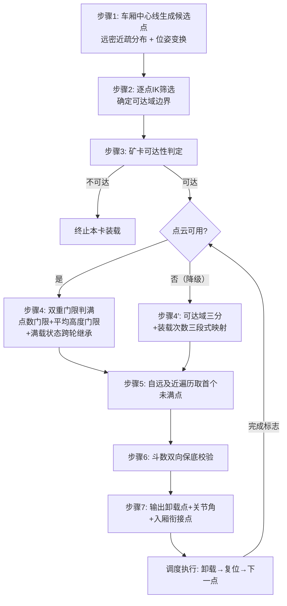

# 专利技术交底书

## 一种基于装载进度的挖掘机卸载点动态选取方法与系统

---

## 1. 检索结论

### 1.1 检索条件

| 项 | 内容 |
|:---|:---|
| 检索平台 | Google Patents（含 CN/US/EP/WO 全文）、EPO Publication Server、Justia Patents、CNIPA 公开文本（patentimages） |
| 中文检索词 | 挖掘机/装载机/铲装机器人 + 自动装车/自主卸料 + 卸料点/卸载点/装载点 + 车厢/矿卡 + 点云/料位/满斗率 + 可达/逆运动学 |
| 英文检索词 | excavator / loading machine + autonomous truck loading + dump point / dump location / loading position + truck bed + soil distribution + reachability |
| 检索时间 | 2026-08-09（本次实际网络检索） |
| ⚠️ 信息层级说明 | 下表文献均为真实可溯源公开文献（附链接）；其中多篇仅获取到**摘要/说明书片段级**信息（Google Patents 全文页面本次拓取超时），**权利要求逐条比对必须由代理人调取全文后复核** |

### 1.2 国内相近专利 8 篇

| 序号 | 公开号 | 名称 | 技术要点（摘要级） | 相关度 |
|:---:|:---|:---|:---|:---:|
| CN-1 | **CN109902857B** | 一种运输车辆装载点自动规划方法及系统 | 单激光雷达扫描铲斗与运输车辆车厢，由点云得铲斗/车厢点云信息，提出**点云深度直方图**表征三维物体（凹凸信息）并**通过深度直方图寻找合适的卸载点**；目标为"挖掘机装载时在车厢上方有效选择装载点"。⚠️ **仅摘要 + 权利要求1片段级信息，全文未逐字核对，代理人须调取全文做特征映射复核** | ★★★★★（国内最接近） |
| CN-2 | CN120122112A | 一种无人化铲装机器人自主卸料和矿卡满斗率检测装置 | 主机（远程操作室处理器+显示）+ 自主卸料 + 矿卡满斗率检测 | ★★★ |
| CN-3 | CN111733918B | 挖掘机卸料作业辅助系统及轨迹规划方法 | 数据采集/轨迹控制/误差控制等单元；**转折点约束 + 路径最短**选转折点，以挖掘起点/转折点/目标点规划卸料轨迹 | ★★★ |
| CN-4 | CN116088365A | 一种基于视觉的自主挖掘作业卸料点定位系统及方法 | 相机 + 计算机 + **靶标固定在卸料点**，视觉定位卸料点 | ★★ |
| CN-5 | CN113309169A | 一种无人驾驶装载机室内自主卸料系统及方法 | 卡车轮廓识别模块 + 测距模块 + 工作装置位姿测量，室内自主卸料 | ★★ |
| CN-6 | CN113985873A | 一种装载机自主铲掘作业铲掘点规划方法 | 建全局地图 + **聚类算法划分作业区域并规划铲掘点**（铲掘侧，与卸载侧选点思路同构） | ★★ |
| CN-7 | CN102244771A | 一种基于图像的露天矿挖掘机装车过程的监控方法和装置 | 图像传感器 + DSP 处理，装车过程监控（不参与选点决策） | ★ |
| CN-8 | CN113687647A | 矿车运输驾驶控制方法、装置、矿车和存储介质 | 根据调度任务生成路径，**根据铲车位姿**调整矿车停靠（装载侧协同，不涉及厢内选点） | ★ |

### 1.3 国际相近专利 10 篇

| 序号 | 公开号 | 名称 | 技术要点（摘要级） | 相关度 |
|:---:|:---|:---|:---|:---:|
| **F-1** | **US6363632B1** | System for autonomous excavation and truck loading（自主挖掘与卡车装载系统，CMU 系） | 含 **load point planner（装载点规划器 68）用于规划向卡车车厢卸土的卸载点序列**（a sequence of dump points）+ excavation point planner；双激光扫描识别定位卡车 | ★★★★★（**全案最接近**） |
| F-2 | US6247538B1 | Automatic excavator, automatic excavation method and automatic loading method | 由识别结果**确定目标挖掘位置与目标装载位置** | ★★★★ |
| F-3 | EP3733981B1 | Control device of working machine（作业机控制装置） | 基于测量仪器输出确定挖掘机相对装载对象的位置，并**计算目标装载位置**（target loading position） | ★★★★ |
| F-4 | US12686991 | Control device, loading machine, and control method | 含 **loading position specification unit（装载位置指定单元 1107）**，指定具体装载位置 P13 | ★★★★ |
| F-5 | US12085940B2 | Autonomous truck loading for mining and construction applications | 数据库存储装载各阶段的**基元行为（elementary behaviors）**并组合执行 | ★★★ |
| F-6 | US8768579B2 | Swing automation for rope shovel（绳铲回转自动化） | 控制器含理想路径生成模块，接收铲斗数据与**卸载位置**数据；卸载位置由**操作员指定** | ★★★ |
| F-7 | US20120263566A1 | Swing automation for rope shovel（F-6 同族公开） | 操作员先指定卸载位置，挖掘后初始化并自动回转 | ★★ |
| F-8 | WO2015062450A1 | 自动布料机及自动布料机控制方法 | 传感器探测布料区、控制卸料口布料（混凝土领域，布料均匀性思路可类比） | ★★ |
| F-9 | US20230417548A1 | Determination of an excavator swing boom angle based on an image | 图像确定回转臂角度（回转角获取手段，与本发明 swing 计算相关） | ★ |
| F-10 | EP3045862A1 | Dump truck（矿用自卸卡车位姿估计） | 双位置估计装置不停机估计矿机位姿（提供卡车位姿输入，不涉选点） | ★ |

### 1.4 需同步关注的非专利文献（NPL，可用作对比文件）

| 编号 | 文献 | 关键公开内容 | 风险 |
|:---:|:---|:---|:---:|
| NPL-1 | *A Robotic Excavator for Autonomous Truck Loading*（CMU Robotics Institute，与 F-1 同源） | 明确记载：扫描卡车车厢以**测量车厢内土料分布（soil distribution in the truck bed），并计算下一个期望卸载位置（next desired dump location），每斗重复** | ⚠️ **高** |
| NPL-2 | 行业方案（华为智能露天矿、天河电子等） | 激光雷达矿卡料位高度实时检测用于装车计量 | 中（公知实践） |

### 1.5 检索结论

1. **全案最接近现有技术为 F-1（US6363632B1）**：其已公开"规划向车厢卸土的**卸载点序列**"，叠加同源 NPL-1 记载的"测量车厢内土料分布 → 计算下一卸载位置"，**已覆盖"根据车厢料面状态驱动卸载点迁移"这一上位思想**；
2. **国内最接近为 CN-1（CN109902857B）**：已公开"激光雷达扫描车厢点云 + 深度直方图 → 寻找合适卸载点"，**与本发明的点云驱动选点高度重合**；
3. 因此，本发明的**上位思想（感知料面 → 选卸载点）不具备新颖性**，不可作为保护点；创造性必须建立在以下未检索到公开的具体机制组合上：
   - **斗数双向保底**（上限强制终止 + 下限不采信全满结论并取中位可达点继续）——**18 篇文献中无任何近似公开**；
   - **逐候选点 IK 求解确定可达域边界**（F-1~F-10 均未涉及以逆运动学可解性筛选卸载点）；
   - **双重门限判满的具体算法**（点数门限 + 局部平均高度门限，且点数不足时保守判未满）——CN-1 用深度直方图，**判定算法路线不同**；
   - **候选点远密近疏非线性分布 + 自远及近遍历**的协同；
4. ⚠️ **风险预警**：若代理人调取 F-1 全文后确认其已公开"根据车厢料面高度逐点判断并选下一卸载点"，则本案独权 ③④ 将仅能以**具体判定算法 + 可达域约束 + 斗数保底**三者的组合争取创造性；第 6 节已据此收窄布局；
5. ⚠️ 本节为工程师初步检索，未使用付费专业数据库（incoPat/PatSnap/世界专利索引），且多篇仅至摘要级；正式申请前必须委托查新，并专项排查小松（Komatsu）、日立（Hitachi）、卡特彼勒（Caterpillar）、三一/徐工/柳工、慧拓/踏歌/易控智驾的装车选点类申请。

---

## 2. 最接近现有技术详细对比分析

> 经 1.2/1.3 两表比对，**全案最接近现有技术选定为 F-1：US6363632B1《System for autonomous excavation and truck loading》**（CMU 系，自主挖掘与卡车装载系统）。选定理由：18 篇文献中，唯有 F-1 同时公开了「卡车位姿识别 + **卸载点序列规划** + 挖掘点规划 + 自主循环装车」这一与本发明技术领域、要解决的问题、技术手段方向均最为一致的完整方案；其余文献或只公开单个装载位置的确定（F-2/F-3/F-4）、或依赖操作员人工指定卸载位置（F-6/F-7）、或不进入厢内选点决策（CN-7/CN-8/F-9/F-10）。

### 2.1 F-1 技术方案还原

**（信息层级声明：以下还原基于 F-1 的真实公开摘要与说明书片段，以及与其同源的 NPL-1 论文正文表述；全文权利要求逐条核实待代理人调取。）**

| 项 | 内容 |
|:---|:---|
| 公开号 | **US6363632B1** |
| 名称 | System for autonomous excavation and truck loading |
| 来源 | 卡内基梅隆大学（CMU）自主装载挖掘机（Autonomous Loading System）项目 |
| 关键片段 | "**The load point planner 68 is used to plan a sequence of dump points for loading soil into a truck bed of a truck**"（装载点规划器 68 用于规划把土料装入卡车车厢的**一系列卸载点**） |
| 同源 NPL-1 片段 | "...**measure the soil distribution in the truck bed, and the next desired dump location is calculated. This process repeats for each subsequent loading**"（测量车厢内土料分布，据此计算下一个期望卸载位置，每一斗重复该过程） |

据此还原 F-1 的技术方案：

1. 以激光扫描仪获取工作场景三维数据，识别并定位卡车及其车厢；
2. 由挖掘点规划器（excavation point planner）规划下一次挖掘位置；
3. 由**装载点规划器（load point planner 68）规划一系列卸载点**，使土料装入车厢；
4. 结合同源论文，其卸载点的更新依据是**扫描测量车厢内的土料分布**，每斗计算下一期望卸载位置，循环往复直至装满；
5. 由轨迹规划与执行模块完成挖掘—回转—卸载—复位自主循环。

> **结论（必须正视）**：F-1 + NPL-1 **已公开「感知车厢料面分布 → 逐斗迁移卸载点」这一上位思想**。本发明不得以该上位思想作为保护点，创造性只能建立在具体实现机制的组合上。

### 2.2 与 F-1 的逐维度详细对比

| 序号 | 对比维度 | F-1（US6363632B1，含同源 NPL-1） | 本发明 | 是否构成区别 |
|:---:|:---|:---|:---|:---:|
| 1 | 卸载点集合的产生 | 规划「一系列卸载点（a sequence of dump points）」，未见公开候选点的**空间构造规则** | 在**车厢坐标系沿中心线**生成 N 个候选点，且**远端密集、近端稀疏**（`t = 1-(1-t_raw)^k, k>1`），再按矿卡实测位姿变换至挖掘机坐标系 | ✅ 区别（分布规则） |
| 2 | 挖掘机运动学可达性 | 未见公开以运动学可解性筛选卸载点；卸载点由料面几何决定 | **逐候选点求解逆运动学**（姿态角主解 + 固定斗角保底解），按**带安全余量的关节限位**校验，得到可达点集合与**可达域边界（最远可达索引）** | ✅ **强区别** |
| 3 | 装载状态判定算法 | 「测量车厢内土料分布」，未见公开判定「某点是否已满」的**具体判据** | **双重门限**：区域点数 > 点数门限时，再比较区域点云平均高度与「车框沿高 + 余量」；**点数不足时保守判「未满」** | ✅ **强区别**（具体算法） |
| 4 | 判定粒度 | 整体土料分布（面级） | **以候选点为中心的局部区域**（点级，与选点粒度严格对齐） | ✅ 区别 |
| 5 | 选点遍历方向 | 未见公开明确的布料顺序与遍历方向 | **自最远可达点向最近方向遍历，取第一个判定为未满的点**，与维度 1 的远密近疏分布形成因果闭环 | ✅ 区别 |
| 6 | 感知失效时的行为 | 未见公开感知失效/误判的处理 | **斗数双向保底**：斗数 > 上限则强制终止并取中位可达点执行最后一斗；**全部点判满但斗数 ≤ 下限时不采信该「全满」结论**，取中位可达点继续装载 | ✅ **最强区别，18 篇均无近似公开** |
| 7 | 无解兜底 | 未见公开 | 任一异常退出路径均输出**中位可达点及其关节角**，永不无解 | ✅ 区别 |
| 8 | 矿卡整车可达性 | 未见公开 | **两级判定**（车厢近端/远端可达性 + 阈值 0.5N），不可达则直接终止本卡并请求重新停靠 | ✅ 区别 |
| 9 | 状态继承 | 未见公开 | **满载状态跨轮继承**，已判满点不再重复检测，抑制结论抖动翻转 | ✅ 区别 |
| 10 | 与执行层衔接 | 有轨迹规划模块，但未见公开选点与轨迹的**几何衔接点构造** | 输出**回转圆入厢衔接点**：`R = coff·\|dig_end\| + (1-coff)·\|unload_point\|` 与车厢矩形求交、取回转方向角差最小交点 | ✅ 区别 |
| 11 | 硬件条件 | 双激光扫描仪 | 车载点云 + 矿卡 RTK 位姿，**点云不可用时可退化为装载次数三段式映射**（步骤 4′） | ✅ 区别（降级路径） |

### 2.3 区别特征、技术问题与技术效果的对应

| 区别特征（对应独权序号） | F-1 未解决的技术问题 | 本发明技术效果 |
|:---|:---|:---|
| ② 逐点 IK + 限位余量校验 → 可达域边界（维度 2） | F-1 由料面几何决定卸载点，**未保证该点在当前停靠位姿下运动学可达**；卡车停偏时装载点规划结果可能超出工作半径 | 选出的点**必然可达**；远端加密使可达域边界判定更精细，车厢装载空间利用最大化 |
| ③ 双重门限判满 + 点数不足保守判未满（维度 3/4） | 「测量土料分布」未给出判据，点云稀疏区易误判为「已满」、尖峰噪点易误判为「已满」 | 两道门限各拦截一类典型误判；保守取向确保误判方向偏安全（宁可多装一斗也不误停） |
| ④ 自远及近遍历取首个未满点（维度 1/5） | 未约束布料顺序，易先近后远造成近端堆高、铲斗越料 | 由远及近均匀布料，防局部堆高与铲斗撞料堆 |
| ⑤ 斗数双向保底（维度 6/7） | **单一感知源**决定装载终止，一次误判即提前终止或持续超装 | 感知与计数**互为冗余交叉校验**，单传感器失效不中断作业，且不超载 |
| 从 6 矿卡两级可达性（维度 8） | 未见整车不可达的前置判定 | 不可达时提前请求重新停靠，避免无效作业循环 |
| 从 11 回转圆入厢衔接点（维度 10） | 选点与轨迹之间缺少显式几何接口 | 选点结果直接驱动卸载轨迹航路点，无需人工/额外模块转换 |

**创造性论证要点（三步法）**：

1. **最接近现有技术**：F-1（US6363632B1，及其同源 NPL-1）；
2. **区别技术特征**：上表 ②③④⑤ 四项（可达域约束、双重门限具体判据、自远及近遍历、斗数双向保底）；
3. **是否显而易见**：
   - 单篇看：F-1/NPL-1 的技术逻辑是「**料面几何 → 卸载点**」的单链条，其中**不存在**运动学可达性维度，也**不存在**对感知结论本身的可信性质疑，因此不含改进为「可达域约束 + 计数交叉校验」的技术启示；
   - 结合看：即便引入 CN-1（点云深度直方图选卸载点）作为对比文件 2，其仍属**同一「感知 → 选点」链条内的算法替换**，无法提供「**不采信全满结论并继续装载**」的反向逻辑动机——该特征在技术方向上与「感知驱动」相冲突，属于反向教导下的设计；
   - 因此 ④⑤ 组合非显而易见，且带来了「单传感器失效不中断作业」这一 F-1 无法取得的技术效果。

### 2.4 与国内最接近现有技术 CN-1（CN109902857B）的详细对比

> **信息层级声明**：本节 CN-1 技术方案还原基于**摘要 + 权利要求 1 片段级**信息（Google Patents 全文页与官方 PDF 本次获取受限，PDF 为压缩流不可解析），**权利要求逐条比对必须由代理人调取全文后复核**。以下"未涉及/未见公开"类结论均指"在已获取的摘要与权 1 片段中未见"。

#### 2.4.1 CN-1 技术方案还原

| 项 | 内容 |
|:---|:---|
| 公开号 | CN109902857B《一种运输车辆装载点自动规划方法及系统》 |
| 感知配置 | **单台激光雷达**，在挖掘机作业过程中同时扫描**装载物料的铲斗**与**运输车辆的车厢** |
| 三维表征方法 | 提出**点云深度直方图**表征三维物体的**凹凸信息** |
| 选点方式 | 权 1 片段明确："**通过深度直方图寻找合适的卸载点**" |
| 发明目的 | 挖掘机装载时在车厢上方有效选择装载点 |

可确认的技术链条：**单雷达点云 → 深度直方图（凹凸/高度分布统计）→ 选卸载点**。其与本发明的重合度集中在"点云高度统计驱动选点"这一环。

#### 2.4.2 相同点（诚实承认项，含构成威胁的部分）

| # | 相同点 | 影响 |
|:---:|:---|:---|
| S1 | 技术领域与应用场景完全相同：液压挖掘机/装载设备向运输车车厢自动装载 | 无影响（同领域是选取最接近现有技术的前提） |
| S2 | 均以**激光雷达点云**感知车厢内已装物料状态 | ⚠️ 感知手段不得作为区别特征主张 |
| S3 | 核心构思相同：**依据点云所表征的料面（凹凸/高度）状态，在车厢上方自动选择卸载点** | 🔴 最致命重合：本方案"感知料面→驱动选点"的上位思想被 CN-1 与 F-1 双重覆盖，**绝对不可作为独权区别特征** |
| S4 | 均解决"人工指定/固定点位导致布料不均、撒料、装载量不足"的同一技术问题 | ⚠️ 发明目的不可停留在"自动选点"，须下移到"可达性保证与误判防护" |
| S5 | 均为"方法+系统"双主体结构，选点均在车厢基准下定位 | 无实质影响 |
| S6 | 均涉及对物料堆积凹凸/高度的量化（CN-1 直方图 vs 本发明局部平均高度） | ⚠️ 高度统计类措辞存在**被认定等价替换**的风险，独权判满特征必须写三要素具体形式（见 2.4.6） |

#### 2.4.3 不同点——第一梯队：CN-1 完全未涉及的方向性差异（区别最干净，独权骨架）

| # | 维度 | CN-1 | 本发明 | 区别所解决的技术问题 |
|:---:|:---|:---|:---|:---|
| D1 | **运动学可达性维度** | 完全缺失，选点仅由料面几何/凹凸决定 | **逐候选点求解逆运动学**（姿态角主解 + 固定铲斗关节角保底解 + 带安全余量的限位校验），据此确定**可达域边界** | CN-1 在卡车停靠偏移时所选点可能超出挖掘机工作半径而**不可执行**；本发明保证"选出的点必然可达" |
| D2 | **感知结论可信性质疑（反向逻辑）** | 完全缺失，直方图输出即决策依据 | **斗数双向保底**：斗数超上限强制终止并取中位可达点；**全部点判满但斗数低于下限时不采信"全满"结论**，取中位可达点继续装载 | CN-1 单一感知源一次误判即提前终止或超装撒料；本发明感知与计数**互为冗余交叉校验**，属反向教导下的设计 |
| D3 | **整车可达性前置判定** | 完全缺失 | 两级判定（最远可达索引 vs 0.5N 阈值 + "远端不可达但已装满"例外），不可达则终止本卡并**请求重新停靠** | CN-1 无车-机匹配性检查，停偏后仍反复选不可达点空耗循环 |

#### 2.4.4 不同点——第二梯队：同一功能下的具体机制差异（需措辞区隔）

| # | 维度 | CN-1 | 本发明 | 差异性质 |
|:---:|:---|:---|:---|:---|
| D4 | 料面判定算法路线 | 点云**深度直方图**表征凹凸信息（连续分布统计，描述物体形貌） | **双重门限**：①区域点数门限（不足即判"未满"，保守取向）②通过后比较**局部平均高度**与"车框沿高+余量" | 算法路线不同；**单独主张有等价风险，须与 D6/D7 联合** |
| D5 | 判定粒度与选点粒度对齐 | 未见点级局部区域判定 | **以候选点为中心的局部圆形区域**（沿车头方向偏移预设量），判定粒度与选点粒度严格一一对应 | 粒度结构不同 |
| D6 | 选点决策结构 | 直方图上"**寻找合适的卸载点**"（连续搜索合适位置） | 离散候选点集合 + **自最远可达点向近端有序遍历，取第一个未满点** | 决策结构不同：连续寻优 vs 有序遍历取首 |
| D7 | 候选点空间构造规则 | 未见公开 | 沿车厢中心线 N 点**远密近疏非线性分布** `t = 1-(1-t_raw)^k, k>1` | 本案独有；与 D6 构成因果闭环（远端先用、先触可达边界→加密远端提升边界判定精度） |
| D8 | 误判抑制的具体手段 | 直方图本身具统计平滑性（未细述） | **平均高度**抑尖峰 + **点数门限**抑稀疏误判（两道门限方向相反各挡一类）+ **满载状态跨轮继承**防结论抖动 | 具体化、多手段组合 |

#### 2.4.5 不同点——第三梯队：工程实现差异（辅助支撑，不宜单独主张）

| # | 维度 | CN-1 | 本发明 |
|:---:|:---|:---|:---|
| D9 | 感知硬件 | 单雷达同扫铲斗与车厢（含铲斗载料测量目的） | 车载点云 + 矿卡 RTK 位姿，分工明确 |
| D10 | 选点→轨迹接口 | 未见公开 | **回转圆入厢衔接点**（半径加权与车厢矩形求交、取回转角差最小交点），选点直接驱动轨迹航路点 |
| D11 | 降级路径 | 未见公开 | 点云不可用时退化为**装载次数三段式映射** |
| D12 | 异常兜底 | 未见公开 | 任一异常退出路径恒输出中位可达点及其关节角，**永不无解** |

#### 2.4.6 针对 CN-1 的撰写规避与答辩要点

**（1）独权必须三段并列，缺一即险**：（a）逐候选点 IK + 限位安全余量确定可达域（D1）；（b）"点数门限 + 局部平均高度门限 + 点数不足判未满"三要素完整形式的判满（D4+D8）；（c）自最远可达点向近端遍历取首个未满点（D6）+ 远密近疏分布（D7）。(a) 是 CN-1 完全没有的维度；(b) 单独看有等价替换风险，必须与 (c) 绑定成"离散点级遍历 + 点级判定"的整体结构。

**（2）措辞规避清单**：

| 禁用/慎用 | 建议替换为 |
|:---|:---|
| "深度直方图""高度分布统计""凹凸信息" | "以候选点为中心的局部区域内点云的**平均高度**与**点数计数**" |
| "根据车厢内物料分布选择卸载点"（上位） | "在**经运动学逆解筛选的可达候选点**中，按**自远及近遍历顺序**取第一个判定未满的点" |
| "寻找合适的装载点" | "确定**可达域边界**与**未满域**的交集内的布料位置" |

**（3）创造性论证（三步法，对比文件 1 设为 CN-1）**：区别特征为 D1、D2、D4~D8；实际解决的技术问题应重新确定为"**如何保证所选卸载点在当前停靠位姿下运动学可执行，并在单一感知源误判时维持装载连续性与安全性**"（不得写成"如何自动选点"——那是 CN-1 已解决的问题）；CN-1 路线是"点云形貌统计→寻优点位"单链条，**文本中不存在运动学可达性维度，也不存在对感知结论本身可信度的质疑机制**，故不构成向 D1/D2 改进的技术启示；D2"不采信全满结论继续装载"与"感知驱动"方向相反，属反向教导；即便审查员引入 F-1 组合，两者同为"料面→选点"链条，仍无法补足可达性与交叉校验两个维度。

#### 2.4.7 风险结论

| 风险项 | 等级 | 说明 |
|:---|:---:|:---|
| CN-1 打掉"感知料面选卸载点"上位思想 | 🔴 高（已成事实） | 本版 2.5 节已收窄，独权不再含上位表述 |
| D4 双重门限被认定与直方图**等价替换** | 🟡 中 | 须靠"三要素完整形式 + 点级遍历绑定"应对；代理人须核对 CN-1 权 1 全文是否已含"阈值比较"表述 |
| D1 逐点 IK | 🟢 低 | CN-1/F-1 及另 16 篇均无近似公开，本案最稳区别特征 |
| D2 斗数双向保底 | 🟢 低 | 18 篇均无近似公开，最强区别特征 |
| CN-1 全文未逐字核对 | ⚠️ 待办 | 其可能还有"满载判定""轨迹规划"等未见于摘要的特征，**正式答复前必须调取全文做特征映射表** |

### 2.5 独权收窄策略说明（本版核心调整）

检索已证实：NPL-2 使料位/满斗检测成为公知实践，F-1 与 NPL-1 更进一步公开了「感知料面 → 计算下一卸载点」的上位思想。若独权停留在"根据装载进度信息评估装载状态并选点"的上位表述，将**直接落入 F-1/NPL-1 的公开范围**。本版据此**主动收窄独立权利要求**，将三项最具体、最难被单一文献覆盖的特征固化为独权的必要技术特征：

| 固化特征 | 收窄前（上位表述） | 收窄后（写入独权的具体特征） | 收窄理由 |
|:---|:---|:---|:---|
| 装载状态判定 | "根据装载进度信息评估" | **点云区域点数门限 + 局部平均高度门限的双重门限判定**，且点数不足时判"未满"（保守判定） | 双重门限及其保守取向是具体算法特征，检索区分度高，不易被"料位检测"泛化覆盖 |
| 选点规则 | "在未满候选点中选取" | **自最远可达点向最近方向遍历，取第一个未满点** | 明确布料顺序与遍历方向，与候选点远密近疏分布形成因果闭环 |
| 保底机制 | 从属权利要求可选特征 | **斗数上限强制终止 + 下限不采信全满结论并取中位可达点继续** | 全案最强区别特征，未检索到任何近似公开，上提入独权可显著抬高授权确定性 |

收窄代价：独权保护范围绑定点云路线。**装载次数三段式映射路线（原路线 B）改为从属权利要求 + 分案储备**（见 6.4 节），以并列申请方式保留该分支的独立保护。

---

## 3. 背景技术

### 3.1 别人现在怎么做？

挖掘机自动装车中"卸载点选在哪里"，现有技术主要有四类做法：

**（1）固定点位方案**：车厢内预设固定卸载点，每斗均卸至该点。

**（2）人工指定方案**：远程操作员依据视频画面人工指定卸载位置。

**（3）满斗率/料位检测辅助方案**（以 CN-2 与行业方案 NPL-2 为代表）：检测车厢料位或满斗率，用于判断整车是否装满或计量装车量。

**（4）轨迹约束点方案**（以 CN-3 为代表）：在车体坐标系建立卸料轨迹约束点，按几何约束规划卸料轨迹。

**（5）感知驱动的卸载点序列规划方案**（以 **F-1（US6363632B1）及同源 NPL-1** 为代表，亦含国内 CN-1）：扫描测量车厢内土料分布，据此逐斗计算下一个期望卸载位置。**该类方案已属本领域最接近的现有技术**（详见第 2 节），但仍存在下述缺点 ①③。

### 3.2 这样做有哪些缺点？

| 编号 | 缺点 | 机理 |
|:---:|:---|:---|
| ① | **选点与可达域脱节** | 固定点位/人工指定不校验挖掘机运动学可达性，卡车停偏时选出的点不可达，装车失败 |
| ② | **布料与实际料面脱节** | 不感知"哪里已满"，多次装载后该点堆高，继续装载导致撒料、铲斗撞料堆；方案（3）虽有检测但不参与选点决策；方案（5）虽参与选点，但**未给出单点判满的具体判据**，点云稀疏或含尖峰噪点时易误判 |
| ③ | **单点失效即整体失败** | 缺乏保底机制，一次检测误判或选点失败即终止装车；方案（5）以**单一感知源**决定装载终止，无交叉校验 |
| ④ | **布料不均** | 料面先堆高后铲斗越料，既不安全又降低装载效率与车厢利用率 |
| ⑤ | **与执行层脱节** | 选点结果不直接衔接卸载轨迹，需人工或额外模块转换 |

**本发明要解决的技术问题**：如何在卡车停靠位置存在偏差、料面状态动态变化的条件下，始终选出"可达且未满"的卸载点，并保证任何异常下系统都有可执行目标。

---

## 4. 发明内容

### 4.1 核心思想：可达域 ∩ 未满域驱动的动态选点

卸载点 = 车厢候选点中同时满足
① 挖掘机逆运动学**可达**（逐点 IK 实测确定可达域边界）；
② 料面点云双重门限判定为**未满**；
③ 布料顺序（**自远向近遍历**）当前轮到的点；
并且任何情形下都受**斗数双向保底**约束。

可达域（几何/运动学）、料面状态（感知）、装载斗数（计数）三类信息来源彼此独立、相互交叉校验，任一异常时由其余信息兜底。

### 4.2 方法步骤

**步骤 1：候选点生成（远密近疏）**

在矿卡车厢坐标系内，沿车厢中心线（纵轴）生成 N 个候选卸载点：

- 纵向位置非线性分布，**远端密集、近端稀疏**：

```
t = 1 - (1 - t_raw)^k,   k > 1（优选 k = 2.5）
```

- 高度 = 车框高度 + 预设卸载高度余量；
- 由卡车位姿（RTK 实测中心与航向）变换至挖掘机坐标系。

设计动机：布料顺序由远及近，远端是最先使用且最先到达可达域边界的区域，加密远端候选点可提高可达域边界判定精度，使装载空间利用最大化；近端在布料后期使用，余量充足，稀疏分布即可。

**步骤 2：逐点 IK 可达性筛选（确定可达域边界）**

对每个候选点求解逆运动学，确定可达/不可达的边界：

- 主解：给定铲斗姿态角求解 [回转, 动臂, 斗杆, 铲斗] 关节角；
- 保底：主解失败时，改用固定铲斗关节角（优选 25°~30°）的关节-铲斗联合逆解重试；
- 限位校验：解出关节角落在 [关节限位 + 安全余量] 内（优选 2°）；
- 回转角计算统一采用 `swing = (atan2d(y,x) + 180) mod 360`。

输出：可达候选点集合及其关节角，可达域边界（最远可达索引）。

**步骤 3：矿卡可达性判定（第一级保底）**

设最远可达索引为 `idx_far`，阈值取 `0.5 × N`：

- `idx_far > 阈值` → 卡车可达，继续装载；
- `idx_far ≤ 阈值` 但阈值位置候选点已装满 → 卡车可达（远端虽不可达但已装满，无需再卸远端）；
- 否则 → 卡车不可达，终止本卡装载。

**步骤 4：装载完成状态判定——点云双重门限（主实施方式）**

对每个可达候选点，以该点为中心（沿车头方向偏移预设量）、预设半径的圆形区域作为检测区域，按**双重门限**判定：

1. **点数门限**：区域内点云点数 ≤ 点数门限时，判定为"未满"（点云稀疏时不采信高度结论，保守取向，宁可多卸一次也不误判装满）；
2. **高度门限**：点数门限通过后，计算区域内点云的**局部平均高度**；平均高度 ≤ 车厢框沿高度 + 预设余量 → 判"未满"，否则判"已满"。

采用平均高度而非单点最高点，可抑制个别尖峰点（飞石、噪点、料堆尖）导致的误判；两道门限方向相反地各挡一类误判（稀疏误判、尖峰误判）。

- **满载状态跨轮继承**：上一轮已判满的点本轮直接继承"已满"，不重复检测，避免重复计算与状态抖动翻转。

**步骤 4′：装载次数三段式映射（替代实施方式，用于点云不可用/降级工况）**

点云传感器缺失、遮挡或数据无效时，改用累计装载次数推断装载进度：

- 可达域三分：可达点集合中取最远可达点、中位可达点（第 ⌈n/2⌉ 个）、最近可达点；
- 按累计装载次数 load_num 三段式映射：`<T1`（优选 3）→ 最远点；`<T2`（优选 6）→ 中位点；`<T3`（优选 9）→ 最近点；`≥T3` → 中位点兜底；
- 布料方向同样由远及近，先远后近避免近端先堆高阻挡远端。

**步骤 5：由远及近遍历选点**

- 自可达域中**最远可达点向最近可达点方向逐点遍历**，取第一个判定为"未满"的可达候选点作为当前卸载点；
- 遍历至最近可达点仍全部判满 → 进入步骤 6 的斗数校验后再决定是否判定整车装满；
- 输出当前卸载点坐标与对应关节角。

遍历方向与步骤 1 的远密近疏分布构成闭环：远端候选点最密，因而首轮布料在可达域边界附近的分辨率最高，装载空间利用最充分。

**步骤 6：斗数双向保底（第二级保底）**

- 上限保底：`LoadNums > MaxLoadNum` → 强制结束装车，取可达域中位点补最后一斗（防超载）；
- 下限保底：所有候选点判满但 `LoadNums ≤ MinLoadNum` → 不信任"全满"结论，取中位可达点继续装载（防感知误判提前终止）；
- 中位点兜底：任何异常退出路径均输出中位可达点及其关节角，系统永不无解。

**步骤 7：调度执行与轨迹衔接**

- 多点多次调度：选取的卸载点集按远→近顺序执行，每点卸载后由卸载完成标志触发复位、复位完成标志触发下一次卸载，状态机驱动推进；
- 回转圆入厢衔接点输出：以回转中心为圆心、半径 `R = coff·|dig_end| + (1-coff)·|unload_point|` 的回转圆与车厢矩形求交，沿回转方向取角度差最小交点，作为卸载轨迹的厢上过渡航路点。

### 4.3 系统组成

候选点生成模块、IK 可达性筛选模块、矿卡可达性判定模块、双重门限判满模块（含满载状态继承）、由远及近选点模块、斗数保底模块、调度衔接模块。

---

## 5. 本发明的优点

**优点 1：选出的卸载点必然可达，卡车停靠偏差自适应。**
每个候选点都经过逆运动学双重求解（主解 + 固定斗角保底）与限位安全余量校验，可达域边界由逐点 IK 实测确定。卡车停靠位置存在横向/纵向偏差时，系统自动在缩小后的可达域内选点，而不是像固定点位方案那样直接失败；偏差超出可达范围时通过阈值判定及时止损。

**优点 2：布料与实际料面闭环，车厢由远及近均匀装满。**
料面点云的双重门限判满结论直接驱动下一卸载点位置，料面先堆高的区域自动被跳过。自最远可达点向最近遍历的布料顺序与远密近疏的候选点分布协同——远端最先使用且候选点最密，首轮布料即达最高精度，避免局部堆高、撒料与铲斗越料事故。

**优点 3：双重门限拦截两类典型误判，判满结论稳定可用。**
点数门限与局部平均高度门限方向相反地各挡一类误判：点云稀疏（遮挡、扬尘、视角不佳）时不采信高度结论、保守判"未满"；区域内存在飞石或噪点形成尖峰时采用平均高度而不是最高点，不因单点异常提前判满。卸载点选择由此建立在可重复、不抖动的判满结论上，配合满载状态跨轮继承，同一点不会在相邻轮次反复翻转。

**优点 4：感知与计数互为冗余，单传感器失效不中断作业。**
斗数双向保底机制用独立的装载计数交叉校验感知结论：点云误判全满时，装载斗数未达下限则不采信该结论、取中位可达点继续装载；装载斗数超上限时，即使点云判未满也强制终止。异构信息互相证伪，杜绝"误判提前终止半车运输"与"感知失灵导致超载"两类事故；点云完全不可用时还可降级为装载次数三段式映射继续作业。

**优点 5：系统永不无解，异常路径全兜底，且选点与轨迹执行一体化衔接。**
任何异常退出路径（全满误判、斗数超限、检测失效）均输出中位可达点及其关节角作为兜底目标，上游始终收到可执行的卸载点，无需人工介入；选点结果同时输出回转圆入厢衔接点，与下游卸载轨迹规划的厢上过渡航路点无缝对接，选点决策与执行轨迹同一数据链，无中间转换环节。

---

## 6. 本发明的关键点和保护点

### 6.1 关键点（技术关键）

| 编号 | 关键点 | 说明 |
|:---:|:---|:---|
| K1 | **可达域 ∩ 未满域选点主线** | 卸载点必须同时满足可达与未满，两条信息独立获取、联合决策 |
| K2 | **远密近疏候选点 + 逐点 IK 边界判定** | 密度分布与布料优先级/边界敏感度匹配，远端加密提高可达域边界精度 |
| K3 | **IK 双重筛选** | 主解失败→固定斗角联合逆解重试，限位校验带安全余量，不轻易损失候选点 |
| K4 | **矿卡可达性阈值判定 + 已装满豁免** | 最远可达索引阈值判定；阈值位置已装满则豁免——远端不可达但无需再卸 |
| K5 | **点云双重门限判满** | 点数门限（防稀疏误判）+ 局部平均高度门限（防尖峰误判） |
| K6 | **满载状态跨轮继承** | 已判满点不重复检测，防抖动翻转 |
| K7 | **可达域三分 + load_num 三段式映射** | 最远/中位/最近代表点，远→中→近布料 |
| K8 | **斗数双向保底** | 上限强制终止 + 下限防误判继续，异构信息交叉校验——全案最强区别特征 |
| K9 | **由远及近遍历首个未满点** | 布料顺序与候选点密度、可达域边界协同 |
| K10 | **回转圆入厢衔接点输出** | 选点结果直接生成卸载轨迹航路点衔接参数 |

### 6.2 保护点（权利要求布局·收窄版）

**独立权利要求 1（方法，收窄主线）**——一种基于装载进度的挖掘机卸载点动态选取方法，包括：

① **候选点生成**：在矿卡车厢坐标系内沿车厢中心线生成 N 个候选卸载点，所述候选点沿中心线呈**远端密集、近端稀疏**的非线性分布，并按矿卡实测位姿变换至挖掘机坐标系；

② **可达域确定**：对所述候选点逐一求解挖掘机逆运动学，并按带安全余量的关节限位进行校验，得到可达候选点集合及可达域边界；

③ **双重门限判满**：对可达候选点，以该点为中心的预设区域内的料面点云进行装载完成状态判定；其中，区域内点云点数**大于**点数门限时，计算区域内点云的平均高度，平均高度不大于车厢框沿高度与预设余量之和则判定为未满、否则判定为已满；区域内点云点数**不大于**点数门限时判定为未满；

④ **由远及近遍历**：自所述可达候选点集合中的最远可达点向最近可达点方向遍历，取第一个判定为未满的可达候选点作为当前卸载点，并输出其对应关节角；

⑤ **斗数双向保底**：累计装载斗数**大于上限阈值**时强制结束本车装载，并取可达域中位可达点执行最后一斗；全部可达候选点均判定为已满但累计装载斗数**不大于下限阈值**时，不采信该已满判定，取可达域中位可达点作为当前卸载点继续装载。

> 收窄要点：③ 的双重门限（含点数不足时判未满的保守取向）、④ 的遍历方向、⑤ 的双向保底均为**必要技术特征**，不再作为可选从属。

**从属权利要求退路表**：

| 保护点 | 对应关键点 | 内容 |
|:---:|:---:|:---|
| 从 2 | K6 | 满载状态跨轮继承：上一轮判定为已满的候选点在后续轮次直接继承已满状态、不再重复检测 |
| 从 3 | K5 | 检测区域限定：以候选点沿车头方向偏移预设量后的位置为圆心、预设半径的圆形区域；平均高度采用区域内点云高度算术均值 |
| 从 4 | K2 | 候选点分布函数具体式：`t = 1 - (1 - t_raw)^k, k > 1`（优选 k = 2.5），N 优选 21 |
| 从 5 | K3 | IK 双重筛选：主解按给定铲斗姿态角求解，主解失败时改用固定铲斗关节角（优选 25°~30°）的联合逆解重试；限位安全余量优选 2° |
| 从 6 | K4 | 矿卡可达性两级判定：最远可达点索引大于阈值（优选 0.5N）判可达；索引不大于阈值但阈值位置候选点已判满时同样判可达；否则终止本车装载 |
| 从 7 | K9 | 遍历完毕全部判满且累计斗数大于下限阈值时，判定整车装满并结束本车装载 |
| 从 8 | K7 | 替代/降级实施方式：点云数据不可用或无效时，按累计装载次数三段式映射至最远/中位/最近可达点选点 |
| 从 9 | K1 | 中位点全兜底：无可达点之外的任一异常退出路径均输出中位可达点及其关节角 |
| 从 10 | K10 | 多点多次调度状态机：所选卸载点按远→近顺序执行，卸载完成标志触发复位、复位完成标志触发下一次卸载 |
| 从 11 | K10 | 回转圆入厢衔接点：半径按挖掘终止点与卸载点回转半径加权 `R = coff·\|dig_end\| + (1-coff)·\|unload_point\|`，与车厢矩形求交并取回转方向角度差最小的交点 |
| 独 12 | — | 对应系统权利要求（候选点生成、IK 筛选、矿卡可达性判定、双重门限判满、由远及近选点、斗数保底、调度衔接七模块） |
| 独 13 | — | 计算机可读存储介质 |

**布局说明**：

1. 独权 1 的 ③④⑤ 为与 **F-1（US6363632B1）及 CN-1（CN109902857B）** 的核心区别，三者互为因果（判满→遍历方向→保底校验），审查员需同时找到覆盖三者的文献或给出结合动机，难度显著高于收窄前；
2. **调度状态机（从 10）与入厢衔接点（从 11）分条**，避免一个特征被公开连累另一个；
3. 从 4（分布函数）为弱特征，与独权 ④ 的遍历方向已形成绑定，不单独承担创造性；
4. 从 8 将装载次数路线定位为降级实施方式而非并列主线，避免与独权 ③ 冲突，同时为分案保留说明书支持。

### 6.3 概括层次阶梯（审查答复用）

提交时按 L1 撰写独权；若一通仍质疑创造性，按阶梯逐级并入从属特征，每级均有说明书支持：

| 层级 | 独权范围 | 使用时机 |
|:---:|:---|:---|
| L0 | "根据装载进度信息评估装载状态并在未满点中选点"（原 v2.0 上位表述） | **禁用**（已落入 F-1/NPL-1 公开范围），仅保留于说明书作为上位概括，防止后续修改超范围 |
| **L1** | 本节独权 1（双重门限 + 由远及近 + 斗数双向保底） | **正式提交采用** |
| L2 | L1 + 从 6（矿卡可达性两级判定含已装满豁免） | 一通答复第一退让 |
| L3 | L2 + 从 2（满载状态跨轮继承）+ 从 5（IK 双重筛选） | 二通答复第二退让 |
| L4 | L3 + 从 11（回转圆入厢衔接点） | 最后保底，仍具产品级保护价值 |

### 6.4 分案与并列申请储备

| 储备项 | 内容 | 说明 |
|:---|:---|:---|
| 分案 1 | 以**装载次数三段式映射 + 可达域三分 + 斗数双向保底**为独权的选点方法 | 不含点云特征，覆盖无感知配置的产品形态；本案说明书第 4.2 步骤 4′ 已提供支持 |
| 分案 2 | 以**回转圆入厢衔接点生成方法**为独权 | 可与卸载轨迹规划专利形成接口咬合；注意避免与该案重复保护 |

> 提交本案时须保证说明书对上述分支的记载完整（步骤 4′、从 8、从 11），否则分案将因超范围不被受理。

---

## 7. 替代方式及附图

### 7.1 替代方式

| 环节 | 优选方式 | 替代方式 |
|:---|:---|:---|
| 候选点数量 | N = 21 | N ≥ 5 任意数量 |
| 分布函数 | t = 1-(1-t_raw)^2.5 | 任意远密近疏函数（指数、分段线性），退化为均匀分布亦落入主线 |
| 候选线位置 | 车厢中心线 | 中心线两侧多排候选线（横向扩展） |
| 高度取值 | 车框 + 固定余量 | 按车型配置的卸载高度 |
| IK 求解 | 解析逆解（姿态角/固定斗角两种） | 数值迭代逆解、几何法 |
| 进度评估 | 点云双门限（主）；装载次数映射（降级） | 两者组合使用、车厢称重、料位雷达 |
| 判定门限 | 点数 + 平均高度 | 中值高度、高度方差辅助、按物料类型切换门限 |
| 布料顺序 | 由远及近 | 由近及远（短回转工况）、交替布料 |
| 保底参数 | Max/Min 斗数阈值 | 按车型额定方量换算的阈值 |
| 调度 | K=3 点 × M=3 次 | 任意 K×M 组合，单点单次退化 |
| 入厢衔接 | 回转圆-矩形求交 | 直接取卸载点、按固定半径圆弧过渡 |
| 应用场景 | 挖掘机装矿卡 | 装载机、电铲装卡车；凡存在可达域约束与布料需求的场景 |

### 7.2 附图

**图 1**：方法总体流程图



**图 2**：候选点远密近疏分布与可达域边界示意图
**图 3**：IK 双重筛选流程图（主解 + 固定斗角保底 + 限位校验）
**图 4**：点云双重门限装满判定示意图（点数门限 + 高度门限）
**图 5**：降级实施方式——可达域三分与装载次数三段式映射示意图（远/中/近）
**图 6**：斗数双向保底逻辑流程图（上限终止 / 下限继续 / 中位兜底）
**图 7**：与最接近现有技术 **F-1（US6363632B1）** 方案对比示意图（料面几何单链选点 vs 可达域∩未满域+斗数交叉校验的选点闭环）
**图 8**：系统架构图（七模块）

---

**文档版本**：v4.0（真实检索强化版：第 1 节更新为国内 8 篇 + 国际 10 篇 + NPL 2 篇可溯源检索结果；最接近现有技术由 CN120122112A 修正为 **F-1 US6363632B1**，第 2 节重写为 11 维度详细对比 + 三步法创造性论证 + 国内 CN-1 补充对比；背景技术新增第（5）类方案；保留 v3.0 方案 A 独权收窄布局）
**历史版本**：v3.0（方案 A 收窄独权版：双重门限判满 + 由远及近遍历 + 斗数双向保底固化为独权必要技术特征）
**创建日期**：2026-08-09
**作者**：[待填写]
**联系方式**：[待填写]

---

## 下一步工作

1. ⚠️ **优先项：调取 F-1（US6363632B1）全文及其权利要求**，核实其 load point planner 是否已公开「根据车厢料面高度逐点判满」与「可达性约束」；同时调取 **CN-1（CN109902857B）授权权利要求**核实其选点判据的字面范围；
2. ⚠️ 第 1 节为工程师公开数据库检索（多篇仅至摘要级），需代理人用专业数据库正式查新，并专项排查小松/日立/卡特彼勒及三一/徐工/柳工、慧拓/踏歌/易控智驾的装车布料类申请；
3. 补充附图 8 张正式绘制稿（mermaid 图作草图底稿）；
4. 准备实机数据支撑优点 1/3：卡车停靠横向偏差 ±0.5/±1.0 m 选点成功率、点云误判注入时保底拦截记录、斗数下限保底实际拦截次数统计；
5. 权利要求正式稿由代理人基于第 6.2 节布局撰写：按 L1 层级提交独权，注意从 10/从 11 分条；
6. 确认说明书对步骤 4′（装载次数路线）记载充分，保障 6.4 节分案 1 的可提出性；
7. 评估保护中心预审通道。
