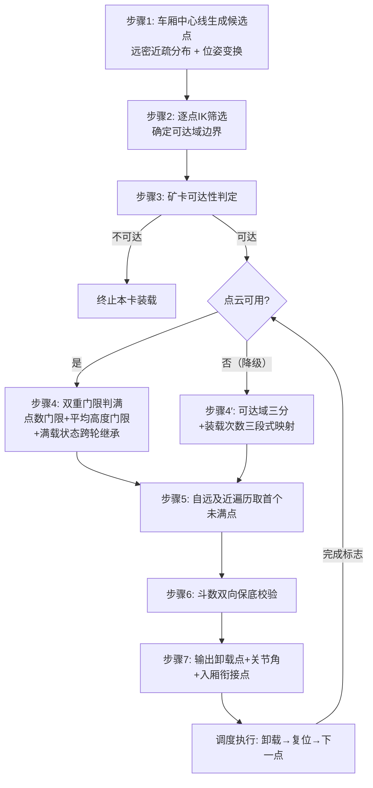

# 专利技术交底书（v5.0）

## 1、名称

一种基于装载进度的挖掘机卸载点动态选取方法及系统

---

## 2、检索报告（找出最接近的现有技术，并进行对比分析）

**检索关键词**：挖掘机 / 装载机 / 铲装机器人 + 自动装车 / 自主卸料 + 卸料点 / 卸载点 / 装载点 + 车厢 / 矿卡 + 点云 / 料位 / 满斗率 + 可达 / 逆运动学；
英文：excavator / loading machine + autonomous truck loading + dump point / dump location / loading position + truck bed + soil distribution / load distribution + reachability / inverse kinematics

**IPC 分类号**：E02F 3/43（挖掘机作业控制）；E02F 9/26（指示/传感装置）；G06T 17/00（三维点云建模）

**检索式**：
S1: (E02F3/43/ic or (挖掘机 or 装载机 or 铲装)/ti,ac,ab) and ((卸载点 or 装载点 or 卸料点)/ti,ac,ab) and ((车厢 or 矿卡 or 点云)/ti,ac,ab)
S2: (excavator or loading machine) and (dump point or dump location or loading position) and (truck bed or soil distribution or load distribution)

**检索记录**：

| 序号 | 申请号 | 发明名称 | 备注 |
|:---:|:---|:---|:---|
| 1 | CN109902857B | 一种运输车辆装载点自动规划方法及系统（徐工） | **最接近（国内，全文级）** |
| 2 | CN114164877B | 用于装载物料的方法、控制器及挖掘设备（中联重科） | 漏检补充·高度相关（网格卸料位+IK+满载终止） |
| 3 | CN115328171B | 装载点位置的生成方法、装置、芯片、终端、设备和介质（慧拓） | 漏检补充·次级结合（矿卡对位+点云避障筛点） |
| 4 | US6363632B1 | System for autonomous excavation and truck loading（CMU） | 国际最接近·上位思想·已过期 |
| 5 | US12216018B2 / US20220314860A1 | System and method for moving material（Deere） | 有效至 2043·逐斗迁移+载荷分布 |
| 6 | CN120122112A | 一种无人化铲装机器人自主卸料和矿卡满斗率检测装置 | 相关 |
| 7 | CN111733918B | 挖掘机卸料作业辅助系统及轨迹规划方法 | 相关 |
| 8 | CN116088365A | 一种基于视觉的自主挖掘作业卸料点定位系统及方法 | 一般 |
| 9 | CN113309169A | 一种无人驾驶装载机室内自主卸料系统及方法 | 一般 |
| 10 | CN113985873A | 一种装载机自主铲掘作业铲掘点规划方法 | 一般 |
| 11 | US6247538B1 / EP3733981B1 / US12686991 | 单个装载位置确定类（目标装载位置/装载位置指定单元） | 一般 |
| 12 | NPL：A Robotic Excavator for Autonomous Truck Loading（CMU） | 与 US6363632B1 同源论文 | 高 |

**检索分析结论**：

**本申请与最接近的专利的对比分析（领导关注点！）**

| 专利号 | 发明名称 | 相同点 | 不同点（即本申请的创新点） |
|:---|:---|:---|:---|
| CN109902857B | 一种运输车辆装载点自动规划方法及系统 | 同领域；均以激光雷达点云感知车厢料面；核心构思均为"依料面状态在车厢上方自动选卸载点"；均解决布料不均/撒料 | ① 本申请**逐候选点求逆运动学可解性**并据此**确定可达域边界**；CN-1 仅有"铲斗安全卸载范围+车沿距离限制"的几何约束，无逐点逆解筛选。② 本申请**点级双重门限判满**（点数门限+局部平均高度门限+点数不足保守判未满）；CN-1 为深度直方图表征凹凸、在凹区域选点，无点数/平均高度双门限。③ 本申请**自最远可达点向近端遍历取首个未满点**并与远密近疏分布构成闭环；CN-1 为按额定载荷百分比阈值切换"装满优先/重心优先"的两阶段原则，非逐点遍历。④ 本申请**斗数双向保底**（上限强制终止+下限不采信全满结论）；CN-1 为单一感知源，无计数反向否决感知结论的逻辑 |
| CN114164877B | 用于装载物料的方法、控制器及挖掘设备 | 均将车厢装载区离散为多个卸料位置；均用逆运动学使铲斗到达卸料位置；均有满载判定后终止 | ① 本申请为**基于每斗实测料面的闭环逐斗重选**；其卸料顺序为预规划、按第一平面顺序重复（说明书明确"不需重新建模/重新指定卸料网格"），不随每斗实测料面重选。② 本申请为**点级双门限判满**；其为整车总重（体积×密度）单一源判满。③ 本申请有**斗数双向保底**；其无。④ 本申请 IK 用于**筛点并定可达域边界**；其 IK 用于执行到位 |
| US6363632B1 | System for autonomous excavation and truck loading | 均"感知车厢料面→逐斗迁移卸载点"上位思想；均自主循环装车 | 其 load point planner 全文仅"plan a sequence of dump points"一句，未公开单点判满判据、可达性筛选、斗数保底；本申请的全部具体机制（②③④⑤）均为其未公开 |
| US12216018B2 | System and method for moving material | 均按传感/载荷信息逐斗迁移卸载位置；均以达容量终止 | ① 本申请为**挖掘机侧自主选点**；其为卡车侧第二控制器定位置后信令挖机。② 本申请为**料面点云双门限**；其为按物料类型的载荷分布先验+称重。③ 本申请**由远及近填未满**；其按物料类型定前/中/后质心目标。④ 本申请**斗数双向保底**；其为单一容量/载荷源终止 |

经仔细查看专利说明书，专利号为 **CN109902857B**、名称为"一种运输车辆装载点自动规划方法及系统"的为本专利申请**最接近的现有技术**，具有参考价值。该专利公开了：使用一台激光雷达在挖掘机作业过程中同时扫描铲斗与运输车辆车厢，对铲斗物料做三维体素建模得体积，对车厢做表面凹凸性三维建模得**车厢内三维立体深度直方图**，并计算车厢中物料体积信息及**载荷分布信息**；权利要求 3 明确"通过深度直方图寻找合适的卸载点"；权利要求 4/5/6 进一步公开了"在铲斗的**安全卸载范围**内"规划装载点、按额定载荷百分比阈值划分**装满优先/重心优先两阶段**、以及在"较深较大的凹区域"选取可容纳铲斗体积的装载点。**需特别指出**：其"安全卸载范围"与"两阶段装载优先"使本申请"可达性"与"基于装载进度"两个上位措辞均被部分触及，故本申请创造性不得建立在这两个上位概念上，而必须建立在"逐点逆解可达域筛选 + 点级双门限判满 + 自远及近遍历 + 斗数双向保底"的具体机制组合上。

同时，本次全文复核新发现两篇此前漏检、且早于本申请的中国同领域授权专利，须一并纳入对比：**CN114164877B（中联重科）**公开了"车厢装载区域三维建模+网格化→按单次运送量划分多个卸料位置+逆运动学使斗尖到达+按整车总重判满终止+按臂架运动半径/铲斗工作高度选挖机工作点"，但其卸料顺序为预规划重复、判满为单一总重源、无斗数保底；**CN115328171B（慧拓）**公开了"点云判断候选点是否有阻碍→多候选点筛选→取最近可用点+云端可用装载路径筛选"，但其解决的是矿卡停靠对位问题而非车厢内卸料点选取。二者均不破坏本申请独权的具体机制组合，但可作为次级结合文献，答复时须预案。

---

## 3、背景技术（别人现在是怎么做的？）

目前，挖掘机自动装车中"卸载点选在哪里"，现有技术主要有六类做法：

（1）**固定点位方案**：车厢内预设固定卸载点，每斗均卸至该点。

（2）**人工指定方案**：远程操作员依据视频画面人工指定卸载位置。

（3）**满斗率/料位检测辅助方案**（以 CN120122112A 与行业方案为代表）：检测车厢料位或满斗率，用于判断整车是否装满或计量装车量，但不参与选点决策。

（4）**轨迹约束点方案**（以 CN111733918B 为代表）：在车体坐标系建立卸料轨迹约束点，按几何约束规划卸料轨迹。

（5）**感知驱动的卸载点序列规划方案**（以 US6363632B1 及同源论文、国内 CN109902857B 为代表）：扫描测量车厢内土料分布/凹凸，据此逐斗计算下一个期望卸载位置。该类方案已属本领域最接近的现有技术。

（6）**网格覆盖式预规划方案**（以 CN114164877B 为代表）：将车厢装载区域三维建模并网格化，按单次运送量划分多个卸料位置并预规划装/卸顺序，用逆运动学执行到位，按整车总重判满终止。

专利 **CN109902857B**，名称为"一种运输车辆装载点自动规划方法及系统"，公开了一种单激光雷达同扫铲斗与车厢、以点云深度直方图表征车厢凹凸并寻找卸载点、按额定载荷百分比阈值切换装满/重心两阶段优先原则、并在铲斗安全卸载范围内选点的方法，其原理如检索报告对比表所述。

**存在的技术问题（现在的做法有什么缺点？）**

1）**选点与可达域脱节**：固定点位/人工指定不校验挖掘机运动学可达性；CN109902857B 虽有"安全卸载范围"但仅为基于铲斗宽度比例的几何约束，CN114164877B 的逆运动学仅用于执行到位而非筛选可达域，卡车停偏时选出的点仍可能不可达，装车失败。

2）**布料与实际料面脱节 / 判满判据缺失或单一**：CN109902857B 以深度直方图在凹区域选点、CN114164877B 以整车总重判满，均未给出"某候选点是否已满"的点级判据，点云稀疏或含尖峰噪点时易误判；US6363632B1 仅"测量土料分布"而无判据。

3）**单点失效即整体失败**：CN109902857B、CN114164877B、US12216018B2 均以**单一感知源**决定装载终止，一次误判即提前终止或持续超装，缺乏计数与感知的交叉校验保底。

4）**布料顺序非闭环**：CN114164877B 的卸料顺序为预规划、按第一平面顺序重复，不随每斗实测料面状态重选；CN109902857B 按整车载荷百分比切换原则而非逐点遍历，易先近后远造成近端堆高、铲斗越料。

5）**与执行层脱节**：选点结果不直接衔接卸载轨迹，需人工或额外模块转换。

---

## 4、发明内容（针对技术问题提出的技术方案）

针对以上的局限性，需要解决以下问题：

1）如何在卡车停靠位置存在偏差时，保证选出的卸载点在当前位姿下**运动学可达**；

2）如何对每个候选点给出**稳定、不抖动的点级判满结论**，拦截点云稀疏与尖峰噪点两类典型误判；

3）如何在**单一感知源误判**时仍维持装载连续性与安全性，不提前终止、不超载；

4）如何使布料顺序**由远及近闭环推进**，避免局部堆高与铲斗撞料；

5）如何使选点结果**直接驱动卸载轨迹**，任何异常下系统都有可执行目标。

为了解决上述技术问题，**本发明采用的技术方案是（我们计划怎么做？）**：

提出"**可达域 ∩ 未满域**驱动的动态选点"：卸载点 = 车厢候选点中同时满足 ① 挖掘机逆运动学**可达**（逐点逆解实测确定可达域边界）、② 料面点云双重门限判定为**未满**、③ 布料顺序（**自远向近遍历**）当前轮到的点；并且任何情形下都受**斗数双向保底**约束。可达域（几何/运动学）、料面状态（感知）、装载斗数（计数）三类信息来源彼此独立、相互交叉校验，任一异常时由其余信息兜底。

具体包括：候选点远密近疏生成 → 逐点 IK 可达性筛选定可达域边界 → 矿卡可达性两级判定 → 点云双重门限判满（或降级为装载次数三段式映射）→ 自远及近遍历取首个未满点 → 斗数双向保底 → 调度执行与回转圆入厢衔接点输出。

---

## 5、具体实施方式（我们具体是怎么做的？参照附图进行说明！）

如图 1 所示，本方法按以下步骤执行：

**步骤 1（候选点生成，远密近疏）**：在矿卡车厢坐标系内沿车厢中心线生成 N 个候选卸载点（优选 N=21），纵向位置非线性分布、远端密集近端稀疏：`t = 1 - (1 - t_raw)^k, k > 1`（优选 k=2.5）；高度 = 车框高度 + 预设卸载高度余量；再按矿卡实测位姿（RTK 中心与航向）变换至挖掘机坐标系。设计动机：布料由远及近，远端最先使用且最先触及可达域边界，加密远端可提高可达域边界判定精度。

**步骤 2（逐点 IK 可达性筛选，定可达域边界）**：对每个候选点求解逆运动学：主解按给定铲斗姿态角求 [回转, 动臂, 斗杆, 铲斗] 关节角；主解失败时改用固定铲斗关节角（优选 25°~30°）的关节-铲斗联合逆解重试；解出关节角须落在 [关节限位 + 安全余量]（优选 2°）内。回转角统一 `swing = (atan2d(y,x) + 180) mod 360`。输出可达候选点集合及其关节角、可达域边界（最远可达索引 idx_far）。**此处逆解可解性作为候选点准入条件并据此确定可达域边界**，区别于现有技术的几何安全范围或执行期逆解。

**步骤 3（矿卡可达性两级判定，第一级保底）**：设阈值 = 0.5×N。`idx_far > 阈值` → 卡车可达；`idx_far ≤ 阈值` 但阈值位置候选点已装满 → 卡车可达（远端不可达但已装满，无需再卸远端）；否则 → 卡车不可达，终止本卡并请求重新停靠。

**步骤 4（点云双重门限判满，主实施方式）**：对每个可达候选点，以该点为中心（沿车头方向偏移预设量）、预设半径的圆形区域为检测区域：① **点数门限**——区域内点云点数 ≤ 点数门限时判"未满"（点云稀疏不采信高度结论，保守取向）；② **高度门限**——点数门限通过后，计算区域内点云**局部平均高度**，平均高度 ≤ 车厢框沿高度 + 预设余量判"未满"，否则判"已满"。采用平均高度而非单点最高点以抑制尖峰噪点；两道门限方向相反各挡一类误判。**满载状态跨轮继承**：上一轮已判满的点本轮直接继承"已满"，不重复检测，防结论抖动翻转。

**步骤 4′（装载次数三段式映射，降级实施方式）**：点云缺失/遮挡/无效时，取可达域三分代表点（最远/中位⌈n/2⌉/最近），按累计装载次数 load_num 三段式映射：`<T1`（优选 3）→ 最远点；`<T2`（优选 6）→ 中位点；`<T3`（优选 9）→ 最近点；`≥T3` → 中位点兜底；布料方向同样由远及近。

**步骤 5（自远及近遍历选点）**：自可达域中最远可达点向最近可达点方向逐点遍历，取第一个判定为"未满"的可达候选点作为当前卸载点；遍历至最近可达点仍全满 → 进入步骤 6 斗数校验后再决定是否判整车装满；输出当前卸载点坐标与对应关节角。

**步骤 6（斗数双向保底，第二级保底）**：上限保底——`LoadNums > MaxLoadNum` 强制结束装车并取可达域中位点补最后一斗（防超载）；下限保底——所有候选点判满但 `LoadNums ≤ MinLoadNum` 时**不信任"全满"结论**，取中位可达点继续装载（防感知误判提前终止）；中位点兜底——任何异常退出路径均输出中位可达点及其关节角，系统永不无解。

**步骤 7（调度执行与轨迹衔接）**：多点多次调度，所选卸载点按远→近顺序执行，卸载完成标志触发复位、复位完成标志触发下一次卸载，状态机驱动推进；并输出**回转圆入厢衔接点**：以回转中心为圆心、半径 `R = coff·|dig_end| + (1-coff)·|unload_point|` 的回转圆与车厢矩形求交，沿回转方向取角度差最小交点，作为卸载轨迹的厢上过渡航路点。

系统由候选点生成模块、IK 可达性筛选模块、矿卡可达性判定模块、双重门限判满模块（含满载状态继承）、由远及近选点模块、斗数保底模块、调度衔接模块组成（图 8）。

---

## 6、本发明的优点（我们这样做有什么优点？）

1）**选出的卸载点必然可达，卡车停靠偏差自适应**：每个候选点经逆运动学双重求解与限位安全余量校验，可达域边界由逐点逆解实测确定；停偏时在缩小后的可达域内选点而非直接失败，偏差超范围时经阈值判定及时止损。

2）**布料与实际料面闭环，车厢由远及近均匀装满**：点云双门限判满结论直接驱动下一卸载点，料面先堆高区域自动跳过；自远及近遍历与远密近疏分布协同，避免局部堆高、撒料与铲斗越料。

3）**双重门限拦截两类典型误判，判满结论稳定可用**：点数门限防稀疏误判、局部平均高度门限防尖峰误判，方向相反各挡一类；配合满载状态跨轮继承，同一点不在相邻轮次反复翻转。

4）**感知与计数互为冗余，单传感器失效不中断作业**：斗数双向保底用独立装载计数交叉校验感知结论——点云误判全满而斗数未达下限则不采信、继续装载；斗数超上限即使点云判未满也强制终止；点云完全不可用时降级为装载次数三段式映射继续作业。

5）**系统永不无解，异常路径全兜底，且选点与轨迹一体化衔接**：任何异常退出路径均输出中位可达点及关节角；选点结果同时输出回转圆入厢衔接点，与下游卸载轨迹航路点无缝对接，无中间转换环节。

---

## 7、本发明的关键点和保护点（领导最关注点！此处不是描述优点，而是描述希望得到专利保护的技术创新点）

**独立权利要求 1（方法）必要技术特征**：

1）**候选点生成**：在矿卡车厢坐标系内沿车厢中心线生成 N 个候选卸载点，呈**远端密集、近端稀疏**的非线性分布，并按矿卡实测位姿变换至挖掘机坐标系；

2）**可达域确定**：对所述候选点**逐一求解挖掘机逆运动学并以逆解可解性作为准入条件**，按带安全余量的关节限位校验，得到可达候选点集合及**可达域边界**；

3）**双重门限判满**：对可达候选点，以该点为中心预设区域内点云判定装载完成状态——区域内点数**大于**点数门限时计算局部平均高度，平均高度不大于车厢框沿高度与预设余量之和判未满、否则判已满；点数**不大于**点数门限时判未满（三要素完整形式）；

4）**由远及近遍历**：自最远可达点向最近可达点方向遍历，取第一个判定为未满的可达候选点作为当前卸载点并输出对应关节角；

5）**斗数双向保底（第一区别特征锚点）**：累计装载斗数**大于上限阈值**时强制结束本车装载并取中位可达点执行最后一斗；全部可达候选点均判已满但累计斗数**不大于下限阈值**时**不采信该已满判定**、取中位可达点继续装载。

**从属保护点（退路）**：

6）满载状态跨轮继承（已判满点不重复检测）；

7）检测区域限定（沿车头方向偏移+预设半径圆形区域、平均高度为算术均值）；

8）候选点分布函数具体式 `t = 1-(1-t_raw)^k, k>1`（优选 k=2.5，N 优选 21）；

9）IK 双重筛选（姿态角主解+固定斗角 25°~30° 联合逆解重试、限位余量优选 2°）；

10）矿卡可达性两级判定（最远可达索引 vs 0.5N 阈值 + 阈值位置已装满豁免）；

11）遍历完毕全满且斗数大于下限阈值时判整车装满并结束；

12）降级实施方式（点云不可用时按装载次数三段式映射至最远/中位/最近可达点）；

13）中位点全兜底（任一异常退出路径输出中位可达点及关节角）；

14）多点多次调度状态机（卸载完成触发复位、复位完成触发下一次卸载）；

15）回转圆入厢衔接点（半径加权 `R = coff·|dig_end| + (1-coff)·|unload_point|` 与车厢矩形求交、取回转角差最小交点）；

16）对应系统权利要求（七模块）与计算机可读存储介质。

**布局说明**：独权 1 的 ③④⑤ 为与 CN109902857B、CN114164877B、US6363632B1、US12216018B2 的核心区别，三者互为因果（判满→遍历方向→保底校验）；**⑤斗数双向保底为全案最强、最干净的区别特征**（四篇最接近文献均为单一感知源判满即终止，无"计数反向否决感知结论"逻辑），作为创造性论证锚点置于最前；②的逆运动学措辞收紧为"以逆解可解性筛选候选点并确定可达域边界"，以区别于 CN114164877B 的执行期逆解与 CN109902857B 的几何安全范围。

---

## 8、替代方式

1）候选点数量 N=21 可替换为 N≥5 任意数量；分布函数可替换为任意远密近疏函数（指数、分段线性），退化为均匀分布亦落入主线；

2）候选线位置可由车厢中心线扩展为中心线两侧多排候选线；高度取值可由"车框+固定余量"替换为按车型配置的卸载高度；

3）IK 求解可由解析逆解替换为数值迭代逆解、几何法；

4）进度评估可由点云双门限（主）与装载次数映射（降级）组合使用，或替换为车厢称重、料位雷达；判定门限可替换为中值高度、高度方差辅助、按物料类型切换门限；

5）布料顺序可由远及近替换为由近及远（短回转工况）、交替布料；保底参数 Max/Min 斗数阈值可替换为按车型额定方量换算的阈值；

6）调度可由 K=3 点×M=3 次替换为任意 K×M 组合或单点单次退化；入厢衔接可替换为直接取卸载点、按固定半径圆弧过渡；

7）应用场景可由挖掘机装矿卡扩展至装载机、电铲装卡车等凡存在可达域约束与布料需求的场景。

---

## 9、附图

**图 1**：方法总体流程图

**图 2**：候选点远密近疏分布与可达域边界示意图
**图 3**：IK 双重筛选流程图（主解 + 固定斗角保底 + 限位校验）
**图 4**：点云双重门限装满判定示意图（点数门限 + 高度门限）
**图 5**：降级实施方式——可达域三分与装载次数三段式映射示意图（远/中/近）
**图 6**：斗数双向保底逻辑流程图（上限终止 / 下限继续 / 中位兜底）
**图 7**：与最接近现有技术对比示意图（CN109902857B 直方图+两阶段 / CN114164877B 网格预规划 vs 本案可达域∩未满域+斗数交叉校验的选点闭环）
**图 8**：系统架构图（七模块）

---

**文档版本**：v5.0（模板重排版：按九节交底书模板重排；合并 v4.0 的 CN-1 三梯队详细答辩与 v4.1 的 F-1/F-11 全文复核结论；新增漏检文献 CN114164877B（中联重科）、CN115328171B（慧拓）；修正 CN-1"可达性完全缺失"过头断言为"仅几何安全卸载范围"；新增对 CN-1"两阶段装载优先"的正面回应；独权重心下移，斗数双向保底提为第一区别特征锚点）
**历史版本**：v4.1（2026-09 全文复核修订版）；v4.0（真实检索强化版）；v3.0（方案 A 收窄独权版）
**创建日期**：2026-09-04
