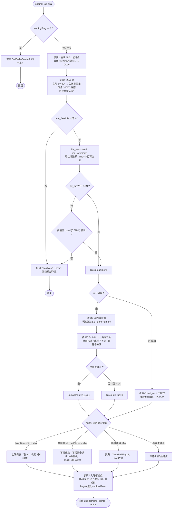
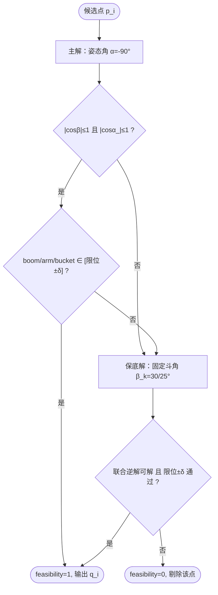
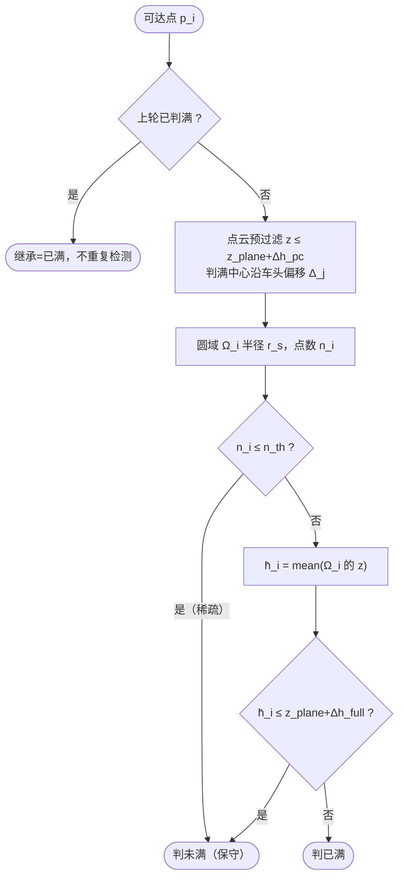
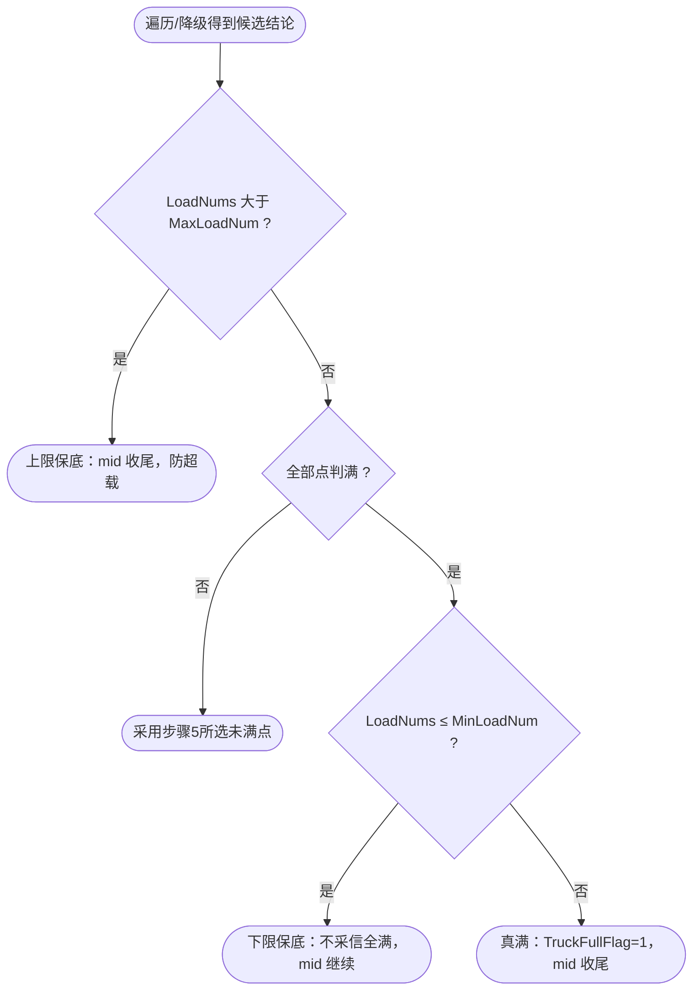

# 专利技术交底书（v5.1）

> **v5.1 修订说明（据评审/领导意见）**：在 v5.0 九节模板基础上，① 将"远密近疏/双重门限/斗数双向保底/三段式映射"等概念性描述**全部细化为与工程代码 `UP.m`/`unloadP.m`/`dump_trajectory_node.cpp` 一致的公式、判定条件与分支处理**；② 补**真实阈值表**（区分代码固定值/配置默认/现场标定）；③ 主流程图补全**全部判断分支**并增 IK/判满/保底**子流程图**与**判定条件-分支-处理表**；④ 补**异常处理流程与错误码**；⑤ 新增**多机制联动关系**一节，将创造性主张由"按装载进度选点"上移为"三源交叉校验 + 计数对感知反向否决"的闭环；⑥ 补**量化效果**（结构性保证 + 待实机测试占位，未编造数据）；⑦ 增**卸载效果图**（示意 + 真图占位）；⑧ 增**泄密与脱敏标注（待康院审核）**。
> **实现事实核对**：核心机制②③④⑤在 `matlab/UP.m` 中真实实现；"远密近疏 `t=1-(1-t)^k`"在 `matlab/unloadP.m`（V2.0，已移除满载判断、改 load_num 三段式）中实现。二者为并行/演进版本，本交底书主张其**组合实施例**。

---
  
## 1、名称

一种基于装载进度的挖掘机卸载点动态选取方法及系统

---

## 2、检索报告（找出最接近的现有技术，并进行对比分析）

**检索关键词**：挖掘机 / 装载机 / 铲装机器人 + 自动装车 / 自主卸料 + 卸料点 / 卸载点 / 装载点 + 车厢 / 矿卡 + 点云 / 料位 / 满斗率 + 可达 / 逆运动学；
英文：excavator / loading machine + autonomous truck loading + dump point / dump location / loading position + truck bed + soil distribution / load distribution + reachability / inverse kinematics

**IPC 分类号**：E02F 3/43（挖掘机作业控制）；E02F 9/26（指示/传感装置）；G06T 17/00（三维点云建模）

**检索式**：
S1: (E02F3/43/ic or (挖掘机 or 装载机 or 铲装)/ti,ac,ab) and ((卸载点 or 装载点 or 卸料点)/ti,ac,ab) and ((车厢 or 矿卡 or 点云)/ti,ac,ab)
S2: (excavator or loading machine) and (dump point or dump location or loading position) and (truck bed or soil distribution or load distribution)

**检索记录**：

| 序号 | 申请号 | 发明名称 | 备注 |
|:---:|:---|:---|:---|
| 1 | CN109902857B | 一种运输车辆装载点自动规划方法及系统（徐工） | **最接近（国内，全文级）** |
| 2 | CN114164877B | 用于装载物料的方法、控制器及挖掘设备（中联重科） | 漏检补充·高度相关（网格卸料位+IK+满载终止） |
| 3 | CN115328171B | 装载点位置的生成方法、装置、芯片、终端、设备和介质（慧拓） | 漏检补充·次级结合（矿卡对位+点云避障筛点） |
| 4 | US6363632B1 | System for autonomous excavation and truck loading（CMU） | 国际最接近·上位思想·已过期 |
| 5 | US12216018B2 / US20220314860A1 | System and method for moving material（Deere） | 有效至 2043·逐斗迁移+载荷分布 |
| 6 | CN120122112A | 一种无人化铲装机器人自主卸料和矿卡满斗率检测装置 | 相关 |
| 7 | CN111733918B | 挖掘机卸料作业辅助系统及轨迹规划方法 | 相关 |
| 8 | CN116088365A | 一种基于视觉的自主挖掘作业卸料点定位系统及方法 | 一般 |
| 9 | CN113309169A | 一种无人驾驶装载机室内自主卸料系统及方法 | 一般 |
| 10 | CN113985873A | 一种装载机自主铲掘作业铲掘点规划方法 | 一般 |
| 11 | US6247538B1 / EP3733981B1 / US12686991 | 单个装载位置确定类（目标装载位置/装载位置指定单元） | 一般 |
| 12 | NPL：A Robotic Excavator for Autonomous Truck Loading（CMU） | 与 US6363632B1 同源论文 | 高 |

**检索分析结论 · 本申请与最接近专利的对比分析（领导关注点！）**

| 专利号 | 发明名称 | 相同点 | 不同点（即本申请的创新点） |
|:---|:---|:---|:---|
| CN109902857B | 一种运输车辆装载点自动规划方法及系统 | 同领域；均以激光雷达点云感知车厢料面；核心构思均为"依料面状态在车厢上方自动选卸载点"；均解决布料不均/撒料 | ① 本申请**逐候选点求逆运动学可解性**并据此**确定可达域边界**；CN-1 仅有"铲斗安全卸载范围+车沿距离限制"的几何约束，无逐点逆解筛选。② 本申请**点级双重门限判满**（点数门限+局部平均高度门限+点数不足保守判未满）；CN-1 为深度直方图表征凹凸、在凹区域选点，无点数/平均高度双门限。③ 本申请**自最远可达点向近端遍历取首个未满点**；CN-1 为按额定载荷百分比阈值切换"装满优先/重心优先"两阶段原则，非逐点遍历。④ 本申请**斗数双向保底**（上限强制终止+下限不采信全满结论）；CN-1 为单一感知源，无计数反向否决感知结论的逻辑 |
| CN114164877B | 用于装载物料的方法、控制器及挖掘设备 | 均将车厢装载区离散为多个卸料位置；均用逆运动学使铲斗到达卸料位置；均有满载判定后终止 | ① 本申请为**基于每斗实测料面的闭环逐斗重选**；其卸料顺序为预规划、按第一平面顺序重复（说明书明确"不需重新建模/重新指定卸料网格"）。② 本申请为**点级双门限判满**；其为整车总重（体积×密度）单一源判满。③ 本申请有**斗数双向保底**；其无。④ 本申请 IK 用于**筛点并定可达域边界**；其 IK 用于执行到位 |
| US6363632B1 | System for autonomous excavation and truck loading | 均"感知车厢料面→逐斗迁移卸载点"上位思想；均自主循环装车 | 其 load point planner 全文仅"plan a sequence of dump points"一句，未公开单点判满判据、可达性筛选、斗数保底；本申请全部具体机制（②③④⑤）均为其未公开 |
| US12216018B2 | System and method for moving material | 均按传感/载荷信息逐斗迁移卸载位置；均以达容量终止 | ① 本申请为**挖掘机侧自主选点**；其为卡车侧第二控制器定位置后信令挖机。② 本申请为**料面点云双门限**；其为按物料类型的载荷分布先验+称重。③ 本申请**由远及近填未满**；其按物料类型定前/中/后质心目标。④ 本申请**斗数双向保底**；其为单一容量/载荷源终止 |

经仔细查看专利说明书，专利号 **CN109902857B**、名称"一种运输车辆装载点自动规划方法及系统"为本申请**最接近的现有技术**。该专利公开：单激光雷达同扫铲斗与车厢，对车厢做**三维立体深度直方图**表征凹凸并计算**载荷分布**；权利要求 3"通过深度直方图寻找合适的卸载点"；权利要求 4/5/6 公开"在铲斗**安全卸载范围**内"规划装载点、按额定载荷百分比阈值划分**装满优先/重心优先两阶段**、在"较深较大的凹区域"选点。**需特别指出**：其"安全卸载范围"与"两阶段装载优先"使本申请"可达性"与"基于装载进度"两个上位措辞均被部分触及，故创造性不得建立在这两个上位概念上，而必须建立在"逐点逆解可达域筛选 + 点级双门限判满 + 自远及近遍历 + 斗数双向保底"的**具体机制组合及其联动**上（详见 4.1）。

本次全文复核另发现两篇此前漏检、早于本申请的中国同领域授权专利：**CN114164877B（中联重科）**（车厢三维建模+网格化→按单次运送量划分卸料位+逆运动学到位+整车总重判满终止；但顺序预规划重复、单一总重源、无斗数保底）；**CN115328171B（慧拓）**（点云判候选点阻碍→多点筛选→取最近可用+云端路径校验；但解决矿卡停靠对位而非车厢内卸料点选取）。二者均不破坏本申请独权的具体机制组合，作为次级结合文献，答复时须预案。

---

## 3、背景技术（别人现在是怎么做的？）

挖掘机自动装车中"卸载点选在哪里"，现有技术主要有六类做法：

（1）**固定点位方案**：车厢内预设固定卸载点，每斗均卸至该点。
（2）**人工指定方案**：远程操作员依据视频画面人工指定卸载位置。
（3）**满斗率/料位检测辅助方案**（CN120122112A 等）：检测料位/满斗率用于判断整车装满或计量，但不参与选点决策。
（4）**轨迹约束点方案**（CN111733918B）：在车体坐标系建立卸料轨迹约束点，按几何约束规划卸料轨迹。
（5）**感知驱动的卸载点序列规划方案**（US6363632B1 及同源论文、CN109902857B）：扫描车厢土料分布/凹凸，逐斗计算下一期望卸载位置。属本领域最接近现有技术。
（6）**网格覆盖式预规划方案**（CN114164877B）：车厢装载区三维建模并网格化，按单次运送量划分卸料位并预规划顺序，逆运动学执行到位，整车总重判满终止。

**存在的技术问题（缺点）**：

1）**选点与可达域脱节**：固定点位/人工指定不校验运动学可达性；CN109902857B 的"安全卸载范围"仅为基于铲斗宽度比例的几何约束，CN114164877B 的逆运动学仅用于执行到位而非筛选可达域，卡车停偏时选出的点仍可能不可达。
2）**判满判据缺失或单一**：CN109902857B 深度直方图在凹区域选点、CN114164877B 整车总重判满，均无"某候选点是否已满"的点级判据；点云稀疏或含尖峰噪点时易误判。
3）**单点失效即整体失败**：CN109902857B、CN114164877B、US12216018B2 均以**单一感知源**决定装载终止，一次误判即提前终止或持续超装，缺乏计数与感知的交叉校验。
4）**布料顺序非闭环**：CN114164877B 顺序预规划重复、CN109902857B 按整车载荷百分比切换，均非逐点遍历，易先近后远造成近端堆高、铲斗越料。
5）**与执行层脱节**：选点结果不直接衔接卸载轨迹，需人工或额外模块转换。

---

## 4、发明内容（针对技术问题提出的技术方案）

**待解决问题**：1）卡车停偏时保证卸载点**运动学可达**；2）对每个候选点给出**稳定、不抖动的点级判满结论**；3）**单一感知源误判**时仍维持装载连续性与安全性；4）布料顺序**由远及近闭环推进**；5）选点结果**直接驱动卸载轨迹**、任何异常都有可执行目标。

**总体方案**：提出"**可达域 ∩ 未满域**驱动的动态选点、以**斗数双向保底**兜底"。卸载点 = 车厢候选点中同时满足 ①逆运动学**可达**、②料面点云双门限判定**未满**、③布料顺序（**自远及近遍历**）当前轮到的点；任何情形下都受**斗数双向保底**约束。可达域（几何/运动学）、料面状态（感知）、装载斗数（计数）三源独立、交叉校验，任一异常由其余兜底。

**处理链**：候选点生成 → 逐点 IK 可达性筛选定可达域边界 → 矿卡可达性两级判定 → 点云双门限判满（或降级 load_num 三段式）→ 自远及近遍历取首个未满点 → 斗数双向保底 → 调度执行与回转圆入厢衔接点输出。

### 4.1 多机制联动关系（本发明创造性主线 · 回应评审建议2）

评审指出"仅按装载进度动态调整卸载点"与 CN109902857B/CN114164877B 存在重合、作为唯一核心创新点偏弱。本发明的创造性**不落在"按进度选点"这一上位思想**，而落在下述**三源因果闭环 + 计数对感知的反向否决**：

- **可达域（几何/IK）→ 约束"能去哪"**：逐点逆解可解性决定可达集合 F 与边界 `idx_far`，并决定中位兜底点；这是选点的**硬约束前置**。
- **感知（点云双门限）→ 在可达域内定位"哪里还没满"**：仅在 F 内、由远及近判满，感知结论**受可达域裁剪**。
- **计数（斗数）→ 独立于感知的第二判据，对感知行使否决权/终止权**：`LoadNums≤MinLoadNum` 且感知全判满时**不采信感知**（反向否决，防误停）；`LoadNums>MaxLoadNum` 时**强制终止**（防超载）。
- **交叉兜底**：感知失效→load_num 三段式；可达域不足→两级判定/请求重新停靠；计数越界→中位点收尾。**任一单源异常，系统仍输出可执行卸载点（永不无解）**。

> **联动命题（形式化）**：设可达域 R、未满域 U（感知）、计数约束 C，则卸载点 `p* = argfirst_{i∈R, 由远及近}(i∈U)`，且 `p*` 经 C 修正：`C` 可在 `U=∅` 时否决"满"结论（下限）或在计数越界时终止（上限）。三者的**耦合与相互否决**构成本发明区别于"单一感知源判满即终止"现有技术（CN-1/CN114164877B/US12216018B2）的实质特征。

---

## 5、具体实施方式（公式化 + 判定条件 + 分支处理，参照附图）

### 5.0 符号与真实参数

| 符号 | 含义 | 值/来源 | 类别 |
|:---|:---|:---|:---|
| N | 候选点数 | 21（`UP.m`/`unloadP.m` 固定） | 代码固定 |
| L_b, L_a, L_k | 动臂/斗杆/铲斗齿长(m) | 6.987 / 2.797 / 2.359（`dump_trajectory.yaml`） | 配置默认【敏感·机型几何，待审】 |
| b_x,b_y,b_z | 回转中心→动臂铰点偏置(m) | 0.09 / 0.03 / 0.0（同上） | 配置默认 |
| boom/arm/bucket 限位(°) | 关节限位 | [-25,50] / [-150,-30] / [-135,30]（同上） | 配置默认 |
| δ | 关节安全余量(°) | 2（`UP.m` `safe_bias=2`） | 代码固定 |
| α | 卸载铲斗姿态角(°) | -90（齿尖朝下，`feasibility.bucket_attitude_deg`） | 配置默认 |
| β_k | IK 保底固定斗角(°) | 30（`UP.m`）/ 25（`multi_unload_selector.m`） | 代码固定 |
| k | 远密近疏指数 | 2.5（`unloadP.m` V2.0） | 代码固定 |
| θ | 矿卡可达阈值 | 0.5·N = 10.5（`UP.m`） | 代码固定 |
| R_coff | 入厢回转圆混合系数 | 0.5（`waypoint_generator.h`） | 配置默认 |
| L×W | 车厢长×宽(m) | 5.0 × 2.6（`dump_trajectory.yaml`） | 配置默认 |
| T1,T2,T3 | load_num 三段阈值(斗) | 3 / 6 / 9（`unloadP.m` sel_tag） | 代码固定 |
| n_th | 点数门限 `num_soilPoint` | 现场标定 | **现场标定【待填】** |
| r_s | 判满检测圆半径 `select_soil_radius` | 现场标定 | **现场标定【待填】** |
| Δh_full | 满载高度余量 `full_Height_bias` | 现场标定 | **现场标定【待填】** |
| Δh_pc | 点云高度过滤偏置 `ptCloudBias` | 现场标定 | **现场标定【待填】** |
| Δ_j | 判满点头部偏移 `JudgeFullBias` | 现场标定 | **现场标定【待填】** |
| h_up | 卸载点高度余量 `unloadPoint_HeightBias` | 现场标定 | **现场标定【待填】** |
| MaxLoadNum / MinLoadNum | 斗数上/下限 | 现场标定 | **现场标定【待填】** |

> 说明：**现场标定项无代码内数值默认（为 Simulink 运行时输入），本文不臆造具体数字**，以符号 + 建议量级给出，最终以产线标定为准；对外公开文本建议符号化/给区间（见第 10 节脱敏）。

### 5.1 步骤 1：候选点生成

**基线（`UP.m`，等距）**：沿车厢纵轴预设位置
`s_i = linspace(-(L/2 + d_start), (L/2 + d_end), N), i=1..N`
候选点（挖机 base 系，ψ 为矿卡航向角，c 为车厢中心）：
`p_i = ( c_x + s_i·cosψ, c_y + s_i·sinψ, c_z + H/2 + h_up )`

**优选改进（`unloadP.m` V2.0，远密近疏）**：给定近点 p_near、远点 p_far，
`t_raw = (i-1)/(N-1)`，`t = 1 - (1 - t_raw)^k, k=2.5`，
`p_i = p_near + t·(p_far - p_near)`（z 取 p_near_z）。
**动机**：布料由远及近，远端最先使用且最先触及可达域边界，加密远端可提高 `idx_far` 判定精度。等距与远密近疏均落入权利要求①。

### 5.2 步骤 2：逐点 IK 可解性筛选，定可达域边界

对每个 p_i=(x,y,z) 求关节角 q=[swing, boom, arm, bucket]。**主解**（给定姿态角 α）：
- `swing = mod(atan2d(y, x) + 180, 360)`
- 平面内：`x_1 = (x - b_x·cos·swing)/cos·swing`（含 swing=±90° 特例），`z_1 = z - b_z`
- `x_3 = x_1 - L_k'·cosα, z_3 = z_1 - L_k'·sinα`（`L_k' = L_k·bucket_bias`）
- `l_5 = √(x_1²+z_1²), l_6 = √(x_3²+z_3²)`
- `cosβ = (l_5²+l_6²-L_k'²)/(2 l_5 l_6)`，`cosα_ = (L_b²+l_6²-L_a²)/(2 L_b l_6)`
- `boom = atan2d(z_1,x_1) + acosd(cosβ) + acosd(cosα_)`
- `arm = acosd((L_b²+L_a²-l_6²)/(2 L_b L_a)) - 180`
- `bucket = α - boom - arm`

**保底解**（主解失败时，固定铲斗关节角 β_k=30°/25°）：关节-铲斗联合逆解（以 FV、CV 及余弦定理解 boom/arm），同样过可解性与限位判据。

**判定条件-分支-处理（表 A）**：

| 判据 | 条件 | 分支处理 |
|:---|:---|:---|
| C1 可解性 | `|cosβ|≤1 且 |cosα_|≤1` | 否 → feasibility=0（该点不可解） |
| C2 限位余量 | boom,arm,bucket 均 ∈ `[lo+δ, hi-δ]` | 否 → feasibility=0 |
| 主解失败 | C1 或 C2 不满足 | 触发保底解（固定斗角 β_k 联合逆解）重判 |
| 保底仍失败 | — | feasibility=0，该点剔除 |

**可达域**：`F = { i | feasibility_i = 1 }`；`idx_near = min F`，`idx_far = max F`（**最远可达索引即可达域边界**），`num_feasible = |F|`；中位可达索引 `mid = F(round(|F|/2))`。
> **区别点**：此处**逆解可解性作为候选点准入条件并据此确定可达域边界**，区别于 CN-1 的几何安全范围、CN114164877B 的执行期逆解。

### 5.3 步骤 3：矿卡可达性两级判定（表 B）

阈值 `θ = 0.5·N = 10.5`。

| 级 | 条件 | 处理 |
|:---|:---|:---|
| 前置 | `num_feasible == 0` | TruckFeasible=0，返回（error），请求重新停靠 |
| L1 | `idx_far > θ` | TruckFeasible=1（可达） |
| L2 | `1 ≤ idx_far ≤ θ` 且 `SoilFullInPoint(round(θ)) == 1` | TruckFeasible=1（远端不可达但阈值位已装满，无需再卸远端，豁免） |
| 否则 | — | TruckFeasible=0，终止本卡（error2），请求重新停靠 |

### 5.4 步骤 4：点云双重门限判满（`JudgeSoilFullInPoint`，主实施方式）

**点云预过滤**：`P' = { p∈P | z ≤ z_plane + Δh_pc }`，`z_plane = c_z + H/2`（去除高于车厢平面+偏置的点，抑制噪点/铲斗）。
**判满中心**（沿车头偏移）：`g_i = ( p_i.x + Δ_j·cosψ, p_i.y + Δ_j·sinψ )`。
**圆域**：`Ω_i = { p∈P' | ‖p_xy − g_i,xy‖₂ < r_s }`，`n_i = |Ω_i|`。

**判定条件-分支-处理（表 C）**：

| 门限 | 条件 | 判定 | 设计意图 |
|:---|:---|:---|:---|
| 门限1 点数 | `n_i ≤ n_th` | **未满**（不计算高度） | 点云稀疏不采信高度结论，**保守取向**（防稀疏误判为满） |
| 门限2 高度 | `n_i > n_th` 且 `h̄_i = mean_{Ω_i}(z) ≤ z_full` | **未满** | 用**局部平均高度** `z_full = z_plane + Δh_full`，抑尖峰噪点 |
| 门限2 高度 | `n_i > n_th` 且 `h̄_i > z_full` | **已满** | — |
| 跨轮继承 | 上轮 `SoilFullInPoint_(i)==1` | 本轮直接=已满，不重复检测 | 防结论在相邻轮次抖动翻转 |

> 两道门限**方向相反、各挡一类误判**（稀疏→门限1；尖峰→门限2 取均值）；区别于 CN-1 深度直方图/凹区域、CN114164877B 整车总重单一源。

### 5.4′ 步骤 4′：降级——load_num 三段式映射（`unloadP.m` V2.0）

点云缺失/遮挡/无效时，取可达域三分代表点 far/mid/near（`mid = 第 round(num_feasible/2) 个可达点`），按累计装载次数 `load_num` 映射：

| 条件 | 选点 |
|:---|:---|
| `load_num < T1(3)` | 最远可达点 far |
| `T1 ≤ load_num < T2(6)` | 中位可达点 mid |
| `T2 ≤ load_num < T3(9)` | 最近可达点 near |
| `load_num ≥ T3(9)` | 中位可达点 mid（兜底） |

布料方向同样由远及近，保证降级工况系统永不无解。

### 5.5 步骤 5：自远及近遍历选点（表 D）

`for i = N : −1 : 1`（由远及近）：

| 情形 | 处理 |
|:---|:---|
| `feasibility_i = 0`（不可达） | 跳过（标记未满不可达） |
| 可达且上轮已满（继承） | 视为已满，继续向近端 |
| 可达且判**未满** | **选 p_i 为当前卸载点，输出 q_i，break** |
| 遍历至 `i=1` 仍无未满点 | `TruckFullFlag=1`，进入步骤 6 校验 |

### 5.6 步骤 6：斗数双向保底（表 E · 第一区别特征锚点）

中位可达点 `mid = p_{F(round(|F|/2))}`。

| 分支 | 条件 | 处理 | 目的 |
|:---|:---|:---|:---|
| 上限保底 | `LoadNums > MaxLoadNum` | 取中位点 mid 执行最后一斗并结束 | **防超载** |
| 下限保底 | 全部判满（`∄i: SoilFullInPoint_i=0`）且 `LoadNums ≤ MinLoadNum` | **不采信"全满"结论**，取 mid 继续，`TruckFullFlag=0` | **防感知误判提前终止** |
| 真满收尾 | 全部判满且 `MinLoadNum < LoadNums ≤ MaxLoadNum` | `TruckFullFlag=1`，取 mid 收尾 | 正常装满 |
| 正常 | 存在未满点 | 保持步骤 5 所选点 | — |

> **任何 return 路径 `unloadPoint` 均有值（mid 兜底）→ 系统永不无解。** ⑤为全案最强、最干净区别特征：四篇最接近文献均为单一感知源判满即终止，**无"计数反向否决感知结论"逻辑**。

### 5.7 步骤 7：调度执行与回转圆入厢衔接点

**调度状态机**（`multi_unload_scheduler.m`）：`loadingFlag` 触发→选点→由远及近逐点执行；`dump_done_flag` 触发复位、`reset_done_flag` 触发下一次卸载，状态机推进（sched_state 0 空闲/1 已选点/2 执行中/3 完成）。

**入厢衔接点**（`calc_entry_point_circle_strategy`）：
- `dig_end = FK(start_joint)` 齿尖 XY；`R1=‖dig_end‖, R2=‖unloadPoint_xy‖`
- `R = R_coff·R1 + (1−R_coff)·R2`（R_coff=0.5）
- `R < 1e−6` → flag=0 退化，入厢点=unloadPoint_xy
- 圆与车厢矩形（局部系 L×W，中心/航向）四边求交：有交点→沿 `rot_dir` 取与 dig_end swing **角差最小**交点（flag=1）；无交点→最近边投影点（flag=2）
- `rot_dir` 由 dig_end→unload 最短弧自动判定

### 5.8 异常处理流程与错误码（表 F · 真实代码）

| 层级 | 触发条件 | 处理 | 来源 |
|:---|:---|:---|:---|
| 选点 | `loadingFlag==2` | 重置 `SoilFullInPoint=0`（新一车） | `UP.m` |
| 选点 | `loadingFlag≤0.57` | 跳过 IK 计算 | `unloadP.m` |
| 选点 | `num_feasible==0` | TruckFeasible=0，error 返回，请求重新停靠 | `UP.m` |
| 选点 | 入厢 `flag==0`（R 退化） | 入厢点回退为 unloadPoint_xy | `UP.m` |
| 执行 | `CheckReachable` 失败 | `ReportFeasible(false)` + **error_code=1**（卡车位置无法卸载） | `dump_trajectory_node.cpp` |
| 执行 | `GenerateDumpWaypoints` 失败（WP4 IK） | **error_code=2**（轨迹规划失败） | 同上 |
| 执行 | 航路点限位 clamp 修正量 > `waypoint_clamp_abort_deg(5°)` | 判上游航路点不可信，**终止激活** | `dump_trajectory.yaml` |
| 执行 | 段完成判定 | 需连续 `segment_confirm_frames(3)` 帧确认（防液压振荡误判） | 同上 |
| 执行 | 段耗时 > 预期×`segment_timeout_factor(2.0)` | 强制推进下一段 | 同上 |
| 执行 | 铲斗高度门控未达 `truck_top_height(2.0)+clear_margin(1.8)` | `gate_timeout(4s)` 后自动提升 boom `gate_boost(3°)`，最多 `gate_max_boost_count(6)` 次；仍不达→终止卸载 | 同上 |
| 执行 | 运行期中止 | **error_code=3**（`ReportExecutionAbort`），区别于正常完成 `FinishFlag=1.0` | `status_reporter.h` |
| 全局 | 超时 `total_timeout_sec(30s)`；发布 `publish_rate(10Hz)` | 超时保护/固定节拍发布 | `dump_trajectory.yaml` |

### 5.9 系统模块（图 8）

候选点生成模块 → IK 可达性筛选模块 → 矿卡可达性判定模块 → 双门限判满模块（含满载跨轮继承）→ 由远及近选点模块 → 斗数双向保底模块 → 调度与入厢衔接模块；执行层含段完成确认、超时推进、高度门控重试、clamp 中止与错误码上报。

---

## 6、本发明的优点（含量化效果）

1）**选出的卸载点必然可达**：卸载点必取自可达集合 F（IK 可解 + 限位余量 δ），**构造性保证"选出即可达"**；停偏时在缩小后的可达域内选点，偏差超范围经两级判定及时止损。
2）**布料与实际料面闭环，由远及近均匀装满**：双门限判满直接驱动下一卸载点，先堆高区域自动跳过，避免局部堆高、撒料与铲斗越料。
3）**双重门限拦截两类典型误判**：门限1 防稀疏误判、门限2（均值）防尖峰误判，方向相反；配合跨轮继承，同一点不在相邻轮次反复翻转。
4）**感知与计数互为冗余**：下限保底防感知误判提前终止、上限保底防超载；点云不可用降级 load_num 三段式，单传感器失效不中断作业。
5）**系统永不无解 + 选点与轨迹一体化衔接**：所有异常路径输出中位可达点及关节角；同时输出回转圆入厢衔接点，与下游卸载轨迹航路点无缝对接。

### 6.1 量化效果

**A. 结构性可保证指标（由算法构造直接成立，可论证）**：

| 指标 | 保证方式 | 结论 |
|:---|:---|:---|
| 卸载点可达率 | 仅从 IK 可解+限位余量的 F 中选点 | 100%（构造性） |
| 稀疏误判拦截 | 门限1：`n_i≤n_th` 强制判未满 | 结构性拦截 |
| 尖峰误判拦截 | 门限2：用局部均值而非单点最高 | 结构性抑制 |
| 结论抖动 | 满载跨轮继承 | 相邻轮不翻转 |
| 误停/超载 | 下限/上限双向保底 | 双向防护 |
| 无解率 | 所有 return 输出中位点 | 0（永不无解） |

**B. 待实机测试填充指标（占位，未编造数据）**：

| 指标 | 采集方法 | 数据 |
|:---|:---|:---|
| 停偏工况选点成功率 | 注入 ±X cm 停靠偏差，统计成功选点/装车 | 【待测试填充】 |
| 单斗判满准确率 / 两类误判拦截次数 | 对比人工标注料面与算法判定 | 【待测试填充】 |
| 方量利用率 / 满载率 | 装车方量 ÷ 车厢额定方量 | 【待测试填充】 |
| 平均装车斗数与节拍 | 统计每车斗数与单循环耗时 | 【待测试填充】 |
| 感知失效降级可用率 | 遮蔽点云，统计 load_num 降级下完成率 | 【待测试填充】 |

> 请提供上述实机/台架测试数据以替换占位；**在获得真实数据前不填入任何具体数值**。

---

## 7、本发明的关键点和保护点（领导最关注点）

**独立权利要求 1（方法）必要技术特征**：

①**候选点生成**：矿卡车厢坐标系内沿中心线生成 N 个候选卸载点，呈**远端密集、近端稀疏**非线性分布（优选 `t=1-(1-t_raw)^k, k>1`），并按矿卡实测位姿变换至挖机坐标系；
②**可达域确定**：对候选点**逐一求逆运动学并以逆解可解性作为准入条件**（主解+固定斗角保底解），按带安全余量 δ 的关节限位校验，得可达集合 F 及**可达域边界 idx_far**；
③**双重门限判满**：对可达点，以沿车头偏移的预设圆域内点云判定——点数**大于**门限时算局部平均高度，平均高度不大于 `z_plane+Δh_full` 判未满、否则已满；点数**不大于**门限时判未满（三要素完整）；
④**由远及近遍历**：自 idx_far 向 idx_near 遍历，取首个未满可达点为当前卸载点并输出关节角；
⑤**斗数双向保底（第一区别特征锚点）**：`LoadNums>MaxLoadNum` 强制结束并取中位点执行最后一斗；全部判满但 `LoadNums≤MinLoadNum` 时**不采信已满判定**、取中位点继续。

**从属保护点（退路）**：⑥满载跨轮继承；⑦检测圆域限定（车头偏移+半径+算术均值）；⑧分布函数式与 N/k 优选值；⑨IK 双重筛选（α 主解+β_k 保底+δ 余量）；⑩矿卡可达两级判定（idx_far vs 0.5N + 阈值位装满豁免）；⑪遍历毕全满且斗数大于下限时判整车装满；⑫降级 load_num 三段式；⑬中位点全兜底；⑭多点多次调度状态机；⑮回转圆入厢衔接点（R 加权+矩形求交+角差最小）；⑯系统权利要求（七模块）与计算机可读存储介质；⑰**执行层异常处理链**（段确认帧/超时推进/高度门控重试/clamp 中止/错误码 1-2-3）作为系统从属。

**布局说明**：③④⑤为核心区别且**互为因果**（判满→遍历方向→保底校验），并以 4.1 的**三源联动/反向否决**作为创造性主线；**⑤为最强、最干净区别特征**，置于论证最前；②措辞收紧为"以逆解可解性筛选候选点并确定可达域边界"，区别于 CN114164877B 执行期逆解与 CN-1 几何安全范围。**不保护**"感知料面→选卸载点"上位思想（已被 CN109902857B/US6363632B1 公开）。

---

## 8、替代方式

1）N=21 可替换为 N≥5 任意值；分布函数可替换为任意远密近疏函数（指数/分段线性），退化为均匀分布亦落入主线；
2）候选线可由中心线扩展为两侧多排；高度可由"车框+固定余量"替换为按车型配置；
3）IK 可由解析逆解替换为数值迭代/几何法；保底固定斗角 β_k 可在 20°~30° 取值；
4）进度评估可由点云双门限（主）+ load_num 映射（降级）组合，或替换为车厢称重/料位雷达；门限可替换为中值高度、高度方差辅助、按物料类型切换；
5）布料顺序可由远及近替换为由近及远（短回转工况）、交替布料；Max/Min 斗数阈值可按车型额定方量换算；
6）调度可由 K 点×M 次任意组合或单点单次退化；入厢衔接可替换为直接取卸载点/固定半径圆弧过渡；
7）应用场景可由挖掘机装矿卡扩展至装载机、电铲装卡车等凡存在可达域约束与布料需求的场景。

---

## 9、附图

### 图 1：方法总体流程图（含全部判断分支）



### 图 1a：IK 双重求解子流程



### 图 1b：点云双门限判满子流程



### 图 1c：斗数双向保底决策



### 图 9：卸载效果图（示意 + 真图占位）

**图 9a（示意图，车厢俯视）**：车厢中心线 21 候选点（远密近疏），可达域边界 idx_far，各点已满/未满状态，由远及近首个未满点被选为当前卸载点，布料方向由远及近。

```
   车头 ←──────────────── 车厢中心线（N=21，远密近疏） ────────────────→ 车尾
   [远端·密]  ●●●●●●●        · · ·        ○ ○  ○   ○    ○    [近端·疏]
              └ 已满(继承) ┘   └ 已满 ┘   ↑首个未满=当前卸载点 p*
   可达域边界 idx_far ───────────────┘（> 0.5N → 矿卡可达）
   布料方向：由远及近  ▶▶▶ ；三源：可达域∩未满域，斗数双向保底兜底
```

**图 9b（真图占位）**：【待补·RViz/点云实拍】插入实机或仿真的车厢料面点云 + 候选点 + 选中卸载点截图（建议用示意图或脱敏截图，避免含真实工地坐标/背景，**待康院审核**）。

**其余附图清单**：
**图 2** 候选点远密近疏分布与可达域边界示意；**图 3** IK 双重筛选流程（见图 1a）；**图 4** 点云双门限判满示意（见图 1b）；**图 5** 降级三段式映射（远/中/近）；**图 6** 斗数双向保底逻辑（见图 1c）；**图 7** 与最接近现有技术对比示意；**图 8** 系统架构图（七模块 + 执行层异常处理链）。

---

## 10、泄密与脱敏标注（待康院审核）

| 敏感项 | 位置 | 脱敏建议 |
|:---|:---|:---|
| 机型几何精确值（L_b/L_a/L_k、偏置、限位） | 5.0 表 | 专利需充分公开，可保留；如敏感则符号化/给量级区间 |
| RTK 绝对高程基准（`ground_protect_alt=2919.562`、`rtk_to_swing_center_alt_offset=1.230`） | `GP2mid_pkg/config/gp_params.yaml` | **建议不写入公开文本**；仅描述"以 RTK 高程基准做地面保护"，不给绝对值 |
| 现场标定阈值（n_th、r_s、Δh_full、Δh_pc、Δ_j、h_up、Max/MinLoadNum） | 5.0 表 | 公开文本用符号 + 建议区间，不给产线精确值 |
| 车厢实测尺寸 / 真实工地坐标 | 图 9b 真图 | 用示意图或脱敏截图，去除真实坐标/背景 |

> 本节所列尺度**最终以康院审核为准**；文中相应处已标【敏感·待审】/【待填】。

---

**文档版本**：v5.1（据评审/领导意见细化：公式化建模、真实阈值表、判定分支表、异常处理与错误码、多机制联动主线、量化效果占位、卸载效果图、泄密脱敏标注；核实现核心机制在 `UP.m`、远密近疏在 `unloadP.m` V2.0）
**历史版本**：v5.0（九节模板重排）；v4.1（全文复核修订）；v4.0（真实检索强化）；v3.0（方案 A 收窄独权）
**创建日期**：2026-09-04　**修订日期**：2026-09-15
**代码依据**：`dump_trajectory_planner/matlab/UP.m`、`unloadP.m`、`multi_unload_selector.m`、`multi_unload_scheduler.m`、`test_reachability.m`；`dump_trajectory_planner/config/dump_trajectory.yaml`；`dump_trajectory_planner/src/dump_trajectory_node.cpp`、`waypoint_generator.cpp`、`dump_feasibility.cpp`；`GP2mid_pkg/config/gp_params.yaml`
