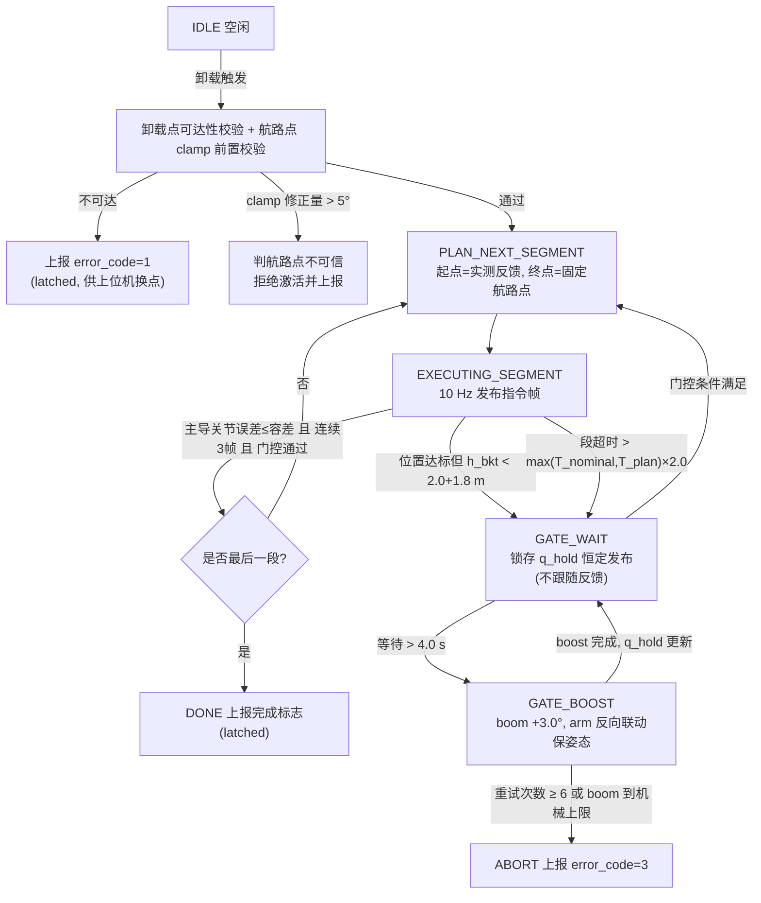
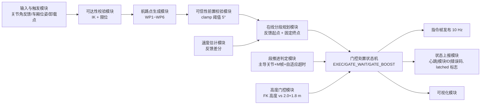

# 专利技术交底书

## 一种考虑液压特性的挖掘机卸载轨迹规划方法与系统

---

## 1. 检索结论

### 1.1 检索条件

| 项 | 内容 |
|:---|:---|
| 检索平台 | Google Patents（含 CN/US/WO 全文页）、Justia Patents、J-GLOBAL（JST 日本科学技术振兴机构）、Science/Nature/MDPI/ScienceDirect 公开文献库 |
| 中文检索词 | 挖掘机/装载机/装载机械 + 卸料/卸载/自动装车 + 轨迹规划/路径点/转折点 + 关节空间/逆运动学 + 干涉回避/避让/防碰撞 + 车厢/箱斗/挡板上端 + 铲斗高度 + 在线重规划/实时轨迹 |
| 英文/日文检索词 | excavator / loading machine + autonomous truck loading + trajectory planning + waypoint + interference avoidance position + vessel wall upper end + bucket height + swing automation；積込機械 + 干渉回避位置 + ベッセル + 積込対象 |
| 检索时间 | 2026-09-01（本次实际网络检索） |
| ⚠️ 信息层级说明 | 下表文献均为**真实可溯源公开文献**（附链接）；受本次网络环境限制，多篇仅获取到**摘要/说明书片段级**信息（Google Patents 全文页面多次拓取超时），**权利要求逐条比对必须由代理人调取全文后复核**。凡本文档标注"未见公开"者，均指"在已获取的摘要/片段级信息中未见"，不等于全文未公开。 |

### 1.2 国内相近专利 8 篇

| 序号 | 公开号 | 名称 | 申请人 | 技术要点（摘要/片段级） | 相关度 |
|:---:|:---|:---|:---|:---|:---:|
| **CN-1** | **CN112639210B** | 装载机械的控制装置及控制方法 | 株式会社小松制作所 | **装载对象特定部**特定装载对象的位置及形状；**回避位置特定部**基于装载对象的位置及形状，特定"比装载对象靠外侧规定距离的位置"即**干涉回避位置**；据此移动作业机 | ★★★★★（**国内并列最接近**） |
| **CN-2** | **CN111954739A** | 装载机械的控制装置及装载机械的控制方法 | 株式会社小松制作所 | 测量数据获取部 + 对象计算部计算用于装载铲斗挖出物的装载位置；**作业机控制部基于箱斗 BE 上端部的位置与铲斗 12 下端部的位置**（两者高低关系）控制作业机 | ★★★★★（**高度判据最接近**） |
| CN-3 | **CN111733918B** | 挖掘机卸料作业辅助系统及轨迹规划方法 | — | 数据采集/位置计算/**轨迹规划**/轨迹控制/误差控制/动作执行单元；卸料轨迹考虑防碰撞，**设置转折点约束**，每次以**路径最短**为目标选择转折点，以挖掘起点—转折点—目标点为路径约束确定卸料轨迹 | ★★★★（原 v2.0 认定的最接近，现降为第三位） |
| CN-4 | CN112041509A | 铲斗高度通知装置以及铲斗高度通知方法 | 株式会社小松制作所 | **铲斗高度确定部**确定从远程操作作业车辆接地面到作业机铲斗的高度；铲斗高度通知部通知该高度 | ★★★（铲斗高度量的获取与使用） |
| CN-5 | CN120196949A | 挖掘机自动装车的轨迹规划方法、装置、电子设备及介质 | — | 获取环境感知数据 + 执行装车任务的**多个目标部位实时关节位置信息**，经端对端轨迹规划模型预测各关节在**未来预设数目个时间步的目标轨迹点位置**；人工装车真实数据训练 | ★★★（同为"装车轨迹 + 关节量 + 实时"路线，但为学习式） |
| CN-6 | CN117739991A | 一种挖掘机最优作业轨迹规划方法、装置、设备及介质 | 华侨大学 | **采用分段**方式优化轨迹平滑连续性，兼顾满斗率、效率与能耗（挖掘阶段） | ★★ |
| CN-7 | CN114819256A | 一种反铲式挖掘机连续实时轨迹规划方法 | — | 挖掘任务决策 + 构建**物理信息神经网络**，实现连续实时轨迹规划 | ★★ |
| CN-8 | CN115354705A | 具有自动卸料功能的装载机 | — | 车架/驾驶室/铲斗 + 液压系统实现自动卸料（机构与液压回路层面） | ★ |

### 1.3 国际相近专利 2 篇

| 序号 | 公开号 | 名称 | 申请人 | 技术要点（摘要/片段级） | 相关度 |
|:---:|:---|:---|:---|:---|:---:|
| **F-1** | **WO2025022923A1** | 積込機械の制御方法および遠隔操作システム（装载机械的控制方法及远程操作系统） | 株式会社小松制作所 | 明确记载**干涉回避位置**（interference avoidance position）"**具有装载对象 T 的车厢挡板（vessel wall）上端的高度**，且是作业机 130 不与装载对象干涉的位置"；据此控制铲斗移动 | ★★★★★（**全案最接近**） |
| F-2 | US9567725B2 | Swing automation for rope shovel（绳铲回转自动化） | Joy Global / Komatsu Mining | 对"挖掘→回转至料仓（swing-to-hopper）"运动提供**分级自动化**；操作员在挖掘阶段控制并**指定卸载位置**，随后自动回转；控制器含理想路径生成，接收铲斗与卸载位置数据 | ★★★（段式作业自动化与卸载位置指定） |

> **同族/邻域补充核实**（不计入上述 2 篇，但均已确认真实存在，代理人查新时须一并调取）：
> - **US12686991**（小松，Control device, loading machine, and control method）：含 **avoidance position specification unit 1108**，可"将装载位置 P13 作为干涉回避位置 P12"，并判断装载对象是否满足条件——与 CN-1/F-1 同族思想；
> - **JP7245581B2**（小松，Control device, loading machine and control method）：CN-1/CN-2 的日本同族；
> - **US6363632B1**（CMU，System for autonomous excavation and truck loading）：含 load point planner，规划向车厢卸土的卸载点序列——已在本项目《卸载点动态选取》交底书中认定为该案最接近现有技术，本案中作为背景文献；
> - **US9454147B1**（Control system for a rotating machine）：存储相对卸载高度、由车厢高度信号确定初始车厢高度与初始卸载高度，基于作业装置位姿生成指令——"卸载高度基准"类文献。

### 1.4 需同步关注的非专利文献（NPL，可用作对比文件）

| 编号 | 文献 | 关键公开内容 | 风险 |
|:---:|:---|:---|:---:|
| NPL-1 | *Practical Full Automation of Excavation and Loading for Hydraulic Excavators*（Yoshida, Yoshimoto 等） | 液压挖掘机在**实际尺度室内环境**下全自动完成"挖掘—装载"完整序列的自主作业系统，含作业序列分解与自动切换 | ⚠️ **高**（段式作业序列自动推进） |
| NPL-2 | *An autonomous excavator system for material loading tasks*，**Science Robotics**（2021，DOI: 10.1126/scirobotics.abc3164） | 模块化自主挖掘装载系统，含运动规划与控制，约束挖掘过程交互力 | 中 |
| NPL-3 | *Autonomous Unloading Control of a Wheel Loader Based on Dump（Truck Pose）*，**Applied Sciences**（MDPI） | 自主卸料中矿卡停靠位姿受工况约束、其相对位姿参与卸料控制 | 中 |

### 1.5 检索结论

1. **全案最接近现有技术为 F-1（WO2025022923A1，小松）**：其已明确公开"**干涉回避位置 = 具有装载对象车厢挡板上端高度、且作业机不与装载对象干涉的位置**"，并据此控制作业机移动。叠加国内同族思想 **CN-1（CN112639210B）**"基于装载对象位置及形状特定比其靠外侧规定距离的干涉回避位置"，**"以车厢上沿高度为基准构造一个必经的安全回避航路点"这一上位思想已被公开**；

2. **国内 CN-2（CN111954739A）进一步公开了高度判据本身**：其作业机控制部**基于箱斗上端部位置与铲斗下端部位置的高低关系**控制作业机——这与本发明原 v2.0 主张的"铲斗高度必须高于车厢上表面 + 余量才允许跨越"在**判据构成上高度重合**；再叠加 **CN-4（CN112041509A）**已公开"铲斗高度的确定"这一量的获取手段，**"实时计算铲斗高度并与车厢上沿比较后放行"整体上不再具备新颖性**；

3. ⚠️ **因此必须修正原 v2.0 的核心判断**：原文档将「FK 高度门控」列为与最接近现有技术 D1（CN111733918B）的**核心区别特征 ③**，该判断**不成立**。原文档的检索遗漏了小松「干涉回避位置」专利族（CN112639210B / CN111954739A / CN112041509A / WO2025022923A1 / US12686991 / JP7245581B2），而该族恰好覆盖了高度门控的上位思想；

4. **上位思想不具备新颖性的部分**（不可作为独权保护点）：
   - "生成若干航路点/转折点后按航路点规划卸载轨迹"——CN-3 已公开（转折点约束）；
   - "以车厢上沿高度构造必经的安全回避位置"——F-1 / CN-1 已公开；
   - "比较铲斗高度与车厢上沿高度后决定作业机动作"——CN-2 已公开；
   - "在关节空间以实时关节位置信息规划装车轨迹"——CN-5 已公开（学习式路线）。

5. **创造性必须建立在以下未检索到公开的具体机制组合上**：
   - **门控失败后的三步处置链**：①锁存姿态恒定发布（**不跟随反馈**，避免液压保压沉降被逐帧追认为下沉指令）→ ②追加 boost 微段（动臂提升 + 斗杆反向联动保持铲斗姿态）→ ③有限次重试、耗尽即终止并上报错误码——**10 篇专利 + 3 篇 NPL 中无任何近似公开，为全案最强区别特征**；
   - **反馈起点 + 固定终点的逐段在线重规划**：每段执行前以**实测关节角**为起点、**固定航路点**为终点重新插值（F-1/CN-1 公开的是"移动到回避位置"，未见公开逐段以反馈为起点重算、且终点几何量不随跟踪误差漂移）；
   - **反馈驱动段推进判定**：**各段差异化主导关节** + **连续 M 帧确认** + **自适应超时基准 max(标称段时长, 在线规划段时长) × 系数**——未见公开以"判定是否到达"替代"预测何时到达"的段推进机制；
   - **航路点可信性前置校验**：航路点限位 clamp 修正量超过阈值即判上游航路点不可信、拒绝激活并上报——未见公开。

6. ⚠️ **风险预警（2026-09 全文复核更新）**：
   - **R-A（已复核，部分坐实）**：CN112639210B 全文已核实，其步骤 S27 公开了"**判定小臂前端的位置 P 是否到达装载位置 P07**"的位置级到达判定，S28~S36 进一步公开了门控类逻辑（干涉回避位置附近**禁止输出**作业机操作信号、按上升时间与回转速度决定是否生成回转信号、停止回转信号前判定能否到达装载位置）。因此本案独权**不能再主张"小松族无到达判定"**，只能以**"针对卸载轨迹航路点的差异化主导关节到达判定 + 门控失败处置链（锁存 + 联动 boost + 有限重试）+ 段推进机制"的组合**争取创造性；第 2.1A 节已据全文事实修订；
   - **R-B**：小松在该族拥有 CN/JP/US/WO 多国布局，**存在被引为对比文件 1 的高概率**，且其为在华有效专利，**同时构成 FTO（自由实施）风险**——本案不仅是能否授权的问题，还需评估实施层面的规避设计（见 6.5 节）；
   - **R-C**：本节为工程师公开数据库检索（CN-1 已达全文级，其余多篇仅至摘要/片段级），未使用付费专业数据库（incoPat/PatSnap/DWPI）。正式申请前必须委托查新，并**专项排查小松（Komatsu）、日立（Hitachi）、卡特彼勒（Caterpillar）、住友、三一/徐工/柳工、百度/华为/慧拓/踏歌/易控智驾**的自动装车轨迹与干涉回避类申请。

---

## 2. 最接近现有技术详细对比分析

> 经 1.2/1.3 两表比对，**全案最接近现有技术选定为 F-1：WO2025022923A1《積込機械の制御方法および遠隔操作システム》**（小松）。选定理由：10 篇专利中，唯有 F-1 同时公开了「装载对象几何识别 + **以车厢挡板上端高度为基准的干涉回避位置** + 据此控制作业机移动 + 远程/自动作业系统」这一与本发明技术领域、要解决的技术问题（铲斗跨越车厢时的干涉）、技术手段方向（构造必经的安全几何位置）均最为一致的完整方案。
>
> 国内以 **CN-1（CN112639210B）** 与 **CN-2（CN111954739A）** 并列为最接近：前者对应回避位置的**构造规则**，后者对应高度判据的**比较对象**。原 v2.0 认定的 CN-3（CN111733918B）虽同为"卸料轨迹规划"，但其为笛卡尔空间转折点约束 + 路径最短，在**安全判据**与**执行反馈**两个维度上均不及小松族接近，故降为第三位。

### 2.1 F-1 技术方案还原

**（信息层级声明：以下还原基于 F-1 的真实公开片段，以及其同族 CN112639210B / CN111954739A / US12686991 的公开摘要与说明书片段、J-GLOBAL 收录的同族课题—解决手段记载；全文权利要求逐条核实待代理人调取。）**

| 项 | 内容 |
|:---|:---|
| 公开号 | **WO2025022923A1** |
| 名称 | 積込機械の制御方法および遠隔操作システム（装载机械的控制方法及远程操作系统） |
| 申请人 | 株式会社小松制作所 |
| 关键片段 | "…**interference avoidance position that has the height of the upper end of the vessel wall of the loading target T and is a position where the work machine 130** \[does not interfere with the loading target\]…"（**干涉回避位置具有装载对象 T 车厢挡板上端的高度，且是作业机 130 不与装载对象干涉的位置**） |
| 同族 CN-1 片段 | "**回避位置特定部基于装载对象的位置及形状，特定比装载对象靠外侧规定距离的位置即干涉回避位置**" |
| 同族 CN-2 片段 | "作业机控制部 87 基于由对象计算部 86 计算出的**箱斗 BE 的上端部的位置**、以及由铲斗计算部 83 计算出的**铲斗 12 的下端部的位置**…"（两者高低关系参与作业机控制） |
| 同族课题记载（J-GLOBAL） | "【課題】**積込対象とバケットとが干渉しないように、バケットを掘削点へ移動させる**"（为使装载对象与铲斗不干涉地把铲斗移动至挖掘点） |

据此还原 F-1（及其同族）的技术方案：

1. 以搭载于装载机械的测量装置获取测量数据，**特定装载对象（矿卡车厢）的位置与形状**；
2. 由对象计算部计算**装载位置**（铲斗卸料的目标位置）；
3. 由回避位置特定部特定**干涉回避位置**：其**高度取装载对象车厢挡板的上端高度**（或取比装载对象靠外侧规定距离的位置），使作业机在经由该位置运动时不与装载对象干涉；
4. **作业机控制部基于车厢上端部位置与铲斗下端部位置的高低关系**控制作业机，使铲斗经由干涉回避位置在挖掘点与装载位置之间往返；
5. 该控制方法可在远程操作系统 / 自动作业系统中实施。

> **结论（必须正视）**：F-1 及其同族 **已公开「以车厢挡板上端高度构造必经的干涉回避位置」与「以铲斗下端 vs 车厢上端的高低关系控制作业机」这两项上位思想**。本发明**不得**以"生成含安全高度航路点的卸载轨迹"或"铲斗高于车厢上沿方允许跨越"作为保护点；创造性只能建立在**执行层反馈机制与门控失败处置链**的具体组合上。

### 2.1A CN112639210B 全文复核专项（2026-09 增补，修正原稿不实表述）

对 CN-1 全文（说明书 + 6 项权利要求）逐条复核后，**原稿中两处表述不准确，须修正**：

| 原稿表述 | 全文事实 | 修正后表述 |
|:---|:---|:---|
| "小松族**不含到达判定环节**" | **不准确**：步骤 S27 明确记载"移动处理部 1112 **判定小臂 132 的前端部的位置 P 是否到达装载位置 P07**"；S28 进一步判定前端位置是否处于干涉回避位置 P02 附近（高度差/平面距离差与阈值比较） | 小松族**有位置级到达判定**，但判定对象是**静态几何计算的装载位置 P07**（装载对象高度 Ht + 小臂前端至铲斗最下通过点高度 Hb + 控制余量），判定量为**单点位置误差**，无主导关节差异化、无连续帧确认、无自适应超时 |
| "小松族**不含未达成时的处置**" | **部分不准确**：S28~S36 含门控类逻辑——前端处于干涉回避位置附近时**禁止输出**作业机向装载点移动的操作信号（S28：YES 分支）；按上升时间与回转速度决定是否生成回转信号（S31~S34）；停止回转信号前判定能否到达装载位置（S35~S36） | 小松族**有"禁止/放行"型信号门控**，但**全部面向正常路径的信号时序**；**不存在**"门控等待期间铲斗升不上去时怎么办"的处置分支——无锁存保持、无联动提升重试、无有限次终止，等待超限后的行为在全文中无定义 |

**全文核实后维持的区别**（与维度 8/④ 对应）：
1. **无锁存恒定发布**：S28~S30 在生成上升操作信号时"基于大臂及小臂的**位置及速度**"生成，属常规反馈跟随，未认识"沉降被逐帧追认"的失效机理；
2. **无联动 boost**：S29~S30 的提升动作为大臂+小臂上升至干涉回避位置高度，同时按角速度和保持铲斗对地角——这是**正常到达路径的姿态保持**，与本案"门控失败后追加动臂提升微段 + 斗杆反向联动维持卸载姿态"的**失败处置语义**不同（触发条件、时机、目的均不同）；
3. **无有限重试与错误码终止**：装载位置到达后直接输出倾卸操作信号（S39），循环以"装载量未超最大装载量"为条件，无重试计数、无失败终止上报。

> 答复口径：审查员若引 CN112639210B 的 S27/S28 主张"到达判定与门控已公开"，答辩聚焦三点——判定对象不同（静态装载位置 vs 关节空间航路点序列）、判定构造不同（单点位置误差 vs 主导关节+连续帧+自适应超时）、**处置方向相反**（禁止信号等待自然到位 vs 主动锁存+联动提升+有限重试）。

### 2.2 与 F-1（及其同族）的逐维度详细对比

| 序号 | 对比维度 | F-1 / CN-1 / CN-2（小松族） | 本发明 | 是否构成区别 |
|:---:|:---|:---|:---|:---:|
| 1 | 规划空间 | 由测量数据在**机体/现场坐标系**确定位置，控制作业机（笛卡尔位置为主） | **关节空间**（swing/boom/arm/bucket 四关节角），航路点即关节角向量 | ✅ 区别（弱，属常规选择） |
| 2 | 安全位置的构造 | **干涉回避位置**：高度取车厢挡板上端 / 比装载对象靠外侧规定距离 | 同样构造厢上过渡航路点 WP4（z = 卸载高度 + 余量） | ❌ **已被公开，不作保护点** |
| 3 | 高度安全判据 | **箱斗上端部位置 vs 铲斗下端部位置**的高低关系 | 铲斗高度 > 车厢上表面高度 + 裕量（优选 2.0 m + 1.8 m） | ❌ **已被公开，仅数值/表述差异** |
| 4 | 航路点集合的产生 | 未见公开航路点的**语义分工规则** | **N=6 关节空间航路点的角色化定义**：WP1 挖掘终止点（姿态角修正）/ WP2 仅动臂提升点 / WP3 回转中途过渡点（swing 走中位、boom·arm 系数混合）/ WP4 厢上过渡点（回转圆与车厢矩形求交 + IK）/ WP5 除铲斗到位点 / WP6 完整卸载姿态 | ✅ 区别（中等） |
| 5 | 规划时机与起点 | 未见公开逐段重规划；以"移动到某位置"为控制目标 | **每段执行前在线重规划：起点 = 实测关节角反馈，终点 = 固定航路点**（终点几何量不可妥协） | ✅ **强区别** |
| 6 | 误差处理哲学 | 视为伺服跟踪误差，由下游控制消化 | **误差不跨段累积**：前段残差在下一段起点被清零重算；终点几何意义永不漂移 | ✅ 强区别 |
| 7 | 段推进的触发方式 | **有位置级到达判定**（全文核实，CN112639210B S27：小臂前端是否到达装载位置），但判定量为单点位置误差，面向单一静态目标 | **反馈驱动**：①各段**差异化主导关节**（seg0 boom / seg1 swing / seg2 swing+门控 / seg3 swing / seg4 arm∧bucket）；②误差 ≤ 该段容差且**连续 M 帧确认**（优选 M=3）；③**自适应超时基准** = max(标称段时长, 在线规划段时长) × 超时系数（优选 2.0） | ✅ **强区别**（判定构造与对象均不同） |
| 8 | 门控未达标时的行为 | **有"禁止/放行"型信号门控**（全文核实，S28~S36：干涉回避位置附近禁止输出作业机信号），但仅面向正常路径信号时序，等待超限后行为无定义 | **三步处置链**：①**锁存当前姿态恒定发布**（不跟随反馈，防液压保压沉降被逐帧追认为下沉指令）→ ②门控超时（优选 4.0 s）后追加 **boost 微段**（动臂提升优选 3.0°，**斗杆反向联动保持铲斗姿态**）→ ③**有限次重试**（优选 6 次）耗尽或动臂已到上限则**终止卸载并上报错误码** | ✅ **最强区别，10 篇专利 + 3 篇 NPL 均无近似公开** |
| 9 | 门控点速度形态 | 未见公开 | **门控点/端点终点切线强制归零**，关键点零速通过；起点切线由最近数帧反馈差分估计的实际速度 | ✅ 区别 |
| 10 | 输入可信性校验 | 未见公开 | **航路点限位 clamp 前置校验**：clamp 修正量 > 阈值（优选 5°）即判上游航路点不可信，拒绝激活并上报；卸载点 IK 不可达时以 latched 标志上报供上位机换点重试 | ✅ 区别 |
| 11 | 回转角环绕 | 未见公开 | 最短角距计算 + 起点 swing 展开至目标同周期，处理 0°/360° 跨越 | ✅ 区别（弱） |
| 12 | 液压特性的处理位置 | 由下游伺服/控制器消化 | **放弃预测"何时到达"，改为实时判定"到了没有"**：延迟大则段耗时长（被自适应超时基准吸收），不依赖液压模型辨识 | ✅ 强区别（设计哲学） |
| 13 | 状态上报 | 远程操作系统内的信息呈现 | 卸载完成标志（latched）+ **功能安全状态字**（心跳 \| 模块 ID \| 错误码），错误码区分"卡车位置无法卸载 / 航路点不可信 / 门控失败中止" | ✅ 区别 |

### 2.3 区别特征、技术问题与技术效果的对应

| 区别特征（对应独权序号） | F-1 / 小松族未解决的技术问题 | 本发明技术效果 |
|:---|:---|:---|
| ② 反馈起点 + 固定终点的逐段在线重规划（维度 5/6） | 小松族给出的是"到某个位置去"，**未规定误差在段与段之间如何处理**；若按理论终点串接，前段跟踪残差会污染后段起点，入厢点、卸载点的几何意义被逐段稀释 | 误差不跨段累积；干涉回避高度、落料位置等关键几何量在任何液压工况下保持设计值 |
| ③ 差异化主导关节 + 连续 M 帧确认 + 自适应超时基准（维度 7/12） | 液压延迟（50~200 ms）、死区、流量饱和使"何时到达"不可预测；多关节耦合下用全关节误差判定易误判；固定超时阈值在反馈残差大时会把正常段误判为超时 | 把"预测到达时刻"转化为"判定是否到达"，对液压延迟免疫；单关节判定避免耦合误判；自适应基准消除误判超时；不依赖液压模型辨识 |
| ④ **锁存姿态 → 联动 boost → 有限重试 → 终止上报**（维度 8） | 小松族**未公开回避位置未达成时的补救逻辑**。工程上此时存在两个隐性陷阱：（a）若门控等待期间继续跟随反馈发布指令，液压保压不足造成的臂架沉降会被**逐帧追认成下沉指令**，形成"越等越低"的正反馈；（b）若无限次重试，动臂顶到限位后系统死锁 | （a）锁存姿态切断沉降正反馈，门控期间高度只增不减；（b）boost 以动臂提升 + 斗杆反向联动实现"抬高但不改变铲斗姿态"，不破坏已规划的卸载姿态；（c）有限重试 + 动臂到限检测，任何情形下都在有界时间内给出结论（成功跨越或带错误码终止），杜绝死锁 |
| ⑤ 门控点终点切线强制归零（维度 9） | 未见公开跨越瞬间的速度形态约束 | 关键点零速通过，安全窗口可控；配合锁存机制使门控进入/退出无速度突变 |
| 从 X 航路点可信性前置校验（维度 10） | 未见公开对上游输入的合法性前置判定 | 上游航路点越限时拒绝激活而非带伤执行，故障前移到激活时刻，便于上位机换点重试 |
| 从 Y 六航路点角色化定义（维度 4） | 未见公开航路点的语义分工 | 提升段与回转段解耦（先抬后转），回转中途过渡点使 boom/arm 提前跟随，缩短总时长 |

**创造性论证要点（三步法）**：

1. **最接近现有技术**：F-1（WO2025022923A1）及其同族 CN-1（CN112639210B）、CN-2（CN111954739A）；

2. **区别技术特征**：上表 ②③④⑤ 四项（反馈起点固定终点的逐段重规划、差异化主导关节 + 连续帧确认 + 自适应超时、门控失败三步处置链、门控点零速整形）；

3. **是否显而易见**：
   - **单篇看**：小松族的技术逻辑是「**几何识别 → 构造回避位置 → 控制作业机到该位置**」的单链条。全文复核确认其虽有位置级到达判定（S27）与禁止型信号门控（S28~S36），但该链条仍隐含假设"给出目标位置即可到达"，其中**不存在**"到达失败后的处置"这一环节，也**不存在**对"等待期间指令如何发布"的问题意识，因此不含改进为"反馈驱动段推进 + 锁存防沉降追认"的技术启示；
   - **结合看**：即便引入 CN-3（CN111733918B，转折点约束 + 误差控制单元）或 CN-5（CN120196949A，实时关节位置 + 未来时间步轨迹点）作为对比文件 2，二者仍属**"如何算出更好的轨迹"这一链条内的方案替换**——CN-3 的误差控制是轨迹跟踪意义上的误差补偿，CN-5 是端到端学习预测未来轨迹点，**均无法提供"在门控等待期间停止跟随反馈、恒定发布锁存姿态"的动机**：该特征在方向上与"实时反馈闭环"这一本领域通行取向**相冲突**（通常认为控制指令应持续跟随最新反馈），属于**反向教导下的设计**，其动机只有在认识到"液压保压沉降会被逐帧追认"这一具体失效机理后才能产生；
   - 同理，"**动臂提升 + 斗杆反向联动**"这一 boost 构造方式的动机来自"必须抬高但不得破坏已规划的卸载铲斗姿态"这一双重约束，现有技术中未见该问题意识；
   - 因此 ③④ 组合非显而易见，且带来了小松族无法取得的技术效果：**在液压保压不足、跟踪残差大、上游航路点越限等非理想条件下，系统在有界时间内必然给出确定结论且高度单调不降**。

### 2.4 与国内文献的补充对比

#### 2.4.1 与 CN-3（CN111733918B，原认定的最接近）的对比

| 对比维度 | CN-3（CN111733918B） | 本发明 | 差异性质 |
|:---|:---|:---|:---|
| 规划空间 | 笛卡尔空间（D-H 定斗尖 → 车体坐标系） | 关节空间四关节角 | 区别（弱） |
| 路径中间点 | **转折点**，以**路径最短**为目标选择 | **角色化航路点**（提升点/回转过渡点/厢上过渡点/除铲斗到位点），以段职责而非路径长度定义 | ✅ 区别（选点目标函数不同） |
| 规划时机 | 离线一次性规划，按时间表执行 | 每段执行前在线重规划，起点取反馈 | ✅ 强区别 |
| 误差处理 | 设**误差控制单元**（跟踪误差补偿） | 误差**不补偿而是不累积**：下一段起点直接取实测值重算 | ✅ 区别（机理不同） |
| 段推进 | 未见公开段完成判定 | 主导关节容差 + 连续帧确认 + 自适应超时 | ✅ 强区别 |
| 安全 | 防碰撞作为转折点约束（离线几何） | 在线门控 + 锁存 + boost 重试（执行期动态） | ✅ 强区别 |

> ⚠️ CN-3 是国内答复中**第二可能**被引为对比文件的文献（对比文件 1 更可能是 CN-1/CN-2）。撰写时应避免使用"转折点""路径最短"等与其表述靠近的措辞，本案中间点统一称"**航路点**"并强调其**角色分工**而非路径长度最优。

#### 2.4.2 与 CN-5（CN120196949A）的对比

| 对比维度 | CN-5（CN120196949A） | 本发明 | 差异性质 |
|:---|:---|:---|:---|
| 轨迹产生方式 | **端对端学习模型**由环境感知 + 实时关节位置预测未来 K 个时间步轨迹点 | **解析插值**：起点反馈 + 终点固定航路点 + 端点切线的曲线插值 | ✅ 区别（可解释 vs 黑箱） |
| 时间基准 | 预测**未来预设数目个时间步** | 不预测时刻，仅**判定是否到达** | ✅ 强区别 |
| 数据依赖 | 依赖人工装车真实数据集训练 | 无训练数据依赖，参数可实测回填 | ✅ 区别 |
| 安全门控 | 未见公开 | 门控 + 锁存 + boost | ✅ 区别 |

> CN-5 公开于 2025-06-24，**申请日 2025-03-21，早于本案**，是"实时关节位置信息 + 装车轨迹"这一表述的在先公开，独权中应避免出现可被其字面涵盖的上位表述（如"基于实时关节位置信息规划装车轨迹"）。

### 2.5 独权收窄策略说明（本版核心调整）

检索已证实：F-1 / CN-1 公开了「以车厢挡板上端高度构造干涉回避位置」，CN-2 公开了「箱斗上端 vs 铲斗下端的高低关系控制作业机」，CN-4 公开了「铲斗高度的确定」，CN-3 公开了「含中间约束点的卸料轨迹规划」，CN-5 公开了「实时关节位置 + 装车轨迹」。若独权停留在原 v2.0 的四步上位表述（生成航路点 / 在线重规划 / 容差推进 / 安全门控提升重试），其中 ①④ 的上位部分将**直接落入上述文献的公开范围**。本版据此**主动收窄独立权利要求**，将三项最具体、最难被单一文献覆盖的特征固化为独权的必要技术特征：

| 固化特征 | 收窄前（原 v2.0 上位表述） | 收窄后（写入独权的具体特征） | 收窄理由 |
|:---|:---|:---|:---|
| 段推进判定 | "主导关节误差 ≤ 容差且连续帧确认则推进，超时则强制推进或转安全门控" | **各段分别指定唯一或成对的主导关节**；误差 ≤ 该段独立容差且**连续 M 帧**成立；超时阈值取 **max(标称段时长, 本段在线规划时长) × 系数** | 差异化主导关节 + 自适应超时基准是具体机制，检索区分度高，不易被"到位判定"泛化覆盖 |
| 门控失败处置 | "位置未满足安全条件时锁存姿态并提升重试，重试耗尽则终止" | **锁存进入门控瞬间的关节指令并在等待期间恒定发布**（不随反馈更新）→ 门控超时后追加**动臂提升与斗杆反向联动**的补偿微段 → **提升次数达上限或动臂到达上限时终止并上报错误码** | 全案最强区别特征；"恒定发布锁存值不随反馈更新"是与常规反馈闭环相反的具体动作，字面区分度最高 |
| 起点/终点定义 | "起点=实际反馈、终点=固定航路点" | 保留于独权，但**明确终点为激活时一次性确定且在整条轨迹执行期间不再更新的关节角向量**（几何锚点） | 强调"一次确定、全程不更新"以区别于 CN-5 的滚动预测与 MPC 类滚动优化 |

**收窄代价**：独权保护范围绑定"锁存 + 联动 boost"这一具体处置链。若竞品采用"门控失败即请求上位机重新停靠卡车"或"整体抬升后续轨迹"等替代处置，则不落入独权范围——该分支改为**从属权利要求 + 分案储备**（见 6.4 节），以并列申请方式保留保护。

---
## 3. 背景技术

### 3.1 别人现在怎么做？

挖掘机自动装车作业中，"从挖掘终止姿态把满载铲斗送到矿卡车厢上方并倒空"这一段运动（下称**卸载轨迹**）的现有实现可归为六类：

**（1）人工遥操作 / 分级半自动。** 由操作员通过手柄或远程操作台完成提升、回转、卸料、复位。为减轻操作员负担，Joy Global 的 **US9567725B2（Swing automation for rope shovel）** 对"挖掘→回转至料仓"运动提供**分级自动化**：操作员在挖掘阶段控制并**指定卸载位置**，随后由控制器按理想路径自动回转。该类方案把安全性寄托于操作员的目视判断与卸载位置的人工指定。

**（2）示教-再现（Teach & Playback）。** 记录一次人工作业的关节角序列，之后按时间表回放。实现简单，但矿卡停靠位姿一变即须重新示教。

**（3）笛卡尔空间离线轨迹规划 + 中间约束点。** 以 **CN111733918B（挖掘机卸料作业辅助系统及轨迹规划方法）** 为代表：由数据采集单元与位置计算单元确定斗尖与车厢位置，在卸料轨迹中**设置转折点约束**，每次以**路径最短**为目标选择转折点，以"挖掘起点—转折点—目标点"为路径约束确定卸料轨迹，并设误差控制单元补偿跟踪误差。属于典型的"先算出一条好轨迹，再交由下游跟踪"的思路。

**（4）学习式 / 端到端轨迹生成。** 以 **CN120196949A（挖掘机自动装车的轨迹规划方法）** 为代表：获取环境感知数据与执行装车任务的多个目标部位**实时关节位置信息**，经端对端轨迹规划模型预测各关节在**未来预设数目个时间步的目标轨迹点位置**，并以人工装车真实数据训练；**CN114819256A** 构建物理信息神经网络实现连续实时轨迹规划；**CN117739991A** 采用分段方式优化轨迹平滑性并兼顾满斗率与能耗。学术界的 *An autonomous excavator system for material loading tasks*（Science Robotics, 2021）亦属模块化自主装载系统。

**（5）机构 / 液压回路层面的自动卸料。** 以 **CN115354705A（具有自动卸料功能的装载机）** 为代表，通过液压系统实现铲斗自动翻转卸料，不涉及轨迹层面的规划。

**（6）以几何干涉回避位置构造安全航路点的方案 —— 本领域最接近的现有技术。** 以小松制作所的专利族为代表：

- **WO2025022923A1**：明确记载**干涉回避位置**"**具有装载对象车厢挡板（vessel wall）上端的高度**，且是作业机不与装载对象干涉的位置"，据此控制铲斗移动；
- **CN112639210B**：**回避位置特定部**基于装载对象的位置及形状，特定"比装载对象靠外侧规定距离的位置"即干涉回避位置；
- **CN111954739A**：**作业机控制部基于箱斗上端部的位置与铲斗下端部的位置**（即两者高低关系）控制作业机；
- **CN112041509A**：**铲斗高度确定部**确定接地面到铲斗的高度并予以通知；
- 同族 **US12686991**（含 avoidance position specification unit）、**JP7245581B2**。

即：**"识别车厢几何 → 以车厢上沿高度为基准构造一个必经的安全回避位置 → 让作业机经由该位置运动"** 这一上位思想，以及 **"比较铲斗（下端）高度与车厢（上端）高度后决定作业机动作"** 这一安全判据，均已被现有技术公开。此外 **US9454147B1** 已公开"存储相对卸载高度、由车厢高度信号确定初始车厢高度与初始卸载高度"的卸载高度基准做法。

### 3.2 这样做有哪些缺点？

**（a）第（1）（2）类方案不适应工况变化，且安全依赖人。** 遥操作受视距、时延与操作员疲劳影响；示教-再现无法应对矿卡停靠位姿、装载进度与地形的变化。

**（b）第（3）（4）类方案的共同缺陷：把液压系统当作理想执行器。** 二者的技术链条都是"**如何算出一条更好的轨迹**"，算完之后按时间表下发，隐含假设"到 t 时刻机器就在 q(t)"。而液压挖掘机的执行链（先导手柄→比例阀→主阀→油缸→连杆）具有：

- **数十至数百毫秒量级的响应延迟**，且随载荷（满斗/空斗）、油温、泵功率分配点而变；
- **阀口死区与流量饱和**，小指令不动、大指令削顶，速度不与指令成正比；
- **多路合流耦合**，动臂提升与回转同时动作时相互抢流量，实际速度低于单动工况；
- **保压不足引起的静态沉降**，臂架在悬停时缓慢下沉。

其后果是"**规划时间表**"与"**实际到位时刻**"必然错位。按时间表串接分段轨迹时，前一段未走完就切下一段，前段的跟踪残差成为后段的初始偏差并**逐段累积**；到了最关键的厢上过渡点，铲斗的实际高度可能显著低于设计的干涉回避高度——而轨迹本身在数学上仍是"完美"的。误差控制单元式的补偿（CN-3）只能事后减小跟踪误差，无法阻止误差跨段传递；端到端模型（CN-5）预测的是"未来若干时间步的轨迹点"，同样落在"预测时间"的框架内。

**（c）第（6）类（小松族）方案解决了"目标在哪"与"到了没有"（单点静态判定），未解决"没到怎么办"。** 该族的技术逻辑是单链条的：几何识别 → 构造回避位置 → 控制作业机到该位置。其中：

- **到达判定仅为单点静态位置判定**（全文核实，CN112639210B S27 判定小臂前端是否到达装载位置）。该判定面向**单一静态几何目标**，以何种容差、连续多少帧、如何区分多关节耦合下的残差贡献，公开信息中未见规定。多关节耦合下若以全关节误差之和判定，某个无关关节的残差就会把已到位的段判为未到位；若以固定时间阈值判定，液压延迟大的工况会被误判为超时；
- **不含"到达失败时的处置链"**：当铲斗未能升到车厢上沿以上时，是继续回转（撞车厢）、无限等待（死锁）、还是交还操作员（自动作业中断）？该族公开的门控逻辑（S28~S36）仅为正常路径上的"禁止/放行"信号时序，等待超限后的行为无定义；
- 更关键的是存在一个**未被认识的失效机理**：若在等待铲斗升高的过程中沿用常规做法——**以最新反馈为基准逐帧生成并下发指令**——那么液压保压不足造成的臂架沉降就会被**逐帧"追认"为一个下沉指令**，形成"越等越低"的正反馈，铲斗永远等不到放行，而所有关节的跟踪误差看起来都很小、系统日志一切正常。这是自动装车现场极难定位的一类故障。

**（d）缺乏对上游输入的可信性前置校验。** 卸载点、车厢位姿由上游感知/调度模块给出，可能因标定漂移或点云误检而越出机械限位。现有方案通常把越限值直接 clamp 后照常执行，导致"带伤执行"：轨迹在数学上仍然连续，但铲斗实际到达的位置已偏离车厢，故障要到撞击或撒料时才暴露。

### 3.3 本发明要解决的技术问题

综上，本发明要解决的技术问题是：

> **在液压挖掘机存在响应延迟、死区、流量饱和、多路耦合与保压沉降等非理想特性，且不进行液压系统模型辨识的前提下，如何保证卸载轨迹中"跨越车厢上沿"等关键几何量在实际执行中不被跟踪误差稀释；如何在铲斗未达安全高度时给出既不撞车、又不死锁、又不会因沉降被追认而无限等待的确定性处置；以及如何在上游航路点不可信时于动作之前拒绝执行。**

可分解为五个子问题：

1. **误差跨段累积** → 关键航路点的几何意义被逐段稀释；
2. **到达时刻不可预测** → 按时间表推进必然错位，而固定超时阈值又会误判；
3. **多关节耦合误判** → 用全关节误差判定到位会漏判/误判；
4. **门控等待期间的沉降被追认** → "越等越低"的正反馈与死锁；
5. **上游输入越限被静默 clamp** → 带伤执行、故障暴露后移。

---
## 4. 发明内容

### 4.1 核心思想

本发明提出一种**考虑液压特性的挖掘机卸载轨迹规划方法**，其核心思想可概括为三句话：

> **第一，放弃预测"何时到达"，改为实时判定"到了没有"。**
> 不对液压系统建模、不辨识延迟参数，而是把卸载轨迹切成若干段，每段设一个**主导关节 + 独立容差 + 连续帧确认**的到达判据；液压慢则该段自然走得久，由**自适应超时基准 max(标称段时长, 本段在线规划时长) × 系数**吸收，而不是被误判为超时。液压特性由"判定机制"消化，而非由"模型"消化。
>
> **第二，误差不补偿，而是不累积。**
> 每段执行前在线重新插值：**起点取实测关节角反馈**（承认上一段没走到），**终点取激活时一次性确定、全程不再更新的固定航路点关节角向量**（拒绝对几何目标妥协）。液压不确定性被吸收在单段内部，关键航路点（尤其是厢上过渡点）的几何意义在任何工况下都保持设计值。
>
> **第三，安全门控失败时执行"锁存—联动提升—有限重试—终止上报"的确定性处置链。**
> 进入门控等待的瞬间**锁存当前关节指令，并在整个等待期间恒定发布该锁存值、不随反馈更新**，从机理上切断"沉降被逐帧追认"的正反馈，使门控期间的指令高度**只增不减**；等待超时则追加**动臂提升 + 斗杆反向联动保持铲斗姿态**的 boost 微段；提升次数达上限或动臂已到机械上限则**终止卸载并上报错误码**，保证任何工况下都在有界时间内给出确定结论。

配套两项辅助机制：**六航路点的角色化定义**（把"抬升"与"回转"在时间上解耦）与**航路点可信性前置校验**（clamp 修正量超阈值即拒绝激活）。

### 4.2 方法步骤

#### 步骤 S1：接收触发与输入，进行卸载点可达性校验与结果锁存上报

S1.1 接收上位机的卸载触发信号，同时获取：挖掘终止时刻的四关节角反馈 q_fb = [θ_swing, θ_boom, θ_arm, θ_bucket]、矿卡车厢位姿与几何（车厢中心、朝向、厢长 L、厢宽 W，优选 L = 5.0 m、W = 2.6 m）、上位机给定的目标卸载点。

S1.2 对目标卸载点做逆运动学求解与可达性判定；若不可达（超出工作半径、越出关节限位或无实解），则不激活轨迹，并将**可达性标志以 latched 方式持续上报**（对应 `error_code = 1`：卡车位置无法卸载），由上位机据此重新选取卸载点或重新指挥矿卡停靠后再次触发。

> 此处的可达性上报是 **latched**（一次判定、持续保持）而非脉冲式，目的是保证上位机在任意时刻读取状态字都能得到确定结论，不依赖时序对齐。

#### 步骤 S2：生成 N 个角色化关节空间航路点（优选 N = 6）

在**关节空间**生成一组**各自承担明确职责**的航路点，每个航路点是一个四关节角向量：

| 航路点 | 角色 | 生成规则 |
|:---:|:---|:---|
| **WP1** | 挖掘终止点（姿态修正） | 取挖掘结束时的实测关节角，仅对铲斗/斗杆做保料姿态修正，避免起步撒料 |
| **WP2** | **仅动臂提升点** | swing 保持不变，仅将动臂抬升至安全离地高度；**该点使"抬升"与"回转"在时间上解耦**，避免边转边抬造成的合流抢流量与低空扫掠 |
| **WP3** | 回转中途过渡点 | swing 取起点与入厢点之间的**中位角**，boom/arm 按系数在 WP2 与 WP4 之间混合，使动臂/斗杆在回转过程中**提前跟随**，缩短总时长 |
| **WP4** | **厢上过渡点（门控点）** | 以**回转圆与车厢矩形求交**得到入厢点的平面位置（回转半径取卸载点半径乘系数 R_coff，优选 0.5，得到偏内侧的入厢点）；高度取 z = z_dump + Δ（优选高度偏置 1.5 m、车厢高度偏移 0.5 m）；铲斗取保料角（优选 25°）；经 IK 转为关节角 |
| **WP5** | 除铲斗到位点 | swing/boom/arm 达到卸载位姿，**铲斗尚不翻转**，确保铲斗完全到位后再倒料 |
| **WP6** | 完整卸载姿态 | 在 WP5 基础上翻转铲斗完成倒料 |

由此形成 N−1 = 5 个执行段：seg0（WP1→WP2 提升）、seg1（WP2→WP3 回转起始）、seg2（WP3→WP4 回转入厢，**含安全门控**）、seg3（WP4→WP5 回转到位）、seg4（WP5→WP6 倒料）。

#### 步骤 S3：航路点限位 clamp 前置校验（可信性判定）

对 S2 生成的全部航路点逐关节做机械限位检查；若某关节所需的 clamp 修正量超过阈值（优选 **5°**），则判定上游输入或几何求解结果**不可信**，**拒绝激活轨迹**并上报错误码，而非静默 clamp 后带伤执行；修正量在阈值以内时按 clamp 后的值执行。

> 该步骤把故障暴露时刻从"撞击/撒料时"前移到"激活时"。

#### 步骤 S4：逐段在线重规划（反馈起点 + 固定终点）

对第 k 段，在其**激活时刻**执行：

S4.1 **起点**取当前实测关节角反馈 q_start(k) = q_fb(t_k)；**起点切线**由最近数帧关节角反馈差分估计的实际关节速度给出（该速度估计器在进入门控时清零）。

S4.2 **终点**取 q_end(k) = q_WP(k+1)，即 S2 在激活时一次性确定、**在整条卸载轨迹执行期间不再更新**的关节角向量；**终点切线**按段角色设定（例如 seg0 给动臂速度 10 °/s、seg2 给回转速度 15 °/s、seg4 给铲斗速度 50 °/s；**门控点与末端点的终点切线强制归零**，实现关键点零速通过）。

S4.3 以三次 Hermite / Catmull-Rom 类曲线在关节空间插值，按发布周期（优选 **10 Hz**）离散为指令帧序列；回转关节采用**最短角距**计算，并将起点 swing 展开至与终点同周期，正确处理 0°/360° 跨越。

> **要点**：本步骤的实质是——**承认上一段没走到，但绝不修改终点**。液压不确定性被限制在单段内部消化，前段残差不进入后段的终点定义。

#### 步骤 S5：反馈驱动的段完成判定与推进

每一控制周期，对第 k 段按下述三条判定：

S5.1 **主导关节差异化**：仅以该段**指定的主导关节**（唯一或成对）参与判定，而非全部关节：

| 段 | 主导关节 | 容差（优选值） |
|:---:|:---|:---|
| seg0 | **动臂** | 5.0° |
| seg1 | **回转** | 5.0° |
| seg2 | **回转** + 高度门控 | 5.0°，门控使能 |
| seg3 | **回转** | 5.0° |
| seg4 | **斗杆 ∧ 铲斗**（成对，须同时满足） | 斗杆 10.0°、铲斗 20.0° |

S5.2 **连续帧确认**：主导关节误差 ≤ 该段容差须**连续 M 帧成立**（优选 **M = 3**）方判该段完成，用以抑制反馈抖动与穿越性瞬时满足造成的误判。

S5.3 **自适应超时**：本段超时阈值 = max(T_nominal(k), T_plan(k)) × λ，其中 T_nominal 为该段标称时长、T_plan 为本次在线规划实际生成的段时长、λ 为超时系数（优选 **2.0**）。液压慢导致本次规划时长变长时，超时阈值随之放大，**不会把正常段误判为超时**。

S5.4 段完成则推进至下一段并回到 S4；对使能门控的段（seg2），完成判定还须叠加 S6 的门控条件。

#### 步骤 S6：铲斗高度安全门控

对 seg2 使能高度门控：由**正运动学实时计算**铲斗特征点（斗齿/铲斗下端）相对机体接地面的高度 h_bkt，仅当

**h_bkt ≥ h_truck_top + m_clear**

（优选车厢上表面高度 h_truck_top = 2.0 m、安全余量 m_clear = 1.8 m）成立时，才允许由该段推进至下一段（即允许铲斗跨入车厢上方）；否则进入 S7 的门控等待。门控生效的起始段序号可配置（优选自 seg1 起即参与铲斗离地判定），以覆盖"提升不足即开始回转"的工况。

#### 步骤 S7：门控失败三步处置链（GATE_WAIT → GATE_BOOST → 终止）

S7.1 **进入 GATE_WAIT（锁存）**：段的位置条件已满足但高度条件未满足时，将**进入门控瞬间的关节角**锁存为 q_hold，并在整个等待期间**以恒定值 q_hold 持续发布指令帧、不随反馈更新**；同时清空速度估计器。

> 这是本发明最关键的一步动作。若按常规做法在等待期间以最新反馈为基准生成指令，则液压保压不足造成的臂架沉降将被**逐帧追认成下沉指令**，形成"越等越低"的正反馈，门控条件永不满足；锁存后门控期间的指令高度**只增不减**。

S7.2 **进入 GATE_BOOST（联动提升）**：若等待时长超过门控超时（优选 **4.0 s**）仍未放行，则追加一个 boost 补偿微段：按动臂速度参数逐帧步进，将**动臂抬升**一个增量（优选 **3.0°**），同时**斗杆反向联动**以保持铲斗对地姿态不变（避免抬升破坏已规划的保料/卸载姿态）；boost 段的完成判定**仅检查动臂**；完成后把抬升后的指令位姿更新为新的锁存值 q_hold，返回 GATE_WAIT 重新判定门控条件。

S7.3 **终止上报**：boost 次数达到上限（优选 **6 次**）或动臂已到达机械上限而无法继续抬升时，**终止本次卸载**，停止发布运动指令并上报执行中止错误码（`error_code = 3`：门控失败中止 / 动臂到限中止），交由上位机决策（重新停靠、更换卸载点或转人工）。

> 由 S7.1~S7.3 构成的处置链保证：**任何工况下系统都在有界时间内给出确定结论**——要么安全跨越，要么带错误码有序终止，不存在"无限等待"与"撞击车厢"两种失效模式。

#### 步骤 S8：完成上报与状态字发布

全部段完成后，以 latched 方式上报卸载完成标志；全程按固定周期发布**功能安全状态字**（心跳 | 模块 ID | 错误码），错误码区分"卡车位置无法卸载 / 航路点不可信 / 门控失败中止"；设总超时保护（优选 **30 s**），超时则中止并上报。

### 4.3 系统组成

| 模块 | 职责 | 关键接口/参数（优选值） |
|:---|:---|:---|
| **输入与触发模块** | 接收卸载触发、关节角反馈、车厢位姿与目标卸载点 | 发布周期 10 Hz；总超时 30 s |
| **可达性校验模块** | 卸载点 IK 与限位校验，latched 上报可达性 | `error_code = 1` |
| **航路点生成模块** | 生成 WP1~WP6 角色化关节空间航路点；回转圆与车厢矩形求交定入厢点 | 厢长 5.0 m / 厢宽 2.6 m / R_coff 0.5 / 高度偏置 1.5 m / 车厢高度偏移 0.5 m / 保料角 25° |
| **可信性前置校验模块** | 逐关节 clamp 修正量与阈值比较，越限则拒绝激活 | clamp 阈值 5° |
| **在线分段规划模块** | 每段以反馈为起点、固定航路点为终点做曲线插值；最短角距与周期展开 | 端点切线：动臂 10 °/s、回转 15 °/s、铲斗 50 °/s；门控点/末端点终点切线为 0 |
| **速度估计模块** | 由最近数帧反馈差分估计关节实际速度，供起点切线使用；进入门控时清零 | — |
| **段推进判定模块** | 主导关节差异化容差 + 连续 M 帧确认 + 自适应超时 | seg0 boom 5° / seg1 swing 5° / seg2 swing 5° / seg3 swing 5° / seg4 arm 10° ∧ bucket 20°；M = 3；λ = 2.0 |
| **高度门控模块** | FK 计算铲斗高度并与车厢上沿 + 余量比较 | 2.0 m + 1.8 m；门控起始段可配置 |
| **门控处置状态机** | IDLE / PLAN_NEXT_SEGMENT / EXECUTING_SEGMENT / **GATE_WAIT** / **GATE_BOOST** / DONE 六态；实现锁存—联动提升—有限重试—终止 | 门控超时 4.0 s；boost 3.0°；重试上限 6 次 |
| **状态上报模块** | 完成标志（latched）+ 功能安全状态字（心跳 \| 模块 ID \| 错误码） | `error_code` = 1 / 航路点不可信 / 3 |
| **可视化模块** | 航路点、规划轨迹、门控状态的可视化输出（调试与验收用） | — |

**状态机流转**（对应权利要求的执行时序）：

```
IDLE ──触发 + 可达 + 航路点可信──> PLAN_NEXT_SEGMENT ──插值完成──> EXECUTING_SEGMENT
                                       ^                              │
                                       │      主导关节达标×M帧且门控通过 ├──> 下一段 / DONE
                                       │                              │
                                       │      位置达标但高度未达标      └──> GATE_WAIT
                                       │                                    │（锁存 q_hold 恒定发布）
                                       │                     超时 4.0 s ────> GATE_BOOST
                                       │                                    │（boom +3.0°，arm 反向联动）
                                       └────────────────────────────────────┘
                                    重试 ≥ 6 次 或 boom 到限 ──> ABORT（error_code = 3）
```

---
## 5. 本发明的优点

**优点 1：关键几何量在实际执行中不被稀释，安全边界从"设计值"变成"实际值"。**
现有方案（含最接近的 F-1/CN-1）给出的是"回避位置在哪里"，而铲斗**实际**是否到过那里，取决于液压系统跟得有多准。本发明把每段轨迹的起点交给反馈、终点交给几何：起点承认误差，终点拒绝妥协。厢上过渡点的高度、入厢点的平面位置、卸载点的落料位置，都是激活时一次确定、执行期间不再被任何跟踪残差修改的锚点。于是"铲斗高于车厢上沿 3.8 m（2.0 + 1.8）"这句话不再只是规划书上的数字，而是**在液压慢、油温低、满斗重载等任何工况下都必须被实测满足**的条件——不满足就不放行。这是"安全边界从设计值变为实际值"的实质性区别。

**优点 2：对液压延迟免疫，且不需要液压模型辨识，跨机型迁移成本极低。**
本发明不试图知道"动臂在当前载荷、油温、泵功率分配点下从 A 到 B 需要多少毫秒"——这个问题在工程上要靠大量台架与现场标定才能勉强回答，且换一台机器就要重做。本发明只问"到了没有"：主导关节误差进入容差并连续 M 帧（优选 3 帧，10 Hz 下约 0.3 s）成立即推进。液压慢，则该段自然多走几帧；快，则少走几帧。超时基准取 max(标称段时长, 本次在线规划时长) × 2.0，天然随液压工况伸缩，避免了固定阈值在慢工况下的误判超时。移植到新机型只需重新配置各段容差与关节速度参数，无需重新辨识液压模型。

**优点 3：门控失败时的处置是确定性的、有界的、且高度单调不降。**
这是本发明最具工程价值的一点，也是最接近现有技术完全未涉及的空白。传统实现（或按常规反馈闭环思路实现的方案）在"等铲斗升高"这一情境下会落入一个隐蔽陷阱：等待期间继续以最新反馈为基准发布指令，于是液压保压不足造成的臂架沉降被**逐帧追认成下沉指令**——铲斗越等越低，门控条件永远不满足，而此时所有关节的跟踪误差都很小、日志一切正常，现场极难定位。本发明在进入门控的瞬间锁存指令姿态并在等待全程恒定发布，从机理上切断了这条正反馈通路，使门控期间的指令高度**只增不减**；等待超时则以"动臂提升 + 斗杆反向联动"抬高铲斗而**不改变其对地姿态**（不破坏保料姿态、不破坏已规划的卸载姿态）；提升次数设上限、并检测动臂是否已到机械上限，两者任一触发即带错误码有序终止。结果是：**不存在无限等待，也不存在带着不足高度冲进车厢**这两种失效模式，系统必然在有界时间内给出"安全跨越"或"带码终止"之一。

**优点 4：故障暴露时刻前移，上位机可在动作前决策。**
卸载点不可达时以 latched 方式上报（`error_code = 1`），上位机可立即换点或重新指挥停靠；航路点 clamp 修正量超过 5° 时判上游输入不可信并**拒绝激活**，而不是静默 clamp 后带伤执行。相比"执行到一半才撞上车厢或撒料在外"的事后暴露，本发明把可诊断性建立在"动作之前"，显著降低现场事故与返工成本；配合心跳 | 模块 ID | 错误码的状态字，满足自动作业的功能安全审计要求。

**优点 5：段职责解耦带来的效率与平顺收益，且实现代价低。**
六航路点的角色化定义把"先抬后转"固化为 WP2，避免边转边抬造成的多路合流抢流量与低空扫掠风险；WP3 让动臂/斗杆在回转过程中提前跟随，压缩总时长；WP5/WP6 拆分保证"铲斗完全到位再倒料"，减少撒料。全部机制在关节空间以三次曲线插值 + 状态机实现，计算量为常数级，可在普通车载工控机上以 10 Hz 稳定运行，无需 GPU、无需训练数据——这与 CN-5（端到端学习模型）、CN-7（物理信息神经网络）等方案形成鲜明对比：本发明的每一步判定都是可解释、可复现、可写入验收规程的。

---

## 6. 本发明的关键点和保护点

### 6.1 关键点

| 编号 | 关键点 | 说明 | 不可替代性 |
|:---:|:---|:---|:---|
| **K1** | **反馈起点 + 固定终点的逐段在线重规划** | 起点 = 实测关节角；终点 = 激活时一次确定且执行期间不再更新的航路点关节角向量 | 若终点随反馈滚动更新（MPC/滚动预测式），关键几何量将被逐段稀释，本发明的安全承诺失效 |
| **K2** | **各段差异化主导关节** | seg0 boom / seg1 swing / seg2 swing / seg3 swing / seg4 arm∧bucket | 若以全关节误差判定，无关关节的残差会造成漏判/误判 |
| **K3** | **连续 M 帧确认**（M = 3） | 抑制反馈抖动与瞬时穿越造成的误推进 | 单帧判定会在噪声下提前推进，使门控失去意义 |
| **K4** | **自适应超时基准** max(T_nominal, T_plan) × λ（λ = 2.0） | 超时阈值随本次在线规划时长伸缩 | 固定阈值在慢工况下会把正常段误判为超时 |
| **K5** | **锁存姿态恒定发布（不跟随反馈）** | 进入门控瞬间锁存 q_hold，等待全程恒定发布 | **本案最核心、最不可替代**：不锁存则沉降被逐帧追认，形成"越等越低"正反馈 |
| **K6** | **动臂提升 + 斗杆反向联动的 boost 微段** | 抬高铲斗但保持其对地姿态 | 仅抬动臂会改变铲斗姿态导致撒料或破坏卸载姿态 |
| **K7** | **有限重试 + 动臂到限检测 + 带码终止** | 重试上限 6 次；boom 到限即终止（`error_code = 3`） | 无限重试将在动臂到限后死锁 |
| **K8** | **航路点 clamp 前置校验**（阈值 5°） | 修正量超阈值即判上游不可信、拒绝激活 | 静默 clamp 会导致带伤执行、故障后移 |
| **K9** | **门控点/末端点终点切线强制归零** | 关键点零速通过 | 带速通过门控点会使跨越瞬间的安全窗口不可控 |
| **K10** | **六航路点角色化定义** | 先抬后转解耦 + 回转中途提前跟随 + 到位后再倒料 | 决定效率与平顺性，是从属权利要求的重要退路 |
| **K11** | **latched 可达性/完成标志 + 功能安全状态字** | 心跳 \| 模块 ID \| 错误码；错误码区分三类故障 | 脉冲式上报依赖时序对齐，上位机可能漏读 |

### 6.2 保护点（权利要求布局·收窄版）

> **布局前提**：经第 1、2 节检索，"以车厢上沿高度构造干涉回避位置"（F-1/CN-1）、"比较箱斗上端与铲斗下端高低关系控制作业机"（CN-2）、"铲斗高度的确定"（CN-4）、"含中间约束点的卸料轨迹规划"（CN-3）、"基于实时关节位置信息规划装车轨迹"（CN-5）均已公开。故独权**不得**停留在这些上位表述，必须以 K1+K2+K3+K4+K5+K6+K7 的组合作为必要技术特征。

**独立权利要求 1（方法·收窄版）**

一种考虑液压特性的挖掘机卸载轨迹规划方法，其特征在于，包括：

- **①** 响应卸载触发，获取挖掘机四关节角反馈、矿卡车厢位姿与几何以及目标卸载点，在关节空间生成 N 个航路点，所述 N 个航路点包括仅提升动臂的提升航路点、回转中途过渡航路点、其高度由车厢上表面高度与安全余量确定的**门控航路点**、以及卸载航路点；**并对所生成航路点逐关节进行机械限位校验，当所需限位修正量超过设定阈值时判定航路点不可信、拒绝激活轨迹并上报**；
- **②** 将相邻航路点之间划分为若干执行段，在**每一执行段激活时刻**在线生成该段轨迹，其中该段的**起点取当前实测关节角反馈**，该段的**终点取所述航路点对应的关节角向量，所述关节角向量在轨迹激活时一次性确定且在整条轨迹执行期间不再更新**；
- **③** 为**每一执行段分别指定唯一的或成对的主导关节**，当且仅当该段主导关节的位置误差不大于该段独立设定的容差、且**连续 M 帧成立**时判定该段完成并推进至下一段；该段的超时阈值取**该段标称时长与本次在线生成的该段时长中的较大者乘以超时系数**；
- **④** 对使能安全门控的执行段，由正运动学实时计算铲斗特征点高度，仅当该高度不小于车厢上表面高度与安全余量之和时允许推进；否则**锁存进入门控时刻的关节指令，并在门控等待期间以该锁存值恒定发布指令帧、不随所述关节角反馈更新**；
- **⑤** 当门控等待时长超过门控超时阈值时，追加补偿微段，所述补偿微段**提升动臂并使斗杆反向联动以保持铲斗对地姿态**，微段完成后将提升后的指令位姿更新为新的锁存值并重新判定门控条件；当**补偿微段的追加次数达到上限、或动臂已达机械上限而无法继续提升**时，终止本次卸载并上报错误码。

**独立权利要求 2（系统）**：与权利要求 1 各步骤一一对应的模块化系统（输入与触发模块、可达性校验模块、航路点生成模块、可信性前置校验模块、在线分段规划模块、速度估计模块、段推进判定模块、高度门控模块、门控处置状态机、状态上报模块），其特征在于所述门控处置状态机至少包括执行段状态、**门控等待状态**与**门控提升状态**三个状态，且在门控等待状态下恒定发布锁存指令。

**独立权利要求 3（挖掘机）**：一种挖掘机，包括工作装置、液压系统、关节角传感器、环境感知装置与控制器，所述控制器执行权利要求 1 所述方法。

**独立权利要求 4（介质/产品）**：计算机可读存储介质 / 计算机程序产品。

**从属权利要求退路表**

| 序号 | 从属特征 | 退路价值 |
|:---:|:---|:---|
| 从 1 | M = 3；发布周期 10 Hz | 数值退路 |
| 从 2 | 超时系数取 2.0；总超时 30 s | 数值退路 |
| 从 3 | 各段主导关节的具体配置：seg0 动臂、seg1/seg2/seg3 回转、seg4 斗杆与铲斗成对 | **重要退路**：主导关节的具体分配 |
| 从 4 | 各段容差取 5°/5°/5°/5°/(10°,20°) | 数值退路 |
| 从 5 | 门控超时 4.0 s；单次提升增量 3.0°；提升次数上限 6 次 | **重要退路**：处置链的具体参数 |
| 从 6 | 安全余量取 1.8 m，车厢上表面高度取 2.0 m | 数值退路 |
| 从 7 | 补偿微段的完成判定**仅检查动臂**，不检查其他关节 | 机制退路 |
| 从 8 | 进入门控时**清空关节速度估计器**；起点切线由最近数帧反馈差分估计 | 机制退路 |
| 从 9 | **门控航路点与末端航路点的终点切线取零**，其余段终点切线按主导关节速度设定 | **重要退路**：零速通过 |
| 从 10 | 门控航路点的平面位置由**回转圆与车厢矩形求交**确定，回转半径取卸载点半径乘以小于 1 的系数 | **重要退路**：入厢点构造 |
| 从 11 | 六航路点的角色化定义（WP1~WP6 的具体职责） | **重要退路**：K10 |
| 从 12 | 回转关节采用最短角距并将起点展开至与终点同周期 | 机制退路 |
| 从 13 | 关节空间插值采用三次 Hermite / Catmull-Rom 曲线 | 实现退路 |
| 从 14 | 卸载点不可达时以 **latched** 方式上报可达性标志，供上位机换点重试 | **重要退路**：K11 |
| 从 15 | 上报包含心跳、模块标识与错误码的状态字，错误码区分卡车位置不可卸载、航路点不可信、门控失败中止 | 功能安全退路 |
| 从 16 | 门控使能的起始段序号可配置，自回转起始段即参与铲斗离地判定 | 机制退路 |

**布局说明**：

1. 独权把 K5（锁存恒定发布）+ K6（联动 boost）+ K7（有限重试与到限终止）与 K1~K4（起点终点定义 + 差异化主导关节 + 连续帧 + 自适应超时）+ K8（clamp 前置校验）**捆绑为一体**。捆绑虽然缩小了保护范围，但换来了对小松族的**字面清晰区别**：小松族虽公开位置级到达判定（S27）与禁止型信号门控（S28~S36），但**不含**针对卸载路点序列的差异化到达判定构造，**不含**锁存、联动提升重试与有限次终止处置，上述任一环节都无法从其中读出。
2. 特别注意 ④ 中"**不随所述关节角反馈更新**"这一否定式限定必须写入独权。它是全案区分度最高的一句话：常规反馈闭环的做法与之**相反**，因此该限定既是新颖性依据，也是创造性（反向教导）的论证支点。
3. 撰写时应避免使用"转折点""路径最短"（贴近 CN-3）、"干涉回避位置"（贴近 F-1/CN-1）、"基于实时关节位置信息规划装车轨迹"（贴近 CN-5）等表述；本案中间点统一称"**航路点**"，安全点称"**门控航路点**"，并强调其**段职责分工**而非路径长度最优。

### 6.3 概括层次阶梯（L0~L4）

| 层次 | 表述 | 状态 |
|:---:|:---|:---|
| **L0** | "一种挖掘机卸载轨迹规划方法：识别车厢几何，生成包含安全高度过渡点的轨迹，铲斗高度满足条件后跨越车厢卸料" | 🚫 **禁用**——已落入 F-1（WO2025022923A1）/ CN-1（CN112639210B）/ CN-2（CN111954739A）的公开范围，仅保留于说明书以防修改超范围 |
| **L1** | 在 L0 基础上增加"分段执行 + 每段以实测关节角为起点、以激活时确定且不再更新的航路点为终点在线重规划" | ⚠️ 可争辩但风险偏高（可能被指为"分段跟踪"的常规手段）；仅作为审查意见答复中的中间概括层 |
| **L2** | L1 + "各段差异化主导关节 + 连续 M 帧确认 + 自适应超时基准" | ✅ 较安全，可作为**第一次答复时的退让层** |
| **L3** | L2 + "门控未达标时锁存指令姿态并在等待期间恒定发布、不随反馈更新" | ✅ **推荐的独权层（即 6.2 之独权 1）** |
| **L4** | L3 + "动臂提升与斗杆反向联动的补偿微段 + 提升次数上限 + 动臂到限终止上报" | ✅ 最稳，已写入独权 ⑤，同时是**授权后无效程序中的最终防线** |

> 策略：**申请时直接以 L3+L4 组合提交独权**（即 6.2 版本），不做 L0/L1 层的尝试性主张——因为检索已证实 L0 落入现有技术，主张 L0 只会招致对比文件 1 的正面冲突，反而抬高整案被否定性评价的风险。若审查中 ③④⑤ 仍被认为显而易见，则以从属 5/7/9/10 的具体参数与机制进一步固化。

### 6.4 分案与并列申请储备

| 编号 | 可分案/并列主题 | 独立性说明 | 建议 |
|:---:|:---|:---|:---|
| **D1** | **门控失败的替代处置链**：门控失败即请求上位机重新选取卸载点 / 重新指挥矿卡停靠 / 整体抬升后续全部航路点 | 与本案 ⑤ 的"联动 boost 重试"是并列的处置分支，不落入本案独权 | **并列申请**（避免竞品绕过） |
| **D2** | **航路点可信性校验方法**：clamp 修正量阈值判定 + 上游输入不可信的分级处置（拒绝激活 / 降级执行 / 请求重发） | 可独立于卸载场景使用（挖掘、复位轨迹同样适用） | **单独申请**（保护面更宽） |
| **D3** | **反馈驱动段推进的通用方法**：差异化主导关节 + 连续帧确认 + 自适应超时，用于挖掘轨迹、复位轨迹、行走轨迹 | 可上位为"液压工程机械分段轨迹的到达判定方法" | **单独申请**（本项目其他交底书可共用） |
| **D4** | **门控航路点的几何构造**：回转圆与车厢矩形求交 + 半径系数偏内侧取点 | 纯几何方法，可独立主张 | 从属保留，视审查结果决定是否分案 |
| **D5** | **液压保压沉降的指令侧抑制方法**：一切"悬停/等待"工况下锁存指令不跟随反馈（与《串级控制技术方案》的 HOLD 模式呼应） | 上位于卸载门控场景，覆盖挖掘暂停、复位悬停等 | **单独申请**（价值可能高于本案） |

### 6.5 FTO（自由实施）规避设计要点 —— 回应风险 R-B

小松族（CN112639210B / CN111954739A / CN112041509A）为**在华专利**，本案不仅涉及能否授权，还涉及实施是否侵权。建议在产品实现层面同步准备规避设计，并在交底书中留档：

| 风险点 | 小松族的可能权利要求要素 | 规避方向 |
|:---|:---|:---|
| 回避位置的构造 | "基于装载对象的**位置及形状**特定比其靠外侧**规定距离**的位置" | 本案门控航路点由**回转圆与车厢矩形求交**得到，位于车厢**边界之上/内侧**（半径系数 < 1），而非"比装载对象靠外侧规定距离"；实施时应避免采用"外侧 + 固定偏移距离"的构造方式 |
| 高度判据的比较对象 | "**箱斗上端部位置** vs **铲斗下端部位置**" | 本案以"**铲斗特征点相对机体接地面的高度**"与"**车厢上表面高度 + 安全余量**"比较，比较量的定义与参考基准不同（机体接地面 vs 箱斗上端部位置）；实施时应保持以机体接地面为基准的高度量定义 |
| 铲斗高度的获取 | "确定从接地面到铲斗的高度并**通知**" | CN-4 的落脚点是"**通知**（通知装置/通知方法）"，本案落脚点是"作为门控放行条件参与状态机跳转"，用途不同；实施时不宜将该高度作为独立的操作员提示功能对外呈现 |
| 作业机控制的触发 | "基于高低关系**控制作业机**" | 该表述较宽，规避难度大。建议由代理人调取 CN111954739A 授权文本核实其权利要求的实际限定范围，据此评估是否需要在高度判据上引入本案特有的"安全余量 + 连续帧确认 + 锁存"组合以形成实质差异 |

> **行动项**：正式申请前必须委托代理人对 CN112639210B、CN111954739A、CN112041509A 三件在华专利出具**FTO 意见**，明确本项目当前实现是否落入其权利要求范围。此项优先级高于本案的申请本身。

---
## 7. 替代方式及附图

### 7.1 替代方式

| 编号 | 本发明优选方式 | 替代方式 | 是否落入保护范围 |
|:---:|:---|:---|:---:|
| A1 | 关节空间插值（四关节角） | 笛卡尔空间插值 + 逐帧 IK | ✅ 落入（等效替换） |
| A2 | 三次 Hermite / Catmull-Rom 曲线 | 五次多项式、B 样条、梯形/S 曲线速度规划 | ✅ 落入 |
| A3 | 航路点数 N = 6 | N = 4、5、7 或按车厢尺寸自适应增删过渡点 | ✅ 落入 |
| A4 | 连续帧确认 M = 3 | M = 2、5；或以"误差持续时长 ≥ T_confirm"表述 | ✅ 落入（等效） |
| A5 | 超时系数 λ = 2.0 | λ = 1.5、3.0；或 max(·) 改为加权和/取最大值后加固定余量 | ✅ 落入 |
| A6 | 主导关节按段固定配置 | 主导关节按该段角位移最大的关节**在线自动选取** | ✅ 落入（从属可另行主张） |
| A7 | 铲斗高度由 FK 计算 | 由激光/毫米波/视觉直接测量铲斗高度；或由油缸行程传感器换算 | ✅ 落入 |
| A8 | 单次提升增量 3.0°、上限 6 次 | 增量递增（3°→5°→8°）、上限 3~10 次 | ✅ 落入 |
| A9 | boost 采用"动臂提升 + 斗杆反向联动" | 仅提升动臂；或"动臂提升 + 铲斗微收" | ⚠️ 仅提升动臂**不落入**独权（缺"反向联动保持姿态"），归 D1 并列申请 |
| A10 | 门控等待期间恒定发布锁存值 | 门控等待期间以锁存值为基准叠加一个**单调不减**的偏置 | ✅ 落入（仍为不跟随反馈） |
| A11 | 门控等待期间恒定发布锁存值 | 门控等待期间**继续跟随反馈**发布指令 | ❌ **不落入**（即现有技术做法，且存在沉降追认缺陷） |
| A12 | 门控失败终止并上报 | 门控失败请求上位机重新选点/重新停靠 | ⚠️ 不落入独权，归 D1 并列申请 |
| A13 | 车厢上表面高度由感知给出（2.0 m） | 由车型库按矿卡型号查表给出；或由操作员标定输入 | ✅ 落入 |
| A14 | clamp 阈值 5° | 阈值按关节分别设定；或以"相对行程百分比"表述 | ✅ 落入 |
| A15 | 入厢点由回转圆与车厢矩形求交 | 由车厢近侧边界向内偏移固定距离取点 | ✅ 落入独权（该构造在从属 10 中；独权仅要求门控航路点高度由车厢上表面高度与余量确定） |
| A16 | latched 状态上报 | 周期性重复上报 + 上位机确认应答（ACK） | ✅ 落入（等效） |
| A17 | 发布周期 10 Hz | 20 Hz、50 Hz | ✅ 落入 |
| A18 | 用于液压挖掘机卸载 | 用于装载机、抓料机、隧道机械等带回转臂架的液压工程机械的卸料动作 | ✅ 落入（应在说明书中明确该扩展） |

> **撰写提示**：A9、A11、A12 三行是保护范围的边界，应在说明书中**明确写出这些替代方式及其缺陷**（尤其 A11：跟随反馈会导致沉降被追认），以便在答复审查意见时论证本发明选择的技术效果并支持"反向教导"主张。

### 7.2 附图

**图 1：卸载轨迹航路点与执行段划分（俯视 + 侧视示意）**


**图 2：门控处置状态机（对应权利要求 ③④⑤ 的执行时序）**



**图 3：反馈起点 + 固定终点的逐段重规划原理（与"按时间表串接"的对比）**


**图 4：门控等待期间"锁存"与"跟随反馈"的机理对比（本发明的核心区别）**


**图 5：系统组成框图**



---

**文档版本**：v3.1（2026-09 全文复核修订版：新增 2.1A CN112639210B 全文复核专项，修正"无到达判定"不实表述；维度表 7/8、3.2(c)、三步法、布局说明同步修订）
**历史版本**：
- v3.0（检索重构版）
- v1.0 初版：方法步骤与系统组成
- v2.0：增补检索与对比分析，认定 CN111733918B 为最接近现有技术，以「FK 高度门控」为核心区别特征 ③
- **v3.0（本版）**：完成真实专利检索（国内 8 篇 + 国际 2 篇 + 同族 4 篇 + NPL 3 篇），**发现原 v2.0 遗漏小松「干涉回避位置」专利族（WO2025022923A1 / CN112639210B / CN111954739A / CN112041509A / US12686991 / JP7245581B2）**，据此：①重新认定最接近现有技术为 WO2025022923A1（国内并列 CN112639210B / CN111954739A）；②**撤销「FK 高度门控」作为核心区别特征的判断**；③主动收窄独权至"锁存恒定发布 + 联动 boost + 有限重试"与"差异化主导关节 + 连续 M 帧 + 自适应超时"的组合；④全部占位编号替换为真实公开号；⑤参数全部改用工程实测/配置值；⑥新增航路点可信性前置校验、latched 可达性上报两个保护点；⑦新增 6.5 节 FTO 规避设计
**创建日期**：2026-09-01
**作者**：（待填）
**联系方式**：（待填）

---

## 下一步工作

1. ⚠️ **【最高优先】委托代理人对小松三件在华专利出具 FTO 意见**：CN112639210B、CN111954739A、CN112041509A。本项目产品已在实施"FK 铲斗高度 + 车厢上沿比较后放行"，须先确认是否落入其权利要求范围。此项风险高于申请本身。
2. ⚠️ **调取以下文献全文并逐条核实权利要求**（本次仅获取到摘要/说明书片段级信息）：WO2025022923A1、CN112639210B、CN111954739A、CN111733918B、CN120196949A、US12686991。重点核实三点：①其回避位置是否含"到达判定"；②是否含"未达成时的处置"；③是否含"等待期间的指令发布方式"。若任一文献含上述内容，须立即重构第 6 节布局。
3. **委托专业数据库查新**（incoPat / PatSnap / DWPI），检索式须覆盖：干涉回避位置、ベッセル上端、bucket height gate、segment advance、hold command、boom boost；申请人专项排查小松、日立建机、卡特彼勒、住友、三一/徐工/柳工、百度/华为/慧拓/踏歌/易控智驾。
4. **补充实测数据**（当前交底书全部参数来自配置文件与代码，缺现场统计）：
   - 门控触发频次（每 100 次卸载中进入 GATE_WAIT 的次数）；
   - boost 次数分布（0/1/2/…/6 次的占比）与最终成功率；
   - **锁存机制的对照实验**：同一工况下"锁存"与"跟随反馈"两种实现的门控通过率与铲斗高度时间曲线——**这是支撑创造性与技术效果的最有力证据，务必补做**；
   - 关节到位误差统计（各段主导关节的稳态误差分布）与段耗时分布（验证自适应超时系数 2.0 的合理性）；
   - 单循环卸载段耗时对比（本方案 vs 时间表串接方案）。
5. **统一代码与配置的参数值**：`gate_max_boost_count` 在 yaml 中为 6、代码 default 为 3，须确认交底书采用的优选值（建议以 yaml 为准并同步代码 default），避免答复审查意见时出现口径不一致。
6. **绘制正式附图**：将 7.2 的 5 张 mermaid 图转为专利附图规范格式（黑白线条图、部件编号），并补充一张"铲斗高度—时间曲线（含锁存与跟随反馈对照）"作为实施例效果图。
7. **推进并列/分案申请立项**：优先 D5（液压保压沉降的指令侧抑制方法，可与《串级控制技术方案》的 HOLD 模式合案）与 D3（反馈驱动段推进的通用方法，可与挖掘/复位轨迹交底书共用），其次 D1、D2。
8. **说明书撰写要求留档**：必须写入 7.1 表中 A9/A11/A12 三种替代方式及其缺陷（尤其 A11 跟随反馈导致沉降追认），用于支撑"反向教导"论证；同时保留 L0~L2 各层表述于说明书以防修改超范围。
